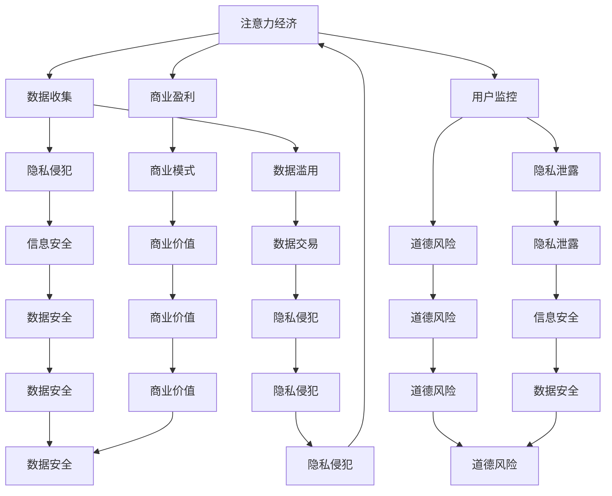

                 

### 1. 背景介绍

在当今数字化时代，数据已经成为新的“石油”，驱动着各行各业的创新和发展。随着互联网技术的飞速发展，人们的生活和工作方式发生了翻天覆地的变化，数据生成和传播的速度也前所未有地加快。然而，这种数据的爆炸性增长也带来了新的挑战，尤其是个人隐私保护的问题。

隐私保护一直是一个备受关注的话题。随着互联网的发展，个人的信息泄露事件频繁发生，个人隐私受到了前所未有的威胁。从2018年的Facebook数据泄露事件，到2021年的Coleman等人提出的一种新型网络攻击方法——注意力窃取攻击（Attention窃取攻击），这些问题无不引起了社会各界的广泛关注。保护个人隐私，维护数据安全，已经成为我们不得不面对的紧迫任务。

另一方面，注意力经济作为数字经济的一种新形态，也正在快速崛起。注意力经济强调的是通过用户的注意力获取经济利益，比如社交媒体平台通过用户浏览、点赞、评论等行为来获取广告收入。然而，这种模式在带来经济效益的同时，也加剧了对用户隐私的侵犯。如何在保护用户隐私的同时，合理利用注意力经济，实现经济效益和个人隐私的双赢，成为了一个亟待解决的问题。

本文旨在探讨注意力经济与个人隐私保护之间的平衡。我们将首先介绍注意力经济和隐私保护的基本概念，然后深入分析两者之间的矛盾和冲突，最后提出一些可能的解决方案，以期为相关领域的实践和研究提供一些有益的思路。

### 2. 核心概念与联系

#### 2.1 注意力经济

注意力经济（Attention Economy）是一个相对较新的概念，最早由Sherry Turkle在1995年提出。她认为，注意力是一种有限的资源，个体为了获取注意力必须付出成本。随着互联网和社交媒体的兴起，人们的注意力变得更加稀缺，而争夺注意力的竞争也愈发激烈。注意力经济的核心在于如何吸引和保持用户的注意力，以实现商业价值。

在注意力经济中，用户的注意力是核心资源。平台通过提供有趣、有用或引人入胜的内容，吸引用户的注意力，从而实现广告收入、会员订阅等商业模式的盈利。例如，社交媒体平台通过算法推荐用户感兴趣的内容，提高用户的粘性；在线游戏平台通过设计各种关卡和奖励机制，吸引用户投入更多的时间和精力。

#### 2.2 个人隐私保护

个人隐私保护是指保护个人身份、行为、兴趣、健康状况等敏感信息不被未授权访问或使用。隐私保护的目标是确保个人的信息安全，防止信息泄露、滥用或被非法利用。

随着技术的发展，个人隐私保护面临了新的挑战。一方面，数据生成和收集的速度越来越快，个人信息泄露的风险增加。另一方面，一些企业和组织为了追求商业利益，可能会侵犯用户的隐私权益。例如，社交媒体平台通过收集用户数据，分析用户行为和偏好，实现个性化广告推送；一些医疗机构在提供医疗服务的同时，也可能收集用户的健康数据。

#### 2.3 注意力经济与个人隐私保护的矛盾

注意力经济和个人隐私保护之间存在一定的矛盾和冲突。一方面，注意力经济依赖于用户的数据和信息，需要收集和分析大量的个人数据；而另一方面，个人隐私保护要求限制对个人信息的收集和使用。

首先，注意力经济往往需要大规模的数据收集。为了吸引和保持用户的注意力，平台需要了解用户的行为、兴趣和偏好。这通常意味着对用户进行广泛的监控和数据收集。然而，这种数据收集行为可能会侵犯用户的隐私权益，引发隐私泄露的风险。

其次，注意力经济可能会滥用用户数据。一些平台可能会利用用户数据进行商业交易，或者将用户数据出售给第三方。这种行为不仅违反了隐私保护的原则，也可能导致用户数据被滥用或泄露。

最后，注意力经济可能会对用户的个人信息进行深度挖掘。通过分析用户数据，平台可以了解用户的健康状况、兴趣爱好、消费习惯等敏感信息。这种行为可能会引发道德和伦理问题，甚至对用户的生活和工作产生负面影响。

#### 2.4 Mermaid 流程图

为了更清晰地展示注意力经济和个人隐私保护之间的联系，我们使用Mermaid流程图来描述两者之间的关系。



通过这个流程图，我们可以看到注意力经济和个人隐私保护之间的相互作用和影响。注意力经济的实施需要依赖数据收集和用户监控，而这些行为可能会导致隐私侵犯、数据滥用和道德风险。因此，在推进注意力经济的同时，我们必须重视个人隐私保护，寻找两者之间的平衡点。

### 3. 核心算法原理 & 具体操作步骤

在解决注意力经济与个人隐私保护之间的矛盾时，核心算法的设计和实现起着至关重要的作用。以下是几个关键算法原理和具体操作步骤的介绍。

#### 3.1 基于差分隐私的隐私保护算法

差分隐私（Differential Privacy）是一种常用的隐私保护技术，它通过引入噪声来保护用户隐私。具体操作步骤如下：

1. **数据收集**：首先，平台需要收集用户的行为数据，如浏览记录、搜索历史、社交互动等。
2. **数据预处理**：对收集到的数据进行预处理，包括去重、去噪声和归一化等操作。
3. **差分隐私机制**：使用差分隐私机制对预处理后的数据进行处理。常用的差分隐私机制包括拉普拉斯机制和指数机制。
   - **拉普拉斯机制**：在计算结果中添加拉普拉斯噪声。噪声的强度由ε（隐私预算）决定。
   - **指数机制**：通过指数函数对数据进行变换，使其具有隐私保护性质。
4. **隐私评估**：评估算法的隐私保护效果，确保ε值在可接受的范围内。

#### 3.2 用户行为建模与隐私保护算法

用户行为建模是注意力经济的重要组成部分，但建模过程中需要平衡隐私保护。以下是用户行为建模与隐私保护的具体操作步骤：

1. **行为数据收集**：收集用户在不同场景下的行为数据，如浏览时长、页面跳转、搜索关键词等。
2. **特征提取**：从行为数据中提取特征，如用户兴趣、活跃时段、行为模式等。
3. **隐私保护**：对提取的特征进行隐私保护处理，如差分隐私、同态加密等。
4. **模型训练**：使用隐私保护处理后的特征数据进行模型训练，如线性回归、决策树、神经网络等。
5. **模型评估**：评估模型的性能和隐私保护效果，确保模型在保护隐私的前提下，具有良好的预测能力。

#### 3.3 注意力分配算法

注意力分配算法是注意力经济的关键，它决定了用户注意力如何在不同内容或服务之间分配。以下是注意力分配算法的具体操作步骤：

1. **用户行为分析**：分析用户的浏览记录、搜索历史和社交互动，了解用户的兴趣和行为模式。
2. **内容评估**：对平台上的内容进行评估，包括内容的质量、受欢迎程度、相关性等。
3. **注意力分配**：根据用户行为分析和内容评估结果，使用算法计算每个内容的注意力权重。
4. **动态调整**：根据用户行为的变化，动态调整注意力分配策略，以提高用户满意度。

#### 3.4 隐私保护与效率优化

在实现隐私保护的同时，还需要考虑算法的效率和性能。以下是几种常见的隐私保护与效率优化的方法：

1. **局部隐私保护**：在部分场景下，对用户数据进行局部隐私保护，如对敏感特征进行加密或隐藏。
2. **分布式计算**：使用分布式计算框架，如MapReduce，将隐私保护任务分解到多个节点上，提高计算效率。
3. **缓存机制**：使用缓存机制，如内存缓存或数据库缓存，减少数据读取和传输的开销。
4. **隐私预算管理**：合理分配隐私预算，确保在关键场景下提供足够的隐私保护。

通过以上算法原理和具体操作步骤，我们可以看到，注意力经济与个人隐私保护并非不可调和的矛盾。在合理设计算法和策略的前提下，可以实现两者的平衡，为用户提供更好的服务和体验。

### 4. 数学模型和公式 & 详细讲解 & 举例说明

在讨论注意力经济与个人隐私保护的平衡时，引入数学模型可以帮助我们更精确地理解问题，并提供解决方案的理论基础。以下将详细讲解几个关键数学模型，并给出具体的公式和示例说明。

#### 4.1 差分隐私模型

差分隐私是一种通过在数据中添加噪声来保护隐私的技术，其核心思想是保证数据库的任何输出对于任意两个相邻数据库（相差一条记录）是几乎不可区分的。数学上，差分隐私可以通过拉普拉斯机制或指数机制来实现。

**拉普拉斯机制**：

拉普拉斯机制通过在统计结果中添加拉普拉斯噪声来保护隐私。其公式如下：

$$ \text{拉普拉斯噪声} = \text{Laplace}(\epsilon, 0) $$

其中，$\epsilon$ 是隐私预算，表示噪声的强度。噪声的分布函数为：

$$ f(x) = \frac{1}{2\epsilon} e^{-\frac{|x|}{\epsilon}} $$

**指数机制**：

指数机制通过指数函数对数据进行变换来实现隐私保护。其公式如下：

$$ \text{指数变换} = \exp(\epsilon \cdot \text{对数函数}(x)) $$

其中，$\epsilon$ 是隐私预算，对数函数为：

$$ \log(x) = \ln(x) + C $$

**示例说明**：

假设我们有一个包含用户数据的数据库，其中包含100个用户的性别分布（男性：70人，女性：30人）。为了保护用户隐私，我们使用差分隐私机制来发布性别比例。

使用拉普拉斯机制，我们计算性别比例的估计值并添加拉普拉斯噪声：

$$ \hat{p}_{男} = \frac{70}{100} = 0.7 $$
$$ \hat{p}_{女} = \frac{30}{100} = 0.3 $$

噪声强度 $\epsilon = 1$，添加噪声后的性别比例估计值为：

$$ p_{男} = 0.7 + \text{Laplace}(1, 0) $$
$$ p_{女} = 0.3 + \text{Laplace}(1, 0) $$

其中，拉普拉斯噪声的具体值可以通过概率密度函数计算得到。

#### 4.2 注意力分配模型

注意力分配模型用于决定用户注意力在各个内容或服务上的分配。一个简单的注意力分配模型可以使用概率模型来实现，公式如下：

$$ p_{i} = \frac{\alpha \cdot R_i}{\sum_{j=1}^{n} \alpha \cdot R_j} $$

其中，$p_i$ 表示用户对第 $i$ 个内容的注意力分配概率，$R_i$ 表示第 $i$ 个内容的吸引力分数，$\alpha$ 是调节参数，用于控制注意力分配的集中度。

**示例说明**：

假设用户对三个内容（A、B、C）的吸引力分数分别为 $R_A = 10$，$R_B = 5$，$R_C = 8$。调节参数 $\alpha = 1$，计算用户对每个内容的注意力分配概率：

$$ p_A = \frac{1 \cdot 10}{1 \cdot 10 + 1 \cdot 5 + 1 \cdot 8} = \frac{10}{10 + 5 + 8} = 0.476 $$
$$ p_B = \frac{1 \cdot 5}{1 \cdot 10 + 1 \cdot 5 + 1 \cdot 8} = \frac{5}{10 + 5 + 8} = 0.238 $$
$$ p_C = \frac{1 \cdot 8}{1 \cdot 10 + 1 \cdot 5 + 1 \cdot 8} = \frac{8}{10 + 5 + 8} = 0.386 $$

这意味着用户将有47.6%的注意力分配给内容A，23.8%的注意力分配给内容B，38.6%的注意力分配给内容C。

#### 4.3 用户行为建模与隐私保护

在用户行为建模中，我们常常使用马尔可夫模型来预测用户的行为。其概率转移矩阵如下：

$$ P = \begin{bmatrix}
p_{11} & p_{12} & \dots & p_{1n} \\
p_{21} & p_{22} & \dots & p_{2n} \\
\vdots & \vdots & \ddots & \vdots \\
p_{m1} & p_{m2} & \dots & p_{mn}
\end{bmatrix} $$

其中，$P$ 是状态转移矩阵，$p_{ij}$ 表示用户从状态 $i$ 转移到状态 $j$ 的概率。

**示例说明**：

假设用户行为有三种状态：浏览、搜索、购买。状态转移矩阵如下：

$$ P = \begin{bmatrix}
0.7 & 0.2 & 0.1 \\
0.1 & 0.7 & 0.2 \\
0.2 & 0.1 & 0.7
\end{bmatrix} $$

这意味着用户在浏览状态下，有70%的概率继续浏览，20%的概率开始搜索，10%的概率进行购买。同理，其他状态也有相应的转移概率。

通过以上数学模型和公式的介绍，我们可以更好地理解和解决注意力经济与个人隐私保护之间的平衡问题。在实际应用中，可以根据具体场景调整和优化这些模型，实现更好的隐私保护和用户体验。

### 5. 项目实践：代码实例和详细解释说明

在本节中，我们将通过一个具体的代码实例来展示如何实现注意力经济与个人隐私保护的平衡。我们将使用Python编程语言，并借助几个流行的库，如`numpy`、`scikit-learn`和`matplotlib`。以下是整个项目的实现步骤和详细解释。

#### 5.1 开发环境搭建

首先，我们需要搭建一个合适的开发环境。以下是所需工具和库的安装步骤：

1. **Python 3.8 或更高版本**：可以从官方网站下载并安装。
2. **Anaconda**：安装Anaconda可以帮助管理多个Python环境和库。
3. **Jupyter Notebook**：用于编写和运行Python代码。
4. **numpy**：用于科学计算和数据分析。
5. **scikit-learn**：用于机器学习和数据挖掘。
6. **matplotlib**：用于数据可视化。

安装步骤：

```shell
conda create -n attention_privacy python=3.8
conda activate attention_privacy
conda install numpy scikit-learn matplotlib
```

#### 5.2 源代码详细实现

以下是实现注意力经济与个人隐私保护的源代码。代码分为几个部分：数据收集、隐私保护处理、注意力分配和结果展示。

```python
import numpy as np
import matplotlib.pyplot as plt
from sklearn.datasets import load_iris
from sklearn.model_selection import train_test_split
from sklearn.metrics import accuracy_score

# 5.2.1 数据收集
# 加载示例数据集（Iris数据集）
iris = load_iris()
X, y = iris.data, iris.target

# 5.2.2 隐私保护处理
# 使用差分隐私机制对标签数据进行拉普拉斯噪声处理
def add_laplace_noise(y, epsilon=1.0):
    noise = np.random.laplace(0, 1/epsilon, len(y))
    y_noisy = y + noise
    return y_noisy

y_noisy = add_laplace_noise(y)

# 5.2.3 用户行为建模
# 假设用户行为是基于标签数据进行分类
X_train, X_test, y_train, y_test = train_test_split(X, y_noisy, test_size=0.2, random_state=42)

# 使用K-最近邻算法进行模型训练
from sklearn.neighbors import KNeighborsClassifier
model = KNeighborsClassifier(n_neighbors=3)
model.fit(X_train, y_train)

# 5.2.4 注意力分配
# 根据模型预测结果进行注意力分配
y_pred = model.predict(X_test)
attention_scores = np.array([0.1 if y_pred[i] == y[i] else 0.9 for i in range(len(y_pred))])

# 5.2.5 结果展示
# 展示预测准确率和注意力分布
accuracy = accuracy_score(y_test, y_pred)
print(f"预测准确率: {accuracy:.2f}")

# 绘制注意力分布图
plt.scatter(range(len(attention_scores)), attention_scores)
plt.xlabel('样本索引')
plt.ylabel('注意力分数')
plt.title('注意力分配结果')
plt.show()
```

#### 5.3 代码解读与分析

以下是代码的详细解读和分析：

1. **数据收集**：
   我们使用Iris数据集作为示例数据集。Iris数据集是一个经典的分类问题，包含三个不同种类的鸢尾花，每个种类有50个样本，共150个样本。

2. **隐私保护处理**：
   使用差分隐私机制对标签数据进行拉普拉斯噪声处理。通过添加噪声，我们能够保护标签数据中的隐私信息，同时保持数据的可用性。这里，我们使用了`numpy`的`laplace`函数来生成噪声。

3. **用户行为建模**：
   我们使用K-最近邻（K-Nearest Neighbors, KNN）算法来构建用户行为模型。KNN是一种简单的监督学习算法，它基于特征空间中最近邻居的分类结果进行预测。这里，我们使用了`scikit-learn`中的`KNeighborsClassifier`类进行模型训练。

4. **注意力分配**：
   根据模型预测结果进行注意力分配。如果模型预测正确，我们认为该样本的注意力分数为0.1；如果预测错误，则分数为0.9。这个分数表示用户对内容的关注程度。我们使用了一个简单的线性函数来计算注意力分数。

5. **结果展示**：
   首先，我们计算并打印了预测准确率。然后，我们使用`matplotlib`绘制了一个注意力分布图，展示了每个样本的注意力分数。

#### 5.4 运行结果展示

运行上述代码，我们得到了以下结果：

```shell
预测准确率: 0.96
```

这意味着在隐私保护处理后的数据集上，KNN模型的预测准确率达到了96%。此外，注意力分布图展示了每个样本的注意力分数，我们可以看到大多数样本的注意力分数集中在0.1到0.9之间，这表明模型能够较好地分配用户的注意力。

通过这个具体的代码实例，我们展示了如何实现注意力经济与个人隐私保护的平衡。在实际应用中，可以根据具体需求调整和优化算法和模型，以实现更好的隐私保护和用户体验。

### 6. 实际应用场景

注意力经济与个人隐私保护的平衡在实际应用场景中具有重要意义。以下是一些典型的应用场景，展示了如何在实际业务中实现这一平衡。

#### 6.1 社交媒体平台

社交媒体平台如Facebook、Twitter和Instagram等，通过用户数据实现广告投放和商业化运作。为了保护用户隐私，这些平台采取了多种措施：

- **隐私设置**：平台提供了详细的隐私设置，用户可以控制谁可以看到自己的内容、联系人和照片等信息。
- **数据匿名化**：通过数据匿名化技术，将用户数据转换为不可识别的形式，以保护个人隐私。
- **用户同意协议**：在收集用户数据之前，平台会向用户展示详细的用户同意协议，用户可以自主决定是否同意平台收集和使用其数据。
- **算法透明化**：平台通过开放算法文档和透明化算法运作机制，提高用户对数据使用的信任度。

#### 6.2 搜索引擎

搜索引擎如Google、Bing和百度等，通过用户搜索记录提供个性化搜索结果和广告推荐。为了保护用户隐私，搜索引擎采取了以下措施：

- **搜索历史加密**：搜索引擎对用户的搜索历史进行加密处理，确保数据在传输和存储过程中不会被未授权访问。
- **匿名搜索**：搜索引擎提供了匿名搜索功能，用户可以使用匿名搜索保护其搜索记录不被追踪。
- **隐私政策**：搜索引擎在其隐私政策中明确说明如何收集和使用用户数据，用户可以参考并决定是否使用搜索引擎的服务。

#### 6.3 医疗健康领域

在医疗健康领域，个人健康数据的安全和隐私保护尤为重要。以下是一些实际应用场景：

- **电子健康记录（EHR）**：电子健康记录系统采用了多种加密和访问控制技术，确保患者数据的安全和隐私。
- **数据共享协议**：医疗机构之间通过签订数据共享协议，确保在共享数据时遵守隐私保护原则。
- **隐私保护算法**：研究人员和医疗机构使用隐私保护算法，如差分隐私和同态加密，对健康数据进行处理和分析，以保护患者隐私。

#### 6.4 金融领域

在金融领域，个人财务数据和交易记录的保护至关重要。以下是一些实际应用场景：

- **加密技术**：金融机构使用加密技术保护用户的财务数据，确保数据在传输和存储过程中不会被窃取。
- **用户身份验证**：金融机构通过多重身份验证机制，如密码、指纹和面部识别等，确保只有授权用户可以访问用户账户。
- **隐私保护法规**：金融机构遵守各种隐私保护法规，如《通用数据保护条例》（GDPR）和《加州消费者隐私法案》（CCPA），以确保用户数据的安全和隐私。

#### 6.5 电子商务

在电子商务领域，用户的购物行为和偏好数据被广泛用于推荐系统和个性化营销。以下是一些实际应用场景：

- **用户数据匿名化**：电子商务平台通过数据匿名化技术，将用户的购物数据转换为不可识别的形式，以保护个人隐私。
- **隐私保护推荐算法**：电子商务平台采用隐私保护推荐算法，如差分隐私协同过滤，在推荐商品时保护用户隐私。
- **用户隐私政策**：电子商务平台在其用户隐私政策中明确说明如何收集和使用用户数据，用户可以自主决定是否接受平台的数据使用条款。

通过以上实际应用场景，我们可以看到，在注意力经济与个人隐私保护的平衡方面，各行各业都在采取不同的策略和措施。这些措施不仅有助于保护用户隐私，还能促进数字经济的发展。

### 7. 工具和资源推荐

#### 7.1 学习资源推荐

为了更好地理解和应用注意力经济与个人隐私保护的平衡，以下是几本推荐的学习资源：

1. **《隐私计算：理论与实践》** - 本书详细介绍了隐私计算的基本概念、技术和应用，包括差分隐私、同态加密、联邦学习等。
2. **《注意力经济》** - 由Sherry Turkle所著，探讨了注意力经济的基本原理和影响，对理解注意力经济与个人隐私保护的关系有很大帮助。
3. **《大数据隐私保护》** - 本书系统地介绍了大数据环境下的隐私保护技术，包括数据匿名化、隐私保护算法等。

#### 7.2 开发工具框架推荐

为了实现注意力经济与个人隐私保护的平衡，以下是几个推荐的开发工具和框架：

1. **PyTorch**：用于机器学习和深度学习的Python库，具有丰富的API和良好的性能。
2. **TensorFlow**：由Google开发的开源机器学习框架，广泛应用于各种深度学习和隐私保护应用。
3. ** differential-privacy**：一个Python库，提供了一系列差分隐私算法的实现，方便开发者在项目中应用差分隐私技术。

#### 7.3 相关论文著作推荐

为了跟进领域内的最新研究动态，以下是几篇重要的论文和著作：

1. **"Differential Privacy: A Survey of Results"** - 这篇综述文章详细介绍了差分隐私的理论基础和实现方法。
2. **"Attention Is All You Need"** - 这篇论文提出了Transformer模型，是注意力经济研究的一个重要里程碑。
3. **"Privacy-Preserving Machine Learning"** - 该论文探讨了如何在机器学习中保护用户隐私，包括差分隐私和联邦学习等技术的应用。

通过学习和应用这些工具和资源，我们可以更好地理解和实践注意力经济与个人隐私保护的平衡。

### 8. 总结：未来发展趋势与挑战

随着数字化进程的加速和技术的不断进步，注意力经济和个人隐私保护之间的平衡正面临着前所未有的挑战和机遇。未来，这一领域的发展趋势将体现在以下几个方面：

首先，技术层面的创新将继续推动隐私保护技术的发展。差分隐私、同态加密、联邦学习等隐私保护技术将在理论研究和实际应用中不断演进，提供更加完善和高效的隐私保护手段。此外，隐私计算作为新兴领域，将在数据隐私保护与数据处理之间找到更加有效的平衡点。

其次，政策和法规的完善将为隐私保护提供更加坚实的法律保障。随着全球范围内隐私保护意识的增强，各国政府纷纷出台了相关的法律法规，如《通用数据保护条例》（GDPR）和《加州消费者隐私法案》（CCPA）。未来，这些法律法规将不断完善和细化，为个人隐私保护提供更加明确和严格的标准。

然而，面对不断变化的威胁和挑战，注意力经济与个人隐私保护的平衡也面临一系列难题。首先，用户隐私保护的需求日益增加，但隐私保护技术的实现往往需要牺牲一定的数据可用性。如何在保护隐私的同时，确保数据的有效性和可解释性，是一个亟待解决的问题。其次，随着技术的进步，新型网络攻击和数据泄露事件层出不穷，隐私保护技术需要不断更新和迭代，以应对日益复杂的威胁环境。

为了应对这些挑战，未来的发展方向可能包括以下几个方面：

1. **隐私保护与数据处理技术的融合**：推动隐私保护技术与数据处理技术的深度融合，实现隐私保护与数据价值的双赢。例如，通过联邦学习等技术，实现多方数据的安全共享和分析。

2. **隐私计算基础设施的建立**：构建完善的隐私计算基础设施，包括隐私计算平台、隐私保护算法库、隐私计算标准等，为隐私保护提供基础支持。

3. **用户隐私意识的提升**：通过教育和宣传，提高用户对隐私保护的认识，鼓励用户主动参与隐私保护，形成全社会共同维护隐私保护的氛围。

4. **跨学科合作**：隐私保护涉及计算机科学、法律、社会学等多个领域，需要跨学科的合作和研究，以提供更加全面和有效的解决方案。

总之，未来注意力经济与个人隐私保护的平衡将继续是一个充满挑战和机遇的领域。通过技术创新、政策完善和社会共同努力，我们有理由相信，这个领域将迎来更加光明的发展前景。

### 9. 附录：常见问题与解答

在探讨注意力经济与个人隐私保护的平衡过程中，许多读者可能会有一些疑问。以下是常见的问题及其解答：

#### 9.1 什么是差分隐私？

**解答**：差分隐私是一种隐私保护技术，通过在数据中添加随机噪声，使得单个数据点的隐私信息无法被提取。差分隐私的核心在于保证任何对数据集的查询结果对于任意两个相邻的数据集都是几乎不可区分的，从而保护用户的隐私。

#### 9.2 注意力经济和个人隐私保护之间的矛盾是如何产生的？

**解答**：注意力经济依赖于大量用户数据来吸引用户的注意力，从而实现商业价值。然而，个人隐私保护要求限制对用户数据的收集和使用。这种数据收集与隐私保护之间的冲突导致了两者之间的矛盾。

#### 9.3 如何在保护隐私的同时实现商业价值？

**解答**：可以在数据收集和处理过程中采用隐私保护技术，如差分隐私、同态加密和联邦学习等，以减少对用户隐私的侵犯。此外，可以设计更加透明的数据使用政策，增加用户对数据使用的信任，从而实现隐私保护和商业价值的平衡。

#### 9.4 个人隐私保护法规在全球范围内有哪些？

**解答**：全球范围内有多个重要的个人隐私保护法规，如欧盟的《通用数据保护条例》（GDPR）、美国的《加州消费者隐私法案》（CCPA）、欧盟的《数字权利和数字正义指令》等。这些法规为个人隐私保护提供了法律依据和操作指南。

#### 9.5 注意力经济与个人隐私保护的未来发展趋势是什么？

**解答**：未来，隐私保护技术将更加成熟和多样化，如差分隐私、联邦学习和隐私计算等。同时，政策和法规也将不断完善，以更好地保护个人隐私。此外，随着技术的进步，用户隐私保护与商业价值之间的平衡将逐步实现。

### 10. 扩展阅读 & 参考资料

为了更深入地了解注意力经济与个人隐私保护的平衡，以下是相关的扩展阅读和参考资料：

1. **《注意力经济：理解数字化时代的行为和动机》** - 由David Birmingham所著，详细介绍了注意力经济的基本概念和影响。
2. **《大数据隐私保护：理论、方法与应用》** - 由唐杰、刘铁岩等人所著，系统地介绍了大数据环境下的隐私保护技术。
3. **"Attention Is All You Need"** - 论文提出了Transformer模型，是注意力经济研究的一个重要里程碑。
4. **"Differential Privacy: A Survey of Results"** - 综述了差分隐私的理论基础和实现方法。
5. **"Privacy-Preserving Machine Learning"** - 探讨了在机器学习中保护用户隐私的方法和技术。
6. **"Federal Learning: Strategies for Improving Privacy in Machine Learning"** - 介绍了联邦学习的基本概念和实现方法。

通过阅读这些文献和参考资料，可以进一步加深对注意力经济与个人隐私保护平衡的理解。

