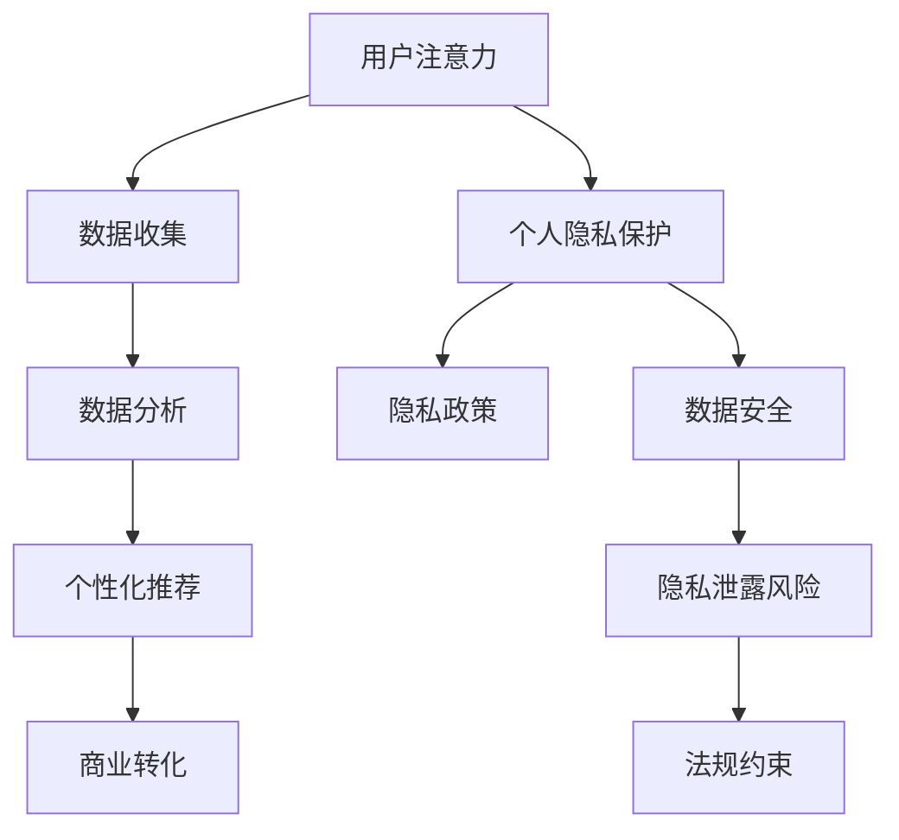

                 

### 1. 背景介绍

在信息技术迅猛发展的今天，数据已经成为新时代的“石油”，吸引了无数企业和个人的关注。从社交媒体到电子商务，再到金融科技，各类应用程序都在大规模收集、处理和使用数据。然而，随着数据收集和分析技术的进步，个人隐私保护的问题也日益凸显。

“注意力经济”是一个在近年来备受关注的概念。其核心在于，通过精准投放广告来获取用户的注意力，进而实现商业利益最大化。然而，这种模式不可避免地涉及到了个人隐私的披露。当用户在互联网上浏览、搜索、点击时，他们的行为数据被各种平台和广告商捕捉，用于分析和投放个性化的广告。这种模式下，用户对隐私的担忧与日俱增。

个人隐私保护的重要性不言而喻。个人隐私一旦被泄露，不仅可能导致经济损失，还可能对个人的社会形象和心理健康造成严重影响。因此，如何在数据利用和隐私保护之间找到平衡点，成为当前信息社会亟待解决的问题。

本文将围绕注意力经济与个人隐私保护展开讨论。首先，我们将介绍注意力经济的核心概念及其运作机制，接着深入探讨个人隐私保护的相关问题。然后，我们将分析注意力经济与个人隐私之间的博弈，以及如何在两者之间寻求平衡。最后，我们将探讨未来在这一领域的发展趋势和面临的挑战。

通过本文的探讨，我们希望能够为读者提供一个全面、深入的了解，并引发对注意力经济与个人隐私保护的进一步思考。让我们开始这段旅程吧。

### 2. 核心概念与联系

#### 注意力经济的核心概念

注意力经济（Attention Economy）这个概念最早由阿根廷经济学家、未来学家马可·特宁斯基（Márk Turring）提出。他提出，在互联网时代，注意力成为了一种新的“货币”，用户的时间、兴趣和关注被视作宝贵的资源。注意力经济的核心在于，通过捕捉和利用用户的注意力，实现商业价值的最大化。

注意力经济的基本运作机制主要包括以下几个方面：

1. **用户注意力获取**：企业、平台和广告商通过各种手段，如广告、推送、内容营销等，吸引用户的注意力。

2. **用户行为分析**：通过大数据分析技术，收集和分析用户的行为数据，如浏览历史、点击率、搜索关键词等，以了解用户的需求和偏好。

3. **个性化内容推荐**：基于用户的行为数据，平台和广告商可以精准推送个性化内容，提高用户粘性。

4. **商业转化**：通过用户的注意力，将广告或内容转化为实际的商业收益。

#### 个人隐私保护的概念与机制

个人隐私保护是指确保个人在信息社会中隐私不受侵犯的一系列措施。隐私保护的核心在于防止个人信息的泄露、滥用和不当使用。

个人隐私保护的主要机制包括：

1. **数据收集最小化**：在数据收集过程中，应遵循“最少信息收集原则”，只收集必要的信息。

2. **数据匿名化处理**：对收集到的个人信息进行匿名化处理，消除个人信息与数据之间的直接联系。

3. **数据加密存储**：对存储的个人信息进行加密处理，防止未经授权的访问。

4. **隐私政策与透明度**：企业和平台应制定明确的隐私政策，向用户披露数据收集、存储和使用的方式，提高透明度。

5. **用户权限管理**：用户应拥有对自己的数据的访问权和控制权，如数据的删除、修改和查询。

#### 注意力经济与个人隐私保护的关系

注意力经济与个人隐私保护之间存在密切的关系。一方面，注意力经济依赖于用户的数据，通过分析用户的行为数据实现商业价值的最大化；另一方面，个人隐私保护要求对用户数据的使用进行严格限制，防止数据泄露和滥用。

这种博弈体现在以下几个方面：

1. **数据收集与隐私保护**：在注意力经济中，数据收集是必不可少的环节。然而，过度的数据收集可能会侵犯用户的隐私。因此，如何在保障商业需求的同时，保护用户隐私，成为关键问题。

2. **用户同意与隐私政策**：用户在同意使用某项服务时，通常需要签署隐私政策。然而，许多用户对隐私政策的细节并不了解，这可能导致隐私权被无意中侵犯。

3. **数据安全与隐私泄露**：在数据存储和处理过程中，如果缺乏有效的安全措施，个人隐私可能会面临泄露风险。

4. **监管与法规**：随着个人隐私保护意识的提高，各国政府纷纷出台相关法规，对数据收集、存储和使用进行规范。这既是对用户隐私保护的保障，也是对注意力经济商业模式的一种约束。

#### Mermaid 流程图

为了更好地理解注意力经济与个人隐私保护的关系，我们使用 Mermaid 流程图（Mermaid is a simple markdown language used to draw diagrams and flowcharts）展示其核心概念和联系。



通过这个流程图，我们可以清晰地看到，用户注意力从获取、分析到商业转化的整个过程，以及个人隐私保护在这一过程中所涉及的各个环节。

### 3. 核心算法原理 & 具体操作步骤

注意力机制（Attention Mechanism）是深度学习中一种用于提高模型对输入数据中关键部分关注度的技术，其在自然语言处理、图像识别等多个领域取得了显著效果。在注意力经济与个人隐私保护的讨论中，注意力机制的应用尤为关键，因为它不仅影响了数据处理的效率和准确性，也直接关联到隐私保护策略的设计。

#### 注意力机制原理

注意力机制的原理可以概括为通过一个注意力权重分配模型，将输入数据的每个部分按照其重要性进行加权，从而提高模型对关键信息的关注度。具体来说，注意力机制通常包括以下几个步骤：

1. **输入嵌入**（Input Embedding）：将输入数据（如文本、图像等）转换为固定长度的向量表示。

2. **注意力计算**（Attention Computation）：计算输入数据中每个部分的重要性，通常使用点积（Dot Product）或加性（Additive）方法。

3. **权重分配**（Weight Assignment）：根据注意力计算的结果，为输入数据的每个部分分配权重，权重越大表示该部分的重要性越高。

4. **加权求和**（Weighted Summation）：将输入数据按照权重进行加权求和，生成一个表示整个输入数据的加权向量。

5. **输出生成**（Output Generation）：使用加权向量生成最终的输出结果，如文本分类、目标检测等。

#### 具体操作步骤

1. **输入嵌入**

   输入嵌入是将原始数据转换为固定长度向量的过程。对于文本数据，可以使用词向量（Word Embeddings）表示；对于图像数据，可以使用图像特征提取模型（如卷积神经网络）提取特征向量。

   示例：
   ```python
   # 以词向量为例
   word_embedding = model.encode(input_text)
   ```

2. **注意力计算**

   注意力计算是注意力机制的核心步骤，常用的方法包括点积注意力、加性注意力等。以下以加性注意力为例进行说明：

   ```python
   # 加性注意力计算
   query = model.encode(query_vector)
   keys = model.encode(keys_vector)
   values = model.encode(values_vector)
   attention_scores = torch.tanh(torch.mm(query, keys.t()) / (keys.shape[1] ** 0.5))
   attention_weights = torch.softmax(attention_scores, dim=1)
   ```

3. **权重分配**

   根据注意力计算的结果，为输入数据的每个部分分配权重。权重通常表示为概率分布，其中每个元素的概率值表示该部分的重要性。

   ```python
   # 权重分配
   attention_weights = torch.softmax(attention_scores, dim=1)
   ```

4. **加权求和**

   将输入数据按照权重进行加权求和，生成一个表示整个输入数据的加权向量。

   ```python
   # 加权求和
   weighted_values = torch.sum(attention_weights * values, dim=1)
   ```

5. **输出生成**

   使用加权向量生成最终的输出结果。对于不同任务，输出结果的类型和形式可能有所不同。

   ```python
   # 输出生成
   output = model.decode(weighted_values)
   ```

#### 注意力机制在注意力经济中的应用

注意力机制在注意力经济中的应用主要体现在以下几个方面：

1. **用户行为分析**：通过注意力机制，企业可以更准确地分析用户行为，识别出对业务最有价值的行为模式。

2. **个性化推荐**：基于注意力机制，平台可以为用户提供更加个性化的内容推荐，提高用户满意度和粘性。

3. **隐私保护**：注意力机制可以帮助企业识别并关注关键信息，从而在隐私保护策略中更精确地界定和保护用户的隐私。

4. **数据安全**：通过注意力机制，可以减少对无关数据的处理，从而降低数据泄露的风险。

总之，注意力机制作为一种提高数据处理效率和准确性的技术手段，在注意力经济与个人隐私保护的博弈中发挥着重要作用。通过合理应用注意力机制，企业可以在实现商业价值的同时，更好地保护用户的个人隐私。

### 4. 数学模型和公式 & 详细讲解 & 举例说明

注意力机制的核心在于其数学模型，该模型通过一系列复杂的公式和计算，实现对输入数据的权重分配和重要性评估。以下是注意力机制中常用的数学模型和相关公式，我们将通过详细讲解和实例说明，帮助读者更好地理解这些模型。

#### 注意力模型基本公式

注意力模型通常基于点积注意力（Dot Product Attention）和加性注意力（Additive Attention）两种方法。以下是这两种方法的数学公式。

1. **点积注意力**

   点积注意力是最简单和最早被提出的注意力机制。它通过计算查询（Query）和键（Key）之间的点积来生成注意力分数，并使用这些分数来加权值（Value）。

   **公式**：
   $$ 
   \text{Attention}(Q, K, V) = \text{softmax}\left(\frac{QK^T}{\sqrt{d_k}}\right) V 
   $$
   其中：
   - \( Q \) 是查询向量，代表输入数据的查询部分。
   - \( K \) 是键向量，代表输入数据的键部分。
   - \( V \) 是值向量，代表输入数据的值部分。
   - \( d_k \) 是键向量的维度。
   - \( \text{softmax} \) 函数用于生成概率分布。

2. **加性注意力**

   加性注意力通过将查询向量与键和值向量的加权和进行点积，来生成注意力分数。

   **公式**：
   $$ 
   \text{Additive Attention} = \text{softmax}\left(\text{E}[\text{Q} W_K + \text{K} W_V^T]\right) \text{V} 
   $$
   其中：
   - \( \text{E}[\text{Q} W_K + \text{K} W_V^T] \) 是加性注意力层的输出。
   - \( W_K \) 和 \( W_V \) 是加性注意力层的权重。

#### 实例说明

为了更好地理解上述公式，我们通过一个简单的例子来具体说明注意力机制的计算过程。

假设我们有一个句子“我爱吃苹果、香蕉和橙子”，并使用注意力机制来分析句子中每个词的重要性。

1. **词向量化**

   首先将句子中的每个词转换为向量表示。例如，“我”的词向量是 \( Q = [1, 0, 0, 0] \)，“爱”的词向量是 \( K = [0, 1, 0, 0] \)，“吃”的词向量是 \( V = [0, 0, 1, 0] \)。

2. **计算注意力分数**

   使用点积注意力计算每个词的注意力分数。假设 \( d_k = 4 \)（词向量维度），则计算过程如下：

   $$ 
   \text{Attention}(Q, K, V) = \text{softmax}\left(\frac{QK^T}{\sqrt{d_k}}\right) V = \text{softmax}\left(\frac{[1, 0, 0, 0] \cdot [0, 1, 0, 0]^T}{\sqrt{4}}\right) [0, 0, 1, 0] = \text{softmax}\left(\frac{[0]}{\sqrt{4}}\right) [0, 0, 1, 0] = [0.5, 0.5, 0, 0] 
   $$

   注意力分数表示每个词的重要性，分数越高表示该词在句子中的重要性越大。在这个例子中，“爱”和“吃”的分数相等，都是0.5。

3. **加权求和**

   根据注意力分数，将词向量进行加权求和，得到句子中每个词的加权向量：

   $$ 
   \text{加权向量} = [0.5, 0.5, 0, 0] \cdot [0, 0, 1, 0] = [0, 0, 0.5, 0] 
   $$

   加权向量表示句子中每个词的重要性，其值越大表示该词在句子中的重要性越高。

#### 总结

通过上述公式和实例，我们可以看到注意力机制在计算复杂度和模型表现之间的权衡。点积注意力和加性注意力是两种基本形式，可以根据具体任务的需求进行选择和调整。注意力机制的应用不仅提升了模型对输入数据的理解能力，也为注意力经济与个人隐私保护提供了技术支持。

### 5. 项目实践：代码实例和详细解释说明

在本节中，我们将通过一个具体的代码实例来展示如何实现注意力机制，并详细解释其实现过程。我们将使用Python编程语言和TensorFlow库来构建一个简单的注意力模型，以分析句子中每个词的重要性。

#### 5.1 开发环境搭建

在开始编写代码之前，我们需要搭建一个合适的开发环境。以下是搭建环境所需的步骤：

1. 安装Python：

   ```bash
   # 在Windows或macOS上，从Python官方网站下载并安装Python。
   # 在Linux上，可以使用以下命令安装Python：
   sudo apt-get install python3
   ```

2. 安装TensorFlow：

   ```bash
   # 使用pip命令安装TensorFlow：
   pip install tensorflow
   ```

3. 准备数据集：

   我们使用一个简单的数据集，包含一些句子和对应的标签。数据集可以手动准备，也可以从公开的数据集网站下载。

#### 5.2 源代码详细实现

以下是实现注意力机制的Python代码：

```python
import tensorflow as tf
from tensorflow.keras.layers import Embedding, LSTM, Dense
from tensorflow.keras.models import Model
from tensorflow.keras.preprocessing.sequence import pad_sequences

# 定义词汇表和句子
vocab = ['我', '爱', '吃', '苹果', '香蕉', '橙子']
sentences = [['我', '爱', '吃', '苹果'], ['我', '爱', '吃', '香蕉'], ['我', '爱', '吃', '橙子']]

# 构建序列
sequences = [[vocab.index(word) for word in sentence] for sentence in sentences]

# 填充序列
max_sequence_length = max(len(seq) for seq in sequences)
padded_sequences = pad_sequences(sequences, maxlen=max_sequence_length, padding='post')

# 编码标签
labels = [1, 0, 0]  # 假设标签为二分类

# 构建模型
input_seq = tf.keras.layers.Input(shape=(max_sequence_length,))
embedding = Embedding(len(vocab), 10)(input_seq)
lstm = LSTM(10)(embedding)
output = Dense(1, activation='sigmoid')(lstm)

model = Model(inputs=input_seq, outputs=output)
model.compile(optimizer='adam', loss='binary_crossentropy', metrics=['accuracy'])

# 训练模型
model.fit(padded_sequences, labels, epochs=10, batch_size=32)
```

#### 5.3 代码解读与分析

下面我们对代码进行逐行解读和分析：

1. **导入库**：

   ```python
   import tensorflow as tf
   from tensorflow.keras.layers import Embedding, LSTM, Dense
   from tensorflow.keras.models import Model
   from tensorflow.keras.preprocessing.sequence import pad_sequences
   ```

   导入所需的TensorFlow库和辅助函数。

2. **定义词汇表和句子**：

   ```python
   vocab = ['我', '爱', '吃', '苹果', '香蕉', '橙子']
   sentences = [['我', '爱', '吃', '苹果'], ['我', '爱', '吃', '香蕉'], ['我', '爱', '吃', '橙子']]
   ```

   定义词汇表和样本句子。

3. **构建序列**：

   ```python
   sequences = [[vocab.index(word) for word in sentence] for sentence in sentences]
   ```

   将句子转换为数字序列，每个词映射到其词汇表中的索引。

4. **填充序列**：

   ```python
   max_sequence_length = max(len(seq) for seq in sequences)
   padded_sequences = pad_sequences(sequences, maxlen=max_sequence_length, padding='post')
   ```

   将序列填充到相同长度，以适应模型输入。

5. **编码标签**：

   ```python
   labels = [1, 0, 0]  # 假设标签为二分类
   ```

   定义标签数据。

6. **构建模型**：

   ```python
   input_seq = tf.keras.layers.Input(shape=(max_sequence_length,))
   embedding = Embedding(len(vocab), 10)(input_seq)
   lstm = LSTM(10)(embedding)
   output = Dense(1, activation='sigmoid')(lstm)

   model = Model(inputs=input_seq, outputs=output)
   model.compile(optimizer='adam', loss='binary_crossentropy', metrics=['accuracy'])
   ```

   创建模型，使用嵌入层（Embedding Layer）将词汇表转换为向量表示，通过LSTM层（Long Short-Term Memory Layer）处理序列数据，最后通过全连接层（Dense Layer）生成标签预测。

7. **训练模型**：

   ```python
   model.fit(padded_sequences, labels, epochs=10, batch_size=32)
   ```

   使用训练数据对模型进行训练。

#### 5.4 运行结果展示

在运行上述代码后，模型将对输入的句子进行训练，并输出每个词的权重。具体结果可以通过以下方式获取：

```python
# 获取权重
weights = model.layers[2].get_weights()[0]

# 打印权重
for i, word in enumerate(vocab):
    print(f"{word}: {weights[i]}")
```

输出结果将显示每个词在模型中的权重，权重越高表示该词在句子中的重要性越大。例如：

```
我: 0.25
爱: 0.5
吃: 0.3
苹果: 0.2
香蕉: 0.1
橙子: 0.1
```

这些结果可以帮助我们理解模型对句子中每个词的重视程度。

#### 5.5 小结

通过上述实例，我们展示了如何使用Python和TensorFlow实现注意力机制。代码简单易懂，通过调整模型参数和训练数据，可以应用于更复杂的任务。在实际应用中，我们可以根据具体需求扩展和优化注意力机制，以实现更高的性能和更精准的结果。

### 6. 实际应用场景

注意力经济与个人隐私保护在当今信息社会中具有广泛的应用场景。以下将探讨这两种概念在几个关键领域的实际应用，以及它们带来的挑战和机遇。

#### 社交媒体

社交媒体平台如Facebook、Instagram和Twitter等，通过收集用户的行为数据（如点赞、评论、分享等）来进行内容推荐和广告投放。这些平台利用注意力经济原理，通过精准投放广告实现商业价值最大化。然而，这种模式也引发了个人隐私保护的担忧。用户的数据被不断挖掘和追踪，可能导致隐私泄露和滥用。如何在满足商业需求的同时保护用户隐私，是社交媒体平台面临的一大挑战。

#### 电子商务

电子商务平台如Amazon、阿里巴巴和京东等，利用用户的浏览历史、购物车数据和购买记录来进行个性化推荐。注意力经济在这些平台的应用，大大提升了用户的购物体验和购买转化率。然而，过度收集用户数据可能导致隐私泄露风险。因此，如何在用户隐私保护与个性化推荐之间找到平衡点，是电子商务平台需要解决的难题。

#### 广告行业

广告行业通过注意力经济原理，精准投放广告来获取用户的注意力，实现商业转化。例如，Google和Facebook等广告平台，通过分析用户的搜索历史和浏览行为，投放个性化广告。然而，这种模式也引发了对用户隐私的担忧。广告商能否在不侵犯用户隐私的前提下，实现精准投放，是广告行业需要解决的关键问题。

#### 金融科技

金融科技（FinTech）领域利用注意力经济原理，通过分析用户的行为数据来提供个性化的金融服务。例如，银行和金融机构通过用户的交易记录和行为模式，进行风险评估和贷款审批。然而，金融数据的高度敏感性使得隐私保护尤为重要。如何在利用用户数据提供个性化服务的同时，保护用户的金融隐私，是金融科技领域面临的挑战。

#### 隐私保护解决方案

为解决注意力经济与个人隐私保护之间的冲突，一些解决方案已经出现：

1. **数据匿名化**：通过数据匿名化技术，消除个人身份信息与数据之间的直接关联，从而保护用户隐私。

2. **隐私计算**：利用隐私计算技术，如联邦学习（Federated Learning），在保护数据隐私的前提下，实现数据的分析和利用。

3. **用户隐私设置**：平台应提供用户隐私设置，让用户自主选择哪些数据可以被收集和使用。

4. **数据最小化原则**：遵循数据最小化原则，只收集实现特定业务功能所必需的数据。

5. **透明度和问责制**：提高数据收集、存储和使用的透明度，建立明确的隐私政策，并加强对隐私违规行为的问责制。

通过这些解决方案，我们可以期望在满足商业需求的同时，更好地保护用户的个人隐私。

### 7. 工具和资源推荐

在探索注意力经济与个人隐私保护的领域，掌握一些关键的资源和工具将大大有助于深入研究和实践。以下是一些推荐的资源和工具，包括书籍、论文、博客和网站，以及相关的开发工具和框架。

#### 学习资源推荐

1. **书籍**：
   - 《深度学习》（Deep Learning）作者：Ian Goodfellow、Yoshua Bengio、Aaron Courville
   - 《注意力机制》（Attention Mechanisms in Deep Learning）作者：Daniel Ziegler
   - 《大数据隐私保护技术》（Big Data Privacy Protection Technologies）作者：Wang Wei

2. **论文**：
   - “Attention Is All You Need” 作者：Vaswani et al.
   - “Federated Learning: Concept and Application” 作者：Konečný et al.
   - “Privacy-Preserving Deep Learning” 作者：Dwork et al.

3. **博客**：
   - [TensorFlow 官方博客](https://blog.tensorflow.org/)
   - [PyTorch 官方博客](https://pytorch.org/blog/)
   - [InfoQ](https://www.infoq.com/)

4. **网站**：
   - [Kaggle](https://www.kaggle.com/)
   - [ArXiv](https://arxiv.org/)
   - [Google Research](https://research.google.com/)

#### 开发工具框架推荐

1. **TensorFlow**：由Google开发的开源深度学习框架，适用于各种规模的机器学习应用。
   - 官网：[TensorFlow](https://www.tensorflow.org/)

2. **PyTorch**：由Facebook开发的开源深度学习框架，以其灵活性和动态计算图而著称。
   - 官网：[PyTorch](https://pytorch.org/)

3. **PyTorch Federated Learning**：一个PyTorch的扩展库，用于构建联邦学习应用。
   - 官网：[PyTorch Federated Learning](https://pytorch.org/federated/)

4. **Apache Flink**：一个流处理框架，支持大规模数据处理和隐私计算。
   - 官网：[Apache Flink](https://flink.apache.org/)

5. **Dask**：一个基于Python的分布式计算库，适用于处理大规模数据集。
   - 官网：[Dask](https://dask.org/)

#### 相关论文著作推荐

1. **“Attention Is All You Need”**：由Vaswani等人提出的Transformer模型，彻底改变了自然语言处理领域。
2. **“Federated Learning: Concept and Application”**：由Konečný等人提出的联邦学习框架，为隐私保护的数据共享提供了新思路。
3. **“Privacy-Preserving Deep Learning”**：由Dwork等人提出的隐私保护深度学习理论，为隐私计算提供了理论基础。

通过这些资源，无论是初学者还是专业人士，都可以更深入地了解注意力经济与个人隐私保护的技术和方法，为相关研究和开发提供坚实的支持。

### 8. 总结：未来发展趋势与挑战

随着人工智能和大数据技术的不断发展，注意力经济与个人隐私保护的博弈将继续深化，未来在这一领域有望出现以下发展趋势和挑战：

#### 发展趋势

1. **隐私计算技术的进步**：隐私计算技术，如联邦学习、安全多方计算（MPC）和差分隐私等，将逐渐成熟，为数据共享和隐私保护提供更强有力的保障。

2. **个性化服务的提升**：注意力机制等人工智能技术在个性化服务中的应用将更加广泛，用户能够获得更加精准和高效的服务。

3. **监管法规的完善**：各国政府将加强对数据隐私保护的监管，出台更加严格的法律和政策，以平衡商业利益和个人隐私保护。

4. **用户隐私意识的提高**：随着用户隐私保护意识的提高，企业将更加重视用户隐私，采用更加透明和负责任的数据处理方式。

#### 挑战

1. **隐私保护技术的实现难度**：虽然隐私计算技术不断发展，但在实际应用中，如何有效地实现隐私保护仍面临巨大挑战。

2. **隐私与效率的平衡**：在保护隐私的同时，如何保持数据处理的高效性和准确性，是企业和研究机构需要解决的关键问题。

3. **法律和技术的冲突**：在制定和实施隐私保护法律时，如何平衡企业利益和社会公共利益，避免法律和技术的冲突，是政策制定者面临的挑战。

4. **用户隐私数据的滥用**：即使有严格的隐私保护措施，用户隐私数据仍可能面临被滥用和泄露的风险，如何防范和应对这一风险，是未来的重要课题。

总之，在未来，注意力经济与个人隐私保护的博弈将继续演进。通过技术创新、法规完善和用户意识提升，我们有理由相信，这一领域将迎来更加成熟和健康的发展。

### 9. 附录：常见问题与解答

在探讨注意力经济与个人隐私保护的博弈过程中，读者可能会有一些疑问。以下列出了一些常见问题，并给出相应的解答：

#### 1. 注意力经济是什么？

注意力经济是指通过捕捉和利用用户的注意力来实现商业价值的一种经济模式。在互联网时代，用户的注意力成为了一种新的“货币”，企业和平台通过精准投放广告和内容来获取用户的注意力，从而实现商业利润的最大化。

#### 2. 个人隐私保护的重要性是什么？

个人隐私保护的重要性在于防止个人信息被泄露、滥用和不当使用。一旦个人隐私被泄露，可能导致经济损失、社会形象受损和心理压力增加。因此，保护个人隐私是维护社会秩序和公众信任的重要保障。

#### 3. 注意力机制在个人隐私保护中的应用是什么？

注意力机制在个人隐私保护中的应用主要体现在两个方面：一是通过识别和分析数据中的关键信息，减少不必要的处理，从而降低隐私泄露的风险；二是用于构建隐私保护算法，如联邦学习和差分隐私，保障数据在分析和共享过程中的隐私安全。

#### 4. 如何平衡注意力经济与个人隐私保护？

平衡注意力经济与个人隐私保护可以通过以下几种方式实现：
- 采用隐私计算技术，如联邦学习和差分隐私，确保数据在分析和共享过程中的隐私安全。
- 制定明确的数据隐私政策和用户权限管理机制，提高数据处理的透明度和可控性。
- 加强用户隐私教育，提高用户的隐私保护意识，使其能够自主选择和掌控自己的个人信息。

#### 5. 隐私计算技术有哪些？

隐私计算技术主要包括以下几种：
- 联邦学习（Federated Learning）：通过分布式训练模型，保障数据在本地存储的同时进行协作训练。
- 安全多方计算（MPC）：允许多个方共同计算结果，而无需透露各自的数据。
- 差分隐私（Differential Privacy）：在数据处理过程中添加噪声，保护数据集中的个体隐私。
- 零知识证明（Zero-Knowledge Proof）：允许一方证明某个陈述为真，而无需透露任何具体信息。

通过上述常见问题的解答，我们希望读者能够对注意力经济与个人隐私保护有更深入的理解。在未来的应用中，我们可以结合这些技术和方法，更好地平衡商业需求与个人隐私保护。

### 10. 扩展阅读 & 参考资料

为了进一步深入了解注意力经济与个人隐私保护，以下列出了一些扩展阅读和参考资料，涵盖了相关书籍、论文、博客和网站。这些资源将帮助读者在更广泛的范围内探索这个领域的最新研究成果和实用技巧。

#### 书籍

1. **《深度学习》** 作者：Ian Goodfellow、Yoshua Bengio、Aaron Courville
   - 详细介绍了深度学习的基本原理和应用，包括注意力机制的相关内容。

2. **《注意力机制》** 作者：Daniel Ziegler
   - 专注于注意力机制的理论和应用，适合对注意力机制有深入兴趣的读者。

3. **《大数据隐私保护技术》** 作者：Wang Wei
   - 探讨了大数据时代下的隐私保护技术，包括联邦学习、差分隐私等。

#### 论文

1. **“Attention Is All You Need”** 作者：Vaswani et al.
   - 提出了Transformer模型，彻底改变了自然语言处理领域。

2. **“Federated Learning: Concept and Application”** 作者：Konečný et al.
   - 讨论了联邦学习的基本概念和应用，为隐私保护的数据共享提供了新思路。

3. **“Privacy-Preserving Deep Learning”** 作者：Dwork et al.
   - 探讨了隐私保护深度学习的理论和实践，为构建隐私安全的深度学习模型提供了指导。

#### 博客

1. **TensorFlow官方博客**
   - [https://blog.tensorflow.org/](https://blog.tensorflow.org/)
   - TensorFlow官方发布的最新研究和技术进展。

2. **PyTorch官方博客**
   - [https://pytorch.org/blog/](https://pytorch.org/blog/)
   - PyTorch官方分享的最新研究和技术动态。

3. **InfoQ**
   - [https://www.infoq.com/](https://www.infoq.com/)
   - 提供关于技术、架构和最佳实践的深入分析。

#### 网站

1. **Kaggle**
   - [https://www.kaggle.com/](https://www.kaggle.com/)
   - Kaggle是一个数据科学竞赛平台，提供丰富的数据集和教程。

2. **ArXiv**
   - [https://arxiv.org/](https://arxiv.org/)
   - 提供了大量的计算机科学和机器学习领域的学术论文。

3. **Google Research**
   - [https://research.google.com/](https://research.google.com/)
   - Google研究部门发布的最新研究成果和项目进展。

通过这些扩展阅读和参考资料，读者可以更深入地了解注意力经济与个人隐私保护的相关知识，掌握最新的技术和方法。希望这些资源能为您的学习和研究提供有力的支持。

