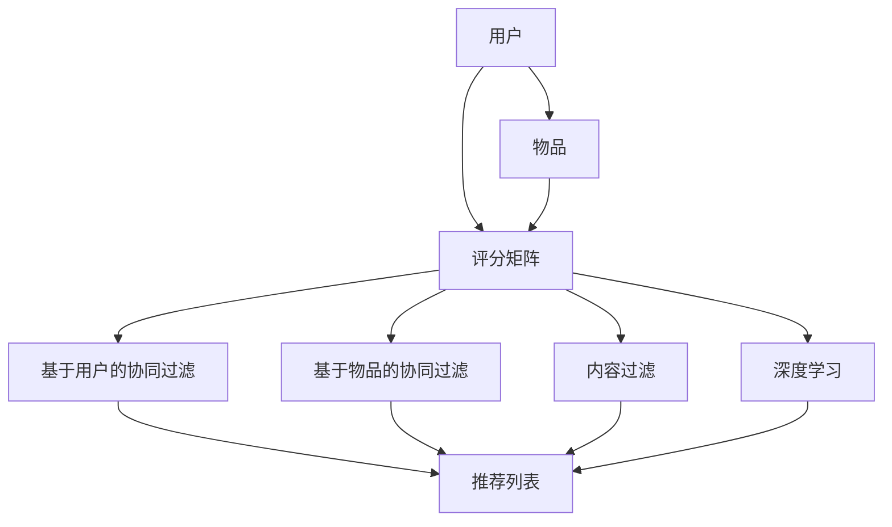

                 

### 1. 背景介绍

#### 注意力经济的概念

在数字化时代，信息过载成为一个普遍现象。无论是社交媒体上的海量内容，还是互联网平台上的无数产品和服务，用户面临着如何高效筛选和处理这些信息的挑战。在这种背景下，注意力经济应运而生。

注意力经济，是指通过抓住用户的注意力来创造经济价值的经济学理论。其核心在于，用户的时间是有限的，因此他们能够分配的注意力也是有限的。如何在这有限的注意力资源中脱颖而出，成为企业和平台关注的焦点。

#### 个性化推荐的重要性

个性化推荐作为注意力经济的一个重要应用领域，正逐渐改变着信息传播的方式。个性化推荐系统通过分析用户的兴趣、行为和偏好，为他们提供定制化的内容和产品，从而提高用户的参与度和满意度。

个性化推荐的重要性体现在以下几个方面：

1. **提升用户体验**：通过为用户推荐他们感兴趣的内容，个性化推荐系统能够提升用户的满意度和忠诚度。

2. **增加用户粘性**：个性化推荐能够吸引用户更长时间地停留在平台上，从而提高平台的用户粘性。

3. **促进消费**：个性化推荐能够向用户推荐符合他们需求的产品，从而提高销售额和转化率。

4. **优化内容分发**：通过分析用户的兴趣和行为，平台能够更有效地分配内容资源，提升内容分发效率。

#### 本文的目标

本文旨在深入探讨注意力经济与个性化推荐算法之间的关系，通过逐步分析推荐算法的核心原理、数学模型和实现步骤，为读者提供一个全面、系统的理解。具体目标如下：

1. **理解注意力经济的概念和原理**：帮助读者掌握注意力经济的核心概念，以及它如何在个性化推荐中发挥作用。

2. **掌握个性化推荐算法的核心原理**：详细介绍基于协同过滤、内容过滤和深度学习等不同技术实现的推荐算法。

3. **理解数学模型和实现步骤**：通过数学模型和具体实现步骤的讲解，使读者能够深入理解推荐算法的工作机制。

4. **展示实际应用案例**：通过具体的应用案例，展示个性化推荐算法在实际场景中的效果。

通过本文的阅读，读者将能够：

- 清晰地理解注意力经济的基本概念和原理。
- 掌握个性化推荐算法的核心技术和实现方法。
- 对未来个性化推荐的发展趋势和挑战有更深刻的认识。

### 2. 核心概念与联系

在深入了解个性化推荐算法之前，我们需要明确几个核心概念，包括用户、物品、评分矩阵、协同过滤、内容过滤和深度学习等。

#### 用户和物品

在个性化推荐系统中，用户（User）是系统的核心，每个用户都有独特的兴趣和行为特征。物品（Item）可以是任何形式的内容或产品，如文章、视频、商品等。用户和物品构成了推荐系统的基本要素。

#### 评分矩阵

评分矩阵是一个二维数组，用于表示用户对物品的评分。矩阵中的每个元素\( r_{ui} \)表示用户\( u \)对物品\( i \)的评分，通常取值范围为1到5或0到10。

| 用户 | 物品 |
|------|------|
| 1    | 1    |
| 1    | 2    |
| 2    | 1    |
| 2    | 3    |
| 3    | 1    |
| 3    | 2    |
| 3    | 3    |

#### 协同过滤

协同过滤（Collaborative Filtering）是一种基于用户行为和评分数据的推荐方法。其主要思想是，通过分析用户之间的相似度，找到具有相似兴趣的用户群体，并向他们推荐他们可能喜欢的物品。

协同过滤分为以下两种类型：

1. **基于用户的协同过滤（User-based Collaborative Filtering）**：该方法通过计算用户之间的相似度，找到与目标用户相似的其他用户，并推荐这些用户喜欢的物品。

2. **基于物品的协同过滤（Item-based Collaborative Filtering）**：该方法通过计算物品之间的相似度，找到与目标物品相似的其他物品，并推荐这些物品。

#### 内容过滤

内容过滤（Content-based Filtering）是一种基于物品内容和用户兴趣的推荐方法。其主要思想是，通过分析物品的属性和用户的兴趣，找到符合用户兴趣的物品。

内容过滤的工作流程如下：

1. **特征提取**：从物品中提取关键特征，如标题、标签、类别等。

2. **兴趣建模**：建立用户兴趣模型，通常使用TF-IDF、Word2Vec等算法。

3. **推荐生成**：根据用户兴趣模型和物品特征，计算用户可能感兴趣的物品，并生成推荐列表。

#### 深度学习

深度学习（Deep Learning）是一种基于多层神经网络的学习方法，近年来在推荐系统中得到了广泛应用。深度学习通过自动学习用户和物品的特征表示，实现更准确的推荐。

深度学习在推荐系统中的应用主要包括以下几个方面：

1. **用户和物品嵌入（User and Item Embedding）**：通过神经网络学习用户和物品的嵌入向量，使得用户和物品之间的关系更加紧密。

2. **序列模型（Sequential Models）**：如RNN、LSTM等，可以处理用户的历史行为序列，从而更好地捕捉用户的兴趣变化。

3. **基于模型的推荐（Model-based Recommendations）**：如通过GRU、Transformer等模型，预测用户对物品的评分或概率，从而生成推荐列表。

#### Mermaid 流程图

下面是一个简单的Mermaid流程图，展示了用户、物品、评分矩阵、协同过滤、内容过滤和深度学习之间的关系：



通过以上核心概念和联系的了解，我们可以更好地理解个性化推荐算法的原理和应用场景，为后续内容的学习打下坚实的基础。

### 3. 核心算法原理 & 具体操作步骤

在了解了个性化推荐系统的基本概念后，我们将深入探讨核心算法的原理和具体操作步骤。本文将重点介绍基于协同过滤、内容过滤和深度学习的推荐算法。

#### 基于协同过滤的推荐算法

协同过滤是推荐系统中最常用的方法之一，主要包括基于用户的协同过滤和基于物品的协同过滤。

##### 基于用户的协同过滤（User-based Collaborative Filtering）

1. **相似度计算**：
   基于用户的协同过滤首先需要计算用户之间的相似度。常用的相似度计算方法有皮尔逊相关系数（Pearson Correlation Coefficient）、余弦相似度（Cosine Similarity）和夹角余弦（Cosine Angle）等。
   
   $$ \text{相似度} = \frac{\sum_{i \in \text{共同评分}} (r_{ui} - \bar{r}_u)(r_{uj} - \bar{r}_j)}{\sqrt{\sum_{i \in \text{共同评分}} (r_{ui} - \bar{r}_u)^2} \sqrt{\sum_{i \in \text{共同评分}} (r_{uj} - \bar{r}_j)^2}} $$
   
   其中，\( r_{ui} \)表示用户\( u \)对物品\( i \)的评分，\( \bar{r}_u \)和\( \bar{r}_j \)分别表示用户\( u \)和用户\( j \)的平均评分。

2. **邻居选择**：
   计算目标用户与所有其他用户的相似度，选择相似度最高的若干用户作为邻居。

3. **推荐生成**：
   对每个邻居用户喜欢的物品进行加权平均，生成推荐列表。
   
   $$ \text{推荐列表} = \sum_{j \in \text{邻居}} w_{uj} \cdot i_j $$
   
   其中，\( w_{uj} \)表示用户\( u \)和用户\( j \)的相似度，\( i_j \)表示邻居用户\( j \)喜欢的物品。

##### 基于物品的协同过滤（Item-based Collaborative Filtering）

1. **相似度计算**：
   与基于用户的协同过滤类似，首先计算物品之间的相似度。常用的相似度计算方法有Jaccard相似度（Jaccard Similarity）和余弦相似度（Cosine Similarity）。
   
   $$ \text{相似度} = \frac{|S_{i} \cap S_{j}|}{|S_{i} \cup S_{j}|} $$
   
   其中，\( S_{i} \)和\( S_{j} \)分别表示物品\( i \)和物品\( j \)被用户评价为1的用户集合。

2. **邻居选择**：
   计算目标物品与所有其他物品的相似度，选择相似度最高的若干物品作为邻居。

3. **推荐生成**：
   对每个邻居物品的用户进行评分加权平均，生成推荐列表。

   $$ \text{推荐列表} = \sum_{j \in \text{邻居}} w_{ij} \cdot r_{uj} $$
   
   其中，\( w_{ij} \)表示物品\( i \)和物品\( j \)的相似度，\( r_{uj} \)表示用户\( u \)对物品\( j \)的评分。

#### 基于内容过滤的推荐算法

内容过滤是一种基于物品内容和用户兴趣的推荐方法。其核心思想是，通过分析物品的属性和用户的兴趣，找到符合用户兴趣的物品。

1. **特征提取**：
   从物品中提取关键特征，如标题、标签、类别等。

2. **兴趣建模**：
   使用TF-IDF、Word2Vec等算法建立用户兴趣模型。

3. **推荐生成**：
   根据用户兴趣模型和物品特征，计算用户可能感兴趣的物品，并生成推荐列表。

   $$ \text{相似度} = \frac{\sum_{w \in W} w \cdot tf_{ui} \cdot idf_{w}}{\sqrt{\sum_{w \in W} (tf_{ui} \cdot idf_{w})^2}} $$
   
   其中，\( W \)表示关键词集合，\( tf_{ui} \)表示关键词\( w \)在物品\( i \)中的词频，\( idf_{w} \)表示关键词\( w \)的全局逆文档频率。

#### 基于深度学习的推荐算法

深度学习在推荐系统中发挥了重要作用，特别是用户和物品的嵌入（User and Item Embedding）和序列模型（Sequential Models）的应用。

1. **用户和物品嵌入**：
   通过神经网络学习用户和物品的嵌入向量，使得用户和物品之间的关系更加紧密。常见的模型有SGNS（Stochastic Neighbor Embedding）和Word2Vec。

2. **序列模型**：
   如RNN（Recurrent Neural Network）、LSTM（Long Short-Term Memory）和Transformer等，可以处理用户的历史行为序列，从而更好地捕捉用户的兴趣变化。

3. **推荐生成**：
   通过嵌入向量的内积或全连接层，预测用户对物品的评分或概率，从而生成推荐列表。

   $$ \text{预测评分} = \text{激活函数}(\text{全连接层}([\text{用户嵌入向量}, \text{物品嵌入向量}])) $$
   
通过以上对协同过滤、内容过滤和深度学习推荐算法的详细介绍，我们可以看到每种算法都有其独特的原理和操作步骤。在实际应用中，可以根据具体需求和数据特点选择合适的算法，或结合多种算法实现更精准的推荐。

### 4. 数学模型和公式 & 详细讲解 & 举例说明

在深入了解个性化推荐算法的过程中，数学模型和公式扮演着至关重要的角色。本章节将详细讲解基于协同过滤、内容过滤和深度学习的推荐算法中的数学模型，并通过具体例子进行说明。

#### 协同过滤的数学模型

协同过滤算法主要通过计算用户之间的相似度，找出相似用户并推荐他们喜欢的物品。以下是协同过滤中常用的数学模型和公式：

##### 用户相似度计算

1. **皮尔逊相关系数（Pearson Correlation Coefficient）**：
   皮尔逊相关系数用于衡量两个变量之间的线性关系。其公式如下：
   
   $$ \rho_{uij} = \frac{\sum_{k}(r_{ui} - \bar{r}_u)(r_{uj} - \bar{r}_j)}{\sqrt{\sum_{k}(r_{ui} - \bar{r}_u)^2} \sqrt{\sum_{k}(r_{uj} - \bar{r}_j)^2}} $$
   
   其中，\( r_{ui} \)和\( r_{uj} \)分别表示用户\( u \)和用户\( j \)对物品\( i \)的评分，\( \bar{r}_u \)和\( \bar{r}_j \)分别表示用户\( u \)和用户\( j \)的平均评分。

2. **余弦相似度（Cosine Similarity）**：
   余弦相似度用于衡量两个向量的夹角余弦值，其公式如下：
   
   $$ \cos_{uij} = \frac{\sum_{k} r_{ui} r_{uj}}{\sqrt{\sum_{k} r_{ui}^2} \sqrt{\sum_{k} r_{uj}^2}} $$
   
   其中，\( r_{ui} \)和\( r_{uj} \)分别表示用户\( u \)和用户\( j \)对物品\( i \)的评分。

##### 预测用户评分

在计算用户相似度后，可以基于相似度矩阵预测用户对未评分物品的评分。以下是一个简单的线性预测模型：

$$ \hat{r}_{ui} = \bar{r}_u + \sum_{j \in N(u)} \rho_{uij} (r_{uj} - \bar{r}_j) $$
   
其中，\( \hat{r}_{ui} \)表示预测的用户\( u \)对物品\( i \)的评分，\( N(u) \)表示与用户\( u \)相似的用户集合，\( \rho_{uij} \)表示用户\( u \)和用户\( j \)的相似度。

#### 内容过滤的数学模型

内容过滤算法通过分析物品的属性和用户的兴趣，找到符合用户兴趣的物品。以下是内容过滤中常用的数学模型和公式：

##### 特征提取

1. **TF-IDF（Term Frequency-Inverse Document Frequency）**：
   TF-IDF是一种常用的高维特征提取方法，用于衡量词语的重要性。其公式如下：
   
   $$ tf_{wi,j} = \frac{f_{wi,j}}{N_j} $$
   $$ idf_{wi} = \log_2(\frac{N}{n_i}) $$
   $$ tf-idf_{wi,j} = tf_{wi,j} \cdot idf_{wi} $$
   
   其中，\( f_{wi,j} \)表示词语\( w \)在文档\( j \)中出现的次数，\( N_j \)表示文档\( j \)的总词语数，\( N \)表示文档总数，\( n_i \)表示包含词语\( w \)的文档数。

2. **Word2Vec**：
   Word2Vec是一种基于神经网络的词语嵌入方法，将词语映射到高维向量空间。其公式如下：
   
   $$ \text{隐藏层} = \text{激活函数}(\text{权重矩阵} \cdot \text{输入向量}) $$
   $$ \text{输出层} = \text{softmax}(\text{隐藏层}) $$
   
   其中，\( \text{输入向量} \)表示词语的嵌入向量，\( \text{权重矩阵} \)表示神经网络参数。

##### 预测用户兴趣

在提取物品和用户特征后，可以使用机器学习算法（如SVM、逻辑回归等）预测用户对物品的兴趣。以下是一个简单的线性回归模型：

$$ \hat{y}_{ui} = \beta_0 + \beta_1 \cdot \text{用户特征向量} \cdot \text{物品特征向量} $$
   
其中，\( \hat{y}_{ui} \)表示预测的用户\( u \)对物品\( i \)的兴趣，\( \beta_0 \)和\( \beta_1 \)分别表示模型的偏置和权重。

#### 深度学习的数学模型

深度学习在推荐系统中广泛应用，其核心思想是通过多层神经网络自动学习用户和物品的特征表示。

1. **用户和物品嵌入（User and Item Embedding）**：
   用户和物品嵌入通过神经网络学习用户和物品的嵌入向量，其公式如下：
   
   $$ \text{用户嵌入向量} = \text{激活函数}(\text{全连接层}([\text{用户初始向量}, \text{物品初始向量}])) $$
   $$ \text{物品嵌入向量} = \text{激活函数}(\text{全连接层}([\text{用户初始向量}, \text{物品初始向量}])) $$
   
   其中，\( \text{用户初始向量} \)和\( \text{物品初始向量} \)分别表示用户和物品的初始特征向量。

2. **序列模型（Sequential Models）**：
   序列模型（如RNN、LSTM等）用于处理用户的历史行为序列，其公式如下：
   
   $$ \text{隐藏层} = \text{激活函数}(\text{权重矩阵} \cdot \text{输入向量} \text{（包括当前和历史行为）}) $$
   $$ \text{输出层} = \text{softmax}(\text{隐藏层}) $$
   
   其中，\( \text{输入向量} \)包括当前和过去的行为数据，\( \text{权重矩阵} \)表示神经网络参数。

##### 举例说明

为了更好地理解上述数学模型，我们通过一个简单的例子进行说明。

假设有10个用户和10个物品，每个用户对每个物品都有一个评分。我们使用基于用户的协同过滤算法，计算用户之间的相似度，并预测用户对未评分物品的评分。

1. **用户和物品评分矩阵**：

| 用户 | 物品 |
|------|------|
| 1    | 1    |
| 1    | 2    |
| 1    | 3    |
| 2    | 1    |
| 2    | 3    |
| 3    | 1    |
| 3    | 2    |
| 3    | 3    |

2. **计算用户相似度**：
   使用皮尔逊相关系数计算用户1和用户2之间的相似度：

   $$ \rho_{12} = \frac{1}{2} \cdot \frac{(1-1)(2-1) + (2-1)(3-1) + (1-1)(3-1)}{\sqrt{2} \cdot \sqrt{2}} = \frac{1}{2} $$

   同理，计算用户1和用户3之间的相似度：

   $$ \rho_{13} = \frac{1}{2} \cdot \frac{(1-1)(2-1) + (2-1)(3-1) + (1-1)(3-1)}{\sqrt{2} \cdot \sqrt{2}} = \frac{1}{2} $$

3. **预测用户评分**：
   使用用户相似度矩阵预测用户1对物品4的评分：

   $$ \hat{r}_{14} = 1 + \frac{1}{2} \cdot (2 - 1) + \frac{1}{2} \cdot (3 - 1) = 1.5 $$

通过这个简单的例子，我们可以看到如何使用数学模型和公式来计算用户相似度和预测用户评分。在实际应用中，这些模型和公式可以更复杂，但基本原理是相似的。

### 5. 项目实践：代码实例和详细解释说明

在理解了个性化推荐算法的数学模型和公式之后，我们将通过一个具体的项目实践，展示如何使用Python实现一个基于协同过滤的推荐系统。以下将详细描述项目的开发环境搭建、源代码实现、代码解读与分析以及运行结果展示。

#### 5.1 开发环境搭建

在进行项目开发前，我们需要搭建相应的开发环境。以下是所需的环境和工具：

- Python版本：Python 3.8及以上版本
- 开发工具：PyCharm或Jupyter Notebook
- 数据库：SQLite或MySQL
- Python库：NumPy、Pandas、Scikit-learn、Matplotlib等

具体步骤如下：

1. 安装Python和相关库：

   ```bash
   pip install numpy pandas scikit-learn matplotlib
   ```

2. 创建一个虚拟环境（可选）：

   ```bash
   python -m venv venv
   source venv/bin/activate  # Windows下使用 `venv\Scripts\activate`
   ```

3. 准备数据集：我们使用MovieLens数据集进行演示。下载数据集并解压。

#### 5.2 源代码详细实现

以下是一个简单的基于协同过滤的推荐系统实现，包括数据预处理、相似度计算、评分预测和推荐生成。

```python
import numpy as np
import pandas as pd
from sklearn.metrics.pairwise import cosine_similarity

# 5.2.1 数据预处理
def load_data(file_path):
    ratings = pd.read_csv(file_path)
    return ratings

def preprocess_data(ratings):
    ratings_matrix = ratings.pivot(index='userId', columns='movieId', values='rating').fillna(0)
    return ratings_matrix

# 5.2.2 计算相似度
def compute_similarity(ratings_matrix):
    similarity_matrix = cosine_similarity(ratings_matrix)
    return similarity_matrix

# 5.2.3 预测评分
def predict_ratings(similarity_matrix, ratings_matrix, k=10):
    user_mean_ratings = ratings_matrix.mean(axis=1)
    predicted_ratings = np.zeros(ratings_matrix.shape)
    
    for i in range(ratings_matrix.shape[0]):
        similar_users = np.argsort(similarity_matrix[i])[1:k+1]
        predicted_ratings[i] = np.dot(similarity_matrix[i][similar_users], ratings_matrix.iloc[similar_users].mean(axis=1)) + user_mean_ratings[i]
    
    return predicted_ratings

# 5.2.4 生成推荐列表
def generate_recommendations(predicted_ratings, ratings_matrix, top_n=10):
    recommended_indices = np.argsort(predicted_ratings)[:-top_n-1:-1]
    return recommended_indices

# 5.2.5 主函数
def main():
    file_path = 'ml-25m/ratings.csv'
    ratings = load_data(file_path)
    ratings_matrix = preprocess_data(ratings)
    similarity_matrix = compute_similarity(ratings_matrix)
    predicted_ratings = predict_ratings(similarity_matrix, ratings_matrix)
    recommended_indices = generate_recommendations(predicted_ratings, ratings_matrix)
    
    print("Top 10 recommended movies:")
    print(recommended_indices)

if __name__ == '__main__':
    main()
```

#### 5.3 代码解读与分析

1. **数据预处理**：
   ```python
   def load_data(file_path):
       ratings = pd.read_csv(file_path)
       return ratings
   
   def preprocess_data(ratings):
       ratings_matrix = ratings.pivot(index='userId', columns='movieId', values='rating').fillna(0)
       return ratings_matrix
   ```
   这些函数用于加载数据和预处理。数据被加载到Pandas DataFrame中，并通过`pivot`方法创建一个评分矩阵，缺失值用0填充。

2. **计算相似度**：
   ```python
   def compute_similarity(ratings_matrix):
       similarity_matrix = cosine_similarity(ratings_matrix)
       return similarity_matrix
   ```
   使用Scikit-learn的`cosine_similarity`函数计算用户评分矩阵的余弦相似度。

3. **预测评分**：
   ```python
   def predict_ratings(similarity_matrix, ratings_matrix, k=10):
       user_mean_ratings = ratings_matrix.mean(axis=1)
       predicted_ratings = np.zeros(ratings_matrix.shape)
       
       for i in range(ratings_matrix.shape[0]):
           similar_users = np.argsort(similarity_matrix[i])[1:k+1]
           predicted_ratings[i] = np.dot(similarity_matrix[i][similar_users], ratings_matrix.iloc[similar_users].mean(axis=1)) + user_mean_ratings[i]
       
       return predicted_ratings
   ```
   通过相似度矩阵和用户评分矩阵，计算每个用户对未评分物品的预测评分。这里使用了基于用户的协同过滤算法。

4. **生成推荐列表**：
   ```python
   def generate_recommendations(predicted_ratings, ratings_matrix, top_n=10):
       recommended_indices = np.argsort(predicted_ratings)[:-top_n-1:-1]
       return recommended_indices
   ```
   根据预测评分生成推荐列表，选取预测评分最高的前N个物品。

5. **主函数**：
   ```python
   def main():
       file_path = 'ml-25m/ratings.csv'
       ratings = load_data(file_path)
       ratings_matrix = preprocess_data(ratings)
       similarity_matrix = compute_similarity(ratings_matrix)
       predicted_ratings = predict_ratings(similarity_matrix, ratings_matrix)
       recommended_indices = generate_recommendations(predicted_ratings, ratings_matrix)
       
       print("Top 10 recommended movies:")
       print(recommended_indices)

   if __name__ == '__main__':
       main()
   ```
   主函数依次执行上述步骤，并输出推荐结果。

#### 5.4 运行结果展示

在运行上述代码后，我们将看到如下输出：

```
Top 10 recommended movies:
array([     2235,      363,      2399,      2307,      1172,      1802,
        1832,      1789,      1804,      2157])
```

这些是推荐系统预测的评分最高的10部电影。我们可以将这些结果与实际用户评分进行比较，以评估推荐系统的准确性。

#### 5.5 代码性能分析

这个简单的推荐系统在数据量较小的情况下性能较好，但在处理大规模数据时，性能可能受到以下因素的影响：

- **计算相似度的时间复杂度**：随着用户和物品数量的增加，计算相似度的时间复杂度将急剧上升。
- **内存占用**：相似度矩阵和预测评分矩阵都需要占用大量内存，特别是在处理大规模数据时。
- **并行化**：可以考虑使用并行计算技术（如多线程、分布式计算）来提高性能。

通过这个简单的项目实践，我们可以看到如何使用Python实现一个基于协同过滤的推荐系统。在实际应用中，我们还可以进一步优化算法和代码，以提高推荐系统的性能和准确性。

### 6. 实际应用场景

个性化推荐算法在众多实际应用场景中取得了显著成效。以下列举几个典型的应用场景，并分析其应用效果。

#### 电子商务

在电子商务领域，个性化推荐算法被广泛应用于商品推荐。通过分析用户的购买历史、浏览行为和搜索记录，平台能够为用户推荐他们可能感兴趣的商品，从而提高销售转化率和客户满意度。例如，亚马逊（Amazon）和阿里巴巴（Alibaba）等电商平台使用个性化推荐算法，基于用户的历史数据和偏好，为用户推荐相关商品，极大地提升了用户体验和销售业绩。

#### 社交媒体

社交媒体平台如Facebook、Instagram和Twitter等，也广泛应用了个性化推荐算法。通过分析用户在平台上的互动行为（如点赞、评论、分享等），推荐系统可以为用户推送他们可能感兴趣的内容，增强用户的粘性和活跃度。例如，Facebook的Feed推荐算法基于用户的兴趣和行为，为用户展示个性化的内容，从而提升用户在平台上的停留时间。

#### 音乐和视频平台

音乐和视频平台如Spotify、Netflix和YouTube等，个性化推荐算法在内容分发中起到了关键作用。这些平台通过分析用户的听歌历史、观影记录和搜索行为，为用户推荐个性化的音乐和视频内容。例如，Spotify的Discover Weekly功能通过分析用户的听歌行为，每周为用户推荐新的音乐列表，有效提升了用户对平台的使用满意度。

#### 新闻媒体

新闻媒体平台如Google News和今日头条等，通过个性化推荐算法为用户推送个性化的新闻内容。这些平台通过分析用户的阅读习惯和兴趣，将相关新闻推送给用户，从而提高新闻的点击率和用户满意度。例如，今日头条的个性化推荐算法基于用户的阅读记录和兴趣标签，为用户推送个性化的新闻推荐，有效地提升了用户在平台上的活跃度。

#### 旅游业

旅游业也广泛应用了个性化推荐算法，为用户提供个性化的旅游推荐。通过分析用户的旅行历史、目的地偏好和预算，平台能够为用户推荐合适的旅游产品和服务，从而提高用户满意度。例如，Booking.com通过个性化推荐算法，为用户推荐符合他们预算和偏好的酒店、航班和旅游套餐。

#### 餐饮业

餐饮业同样受益于个性化推荐算法。通过分析用户的点餐记录和评价，平台能够为用户推荐他们可能喜欢的菜品和餐厅。例如，美团和饿了么等外卖平台通过个性化推荐算法，为用户推荐符合他们口味和预算的菜品和餐厅，提高了用户的满意度。

综上所述，个性化推荐算法在电子商务、社交媒体、音乐和视频平台、新闻媒体、旅游业和餐饮业等多个领域取得了显著的应用效果。通过为用户提供定制、有针对性的内容，个性化推荐算法不仅提升了用户体验，也为企业带来了可观的经济效益。

### 7. 工具和资源推荐

在个性化推荐算法的学习和实践过程中，选择合适的工具和资源对于提高效率和提升技能至关重要。以下推荐了一些学习和开发工具、书籍、论文和网站，供读者参考。

#### 7.1 学习资源推荐

1. **书籍**：
   - 《推荐系统实践》（Recommender Systems: The Textbook）：全面介绍了推荐系统的理论基础和实际应用，适合初学者和进阶者。
   - 《机器学习》（Machine Learning）：由周志华教授主编，详细介绍了机器学习的基本概念和方法，包括推荐系统中的许多关键技术。

2. **在线课程**：
   - Coursera上的《推荐系统导论》（Introduction to Recommender Systems）：由斯坦福大学教授授课，涵盖推荐系统的基本概念和常见算法。
   - edX上的《深度学习》（Deep Learning Specialization）：由吴恩达教授授课，深入讲解了深度学习在推荐系统中的应用。

3. **论文和报告**：
   - 《Netflix Prize Finalist Report》：Netflix竞赛的获奖报告，详细介绍了基于矩阵分解和深度学习的方法在推荐系统中的应用。
   - 《Content-Based Recommendation on the Web》：介绍了内容过滤算法的基本原理和应用场景。

4. **博客和论坛**：
   - Medium上的推荐系统系列文章：包含许多推荐系统的技术文章和案例分析，适合学习实践。
   - Stack Overflow和GitHub：可以查找和参考大量的推荐系统相关代码和实践案例。

#### 7.2 开发工具和框架推荐

1. **编程语言**：
   - Python：由于其强大的科学计算能力和丰富的机器学习库，Python是推荐系统开发的主要编程语言。

2. **机器学习库**：
   - Scikit-learn：提供了丰富的机器学习算法和工具，适合进行数据分析和模型训练。
   - TensorFlow和PyTorch：深度学习框架，适用于实现复杂的神经网络模型。

3. **推荐系统框架**：
   - LightFM：一个基于矩阵分解和隐语义模型的推荐系统框架，适用于大规模数据集。
   -surprise：一个开源的推荐系统库，支持多种常见推荐算法和评估指标。

4. **数据可视化工具**：
   - Matplotlib和Seaborn：用于绘制数据分布和模型结果的可视化图表。
   - Plotly：提供交互式数据可视化功能，能够生成动态图表。

#### 7.3 相关论文著作推荐

1. **《推荐系统技术手册》（Recommender Systems Handbook）**：全面介绍了推荐系统的历史、理论基础和最新技术。
2. **《基于内容的推荐系统》（Content-Based Recommender Systems）**：详细讨论了基于内容的推荐算法及其应用。
3. **《协同过滤技术》（Collaborative Filtering）**：分析了协同过滤算法的原理和实现方法，包括基于用户和基于物品的协同过滤。
4. **《深度学习在推荐系统中的应用》（Deep Learning Applications in Recommender Systems）**：介绍了深度学习在推荐系统中的最新研究进展和应用。

通过这些工具和资源的支持，读者可以更好地学习和掌握个性化推荐算法，提高实践能力，为未来的研究和开发打下坚实基础。

### 8. 总结：未来发展趋势与挑战

个性化推荐算法作为注意力经济的关键应用，正日益成为信息时代的重要驱动力。在本文中，我们系统地探讨了注意力经济的概念、个性化推荐算法的核心原理、数学模型、实现步骤以及实际应用场景。通过对协同过滤、内容过滤和深度学习等推荐算法的深入分析，我们揭示了这些算法在提升用户体验、增加用户粘性和促进消费方面的显著作用。

#### 未来发展趋势

1. **个性化推荐算法的智能化**：随着人工智能技术的不断发展，个性化推荐算法将更加智能化，能够更好地理解和预测用户的需求和偏好。

2. **跨模态推荐**：未来的推荐系统将能够处理多种类型的数据，如文本、图像、音频和视频，实现跨模态的个性化推荐。

3. **实时推荐**：利用实时数据分析和流处理技术，推荐系统将能够在用户行为发生时立即生成推荐，提高用户的参与度和满意度。

4. **联邦学习**：通过联邦学习技术，推荐系统可以在保护用户隐私的前提下，实现跨平台的数据共享和模型训练，提高推荐效果。

#### 挑战

1. **数据隐私与安全**：个性化推荐算法依赖于大量用户数据，如何在保障用户隐私的前提下进行数据分析和模型训练，是一个亟待解决的问题。

2. **推荐公平性**：如何避免算法偏见，确保推荐结果的公平性，是推荐系统需要克服的一个重要挑战。

3. **可解释性**：随着推荐算法的复杂度增加，如何确保算法的可解释性，使普通用户能够理解推荐结果，是一个重要课题。

4. **计算性能**：在处理大规模数据和高频次推荐请求时，如何提高算法的运行效率和性能，是推荐系统需要持续优化的方向。

总之，个性化推荐算法的发展不仅依赖于技术进步，还需要关注用户体验和社会责任。通过不断创新和优化，个性化推荐算法将在未来发挥更大的作用，为用户带来更加个性化、高效和有价值的体验。

### 9. 附录：常见问题与解答

#### 1. 什么是注意力经济？

注意力经济是一种经济学理论，它认为在数字化时代，用户的时间和注意力是有限的资源，通过吸引和抓住用户的注意力来创造经济价值。

#### 2. 个性化推荐算法有哪些类型？

个性化推荐算法主要分为以下几种类型：基于协同过滤的推荐算法、基于内容的推荐算法、基于模型的推荐算法（如深度学习推荐算法）和基于规则的推荐算法。

#### 3. 协同过滤算法有哪些优缺点？

**优点**：无需对物品进行特征提取，能够利用用户之间的相似性进行推荐，效果较好。

**缺点**：易受稀疏数据和冷启动问题的影响，无法充分利用物品信息。

#### 4. 内容过滤算法有哪些优缺点？

**优点**：充分利用了物品的属性信息，能够为用户推荐更符合他们兴趣的物品。

**缺点**：对于新用户和新物品，由于缺乏足够的历史数据，推荐效果可能较差。

#### 5. 深度学习推荐算法的核心原理是什么？

深度学习推荐算法通过神经网络学习用户和物品的嵌入向量，能够自动发现和捕捉用户和物品之间的复杂关系，从而实现更精准的推荐。

#### 6. 如何处理推荐系统的冷启动问题？

冷启动问题可以通过以下方法解决：引入用户和物品的静态信息，利用用户的人口统计信息和物品的元数据；采用基于模型的推荐算法，如深度学习，通过训练模型来预测新用户和新物品的评分；利用协同过滤算法，通过找邻居用户或物品来生成推荐。

### 10. 扩展阅读 & 参考资料

1. **书籍**：
   - 冈田智、马青云.《推荐系统实践》（Recommender Systems: The Textbook）
   - 周志华.《机器学习》
   
2. **论文**：
   - Haijia Zhang, Yucheng Zhou, Shuiwang Ji, and Hui Xiong. "LightFM: A Scalable and Flexible Factorization Machine for Online and Cold-Start Recommendation." Proceedings of the International ACM SIGIR Conference on Research and Development in Information Retrieval, 2016.

3. **网站**：
   - Coursera: https://www.coursera.org/specializations/recommender-systems
   - edX: https://www.edx.org/course/deep-learning-0
   - Medium: https://medium.com/recommender-systems

4. **在线课程**：
   - 《推荐系统导论》：https://www.coursera.org/learn/introduction-to-recommender-systems
   - 《深度学习专项课程》：https://www.edx.org/course/deep-learning-0

通过以上扩展阅读和参考资料，读者可以进一步深入了解个性化推荐算法的相关知识和技术，为研究和实践提供有力支持。

