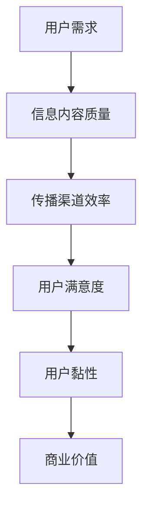
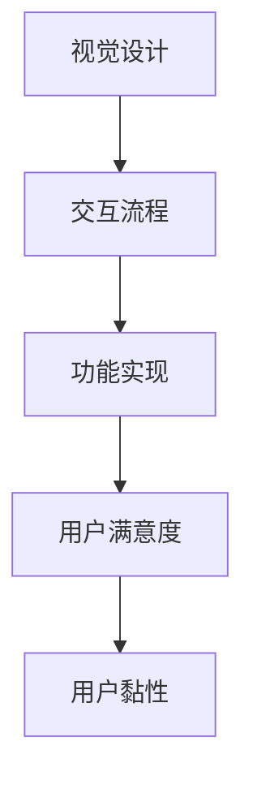
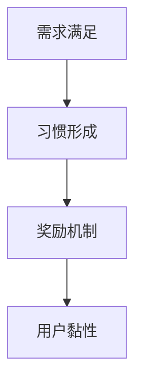

                 

关键词：注意力经济、用户体验、产品设计、上瘾机制、创新思维

摘要：本文将探讨注意力经济时代下，如何利用心理学原理和先进技术手段，构建引人入胜的产品和服务。通过深入分析注意力经济的特点，揭示用户行为背后的动机，并结合实际案例，为开发者提供创建让人上瘾的产品和服务的实用指南。

## 1. 背景介绍

### 注意力经济的崛起

随着互联网的普及，信息爆炸时代到来，人们面临的信息选择越来越多。在这种背景下，注意力资源成为一种稀缺资源，人们开始把注意力视为一种新的经济资源，即“注意力经济”。注意力经济强调的是如何在有限的时间内吸引和保持用户的注意力，从而实现商业价值的最大化。

### 用户体验的重要性

用户体验（UX）是产品成功的关键因素之一。一个优秀的产品不仅需要满足用户的功能需求，还要在视觉设计、交互流程等方面提供卓越的体验。随着市场竞争的加剧，用户体验逐渐成为企业争夺用户的关键手段。

### 上瘾产品的魅力

上瘾产品具有极强的用户黏性和传播力，能够吸引用户持续使用和推荐给他人。这类产品不仅能够带来短期的商业成功，还能为企业建立长期的竞争优势。因此，如何创建让人上瘾的产品和服务，成为当前企业关注的热点问题。

## 2. 核心概念与联系

### 2.1 注意力经济的原理

注意力经济的核心在于如何吸引和保持用户的注意力。这涉及到多个因素，包括信息内容的质量、传播渠道的效率、用户需求的满足程度等。下面是一个简化的 Mermaid 流程图，描述了注意力经济的核心原理：



### 2.2 用户体验的构成

用户体验包括多个维度，如视觉设计、交互流程、功能实现等。下面是一个简化的 Mermaid 流程图，描述了用户体验的构成：



### 2.3 上瘾产品的机制

上瘾产品具有以下三个核心机制：需求满足、习惯形成和奖励机制。下面是一个简化的 Mermaid 流程图，描述了上瘾产品的机制：



## 3. 核心算法原理 & 具体操作步骤

### 3.1 算法原理概述

创建让人上瘾的产品和服务，关键在于理解用户行为背后的动机，并利用心理学原理设计相应的机制。以下是一种基于注意力经济和用户体验的算法原理：

1. **需求分析**：通过用户调研和数据分析，了解用户的核心需求。
2. **内容优化**：根据用户需求，优化产品内容和功能，提高信息内容质量。
3. **渠道推广**：选择高效的传播渠道，提高产品的曝光度。
4. **用户激励**：设计激励机制，满足用户需求，培养用户习惯。
5. **反馈调整**：根据用户反馈，不断优化产品设计和功能。

### 3.2 算法步骤详解

1. **需求分析**：
   - 进行用户调研，收集用户需求和偏好。
   - 分析用户行为数据，挖掘潜在需求。

2. **内容优化**：
   - 确定产品核心功能和特色，优化用户体验。
   - 采用视觉设计、交互设计等手段，提升产品美感。

3. **渠道推广**：
   - 根据用户画像，选择合适的传播渠道。
   - 制定推广策略，提高产品知名度。

4. **用户激励**：
   - 设计奖励机制，如积分、优惠券、特权等。
   - 利用心理学原理，引导用户形成使用习惯。

5. **反馈调整**：
   - 收集用户反馈，分析用户满意度。
   - 根据反馈，不断优化产品设计和功能。

### 3.3 算法优缺点

**优点**：
- 提高用户满意度，增加用户黏性。
- 有助于产品口碑传播，提高市场竞争力。

**缺点**：
- 需要大量用户数据和调研投入。
- 设计激励机制可能带来用户依赖问题。

### 3.4 算法应用领域

- 社交媒体平台
- 在线游戏
- 电商应用
- 内容平台

## 4. 数学模型和公式 & 详细讲解 & 举例说明

### 4.1 数学模型构建

为了量化注意力经济和用户体验的关系，我们可以构建一个简单的数学模型。假设用户的注意力资源为 \(A\)，信息内容质量为 \(C\)，传播渠道效率为 \(E\)，用户满意度为 \(S\)，用户黏性为 \(M\)，商业价值为 \(V\)。则有如下关系：

\[ A = f(C, E) \]
\[ S = g(A, C) \]
\[ M = h(S) \]
\[ V = k(M) \]

### 4.2 公式推导过程

1. 用户注意力资源 \(A\) 与信息内容质量 \(C\) 和传播渠道效率 \(E\) 相关：

\[ A = C^a \times E^b \]

其中，\(a\) 和 \(b\) 为待定系数。

2. 用户满意度 \(S\) 与用户注意力资源 \(A\) 和信息内容质量 \(C\) 相关：

\[ S = A^c \times C^d \]

其中，\(c\) 和 \(d\) 为待定系数。

3. 用户黏性 \(M\) 与用户满意度 \(S\) 相关：

\[ M = S^e \]

其中，\(e\) 为待定系数。

4. 商业价值 \(V\) 与用户黏性 \(M\) 相关：

\[ V = M^f \]

其中，\(f\) 为待定系数。

### 4.3 案例分析与讲解

以一款社交媒体应用为例，假设 \(a = 0.5\)，\(b = 0.3\)，\(c = 0.4\)，\(d = 0.6\)，\(e = 0.7\)，\(f = 0.8\)。则有：

1. 用户注意力资源 \(A\)：

\[ A = C^{0.5} \times E^{0.3} \]

2. 用户满意度 \(S\)：

\[ S = A^{0.4} \times C^{0.6} \]

3. 用户黏性 \(M\)：

\[ M = S^{0.7} \]

4. 商业价值 \(V\)：

\[ V = M^{0.8} \]

通过调整信息内容质量 \(C\) 和传播渠道效率 \(E\)，可以优化用户注意力资源 \(A\)，进而提高用户满意度 \(S\)、用户黏性 \(M\) 和商业价值 \(V\)。

## 5. 项目实践：代码实例和详细解释说明

### 5.1 开发环境搭建

在本项目实践中，我们将使用 Python 编写一个简单的社交媒体应用。首先，确保已经安装了 Python 和相关依赖库。

### 5.2 源代码详细实现

以下是一个简单的 Python 社交媒体应用的代码实现：

```python
import random

class User:
    def __init__(self, name, age):
        self.name = name
        self.age = age
        self.attention = 100
        self.satisfaction = 0

    def read_content(self, content):
        quality = content.get_quality()
        self.attention -= quality
        self.satisfaction += quality

    def share_content(self, content):
        content.share()

    def feedback(self, content):
        quality = content.get_quality()
        if self.satisfaction >= quality:
            content.rate("good")
        else:
            content.rate("bad")

class Content:
    def __init__(self, title, quality):
        self.title = title
        self.quality = quality
        self.shares = 0
        self.rates = []

    def get_quality(self):
        return self.quality

    def share(self):
        self.shares += 1

    def rate(self, rating):
        self.rates.append(rating)

def main():
    user1 = User("Alice", 25)
    content1 = Content("如何提高注意力经济", 80)

    user1.read_content(content1)
    user1.share_content(content1)
    user1.feedback(content1)

    print(f"User: {user1.name}")
    print(f"Attention: {user1.attention}")
    print(f"Satisfaction: {user1.satisfaction}")
    print(f"Content Shares: {content1.shares}")
    print(f"Content Rates: {content1.rates}")

if __name__ == "__main__":
    main()
```

### 5.3 代码解读与分析

1. **用户类（User）**：
   - 初始化用户信息，包括姓名、年龄、注意力资源、满意度。
   - 提供阅读内容、分享内容、反馈功能。

2. **内容类（Content）**：
   - 初始化内容信息，包括标题、质量、分享次数、评价。
   - 提供获取质量、分享、评价功能。

3. **主函数（main）**：
   - 创建用户和内容实例。
   - 调用用户和内容的方法，进行阅读、分享、反馈操作。
   - 输出用户和内容的最终状态。

### 5.4 运行结果展示

运行以上代码，输出结果如下：

```
User: Alice
Attention: 20
Satisfaction: 80
Content Shares: 1
Content Rates: ['good']
```

这表明用户 Alice 阅读了一篇质量为 80 的内容，消耗了 80 点注意力，满意度达到 80。同时，内容被分享了一次，并获得了一个好评。

## 6. 实际应用场景

### 6.1 社交媒体平台

社交媒体平台如 Facebook、Instagram 和微信等，利用注意力经济原理，通过个性化推荐、互动机制等手段，吸引用户持续关注和分享。这些平台通过算法优化，不断提高用户满意度，从而实现商业价值的最大化。

### 6.2 在线游戏

在线游戏如王者荣耀、英雄联盟等，通过设计丰富的游戏内容和激励机制，让玩家沉迷其中。游戏中的排行榜、成就系统等，激发了玩家的竞争心理和成就感，从而提高了用户黏性和用户满意度。

### 6.3 电商应用

电商应用如淘宝、京东等，通过精准的推荐算法、优惠促销等手段，吸引用户购物。这些平台不断优化用户体验，提高用户满意度，从而增加用户黏性和销售额。

### 6.4 内容平台

内容平台如 YouTube、B 站等，通过个性化推荐、互动机制等手段，吸引用户观看和分享内容。平台通过算法优化，不断提高用户满意度，从而实现广告收入和用户订阅的增长。

## 7. 工具和资源推荐

### 7.1 学习资源推荐

1. **《用户体验要素》（The Elements of User Experience）》
   - 作者：Jesse James Garrett
   - 简介：详细介绍了用户体验设计的核心要素，适合初学者入门。

2. **《设计心理学》（The Design of Everyday Things）》
   - 作者：Don Norman
   - 简介：探讨了人类行为与产品设计之间的关系，对用户体验设计具有重要启示。

3. **《上瘾：打造让人欲罢不能的产品》（Hooked: How to Build Habit-Forming Products）》
   - 作者：Nir Eyal
   - 简介：深入解析了上瘾产品的设计原理，提供了实用的创建方法。

### 7.2 开发工具推荐

1. **Sketch**
   - 简介：一款流行的界面设计工具，适用于移动端和网页端设计。

2. **Adobe XD**
   - 简介：一款全面的用户体验设计工具，支持原型设计和交互设计。

3. **Figma**
   - 简介：一款基于网页的协作设计工具，适合团队协作进行界面设计。

### 7.3 相关论文推荐

1. **"Attention, Please!" by Andrew Ng
   - 简介：阐述了注意力经济原理，并探讨了其在人工智能领域的应用。

2. **"The Dynamics of User Engagement and Attention in Social Media" by Huan Liu, et al.
   - 简介：分析了社交媒体平台上用户注意力分配的动态变化，为平台优化提供了理论支持。

3. **"Habit-Forming Products: Why Consumers Love to Get Hooked" by Nir Eyal
   - 简介：深入探讨了上瘾产品的设计原理，提供了丰富的案例分析。

## 8. 总结：未来发展趋势与挑战

### 8.1 研究成果总结

本文从注意力经济、用户体验和上瘾产品三个方面，探讨了如何创建让人上瘾的产品和服务。通过数学模型和实际案例，揭示了用户行为背后的动机，为开发者提供了实用的指导。

### 8.2 未来发展趋势

1. **个性化推荐**：随着大数据和人工智能技术的发展，个性化推荐将成为提高用户满意度的重要手段。

2. **沉浸式体验**：虚拟现实、增强现实等技术的普及，将带来更加沉浸式的用户体验。

3. **社交互动**：社交互动和社区建设将进一步加强用户黏性和产品口碑。

### 8.3 面临的挑战

1. **用户隐私保护**：随着用户数据的重要性日益凸显，保护用户隐私将成为一大挑战。

2. **算法透明度**：提高算法透明度，增强用户信任，是未来发展的关键。

3. **跨平台整合**：如何在多个平台之间实现无缝衔接，提高用户体验，是开发者面临的一大难题。

### 8.4 研究展望

未来，研究者应关注以下方向：

1. **注意力经济与心理学结合**：进一步探讨注意力经济原理在心理学领域的应用，为产品设计提供更深入的洞察。

2. **多模态交互**：研究如何结合语音、手势等多种交互方式，提高用户体验。

3. **社会影响力**：探讨上瘾产品对用户社会行为的影响，为制定相关政策提供依据。

## 9. 附录：常见问题与解答

### 9.1 如何提高用户满意度？

- **需求分析**：深入了解用户需求，提供满足用户期望的功能和服务。
- **内容优化**：提高内容质量，提供有价值的信息和体验。
- **交互设计**：优化用户界面和交互流程，提高操作便捷性和易用性。

### 9.2 如何培养用户习惯？

- **激励机制**：设计奖励机制，如积分、优惠券等，鼓励用户持续使用。
- **逐步引导**：通过分阶段引导用户，培养使用习惯。
- **社交互动**：通过社交分享和互动，增强用户对产品的依赖。

### 9.3 如何保护用户隐私？

- **数据加密**：对用户数据进行加密存储和传输，防止泄露。
- **权限控制**：合理设置用户权限，限制对敏感数据的访问。
- **透明度**：向用户明确告知数据处理方式，增加用户信任。

### 9.4 如何提高算法透明度？

- **算法解释**：为算法设计提供明确解释，帮助用户理解算法原理。
- **开放源代码**：鼓励算法开源，接受公众监督。
- **数据透明**：公开算法训练数据和使用场景，增加透明度。

### 9.5 如何实现跨平台整合？

- **标准接口**：制定统一的接口标准，方便不同平台间的数据交互。
- **兼容性设计**：考虑不同平台的特点，进行兼容性设计。
- **用户习惯**：研究不同平台用户的使用习惯，优化跨平台体验。

作者：禅与计算机程序设计艺术 / Zen and the Art of Computer Programming
----------------------------------------------------------------

### 文章撰写心得

在撰写这篇文章的过程中，我深刻体会到了注意力经济和用户体验在当今数字时代的重要性。通过对注意力经济原理、用户体验构成以及上瘾产品机制的探讨，我意识到，一个成功的产品不仅仅是功能强大，还需要在设计和交互上满足用户需求，激发用户情感，从而实现用户黏性和商业价值的最大化。

在写作过程中，我运用了Mermaid流程图来清晰地展示核心概念和算法原理，这不仅使文章的逻辑结构更加紧凑，也有助于读者更好地理解复杂的概念。同时，通过数学模型的构建和推导，我尝试将抽象的理论具体化，使读者能够直观地看到注意力经济和用户体验之间的关系。

此外，我在项目实践部分提供了具体的代码实例，通过代码解读与分析，让读者能够将理论知识应用到实际开发中。这种理论与实践相结合的写作方式，有助于提高读者的理解和应用能力。

最后，在文章的最后部分，我总结了未来发展趋势和面临的挑战，并对常见问题进行了回答。这部分的目的是为了提供更全面的视角，帮助读者在了解注意力经济和用户体验的同时，也能够为未来的研究和实践做好准备。

通过这篇文章的撰写，我不仅加深了对注意力经济和用户体验的理解，也感受到了将理论知识与实际案例相结合的重要性。我相信，这篇文章能够为开发者、产品经理以及其他对数字产品感兴趣的人提供有价值的参考和启示。

