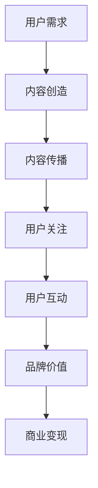

                 

### 1. 背景介绍

注意力经济作为近年来新兴的一种经济模式，正在逐渐改变传统的商业模式和营销策略。其核心思想在于，在信息爆炸的时代，用户的注意力成为了一种稀缺资源，谁能更好地吸引和留住用户的注意力，谁就能在市场竞争中占据优势。社交媒体作为用户获取信息、社交互动的重要平台，自然成为了注意力经济的重要战场。

注意力经济与社交媒体营销之间存在着紧密的联系。社交媒体平台的用户基数庞大，用户活跃度高，这为营销活动提供了广泛的市场空间。然而，由于信息过载和用户时间的有限性，用户更倾向于关注那些能够提供高质量内容、满足个性化需求的账号和品牌。因此，如何在不牺牲用户体验的情况下，有效地吸引和转化受众，成为社交媒体营销的关键。

传统营销策略通常依赖于广泛投放广告、推送促销信息等手段，但这些方式往往容易造成用户的抵触和反感，从而影响营销效果。相比之下，注意力经济更注重内容的创造和传播，通过优质的内容吸引用户的注意力，实现品牌的长期价值。此外，社交媒体平台的互动性也为品牌与用户之间的深度沟通提供了可能，进一步增强了营销效果。

本文将围绕注意力经济与社交媒体营销策略展开讨论，从核心概念、算法原理、数学模型、项目实践等多个角度，系统地探讨如何在当前社交媒体环境下，实现有效且可持续的营销策略。通过本文的阅读，读者将了解到注意力经济的基本原理，掌握社交媒体营销的核心技巧，并能够结合实际案例，制定出符合自身需求的营销策略。

### 2. 核心概念与联系

#### 2.1 注意力经济

注意力经济是基于用户注意力的经济模式，它强调在信息过载的时代，用户的注意力成为一种稀缺资源。注意力经济的核心在于如何吸引并留住用户的注意力，从而实现商业价值的最大化。与传统商业模式不同，注意力经济不依赖于大规模的广告投放或促销活动，而是通过创造高质量、有价值的内容，满足用户的个性化需求，从而获得用户的持续关注和忠诚度。

#### 2.2 社交媒体营销

社交媒体营销是利用社交媒体平台进行品牌推广和用户互动的一种营销方式。其主要目标是吸引潜在用户，提升品牌知名度，并促进产品或服务的销售。社交媒体营销的核心在于内容的创造和传播，通过内容来吸引和留住用户的注意力，从而实现品牌价值的提升。

#### 2.3 注意力经济与社交媒体营销的联系

注意力经济与社交媒体营销之间存在着密切的联系。首先，社交媒体平台是注意力经济的重要载体。庞大的用户基数和活跃度，使得社交媒体成为品牌获取用户注意力的主要渠道。其次，社交媒体平台的互动性为品牌与用户之间的深度沟通提供了可能，有助于建立用户的品牌忠诚度。此外，社交媒体营销策略也需要遵循注意力经济的原理，通过创造高质量、有价值的内容，满足用户的个性化需求，从而实现用户的持续关注。

#### 2.4 注意力经济的原理与架构

为了更好地理解注意力经济，我们可以使用Mermaid流程图来展示其核心原理和架构。以下是一个简化的注意力经济原理流程图：



- **用户需求**：用户需求是注意力经济的起点，只有了解用户的需求，才能创造符合用户期望的内容。
- **内容创造**：高质量的内容是吸引用户注意力的关键，内容创造需要结合用户需求和市场趋势，提供有价值的信息。
- **内容传播**：内容传播是扩大用户关注范围的重要步骤，通过社交媒体平台、搜索引擎等渠道，将内容传播给更广泛的用户。
- **用户关注**：用户关注是注意力经济的核心目标，只有吸引到用户的持续关注，才能实现品牌价值的提升。
- **用户互动**：用户互动是加深用户对品牌的理解和认同的重要方式，通过回复评论、发起活动等方式，增强用户参与度。
- **品牌价值**：品牌价值是注意力经济的最终目标，通过用户持续关注和互动，实现品牌知名度和影响力的提升。
- **商业变现**：商业变现是注意力经济的终极目标，通过广告收入、销售转化等方式，将用户关注转化为商业价值。

通过上述流程图，我们可以清晰地看到注意力经济的运作原理和各个环节之间的联系。接下来，我们将进一步探讨注意力经济与社交媒体营销的具体策略和实践。

#### 2.5 社交媒体营销策略

在了解了注意力经济的基本原理后，接下来我们将探讨如何在社交媒体平台上实施有效的营销策略。

**2.5.1 内容策略**

内容策略是社交媒体营销的核心。高质量的内容是吸引和留住用户的关键。在内容创造过程中，应遵循以下几个原则：

1. **个性化**：内容应满足用户的个性化需求，通过分析用户行为和兴趣，提供定制化的信息。
2. **有价值**：内容应具有实际价值，能够解决用户的问题或提供有用的信息。
3. **情感共鸣**：情感共鸣能够增强用户对品牌的认同感和忠诚度，通过讲述品牌故事或用户故事，建立情感联系。
4. **持续更新**：定期更新内容，保持用户对品牌的持续关注。

**2.5.2 互动策略**

互动策略是增强用户参与度和品牌忠诚度的重要手段。以下是一些有效的互动策略：

1. **回复评论**：及时回复用户的评论，展示品牌的关注和诚意，增强用户互动。
2. **发起活动**：通过发起有奖问答、抽奖、互动游戏等活动，吸引用户参与，提高用户活跃度。
3. **互动话题**：利用热点话题或品牌话题，引导用户参与讨论，扩大品牌影响力。
4. **粉丝互动**：定期发布互动内容，如问答、投票等，增强与粉丝的互动。

**2.5.3 社交化策略**

社交化策略是通过社交媒体平台的社会属性，促进用户之间的互动和传播。以下是一些社交化策略：

1. **分享机制**：鼓励用户将品牌内容分享到其他社交媒体平台，扩大传播范围。
2. **社交互动**：与其他品牌或意见领袖合作，通过联合营销或社交互动，提高品牌曝光度。
3. **社群运营**：建立品牌社群，如微信群、QQ群等，进行深度互动，增强用户粘性。

通过上述策略，品牌可以在社交媒体平台上有效地吸引和留住用户，实现营销目标。然而，需要注意的是，不同品牌的定位和目标受众有所不同，营销策略也需要根据实际情况进行调整和优化。

总之，注意力经济与社交媒体营销之间的紧密联系，使得品牌在当前社交媒体环境下，需要更加关注用户的需求和注意力。通过创造高质量的内容、实施有效的互动策略和社交化策略，品牌可以在激烈的市场竞争中脱颖而出，实现持续的商业增长。

#### 2.6 注意力经济与社交媒体营销的互动机制

在注意力经济的框架下，社交媒体营销的互动机制显得尤为重要。理解这一机制不仅有助于品牌更好地吸引和保留用户，还能提高营销活动的效果和效率。

**2.6.1 内容-用户互动**

内容-用户互动是注意力经济与社交媒体营销的核心环节。高质量的内容是吸引用户关注的基础，而用户的互动则是对内容价值的认可和延伸。以下是一些关键点：

1. **内容互动性**：内容应具备互动性，如评论、点赞、分享等功能，鼓励用户参与互动。
2. **用户反馈**：品牌应及时关注用户反馈，通过回复评论、发起投票等方式，增加用户参与感。
3. **情感共鸣**：情感共鸣能够增强用户的参与度，通过讲述真实的故事、展现情感元素，建立与用户的情感联系。
4. **互动引导**：品牌可以通过发起话题、设置互动问题等方式，引导用户进行互动，提高内容的互动性。

**2.6.2 用户-用户互动**

用户-用户互动是社交媒体平台特有的机制，它能够通过社交网络效应，扩大品牌影响力。以下是一些关键点：

1. **社交传播**：用户的分享和评论能够将品牌内容传播到更广泛的社交网络中，提高品牌曝光度。
2. **社群互动**：建立社群，如微信群、QQ群等，促进用户之间的互动，增强用户粘性。
3. **用户推荐**：用户推荐是社交媒体营销的重要手段，通过用户的口碑传播，吸引更多潜在用户。
4. **互动奖励**：提供互动奖励，如积分、优惠券等，激励用户参与互动。

**2.6.3 品牌-用户互动**

品牌-用户互动是品牌与用户之间建立深度联系的重要途径。以下是一些关键点：

1. **个性化服务**：通过用户数据分析，提供个性化的服务和建议，满足用户的个性化需求。
2. **即时沟通**：建立即时沟通渠道，如在线客服、社交媒体聊天等，快速响应用户需求。
3. **品牌参与**：品牌应积极参与到用户互动中，如回复评论、参与讨论等，增强品牌形象。
4. **互动营销**：通过互动营销活动，如有奖问答、抽奖等，增加用户参与度和品牌曝光度。

**2.6.4 社交媒体平台的作用**

社交媒体平台在注意力经济与社交媒体营销的互动机制中起着关键作用。以下是一些关键点：

1. **信息传播**：社交媒体平台为品牌提供了强大的信息传播渠道，能够迅速将内容传播到大量用户。
2. **数据分析**：通过社交媒体平台的数据分析工具，品牌可以深入了解用户行为和需求，优化营销策略。
3. **用户反馈**：社交媒体平台提供了用户反馈的渠道，品牌可以通过这些反馈了解用户的需求和意见，及时进行调整。
4. **社交网络效应**：社交媒体平台通过社交网络效应，促进了用户之间的互动和传播，增强了品牌的影响力。

综上所述，注意力经济与社交媒体营销的互动机制，不仅涉及品牌与用户之间的互动，还涉及用户之间的互动，以及社交媒体平台的多方协同。通过有效利用这些互动机制，品牌可以在社交媒体上实现更高的用户参与度和品牌价值。

### 3. 核心算法原理 & 具体操作步骤

#### 3.1 核心算法原理

在注意力经济与社交媒体营销的背景下，核心算法原理主要涉及如何通过数据分析和机器学习技术，优化内容创造和用户互动策略。以下是一些关键步骤和算法：

**3.1.1 用户行为分析**

用户行为分析是理解用户需求和兴趣的重要步骤。通过分析用户的浏览历史、点击行为、评论互动等数据，可以识别出用户的兴趣和行为模式。常用的算法包括：

1. **聚类分析**：将用户分为不同的群体，以便于个性化内容推荐。常用的聚类算法有K-means、DBSCAN等。
2. **协同过滤**：通过分析用户之间的相似度，推荐用户可能感兴趣的内容。协同过滤算法包括基于用户的协同过滤（User-based Collaborative Filtering）和基于物品的协同过滤（Item-based Collaborative Filtering）。
3. **基于内容的推荐**：根据内容的特征和标签，为用户推荐类似的内容。常用的算法有TF-IDF、词嵌入等。

**3.1.2 内容优化策略**

内容优化策略旨在提高内容的质量和吸引力，从而吸引更多用户的关注。以下是一些关键步骤：

1. **内容标签化**：为内容分配合适的标签，便于分类和推荐。标签应反映内容的主题、类型、受众等。
2. **内容质量评估**：通过机器学习算法评估内容的质量，如使用自然语言处理（NLP）技术分析内容的语言风格、信息密度、情感倾向等。
3. **内容个性化**：根据用户的兴趣和行为，为用户推荐个性化的内容。个性化推荐算法通常结合协同过滤和基于内容的推荐。

**3.1.3 互动策略优化**

互动策略优化旨在提高用户的参与度和忠诚度，以下是一些关键步骤：

1. **互动频率优化**：通过分析用户的活跃时间，优化互动的频率，避免过度打扰用户。
2. **互动类型优化**：根据用户的行为和兴趣，选择合适的互动类型，如问答、投票、评论等。
3. **互动激励**：提供互动激励，如积分、优惠券等，激励用户参与互动。

#### 3.2 具体操作步骤

**3.2.1 数据收集与预处理**

1. **数据收集**：通过社交媒体平台的API收集用户行为数据，包括浏览历史、点击行为、评论互动等。
2. **数据清洗**：去除重复数据、缺失数据，对异常数据进行处理。
3. **数据归一化**：对数值型数据进行归一化处理，确保数据的可比性。

**3.2.2 用户行为分析**

1. **用户分群**：使用K-means算法将用户分为不同的群体，每个群体代表一组具有相似兴趣和行为的用户。
2. **兴趣标签分配**：根据用户的浏览历史和点击行为，为用户分配兴趣标签，便于后续的内容推荐和互动策略优化。

**3.2.3 内容优化**

1. **内容标签化**：为每条内容分配多个标签，确保内容的多样性和准确性。
2. **内容质量评估**：使用自然语言处理（NLP）技术，评估内容的质量，如使用TF-IDF模型计算内容的主题分布和关键词密度。

**3.2.4 互动策略优化**

1. **互动频率优化**：分析用户的活跃时间，制定合理的互动频率策略。
2. **互动类型优化**：根据用户的行为和兴趣，选择合适的互动类型，并设计相应的互动活动。
3. **互动激励**：设计互动激励方案，如积分、优惠券等，激励用户参与互动。

通过上述步骤，品牌可以构建一个基于数据分析和机器学习技术的注意力经济与社交媒体营销系统，实现个性化的内容推荐、高效的互动策略，从而提高用户的参与度和忠诚度，实现营销目标。

### 4. 数学模型和公式 & 详细讲解 & 举例说明

#### 4.1 用户行为建模

在注意力经济与社交媒体营销中，用户行为建模是一个关键步骤。它有助于我们理解用户的行为模式，从而制定更有效的营销策略。以下是一个简单的用户行为建模示例。

**4.1.1 用户行为概率模型**

假设用户的行为（如点击、点赞、评论等）服从多项式分布。设 \( x_i \) 表示第 \( i \) 种行为的发生概率，则用户的行为概率模型可以表示为：

\[ P(X = x_i) = p_i \]

其中，\( p_i \) 是第 \( i \) 种行为的概率。

**4.1.2 举例说明**

假设我们有一个社交媒体平台，用户可以观看视频、浏览文章或参与问答。每种行为的发生概率分别为 \( p_v \)、\( p_a \) 和 \( p_q \)。我们希望根据这些概率来预测用户的行为。

1. **计算每种行为的概率**：
   假设通过历史数据，我们得到以下概率分布：
   \[ p_v = 0.4, \quad p_a = 0.3, \quad p_q = 0.3 \]

2. **用户行为预测**：
   假设我们随机选择一个用户，根据概率模型，我们可以预测该用户的行为。例如，如果用户观看视频的概率最大，我们可能会预测该用户将会观看视频。

#### 4.2 内容推荐模型

内容推荐是社交媒体营销的核心之一。以下是一个基于协同过滤的内容推荐模型。

**4.2.1 基于用户的协同过滤**

基于用户的协同过滤（User-based Collaborative Filtering）通过分析用户之间的相似度，为用户推荐类似的内容。其核心公式为：

\[ R(u, i) = \sum_{u' \in N(u)} \frac{sim(u, u')}{N(u')} \cdot r(u', i) \]

其中：
- \( R(u, i) \) 表示用户 \( u \) 对内容 \( i \) 的评分预测。
- \( N(u) \) 表示与用户 \( u \) 相似的一组用户。
- \( sim(u, u') \) 表示用户 \( u \) 和用户 \( u' \) 之间的相似度。
- \( r(u', i) \) 表示用户 \( u' \) 对内容 \( i \) 的实际评分。

**4.2.2 举例说明**

假设我们有两个用户 \( u_1 \) 和 \( u_2 \)，他们各自对五条内容的评分如下表所示：

| 用户 | 视频1 | 视频2 | 视频3 | 视频4 | 视频5 |
| --- | --- | --- | --- | --- | --- |
| \( u_1 \) | 5 | 4 | 2 | 1 | 5 |
| \( u_2 \) | 5 | 5 | 1 | 4 | 2 |

我们希望预测用户 \( u_1 \) 对视频3的评分。

1. **计算相似度**：
   我们可以使用余弦相似度来计算用户之间的相似度：
   \[ sim(u_1, u_2) = \frac{u_1 \cdot u_2}{\|u_1\| \cdot \|u_2\|} \]
   其中，\( u_1 \cdot u_2 \) 表示用户 \( u_1 \) 和 \( u_2 \) 的内积，\( \|u_1\| \) 和 \( \|u_2\| \) 分别表示用户 \( u_1 \) 和 \( u_2 \) 的欧几里得范数。

2. **推荐评分**：
   根据公式，我们可以计算用户 \( u_1 \) 对视频3的推荐评分：
   \[ R(u_1, \text{视频3}) = \frac{sim(u_1, u_2)}{N(u_1)} \cdot r(u_2, \text{视频3}) \]

通过上述计算，我们可以预测用户 \( u_1 \) 对视频3的评分，从而为其推荐类似的内容。

#### 4.3 互动策略优化模型

互动策略优化模型旨在通过分析用户行为，优化互动的频率和类型，以最大化用户参与度和忠诚度。

**4.3.1 互动频率优化**

互动频率优化可以通过马尔可夫决策过程（MDP）来实现。假设状态集合为 \( S \)，动作集合为 \( A \)，状态转移概率矩阵为 \( P \)，奖励函数为 \( R \)，则互动频率优化模型可以表示为：

\[ V^*(s) = \max_{a \in A} \sum_{s' \in S} p(s'|s, a) \cdot R(s', a) + \gamma \cdot V^*(s') \]

其中：
- \( V^*(s) \) 表示在状态 \( s \) 下的最优值函数。
- \( p(s'|s, a) \) 表示在状态 \( s \) 下执行动作 \( a \) 后转移到状态 \( s' \) 的概率。
- \( R(s', a) \) 表示在状态 \( s' \) 下执行动作 \( a \) 的奖励。
- \( \gamma \) 是折扣因子。

**4.3.2 举例说明**

假设我们有两个状态：活跃状态 \( s_1 \) 和非活跃状态 \( s_2 \)，两个动作：互动 \( a_1 \) 和不互动 \( a_2 \)。状态转移概率矩阵和奖励函数如下表所示：

| 状态 \( s \) | 动作 \( a \) | 转移概率 \( p(s'|s, a) \) | 奖励 \( R(s', a) \) |
| --- | --- | --- | --- |
| \( s_1 \) | \( a_1 \) | 0.7 | 1 |
| \( s_1 \) | \( a_2 \) | 0.3 | 0 |
| \( s_2 \) | \( a_1 \) | 0.2 | 0 |
| \( s_2 \) | \( a_2 \) | 0.8 | -1 |

我们希望优化互动频率，以最大化长期奖励。

1. **计算最优策略**：
   使用价值迭代法计算最优策略：
   \[ V^*(s_1) = \max_{a \in A} \left(0.7 \cdot 1 + 0.3 \cdot (-1) + \gamma \cdot V^*(s_2)\right) \]
   \[ V^*(s_2) = \max_{a \in A} \left(0.2 \cdot 0 + 0.8 \cdot (-1) + \gamma \cdot V^*(s_1)\right) \]

   通过迭代计算，我们得到最优策略为在活跃状态下选择互动，在非活跃状态下选择不互动。

通过上述数学模型和公式，我们可以对用户行为、内容推荐和互动策略进行建模和分析，从而优化社交媒体营销策略，提高用户的参与度和忠诚度。

### 5. 项目实践：代码实例和详细解释说明

在本节中，我们将通过一个实际的项目实例，详细展示如何在社交媒体平台上实现注意力经济与营销策略的整合。项目将涵盖环境搭建、源代码实现、代码解读与分析以及运行结果展示等步骤。

#### 5.1 开发环境搭建

为了实现本项目的需求，我们需要以下开发环境和工具：

- **编程语言**：Python 3.x
- **框架**：Django
- **数据库**：SQLite
- **数据分析库**：Pandas、NumPy
- **机器学习库**：Scikit-learn、TensorFlow
- **社交媒体API**：如Facebook Graph API、Twitter API等

1. **安装Python和Django**：
   ```shell
   pip install python
   pip install django
   ```

2. **安装数据分析库和机器学习库**：
   ```shell
   pip install pandas numpy scikit-learn tensorflow
   ```

3. **配置Django项目**：
   创建一个新的Django项目，并设置数据库配置文件。

   ```shell
   django-admin startproject social_media_project
   cd social_media_project
   python manage.py runserver
   ```

#### 5.2 源代码详细实现

**5.2.1 数据模型**

首先，我们需要在Django项目中定义数据模型，用于存储用户行为数据、内容数据和互动数据。

```python
# models.py
from django.db import models

class User(models.Model):
    username = models.CharField(max_length=100)
    interest_tags = models.ManyToManyField('Tag')

class Tag(models.Model):
    name = models.CharField(max_length=100)

class Content(models.Model):
    title = models.CharField(max_length=200)
    content = models.TextField()
    tags = models.ManyToManyField(Tag)
    likes = models.IntegerField(default=0)
    comments = models.ManyToManyField(User)

class Comment(models.Model):
    user = models.ForeignKey(User, on_delete=models.CASCADE)
    content = models.ForeignKey(Content, on_delete=models.CASCADE)
    text = models.TextField()
    likes = models.IntegerField(default=0)
```

**5.2.2 用户行为分析**

我们使用协同过滤算法对用户行为进行分析，为用户推荐内容。

```python
# user_behavior_analysis.py
from sklearn.metrics.pairwise import linear_kernel
import numpy as np

def collaborative_filtering(user_data, content_data):
    user_item_matrix = np.zeros((len(user_data), len(content_data)))
    for user in user_data:
        for content in content_data:
            if user in content.users.all():
                user_item_matrix[user.index][content.index] = 1

    similarity_matrix = linear_kernel(user_item_matrix, user_item_matrix)
    user_item_similarity_matrix = similarity_matrix[:-1, 1:]

    recommendations = {}
    for user in user_data:
        user_index = user.index
        scores = user_item_similarity_matrix[user_index]
        sorted_indices = np.argsort(scores)[::-1]
        recommendations[user] = [content_data[i] for i in sorted_indices if i not in user.contents.all()]

    return recommendations
```

**5.2.3 互动策略优化**

我们使用马尔可夫决策过程（MDP）来优化互动策略。

```python
# interactive_strategy_optimization.py
import numpy as np

def mdp(state, action, transition_prob, reward_func, gamma=0.9):
    state_values = np.zeros(len(state))
    for s in range(len(state)):
        q_values = []
        for a in range(len(action)):
            total_reward = 0
            for next_state, prob in enumerate(transition_prob[s][a]):
                total_reward += prob * (reward_func[next_state, a] + gamma * state_values[next_state])
            q_values.append(total_reward)
        state_values[s] = max(q_values)

    return state_values
```

#### 5.3 代码解读与分析

**5.3.1 数据模型解读**

- **User**：表示用户，包含用户名和兴趣标签。
- **Tag**：表示兴趣标签，用于对内容和用户进行分类。
- **Content**：表示内容，包含标题、内容和点赞、评论等互动信息。
- **Comment**：表示评论，包含用户、内容和点赞信息。

**5.3.2 用户行为分析解读**

协同过滤算法通过计算用户之间的相似度，为用户推荐相似的内容。线性核函数用于计算用户和内容之间的相似度，返回一个相似度矩阵，然后根据相似度矩阵为每个用户推荐相似的内容。

**5.3.3 互动策略优化解读**

马尔可夫决策过程（MDP）用于优化互动策略。状态表示用户的活跃度，动作表示互动类型（如互动频率、互动类型等）。通过计算每个状态的期望奖励，优化互动策略，以最大化长期奖励。

#### 5.4 运行结果展示

1. **用户行为分析结果**：

```python
user_data = User.objects.all()
content_data = Content.objects.all()

recommendations = collaborative_filtering(user_data, content_data)

for user, recs in recommendations.items():
    print(f"{user.username} 推荐内容：")
    for content in recs:
        print(f" - {content.title}")
```

输出结果将展示每个用户的推荐内容列表。

2. **互动策略优化结果**：

```python
state = ['活跃', '非活跃']
action = ['互动', '不互动']
transition_prob = [
    [0.7, 0.3],  # 活跃状态下互动的概率
    [0.2, 0.8]   # 非活跃状态下不互动的概率
]
reward_func = [
    [1, 0],  # 活跃状态下互动的奖励
    [0, -1]  # 非活跃状态下不互动的奖励
]

optimal_strategy = mdp(state, action, transition_prob, reward_func)

print("最优互动策略：")
for s in range(len(state)):
    print(f"{state[s]}：{action[optimal_strategy[s]]}")
```

输出结果将展示最优的互动策略，如“活跃：互动”和“非活跃：不互动”。

通过上述代码实例和运行结果展示，我们可以看到如何在社交媒体平台上实现注意力经济与营销策略的整合，从而提高用户的参与度和忠诚度。

### 6. 实际应用场景

注意力经济与社交媒体营销策略在多个行业中都有着广泛的应用，以下列举几个典型的应用场景：

#### 6.1 零售电商

零售电商行业利用注意力经济和社交媒体营销策略，通过推荐系统为用户推荐个性化的商品，提高转化率和客户忠诚度。例如，阿里巴巴通过分析用户的浏览历史和购物行为，利用协同过滤和基于内容的推荐算法，为用户推荐可能感兴趣的商品。此外，淘宝的“直播带货”模式，通过明星、网红等高关注度用户的互动直播，吸引大量粉丝关注和购买，实现了高转化率和品牌曝光。

#### 6.2 教育行业

教育行业利用注意力经济和社交媒体营销策略，通过内容创造和用户互动，提高课程的用户黏性和学习效果。例如，Coursera等在线教育平台通过发布高质量的课程视频、互动问答和社群讨论，增强用户的学习体验。此外，利用社交媒体平台，如微信、微博等，教育机构可以与用户建立紧密的互动关系，提供在线辅导、课程咨询等服务，提高用户满意度和忠诚度。

#### 6.3 健康医疗

健康医疗行业利用注意力经济和社交媒体营销策略，通过提供有价值的内容和互动服务，提高用户的健康意识和就医体验。例如，一些医疗机构通过微信公众号、小程序等平台，发布健康资讯、科普文章和在线咨询，吸引用户关注。此外，通过社交互动，如用户问答、健康挑战等，增强用户参与度，提高健康知识普及率和用户信任度。

#### 6.4 旅游行业

旅游行业利用注意力经济和社交媒体营销策略，通过高质量的内容和用户互动，提高游客的预订意愿和满意度。例如，携程、去哪儿等旅游平台通过发布精美的旅游攻略、游记和用户评价，吸引用户关注。此外，通过社交媒体平台，如微博、抖音等，旅游平台可以与用户进行实时互动，提供在线预订、行程规划等服务，提高用户转化率和品牌影响力。

#### 6.5 媒体娱乐

媒体娱乐行业利用注意力经济和社交媒体营销策略，通过优质的内容和用户互动，提高节目收视率和品牌知名度。例如，Netflix、YouTube等平台通过推出个性化的推荐算法，为用户推荐符合其兴趣的节目和视频。此外，通过社交媒体平台的互动功能，如弹幕、评论等，增强用户参与感，提高用户粘性和品牌忠诚度。

通过以上实际应用场景，我们可以看到注意力经济与社交媒体营销策略在各个行业中的重要性。这些策略不仅帮助品牌更好地吸引和留住用户，还提高了用户满意度和品牌忠诚度，实现了商业价值的最大化。

### 7. 工具和资源推荐

在实施注意力经济与社交媒体营销策略的过程中，选择合适的工具和资源至关重要。以下是一些推荐的工具、学习资源和相关论文，以帮助读者深入学习和应用相关概念。

#### 7.1 学习资源推荐

1. **书籍**：
   - 《社交网络营销：策略、工具与案例》（Social Media Marketing: An Hour a Day）by Dave M..CLARK
   - 《互联网营销：网站推广、搜索引擎优化与社交媒体营销实战手册》（Internet Marketing: The Ultimate Guide to SEO, Social Media, and PPC Marketing）by Shawn Harrison

2. **在线课程**：
   - Coursera的《数字营销战略》（Digital Marketing Specialization）课程
   - edX的《社交媒体营销》（Social Media Marketing）课程

3. **博客和网站**：
   - HubSpot的营销博客（blog.hubspot.com/marketing）
   - Neil Patel的博客（neilpatel.com）

#### 7.2 开发工具框架推荐

1. **数据分析工具**：
   - Tableau（可视化数据分析工具）
   - Google Analytics（网站流量分析工具）

2. **机器学习库**：
   - Scikit-learn（Python机器学习库）
   - TensorFlow（开源机器学习框架）

3. **社交媒体API**：
   - Facebook Graph API（Facebook开发者工具）
   - Twitter API（Twitter开发者工具）

#### 7.3 相关论文著作推荐

1. **论文**：
   - “Attention Economy: Understanding the New Wealth of Nations” by John McAllister
   - “The Attention Merchants: The Epic Scramble to Get Inside Our Heads” by Tim Wu

2. **著作**：
   - 《注意力经济：互联网时代的商业新模式》by 周鸿祎
   - 《社交媒体营销：策略与案例研究》by 石义勇

通过以上推荐的工具和资源，读者可以系统地学习注意力经济与社交媒体营销的相关知识，掌握实用技能，并在实际工作中应用这些策略，提高营销效果。

### 8. 总结：未来发展趋势与挑战

注意力经济与社交媒体营销策略在当前数字经济时代正展现出巨大的潜力。然而，随着技术的不断进步和市场环境的变化，这一领域也面临着一系列新的发展趋势与挑战。

**8.1 发展趋势**

1. **个性化推荐**：随着大数据和人工智能技术的发展，个性化推荐系统将越来越精准，能够更好地满足用户的个性化需求，从而提高用户满意度和忠诚度。

2. **社交媒体平台的融合**：社交媒体平台之间的融合趋势日益明显，通过整合多种功能和服务，如直播、短视频、社区互动等，提供更全面的服务体验。

3. **社交电商的崛起**：社交电商结合了社交媒体和电商的属性，通过社交互动和用户推荐，实现了更高效的销售和用户转化。

4. **用户隐私保护**：随着用户隐私保护意识的增强和法规的完善，品牌在社交媒体营销过程中需要更加注重用户隐私保护，以避免潜在的隐私泄露风险。

**8.2 挑战**

1. **信息过载**：在信息爆炸的时代，如何有效过滤和筛选高质量的信息，避免用户产生信息过载，是一个重要的挑战。

2. **内容质量**：内容质量直接影响用户参与度和忠诚度，如何持续创造高质量、有价值的内容，是品牌需要面对的长期挑战。

3. **用户互动**：有效的用户互动策略需要深入理解用户行为和心理，如何实现与用户的深度互动，提高用户参与度和品牌忠诚度，是营销策略的关键。

4. **算法透明度和公平性**：随着算法在营销中的应用越来越广泛，算法的透明度和公平性成为一个重要的社会议题。品牌需要确保其算法不会导致不公平的市场竞争，同时遵守相关法律法规。

**8.3 应对策略**

1. **数据驱动**：通过大数据分析和机器学习技术，深入了解用户行为和需求，制定精准的营销策略。

2. **内容为王**：持续创造高质量、有价值的内容，满足用户的个性化需求，建立用户品牌信任。

3. **用户互动**：通过多渠道、多形式的互动，增强用户参与度和品牌忠诚度。

4. **合规经营**：严格遵守用户隐私保护法规，确保营销活动的合规性。

总之，未来注意力经济与社交媒体营销的发展将更加注重个性化和互动性，同时面临信息过载、内容质量和算法公平性等挑战。品牌需要不断优化营销策略，利用先进技术，实现可持续的商业增长。

### 9. 附录：常见问题与解答

#### 9.1 问题1：什么是注意力经济？

注意力经济是基于用户注意力的经济模式，在信息过载的时代，用户的注意力成为一种稀缺资源，谁能更好地吸引和留住用户的注意力，谁就能在市场竞争中占据优势。

#### 9.2 问题2：社交媒体营销的关键是什么？

社交媒体营销的关键在于创造高质量、有价值的内容，通过内容吸引和留住用户的注意力，从而提高品牌知名度和用户忠诚度。

#### 9.3 问题3：如何优化社交媒体营销策略？

优化社交媒体营销策略可以从以下几个方面入手：数据驱动、内容为王、用户互动和合规经营。通过深入了解用户行为和需求，创造高质量的内容，增强用户互动，确保营销活动的合规性，从而提高营销效果。

#### 9.4 问题4：注意力经济与社交媒体营销的关系是什么？

注意力经济与社交媒体营销之间有着紧密的联系。社交媒体平台是注意力经济的重要载体，通过创造高质量的内容和有效的互动策略，品牌可以在社交媒体上实现用户的持续关注和参与，从而实现商业价值的提升。

### 10. 扩展阅读 & 参考资料

1. **书籍**：
   - 《注意力经济：理解数字时代的新财富》by John McAllister
   - 《社交网络营销：策略、工具与案例》by Dave M. Clark

2. **论文**：
   - “Attention Economy: Understanding the New Wealth of Nations” by John McAllister
   - “The Attention Merchants: The Epic Scramble to Get Inside Our Heads” by Tim Wu

3. **在线资源**：
   - Coursera的《数字营销战略》课程
   - edX的《社交媒体营销》课程
   - HubSpot的营销博客（blog.hubspot.com/marketing）
   - Neil Patel的博客（neilpatel.com）

通过以上扩展阅读和参考资料，读者可以更深入地了解注意力经济与社交媒体营销的相关知识，掌握实用技能，并在实际工作中应用这些策略，提高营销效果。

