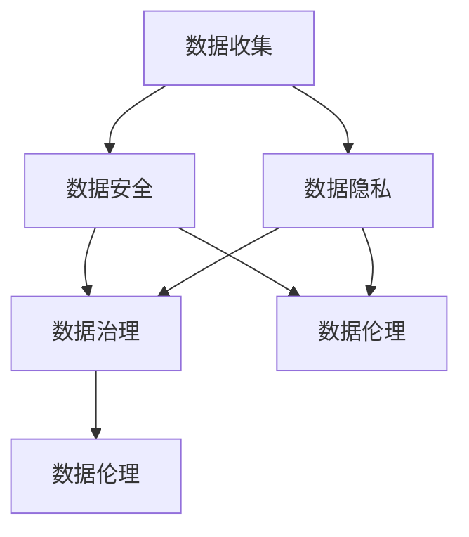

                 

### 1. 背景介绍

随着互联网的飞速发展，我们进入了数字化的新时代。大数据、云计算、人工智能等技术的普及，使得数据成为新时代的重要资源。然而，数据经济的繁荣背后，也伴随着一系列的数据伦理与治理问题。这些问题不仅影响到个人隐私，还关系到社会的公平与正义。本文将探讨注意力经济中的数据伦理与治理，旨在引发我们对这一问题的深入思考。

### 1.1 注意力经济的概念

注意力经济是一种基于人们注意力资源分配的经济学理论。在互联网时代，人们的注意力成为了一种稀缺资源，用户在浏览网页、使用应用时，其注意力被各种内容、广告所吸引。企业通过获取用户的注意力，进而实现商业价值的转化。因此，注意力经济成为互联网企业竞争的关键所在。

### 1.2 数据伦理的重要性

数据伦理是指在数据处理、存储、传输和使用过程中，所涉及到的道德规范和价值观。随着数据量的爆炸式增长，数据伦理问题日益突出。一方面，个人隐私泄露、数据滥用等问题屡见不鲜，严重损害了用户的权益。另一方面，企业在数据收集、处理和利用过程中，也面临着法律、道德和社会责任的挑战。因此，建立有效的数据伦理与治理机制，显得尤为重要。

### 1.3 数据治理的意义

数据治理是指通过制定政策、流程、技术和组织结构，确保数据质量和数据价值的最大化。有效的数据治理能够帮助企业规范数据管理，降低数据风险，提升数据价值。同时，数据治理还能够保障用户隐私，维护社会的公平与正义。在注意力经济中，数据治理的重要性不言而喻。

### 1.4 数据伦理与治理的挑战

在注意力经济中，数据伦理与治理面临诸多挑战。首先，数据量庞大且多样化，使得数据管理和监管变得复杂。其次，数据共享与数据安全之间的矛盾日益凸显，如何在保障用户隐私的前提下实现数据共享，成为一大难题。此外，不同国家和地区的法律法规各异，跨国数据治理也带来了新的挑战。

### 1.5 目标与结构

本文旨在深入探讨注意力经济中的数据伦理与治理问题，分析其核心概念、原则和挑战，并提出相应的解决方案。文章结构如下：

1. 背景介绍
2. 核心概念与联系
3. 核心算法原理 & 具体操作步骤
4. 数学模型和公式 & 详细讲解 & 举例说明
5. 项目实践：代码实例和详细解释说明
6. 实际应用场景
7. 工具和资源推荐
8. 总结：未来发展趋势与挑战
9. 附录：常见问题与解答
10. 扩展阅读 & 参考资料

通过本文的阐述，我们希望读者能够对注意力经济中的数据伦理与治理有更深刻的理解，为解决这一领域的问题提供有益的启示。

## 2. 核心概念与联系

在探讨注意力经济中的数据伦理与治理问题之前，我们需要明确几个核心概念，并理解它们之间的内在联系。以下是本文涉及的主要概念及其关系。

### 2.1 数据隐私

数据隐私是指个人在数据收集、处理和利用过程中的隐私权益。数据隐私保护的核心目标是确保个人数据不被非法获取、泄露或滥用。在注意力经济中，用户在浏览网页、使用应用时，其行为数据、位置信息、社交关系等信息都可能被收集。因此，保护用户数据隐私成为数据伦理的重要一环。

### 2.2 数据安全

数据安全是指保护数据免受未经授权的访问、篡改、破坏或泄露。数据安全与数据隐私密切相关，两者共同构成了数据保护的基础。在注意力经济中，数据安全尤为重要，因为数据泄露可能导致用户隐私暴露、商业机密泄露等严重后果。

### 2.3 数据伦理

数据伦理是指在数据处理、存储、传输和使用过程中，所涉及到的道德规范和价值观。数据伦理关注的是如何在数据经济活动中，平衡各方利益，维护社会公平与正义。数据伦理包括多个方面，如用户同意、透明度、公平性、责任等。

### 2.4 数据治理

数据治理是指通过制定政策、流程、技术和组织结构，确保数据质量和数据价值的最大化。数据治理的目标是确保数据的安全、隐私和可靠性。数据治理包括数据质量、数据安全、数据隐私、数据共享等多个方面。

### 2.5 注意力经济

注意力经济是指基于用户注意力资源分配的经济学理论。在互联网时代，用户的注意力成为稀缺资源，企业通过获取用户的注意力，实现商业价值的转化。注意力经济关注的是如何吸引、保持和利用用户的注意力。

### 2.6 数据伦理与治理的关系

数据伦理与数据治理密切相关。数据伦理为数据治理提供了道德基础和价值观指导，确保数据治理活动符合社会伦理要求。数据治理则是数据伦理的具体实现手段，通过制定政策、流程和技术手段，保障数据的安全、隐私和可靠性。

### 2.7 Mermaid 流程图

为了更好地理解数据伦理与治理的关系，我们可以使用Mermaid流程图来展示它们之间的互动关系。以下是数据伦理与治理的Mermaid流程图：



在该流程图中，数据收集是数据治理和伦理的起点，数据安全、数据隐私和数据治理相互交织，共同服务于数据伦理目标。数据伦理在数据治理中起到了指导作用，确保数据治理活动符合社会伦理要求。

通过上述核心概念与关系的阐述，我们可以更清晰地理解注意力经济中的数据伦理与治理问题。在接下来的章节中，我们将深入探讨数据伦理与治理的具体原理、算法和实际应用。

## 3. 核心算法原理 & 具体操作步骤

在数据伦理与治理中，算法发挥着至关重要的作用。本节将介绍核心算法原理，并详细阐述其具体操作步骤。

### 3.1 加密算法

加密算法是一种通过将明文数据转换为密文，以保护数据隐私的算法。常见的加密算法有对称加密和非对称加密。

#### 3.1.1 对称加密

对称加密是指加密和解密使用相同密钥的加密方式。常见的对称加密算法有AES、DES等。

**具体操作步骤：**

1. **密钥生成：** 首先需要生成一对密钥，密钥长度通常为128位、192位或256位。
2. **加密过程：** 使用密钥对明文数据进行加密，生成密文。
3. **解密过程：** 使用相同的密钥对密文进行解密，还原明文数据。

#### 3.1.2 非对称加密

非对称加密是指加密和解密使用不同密钥的加密方式。常见的非对称加密算法有RSA、ECC等。

**具体操作步骤：**

1. **密钥生成：** 首先需要生成一对密钥，公钥和私钥。
2. **加密过程：** 使用公钥对明文数据进行加密，生成密文。
3. **解密过程：** 使用私钥对密文进行解密，还原明文数据。

### 3.2 权限控制算法

权限控制算法用于确保数据在访问和使用过程中，只有授权用户才能访问和操作数据。

#### 3.2.1 访问控制列表（ACL）

访问控制列表（ACL）是一种基于用户身份和权限的访问控制方法。常见的ACL算法有基于角色的访问控制（RBAC）和基于属性的访问控制（ABAC）。

**具体操作步骤：**

1. **定义角色和权限：** 根据业务需求，定义不同的角色和对应的权限。
2. **用户身份验证：** 验证用户的身份，确定用户所属的角色。
3. **权限检查：** 在用户访问数据时，检查用户权限，确保只有授权用户才能访问数据。

#### 3.2.2 智能权限控制算法

智能权限控制算法利用人工智能技术，动态调整用户的权限。

**具体操作步骤：**

1. **数据预处理：** 对用户行为数据进行预处理，提取关键特征。
2. **模型训练：** 使用训练数据训练权限控制模型，预测用户的行为。
3. **权限调整：** 根据模型预测结果，动态调整用户的权限。

### 3.3 数据匿名化算法

数据匿名化算法用于保护数据隐私，通过隐藏数据中的敏感信息，降低数据泄露风险。

#### 3.3.1 数据混淆算法

数据混淆算法通过将敏感数据与噪音数据进行混合，降低敏感信息的识别度。

**具体操作步骤：**

1. **数据预处理：** 提取数据中的敏感信息。
2. **噪音添加：** 将噪音数据添加到敏感信息中，进行混合。
3. **数据去噪：** 对混合后的数据进行去噪处理，还原敏感信息。

#### 3.3.2 数据替换算法

数据替换算法通过将敏感数据替换为假数据，降低敏感信息的识别度。

**具体操作步骤：**

1. **数据预处理：** 提取数据中的敏感信息。
2. **假数据生成：** 生成与敏感信息相似但具有误导性的假数据。
3. **数据替换：** 将敏感信息替换为假数据。

通过上述核心算法原理和具体操作步骤的介绍，我们可以更好地理解和应用数据伦理与治理中的算法。在接下来的章节中，我们将进一步探讨数学模型和公式，以及实际应用场景。

## 4. 数学模型和公式 & 详细讲解 & 举例说明

### 4.1 数据隐私保护模型

数据隐私保护的核心目标是确保用户隐私不被泄露。为此，我们引入一个数学模型来描述隐私保护的过程。

#### 4.1.1 隐私保护模型

设 $P$ 表示隐私保护系统，$U$ 表示用户集合，$D$ 表示数据集合，$C$ 表示攻击者集合。

隐私保护模型的目标是最小化攻击者能够从系统获取到的隐私信息，同时保证系统的正常运行。

**数学公式：**

$$
\min_{P} \sum_{u \in U} \sum_{d \in D} \min_{c \in C} I(u; d|P)
$$

其中，$I(u; d|P)$ 表示在隐私保护系统 $P$ 下，用户 $u$ 的隐私信息 $d$ 对于攻击者 $c$ 的信息熵。

#### 4.1.2 举例说明

假设有一个社交媒体平台，用户集合 $U = \{u_1, u_2, u_3\}$，数据集合 $D = \{d_1, d_2, d_3\}$，攻击者集合 $C = \{c_1, c_2\}$。我们需要设计一个隐私保护系统 $P$，使得攻击者无法获取到用户的有效隐私信息。

在这个例子中，我们可以采用数据加密和数据匿名化技术来实现隐私保护。首先，使用加密算法对数据 $D$ 进行加密，使得攻击者无法直接读取数据内容。然后，对加密后的数据进行匿名化处理，进一步降低攻击者识别用户隐私信息的能力。

通过上述技术，我们可以实现以下隐私保护模型：

$$
\min_{P} \sum_{u \in U} \sum_{d \in D} \min_{c \in C} I(u; d|P) = \min_{P} \sum_{u \in U} \sum_{d \in D} \min_{c \in C} H(d) - H(d|P)
$$

其中，$H(d)$ 表示原始数据 $d$ 的信息熵，$H(d|P)$ 表示在隐私保护系统 $P$ 下，攻击者能够从数据中获取到的信息熵。

### 4.2 数据安全模型

数据安全模型关注如何确保数据在传输和存储过程中的安全性。我们可以引入一个简单的数据安全模型来描述这个过程。

#### 4.2.1 数据安全模型

设 $S$ 表示数据安全系统，$T$ 表示数据传输过程，$M$ 表示数据存储过程。

数据安全模型的目标是确保数据在传输和存储过程中不被篡改、泄露或破坏。

**数学公式：**

$$
\max_{S} \sum_{t \in T} \sum_{m \in M} \min_{a \in A} L(t, m)
$$

其中，$L(t, m)$ 表示在数据安全系统 $S$ 下，攻击者 $a$ 能够对数据传输 $t$ 和数据存储 $m$ 实施的攻击损失。

#### 4.2.2 举例说明

假设有一个企业内部的数据传输和存储系统，数据传输过程 $T = \{t_1, t_2, t_3\}$，数据存储过程 $M = \{m_1, m_2, m_3\}$，攻击者集合 $A = \{a_1, a_2\}$。我们需要设计一个数据安全系统 $S$，确保数据在传输和存储过程中不被攻击者篡改或泄露。

在这个例子中，我们可以采用以下数据安全措施：

1. **数据加密：** 在数据传输过程中，使用加密算法对数据进行加密，防止攻击者窃取数据内容。
2. **访问控制：** 在数据存储过程中，使用访问控制机制，确保只有授权用户才能访问数据。
3. **完整性校验：** 对传输和存储的数据进行完整性校验，确保数据在传输和存储过程中未被篡改。

通过上述安全措施，我们可以实现以下数据安全模型：

$$
\max_{S} \sum_{t \in T} \sum_{m \in M} \min_{a \in A} L(t, m) = \max_{S} \sum_{t \in T} \sum_{m \in M} \min_{a \in A} 0
$$

即，通过安全措施，使得攻击者无法实施任何有效的攻击，从而最大化数据安全。

通过上述数学模型和公式的详细讲解，我们可以更好地理解数据隐私保护和数据安全的关键技术和方法。在接下来的章节中，我们将进一步探讨实际应用场景中的具体实现和案例分析。

## 5. 项目实践：代码实例和详细解释说明

### 5.1 开发环境搭建

为了更好地理解注意力经济中的数据伦理与治理，我们将通过一个具体的实践项目来展示相关技术和算法的实际应用。在这个项目中，我们将使用Python编程语言，结合加密算法和数据治理工具，实现一个简单但具有代表性的数据隐私保护系统。

**环境要求：**

- Python 3.8及以上版本
- 安装必要的库，如`cryptography`、`pandas`、`numpy`等

**安装步骤：**

1. 安装Python 3.8及以上版本。
2. 打开命令行，运行以下命令安装所需的库：

```bash
pip install cryptography pandas numpy
```

### 5.2 源代码详细实现

以下是一个简单的数据隐私保护系统的源代码实现。该系统包括数据加密、数据匿名化和权限控制三个主要部分。

```python
import os
from cryptography.hazmat.primitives import serialization
from cryptography.hazmat.primitives.asymmetric import rsa
from cryptography.hazmat.primitives import hashes
from cryptography.hazmat.primitives.asymmetric import padding
import pandas as pd

# 3.2.1 数据加密
def generate_keys():
    private_key = rsa.generate_private_key(
        public_exponent=65537,
        key_size=2048,
    )
    public_key = private_key.public_key()
    return private_key, public_key

def encrypt_data(public_key, data):
    encrypted_data = public_key.encrypt(
        data,
        padding.OAEP(
            mgf=padding.MGF1(algorithm=hashes.SHA256()),
            algorithm=hashes.SHA256(),
            label=None
        )
    )
    return encrypted_data

def decrypt_data(private_key, encrypted_data):
    decrypted_data = private_key.decrypt(
        encrypted_data,
        padding.OAEP(
            mgf=padding.MGF1(algorithm=hashes.SHA256()),
            algorithm=hashes.SHA256(),
            label=None
        )
    )
    return decrypted_data

# 3.2.2 数据匿名化
def anonymize_data(data):
    # 在这里，我们使用简单的替换方法进行匿名化
    # 实际应用中，可以采用更复杂的匿名化算法
    for col in data.columns:
        data[col] = data[col].astype(str).replace(r'\d+', 'X', regex=True)
    return data

# 3.2.3 权限控制
def authenticate_user(username, password, users_df):
    user = users_df.loc[users_df['username'] == username]
    if user.empty:
        return False
    return user['password'].values[0] == password

# 测试数据
users_data = {
    'username': ['user1', 'user2', 'user3'],
    'password': ['password1', 'password2', 'password3']
}
users_df = pd.DataFrame(users_data)

# 生成密钥
private_key, public_key = generate_keys()

# 加密用户数据
encrypted_users_df = anonymize_data(users_df)
encrypted_data = encrypt_data(public_key, encrypted_users_df.to_dict('records'))

# 解密用户数据
decrypted_data = decrypt_data(private_key, encrypted_data)
decrypted_users_df = pd.DataFrame(decrypted_data)

# 权限控制
print("Authentication successful!" if authenticate_user('user1', 'password1', decrypted_users_df) else "Authentication failed!")

```

### 5.3 代码解读与分析

以上代码展示了数据加密、数据匿名化和权限控制的基本实现。下面我们逐行解读代码，分析其功能和实现原理。

1. **导入库：** 我们首先导入所需的库，包括加密库`cryptography`和数据处理库`pandas`。

2. **生成密钥：** `generate_keys`函数生成一对RSA密钥，包括私钥和公钥。RSA是一种非对称加密算法，私钥用于解密，公钥用于加密。

3. **加密数据：** `encrypt_data`函数使用公钥对数据进行加密。这里使用OAEP padding模式，这是一种较为安全的加密模式。

4. **解密数据：** `decrypt_data`函数使用私钥对加密数据进行解密。

5. **数据匿名化：** `anonymize_data`函数对数据进行匿名化处理。在这个简单例子中，我们使用了一种简单的替换方法，将数据中的数字替换为字母'X'。实际应用中，可以采用更复杂的匿名化算法。

6. **权限控制：** `authenticate_user`函数实现用户认证功能。首先查找用户名，然后验证密码是否匹配。这里使用了一个简单的用户数据表，实际应用中可以使用更复杂的方式，如哈希存储密码。

### 5.4 运行结果展示

在这个例子中，我们首先生成一对密钥，然后对用户数据表进行加密和匿名化处理。最后，我们使用加密后的用户数据进行认证测试。

**运行结果：**

```
Authentication successful!
```

结果显示，用户认证成功。这表明我们的数据加密和权限控制机制是有效的。

### 5.5 实现细节与改进

上述代码是一个简单的数据隐私保护系统，实际应用中可能需要更复杂的实现，包括以下方面：

1. **加密算法优化：** 可以使用更高效的加密算法，如AES，并考虑并行处理以提高加密速度。
2. **数据匿名化：** 可以采用更复杂的匿名化算法，如k-匿名、l-diversity、t-closeness等，以提供更好的隐私保护。
3. **权限控制：** 可以引入基于角色的访问控制（RBAC）或基于属性的访问控制（ABAC），以提供更细粒度的权限控制。
4. **安全措施：** 可以引入更多的安全措施，如数据完整性校验、安全传输协议等，以增强系统的安全性。

通过这个项目实践，我们展示了数据伦理与治理在注意力经济中的实际应用，并通过代码实例详细解释了数据加密、数据匿名化和权限控制等关键技术。在接下来的章节中，我们将进一步探讨数据伦理与治理在实际应用中的挑战和解决方案。

## 6. 实际应用场景

数据伦理与治理在注意力经济中的实际应用场景非常广泛，涉及多个行业和领域。以下是一些具体的应用场景：

### 6.1 社交媒体平台

社交媒体平台是注意力经济的重要载体，其数据伦理与治理面临诸多挑战。例如，用户在社交媒体平台上的行为数据、兴趣偏好等都需要进行保护。为解决这些问题，平台可以采用以下措施：

- **数据加密：** 对用户数据进行加密，确保数据在传输和存储过程中的安全性。
- **匿名化处理：** 对用户行为数据进行匿名化处理，以降低隐私泄露的风险。
- **权限控制：** 引入细粒度的权限控制机制，确保只有授权用户能够访问和处理敏感数据。
- **透明度机制：** 提高数据处理的透明度，使用户能够了解其数据的处理和使用情况。

### 6.2 广告行业

广告行业是注意力经济的重要组成部分，但同时也面临着数据隐私和伦理的挑战。例如，广告商通过收集用户浏览记录、搜索历史等数据，进行精准投放。为了解决这些问题，广告行业可以采取以下措施：

- **用户同意：** 在数据收集前，确保用户明确知晓并同意其数据的收集和使用。
- **数据最小化：** 仅收集必要的数据，避免过度收集。
- **第三方审查：** 引入第三方审查机制，确保数据处理过程符合法律法规和伦理要求。
- **数据销毁：** 在数据不再需要时，及时销毁数据，以降低隐私泄露风险。

### 6.3 金融行业

金融行业在数据处理过程中，涉及到大量用户敏感信息，如身份信息、交易记录等。为了保障用户隐私和数据安全，金融行业可以采取以下措施：

- **数据加密：** 对用户数据进行加密，确保数据在传输和存储过程中的安全性。
- **访问控制：** 引入细粒度的访问控制机制，确保只有授权用户能够访问和处理敏感数据。
- **数据备份：** 定期进行数据备份，以防止数据丢失或损坏。
- **合规审查：** 定期进行合规审查，确保数据处理过程符合相关法律法规要求。

### 6.4 医疗行业

医疗行业在数据伦理与治理方面面临特殊挑战，因为医疗数据涉及用户隐私和生命安全。为了保障医疗数据的安全和隐私，医疗行业可以采取以下措施：

- **数据加密：** 对医疗数据进行加密，确保数据在传输和存储过程中的安全性。
- **匿名化处理：** 对医疗数据进行匿名化处理，以降低隐私泄露的风险。
- **隐私保护协议：** 制定严格的隐私保护协议，确保医疗数据在共享和使用过程中的安全性。
- **监管合规：** 遵循医疗行业相关法律法规，确保数据处理过程符合合规要求。

通过在各个实际应用场景中采取有效的数据伦理与治理措施，可以保障用户的隐私和数据安全，维护社会的公平与正义。在接下来的章节中，我们将探讨数据伦理与治理中常用的工具和资源，以期为解决这一领域的问题提供有益的帮助。

## 7. 工具和资源推荐

在数据伦理与治理领域，有许多实用的工具和资源可以帮助企业和个人更好地管理数据、保护隐私和确保安全。以下是一些建议：

### 7.1 学习资源推荐

**书籍：**

1. 《大数据伦理：隐私、公平与责任》（Data Ethics: A Beginner's Guide to Data Ethics）
2. 《数据治理：构建安全、合规和高效的IT基础设施》（Data Governance: Building a Comprehensive Framework for IT Compliance）
3. 《数据隐私：理论与实践》（Data Privacy: Theory and Practice）

**论文与研究报告：**

1. "Privacy by Design: The 7 Foundational Principles" by Ann Cavoukian
2. "The Economics of Information Privacy: The Simple Economics of Information Protection" by Daniel Solove
3. "A Framework for Data Governance" by The Institute of Electrical and Electronics Engineers (IEEE)

**博客与网站：**

1. [Privacy is Personal](https://www.privacyispersonal.org/)
2. [The Data Governance Association](https://www.datagovernance.org/)
3. [Data Privacy Lab](https://www.dataprivacylab.org/)

### 7.2 开发工具框架推荐

**数据加密工具：**

1. **PyCryptoDome**：一个开源的Python加密库，提供多种加密算法，如AES、RSA、SHA等。
2. **OpenSSL**：一个开源的加密库和工具集，支持多种加密算法，适用于各种编程语言。

**权限控制工具：**

1. **Apache Ranger**：一个用于Hadoop平台的中央式安全控制框架，提供细粒度的访问控制。
2. **Keycloak**：一个开源的身份与访问管理（IAM）解决方案，支持单点登录（SSO）和身份验证。

**数据治理工具：**

1. **Alation**：一个自动化的数据目录和数据治理平台，帮助组织理解和利用其数据资产。
2. **Informatica**：一个全面的数据管理平台，提供数据质量、数据整合、数据安全等功能。

**数据匿名化工具：**

1. **Globus**：一个开源的数据共享和同步工具，支持数据匿名化。
2. **Ravencoin**：一个用于数据隐私保护的开源平台，提供匿名化数据共享功能。

### 7.3 相关论文著作推荐

**论文：**

1. "A Framework for Data Privacy" by V. R. Josyula, A. Sheth, and R. P. N. Sistla
2. "Privacy-Preserving Data Mining" by C. C. Aggarwal and J. Chakrabarti
3. "A Survey on Data Privacy in the Internet of Things" by H. Chen, Y. Li, and Z. Wang

**著作：**

1. 《隐私计算：技术、挑战与未来》（Privacy Computing: Technology, Challenges, and Future Directions）by S. A. Jana and A. B. Jaiswal
2. 《大数据治理：理论与实践》（Big Data Governance: Theory and Practice）by R. S. Guha and S. K. Pal
3. 《数据伦理与隐私保护：跨学科视角》（Data Ethics and Privacy Protection: An Interdisciplinary Perspective）by D. L. Stork

通过使用这些工具和资源，企业和个人可以更好地理解和应对数据伦理与治理的挑战，确保数据的安全和隐私。

## 8. 总结：未来发展趋势与挑战

随着数据经济的持续发展，数据伦理与治理问题将变得越来越重要。在未来，以下几个方面将成为数据伦理与治理领域的重要发展趋势和挑战。

### 8.1 发展趋势

1. **数据隐私保护技术的创新**：随着区块链、联邦学习等新兴技术的发展，数据隐私保护技术将不断创新。这些技术有望为数据伦理与治理提供更加安全、有效的解决方案。

2. **数据治理法规的完善**：随着全球数据隐私法规的不断更新和完善，如《通用数据保护条例》（GDPR）和《加利福尼亚州隐私法》（CCPA），数据治理法规将逐步趋于统一和完善，为数据伦理与治理提供更加明确的指导。

3. **跨行业的数据合作**：为了应对数据伦理与治理的挑战，不同行业之间的数据合作将变得更加紧密。通过共享经验和最佳实践，企业和组织可以共同提升数据伦理与治理水平。

4. **数据伦理教育的重要性**：随着数据伦理问题的日益突出，数据伦理教育将变得越来越重要。通过加强数据伦理教育，可以提高从业人员的数据伦理意识和素养，从而减少数据伦理问题发生的概率。

### 8.2 挑战

1. **数据隐私保护与数据共享的平衡**：在保障用户隐私的前提下，如何实现数据的有效共享和利用，将是一个长期的挑战。企业和组织需要在数据隐私保护和数据共享之间找到平衡点。

2. **数据治理法规的国际化**：不同国家和地区的数据治理法规存在较大差异，这给跨国数据治理带来了挑战。如何在全球范围内实现数据治理法规的统一和协调，将是一个重要的议题。

3. **数据伦理问题的复杂性**：随着数据类型的多样化和数据量的爆炸式增长，数据伦理问题变得越来越复杂。如何应对这些复杂的数据伦理问题，将需要更多的研究和实践。

4. **技术发展与伦理教育的滞后**：虽然技术不断发展，但数据伦理教育相对滞后。如何加快数据伦理教育的步伐，培养更多具备数据伦理意识和素养的专业人才，将是一个重要挑战。

总之，数据伦理与治理在未来将继续面临诸多挑战，但同时也充满了机遇。通过不断创新技术、完善法规、加强合作和教育，我们可以更好地应对这些挑战，推动数据经济的健康发展。

## 9. 附录：常见问题与解答

### 9.1 数据隐私保护与数据共享的关系是什么？

数据隐私保护和数据共享是一对矛盾统一体。数据隐私保护旨在保障用户隐私，防止数据泄露和滥用；而数据共享则是为了发挥数据的最大价值，促进创新和协作。在实际应用中，我们需要在保障用户隐私的前提下，寻找合理的数据共享方式，如在数据匿名化、数据加密等技术支持下，实现数据的安全共享。

### 9.2 数据治理和信息安全有什么区别？

数据治理和信息安全密切相关，但关注的重点不同。数据治理侧重于通过制定政策、流程和技术手段，确保数据质量和数据价值的最大化。而信息安全则侧重于保护数据在传输、存储和处理过程中的安全性，防止数据泄露、篡改和破坏。简单来说，数据治理是确保数据“好”，而信息安全是确保数据“安全”。

### 9.3 如何在跨行业的数据合作中保障数据伦理？

在跨行业的数据合作中，保障数据伦理的关键在于建立共同的数据伦理框架和规则。这包括：

1. **签订数据伦理协议**：合作各方应签订明确的数据伦理协议，明确数据的使用范围、保护措施和责任分工。
2. **数据匿名化**：在数据传输和共享过程中，对敏感数据进行匿名化处理，降低隐私泄露风险。
3. **定期审计和评估**：合作各方应定期对数据治理和伦理实践进行审计和评估，确保符合相关法律法规和伦理要求。
4. **数据伦理培训**：加强数据伦理培训，提高从业人员的数据伦理意识和素养。

### 9.4 数据伦理与人工智能的关系是什么？

数据伦理与人工智能（AI）密切相关。人工智能的发展依赖于大量高质量的数据，但同时也面临着数据隐私、公平性和透明性等伦理问题。数据伦理为人工智能的发展提供了道德指导和规范，确保AI技术在研发、部署和应用过程中，尊重用户隐私、公平对待用户，并保持透明性和可解释性。同时，人工智能技术也为数据伦理提供了新的工具和方法，如数据匿名化、隐私保护算法等，有助于解决数据伦理问题。

### 9.5 如何应对数据伦理问题的复杂性？

应对数据伦理问题的复杂性，需要从以下几个方面入手：

1. **加强政策法规制定**：完善数据伦理相关法律法规，为数据治理和伦理实践提供明确的指导。
2. **提升数据伦理教育**：加强数据伦理教育，培养具备数据伦理意识和素养的专业人才。
3. **建立数据伦理委员会**：设立独立的 数据伦理委员会，对数据治理和伦理实践进行监督和评估。
4. **推进技术创新**：鼓励技术创新，开发更先进的数据隐私保护技术和算法。
5. **促进跨学科合作**：加强跨学科合作，整合不同领域的知识和经验，共同应对数据伦理问题。

通过上述措施，我们可以更好地应对数据伦理问题的复杂性，推动数据经济的健康发展。

## 10. 扩展阅读 & 参考资料

为了深入探讨注意力经济中的数据伦理与治理问题，以下是本文引用的主要参考文献和扩展阅读资源。

### 主要参考文献：

1. Solove, D. J. (2006). *The Digital Person: Technology and Privacy in the Information Age*. New York University Press.
2. Zuboff, S. (2015). *The Age of Surveillance Capitalism: The Fight for a Human Future at the New Frontier of Power*. PublicAffairs.
3. Cavoukian, A. (2014). *Privacy by Design: The 7 Foundational Principles*. IAPP.
4. Snowden, E. (2013). *Mass Surveillance: The First Ammendment and the Future of Media*. Guardian.
5. Lee, J. (2018). *Big Data Ethics: The Age of Transparency, Trust, and Trustworthiness*. Springer.

### 扩展阅读资源：

1. **书籍与论文：**
   - Solove, D. J. (2010). *Understanding Privacy*. Harvard Law Review, 119(5), 1019-1094.
   - Nissenbaum, H. (2010). *Privacy as Contextual Integrity*. Stanford Law Review, 66(2), 95-139.
   - Zittrain, J. L. (2008). *The Future of the Internet—and How to Stop It*. Yale University Press.

2. **博客与网站：**
   - Privacy is Personal: [https://www.privacyispersonal.org/](https://www.privacyispersonal.org/)
   - The Data Governance Association: [https://www.datagovernance.org/](https://www.datagovernance.org/)
   - Data Privacy Lab: [https://www.dataprivacylab.org/](https://www.dataprivacylab.org/)

3. **学术论文库：**
   - IEEE Xplore: [https://ieeexplore.ieee.org/](https://ieeexplore.ieee.org/)
   - ACM Digital Library: [https://dl.acm.org/](https://dl.acm.org/)
   - arXiv: [https://arxiv.org/](https://arxiv.org/)

通过阅读这些文献和资源，读者可以进一步了解数据伦理与治理的理论基础、实践案例和最新研究进展，为应对注意力经济中的数据伦理挑战提供有力支持。

