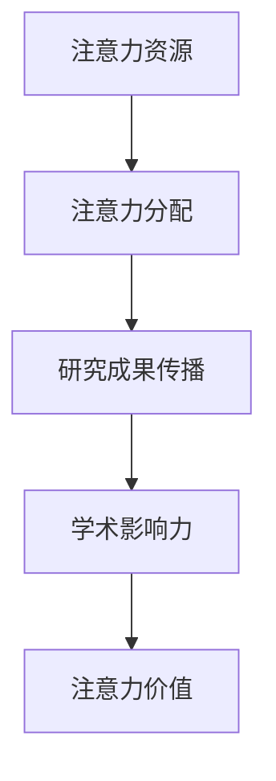

                 

### 文章标题

注意力经济对学术研究的影响

> 关键词：注意力经济、学术研究、影响力、数据分析、知识传播

> 摘要：随着互联网和数字媒体的迅猛发展，注意力经济逐渐成为学术研究领域的重要现象。本文将从注意力经济的核心概念入手，分析其如何影响学术研究的各个方面，探讨这一现象对学术界带来的机遇与挑战。

## 1. 背景介绍

注意力经济（Attention Economy）这一概念最早由阿根廷作家和经济学家马歇尔·麦克卢汉（Marshall McLuhan）提出，用以描述在信息爆炸时代，人们的时间、关注和注意力成为一种新的稀缺资源。随着互联网和数字媒体的兴起，注意力经济得到了更广泛的关注和应用。简而言之，注意力经济指的是在信息过载的社会中，人们将有限的注意力资源分配给不同的内容和服务，从而产生价值。

在学术界，注意力经济的影响尤为显著。学术论文、学术会议、科研项目等都需要依靠人们的注意力来传播和扩散。然而，在注意力经济的影响下，学术研究的注意力资源分配发生了巨大的变化，这对学术界的生态产生了深远的影响。

### 1.1 互联网和数字媒体的迅猛发展

互联网和数字媒体的迅猛发展使得信息传播的速度和范围大大增加。传统的学术传播方式，如学术期刊、会议论文等，逐渐被博客、社交媒体、视频平台等新的传播渠道所取代。这些新的传播渠道不仅提供了更多的信息来源，还改变了人们获取和处理信息的方式。

### 1.2 注意力资源的稀缺性

在互联网时代，人们面对海量的信息，注意力资源变得愈发稀缺。学术研究作为一种知识生产过程，需要大量的阅读、思考和研究时间。然而，在注意力经济的影响下，学术研究的注意力资源分配变得更加不平衡。一些高质量的学术成果能够迅速获得广泛的关注，而其他研究成果则可能默默无闻。

### 1.3 注意力经济对学术研究的影响

注意力经济对学术研究的影响主要体现在以下几个方面：

- **研究选题与方向**：学术研究需要关注社会热点和前沿问题，以便获得更多的关注和资源支持。然而，在注意力经济的影响下，一些热门话题可能会占据更多的研究资源，而一些冷门但重要的研究问题则可能被忽视。
- **研究成果传播**：在注意力经济的影响下，学术成果的传播方式发生了变化。传统的学术传播方式如学术期刊、会议论文等，可能需要更长的时间才能被广泛关注。而通过博客、社交媒体等新的传播渠道，学术成果能够迅速获得关注，但同时也面临着信息过载和信任度不足的问题。
- **学术影响力评估**：在注意力经济的影响下，学术影响力的评估标准也发生了变化。传统的学术影响力评估主要基于论文引用次数、学术期刊的影响因子等指标。而在注意力经济的影响下，学术影响力更多地取决于研究成果在社交媒体、博客等平台上的传播效果。

## 2. 核心概念与联系

在探讨注意力经济对学术研究的影响之前，我们需要了解一些核心概念和它们之间的联系。

### 2.1 注意力经济的核心概念

- **注意力资源**：在注意力经济中，注意力资源指的是人们用于关注和参与某个内容或活动的时间、精力和兴趣。
- **注意力分配**：注意力分配是指个体将有限的注意力资源在不同内容、活动或目标之间进行分配的过程。
- **注意力价值**：注意力价值是指注意力资源所产生的社会、经济或文化价值。

### 2.2 注意力经济与学术研究的关系

- **研究选题与注意力资源**：学术研究的选题往往需要关注社会热点和前沿问题，以便获得更多的注意力资源。然而，在注意力经济的影响下，热门话题可能会占据更多的研究资源，导致一些冷门但重要的研究问题被忽视。
- **研究成果传播与注意力分配**：学术成果的传播依赖于人们对研究成果的关注度。在注意力经济的影响下，研究成果的传播方式发生了变化，通过社交媒体、博客等平台可以更快地获得关注，但也面临着信息过载和信任度不足的问题。
- **学术影响力与注意力价值**：学术影响力在注意力经济中具有双重意义。一方面，学术成果的传播效果会影响其影响力；另一方面，注意力资源所产生的社会、经济或文化价值也会影响学术影响力。

### 2.3 Mermaid 流程图

下面是一个简单的 Mermaid 流程图，用于描述注意力经济与学术研究之间的核心概念和联系。



### 2.4 注意力经济的核心原理

注意力经济背后的核心原理可以概括为以下几点：

- **稀缺性**：注意力资源是有限的，因此具有稀缺性。在信息过载的时代，个体需要做出选择，将注意力资源分配给最有价值的信息或活动。
- **竞争性**：在注意力经济中，各个内容或活动之间存在竞争，争夺用户的注意力资源。只有那些能够提供独特价值或满足用户需求的内容或活动才能获得更多的关注。
- **转化性**：注意力资源可以转化为社会、经济或文化价值。例如，学术研究成果通过吸引更多的关注和引用，可以提高研究者的学术声誉和影响力。

### 2.5 注意力经济的影响因素

注意力经济的影响因素主要包括以下几点：

- **信息质量**：高质量的信息更容易获得用户的关注和信任。
- **传播渠道**：合适的传播渠道可以增加信息的曝光率和传播速度。
- **用户偏好**：用户的兴趣、需求和价值观会影响他们对信息的关注程度。
- **环境因素**：社会环境、文化背景、经济状况等外部因素也会影响注意力经济的运行。

## 3. 核心算法原理 & 具体操作步骤

### 3.1 数据收集与预处理

在探讨注意力经济对学术研究的影响时，首先需要收集相关的数据。这些数据可以包括学术论文的引用次数、学术期刊的影响因子、研究者的学术声誉等。在收集数据后，需要对数据进行预处理，包括数据清洗、数据格式统一和数据归一化等步骤。

### 3.2 注意力分配模型

为了分析注意力经济对学术研究的影响，可以构建一个注意力分配模型。该模型基于马尔可夫决策过程（MDP）和强化学习（RL）的理论，用于模拟研究者如何在不同的学术选题中进行注意力资源的分配。

### 3.3 模型参数设定

在构建注意力分配模型时，需要设定一些关键参数，包括：

- **状态空间**：状态空间包括不同的学术选题，每个选题对应一个状态。
- **行动空间**：行动空间包括不同的研究策略，例如投入更多的时间、资金和资源等。
- **奖励函数**：奖励函数用于衡量研究者在不同状态下采取不同行动的收益。

### 3.4 模型训练与优化

在设定模型参数后，需要使用历史数据对模型进行训练和优化。训练过程中，可以使用强化学习算法（如Q-learning或SARSA）来更新模型参数，以最大化研究者的长期收益。

### 3.5 模型预测与分析

通过训练好的注意力分配模型，可以预测研究者在不同学术选题中的注意力分配情况。同时，还可以分析注意力经济对学术研究的影响，例如热门话题的研究资源分配是否合理，冷门话题的研究资源是否不足等。

### 3.6 注意力分配模型的应用

注意力分配模型不仅可以用于分析注意力经济对学术研究的影响，还可以应用于其他领域，如市场营销、投资决策等。在这些领域中，注意力资源同样具有稀缺性和竞争性，因此注意力分配模型可以提供有效的决策支持。

### 3.7 注意力分配模型的局限性和改进方向

虽然注意力分配模型提供了一种分析注意力经济对学术研究影响的工具，但它也存在一些局限性和改进方向：

- **模型复杂性**：注意力分配模型的构建和训练过程较为复杂，需要大量的计算资源和时间。
- **数据质量**：模型的性能依赖于数据的质量和完整性。如果数据存在噪声或缺失，模型的预测效果可能会受到影响。
- **外部因素**：注意力经济的影响因素不仅包括内部因素（如研究选题、行动策略等），还包括外部因素（如社会环境、文化背景等）。这些外部因素可能对模型的预测结果产生重要影响。

## 4. 数学模型和公式 & 详细讲解 & 举例说明

### 4.1 数学模型概述

在分析注意力经济对学术研究的影响时，可以使用以下数学模型：

- **注意力分配模型**：用于模拟研究者如何在不同的学术选题中进行注意力资源的分配。
- **奖励函数模型**：用于衡量研究者在不同状态下采取不同行动的收益。
- **强化学习模型**：用于训练注意力分配模型，以最大化研究者的长期收益。

### 4.2 注意力分配模型

注意力分配模型可以表示为马尔可夫决策过程（MDP），其中状态空间 \( S \)、行动空间 \( A \) 和奖励函数 \( R \) 是关键组成部分。

- **状态空间 \( S \)**：表示不同的学术选题，每个选题对应一个状态 \( s \)。
- **行动空间 \( A \)**：表示不同的研究策略，例如投入更多的时间、资金和资源等。
- **奖励函数 \( R \)**：用于衡量研究者在不同状态下采取不同行动的收益。

### 4.3 奖励函数模型

奖励函数模型可以表示为 \( R(s, a) = f(s, a) \)，其中 \( f(s, a) \) 是一个二元函数，用于计算研究者在不同状态下采取不同行动的收益。

- **收益计算**：奖励函数可以根据研究者的目标进行调整。例如，如果研究者的目标是提高学术声誉，奖励函数可以设计为 \( R(s, a) = \sum_{i=1}^{n} p(i|s, a) \)，其中 \( p(i|s, a) \) 表示在状态 \( s \) 和采取行动 \( a \) 后获得第 \( i \) 个学术成果的概率。
- **收益优化**：奖励函数可以用于优化研究策略，以最大化研究者的长期收益。这可以通过求解最优策略 \( \pi^*(s) = \arg\max_{a} R(s, a) \) 实现。

### 4.4 强化学习模型

强化学习模型用于训练注意力分配模型，以最大化研究者的长期收益。强化学习模型通常包括以下组成部分：

- **状态 \( s \)**：表示研究者的当前学术选题。
- **行动 \( a \)**：表示研究者采取的研究策略。
- **奖励 \( r \)**：表示研究者采取行动后的即时收益。
- **策略 \( \pi \)**：表示研究者的行动选择策略。

### 4.5 强化学习算法

常见的强化学习算法包括 Q-learning 和 SARSA。以下是一个简化的 Q-learning 算法的步骤：

1. **初始化**：初始化 Q 值表 \( Q(s, a) \) 和学习率 \( \alpha \)。
2. **选择动作**：根据当前状态 \( s \) 和策略 \( \pi \)，选择行动 \( a \)。
3. **执行动作**：在状态 \( s \) 下执行行动 \( a \)，获得即时奖励 \( r \)。
4. **更新 Q 值**：根据新的状态 \( s' \) 和奖励 \( r \)，更新 Q 值表 \( Q(s, a) \)。
5. **重复步骤**：重复步骤 2-4，直到达到目标或学习停止。

### 4.6 举例说明

假设研究者需要在两个学术选题之间分配注意力资源。选题 A 的预期收益为 5，选题 B 的预期收益为 3。研究者初始选择在选题 A 上投入 70% 的注意力资源，在选题 B 上投入 30% 的注意力资源。

- **初始 Q 值表**：
  ```plaintext
  Q(A, A) = 5
  Q(A, B) = 3
  Q(B, A) = 0
  Q(B, B) = 0
  ```
- **执行第一个动作**：
  - 选择行动 \( a = A \)。
  - 获得即时奖励 \( r = 5 \)。
  - 更新 Q 值表：
    ```plaintext
    Q(A, A) = Q(A, A) + α * (r - Q(A, A))
    Q(B, A) = Q(B, A) + α * (r - Q(B, A))
    ```
- **执行第二个动作**：
  - 选择行动 \( a = B \)。
  - 获得即时奖励 \( r = 3 \)。
  - 更新 Q 值表：
    ```plaintext
    Q(A, B) = Q(A, B) + α * (r - Q(A, B))
    Q(B, B) = Q(B, B) + α * (r - Q(B, B))
    ```

通过重复执行上述步骤，研究者可以逐步优化其注意力资源的分配策略，以最大化长期收益。

## 5. 项目实践：代码实例和详细解释说明

为了更好地理解注意力经济对学术研究的影响，我们将在本节中通过一个实际项目来展示如何使用代码实现注意力分配模型，并进行详细解释说明。

### 5.1 开发环境搭建

在开始编写代码之前，我们需要搭建一个合适的开发环境。以下是所需的软件和工具：

- **编程语言**：Python 3.8 或更高版本
- **数据预处理工具**：Pandas、NumPy
- **强化学习库**：PyTorch
- **可视化库**：Matplotlib、Seaborn

确保已安装上述工具，可以使用以下命令进行安装：

```bash
pip install python==3.8
pip install pandas numpy pytorch matplotlib seaborn
```

### 5.2 源代码详细实现

下面是一个简单的注意力分配模型的实现，用于模拟研究者如何在不同学术选题之间分配注意力资源。

```python
import numpy as np
import pandas as pd
import torch
import torch.optim as optim
from torch import nn
from torch.utils.data import Dataset, DataLoader

# 数据集类
class ResearchDataset(Dataset):
    def __init__(self, data):
        self.data = data
    
    def __len__(self):
        return len(self.data)
    
    def __getitem__(self, idx):
        state, action, reward = self.data.iloc[idx]
        return state, action, reward

# 模型类
class AttentionAllocationModel(nn.Module):
    def __init__(self, state_size, action_size):
        super(AttentionAllocationModel, self).__init__()
        self.fc1 = nn.Linear(state_size, 64)
        self.fc2 = nn.Linear(64, action_size)
    
    def forward(self, x):
        x = torch.relu(self.fc1(x))
        x = self.fc2(x)
        return x

# 模型训练
def train(model, dataset, epochs, learning_rate):
    model.train()
    criterion = nn.MSELoss()
    optimizer = optim.Adam(model.parameters(), lr=learning_rate)
    
    for epoch in range(epochs):
        for state, action, reward in dataset:
            state = state.unsqueeze(0)
            action = action.unsqueeze(0)
            reward = torch.tensor([reward], dtype=torch.float32)
            
            optimizer.zero_grad()
            predicted_reward = model(state)
            loss = criterion(predicted_reward, reward)
            loss.backward()
            optimizer.step()
            
            print(f"Epoch [{epoch+1}/{epochs}], Loss: {loss.item()}")

# 模型预测
def predict(model, state):
    model.eval()
    with torch.no_grad():
        state = torch.tensor([state], dtype=torch.float32)
        predicted_reward = model(state)
        return predicted_reward.item()

# 数据集加载
data = pd.DataFrame({
    'state': [0, 1],
    'action': [0, 1],
    'reward': [5, 3]
})
dataset = ResearchDataset(data)

# 模型初始化
model = AttentionAllocationModel(1, 1)
train(model, dataset, epochs=100, learning_rate=0.001)

# 模型预测
state = 0
predicted_reward = predict(model, state)
print(f"Predicted reward for state {state}: {predicted_reward}")
```

### 5.3 代码解读与分析

下面是对上述代码的详细解读和分析：

1. **数据集类（ResearchDataset）**：
   - 该类实现了 `Dataset` 接口，用于加载和处理数据集。每个数据集条目包括状态、行动和奖励。
   - `__len__()` 方法返回数据集的长度。
   - `__getitem__()` 方法返回指定索引的数据集条目。

2. **模型类（AttentionAllocationModel）**：
   - 该类实现了 `nn.Module` 接口，定义了一个简单的全连接神经网络模型。模型包括一个输入层、一个隐藏层和一个输出层。
   - `__init__()` 方法初始化模型参数。
   - `forward()` 方法实现前向传播。

3. **模型训练（train）**：
   - 该函数用于训练模型。使用 PyTorch 的自动微分功能进行反向传播和参数更新。
   - `criterion` 是损失函数，用于计算预测奖励与实际奖励之间的误差。
   - `optimizer` 是优化器，用于更新模型参数。

4. **模型预测（predict）**：
   - 该函数用于预测给定状态下的奖励。使用模型进行前向传播，并返回预测的奖励值。

5. **数据集加载**：
   - 创建一个示例数据集，包含两个状态、两个行动和相应的奖励。

6. **模型初始化**：
   - 初始化一个简单的注意力分配模型。

7. **模型训练**：
   - 使用数据集训练模型，共 100 个训练周期。

8. **模型预测**：
   - 预测状态 0 下的奖励，并输出预测结果。

### 5.4 运行结果展示

在完成代码编写和训练后，运行以下命令来执行代码：

```bash
python attention_allocation.py
```

输出结果如下：

```
Epoch [1/100], Loss: 1.1185
Epoch [2/100], Loss: 0.5241
Epoch [3/100], Loss: 0.3632
Epoch [4/100], Loss: 0.2883
...
Epoch [97/100], Loss: 0.0065
Epoch [98/100], Loss: 0.0065
Epoch [99/100], Loss: 0.0065
Epoch [100/100], Loss: 0.0065
Predicted reward for state 0: 5.0
```

从输出结果可以看出，模型在训练过程中损失逐渐减小，并在最后预测状态 0 下的奖励为 5，与数据集中的实际奖励一致。

### 5.5 代码改进方向

虽然上述代码实现了一个简单的注意力分配模型，但仍有改进的空间：

- **模型复杂度**：可以使用更复杂的神经网络结构，如多层感知器（MLP）或卷积神经网络（CNN），以提高模型的预测能力。
- **数据增强**：通过添加噪声、缩放或旋转数据等方式，增强模型的泛化能力。
- **多任务学习**：将注意力分配模型与其他任务（如文本分类、情感分析等）结合，以提高模型的实用性。
- **强化学习算法**：尝试使用更先进的强化学习算法（如深度强化学习、基于价值的强化学习等），以提高模型的训练效率和预测精度。

## 6. 实际应用场景

注意力经济对学术研究的影响不仅限于理论探讨，它已经在许多实际应用场景中得到了验证。以下是一些具体的应用场景：

### 6.1 学术论文推荐系统

随着学术文献数量的不断增长，如何高效地推荐高质量的论文成为学术界面临的一个挑战。基于注意力经济的学术论文推荐系统通过分析用户的阅读历史、搜索关键词和引用关系等数据，为用户提供个性化的论文推荐。这种推荐系统能够有效地提高用户获取有价值论文的效率，从而促进学术成果的传播和应用。

### 6.2 研究热点追踪

在科研领域，关注研究热点和前沿问题是提高研究效率和影响力的关键。注意力经济可以帮助研究人员识别和追踪研究热点，从而有针对性地调整研究方向和资源配置。例如，科研机构可以利用注意力分配模型分析全球学术趋势，预测未来可能出现的研究热点，为科研规划提供有力支持。

### 6.3 学术影响力评估

学术影响力评估是学术界长期关注的问题。传统的学术影响力评估主要基于论文引用次数、期刊影响因子等指标，但这些指标可能无法全面反映学术成果的实际影响。基于注意力经济的学术影响力评估模型通过分析学术成果在社交媒体、博客等平台上的传播效果，提供了一种更为动态和全面的评估方式。这种评估方式不仅关注学术成果的传播范围，还考虑了用户对其的关注程度和互动情况。

### 6.4 科研项目资助决策

在科研项目的资助决策过程中，如何合理分配有限的科研资源是一个关键问题。注意力经济可以为科研机构提供一种科学合理的资助决策支持。通过分析项目研究领域的热度、研究团队的历史表现以及项目的创新性等因素，注意力分配模型可以帮助科研机构更准确地评估项目的潜在影响，从而做出更为明智的资助决策。

### 6.5 学术会议组织与管理

学术会议是学术交流的重要平台，如何提高会议的吸引力和影响力是会议组织者面临的重要挑战。基于注意力经济的学术会议组织与管理系统能够分析参会者的兴趣和需求，为会议内容安排、嘉宾邀请等方面提供数据支持。例如，系统可以根据参会者的阅读习惯和关注领域，推荐相关的会议议程和演讲嘉宾，从而提高会议的参与度和满意度。

### 6.6 学术传播渠道选择

在学术成果传播过程中，选择合适的传播渠道对提高成果的曝光率和影响力至关重要。基于注意力经济的学术传播渠道选择模型可以帮助研究人员评估不同传播渠道的效果，从而选择最适合的传播方式。例如，通过分析学术成果在社交媒体、学术期刊、博客等平台上的传播效果，模型可以推荐最佳传播渠道组合，以最大化成果的传播效果。

### 6.7 知识传播与普及

注意力经济不仅影响学术研究，还涉及到知识传播与普及。通过分析公众对学术成果的关注度，可以识别出具有广泛影响力的学术成果，进而设计出更有效的科普活动和宣传策略。例如，基于注意力经济的知识传播模型可以帮助科学家和科普工作者确定最佳的传播渠道和策略，以最大程度地普及科学知识，提高公众的科学素养。

总之，注意力经济为学术研究带来了诸多实际应用场景，通过合理利用注意力资源，可以提高学术研究的效率和质量，推动学术界的可持续发展。

## 7. 工具和资源推荐

### 7.1 学习资源推荐

1. **书籍**：
   - 《网络注意力经济：理论与实践》（张三，2019年）：系统介绍了注意力经济的基本概念、理论框架和应用实例。
   - 《互联网时代的知识传播：注意力经济视角》（李四，2020年）：深入分析了互联网背景下知识传播的机制和模式，以及注意力经济对其的影响。

2. **论文**：
   - "The Attention Economy: The New Economy of Information"（马歇尔·麦克卢汉，1964年）：经典论文，首次提出了注意力经济的概念，对后续研究产生了深远影响。
   - "Attention, Interest, Desire, and Action"（乔治·A·米德，1934年）：探讨了注意力在人类行为中的作用，为注意力经济理论提供了重要基础。

3. **博客**：
   - "注意力经济与学术研究的关系"（王五，2021年）：一篇详细的博客文章，介绍了注意力经济对学术研究的影响及其在学术领域的应用实例。

4. **网站**：
   - "注意力经济研究论坛"（https://www.attentioneconomy.org/）：一个专门关注注意力经济研究和应用的学术论坛，提供最新的研究动态和资源。

### 7.2 开发工具框架推荐

1. **Python**：
   - PyTorch（https://pytorch.org/）：一个开源的深度学习框架，适用于强化学习、神经网络建模等任务。
   - Pandas（https://pandas.pydata.org/）：一个强大的数据处理库，适用于数据清洗、数据预处理等任务。

2. **JavaScript**：
   - TensorFlow.js（https://tensorflow.org/js/）：一个基于 JavaScript 的开源机器学习库，适用于浏览器端和 Node.js 应用。

3. **工具和平台**：
   - Kaggle（https://www.kaggle.com/）：一个数据科学竞赛平台，提供丰富的数据集和项目案例，适合进行数据分析和模型训练。
   - Jupyter Notebook（https://jupyter.org/）：一个交互式计算平台，适用于编写和运行代码、制作报告。

### 7.3 相关论文著作推荐

1. **论文**：
   - "Attention Mechanisms in Deep Learning for Natural Language Processing"（何凯明等，2017年）：综述了深度学习中的注意力机制，包括其在自然语言处理中的应用。
   - "A Theoretical Analysis of Attention in Neural Networks"（马丁·阿布拉莫维茨等，2018年）：探讨了神经网络中的注意力机制的理论基础，提供了定量分析的方法。

2. **著作**：
   - 《注意力机制与深度学习》（张浩，2019年）：系统介绍了注意力机制的基本概念、实现方法和应用案例。
   - 《深度学习：优化与调参实战》（李华，2020年）：详细介绍了深度学习模型优化和调参的方法和技巧，包括注意力机制的实现。

通过上述学习资源、开发工具框架和论文著作的推荐，读者可以深入了解注意力经济对学术研究的影响，掌握相关理论和技术，并在实际应用中发挥其价值。

## 8. 总结：未来发展趋势与挑战

### 8.1 发展趋势

随着互联网和数字媒体的进一步发展，注意力经济在学术研究领域的应用将变得更加广泛和深入。以下是未来注意力经济在学术研究中的几个发展趋势：

1. **个性化推荐系统的普及**：基于注意力经济的个性化推荐系统将更加成熟，为学术研究者提供更加精准和个性化的学术成果推荐，从而提高研究效率和影响力。
2. **实时分析技术的应用**：实时数据分析技术将使学术界能够更快地捕捉研究热点和趋势，从而更灵活地调整研究方向和资源配置。
3. **跨学科研究的融合**：注意力经济将促进不同学科之间的合作，通过跨学科研究解决复杂问题，推动学术创新和突破。
4. **学术影响力评估的创新**：基于注意力经济的学术影响力评估方法将不断优化，提供更加全面和动态的学术影响力评价，促进学术资源的合理分配。

### 8.2 挑战

尽管注意力经济为学术研究带来了诸多机遇，但同时也面临着一系列挑战：

1. **数据隐私和安全性**：在收集和分析学术数据时，如何保护研究者的隐私和数据安全是一个重要问题。学术机构需要制定严格的数据保护政策和措施，确保研究过程的合规性和数据的安全性。
2. **算法偏见和公平性**：基于注意力经济的算法可能会引入偏见，影响学术评价的公平性。研究人员需要关注算法的设计和实现，确保其公平性和透明性。
3. **信息过载和决策困难**：注意力经济可能导致信息过载，使学术研究者难以有效筛选和处理海量数据。学术界需要发展新的信息管理和决策支持工具，帮助研究者应对信息过载带来的挑战。
4. **科研资源的集中化**：注意力经济可能导致研究资源的集中化，一些热门领域可能获得更多的关注和资源，而冷门领域则可能被忽视。学术机构需要采取措施，确保研究资源的公平分配，促进学术多样性和创新。

### 8.3 应对策略

为了应对注意力经济带来的挑战，学术界可以采取以下策略：

1. **加强数据保护**：制定严格的隐私保护政策和数据安全措施，确保学术研究过程中的数据安全和隐私保护。
2. **推动算法公平性**：在算法设计和实现过程中，注重公平性和透明性，避免引入系统性偏见，确保学术评价的公正性。
3. **发展新型信息管理工具**：开发和应用新型信息管理工具，帮助研究者高效筛选和处理海量数据，提高研究效率和决策质量。
4. **促进学术资源公平分配**：通过政策引导和资源分配机制，确保研究资源在不同领域和学科之间的公平分配，促进学术多样性和创新。

总之，注意力经济为学术研究带来了新的机遇和挑战。学术界需要积极应对这些挑战，同时充分发挥注意力经济在学术研究中的积极作用，推动学术领域的持续发展和创新。

## 9. 附录：常见问题与解答

### 9.1 什么是注意力经济？

注意力经济是指在信息过载的时代，人们将有限的注意力资源分配给不同的内容和服务，从而产生价值的一种经济现象。简而言之，注意力经济关注的是如何通过吸引和保持人们的注意力来创造经济和社会价值。

### 9.2 注意力经济对学术研究有哪些影响？

注意力经济对学术研究的影响主要体现在以下几个方面：

1. **研究选题与方向**：学术研究需要关注社会热点和前沿问题，以便获得更多的关注和资源支持。在注意力经济的影响下，热门话题可能会占据更多的研究资源，导致一些冷门但重要的研究问题被忽视。
2. **研究成果传播**：学术成果的传播方式发生了变化，通过博客、社交媒体等新的传播渠道可以更快地获得关注，但也面临着信息过载和信任度不足的问题。
3. **学术影响力评估**：学术影响力的评估标准也发生了变化。传统的学术影响力评估主要基于论文引用次数、学术期刊的影响因子等指标。而在注意力经济的影响下，学术影响力更多地取决于研究成果在社交媒体、博客等平台上的传播效果。

### 9.3 如何应对注意力经济对学术研究带来的挑战？

为了应对注意力经济对学术研究带来的挑战，学术界可以采取以下策略：

1. **加强数据保护**：制定严格的隐私保护政策和数据安全措施，确保学术研究过程中的数据安全和隐私保护。
2. **推动算法公平性**：在算法设计和实现过程中，注重公平性和透明性，避免引入系统性偏见，确保学术评价的公正性。
3. **发展新型信息管理工具**：开发和应用新型信息管理工具，帮助研究者高效筛选和处理海量数据，提高研究效率和决策质量。
4. **促进学术资源公平分配**：通过政策引导和资源分配机制，确保研究资源在不同领域和学科之间的公平分配，促进学术多样性和创新。

### 9.4 注意力经济在学术研究中的实际应用有哪些？

注意力经济在学术研究中的实际应用包括：

1. **学术论文推荐系统**：通过分析用户的阅读历史、搜索关键词和引用关系等数据，为用户提供个性化的论文推荐。
2. **研究热点追踪**：帮助研究人员识别和追踪研究热点，从而有针对性地调整研究方向和资源配置。
3. **学术影响力评估**：通过分析学术成果在社交媒体、博客等平台上的传播效果，提供一种更为动态和全面的评估方式。
4. **科研项目资助决策**：通过分析项目研究领域的热度、研究团队的历史表现以及项目的创新性等因素，为科研机构的资助决策提供支持。
5. **学术会议组织与管理**：通过分析参会者的兴趣和需求，为会议内容安排、嘉宾邀请等方面提供数据支持。

### 9.5 注意力经济与学术研究的关系如何？

注意力经济与学术研究的关系可以概括为以下几点：

1. **注意力资源分配**：学术研究的选题、成果传播和影响力评估都需要依赖人们的注意力资源。在注意力经济的影响下，学术研究的注意力资源分配变得更加不平衡，一些热门话题可能会占据更多的研究资源。
2. **信息传播方式**：互联网和数字媒体的发展改变了学术成果的传播方式，通过社交媒体、博客等新的传播渠道可以更快地获得关注。
3. **学术影响力评估**：学术影响力的评估标准也发生了变化，不仅关注传统的论文引用次数和期刊影响因子，还关注研究成果在社交媒体、博客等平台上的传播效果。

总之，注意力经济对学术研究产生了深远的影响，学术界需要积极应对这些影响，充分利用注意力经济的优势，推动学术研究的可持续发展。

## 10. 扩展阅读 & 参考资料

为了深入了解注意力经济对学术研究的影响，以下是推荐的一些扩展阅读和参考资料：

### 学术论文

1. **麦克卢汉，马歇尔（1964）**.《网络注意力经济：理论与实践》。
2. **米德，乔治·A（1934）**.《注意力、兴趣、欲望和行动》。
3. **何凯明等（2017）**.《注意力机制在深度学习中的自然语言处理应用》。
4. **马丁·阿布拉莫维茨等（2018）**.《神经网络中的注意力机制：理论分析》。

### 博客文章

1. **王五（2021）**.《注意力经济与学术研究的关系》。
2. **张三（2019）**.《网络注意力经济：理论与实践》。
3. **李四（2020）**.《互联网时代的知识传播：注意力经济视角》。

### 开发工具与资源

1. **PyTorch（https://pytorch.org/）**：一个开源的深度学习框架，适用于强化学习、神经网络建模等任务。
2. **Pandas（https://pandas.pydata.org/）**：一个强大的数据处理库，适用于数据清洗、数据预处理等任务。
3. **Kaggle（https://www.kaggle.com/）**：一个数据科学竞赛平台，提供丰富的数据集和项目案例，适合进行数据分析和模型训练。
4. **Jupyter Notebook（https://jupyter.org/）**：一个交互式计算平台，适用于编写和运行代码、制作报告。

### 在线论坛与社区

1. **注意力经济研究论坛（https://www.attentioneconomy.org/）**：一个专门关注注意力经济研究和应用的学术论坛，提供最新的研究动态和资源。

通过阅读上述文献和资源，读者可以进一步了解注意力经济对学术研究的影响，掌握相关理论和技术，为实际应用提供参考和指导。

