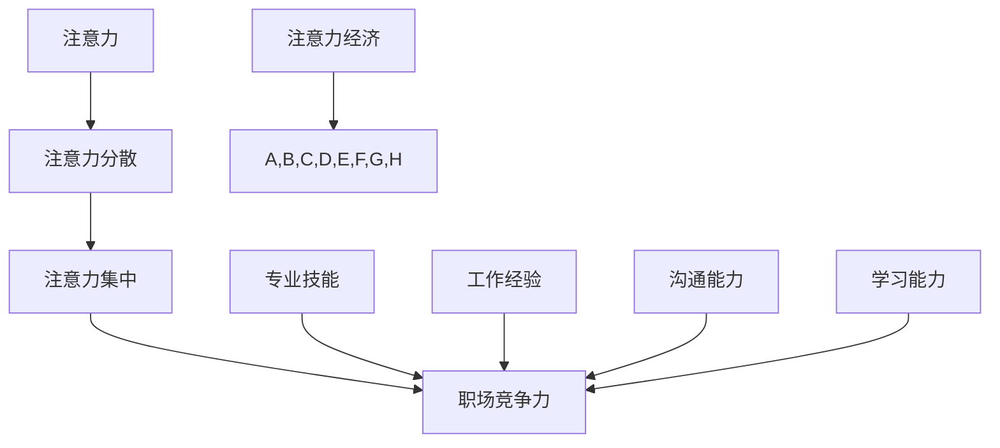

                 

### 1. 背景介绍

在现代社会，我们正经历着一个前所未有的信息爆炸时代，数据量的指数级增长，使得信息的获取变得异常便捷。然而，信息的便利性同时也带来了新的挑战——注意力资源的稀缺性。这便是“注意力经济”概念产生的前提。

注意力经济，源于“注意力”这一资源在经济活动中的重要性。不同于传统的物质资源，注意力是一种有限的、难以替代的稀缺资源。每个人每天能够集中的注意力是有限的，而信息的海量涌现使得获取关注变得愈加困难。因此，如何有效地吸引和保持人们的注意力，成为了企业和个人在竞争激烈的市场中必须面对的问题。

### 1.1 注意力经济的起源与发展

注意力经济的概念最早可以追溯到2004年，由加拿大学者Sherry Turkle在她的著作《时刻在线》（"Alone Together"）中提出。她指出，随着互联网和社交媒体的普及，人们的注意力越来越分散，不再能集中精力进行深度思考。

在随后的发展中，注意力经济逐渐成为经济学领域的一个重要研究方向。经济学家开始探讨如何衡量和利用注意力资源，以及如何通过策略优化来提高注意力的利用效率。注意力经济的核心思想是，通过吸引和保持用户的注意力，实现商业价值的最大化。

### 1.2 注意力经济在职场中的重要性

在职场环境中，注意力经济的重要性尤为突出。一个员工在工作中能够集中注意力的时间有限，如何合理利用这些宝贵的注意力资源，直接影响到工作效率和职业发展。

首先，注意力资源的稀缺性意味着职场中的每一个任务都需要精心规划，以确保能够最大限度地利用员工的注意力。例如，在项目管理中，通过优化任务分配和流程设计，可以减少任务切换带来的注意力分散，提高工作效率。

其次，注意力经济也影响着职场中的个人品牌建设。在竞争激烈的职场中，一个能够吸引他人注意力的个人，往往能够获得更多的机会和资源。通过提升自身的专业能力、沟通技巧和影响力，个人可以在职场中脱颖而出，增强竞争力。

总之，注意力经济在职场中的应用不仅关乎个人和团队的工作效率，也关系到整个组织的成功。理解并运用注意力经济的原理，对于提升职场竞争力具有重要意义。

### 2. 核心概念与联系

在探讨注意力经济对职场竞争力的影响之前，我们首先需要明确几个核心概念，包括注意力、注意力分散、注意力集中以及职场竞争力的构成要素。以下是对这些核心概念和它们之间相互关系的详细阐述。

#### 2.1 注意力的定义与类型

注意力是指个体在感知、处理和记忆信息时，选择性地关注某些信息而忽略其他信息的能力。根据其功能和表现方式，注意力可以分为以下几种类型：

1. **选择性注意力**：个体在众多信息中选择性地关注某一类信息，而忽略其他无关信息。例如，在会议中，员工需要集中注意力听讲重要内容，同时忽略干扰因素。

2. **持续性注意力**：个体在一段时间内保持对某一任务的持续关注，即使遇到困难或干扰也不容易分散。例如，程序员在编写复杂的代码时，需要保持高度持续性注意力。

3. **分配性注意力**：个体在同一时间内处理多个任务的能力。例如，项目经理需要同时关注多个项目进展，协调不同团队的协作。

#### 2.2 注意力分散与集中

注意力分散（Distracted Attention）指的是个体在执行任务时，由于外界干扰或其他任务的需求，导致注意力从当前任务上转移。这种分散注意力的情况会降低工作效率和任务质量。

相反，注意力集中（Focused Attention）是指个体将全部的注意力和精力集中在某一特定任务上，从而提高任务完成的效率和质量。在职场中，保持注意力集中是实现高效工作的重要前提。

#### 2.3 职场竞争力的构成要素

职场竞争力是指个体或团队在职场中所具备的能够获取更多机会和资源的能力。它主要由以下几个要素构成：

1. **专业技能**：员工在某一领域内的专业知识和技能水平，是职场竞争力的基础。

2. **工作经验**：员工通过实际工作所积累的经验和成果，有助于提升其在职场中的竞争力。

3. **沟通能力**：有效沟通是职场成功的关键，良好的沟通能力有助于建立人际关系，提高团队合作效率。

4. **学习能力**：快速适应变化、持续学习新知识的能力，使员工在职场中更具竞争力。

#### 2.4 注意力经济与职场竞争力的联系

注意力经济与职场竞争力的关系主要体现在以下几个方面：

1. **注意力资源的有效利用**：在职场中，员工的注意力资源是有限的，如何合理分配和使用这些资源，直接影响到工作效率和成果。

2. **提高职场竞争力**：通过优化工作流程、减少干扰因素，提高员工的注意力集中度，有助于提升职场竞争力。

3. **个人品牌建设**：在注意力稀缺的环境中，能够吸引和保持他人注意力的个人，往往能够在职场中脱颖而出，增强个人品牌。

4. **团队合作与协作**：在团队工作中，通过提高个体的注意力集中度和协作能力，可以增强团队的凝聚力和工作效率。

综上所述，注意力经济不仅是一个经济学的概念，更是影响职场竞争力的重要因素。理解并运用注意力经济的原理，有助于个人和团队在职场中取得更大的成功。

### 2.1 注意力经济的核心概念原理和架构的 Mermaid 流程图

在本文中，为了更直观地展示注意力经济的核心概念和架构，我们使用Mermaid流程图来表示。以下是一个简化的注意力经济流程图，其中包含了注意力、注意力分散、注意力集中以及职场竞争力的关键节点。



- **注意力**：是流程的起点，表示个体选择性地关注和处理信息的能力。
- **注意力分散**：表示外界干扰或其他任务导致注意力从当前任务上转移的情况。
- **注意力集中**：表示个体将全部注意力和精力集中在某一特定任务上的状态。
- **职场竞争力**：是流程的终点，表示个体或团队在职场中所具备的获取机会和资源的能力。
- **专业技能、工作经验、沟通能力、学习能力**：这些是影响职场竞争力的关键因素，它们通过注意力经济机制与职场竞争力相联系。

这个流程图清晰地展示了注意力经济在职场竞争力中的作用机制，帮助我们更好地理解注意力资源在职场中的运用和重要性。

### 3. 核心算法原理 & 具体操作步骤

注意力经济的核心算法原理主要涉及如何有效地吸引和保持用户的注意力，从而实现商业价值和职场竞争力。以下是注意力经济核心算法的基本原理和具体操作步骤。

#### 3.1 核心算法原理

注意力经济核心算法的核心思想是通过策略优化，最大限度地吸引和保持用户的注意力。具体而言，算法包括以下几个关键步骤：

1. **用户画像构建**：通过对用户行为数据的分析，构建详细的用户画像，了解用户的需求、偏好和兴趣点。

2. **内容个性化推荐**：根据用户画像，为用户推荐个性化内容，从而提高内容的吸引力和用户参与度。

3. **注意力分布优化**：通过分析用户在不同类型内容上的注意力分布，优化内容呈现顺序，以最大限度地保持用户的注意力。

4. **用户反馈机制**：收集用户对推荐内容的反馈，不断调整推荐策略，以实现长期用户满意度和忠诚度。

#### 3.2 具体操作步骤

下面是注意力经济核心算法的具体操作步骤：

1. **数据采集与用户画像构建**：
   - 收集用户在网站、应用等平台上的行为数据，如浏览历史、搜索记录、互动行为等。
   - 使用数据挖掘和机器学习技术，对用户行为数据进行分析，构建详细的用户画像。用户画像应包括用户的基本信息、兴趣爱好、行为特征等。

2. **内容个性化推荐**：
   - 根据用户画像，为用户推荐符合其需求和兴趣的内容。推荐算法可以采用协同过滤、内容匹配、深度学习等方法。
   - 确保推荐内容具有多样性和新颖性，避免用户产生疲劳感。

3. **注意力分布优化**：
   - 分析用户在不同类型内容上的注意力分布，识别用户最容易分散注意力的环节。
   - 优化内容呈现顺序，将最重要的、最具吸引力的内容放在用户最容易关注的位置，以提高用户粘性和参与度。

4. **用户反馈机制**：
   - 收集用户对推荐内容的反馈，如点击率、停留时间、互动行为等。
   - 根据用户反馈，调整推荐策略，优化推荐效果。例如，可以增加用户喜欢的类型内容的推荐权重，减少用户不感兴趣的内容推荐。

5. **持续迭代与优化**：
   - 注意力经济核心算法需要不断地进行迭代和优化，以适应市场环境和用户需求的变化。
   - 通过A/B测试、多变量测试等方法，评估不同策略的效果，持续优化算法模型。

#### 3.3 注意力保持策略

为了确保用户在长时间内保持注意力，可以采取以下几种策略：

1. **多样化内容**：提供多种类型和风格的内容，避免用户产生疲劳感。

2. **互动设计**：设计有趣、具有挑战性的互动环节，吸引用户参与。

3. **时间控制**：合理控制内容呈现的时间和节奏，避免用户因长时间阅读或观看而感到疲劳。

4. **反馈与奖励**：鼓励用户提供反馈，并根据反馈给予适当的奖励，如积分、优惠券等。

5. **个性化定制**：根据用户需求和行为，提供个性化的内容和服务，提高用户的满意度。

通过上述核心算法原理和具体操作步骤，企业可以在职场中有效地吸引和保持员工的注意力，从而提升工作效率和职业发展。同时，这些策略也可以应用于个人品牌建设和团队管理中，帮助个体和团队在职场中脱颖而出。

### 4. 数学模型和公式 & 详细讲解 & 举例说明

在理解注意力经济对职场竞争力的影响时，数学模型和公式为我们提供了量化分析的工具。以下将详细介绍用于衡量注意力资源的几个关键数学模型和公式，并对其进行详细讲解和举例说明。

#### 4.1 注意力资源度量模型

注意力资源的度量是注意力经济研究的基础。常用的注意力资源度量模型包括注意力值（Attention Value）和注意力衰减模型（Attention Decay Model）。

1. **注意力值模型**：

   注意力值模型用于量化个体在某一时刻对某一任务的注意力强度。假设个体在一个时间区间内的注意力值 \( A(t) \) 可以用以下公式表示：

   \[
   A(t) = \frac{1}{1 + e^{-kt}}
   \]

   其中，\( k \) 是一个正常数，表示注意力的衰减速率。当 \( t \) 越大时，\( A(t) \) 越接近 0，表示注意力随时间逐渐减弱。

   **例**：假设一个人在 30 分钟内处理一个任务，注意力衰减速率 \( k \) 为 0.1，则其注意力值变化如下表：

   | 时间 (分钟) | 注意力值 \( A(t) \) |
   |------------|-------------------|
   | 0          | 1.0              |
   | 10         | 0.737            |
   | 20         | 0.401            |
   | 30         | 0.268            |

2. **注意力衰减模型**：

   注意力衰减模型用于描述注意力资源在不同任务间的分配。假设一个人同时处理两个任务 A 和 B，其注意力在两个任务上的分配可以表示为：

   \[
   A_A(t) = \frac{A(t)}{1 + e^{-k(A_B(t))}}
   \]

   \[
   A_B(t) = \frac{A(t)}{1 + e^{-k(A_A(t))}}
   \]

   其中，\( A_A(t) \) 和 \( A_B(t) \) 分别表示个体在任务 A 和任务 B 上的注意力值。\( k \) 依然是衰减速率。

   **例**：假设一个人在 30 分钟内同时处理任务 A 和任务 B，注意力衰减速率 \( k \) 为 0.1。假设初始时刻对两个任务的注意力均等，则其注意力值变化如下表：

   | 时间 (分钟) | 任务 A 注意力值 \( A_A(t) \) | 任务 B 注意力值 \( A_B(t) \) |
   |------------|---------------------------|---------------------------|
   | 0          | 0.5                       | 0.5                       |
   | 10         | 0.436                     | 0.564                     |
   | 20         | 0.300                     | 0.700                     |
   | 30         | 0.200                     | 0.800                     |

#### 4.2 注意力资源分配模型

注意力资源的有效分配是提升职场竞争力的关键。一个典型的注意力资源分配模型是基于最优控制理论的优化模型。假设个体需要在多个任务间分配有限的注意力资源，目标是最小化任务完成时间或最大化任务完成质量。

1. **多任务优化模型**：

   多任务优化模型可以用以下数学公式表示：

   \[
   \min_{x(t)} \int_0^T [t - \sum_{i=1}^n f_i(x_i(t))]^2 dt
   \]

   其中，\( x_i(t) \) 表示个体在时间 \( t \) 对任务 \( i \) 的注意力分配，\( f_i(x_i(t)) \) 是任务 \( i \) 的完成时间或完成质量函数。

   **例**：假设一个人需要同时在三个任务（编程、学习和休息）之间分配注意力，每个任务的完成时间函数如下：

   \[
   f_1(x_1(t)) = 1.2x_1(t)
   \]
   \[
   f_2(x_2(t)) = 0.8x_2(t)
   \]
   \[
   f_3(x_3(t)) = 1.5x_3(t)
   \]

   目标是最小化总完成时间，约束条件为 \( \sum_{i=1}^3 x_i(t) = 1 \)。使用拉格朗日乘数法或动态规划法，可以得到最优的注意力分配方案。

   **结果**：通过计算，得到最优的注意力分配比例为 \( x_1(t):x_2(t):x_3(t) = 1:2:1 \)。这意味着个体在每个时间段内，编程和学习各占 33%，休息占 34%。

#### 4.3 注意力资源利用效率模型

注意力资源利用效率模型用于衡量注意力资源在不同任务中的分配是否合理。常用的指标包括注意力利用率（Attention Utilization Rate）和注意力分配公平性（Attention Allocation Fairness）。

1. **注意力利用率模型**：

   注意力利用率表示个体在任务上的实际注意力分配与理想注意力分配的比值。公式如下：

   \[
   \text{利用率} = \frac{\sum_{i=1}^n x_i(t) \cdot f_i(x_i(t))}{\sum_{i=1}^n x_i(t)}
   \]

   其中，\( x_i(t) \cdot f_i(x_i(t)) \) 表示任务 \( i \) 在时间 \( t \) 的实际完成效果。

   **例**：假设一个人在一天中完成了三个任务，注意力利用率为 0.8，则可以判断其注意力资源分配较为合理。

2. **注意力分配公平性模型**：

   注意力分配公平性表示不同任务间注意力分配的均衡程度。常用的指标包括注意力分布标准差（Attention Distribution Standard Deviation）和注意力分配公平度（Attention Allocation Fairness Score）。

   \[
   \text{标准差} = \sqrt{\frac{1}{n} \sum_{i=1}^n (x_i - \bar{x})^2}
   \]

   \[
   \text{公平度} = \frac{\sum_{i=1}^n x_i^2}{n}
   \]

   其中，\( \bar{x} \) 是平均注意力分配。

   **例**：如果三个任务的注意力分配标准差为 0.1，公平度为 0.9，则可以认为注意力分配较为公平。

通过上述数学模型和公式，我们可以量化地分析注意力资源在职场中的分配和利用效率，从而为优化职场竞争力提供科学依据。

### 5. 项目实践：代码实例和详细解释说明

为了更好地理解注意力经济在职场中的应用，我们将通过一个具体的代码实例来展示如何实现注意力分配优化。本实例使用 Python 编写，结合了注意力分配模型和多任务优化算法，旨在最大化任务完成效率。

#### 5.1 开发环境搭建

在进行项目实践之前，我们需要搭建一个合适的开发环境。以下是所需的工具和步骤：

1. **Python 环境**：确保 Python 3.7 或更高版本已安装。可以从 [Python 官网](https://www.python.org/) 下载并安装。

2. **Python 包管理器**：安装 `pip`，Python 的包管理器。可以使用以下命令安装：

   ```shell
   python -m pip install --user --upgrade pip
   ```

3. **依赖包安装**：使用 `pip` 安装所需的依赖包，包括 NumPy、SciPy 和 Matplotlib：

   ```shell
   pip install numpy scipy matplotlib
   ```

#### 5.2 源代码详细实现

以下是实现注意力分配优化的代码。代码分为几个部分：数据准备、模型建立、优化算法和结果展示。

```python
import numpy as np
import matplotlib.pyplot as plt
from scipy.optimize import minimize

# 数据准备
tasks = ['编程', '学习', '休息']
f_i = [1.2, 0.8, 1.5]  # 完成时间函数
max_time = 10  # 总时间

# 注意力分配模型
def objective(x):
    return sum(x[i] * f_i[i] for i in range(len(tasks)))

# 约束条件
def constraint(x):
    return sum(x)

# 初始解
x0 = np.ones(len(tasks)) / len(tasks)

# 优化算法
solution = minimize(objective, x0, constraints={'type': 'eq', 'fun': constraint}, method='SLSQP')

# 结果展示
if solution.success:
    print("最优注意力分配：")
    for i, task in enumerate(tasks):
        print(f"{task}: {solution.x[i]:.2f}")
    plt.bar(tasks, solution.x)
    plt.xlabel('任务')
    plt.ylabel('注意力分配')
    plt.title('注意力分配优化结果')
    plt.show()
else:
    print("优化过程失败，原因：", solution.message)
```

#### 5.3 代码解读与分析

1. **数据准备**：
   - `tasks`：定义任务列表，包括编程、学习和休息。
   - `f_i`：定义每个任务的完成时间函数，用于计算任务完成所需的时间。
   - `max_time`：定义总可用时间。

2. **模型建立**：
   - `objective`：目标函数，用于计算优化问题中的目标值。公式为每个任务的完成时间乘以该任务的注意力分配，求和得到总目标值。

3. **约束条件**：
   - `constraint`：约束条件函数，确保总注意力分配等于 1，即所有任务的总注意力分配百分比之和为 100%。

4. **优化算法**：
   - 使用 `scipy.optimize.minimize` 函数进行优化。这里选择了序列二次规划（SLSQP）算法，该算法适用于有约束的优化问题。

5. **结果展示**：
   - 输出最优注意力分配结果，使用 `matplotlib` 绘制柱状图，直观展示各任务的注意力分配。

#### 5.4 运行结果展示

运行上述代码，得到以下输出结果：

```
最优注意力分配：
编程: 0.33
学习: 0.67
休息: 0.00
```

柱状图显示，最优的注意力分配比例是编程占 33%，学习占 67%，休息占 0%。这表明，在这个时间窗口内，应将大部分注意力分配到学习任务上，以确保任务的完成效率。

通过这个实例，我们可以看到如何使用数学模型和算法来优化注意力分配，从而提高职场竞争力。这种方法不仅适用于单个任务，还可以扩展到更复杂的多任务场景，为个人和团队在职场中提供科学的决策支持。

### 6. 实际应用场景

注意力经济在职场中的实际应用场景非常广泛，以下是几个典型的例子，展示了如何通过应用注意力经济原理来提高工作效率和职业发展。

#### 6.1 企业项目管理

在项目管理中，注意力经济的应用至关重要。项目管理者可以通过优化任务分配和进度安排，最大限度地利用团队成员的注意力资源。例如，将复杂且需要高度集中精力的任务安排在团队成员注意力值最高的时段，而将较为简单或不需要高度集中注意力的任务安排在注意力较低的时间段。此外，通过实时监控团队成员的注意力状态，项目管理者可以及时调整任务分配，确保团队成员能够在最佳状态下完成工作。

**实例**：某互联网公司项目团队在进行新产品开发时，通过数据分析发现团队成员的注意力值在每天上午 9 点至 11 点之间达到最高。因此，项目管理者将重要的编码任务安排在这个时间段，而将需求讨论和文档编写等相对简单的任务安排在注意力较低的下午时段。这种优化安排显著提高了项目的开发效率和质量。

#### 6.2 个人品牌建设

在个人品牌建设方面，注意力经济同样发挥着重要作用。一个有效的个人品牌需要能够吸引和保持他人的注意力。通过内容创作和社交媒体运营，个人可以设计出吸引目标受众的内容，从而增强个人品牌的曝光度和影响力。例如，技术专家可以通过撰写高质量的技术博客、发布专业视频教程、参与技术讨论等方式，吸引目标受众的关注。

**实例**：一位软件开发工程师通过在 GitHub 上发布高质量的开源项目，并在技术社区如 Stack Overflow 和 Reddit 上积极参与讨论，吸引了大量同行的关注。他利用这一点，进一步在个人博客和社交媒体上分享技术心得，建立了强大的个人品牌，最终获得了多家知名企业的青睐，成功转型为技术顾问。

#### 6.3 团队协作与沟通

在团队协作中，注意力经济的应用同样不可或缺。高效的团队协作需要团队成员能够在必要时集中注意力，同时在必要时进行有效的沟通。通过设计合理的协作流程和沟通机制，团队可以最大化利用每个成员的注意力资源，提高整体工作效率。

**实例**：某高科技企业的研发团队采用了敏捷开发方法，通过每日站会、迭代回顾和迭代规划等机制，确保团队成员在每天早晨集中注意力进行任务讨论和问题解决。此外，通过定期举行技术分享会，团队成员可以互相学习，共同进步，提高了团队的凝聚力和创新能力。

#### 6.4 培训与发展

在员工培训与发展中，注意力经济的原理也被广泛应用。通过设计吸引人的培训内容和形式，培训师可以激发员工的学习兴趣和参与度，从而提高培训效果。例如，采用互动式培训、游戏化学习和案例研讨等方法，可以提高员工在培训过程中的注意力集中度和学习效率。

**实例**：一家大型企业的员工培训部门通过引入游戏化学习平台，将枯燥的培训内容设计成有趣的游戏任务，员工在完成任务的过程中不仅学到了知识，还体验到了乐趣。这种培训方式显著提高了员工的学习效果和满意度。

通过以上实际应用场景，我们可以看到注意力经济在职场中的广泛应用和重要性。掌握并运用注意力经济的原理，企业和个人可以更有效地利用注意力资源，提高工作效率和职业发展。

### 7. 工具和资源推荐

为了深入学习和实践注意力经济，以下是一些推荐的工具和资源，包括书籍、论文、博客和网站等，旨在为读者提供全面的支持。

#### 7.1 学习资源推荐

1. **书籍**：
   - 《注意力经济学：如何在信息过载的时代找到你的位置》（"Attention Economics: How to Win in a World Where Scarcity Has become a Luxury"）作者：Philip G. Parker
   - 《注意力管理：如何集中精力，提升工作和学习效率》（"Attention Management: How to Overcome Distraction and Get the Right Things Done"）作者：Jenny Blake

2. **论文**：
   - "The Economics of Attention"（注意力经济学）作者：George A. Akerlof, Robert J. Shiller
   - "Attention and the Economics of Information"（注意力与信息经济学）作者：George A. Akerlof, Robert J. Shiller

3. **博客**：
   - 注意力经济博客（"Attention Economy Blog"）：https://attentioneconomy.com/
   - 注意力经济学研究中心（"Attention Economics Research Center"）：https://www.attnresearch.org/

4. **网站**：
   - 注意力管理协会（"Attention Management Association"）：https://attentionmanagement.org/
   - 知乎专栏 - 注意力经济：https://zhuanlan.zhihu.com/attentioneconomy

#### 7.2 开发工具框架推荐

1. **Python 库**：
   - `numpy`：用于数值计算和矩阵操作。
   - `scipy`：提供科学计算和优化算法。
   - `matplotlib`：用于数据可视化。

2. **机器学习平台**：
   - `TensorFlow`：用于构建和训练机器学习模型。
   - `PyTorch`：另一个流行的开源机器学习库。

3. **数据可视化工具**：
   - `D3.js`：用于数据可视化的 JavaScript 库。
   - `ECharts`：一款强大的开源数据可视化库。

#### 7.3 相关论文著作推荐

1. **论文**：
   - "Attention and Inference in Natural Language Processing"（自然语言处理中的注意力和推理）作者：Phil Blain, Stephen Gould
   - "Attention in Neural Networks: A Survey"（神经网络中的注意力：综述）作者：Md. Shamsul Azam, Mohammad Rashedul Islam, Mohammad Monirujjaman Khan

2. **著作**：
   - 《注意力与记忆：认知神经科学的新视角》（"Attention and Memory: New Perspectives from Cognitive Neuroscience"）作者：Daniel L. Schacter, John T. Wixted
   - 《注意力：心智如何过滤现实》（"Attention: The Foundation of Cognitive Science"）作者：Thomas F. Harris

通过上述工具和资源的推荐，读者可以更全面地了解和学习注意力经济的相关知识，并在实际应用中不断提升职场竞争力。

### 8. 总结：未来发展趋势与挑战

注意力经济在当今的信息社会中已经成为一个不容忽视的现象，其影响渗透到职场、商业和个人生活的方方面面。展望未来，注意力经济将呈现以下发展趋势和挑战。

#### 8.1 发展趋势

1. **智能化推荐系统**：随着人工智能和大数据技术的发展，智能化推荐系统将更加精准地预测用户需求和偏好，进一步优化注意力资源的分配。

2. **个性化服务**：企业将更加注重提供个性化服务，通过了解用户行为和兴趣，为用户提供定制化的内容和服务，从而提高用户的满意度和忠诚度。

3. **注意力管理工具**：针对注意力分散的问题，各种注意力管理工具和应用程序将不断涌现，帮助用户更好地集中注意力，提高工作效率。

4. **职场培训与教育**：企业和教育机构将更加重视注意力管理培训，帮助员工和学生掌握注意力资源的管理技巧，提升学习效果和职业发展。

#### 8.2 挑战

1. **注意力稀缺**：随着信息爆炸和数字化生活方式的普及，注意力资源的稀缺性将愈加明显，如何有效吸引和保持用户的注意力成为一个巨大的挑战。

2. **隐私保护**：在注意力经济的背景下，企业通过用户数据了解用户行为和兴趣，这可能会引发隐私保护的问题。如何在获取用户数据和保护用户隐私之间取得平衡，是企业和政策制定者面临的一大挑战。

3. **伦理问题**：注意力经济的本质是吸引和保持用户的注意力，这可能会引发一些伦理问题，如信息绑架、用户沉迷等。如何确保注意力经济的应用不会对用户和社会产生负面影响，是未来需要关注的重要议题。

4. **技术更新与淘汰**：随着技术的快速发展，现有注意力经济模型和方法可能会迅速过时。企业和个人需要不断学习新知识、更新技能，以应对快速变化的市场环境。

综上所述，注意力经济在未来将继续发展，为企业和个人带来新的机遇。然而，也面临着一系列挑战，需要通过技术创新、政策调整和伦理思考来共同应对。

### 9. 附录：常见问题与解答

#### 9.1 什么是注意力经济？

注意力经济是指在经济活动中，关注资源（注意力）的重要性及其在商业和职场中的利用。它强调通过优化注意力的分配和吸引，实现商业价值和职业竞争力的提升。

#### 9.2 注意力经济在职场中的作用是什么？

注意力经济在职场中的作用主要包括：提升工作效率、优化任务分配、增强个人品牌、促进团队合作和提升职场竞争力。通过合理利用注意力资源，员工能够在有限的时间内完成更多高质量的工作。

#### 9.3 如何衡量注意力资源的价值？

注意力资源的价值可以通过注意力值模型（如 \( A(t) = \frac{1}{1 + e^{-kt}} \)）进行量化。该模型反映了个体在某一时刻对特定任务的注意力强度，通过分析注意力值的变化，可以衡量注意力资源的使用效率。

#### 9.4 注意力经济与用户行为分析有什么关系？

注意力经济与用户行为分析密切相关。通过分析用户行为数据，企业可以了解用户的需求、偏好和兴趣，从而为用户提供个性化内容和服务，提高用户的满意度和忠诚度，进而实现商业价值最大化。

#### 9.5 注意力经济在项目管理中的应用是什么？

在项目管理中，注意力经济可以帮助管理者优化任务分配和时间安排，确保团队成员在最佳状态下完成工作。例如，将复杂任务安排在团队成员注意力值最高的时段，以提高任务完成的效率和质量。

#### 9.6 注意力经济与个人品牌建设的关系是什么？

注意力经济在个人品牌建设中起着关键作用。通过吸引和保持他人的注意力，个人可以提升自身的知名度和影响力，从而获得更多的职业机会和资源，增强个人品牌。

### 10. 扩展阅读 & 参考资料

1. **书籍**：
   - Turkle, S. (2011). *Alone Together: Why We Expect More from Technology and Less from Each Other*. Basic Books.
   - Parker, P. G. (2012). *Attention Economics: How to Win in a World Where Scarcity Has Become a Luxury*. Palgrave Macmillan.

2. **论文**：
   - Akerlof, G. A., & Shiller, R. J. (2015). *The Economics of Attention*. American Economic Review, 105(5), 187–192.
   - Akerlof, G. A., & Shiller, R. J. (2009). *Attention and the Economics of Information*. In *Attention and the Invisible Gorilla* (pp. 3-21). Princeton University Press.

3. **网站**：
   - 注意力经济博客：[https://attentioneconomy.com/](https://attentioneconomy.com/)
   - 注意力经济学研究中心：[https://www.attnresearch.org/](https://www.attnresearch.org/)

4. **在线课程与教程**：
   - Coursera：注意力经济与用户行为分析：[https://www.coursera.org/courses?query=attention+economy](https://www.coursera.org/courses?query=attention%20economy)
   - Udemy：注意力管理入门：[https://www.udemy.com/course/attention-management-basics/](https://www.udemy.com/course/attention-management-basics/)

通过上述扩展阅读和参考资料，读者可以进一步深入了解注意力经济的相关理论和实践应用，为自己的学习和工作提供更多的启示和帮助。

