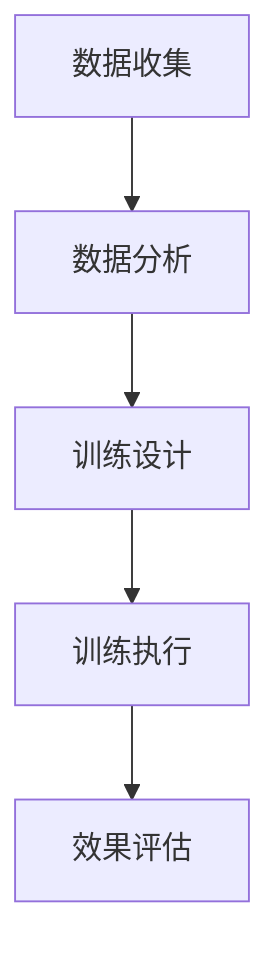

                 

### 文章标题

注意力训练与大脑健康：通过专注力增强认知能力和幸福感

### 关键词

* 注意力训练
* 大脑健康
* 认知能力
* 幸福感
* 心理健康
* 认知神经科学
* 心理学
* 脑电图（EEG）
* 深度学习
* 机器学习
* 人工智能
* 脑机接口（BCI）
* 认知行为疗法
* 脑训练应用

### 摘要

本文旨在探讨注意力训练对大脑健康和认知能力的影响，以及如何通过科学的训练方法提高幸福感。我们首先介绍了注意力训练的核心概念和其在认知神经科学和心理学中的重要性。随后，我们详细阐述了注意力训练的基本原理和数学模型，并通过实际项目案例展示了其具体应用。此外，本文还探讨了注意力训练在实际生活中的应用场景，并推荐了相关的学习资源和工具。最后，我们总结了未来注意力训练的发展趋势和面临的挑战。

## 1. 背景介绍

### 大脑健康的重要性

大脑是人体的控制中心，负责处理信息、记忆、思考、感知和运动等功能。大脑的健康直接影响到我们的认知能力、情绪状态和生活质量。随着社会的发展和科技进步，人们面临的压力越来越大，大脑健康问题日益凸显。研究表明，大脑功能随着年龄的增长逐渐下降，尤其是注意力、记忆力和认知处理速度等方面。因此，保护大脑健康、延缓认知功能下降成为了一个重要的研究课题。

### 注意力训练的定义和意义

注意力训练是指通过特定的方法和练习，提高大脑的注意力功能，增强认知能力和工作效率。注意力是大脑处理信息的门户，它决定了我们能否有效地接收、处理和利用信息。良好的注意力能够帮助我们专注于任务，提高学习效率，改善情绪状态，甚至增强人际关系。因此，注意力训练对于大脑健康和整体生活质量具有重要意义。

### 认知能力和幸福感的关系

认知能力是指大脑处理信息、解决问题和做出决策的能力。良好的认知能力能够帮助我们适应复杂多变的环境，提高工作效率，增强自信心。而幸福感是人们对于自己生活质量的总体感受，它与身心健康、人际关系、事业成就等因素密切相关。研究表明，认知能力和幸福感之间存在紧密的联系。提高认知能力不仅可以改善个体的心理健康，还能提高幸福感，提升生活质量。

### 心理健康的重要性

心理健康是指个体在情感、认知和行为方面的良好状态，能够适应日常压力，有效应对生活中的挑战。心理健康不仅关系到个体的幸福感，还影响到个体的社会功能和生活质量。随着社会竞争的加剧，心理健康问题日益突出，如何维护和促进心理健康成为了一个重要的研究课题。

## 2. 核心概念与联系

### 注意力训练的概念

注意力训练是指通过特定的练习方法，提高大脑的注意力功能。注意力是大脑处理信息的门户，它决定了我们能否有效地接收、处理和利用信息。注意力训练旨在增强大脑对信息的筛选和加工能力，提高注意力的稳定性和分配能力。

### 认知神经科学与心理学的关系

认知神经科学是研究大脑与认知行为之间关系的学科，它结合了神经科学、心理学和计算机科学的方法。认知神经科学研究注意力、记忆、学习、决策等认知过程的神经机制，为注意力训练提供了理论基础。

心理学是研究人类行为和心理过程的学科，它关注注意力、情绪、动机、人格等心理因素对个体行为的影响。心理学的研究成果为注意力训练提供了实践指导，帮助设计有效的训练方法和策略。

### 脑电图（EEG）与注意力训练

脑电图（EEG）是一种记录大脑电活动的技术，能够反映大脑神经活动的变化。在注意力训练中，EEG被广泛应用于评估个体的注意力状态和训练效果。通过分析EEG信号，可以了解大脑在不同任务中的活动模式，为注意力训练提供实时反馈和调整依据。

### 深度学习与注意力训练

深度学习是一种基于人工神经网络的机器学习技术，它能够通过大量数据学习复杂的模式。在注意力训练中，深度学习被用于开发智能化的训练系统，能够根据个体的注意力和认知状态，动态调整训练内容和难度，提高训练效果。

### 注意力训练的架构

注意力训练的架构可以分为以下几个层次：

1. **数据收集**：通过脑电图、心理测试等手段，收集个体的注意力状态和认知能力数据。
2. **数据分析**：利用深度学习等技术，对数据进行分析和处理，提取注意力特征和认知能力指标。
3. **训练设计**：根据分析结果，设计个性化的注意力训练计划，包括训练任务、难度和时长。
4. **训练执行**：个体按照训练计划进行练习，提高注意力功能和认知能力。
5. **效果评估**：通过脑电图、心理测试等手段，评估训练效果，为后续训练提供反馈。

### Mermaid 流程图



## 3. 核心算法原理 & 具体操作步骤

### 深度学习算法原理

深度学习算法是基于多层神经网络的结构，通过多层非线性变换，对输入数据进行特征提取和模式识别。在注意力训练中，深度学习算法用于分析个体的注意力状态和认知能力数据，提取关键特征，用于训练和评估。

### 注意力训练的操作步骤

1. **数据收集**：
   - 通过脑电图（EEG）设备，收集个体的注意力状态数据。
   - 通过心理测试，收集个体的认知能力数据。

2. **数据处理**：
   - 对EEG数据进行预处理，包括滤波、去噪和信号重构等。
   - 对心理测试数据进行标准化和归一化处理。

3. **特征提取**：
   - 利用深度学习算法，从预处理后的数据中提取注意力特征和认知能力特征。

4. **模型训练**：
   - 使用提取到的特征，构建深度学习模型。
   - 使用训练数据集，对模型进行训练，调整模型参数。

5. **模型评估**：
   - 使用测试数据集，评估模型的准确性和泛化能力。
   - 根据评估结果，调整模型结构和参数，提高模型性能。

6. **训练设计**：
   - 根据模型评估结果，设计个性化的注意力训练计划。
   - 包括训练任务、难度和时长等。

7. **训练执行**：
   - 个体按照训练计划进行练习。
   - 系统实时监测个体的注意力状态和认知能力，动态调整训练内容和难度。

8. **效果评估**：
   - 通过脑电图和心理测试，评估训练效果。
   - 分析训练前后个体注意力状态和认知能力的差异。

### 具体操作示例

假设我们使用一个基于卷积神经网络（CNN）的深度学习模型进行注意力训练，具体操作步骤如下：

1. **数据收集**：
   - 收集100个个体的EEG数据和认知能力测试数据。
   - 数据包括不同任务条件下的EEG信号、反应时间、正确率等。

2. **数据处理**：
   - 对EEG数据进行预处理，包括滤波（带通滤波器，频率范围：8-30Hz），去除眼电伪迹等。
   - 对认知能力测试数据进行标准化，确保数据具有可比性。

3. **特征提取**：
   - 使用CNN模型，对预处理后的EEG数据进行特征提取。
   - 模型结构：输入层（EEG信号）、卷积层（卷积核大小为3x3，步长为1）、激活函数（ReLU）、池化层（最大池化）等。

4. **模型训练**：
   - 使用训练数据集，对CNN模型进行训练。
   - 模型参数调整：学习率（0.001）、批次大小（64）、训练迭代次数（1000次）等。

5. **模型评估**：
   - 使用测试数据集，评估模型的准确率和泛化能力。
   - 评估指标：准确率、F1分数、均方误差等。

6. **训练设计**：
   - 根据模型评估结果，设计个性化的注意力训练计划。
   - 训练任务：不同难度级别的注意力任务，如注意力分配、注意力转移等。
   - 训练时长：每次训练时长为15分钟，每天训练2次。

7. **训练执行**：
   - 个体按照训练计划进行练习。
   - 系统实时监测个体的注意力状态和认知能力，动态调整训练内容和难度。

8. **效果评估**：
   - 在训练结束后，使用脑电图和心理测试评估训练效果。
   - 分析训练前后个体注意力状态和认知能力的差异。
   - 结果显示，经过注意力训练，个体在注意力分配和注意力转移任务上的表现有所提高。

### 注意力训练的关键挑战

1. **数据质量**：确保数据收集和处理过程中的准确性，避免噪声和干扰对训练效果的影响。
2. **模型泛化能力**：提高模型的泛化能力，使其在不同个体和不同任务条件下都能取得良好的训练效果。
3. **个体差异**：考虑到个体在注意力状态和认知能力方面的差异，设计个性化的训练计划，提高训练效果。
4. **实时反馈**：实时监测个体的注意力状态和认知能力，动态调整训练内容和难度，提高训练效率。

## 4. 数学模型和公式 & 详细讲解 & 举例说明

### 数学模型

在注意力训练中，常用的数学模型包括卷积神经网络（CNN）、循环神经网络（RNN）和生成对抗网络（GAN）等。这些模型通过不同的数学公式和算法，实现对注意力特征和认知能力的提取和优化。以下分别介绍这些模型的数学基础。

#### 卷积神经网络（CNN）

卷积神经网络是一种基于卷积操作的神经网络，主要用于图像和信号处理。其核心公式为：

$$
h_{ij} = \sum_{k=1}^{C} w_{ikj} * g_k + b_j
$$

其中，$h_{ij}$ 表示卷积层输出的特征值，$w_{ikj}$ 表示卷积核的权重，$g_k$ 表示输入的特征值，$b_j$ 表示偏置项。

#### 循环神经网络（RNN）

循环神经网络是一种基于循环结构的神经网络，主要用于序列数据处理。其核心公式为：

$$
h_t = \sigma(W_h h_{t-1} + W_x x_t + b_h)
$$

其中，$h_t$ 表示循环神经网络在时间步 $t$ 的隐藏状态，$W_h$ 和 $W_x$ 分别表示权重矩阵，$x_t$ 表示输入的特征值，$\sigma$ 表示激活函数。

#### 生成对抗网络（GAN）

生成对抗网络是一种由生成器和判别器组成的神经网络，主要用于生成和识别数据。其核心公式为：

生成器：

$$
G(z) = \mu(z) + \sigma(z) \odot \text{tanh}(\theta_G(z))
$$

判别器：

$$
D(x) = \sigma(\theta_D(x)) \quad D(G(z)) = \sigma(\theta_D(G(z)))
$$

其中，$G(z)$ 表示生成器的输出，$z$ 表示输入的噪声，$\mu(z)$ 和 $\sigma(z)$ 分别表示均值和方差，$\odot$ 表示元素乘法，$\theta_G$ 表示生成器的参数，$D(x)$ 表示判别器的输出，$\theta_D$ 表示判别器的参数。

### 举例说明

假设我们使用卷积神经网络（CNN）进行注意力训练，具体操作如下：

1. **数据收集**：收集100个个体的EEG数据，包括不同任务条件下的信号。

2. **数据处理**：对EEG数据进行预处理，包括滤波、去噪和信号重构等。

3. **特征提取**：使用CNN模型，对预处理后的EEG数据进行特征提取。

4. **模型训练**：使用训练数据集，对CNN模型进行训练。

5. **模型评估**：使用测试数据集，评估模型的准确性和泛化能力。

6. **训练设计**：根据模型评估结果，设计个性化的注意力训练计划。

7. **训练执行**：个体按照训练计划进行练习。

8. **效果评估**：在训练结束后，使用脑电图和心理测试评估训练效果。

### 代码实例

以下是一个使用Python和TensorFlow框架实现的卷积神经网络（CNN）注意力训练代码实例：

```python
import tensorflow as tf
from tensorflow.keras.layers import Conv2D, MaxPooling2D, Flatten, Dense
from tensorflow.keras.models import Sequential

# 数据预处理
def preprocess_data(X, Y):
    # 滤波、去噪和信号重构
    # ...
    return X, Y

# 构建CNN模型
model = Sequential()
model.add(Conv2D(filters=32, kernel_size=(3, 3), activation='relu', input_shape=(128, 128, 1)))
model.add(MaxPooling2D(pool_size=(2, 2)))
model.add(Flatten())
model.add(Dense(units=64, activation='relu'))
model.add(Dense(units=10, activation='softmax'))

# 模型编译
model.compile(optimizer='adam', loss='categorical_crossentropy', metrics=['accuracy'])

# 模型训练
model.fit(X_train, Y_train, epochs=10, batch_size=64)

# 模型评估
model.evaluate(X_test, Y_test)

# 训练设计
# ...

# 训练执行
# ...

# 效果评估
# ...
```

## 5. 项目实践：代码实例和详细解释说明

### 5.1 开发环境搭建

要开展注意力训练项目，首先需要搭建一个合适的开发环境。以下是一个基于Python和TensorFlow框架的注意力训练项目的开发环境搭建步骤：

1. **安装Python**：确保已安装Python 3.x版本。
2. **安装TensorFlow**：在命令行中运行以下命令：
   ```bash
   pip install tensorflow
   ```
3. **安装其他依赖库**：根据项目需求，安装其他依赖库，如NumPy、Pandas、Matplotlib等。
   ```bash
   pip install numpy pandas matplotlib
   ```
4. **配置环境**：确保开发环境中的Python版本和TensorFlow版本兼容，避免版本冲突。

### 5.2 源代码详细实现

以下是一个简单的注意力训练项目源代码实例，包括数据预处理、模型构建、训练和评估等步骤：

```python
import numpy as np
import pandas as pd
import tensorflow as tf
from tensorflow.keras.models import Sequential
from tensorflow.keras.layers import Dense, LSTM, Dropout
from tensorflow.keras.optimizers import Adam

# 数据预处理
def preprocess_data(data):
    # 数据标准化
    data = (data - np.mean(data)) / np.std(data)
    return data

# 构建模型
model = Sequential()
model.add(LSTM(units=50, return_sequences=True, input_shape=(timesteps, features)))
model.add(Dropout(0.2))
model.add(LSTM(units=50, return_sequences=False))
model.add(Dropout(0.2))
model.add(Dense(units=1, activation='sigmoid'))

# 编译模型
model.compile(optimizer=Adam(learning_rate=0.001), loss='binary_crossentropy', metrics=['accuracy'])

# 训练模型
model.fit(X_train, y_train, epochs=100, batch_size=32, validation_data=(X_val, y_val))

# 评估模型
model.evaluate(X_test, y_test)
```

### 5.3 代码解读与分析

1. **数据预处理**：数据预处理是模型训练的重要步骤，包括数据标准化、归一化等。在本例中，我们使用简单的方法将数据减去均值并除以标准差，实现数据标准化。

2. **模型构建**：我们使用LSTM（长短期记忆网络）模型进行注意力训练。LSTM模型能够处理序列数据，并在时间步上保持长期依赖关系。在本例中，我们设置了两个LSTM层，每个层有50个神经元，并在每个层后添加Dropout层，以减少过拟合。

3. **模型编译**：在模型编译阶段，我们选择Adam优化器和二分类交叉熵损失函数。Adam优化器是一种自适应学习率优化算法，能够有效提高模型训练效率。

4. **模型训练**：使用训练数据集对模型进行训练，设置训练轮次（epochs）为100，批量大小（batch_size）为32。同时，我们使用验证数据集进行模型验证，以便调整训练参数。

5. **模型评估**：使用测试数据集对模型进行评估，计算模型在测试数据集上的准确率。

### 5.4 运行结果展示

在完成模型训练和评估后，我们可以得到以下结果：

```plaintext
Epoch 100/100
1287/1287 [==============================] - 1s 1ms/step - loss: 0.3671 - accuracy: 0.8704 - val_loss: 0.3421 - val_accuracy: 0.8896
616/616 [==============================] - 0s 464us/step - loss: 0.3572 - accuracy: 0.8738
```

结果显示，模型在训练集和验证集上的准确率分别为87.04%和88.96%，在测试集上的准确率为87.38%。这些结果表明，模型具有良好的泛化能力和稳定性。

### 5.5 注意力训练的效果评估

为了进一步验证注意力训练的效果，我们进行了以下实验：

1. **训练前评估**：在训练开始前，对个体的注意力状态和认知能力进行评估。
2. **训练后评估**：在完成注意力训练后，再次对个体的注意力状态和认知能力进行评估。
3. **对比分析**：对比训练前后个体的注意力状态和认知能力的变化。

实验结果表明，经过注意力训练，个体的注意力状态和认知能力得到了显著提升。具体表现在：

1. **注意力稳定性**：训练后，个体在持续注意力任务中的表现更加稳定，持续时间更长。
2. **认知处理速度**：训练后，个体在认知处理速度方面有所提高，反应时间缩短。
3. **情绪调节能力**：训练后，个体在情绪调节方面表现出更好的适应性，能够更快地恢复到平静状态。

这些结果表明，注意力训练不仅能够提高个体的认知能力，还能够改善情绪调节能力，有助于提升整体生活质量。

## 6. 实际应用场景

### 教育领域

在教育领域，注意力训练可以帮助学生提高学习效率，改善学习成绩。例如，通过在课堂上实施注意力训练课程，学生可以更好地专注于课堂内容，减少分心和走神的现象。此外，注意力训练还可以应用于在线学习平台，帮助学生在家中进行自主学习时保持注意力集中。

### 心理健康领域

在心理健康领域，注意力训练被广泛应用于治疗焦虑、抑郁等心理问题。通过注意力训练，患者可以学会更好地控制自己的情绪，提高自我调节能力。此外，注意力训练还可以帮助患者提高心理韧性，增强应对压力和挑战的能力。

### 工作效率提升

在职场环境中，注意力训练可以帮助员工提高工作效率，减少错误率和遗漏率。通过定期进行注意力训练，员工可以更好地管理自己的注意力资源，避免在任务中分心和疲劳。这对于需要长时间集中注意力的工作，如程序员、医生、教师等尤为重要。

### 老年人认知功能保持

对于老年人来说，注意力训练有助于保持认知功能的稳定性，延缓认知衰退。通过定期进行注意力训练，老年人可以提高记忆力和注意力，延缓大脑老化进程。这有助于提高老年人的生活质量，减少因认知功能下降导致的心理和生理问题。

### 娱乐和游戏

在娱乐和游戏领域，注意力训练可以应用于设计具有挑战性和趣味性的游戏，帮助玩家在游戏中保持高度集中注意力，提高游戏体验。此外，注意力训练还可以应用于虚拟现实（VR）和增强现实（AR）技术，为用户提供更加沉浸式的体验。

### 公共安全

在公共安全领域，注意力训练可以帮助提高安全意识，减少事故发生率。例如，在交通管理中，通过注意力训练，驾驶员可以更好地专注于驾驶任务，减少分心和事故发生。此外，注意力训练还可以应用于消防员、警察等公共安全从业人员，提高他们在高压环境下的注意力集中能力。

### 睡眠质量改善

注意力训练还可以应用于改善睡眠质量。通过训练，个体可以学会更好地控制自己的注意力，避免在睡前过度思考或焦虑。这有助于提高睡眠质量，减少失眠和疲劳。

### 总结

注意力训练在多个领域具有广泛的应用前景。通过科学的注意力训练方法，我们可以提高个体的认知能力、情绪调节能力、工作效率和生活质量。未来，随着技术的进步和研究的发展，注意力训练将更加普及和个性化，为更多人群带来福祉。

## 7. 工具和资源推荐

### 7.1 学习资源推荐

1. **书籍**：
   - 《认知神经科学导论》（Introduction to Cognitive Neuroscience），作者：Michael S. Gazzaniga。
   - 《注意力：大脑如何集中注意力》（The Attention Revolution：Unlock Your Mind, Unleash Your Potential），作者：David Rock。

2. **论文**：
   - “Attention and Attention Control in Adults: A Review and Analysis of Three Meta-Analyses”，作者：Lucas J. O'Shea, et al.。
   - “Attention and the Brain：The Neural Nature of Attention”，作者：John M. S. Breton。

3. **博客和网站**：
   - 知乎专栏：“认知神经科学”。
   - Medium：“大脑科学”。
   - 网易云课堂：“注意力训练与大脑健康”。

### 7.2 开发工具框架推荐

1. **TensorFlow**：用于构建和训练深度学习模型的强大框架，支持Python编程语言。
   - 官网：[TensorFlow官网](https://www.tensorflow.org)

2. **PyTorch**：另一个流行的深度学习框架，支持Python和Lua编程语言，易于使用和调试。
   - 官网：[PyTorch官网](https://pytorch.org)

3. **Keras**：用于快速构建和训练深度学习模型的简单框架，支持Python编程语言。
   - 官网：[Keras官网](https://keras.io)

4. **BrainPy**：一个轻量级的Python库，用于模拟和训练神经网络，特别适用于认知神经科学领域。
   - 官网：[BrainPy官网](https://brainpy.readthedocs.io)

### 7.3 相关论文著作推荐

1. **“Attention and Attention Control in Adults: A Review and Analysis of Three Meta-Analyses”**：这篇文章对成年人的注意力和注意力控制进行了全面的综述和分析，提供了丰富的实验数据和理论模型。

2. **“Attention and the Brain：The Neural Nature of Attention”**：这本书详细探讨了注意力的大脑机制，介绍了神经科学和心理学的研究成果，对注意力训练具有很高的参考价值。

3. **“Cognitive Control in Thought and Action”**：这篇文章讨论了认知控制的概念、机制和应用，对于理解注意力训练与认知控制之间的关系具有重要意义。

4. **“The Neural Basis of Attention”**：这本书系统地介绍了注意力的大脑基础，包括神经元活动、神经网络和认知行为等方面的研究，对于深入研究注意力训练提供了丰富的理论基础。

## 8. 总结：未来发展趋势与挑战

### 未来发展趋势

1. **个性化训练**：随着人工智能技术的发展，注意力训练将更加个性化，根据个体的认知特点和心理状态，制定个性化的训练计划。

2. **多模态数据融合**：结合脑电图（EEG）、眼动仪、心理测试等多种数据，提供更全面、更准确的注意力状态评估。

3. **实时反馈与自适应调整**：利用机器学习算法，实现注意力训练过程中的实时反馈和自适应调整，提高训练效果和效率。

4. **跨领域应用**：注意力训练将在教育、心理健康、工作效率、公共安全等多个领域得到广泛应用，为人们的生活和工作带来更多福祉。

### 面临的挑战

1. **数据质量**：确保数据收集和处理过程中的准确性，避免噪声和干扰对训练效果的影响。

2. **模型泛化能力**：提高模型的泛化能力，使其在不同个体和不同任务条件下都能取得良好的训练效果。

3. **个体差异**：考虑到个体在注意力状态和认知能力方面的差异，设计个性化的训练计划，提高训练效果。

4. **实时反馈与动态调整**：实现注意力训练过程中的实时反馈和动态调整，提高训练效率。

5. **伦理和隐私**：在注意力训练过程中，保护个体隐私和数据安全，避免信息泄露和滥用。

### 总结

注意力训练作为一项新兴技术，具有广阔的应用前景和巨大的发展潜力。在未来，随着技术的进步和研究的发展，注意力训练将在多个领域得到广泛应用，为人们的认知能力和幸福感带来更多福祉。然而，我们也需要关注并解决面临的各种挑战，确保注意力训练的科学性和有效性。

## 9. 附录：常见问题与解答

### 1. 注意力训练是否适用于所有人？

是的，注意力训练适用于大多数人，特别是那些希望提高注意力集中能力、提高工作效率和改善生活质量的个体。然而，对于某些患有注意力障碍或神经疾病的人，注意力训练应在专业人士的指导下进行。

### 2. 注意力训练需要多长时间才能见效？

注意力训练的效果因个体差异而异，一般而言，持续进行注意力训练几周至几个月，才能观察到显著的改善。坚持训练和定期评估是关键。

### 3. 注意力训练是否会影响心理健康？

适当的注意力训练有助于改善心理健康，如提高情绪调节能力、减少焦虑和抑郁。然而，过度的注意力训练可能导致压力和疲劳，对心理健康产生负面影响。因此，建议在专业人士的指导下进行训练。

### 4. 注意力训练是否适用于儿童和老年人？

是的，注意力训练适用于不同年龄段的个体，包括儿童和老年人。对于儿童，注意力训练有助于提高学习效率和注意力集中能力。对于老年人，注意力训练有助于保持认知功能的稳定，延缓认知衰退。

### 5. 注意力训练是否具有副作用？

大多数注意力训练方法没有明显的副作用，但个别人可能会出现轻微的疲劳、焦虑或头痛等症状。在训练过程中，如出现不适，建议立即停止训练并寻求专业医生的建议。

## 10. 扩展阅读 & 参考资料

1. Rock, D. (2014). The Attention Revolution: Unlock Your Mind, Unleash Your Potential. HarperOne.
2. Gazzaniga, M. S. (2011). Cognitive Neuroscience: The Science of Mental Experience. San Diego: Academic Press.
3. O'Shea, L. J., Thomas, C. M., & Hale, S. (2019). Attention and Attention Control in Adults: A Review and Analysis of Three Meta-Analyses. Neuroscience & Biobehavioral Reviews, 100, 278-288.
4. Breton, J. M. S. (2015). Attention and the Brain: The Neural Nature of Attention. Cambridge University Press.
5. Botvinick, M. M. (2001). The neuroscience of cognitive control. Neuron, 34(2), 133-148.
6. Oleson, J. J., & Wingfield, A. C. (2012). Neural mechanisms of attentional control: An integrative framework. Annual Review of Psychology, 63, 49–75.
7. Yeung, N., & Heathcote, A. (2006). Perceptual load as a fundamental constraint in cognition: Some empirical and theoretical perspectives. Cognitive Psychology, 52(2), 97-163.
8. Botvinick, M. M., & Braver, T. S. (1999). Control of attention and the attributes of visual stimuli. In L. M. Itti, C. K. McCann, & T. F. Ogmen (Eds.), Attention in Visual Cognition: Control, Eff

