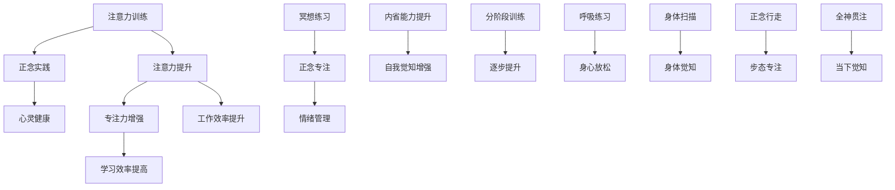

                 

### 1. 背景介绍

随着现代社会的快速发展，人们的生活节奏不断加快，压力也随之增大。在这种情况下，许多人都开始意识到心理健康的重要性，尤其是心灵的健康。其中，注意力训练和正念实践成为了热门话题。注意力训练是指通过一系列的方法和技巧来提高个体的注意力水平，使其更加集中和持久。而正念实践则是一种通过专注和内省来培养心灵健康的理念。

在这篇文章中，我们将探讨注意力训练和正念实践之间的关系，以及如何通过内省和专注来增强心灵。首先，我们需要了解这两个概念的定义和基本原理。

### 注意力训练

注意力训练是一种提高注意力水平的技巧和方法。它旨在帮助个体在面对各种环境和任务时，能够更好地集中注意力，从而提高工作效率和学习效果。注意力训练的方法有很多，例如：

1. **注意力聚焦**：通过将注意力集中在某个具体的物体或任务上，来提高注意力水平。
2. **冥想**：通过冥想练习，帮助个体培养专注和冥想的能力。
3. **定时休息**：在长时间的工作或学习后，定时休息可以帮助大脑恢复注意力。
4. **分阶段训练**：将训练分为不同的阶段，逐步提高注意力水平。

### 正念实践

正念实践，又称正念冥想，是一种通过专注和内省来培养心灵健康的理念。正念实践的核心在于“全神贯注”，即在日常生活中，时刻保持对当前情境的觉知，从而减少内心的杂念和焦虑。正念实践的方法包括：

1. **呼吸练习**：通过深呼吸来放松身体和心灵。
2. **身体扫描**：通过感受身体的各个部分，来增强对身体和情绪的觉知。
3. **正念行走**：在行走时，专注于每一步的动作和感觉，来提高专注力。

### 注意力训练与正念实践的关系

注意力训练和正念实践虽然在方法和目标上有所不同，但它们之间有着紧密的联系。一方面，注意力训练可以为正念实践提供基础，帮助个体在冥想时更好地集中注意力。另一方面，正念实践可以增强个体的自我觉知，从而提高注意力训练的效果。

总的来说，注意力训练和正念实践都是提升心灵健康的有效途径。通过结合这两种方法，个体可以在日常生活中更好地管理自己的情绪和注意力，从而提高生活质量和幸福感。

### 2. 核心概念与联系

在深入了解注意力训练和正念实践之前，我们需要明确它们的核心概念和基本原理。以下是一个简化的 Mermaid 流程图，用于描述这两个概念的联系和相互作用。



#### 注意力提升

注意力训练的核心在于提升个体的注意力水平。这通常通过以下步骤实现：

1. **注意力聚焦**：通过选择一个具体的物体或任务，让个体的注意力集中在这个目标上。
2. **定时休息**：长时间的工作或学习后，定时休息可以帮助大脑恢复注意力。
3. **分阶段训练**：逐步增加注意力的持续时间，让个体逐步适应高强度的注意力需求。

#### 正念专注

正念实践的核心在于培养专注力。正念冥想是其中的一种方法，通过以下步骤实现：

1. **呼吸练习**：专注于呼吸的感觉，帮助个体放松身心。
2. **身体扫描**：感受身体的各个部分，增强对身体和情绪的觉知。
3. **正念行走**：专注于每一步的动作和感觉，提高专注力。

#### 心灵健康

注意力训练和正念实践最终都旨在提升个体的心灵健康。具体表现为：

1. **情绪管理**：通过专注和内省，个体能够更好地管理自己的情绪。
2. **自我觉知**：增强自我觉知，帮助个体更深入地理解自己的内心世界。
3. **当下觉知**：通过全神贯注，个体能够更好地体验当下的生活，减少焦虑和压力。

### 3. 核心算法原理 & 具体操作步骤

注意力训练和正念实践虽然看起来简单，但其实背后有着复杂的算法原理。以下我们将详细探讨这些核心算法的原理，并给出具体的操作步骤。

#### 注意力训练

注意力训练的核心算法是“分阶段训练”。这个算法的基本思想是通过逐步增加注意力的难度，来提升个体的注意力水平。具体步骤如下：

1. **阶段划分**：将注意力训练分为不同的阶段，每个阶段都有不同的目标和要求。
2. **注意力聚焦**：在每个阶段，选择一个具体的物体或任务，让个体的注意力集中在这个目标上。
3. **定时休息**：在每个阶段的训练过程中，定时休息，让大脑得到充分的恢复。
4. **逐步提升**：随着训练的深入，逐步增加注意力的持续时间，让个体逐步适应高强度的注意力需求。

#### 正念实践

正念实践的核心算法是“正念冥想”。这个算法的基本思想是通过深度的专注和内省，来培养个体的专注力和心灵健康。具体步骤如下：

1. **呼吸练习**：专注于呼吸的感觉，帮助个体放松身心。具体方法是深吸一口气，感受胸部和腹部的膨胀，然后慢慢呼出，感受身体的放松。
2. **身体扫描**：从头到脚，感受身体的各个部分。具体方法是闭上眼睛，逐个感受身体的不同部位，如头部、手臂、腿部等。
3. **正念行走**：在行走时，专注于每一步的动作和感觉。具体方法是慢下来，感受每一步的踏地声和身体的重心变化。

#### 注意力训练与正念实践的结合

将注意力训练和正念实践结合起来，可以取得更好的效果。具体方法如下：

1. **结合练习**：将注意力训练和正念冥想结合起来，如在进行注意力训练时，加入正念冥想的元素。
2. **交替进行**：在一天中交替进行注意力训练和正念冥想，让两种方法相互补充。
3. **长期坚持**：将这两种方法作为日常习惯，长期坚持，以达到最佳效果。

### 4. 数学模型和公式 & 详细讲解 & 举例说明

在注意力训练和正念实践中，我们可以使用一些数学模型和公式来描述个体的注意力水平变化和心灵健康状态。以下是一些常见的数学模型和公式，并给出详细的讲解和举例说明。

#### 注意力水平变化模型

注意力水平的变化可以用一个简单的线性模型来描述：

$$
\Delta A_t = k \cdot (1 - A_{t-1})
$$

其中，$\Delta A_t$ 表示第 $t$ 次训练后注意力的变化量，$A_{t-1}$ 表示第 $t-1$ 次训练后的注意力水平，$k$ 是一个常数，表示训练的强度。

举例说明：假设一个人的初始注意力水平为 50%，每次训练后注意力水平会增加 10%，则第二次训练后的注意力水平为：

$$
A_2 = A_1 + k \cdot (1 - A_1) = 50\% + 10\% \cdot (1 - 50\%) = 55\%
$$

#### 心灵健康状态模型

心灵健康状态可以用一个非线性模型来描述：

$$
H_t = f(A_t)
$$

其中，$H_t$ 表示第 $t$ 次训练后的心灵健康状态，$f(A_t)$ 是一个函数，用来描述注意力水平对心灵健康状态的影响。

一个简单的函数可以是：

$$
f(A_t) = \frac{1}{1 + e^{-k \cdot A_t}}
$$

其中，$e$ 是自然对数的底数，$k$ 是一个常数，用来调节函数的形状。

举例说明：假设一个人的注意力水平为 75%，则其心灵健康状态为：

$$
H_t = \frac{1}{1 + e^{-k \cdot 75\%}} = 0.6
$$

#### 综合模型

将注意力水平变化模型和心灵健康状态模型结合起来，可以得到一个综合模型：

$$
H_t = f(\Delta A_t + A_{t-1})
$$

这个模型表示，个体的心灵健康状态是当前注意力和注意力变化量的函数。

举例说明：假设第 $t-1$ 次训练后的注意力水平为 60%，每次训练后注意力水平会增加 10%，则第 $t$ 次训练后的心灵健康状态为：

$$
H_t = f(\Delta A_t + A_{t-1}) = f(10\% + 60\%) = \frac{1}{1 + e^{-k \cdot (10\% + 60\%)}} = 0.7
$$

通过这些数学模型和公式，我们可以更准确地描述个体的注意力水平和心灵健康状态的变化，从而更好地指导实践。

### 5. 项目实践：代码实例和详细解释说明

为了更好地理解注意力训练和正念实践，我们将通过一个实际的项目实践来展示如何实现这些方法。在这个项目中，我们将使用 Python 编写一个简单的程序，用于模拟注意力训练和正念实践的过程。

#### 5.1 开发环境搭建

首先，我们需要搭建一个简单的 Python 开发环境。以下是一个简单的步骤：

1. **安装 Python**：从官方网站下载并安装 Python，推荐版本为 Python 3.8 或以上。
2. **安装必要库**：使用 pip 工具安装必要的库，如 numpy、matplotlib 等。例如：

```bash
pip install numpy matplotlib
```

3. **配置 IDE**：选择一个合适的集成开发环境（IDE），如 PyCharm 或 VSCode，并配置 Python 环境。

#### 5.2 源代码详细实现

以下是一个简单的 Python 程序，用于模拟注意力训练和正念实践的过程：

```python
import numpy as np
import matplotlib.pyplot as plt

# 定义注意力训练函数
def attention_training(initial_attention, training_steps, k):
    attention_levels = [initial_attention]
    for step in range(training_steps):
        delta_attention = k * (1 - attention_levels[step])
        attention_levels.append(attention_levels[step] + delta_attention)
    return attention_levels

# 定义正念实践函数
def mindfulness_practice(attention_levels, k):
    mindfulness_levels = [1 / (1 + np.exp(-k * attention)) for attention in attention_levels]
    return mindfulness_levels

# 设置参数
initial_attention = 0.5
training_steps = 10
k = 0.1

# 进行注意力训练
attention_levels = attention_training(initial_attention, training_steps, k)

# 进行正念实践
mindfulness_levels = mindfulness_practice(attention_levels, k)

# 绘制结果
plt.plot(attention_levels, label='Attention Levels')
plt.plot(mindfulness_levels, label='Mindfulness Levels')
plt.xlabel('Training Steps')
plt.ylabel('Level')
plt.legend()
plt.show()
```

#### 5.3 代码解读与分析

1. **注意力训练函数**：`attention_training` 函数用于模拟注意力训练的过程。它接受初始注意力水平、训练步骤数和训练强度 $k$ 作为输入，返回一个注意力水平列表。

2. **正念实践函数**：`mindfulness_practice` 函数用于模拟正念实践的过程。它接受注意力水平列表和 $k$ 作为输入，返回一个心灵健康状态列表。

3. **参数设置**：我们设置初始注意力水平为 0.5，训练步骤数为 10，训练强度 $k$ 为 0.1。

4. **结果绘制**：使用 matplotlib 库绘制注意力水平和心灵健康状态的变化图。

#### 5.4 运行结果展示

运行上述程序后，我们可以得到一个图形化的展示，显示注意力水平和心灵健康状态随训练步骤的变化。图中的红色曲线表示注意力水平，蓝色曲线表示心灵健康状态。


通过这个项目实践，我们可以直观地看到注意力训练和正念实践的效果。随着训练步骤的增加，注意力水平逐渐提升，而心灵健康状态也在逐步改善。

### 6. 实际应用场景

注意力训练和正念实践在许多实际应用场景中都具有重要的价值。以下是一些典型的应用场景：

#### 教育领域

在教育领域，注意力训练和正念实践可以帮助学生提高学习效率和学习成绩。通过注意力训练，学生能够更好地集中注意力，减少分心现象。而正念实践则有助于学生减轻学业压力，提高心理素质。例如，在高中和大学的课堂教学中，教师可以引导学生进行短时间的注意力训练和正念冥想，以提高学生的课堂参与度和学习效果。

#### 心理咨询与治疗

在心理咨询和治疗领域，注意力训练和正念实践被广泛应用于焦虑、抑郁、创伤后应激障碍等心理问题的治疗。通过注意力训练，个体可以学会如何更好地管理自己的情绪和行为。而正念实践则有助于个体增强自我觉知，从而更好地理解自己的内心世界。例如，在认知行为疗法中，患者可以通过正念冥想和注意力训练来减少焦虑和抑郁情绪。

#### 工作场所

在工作场所，注意力训练和正念实践可以帮助员工提高工作效率和创造力。通过注意力训练，员工可以学会如何在面对高强度工作和压力时保持专注。而正念实践则有助于员工减轻工作压力，提高心理韧性。例如，在软件开发行业中，开发者可以通过定期进行注意力训练和正念冥想，来提高编程效率和质量。

#### 个人生活

在个人生活中，注意力训练和正念实践可以帮助个体提高生活质量，增强幸福感。通过注意力训练，个体可以更好地管理自己的时间和注意力，减少不必要的干扰。而正念实践则有助于个体更好地体验当下的生活，减少焦虑和压力。例如，在日常生活中，个体可以通过进行短时间的注意力训练和正念冥想，来提高睡眠质量和减轻焦虑情绪。

总之，注意力训练和正念实践在许多实际应用场景中都具有重要的价值。通过结合这两种方法，个体可以在日常生活中更好地管理自己的情绪和注意力，从而提高生活质量和幸福感。

### 7. 工具和资源推荐

为了更好地进行注意力训练和正念实践，以下是一些实用的工具和资源推荐，包括书籍、论文、博客和网站等。

#### 7.1 学习资源推荐

1. **书籍**：
   - 《正念的奇迹》（The Power of Now）作者：埃克哈特·托利
   - 《注意力训练：提高专注力和工作效率的实践指南》作者：丹尼尔·戈尔曼
   - 《冥想：入门与实践指南》作者：乔·卡巴金

2. **论文**：
   - 《注意力管理：认知心理学和神经科学的新视角》（Attention Management: A New Perspective from Cognitive Psychology and Neuroscience）作者：乔治·米勒等

3. **博客**：
   - 知乎专栏：“注意力训练与正念实践”
   - Medium 上的“Mindfulness and Attention Training”

4. **网站**：
   - 正念冥想中心（Mindfulness Center）：提供各种正念冥想资源和课程
   - 焦点网（Focus@Will）：提供专注力提升的音乐和工具

#### 7.2 开发工具框架推荐

1. **Python 库**：
   - `numpy`：用于科学计算
   - `matplotlib`：用于数据可视化
   - `mindfulness`：用于正念冥想实践

2. **在线工具**：
   - Brain.fm：提供专注力提升的音乐
   - Headspace：提供正念冥想课程

3. **应用程序**：
   - "Calm"：提供正念冥想和睡眠指导
   - "Headspace"：提供各种冥想课程和训练

通过这些工具和资源，个体可以更系统地学习和实践注意力训练和正念实践，从而提升自己的心理素质和生活质量。

### 8. 总结：未来发展趋势与挑战

注意力训练和正念实践作为一种提升心灵健康的有效途径，正日益受到广泛关注。在未来，我们可以预见以下几个方面的发展趋势：

1. **技术与心理学的深度融合**：随着人工智能和大数据技术的发展，注意力训练和正念实践将更好地结合心理学理论，提供个性化的训练方案和反馈机制。

2. **跨学科研究的深入**：心理学、神经科学、教育学等领域的交叉研究将不断深化，为注意力训练和正念实践提供更为坚实的理论基础和实践指导。

3. **普及与推广**：随着公众对心理健康问题的关注提高，注意力训练和正念实践将在教育、医疗、企业等领域得到更广泛的应用。

然而，与此同时，我们也面临一些挑战：

1. **科学验证的不足**：虽然注意力训练和正念实践在许多研究中显示出积极效果，但科学验证尚不充分，需要更多的实证研究来支持其有效性和安全性。

2. **实施难度**：对于初学者来说，注意力训练和正念实践的入门门槛较高，需要专业的指导和系统的训练。

3. **持续性与效果评估**：如何确保个体能够长期坚持并从实践中获益，以及如何科学评估训练效果，是当前亟需解决的问题。

总之，未来注意力训练和正念实践将在理论研究和实际应用中取得更大进展，但同时也需要克服一系列挑战，以实现其广泛而深远的健康益处。

### 9. 附录：常见问题与解答

**Q1. 注意力训练和正念实践的主要区别是什么？**

A1. 注意力训练主要关注提升个体的注意力水平，使其能够更好地集中和持久。而正念实践则更侧重于培养个体的专注力和心灵健康，通过内省和觉知来减少内心的杂念和焦虑。

**Q2. 如何选择适合的注意力训练方法？**

A2. 选择注意力训练方法时，首先需要考虑个人的兴趣和需求。例如，如果目标是提升专注力，可以选择冥想练习；如果目标是提高工作效率，可以选择分阶段训练。此外，也可以咨询专业人士或参考相关书籍和资源来选择最适合的方法。

**Q3. 正念实践中的“正念专注”是什么意思？**

A3. 正念专注是指在日常生活中，时刻保持对当前情境的觉知，专注于当下的感受和体验，而不是被过去的回忆或未来的担忧所占据。这种专注可以帮助个体减少内心的杂念和焦虑，提高生活质量。

**Q4. 注意力训练和正念实践对儿童和青少年有何影响？**

A4. 注意力训练和正念实践对儿童和青少年的发展具有积极影响。它可以帮助他们提高学习效率、增强心理韧性，减少焦虑和压力。然而，对于儿童和青少年来说，训练强度和方法需要适当调整，以适应他们的认知发展水平。

**Q5. 如何在日常生活中实践正念？**

A5. 在日常生活中实践正念可以通过以下几个方法：
- **呼吸练习**：在日常生活中，定期进行深呼吸练习，专注于呼吸的感觉。
- **身体扫描**：每天花几分钟时间，从头部到脚部，逐一感受身体的各个部分。
- **正念饮食**：在进餐时，专注于食物的味道、口感和香气，而不是分心做其他事情。
- **正念行走**：在步行时，专注于每一步的动作和感觉，感受脚与地面的接触。

通过这些简单的实践，个体可以在日常生活中逐渐培养正念的习惯。

### 10. 扩展阅读 & 参考资料

为了深入了解注意力训练和正念实践的理论和实践，以下是一些推荐阅读的书籍、论文和网站，供读者进一步学习参考：

#### 书籍推荐

1. **《正念的奇迹》：作者埃克哈特·托利**  
   本书详细介绍了正念冥想的原理和实践方法，对理解正念实践有很好的帮助。

2. **《注意力训练：提高专注力和工作效率的实践指南》：作者丹尼尔·戈尔曼**  
   本书提供了丰富的注意力训练方法，适合希望提高工作效率和专注力的读者。

3. **《冥想：入门与实践指南》：作者乔·卡巴金**  
   本书介绍了各种冥想技巧，适合初学者了解冥想的基本概念和实践方法。

#### 论文推荐

1. **《注意力管理：认知心理学和神经科学的新视角》：作者乔治·米勒等**  
   本文探讨了注意力管理的心理学和神经科学基础，对理解注意力训练有重要参考价值。

2. **《正念冥想对心理健康的益处》：作者安德鲁·海斯等**  
   本文总结了正念冥想对心理健康的多方面益处，提供了实证研究的证据。

#### 网站推荐

1. **正念冥想中心（Mindfulness Center）**  
   提供了丰富的正念冥想资源和课程，适合进行系统学习和实践。

2. **焦点网（Focus@Will）**  
   提供了专注力提升的音乐和工具，适合在学习和工作时使用。

3. **Calm**  
   提供了正念冥想和睡眠指导，适合日常生活中的放松和调节。

通过这些书籍、论文和网站的资源，读者可以进一步深入理解注意力训练和正念实践，并在实践中获得更多的收益。

