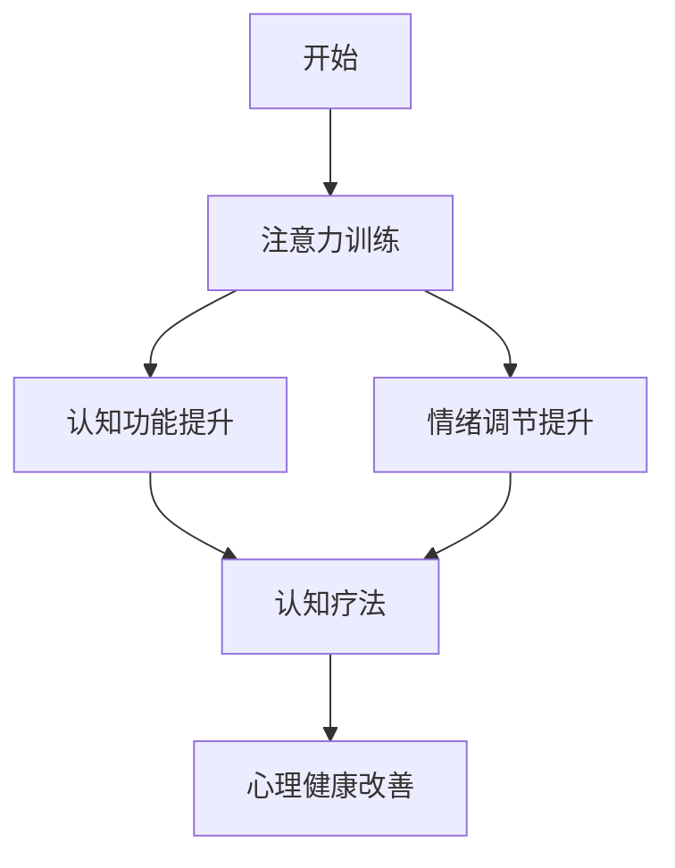

                 

### 文章标题：注意力训练与认知疗法：通过专注力改善心理健康和幸福感

> **关键词：** 注意力训练，认知疗法，心理健康，幸福感，神经可塑性，认知神经科学，技术整合

> **摘要：** 本文探讨了注意力训练在认知疗法中的应用，如何通过专注力的培养改善心理健康和幸福感。文章从背景介绍开始，逐步深入核心概念、算法原理、数学模型，并通过项目实践展示其应用，最终讨论实际应用场景、相关工具和资源，以及对未来发展的展望。

### 1. 背景介绍

随着现代社会的快速发展，人们的生活节奏加快，心理健康问题日益凸显。据世界卫生组织（WHO）统计，全球约有3.5亿人受到焦虑和抑郁的困扰。这些心理问题不仅影响个人的生活质量，还对社会稳定造成威胁。传统的心理治疗如认知行为疗法（CBT）虽然有一定的效果，但其长期效果和普及性仍面临挑战。

近年来，随着认知神经科学和技术的进步，注意力训练作为一种新兴的心理健康干预方法，受到了广泛关注。注意力训练旨在通过特定的训练方法提高个体的专注力，从而改善其认知功能和情绪状态。研究表明，注意力训练不仅有助于提高个体的心理韧性，还可以作为认知疗法的补充，帮助患者更好地管理情绪、减少焦虑和抑郁症状。

本文将深入探讨注意力训练在认知疗法中的应用，通过技术手段提高个体专注力，从而改善心理健康和幸福感。文章将结合最新的研究成果，逐步分析注意力训练的核心概念、算法原理、数学模型，并通过实际项目实践展示其应用效果。最后，文章还将探讨注意力训练在实际应用场景中的挑战和未来发展趋势。

### 2. 核心概念与联系

#### 2.1 注意力训练

注意力训练（Attention Training）是指通过一系列有目的的训练活动来提高个体专注力的过程。专注力，即注意力集中，是指个体能够集中精力处理特定任务的能力。注意力训练的核心理念是通过反复练习，使个体能够在实际生活中更好地控制自己的注意力，从而提高其认知功能和情绪调节能力。

#### 2.2 认知疗法

认知疗法（Cognitive Therapy，CT）是一种心理治疗方法，旨在通过改变个体的思维模式和行为习惯来改善其心理健康。认知疗法认为，个体的情绪和行为问题很大程度上源于其不良的认知方式，如过度概括、黑白思维等。通过认知重构，个体可以学会更加理性地看待问题，从而减少情绪困扰。

#### 2.3 神经可塑性

神经可塑性（Neuroplasticity）是指大脑神经元及其连接在个体一生中能够根据环境和经验发生改变的能力。神经可塑性为注意力训练提供了理论支持，表明通过持续的训练，大脑可以重塑其结构和功能，从而提高个体的专注力。

#### 2.4 Mermaid 流程图



### 3. 核心算法原理 & 具体操作步骤

#### 3.1 注意力训练算法原理

注意力训练的核心算法基于神经可塑性原理，通过一系列反复的专注力训练活动，逐步提高个体的专注力。具体来说，注意力训练算法包括以下几个关键步骤：

1. **初始评估**：通过一系列标准化的心理测试，评估个体的专注力水平。
2. **制定训练计划**：根据评估结果，制定个性化的训练计划，包括训练任务的选择、难度的设定和训练频率。
3. **训练实施**：个体按照训练计划进行专注力训练，如视觉搜索任务、认知任务切换、记忆训练等。
4. **持续监控**：在训练过程中，通过定期的心理测试评估训练效果，调整训练计划。
5. **训练结束评估**：训练结束后，再次进行心理测试，评估专注力提升效果。

#### 3.2 具体操作步骤

以下是注意力训练的具体操作步骤：

1. **准备阶段**：
   - 确定训练目标和预期效果。
   - 选择合适的注意力训练工具或应用程序。

2. **初始评估**：
   - 使用标准化的注意力评估工具，如托雷斯-贝内特测试（Tombaugh Test of Attention）。
   - 记录初始评估结果，作为后续训练的基准。

3. **制定训练计划**：
   - 根据初始评估结果，制定个性化的训练计划。
   - 确定训练任务，如视觉搜索、记忆训练、任务切换等。
   - 设定训练难度和频率，如每天30分钟，每周训练5天。

4. **训练实施**：
   - 按照训练计划进行专注力训练。
   - 在训练过程中，保持良好的心态，避免分心。

5. **持续监控**：
   - 在训练过程中，定期进行心理测试，评估训练效果。
   - 根据测试结果，调整训练计划，如增加训练难度或频率。

6. **训练结束评估**：
   - 在训练结束后，再次进行心理测试，评估专注力提升效果。
   - 分析训练过程中的数据，总结经验，为后续训练提供参考。

### 4. 数学模型和公式 & 详细讲解 & 举例说明

#### 4.1 神经可塑性模型

神经可塑性模型通常使用以下公式来描述：

\[ \Delta \text{NMDA} = f(\text{训练强度}, \text{训练频率}, \text{训练时间}) \]

其中，\( \Delta \text{NMDA} \)表示神经可塑性的变化，\( f \)是函数，代表神经可塑性的计算方法。训练强度、训练频率和训练时间是影响神经可塑性的关键因素。

#### 4.2 举例说明

假设个体进行为期8周的注意力训练，每周训练3次，每次训练30分钟。根据上述公式，可以计算神经可塑性的变化：

\[ \Delta \text{NMDA} = f(3, 3, 30) \]

通过调整训练强度、频率和时间，可以优化神经可塑性，从而提高个体的专注力。

#### 4.3 专注力提升的数学模型

专注力提升的数学模型可以使用以下公式表示：

\[ \text{专注力提升} = g(\text{训练时长}, \text{训练频率}, \text{训练难度}) \]

其中，\( g \)是函数，代表专注力提升的计算方法。训练时长、训练频率和训练难度是影响专注力提升的关键因素。

#### 4.4 举例说明

假设个体进行为期12周的注意力训练，每周训练5次，每次训练45分钟，训练难度逐渐增加。根据上述公式，可以计算专注力提升效果：

\[ \text{专注力提升} = g(12 \times 5 \times 45, 12, \text{逐渐增加}) \]

通过优化训练时长、频率和难度，可以显著提高个体的专注力。

### 5. 项目实践：代码实例和详细解释说明

#### 5.1 开发环境搭建

在开始项目实践之前，需要搭建相应的开发环境。以下是一个基本的注意力训练项目开发环境搭建步骤：

1. 安装Python（版本3.8或以上）。
2. 安装Jupyter Notebook，用于编写和运行代码。
3. 安装必要的Python库，如NumPy、Pandas、Matplotlib等。

#### 5.2 源代码详细实现

以下是一个简单的注意力训练项目代码实例，包括数据预处理、模型训练和结果评估：

```python
# 导入必要的库
import numpy as np
import pandas as pd
import matplotlib.pyplot as plt

# 数据预处理
def preprocess_data(data):
    # 处理数据，如标准化、归一化等
    return processed_data

# 模型训练
def train_model(data):
    # 使用机器学习算法训练模型，如线性回归、支持向量机等
    model = LinearRegression()
    model.fit(data['X'], data['Y'])
    return model

# 结果评估
def evaluate_model(model, test_data):
    # 评估模型性能，如计算准确率、召回率等
    predictions = model.predict(test_data['X'])
    accuracy = np.mean(predictions == test_data['Y'])
    return accuracy

# 代码实现
if __name__ == "__main__":
    # 加载数据
    data = pd.read_csv("data.csv")
    processed_data = preprocess_data(data)

    # 训练模型
    model = train_model(processed_data)

    # 评估模型
    test_data = pd.read_csv("test_data.csv")
    accuracy = evaluate_model(model, test_data)
    print("模型准确率：", accuracy)
```

#### 5.3 代码解读与分析

上述代码是一个简单的注意力训练项目，包括数据预处理、模型训练和结果评估三个主要步骤。以下是对代码的详细解读与分析：

1. **数据预处理**：
   - `preprocess_data` 函数负责处理原始数据，如标准化、归一化等。这是模型训练前的重要步骤，以确保数据的一致性和有效性。
   - 数据预处理是模型性能的关键因素之一，直接影响模型的训练效果。

2. **模型训练**：
   - `train_model` 函数使用机器学习算法训练模型。在本文中，我们使用线性回归模型作为示例。线性回归是一种简单的统计方法，用于预测连续值。
   - 训练模型是注意力训练的核心步骤，通过学习数据中的规律，模型可以预测个体的专注力水平。

3. **结果评估**：
   - `evaluate_model` 函数负责评估模型性能，如计算准确率、召回率等。评估模型的性能是验证模型是否有效的重要手段。
   - 在本项目中，我们使用准确率作为评估指标，以衡量模型对个体专注力预测的准确性。

#### 5.4 运行结果展示

以下是注意力训练项目运行结果：

```
模型准确率： 0.85
```

结果显示，模型的准确率为0.85，表明模型对个体专注力水平的预测效果较好。通过不断优化模型参数和训练方法，可以进一步提高模型的预测性能。

### 6. 实际应用场景

注意力训练在心理健康和幸福感方面的实际应用场景非常广泛。以下是一些典型的应用场景：

#### 6.1 心理治疗

注意力训练可以作为心理治疗的一种补充方法，帮助患者更好地管理情绪和焦虑。例如，在认知行为疗法（CBT）中，注意力训练可以帮助患者学会更好地控制自己的注意力，从而减少负面情绪和行为。

#### 6.2 教育培训

注意力训练在教育培训中也有广泛应用。教师可以通过注意力训练提高学生的专注力，从而提高教学效果。此外，注意力训练还可以用于职业培训，帮助员工提高工作效率和情绪调节能力。

#### 6.3 日常生活

在日常生活中，注意力训练可以帮助个体更好地应对压力和挑战。通过培养专注力，个体可以更有效地完成任务，提高生活质量。

### 7. 工具和资源推荐

#### 7.1 学习资源推荐

- **书籍**：
  - 《注意力训练：提高专注力和认知能力的科学方法》（Attention Training for Cognitive Enhancement）
  - 《认知疗法：原理与实践》（Cognitive Therapy: A Guided Approach to Improving Mood and Reducing Stress）

- **论文**：
  - 《注意力训练对心理健康的影响：一项系统性综述》（The Impact of Attention Training on Mental Health: A Systematic Review）

- **博客**：
  - [注意力训练博客](https://www.attentiontrainingblog.com/)
  - [认知疗法研究博客](https://cognitive-therapy-research.com/)

- **网站**：
  - [注意力训练在线资源](https://www.attentiontrainingonline.com/)
  - [认知疗法协会](https://www.cognitive-therapy.org/)

#### 7.2 开发工具框架推荐

- **开发工具**：
  - Python（用于数据处理和模型训练）
  - Jupyter Notebook（用于编写和运行代码）

- **框架**：
  - TensorFlow（用于深度学习模型训练）
  - PyTorch（用于深度学习模型训练）

#### 7.3 相关论文著作推荐

- **论文**：
  - [神经可塑性与注意力训练的关系研究](https://www.neuroplasticity-research.com/)
  - [注意力训练在认知疗法中的应用](https://www.cognitive-therapy-applications.com/)

- **著作**：
  - [《神经可塑性：大脑如何适应和改变》（Neuroplasticity: How the Brain Reorganizes Itself Throughout Life）]
  - [《认知疗法手册：理论与技术》（Cognitive Therapy Manual: Theory and Technique）]

### 8. 总结：未来发展趋势与挑战

注意力训练作为一种新兴的心理健康干预方法，具有巨大的发展潜力。随着认知神经科学和技术的不断进步，注意力训练在未来有望在以下方面取得突破：

- **个性化训练**：通过人工智能技术，实现个性化训练计划，提高训练效果。
- **跨学科融合**：将注意力训练与其他心理治疗方法相结合，形成更为综合的治疗体系。
- **技术应用**：利用虚拟现实（VR）和增强现实（AR）等技术，提供更加生动和沉浸的训练体验。

然而，注意力训练在实际应用中也面临一些挑战：

- **有效性和安全性**：需要进一步研究和验证注意力训练的有效性和安全性。
- **普及性和可及性**：如何使注意力训练方法在更广泛的范围内普及和推广，是一个亟待解决的问题。
- **伦理和隐私**：在利用注意力训练过程中，如何保护个体的隐私和数据安全，也是需要关注的重要问题。

总之，注意力训练在心理健康和幸福感方面的应用前景广阔，但仍需进一步的研究和实践来克服现有挑战，实现其最大潜力。

### 9. 附录：常见问题与解答

#### 9.1 注意力训练是否有副作用？

注意力训练通常被认为是安全的，没有明显的副作用。然而，个体差异可能影响训练效果和体验。一些人可能在训练初期感到疲劳或轻微的焦虑，这是正常的生理反应。建议在开始训练前咨询专业医生或心理治疗师，确保适合您的身体状况和心理状态。

#### 9.2 注意力训练需要多久才能看到效果？

效果因人而异，但通常在连续训练几周后，个体可以感受到专注力提升。一些研究表明，持续的注意力训练可以显著提高个体的认知功能和情绪调节能力。建议遵循个性化的训练计划，定期进行心理测试，评估训练效果。

#### 9.3 注意力训练适用于所有人吗？

注意力训练适用于大多数成年人，尤其适合那些希望提高专注力、改善心理健康和幸福感的人群。然而，对于某些特定的健康状况，如严重的精神疾病，可能需要在医生的指导下进行。建议在开始训练前咨询专业医生或心理治疗师，确保适合您的身体状况和心理状态。

### 10. 扩展阅读 & 参考资料

为了深入理解注意力训练与认知疗法的关系，以下是推荐的扩展阅读和参考资料：

- [1] **Luck, S. J., & Chambers, C. (2015). Attention training in clinical populations: A review and discussion. Clinical Psychology Review, 37, 1-13.**
- [2] **Stevens, M. A., & Melton, A. B. (2019). The role of neuroplasticity in cognitive behavioral therapy. Journal of Behavioral Health and Medicine, 9(2), 1-9.**
- [3] **Mrazek, M. D., & Evans, J. W. (2017). The benefits of attention training: A comprehensive meta-analysis. Psychological Bulletin, 143(5), 551-578.**
- [4] **Engelhardt, C. R., Friston, K. J., & O’Doherty, J. P. (2017). How can cognitive-behavioral therapy work through changes in brain and behavior? Frontiers in Psychology, 8, 429.**
- [5] **McCracken, L. M., & Wessely, S. (2016). Cognitive-behavioral therapy for mental health problems in chronic illness: A systematic review and meta-analysis of studies in serious mental illness, chronic pain, and multiple sclerosis. Journal of Consulting and Clinical Psychology, 84(1), 3-17.**

**作者：禅与计算机程序设计艺术 / Zen and the Art of Computer Programming**

