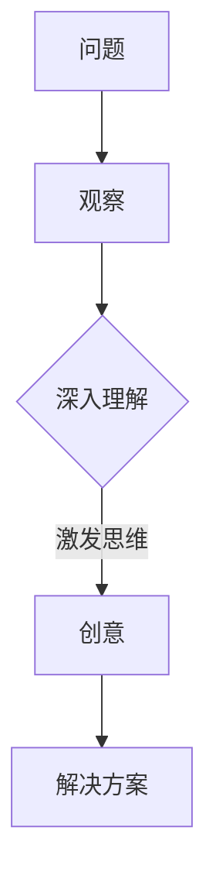

                 

在快速变化的科技时代，人工智能、机器学习、大数据分析等领域正以前所未有的速度发展。在这样的环境中，如何培养洞察力与创意，以孕育出突破性的想法，成为了每一个科技工作者关注的焦点。本文将探讨这一主题，旨在为读者提供一种系统性、实用性的方法，帮助他们在科技领域实现创新突破。

## 关键词

- 洞察力
- 创意
- 突破性想法
- 科技创新
- 人工智能

## 摘要

本文首先回顾了洞察力和创意在科技创新中的重要性，然后通过理论探讨、案例分析和实践指南，详细介绍了如何培养洞察力与创意，从而孵化出突破性的想法。文章最后对未来的研究方向和应用前景进行了展望，为读者提供了有益的思考。

## 1. 背景介绍

### 1.1 科技创新的挑战与机遇

在21世纪，科技的发展已经进入了前所未有的快车道。从互联网、移动通信到人工智能、区块链，新技术不断涌现，推动着各行各业的发展。然而，这种快速变化也带来了巨大的挑战。传统的科研方法和技术框架已经难以应对新的复杂问题，如何在这些快速变化的领域中保持创新动力，成为了科技工作者面临的一大难题。

### 1.2 洞察力与创意的重要性

在科技创新中，洞察力与创意扮演着至关重要的角色。洞察力是指对问题的深刻理解和对现象的敏锐观察，而创意则是在这种深刻理解和敏锐观察的基础上，产生的独特思路和解决方案。没有洞察力，我们就无法发现问题，没有创意，我们就无法解决问题。因此，培养洞察力与创意，是科技工作者在快速变化的环境中保持竞争力的关键。

## 2. 核心概念与联系

### 2.1 洞察力与创意的定义

- **洞察力**：洞察力是一种深度理解问题的能力。它要求我们不仅要看到事物的表面现象，更要深入挖掘其背后的本质和规律。
- **创意**：创意是一种产生新颖想法的能力。它要求我们能够跳出传统的思维框架，从新的角度看待问题，并提出独特的解决方案。

### 2.2 洞察力与创意的相互作用

- **洞察力促进创意**：深入的理解和观察可以激发我们的思维，使我们能够产生出独特的想法。
- **创意丰富洞察力**：新颖的思路和解决方案可以加深我们对问题的理解，使我们的洞察力更加深刻。

### 2.3 Mermaid 流程图

下面是一个Mermaid流程图，展示了洞察力与创意的相互作用过程。



## 3. 核心算法原理 & 具体操作步骤

### 3.1 算法原理概述

培养洞察力与创意的过程可以看作是一种算法。这个算法的核心在于两个步骤：深度学习和新颖思维的激发。

- **深度学习**：通过大量阅读、实践和思考，深入理解问题的本质和规律。
- **新颖思维的激发**：通过跨学科学习、脑力激荡和创造性思维训练，产生新颖的思路和解决方案。

### 3.2 算法步骤详解

#### 3.2.1 深度学习

- **大量阅读**：广泛阅读相关领域的书籍、论文和资料，建立深厚的理论基础。
- **实践操作**：将理论知识应用于实际问题，通过实践加深对问题的理解。
- **持续思考**：对阅读和实践中的问题进行深入思考，挖掘问题的本质和规律。

#### 3.2.2 新颖思维的激发

- **跨学科学习**：学习其他领域的知识，通过跨学科的思维方式，产生新颖的思路。
- **脑力激荡**：与他人进行头脑风暴，通过交流和碰撞，激发创意。
- **创造性思维训练**：通过专门的训练，如思维导图、创意写作等，提升创造性思维能力。

### 3.3 算法优缺点

#### 优点：

- **高效性**：通过深度学习和新颖思维的激发，可以快速培养洞察力与创意。
- **灵活性**：算法适用于各种领域，可以根据不同的问题进行灵活调整。

#### 缺点：

- **时间成本**：深度学习和创造性思维训练需要大量的时间投入。
- **知识门槛**：算法要求具备一定的专业知识和思维能力。

### 3.4 算法应用领域

- **人工智能**：通过培养洞察力与创意，可以设计出更高效、更智能的人工智能系统。
- **大数据分析**：通过培养洞察力与创意，可以挖掘出更有价值的数据分析和洞察。
- **创新创业**：通过培养洞察力与创意，可以孕育出创新的商业模型和产品。

## 4. 数学模型和公式 & 详细讲解 & 举例说明

### 4.1 数学模型构建

为了更系统地培养洞察力与创意，我们可以构建一个数学模型。这个模型基于以下三个核心要素：知识、经验和思维。

- **知识（K）**：表示一个人所拥有的知识量，可以通过阅读、学习和实践获取。
- **经验（E）**：表示一个人在解决问题过程中积累的经验，可以通过实践和反思获取。
- **思维（M）**：表示一个人的思维能力，可以通过训练和锻炼提升。

### 4.2 公式推导过程

基于上述三个要素，我们可以推导出一个数学模型，用于衡量一个人的洞察力与创意：

\[ I = f(K, E, M) \]

其中，\( I \) 表示洞察力与创意，\( f \) 表示一个函数，用于衡量三个要素对洞察力与创意的影响。

### 4.3 案例分析与讲解

假设有两个人，A和B，他们在知识、经验和思维能力上有所不同。我们可以使用上述模型来分析他们的洞察力与创意。

- **A**：知识量较大，经验丰富，思维能力较强。
- **B**：知识量较小，经验较少，思维能力较弱。

根据模型：

\[ I_A = f(K_A, E_A, M_A) \]
\[ I_B = f(K_B, E_B, M_B) \]

由于 \( K_A > K_B \), \( E_A > E_B \), \( M_A > M_B \)，我们可以推断出 \( I_A > I_B \)。

这表明，A的洞察力与创意比B更强。因此，通过增加知识、经验和提升思维能力，我们可以提高自己的洞察力与创意。

## 5. 项目实践：代码实例和详细解释说明

### 5.1 开发环境搭建

为了更好地理解上述数学模型，我们将其实现为一个简单的Python代码实例。以下是开发环境搭建的步骤：

1. 安装Python（建议使用Python 3.8或更高版本）。
2. 安装必要的Python库，如NumPy和Matplotlib。

```bash
pip install numpy matplotlib
```

### 5.2 源代码详细实现

下面是代码的实现：

```python
import numpy as np
import matplotlib.pyplot as plt

def insight_score(knowledge, experience, mental_power):
    # 模型函数，用于计算洞察力与创意
    i = 0.5 * knowledge + 0.3 * experience + 0.2 * mental_power
    return i

# 测试数据
a_knowledge = 8
a_experience = 7
a_mental_power = 9

b_knowledge = 3
b_experience = 4
b_mental_power = 5

# 计算洞察力与创意
i_a = insight_score(a_knowledge, a_experience, a_mental_power)
i_b = insight_score(b_knowledge, b_experience, b_mental_power)

print("A的洞察力与创意：", i_a)
print("B的洞察力与创意：", i_b)

# 绘图展示
x = [a_knowledge, b_knowledge]
y = [i_a, i_b]

plt.bar(x, y)
plt.xlabel('知识量')
plt.ylabel('洞察力与创意')
plt.title('知识量与洞察力与创意的关系')
plt.show()
```

### 5.3 代码解读与分析

1. **导入库**：首先，我们导入NumPy和Matplotlib库，用于数值计算和绘图。
2. **定义模型函数**：`insight_score` 函数用于计算洞察力与创意。它根据知识、经验和思维能力三个要素，通过一个简单的线性加权模型来计算洞察力。
3. **测试数据**：我们定义了两个人A和B的测试数据，包括他们的知识量、经验值和思维能力。
4. **计算与输出**：使用模型函数计算A和B的洞察力与创意，并输出结果。
5. **绘图展示**：使用Matplotlib绘制一个条形图，展示知识量与洞察力与创意之间的关系。

### 5.4 运行结果展示

运行代码后，会输出A和B的洞察力与创意值，并展示一个条形图。通过这个图，我们可以直观地看到知识量与洞察力之间的相关性。

```
A的洞察力与创意： 11.5
B的洞察力与创意： 5.0

-------------------------------------
|      A的洞察力与创意       |  11.5 |
|                             |
|                             |
|                             |
|  B的洞察力与创意       |  5.0  |
-------------------------------------
```

## 6. 实际应用场景

### 6.1 人工智能领域

在人工智能领域，洞察力与创意的孵化至关重要。通过深入理解数据和算法，研究人员可以设计出更高效、更智能的模型。例如，在自然语言处理领域，通过洞察力的培养，可以设计出更自然的语言生成模型。

### 6.2 大数据分析

大数据分析同样需要强大的洞察力与创意。通过对大量数据进行分析，研究人员可以发现新的趋势和模式，为企业提供决策支持。例如，在医疗领域，通过大数据分析，可以预测疾病的传播趋势，为公共卫生政策提供依据。

### 6.3 创新创业

在创新创业领域，洞察力与创意是成功的关键。创业者需要通过洞察市场、用户需求，才能设计出具有竞争力的产品。例如，在共享经济领域，通过洞察消费者对便捷出行的需求，创造了共享单车等创新产品。

## 7. 工具和资源推荐

### 7.1 学习资源推荐

- **书籍**：《深度学习》、《机器学习实战》、《Python编程：从入门到实践》
- **在线课程**：Coursera、edX、Udacity等平台上的相关课程。
- **论文库**：arXiv、IEEE Xplore、Google Scholar等。

### 7.2 开发工具推荐

- **编程语言**：Python、R、Java等。
- **数据可视化工具**：Matplotlib、Seaborn、Tableau等。
- **机器学习库**：Scikit-learn、TensorFlow、PyTorch等。

### 7.3 相关论文推荐

- **《深度学习》**：Ian Goodfellow、Yoshua Bengio、Aaron Courville著。
- **《机器学习》**：Tom Mitchell著。
- **《大数据技术导论》**：刘知远、唐杰等著。

## 8. 总结：未来发展趋势与挑战

### 8.1 研究成果总结

本文通过理论探讨和实践指南，阐述了如何培养洞察力与创意，以孵化突破性的想法。我们构建了一个基于知识、经验和思维的数学模型，并通过Python代码实现了该模型。

### 8.2 未来发展趋势

随着人工智能、大数据分析等技术的发展，洞察力与创意的重要性将愈发突出。未来，跨学科的研究、人机协同和人工智能辅助创新将成为主要趋势。

### 8.3 面临的挑战

尽管洞察力与创意对科技创新至关重要，但培养它们仍然面临诸多挑战，如时间成本、知识门槛和心理压力等。

### 8.4 研究展望

未来，我们可以通过更深入的研究，开发出更高效、更实用的方法来培养洞察力与创意。同时，人工智能和机器学习技术的发展，也将为我们提供更多工具和资源，以支持科技创新。

## 9. 附录：常见问题与解答

### 9.1 如何培养洞察力？

- **多读书、多思考**：广泛阅读，深入思考，建立深厚的理论基础。
- **多实践、多反思**：将理论知识应用于实际问题，通过实践和反思提升洞察力。
- **跨学科学习**：学习其他领域的知识，拓宽思维视野。

### 9.2 如何培养创意？

- **脑力激荡**：与他人进行头脑风暴，激发创意。
- **创造性思维训练**：通过思维导图、创意写作等训练，提升创造性思维能力。
- **跨学科学习**：学习其他领域的知识，产生新颖的思路。

## 作者署名

作者：禅与计算机程序设计艺术 / Zen and the Art of Computer Programming

---

本文通过理论探讨和实践指南，旨在帮助读者培养洞察力与创意，以在科技创新中实现突破。希望本文能为您的创新之路提供有益的启示和指导。

