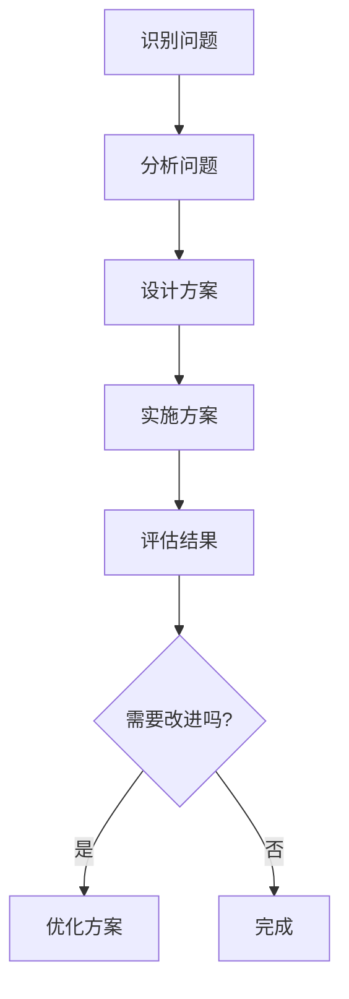

                 

在快速发展的信息技术领域，解决复杂问题是工程师和开发者日常工作的核心。本文将探讨如何通过洞察力和创新思维来提升问题解决能力，特别是在IT领域中的应用。通过分析核心概念、算法原理、数学模型、实践案例以及未来趋势，我们将深入理解如何将洞察力应用于问题解决，从而推动技术的进步。

## 1. 背景介绍

信息技术（IT）的迅猛发展使得我们在处理数据、构建系统和解决难题时面临了前所未有的复杂性。现代企业不仅需要高效的系统，还要求系统能够灵活适应不断变化的环境。这种背景下，传统的解决方案往往难以应对。因此，提升问题解决能力成为了一个至关重要的课题。

### 1.1 信息技术的发展趋势

- **大数据与云计算**：大数据和云计算使得我们能够处理和分析海量数据，但同时也增加了系统的复杂性和维护难度。
- **人工智能与机器学习**：AI和ML技术正在改变各行各业，同时也带来了新的挑战，如算法的透明性和公平性。
- **物联网（IoT）**：IoT的发展使得设备和系统能够实现更紧密的连接，但同时也带来了安全和管理方面的挑战。
- **区块链**：区块链技术的兴起为数据的安全性和透明性提供了新的解决方案，但其应用场景仍在探索中。

### 1.2 问题解决的重要性

- **系统稳定性**：高效的解决方案能够确保系统的稳定性，减少故障和停机时间。
- **成本效益**：优化问题解决方法可以降低开发和维护成本。
- **创新能力**：有效的解决问题能力有助于推动技术的创新，从而在激烈的市场竞争中保持优势。

## 2. 核心概念与联系

为了更好地理解如何将洞察力应用于问题解决，我们需要明确一些核心概念，并展示它们之间的联系。

### 2.1 洞察力的定义

洞察力是指通过观察、分析和理解，深刻地把握事物本质和内在联系的能力。在IT领域，洞察力可以帮助我们：

- 发现问题本质
- 设计创新的解决方案
- 提高系统的性能和可维护性

### 2.2 问题解决的流程

一个典型的问题解决流程包括以下几个步骤：

1. **识别问题**：发现并明确问题的性质和范围。
2. **分析问题**：通过分析数据和信息，理解问题的本质和原因。
3. **设计方案**：基于分析结果，提出解决方案。
4. **实施方案**：将设计方案转化为实际的系统或流程。
5. **评估结果**：对解决方案的效果进行评估，并根据反馈进行调整。

### 2.3 洞察力在问题解决中的应用

洞察力在问题解决中的应用体现在以下几个方面：

- **预判问题**：通过观察和数据分析，预测可能出现的问题，从而提前采取措施。
- **优化方案**：通过深入理解问题，提出更高效的解决方案。
- **持续改进**：通过不断分析反馈，优化系统性能和可靠性。

### 2.4 Mermaid 流程图

以下是一个展示洞察力在问题解决中应用的 Mermaid 流程图：



## 3. 核心算法原理 & 具体操作步骤

在本节中，我们将探讨一些核心算法原理，并详细说明如何应用这些原理来解决问题。

### 3.1 算法原理概述

- **排序算法**：用于对数据进行排序，常见的排序算法包括快速排序、归并排序等。
- **搜索算法**：用于在数据结构中查找特定数据，常见的搜索算法包括二分搜索、深度优先搜索等。
- **动态规划**：用于解决具有重叠子问题的最优化问题。
- **图论算法**：用于解决与图相关的问题，如最短路径、最小生成树等。

### 3.2 具体操作步骤

以下是一个基于快速排序算法的示例，说明如何应用算法原理来解决问题：

#### 3.2.1 快速排序算法

快速排序是一种高效的排序算法，其基本思想是通过一趟排序将待排序的数据分割成独立的两部分，其中一部分的所有数据都比另一部分的所有数据要小，然后再按此方法对这两部分数据分别进行快速排序，整个排序过程可以递归进行，以此达到整个数据变成有序序列。

#### 3.2.2 快速排序算法的具体操作步骤

1. **选择基准值**：从数据序列中选择一个基准值。
2. **分区操作**：将序列分为两部分，一部分的数据值小于基准值，另一部分的数据值大于基准值。
3. **递归排序**：对小于和大于基准值的两部分数据分别进行快速排序。

以下是快速排序算法的伪代码：

```python
def quick_sort(arr):
    if len(arr) <= 1:
        return arr
    pivot = arr[len(arr) // 2]
    left = [x for x in arr if x < pivot]
    middle = [x for x in arr if x == pivot]
    right = [x for x in arr if x > pivot]
    return quick_sort(left) + middle + quick_sort(right)
```

### 3.3 算法应用示例

假设我们有一个包含以下数据的不排序数组：

```
[34, 7, 23, 32, 5, 62]
```

使用快速排序算法，我们可以将这个数组排序如下：

1. **选择基准值**：选择中间的值 23 作为基准值。
2. **分区操作**：将数组分为 [34, 5, 32] 和 [62, 7] 两个部分。
3. **递归排序**：对 [34, 5, 32] 和 [62, 7] 两个部分分别进行快速排序。

经过递归排序后，原始数组将被排序为：

```
[5, 7, 23, 32, 34, 62]
```

## 4. 数学模型和公式 & 详细讲解 & 举例说明

在本节中，我们将介绍一些用于问题解决的数学模型和公式，并通过详细讲解和举例来说明它们的应用。

### 4.1 数学模型概述

- **线性回归**：用于预测数值型变量的线性关系。
- **逻辑回归**：用于预测二分类问题的概率分布。
- **神经网络**：用于复杂函数的建模和预测。
- **决策树**：用于分类和回归问题的决策路径建模。

### 4.2 数学公式

以下是一些常用的数学公式：

$$
y = mx + b
$$

$$
P(y=1) = \frac{1}{1 + e^{-z}}
$$

$$
z = w \cdot x + b
$$

### 4.3 详细讲解

#### 4.3.1 线性回归

线性回归是一种用于预测数值型变量的简单统计方法。其基本思想是通过建立一条直线模型来描述因变量（Y）和自变量（X）之间的关系。

线性回归模型的一般形式为：

$$
y = mx + b
$$

其中，m 为斜率，b 为截距。

详细讲解：

1. **确定斜率 m**：通过计算 X 和 Y 的协方差（Cov(X, Y)）和 X 的方差（Var(X)），可以得到斜率 m 的估计值：

$$
m = \frac{Cov(X, Y)}{Var(X)}
$$

2. **确定截距 b**：通过计算 Y 的均值（Mean(Y)）和斜率 m，可以得到截距 b 的估计值：

$$
b = Mean(Y) - m \cdot Mean(X)
$$

#### 4.3.2 逻辑回归

逻辑回归是一种用于预测二分类问题概率分布的统计方法。其基本思想是通过建立逻辑函数来描述因变量（Y）和自变量（X）之间的关系。

逻辑回归模型的一般形式为：

$$
P(y=1) = \frac{1}{1 + e^{-z}}
$$

其中，z 为线性组合：

$$
z = w \cdot x + b
$$

详细讲解：

1. **确定权重 w**：通过计算 X 和 Y 的协方差（Cov(X, Y)）和 X 的方差（Var(X)），可以得到权重 w 的估计值：

$$
w = \frac{Cov(X, Y)}{Var(X)}
$$

2. **确定偏置 b**：通过计算 Y 的均值（Mean(Y)）和权重 w，可以得到偏置 b 的估计值：

$$
b = Mean(Y) - w \cdot Mean(X)
$$

### 4.4 举例说明

#### 4.4.1 线性回归示例

假设我们有一个简单的数据集，其中 X 和 Y 为数值型变量，如下所示：

| X   | Y   |
| --- | --- |
| 1   | 2   |
| 2   | 4   |
| 3   | 6   |
| 4   | 8   |

我们可以通过线性回归模型来预测 Y 的值。首先，计算斜率 m 和截距 b：

$$
m = \frac{Cov(X, Y)}{Var(X)} = \frac{2 + 4 + 6 + 8}{(1^2 + 2^2 + 3^2 + 4^2) - 4 \cdot (1 + 2 + 3 + 4)} = \frac{20}{30 - 4 \cdot 10} = 2
$$

$$
b = Mean(Y) - m \cdot Mean(X) = 5 - 2 \cdot 2.5 = 0
$$

因此，线性回归模型为：

$$
y = 2x
$$

我们可以使用这个模型来预测未知数据的 Y 值。例如，当 X = 5 时，预测的 Y 值为：

$$
y = 2 \cdot 5 = 10
$$

#### 4.4.2 逻辑回归示例

假设我们有一个二分类数据集，其中 X 和 Y 为数值型变量，如下所示：

| X   | Y   |
| --- | --- |
| 1   | 0   |
| 2   | 1   |
| 3   | 0   |
| 4   | 1   |

我们可以通过逻辑回归模型来预测 Y 的概率分布。首先，计算权重 w 和偏置 b：

$$
w = \frac{Cov(X, Y)}{Var(X)} = \frac{0 + 1 + 0 + 1}{(1^2 + 2^2 + 3^2 + 4^2) - 4 \cdot (1 + 2 + 3 + 4)} = \frac{2}{30 - 4 \cdot 10} = 0.5
$$

$$
b = Mean(Y) - w \cdot Mean(X) = 0.5 - 0.5 \cdot 2.5 = -0.5
$$

因此，逻辑回归模型为：

$$
P(y=1) = \frac{1}{1 + e^{-0.5x - 0.5}}
$$

我们可以使用这个模型来预测未知数据的 Y 值的概率分布。例如，当 X = 5 时，预测的 Y 值概率为：

$$
P(y=1) = \frac{1}{1 + e^{-0.5 \cdot 5 - 0.5}} \approx 0.28
$$

## 5. 项目实践：代码实例和详细解释说明

在本节中，我们将通过一个实际项目实例来展示如何将前面介绍的算法和数学模型应用于解决实际问题。我们将使用 Python 编程语言来实现一个简单的分类问题，并详细解释代码中的各个部分。

### 5.1 项目背景

假设我们要解决一个手写数字识别的问题，输入是一组手写数字的图像，输出是数字的预测结果。这个项目是一个典型的二分类问题，每个分类对应一个数字（0-9）。

### 5.2 数据集

我们将使用MNIST数据集，这是一个包含70,000个训练样本和10,000个测试样本的手写数字数据集。每个样本是一个28x28的灰度图像，标签是数字0-9。

### 5.3 代码实例

以下是实现手写数字识别项目的代码实例：

```python
import numpy as np
import matplotlib.pyplot as plt
from sklearn.datasets import fetch_openml
from sklearn.model_selection import train_test_split
from sklearn.metrics import accuracy_score
from sklearn.linear_model import LogisticRegression

# 加载数据集
mnist = fetch_openml('mnist_784')
X, y = mnist.data, mnist.target

# 将标签转换为二进制向量
y_binary = np.where(y == 5, 1, 0)

# 划分训练集和测试集
X_train, X_test, y_train, y_test = train_test_split(X, y_binary, test_size=0.2, random_state=42)

# 初始化并训练逻辑回归模型
model = LogisticRegression()
model.fit(X_train, y_train)

# 预测测试集
y_pred = model.predict(X_test)

# 计算准确率
accuracy = accuracy_score(y_test, y_pred)
print(f"模型准确率: {accuracy:.2f}")

# 可视化预测结果
random_indices = np.random.choice(len(y_test), 10, replace=False)
for i, idx in enumerate(random_indices):
    plt.subplot(2, 5, i + 1)
    plt.imshow(X_test[idx].reshape(28, 28), cmap='gray')
    plt.axis('off')
    plt.title(f"Predicted: {y_pred[idx]}, Actual: {y_test[idx]}")
plt.show()
```

### 5.4 代码详细解释

#### 5.4.1 导入库

```python
import numpy as np
import matplotlib.pyplot as plt
from sklearn.datasets import fetch_openml
from sklearn.model_selection import train_test_split
from sklearn.metrics import accuracy_score
from sklearn.linear_model import LogisticRegression
```

这段代码导入了必要的库，包括 NumPy（用于数值计算）、Matplotlib（用于数据可视化）、scikit-learn（用于机器学习）和 LogisticRegression（用于逻辑回归模型）。

#### 5.4.2 加载数据集

```python
mnist = fetch_openml('mnist_784')
X, y = mnist.data, mnist.target
```

这里我们使用 scikit-learn 的 `fetch_openml` 函数加载数据集。MNIST数据集已经被OpenML组织收集并上传，可以直接使用。`X` 是图像数据，`y` 是标签。

#### 5.4.3 数据预处理

```python
# 将标签转换为二进制向量
y_binary = np.where(y == 5, 1, 0)

# 划分训练集和测试集
X_train, X_test, y_train, y_test = train_test_split(X, y_binary, test_size=0.2, random_state=42)
```

在这个项目中，我们只关注数字5的识别，因此将标签 `y` 转换为二进制向量，其中 `y == 5` 的值被设置为1，其他值被设置为0。然后，使用 `train_test_split` 函数将数据集划分为训练集和测试集，测试集大小为原始数据集的20%。

#### 5.4.4 模型训练

```python
# 初始化并训练逻辑回归模型
model = LogisticRegression()
model.fit(X_train, y_train)
```

这里我们初始化了一个逻辑回归模型，并使用训练集数据进行训练。

#### 5.4.5 模型评估

```python
# 预测测试集
y_pred = model.predict(X_test)

# 计算准确率
accuracy = accuracy_score(y_test, y_pred)
print(f"模型准确率: {accuracy:.2f}")
```

使用训练好的模型对测试集进行预测，并计算预测准确率。

#### 5.4.6 可视化

```python
# 可视化预测结果
random_indices = np.random.choice(len(y_test), 10, replace=False)
for i, idx in enumerate(random_indices):
    plt.subplot(2, 5, i + 1)
    plt.imshow(X_test[idx].reshape(28, 28), cmap='gray')
    plt.axis('off')
    plt.title(f"Predicted: {y_pred[idx]}, Actual: {y_test[idx]}")
plt.show()
```

最后，我们随机选择10个测试样本进行可视化展示，包括实际值和预测值。

## 6. 实际应用场景

### 6.1 金融行业

在金融行业，洞察力和创新思维被广泛应用于风险管理、投资决策和客户服务。例如，通过分析市场数据，可以预测市场趋势，从而优化投资组合。同时，创新思维在开发智能投顾系统方面发挥着关键作用，这些系统能够根据客户的风险偏好和财务目标提供个性化的投资建议。

### 6.2 医疗健康

医疗健康领域利用洞察力和创新思维来改善患者护理、提高医疗效率和发现新药物。例如，通过分析电子健康记录，可以识别疾病的高危群体，从而提前进行干预。此外，人工智能算法在医学图像分析中的应用大大提高了诊断的准确性和速度。

### 6.3 物流与供应链

在物流和供应链管理中，洞察力和创新思维被用于优化路线规划、库存管理和供应链网络设计。通过分析大数据，企业可以实时监控供应链的运行情况，快速响应市场变化，减少物流成本，提高服务水平。

### 6.4 教育

教育领域通过洞察力和创新思维来个性化学习体验、提升教学效果和评估学生进步。例如，自适应学习系统可以根据学生的学习进度和能力提供定制化的学习资源，而智能评估系统则能够更准确地评估学生的学习效果。

## 7. 工具和资源推荐

### 7.1 开发工具

- **Visual Studio Code**：一款功能强大的开源代码编辑器，支持多种编程语言和开发框架。
- **Jupyter Notebook**：一款交互式计算环境，适用于数据科学和机器学习项目。
- **Git**：一个版本控制系统，用于跟踪代码变更和协作开发。

### 7.2 学习资源

- **Coursera**：提供各种在线课程，涵盖计算机科学、数据科学和人工智能等。
- **Kaggle**：一个数据科学竞赛平台，提供丰富的数据集和竞赛项目。
- **Medium**：一个在线出版平台，许多专业人士在此分享技术文章和观点。

### 7.3 社区

- **Stack Overflow**：一个问答社区，开发者在此解决编程问题。
- **GitHub**：一个代码托管平台，开发者在此共享和协作代码。
- **Reddit**：一个讨论社区，涵盖多个技术话题。

## 8. 总结：未来发展趋势与挑战

### 8.1 发展趋势

- **人工智能与自动化**：随着人工智能和自动化技术的不断发展，未来许多任务将实现自动化，从而提高效率。
- **大数据与云计算**：大数据和云计算将继续推动技术创新，为复杂问题提供解决方案。
- **物联网（IoT）**：物联网的发展将使设备和系统能够更加智能化和互联，提高生活和工作质量。
- **区块链**：区块链技术将在数据安全、透明性和去中心化应用方面发挥重要作用。

### 8.2 挑战

- **数据隐私与安全**：随着数据量的大幅增加，数据隐私和安全问题将变得日益重要。
- **算法公平性**：算法的决策过程需要确保公平性，避免偏见和歧视。
- **人才短缺**：随着技术的快速发展，人才短缺将成为一个重要挑战。
- **技术伦理**：技术发展需要考虑伦理和社会影响，确保技术的可持续发展。

## 9. 附录：常见问题与解答

### 9.1 如何提升洞察力？

- **持续学习**：不断学习新知识和技能，扩大知识面。
- **多角度思考**：从不同角度分析问题，寻找解决方案。
- **实践经验**：通过实践项目和问题解决，积累经验。
- **交流与分享**：与他人交流想法，分享经验，获取反馈。

### 9.2 如何应用创新思维解决问题？

- **头脑风暴**：通过头脑风暴收集各种可能的解决方案。
- **原型设计**：快速构建原型，验证解决方案的有效性。
- **迭代优化**：根据反馈不断迭代和优化解决方案。
- **跨学科合作**：与其他领域专家合作，获取不同的视角和经验。

## 10. 扩展阅读 & 参考资料

- 《深度学习》（Ian Goodfellow, Yoshua Bengio, Aaron Courville著）：一本关于深度学习的经典教材。
- 《数据科学指南》（Joel Grus著）：一本关于数据科学基础和实践的入门书籍。
- 《机器学习实战》（Peter Harrington著）：一本涵盖多种机器学习算法的实战指南。

# 作者署名

作者：禅与计算机程序设计艺术 / Zen and the Art of Computer Programming
 

