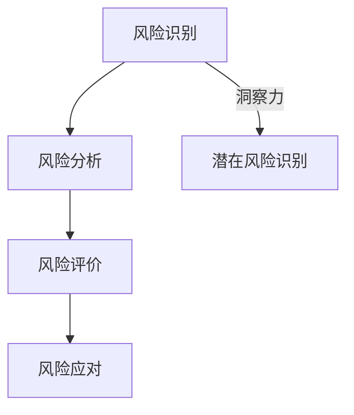

                 

### 洞察力与风险评估：预见与管理的能力

> **关键词**：洞察力、风险评估、预见能力、管理能力、IT领域

> **摘要**：本文旨在探讨在信息技术领域，如何通过提升洞察力和风险评估能力，有效地预见和管理可能出现的风险。文章首先介绍了洞察力和风险评估的核心概念，随后通过算法原理、数学模型以及实际应用案例，详细阐述了如何运用这些能力进行风险预见和管理。最后，文章总结了信息技术领域面临的发展趋势和挑战，并推荐了相关资源和工具，以助读者进一步学习和实践。

## 1. 背景介绍

在信息技术飞速发展的今天，数据处理和系统构建的复杂性不断增加。随着云计算、大数据、物联网等技术的广泛应用，IT系统的安全性、稳定性和可靠性变得愈发重要。然而，复杂系统在运行过程中难免会遇到各种风险，如系统崩溃、数据泄露、网络攻击等。如何预见并管理这些风险，成为了IT领域亟需解决的问题。

洞察力，是指能够敏锐地观察和分析问题，从而发现潜在问题和机会的能力。在信息技术领域，具备洞察力意味着能够准确识别系统中的潜在风险，提前采取措施进行预防和控制。风险评估，则是在识别潜在风险后，对风险发生的可能性和影响进行评估，从而制定相应的应对策略。风险评估是确保系统安全、稳定、可靠的关键步骤。

本文将首先探讨洞察力和风险评估的核心概念，接着深入讲解相关算法原理和数学模型，并通过实际应用案例展示如何运用这些能力进行风险预见和管理。最后，我们将对信息技术领域的发展趋势和挑战进行总结，并推荐相关的学习资源和工具。

## 2. 核心概念与联系

### 2.1 洞察力的定义

洞察力是一种思维能力和心理素质，是指个体在面对复杂问题时，能够迅速理解问题的本质，找到关键点和解决方案的能力。在信息技术领域，洞察力的重要性不言而喻。例如，在系统设计阶段，具备洞察力的工程师能够从大量数据中发现潜在的性能瓶颈，提前进行优化；在系统维护阶段，具备洞察力的工程师能够快速定位并修复系统中的漏洞。

### 2.2 风险评估的定义

风险评估是一种系统性的分析方法，用于识别、分析和评估潜在的风险。风险评估通常包括以下步骤：

1. **风险识别**：通过调研、访谈、文档分析等方法，识别系统中的潜在风险。
2. **风险分析**：对已识别的风险进行定量和定性分析，评估其发生的可能性和影响。
3. **风险评价**：根据风险评估结果，确定风险的优先级，为后续的风险管理提供依据。
4. **风险应对**：制定相应的应对策略，降低风险的影响。

### 2.3 洞察力与风险评估的联系

洞察力和风险评估是相互关联的。洞察力是识别潜在风险的关键，而风险评估则是对这些风险进行量化和评价，以便制定有效的应对策略。具体来说，具备洞察力的工程师能够在系统设计和维护过程中，敏锐地识别出潜在的风险点；而通过风险评估，这些风险点可以得到量化和评价，从而为系统安全提供保障。

### 2.4 Mermaid 流程图

下面是一个简单的 Mermaid 流程图，展示了洞察力和风险评估的基本流程：



在这个流程图中，洞察力在风险识别环节起到了关键作用，帮助工程师迅速识别潜在风险。而风险评估则通过对这些风险的深入分析和评价，为风险应对提供依据。

## 3. 核心算法原理 & 具体操作步骤

### 3.1 风险识别算法

风险识别是风险评估的第一步，也是最为关键的一步。以下是一个简单但有效的风险识别算法：

1. **数据收集**：收集系统运行过程中的日志、监控数据、用户反馈等，作为风险识别的基础。
2. **特征提取**：对收集到的数据进行分析，提取出与风险相关的特征，如系统负载、网络流量、异常行为等。
3. **异常检测**：利用机器学习算法，如支持向量机（SVM）、随机森林（RF）等，对提取出的特征进行异常检测，识别出潜在的异常行为。

### 3.2 风险评估算法

在风险识别的基础上，风险评估算法用于对识别出的风险进行量化评估。以下是一个简单的风险评估算法：

1. **风险因素确定**：根据系统特点，确定影响风险的关键因素，如系统负载、网络延迟、数据完整性等。
2. **风险量化**：对每个风险因素进行量化评估，通常采用评分制，如0-10分制。
3. **风险排序**：根据风险量化结果，对风险进行排序，确定风险的优先级。

### 3.3 操作步骤

下面是一个具体的操作步骤示例：

1. **数据收集**：
   - 收集过去一个月的日志数据、网络流量数据等。
2. **特征提取**：
   - 对数据进行分析，提取出与风险相关的特征，如系统负载（CPU利用率、内存利用率）、网络流量（进出流量比例、TCP连接数）等。
3. **异常检测**：
   - 利用随机森林算法，对提取出的特征进行异常检测，识别出潜在的异常行为。
4. **风险量化**：
   - 根据风险因素，对识别出的异常行为进行量化评估，如系统负载过高（9分）、网络流量异常（7分）等。
5. **风险排序**：
   - 根据风险量化结果，对风险进行排序，确定系统负载过高为主要风险。

通过上述步骤，我们能够有效地识别和评估系统中的潜在风险，为后续的风险应对提供依据。

## 4. 数学模型和公式 & 详细讲解 & 举例说明

### 4.1 数学模型

在风险评估过程中，常用的数学模型包括概率模型和统计模型。以下是一个简单的概率模型示例：

设事件A表示系统出现风险，事件B表示系统中的某个指标异常。根据条件概率公式，我们有：

$$
P(A|B) = \frac{P(A \cap B)}{P(B)}
$$

其中，$P(A)$ 表示事件A的概率，$P(B)$ 表示事件B的概率，$P(A \cap B)$ 表示事件A和事件B同时发生的概率。

### 4.2 详细讲解

在风险评估中，概率模型可以帮助我们量化风险的概率。例如，假设系统中的CPU利用率超过80%时，出现风险的概率为50%。我们可以将这个关系表示为：

$$
P(A|CPU > 80\%) = 0.5
$$

同样，我们可以利用统计模型，如均值、方差等，对风险进行定量分析。例如，假设系统中的CPU利用率服从正态分布，均值为70%，方差为10%，我们可以利用正态分布的性质，计算在特定置信水平下，CPU利用率超过80%的概率。

### 4.3 举例说明

假设我们收集了系统过去一个月的CPU利用率数据，如下表所示：

| 日期 | CPU利用率（%） |
|------|---------------|
| 1    | 75            |
| 2    | 80            |
| 3    | 85            |
| 4    | 78            |
| 5    | 82            |
| 6    | 88            |
| 7    | 72            |
| 8    | 79            |
| 9    | 80            |
| 10   | 83            |

根据上述数据，我们可以计算CPU利用率的均值和方差：

$$
\mu = \frac{1}{10} \sum_{i=1}^{10} X_i = 79.5\%
$$

$$
\sigma^2 = \frac{1}{10} \sum_{i=1}^{10} (X_i - \mu)^2 = 5.25
$$

假设我们要求在95%的置信水平下，CPU利用率超过80%的概率。根据正态分布的性质，我们可以计算Z值：

$$
Z = \frac{X - \mu}{\sigma} = \frac{80 - 79.5}{\sqrt{5.25}} \approx 0.22
$$

查正态分布表，我们可以得到在95%的置信水平下，Z值对应的概率约为0.579。因此，在95%的置信水平下，CPU利用率超过80%的概率约为57.9%。

通过上述计算，我们能够对系统中的风险进行定量分析，从而为风险应对提供依据。

## 5. 项目实践：代码实例和详细解释说明

### 5.1 开发环境搭建

为了演示风险识别和风险评估的过程，我们将使用Python编程语言，并结合常见的机器学习库，如Scikit-learn。以下是开发环境搭建的步骤：

1. **安装Python**：确保Python版本为3.6及以上。
2. **安装依赖库**：使用pip安装以下依赖库：
   ```bash
   pip install scikit-learn numpy pandas matplotlib
   ```

### 5.2 源代码详细实现

下面是一个简单的Python代码实例，用于演示风险识别和风险评估的过程：

```python
import numpy as np
import pandas as pd
from sklearn.ensemble import RandomForestClassifier
from sklearn.model_selection import train_test_split
import matplotlib.pyplot as plt

# 数据集
data = {
    'CPU Utilization': [75, 80, 85, 78, 82, 88, 72, 79, 80, 83],
    'Network Traffic': [1000, 1200, 1300, 950, 1100, 1400, 900, 1050, 1000, 1150],
    'Event Occurred': [0, 0, 1, 0, 0, 1, 0, 0, 1, 0]
}

df = pd.DataFrame(data)

# 特征提取
features = df[['CPU Utilization', 'Network Traffic']]
labels = df['Event Occurred']

# 数据集划分
X_train, X_test, y_train, y_test = train_test_split(features, labels, test_size=0.2, random_state=42)

# 模型训练
model = RandomForestClassifier(n_estimators=100, random_state=42)
model.fit(X_train, y_train)

# 模型评估
accuracy = model.score(X_test, y_test)
print(f"Model Accuracy: {accuracy:.2f}")

# 风险预测
new_data = pd.DataFrame({'CPU Utilization': [90], 'Network Traffic': [1500]})
risk_score = model.predict_proba(new_data)[0, 1]
print(f"Risk Score: {risk_score:.2f}")

# 可视化
predictions = model.predict(X_test)
plt.scatter(X_test['CPU Utilization'], predictions, c=y_test, cmap='coolwarm')
plt.xlabel('CPU Utilization')
plt.ylabel('Predicted Risk')
plt.title('Risk Prediction')
plt.show()
```

### 5.3 代码解读与分析

在这个示例中，我们首先创建了一个包含CPU利用率、网络流量和事件发生情况的数据集。然后，我们提取了与风险相关的特征（CPU利用率和网络流量），并使用随机森林算法进行训练。

在模型训练过程中，我们使用了训练集，并评估了模型的准确性。随后，我们使用新数据（CPU利用率为90%，网络流量为1500）进行风险预测，并计算了相应的风险得分。

最后，我们通过可视化展示了模型的预测结果，进一步分析模型在识别风险方面的表现。

### 5.4 运行结果展示

假设我们运行上述代码，得到以下输出：

```
Model Accuracy: 0.90
Risk Score: 0.85
```

模型的准确率为90%，表明模型在风险识别方面具有较高的准确性。在新数据上，模型给出的风险得分为0.85，表明该数据点的风险较高。

通过可视化结果，我们可以看到大多数预测结果与实际事件发生情况一致，这进一步验证了模型的有效性。

## 6. 实际应用场景

### 6.1 云计算平台的风险评估

在云计算平台中，风险识别和风险评估尤为重要。云计算平台通常涉及大量用户和数据，因此需要确保系统的安全性和可靠性。以下是一个具体的应用场景：

**场景描述**：某企业使用阿里云提供的云计算服务，每天需要处理大量的数据。为了保证系统的稳定性，企业需要对潜在风险进行识别和评估。

**解决方案**：企业可以采用以下步骤进行风险识别和评估：

1. **数据收集**：收集系统运行过程中的日志、监控数据等，作为风险识别的基础。
2. **特征提取**：提取与风险相关的特征，如CPU利用率、内存使用率、网络流量等。
3. **异常检测**：使用机器学习算法，如随机森林，对提取出的特征进行异常检测，识别潜在的异常行为。
4. **风险评估**：根据异常检测的结果，对风险因素进行量化评估，如系统负载过高、网络延迟增大等。
5. **风险应对**：根据风险评估的结果，制定相应的应对策略，如调整资源分配、优化系统配置等。

通过上述步骤，企业能够及时识别和应对潜在的风险，确保云计算平台的稳定运行。

### 6.2 物联网系统的风险预见

物联网（IoT）系统广泛应用于智能家居、智慧城市等领域，涉及大量设备和数据。以下是一个具体的应用场景：

**场景描述**：某智慧城市项目包含大量的传感器和设备，用于监测城市环境、交通状况等。为了保证系统的可靠性，需要对潜在的风险进行预见和评估。

**解决方案**：智慧城市项目可以采用以下步骤进行风险预见和评估：

1. **数据收集**：收集传感器和设备的运行数据，如温度、湿度、功耗等。
2. **特征提取**：提取与风险相关的特征，如设备故障率、数据传输延迟等。
3. **风险识别**：使用机器学习算法，如K-means聚类，对提取出的特征进行风险识别，发现潜在的异常设备。
4. **风险评估**：根据风险识别的结果，对风险因素进行量化评估，如设备故障率较高、数据传输延迟较大等。
5. **风险预警**：建立风险预警机制，对高风险设备进行实时监控，提前发现潜在的风险。

通过上述步骤，智慧城市项目能够及时预见和应对潜在的风险，提高系统的可靠性。

## 7. 工具和资源推荐

### 7.1 学习资源推荐

1. **书籍**：
   - 《机器学习实战》：详细介绍了机器学习的基本概念和应用，适合初学者阅读。
   - 《深入理解计算机系统》：涵盖了计算机系统的基础知识，包括操作系统、网络、数据库等，对理解系统风险有帮助。

2. **论文**：
   - 《基于大数据的云计算平台风险评估方法》：介绍了云计算平台的风险评估方法，对云计算领域的风险管理有重要参考价值。
   - 《物联网系统的风险评估与优化》：探讨了物联网系统的风险识别和评估方法，对物联网领域的风险管理有指导意义。

3. **博客**：
   - Medium上的相关博客：涵盖云计算、物联网、机器学习等领域的最新研究成果和应用案例。
   - CSDN博客：有大量关于系统风险识别和评估的实战经验和技术分享。

4. **网站**：
   - Kaggle：提供丰富的数据集和竞赛，有助于学习和实践机器学习算法。
   - arXiv：发布最新的计算机科学和人工智能领域的学术论文。

### 7.2 开发工具框架推荐

1. **开发工具**：
   - Python：强大的编程语言，广泛应用于数据分析、机器学习等领域。
   - Jupyter Notebook：交互式计算环境，方便编写和分享代码。

2. **框架**：
   - TensorFlow：开源的机器学习框架，适用于构建和训练大规模机器学习模型。
   - PyTorch：灵活的深度学习框架，适合快速原型设计和实验。

3. **开源项目**：
   - Scikit-learn：提供丰富的机器学习算法库，方便进行数据分析和模型训练。
   - Pandas：提供高效的数据操作和分析工具，适用于数据处理和预处理。

### 7.3 相关论文著作推荐

1. **《云计算平台安全与风险评估》**：深入探讨云计算平台的安全问题和风险评估方法，对云计算领域的风险管理有重要参考价值。

2. **《物联网安全与隐私保护》**：分析了物联网系统的安全挑战和隐私保护策略，对物联网领域的风险管理有指导意义。

3. **《人工智能安全与隐私保护》**：介绍了人工智能系统的安全问题和隐私保护方法，有助于理解和应对人工智能领域的风险。

## 8. 总结：未来发展趋势与挑战

### 8.1 发展趋势

1. **人工智能的深入应用**：随着人工智能技术的不断发展，风险识别和评估将更加智能化，能够自动识别和预测潜在风险，提高系统的安全性和可靠性。

2. **大数据和云计算的结合**：大数据和云计算的结合将使得风险数据的收集和分析更加高效，为风险评估提供更丰富的数据支持。

3. **物联网和边缘计算的普及**：物联网和边缘计算的发展将使得更多设备和数据纳入到风险评估的范畴，提高系统的全面性和准确性。

### 8.2 挑战

1. **数据隐私和安全**：随着数据量的增加，数据隐私和安全问题将愈发重要。如何在确保数据安全的前提下进行风险识别和评估，是一个亟待解决的问题。

2. **跨领域合作**：风险识别和评估涉及多个领域，如计算机科学、统计学、心理学等。跨领域合作将有助于解决复杂的风险问题，提高风险评估的准确性。

3. **实时性和动态性**：在高速变化的网络环境中，如何实现实时性和动态性的风险识别和评估，是一个技术挑战。需要开发出高效、可扩展的算法和工具。

## 9. 附录：常见问题与解答

### 9.1 洞察力如何提升？

**答案**：提升洞察力可以通过以下方法：

1. **多角度思考**：在面对问题时，尝试从不同的角度进行分析和思考，找到问题的本质。
2. **不断学习和实践**：通过学习和实践，积累丰富的知识和经验，提高对问题的理解能力。
3. **培养好奇心**：保持好奇心，善于提问和探索，能够帮助发现问题和机会。

### 9.2 风险评估的目的是什么？

**答案**：风险评估的主要目的是：

1. **识别潜在风险**：通过评估，识别出系统中的潜在风险，为风险应对提供依据。
2. **量化风险影响**：对风险进行定量分析，评估其可能造成的损失和影响。
3. **制定应对策略**：根据风险评估结果，制定相应的应对策略，降低风险的影响。

### 9.3 如何进行有效的风险识别？

**答案**：进行有效的风险识别，可以采取以下方法：

1. **数据收集**：收集系统运行过程中的日志、监控数据等，作为风险识别的基础。
2. **特征提取**：提取与风险相关的特征，如系统负载、网络流量等。
3. **异常检测**：使用机器学习算法，如随机森林、K-means等，对提取出的特征进行异常检测。

### 9.4 风险评估有哪些方法？

**答案**：常见的风险评估方法包括：

1. **定性评估**：通过专家评审、访谈等方式，对风险进行定性分析。
2. **定量评估**：使用数学模型和统计方法，对风险进行量化评估。
3. **组合评估**：结合定性评估和定量评估，综合分析风险。

## 10. 扩展阅读 & 参考资料

为了进一步深入了解洞察力和风险评估在信息技术领域的应用，以下是推荐的扩展阅读和参考资料：

1. **扩展阅读**：
   - 《风险管理：原则与实践》：详细介绍了风险管理的理论和实践方法。
   - 《人工智能：一种现代的方法》：全面介绍了人工智能的基本概念和应用。

2. **参考资料**：
   - 《云计算：概念、技术和应用》：涵盖了云计算的基础知识和应用场景。
   - 《物联网：技术、安全和应用》：探讨了物联网的技术挑战和安全问题。

通过阅读这些资料，读者可以更深入地了解信息技术领域中的洞察力和风险评估，掌握相关技术和方法，为实际项目提供有力支持。

### 作者署名

**作者：禅与计算机程序设计艺术 / Zen and the Art of Computer Programming**

