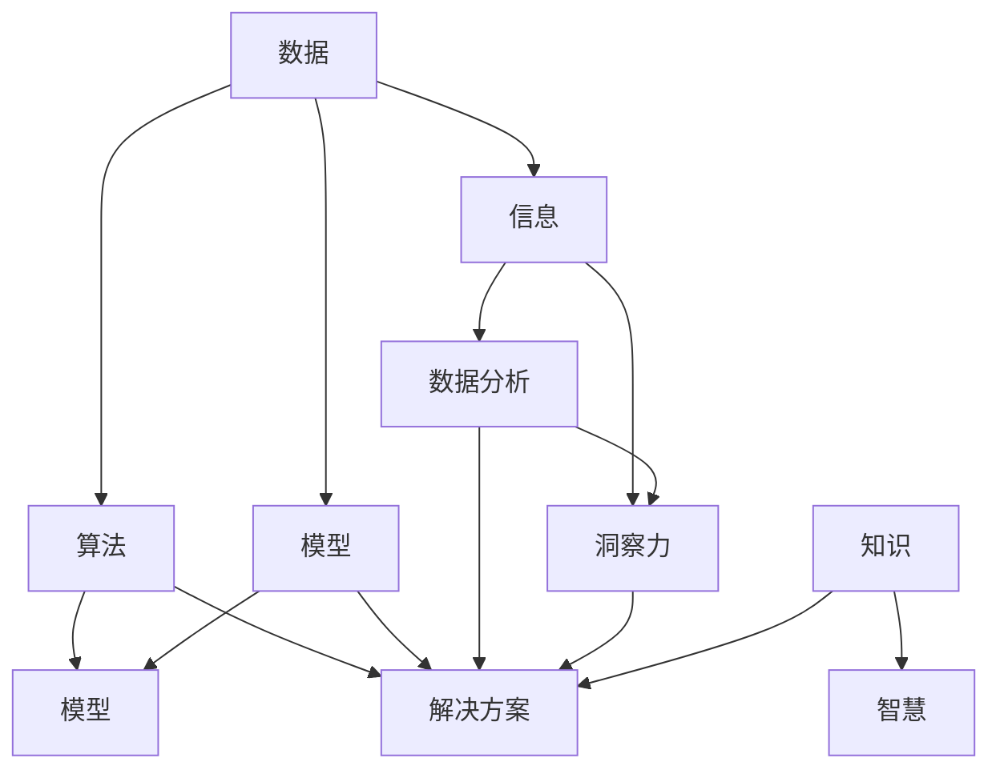

                 

### 背景介绍

在信息爆炸的时代，如何从海量的数据中提取有价值的信息并转化为知识，成为每个人都需要面对的挑战。在这个背景下，洞察力成为一种至关重要的能力。洞察力，简单来说，就是识别和理解事物的本质、规律和关联性的能力。它不仅仅是观察的延伸，更是对信息进行深度理解和创造性思考的结果。

在技术领域，洞察力尤其重要。作为程序员、软件工程师、架构师乃至CTO，我们每天都需要面对复杂的技术问题和项目挑战。只有具备敏锐的洞察力，我们才能从看似杂乱无章的信息中找到解决问题的线索，构建出高效、可扩展的软件系统。此外，洞察力还能帮助我们预见技术发展的趋势，从而做出明智的决策。

本文将探讨如何从信息接收者转变为知识创造者，培养洞察力的具体方法和实践技巧。我们将结合实际的计算机科学和技术案例，逐步分析推理，以期能够帮助读者提高自己的洞察力，成为更好的技术专家。

首先，我们需要理解什么是洞察力。接下来，我们会探讨技术领域中洞察力的重要性，并通过具体案例来展示如何培养这种能力。文章的后半部分将提供一些实用的工具和资源，帮助读者进一步深化自己的洞察力。最后，我们将总结洞察力的培养对于技术发展的重要意义，并展望其未来的发展趋势与挑战。

通过这篇文章，我们希望读者能够对洞察力有一个全面而深刻的理解，并将其应用到实际工作中，提升自己的技术能力和竞争力。

## 1. 背景介绍

### 洞察力的定义

洞察力是一种深度的认知能力，它不仅涉及对事物表面现象的观察，更强调对事物本质和内在规律的深入理解。根据心理学家和认知科学家的研究，洞察力是一种复杂的认知过程，它包含了感知、理解、推理、联想和创造性思考等多个层面。

从心理学角度来看，洞察力可以被定义为“在复杂情境中迅速识别并理解本质的能力”。这种能力不仅需要扎实的知识储备，还需要敏锐的观察力、丰富的经验和良好的逻辑思维能力。洞察力使得个体能够在纷繁复杂的信息中找到关键线索，预见潜在问题，并提出创新性的解决方案。

认知科学研究表明，洞察力是大脑通过联想、类比和模式识别等机制进行信息处理的结果。具体来说，当个体面对一个复杂问题时，大脑会自动启动各种认知策略，如模式识别、关联分析、假设验证等，从而逐步揭示问题的本质。

### 技术领域的洞察力

在技术领域，洞察力尤为重要。技术行业不断发展，新技术层出不穷，这就要求技术从业者不仅要掌握现有技术，还要能够预见未来的发展趋势，并灵活应对各种技术挑战。以下是洞察力在技术领域中几个关键方面的应用：

1. **问题解决能力**：程序员和工程师在日常工作中常常需要面对复杂的技术问题。只有具备敏锐的洞察力，他们才能快速识别问题的根本原因，并设计出有效的解决方案。例如，在软件开发过程中，程序员需要通过代码审查和调试来发现潜在的错误和性能瓶颈。这需要他们具备对代码的深刻理解，能够洞察代码中的逻辑和结构。

2. **创新思维**：技术创新是推动技术行业不断进步的关键因素。具有洞察力的人能够从现有技术中发现新的应用场景或解决方案。例如，谷歌的“量子人工智能”研究团队通过深入研究量子计算和机器学习的结合，提出了全新的算法框架，为人工智能领域带来了革命性的变化。

3. **趋势预测**：技术领域的发展速度非常快，洞察力可以帮助从业者预见未来的技术趋势。例如，物联网（IoT）和5G技术的兴起使得边缘计算成为热门话题。具有洞察力的技术专家能够提前预见到这些技术趋势，并做好准备，为自己的职业生涯铺平道路。

4. **决策支持**：在技术项目的规划和执行过程中，管理者需要做出许多关键决策。具有洞察力的管理者能够从大量的数据中提取关键信息，并基于这些信息做出明智的决策。例如，在制定产品路线图时，洞察力可以帮助产品经理了解市场需求、用户反馈和技术可行性，从而制定出更符合市场需求的战略。

总之，洞察力在技术领域的应用非常广泛。它不仅是解决技术问题的必要条件，也是推动技术创新和行业发展的关键因素。通过培养洞察力，技术从业者可以提升自己的竞争力，为个人和团队的成功奠定坚实基础。

### 时代背景下的信息接收与知识创造

在当今信息爆炸的时代，我们每天都会接触到大量的信息。从新闻头条到社交媒体，从学术研究到商业报告，信息无处不在。然而，信息的泛滥也带来了新的挑战：如何从海量的数据中筛选出有价值的信息，并将其转化为实际的知识和智慧，成为每个人都需要面对的问题。

首先，信息接收是一个动态的过程。在这个过程中，我们通过多种渠道接收信息，包括阅读、观看、听讲、交流等。然而，仅仅接收信息是不够的。信息接收者往往只是被动地接收信息，缺乏对信息的深层次理解和批判性思考。这种情况下，接收到的信息往往难以内化为自己的知识和智慧。

相比之下，知识创造是一个主动的过程。它不仅要求我们能够接收和理解信息，还需要我们能够对信息进行筛选、整合、分析和创造。具体来说，知识创造包括以下几个步骤：

1. **信息筛选**：在信息接收的过程中，我们需要识别并筛选出那些对自己有用的信息。这需要敏锐的洞察力和良好的信息过滤机制。

2. **信息整合**：筛选出有价值的信息后，我们需要将这些信息进行整合。这涉及到对信息进行分类、归纳和关联，从而形成系统化的知识结构。

3. **信息分析**：整合后的信息需要进一步分析。分析的过程包括理解信息的内在逻辑、识别关键因素、揭示潜在问题和挑战等。

4. **信息创造**：在分析的基础上，我们还需要通过创造性思考，提出新的观点、解决方案或创新思路。这种创造性的过程往往需要跨学科的思维方式和对现有知识的重新组合。

随着信息技术的飞速发展，大数据、人工智能、区块链等新技术为信息接收与知识创造提供了新的工具和方法。例如，大数据技术可以帮助我们更高效地处理和分析海量数据，从而提取有价值的信息；人工智能算法则可以辅助我们进行复杂的信息筛选和分析，提高知识创造的效率。

然而，面对海量的信息和不断涌现的新技术，我们也需要具备相应的技能和素质来应对这些挑战。首先，我们需要培养良好的信息素养，包括信息检索、信息评估和信息管理等方面的能力。其次，我们需要不断学习和更新自己的知识，以适应快速变化的技术环境。最后，我们需要培养批判性思维和创造性思维，以在面对复杂问题时能够提出创新的解决方案。

总之，在信息爆炸的时代，从信息接收者转变为知识创造者是一项重要的任务。这不仅需要我们具备扎实的技术基础和良好的信息素养，还需要我们具备敏锐的洞察力和创造性思维。通过不断地学习和实践，我们可以提高自己的洞察力，从而在技术领域中脱颖而出，为个人和团队的成功奠定坚实基础。

### 技术领域中洞察力的重要性

在技术领域，洞察力不仅仅是一种专业技能，更是一种核心竞争力。它对技术从业者的职业发展和项目成功有着深远的影响。以下是洞察力在技术领域中几个关键方面的重要性：

1. **问题解决能力**：技术领域充满了各种复杂的问题，从软件开发的bug修复到系统性能优化，再到大型项目的整体规划。具有洞察力的技术专家能够迅速识别问题的核心，找到根本原因，并设计出高效且可靠的解决方案。这不仅提高了工作效率，还减少了项目延误和成本超支的风险。

2. **创新思维**：技术行业的快速发展要求从业者具备持续的创新思维。洞察力帮助技术专家发现新的应用场景、技术趋势和市场机会，从而推动技术进步和产品创新。例如，苹果公司通过洞察智能手机市场的需求，推出了革命性的iPhone，从而彻底改变了移动通信和消费电子行业。

3. **决策支持**：在技术项目的规划和执行过程中，决策者需要面对诸多不确定性。具有洞察力的技术专家能够通过深入分析项目中的各种因素，提供有价值的见解和建议，帮助决策者做出更加明智和有效的决策。这种能力在项目管理和产品开发中尤为重要。

4. **团队协作**：技术项目往往需要多学科、多团队的协作。具有洞察力的技术专家能够更好地理解其他团队成员的工作和需求，从而促进有效的沟通和协作。他们能够识别团队中的潜在问题，并提出创新的解决方案，推动项目向前发展。

5. **预见未来**：技术领域的发展速度极快，新的技术和趋势层出不穷。具有洞察力的技术专家能够预见未来的技术趋势和市场变化，从而为个人和团队制定长远的发展战略。这种前瞻性思维可以帮助技术从业者抓住机遇，规避风险，保持竞争优势。

通过具体案例，我们可以更清晰地看到洞察力在技术领域中的重要性。例如，在人工智能领域，OpenAI的研究团队通过深入洞察神经网络和机器学习算法的原理，提出了GPT-3等革命性的模型，从而推动了自然语言处理和人工智能的快速发展。再如，谷歌的量子计算团队通过洞察量子力学和计算机科学的交叉点，提出了量子算法，为未来计算能力的突破奠定了基础。

总之，洞察力在技术领域中的重要性不容忽视。它不仅提升了技术从业者的个人能力和职业竞争力，还对项目的成功和行业的发展产生了深远的影响。通过不断培养和提升洞察力，技术从业者可以在快速变化的技术环境中立于不败之地，为个人和团队的成功创造更多机会。

### 如何培养洞察力

培养洞察力并非一蹴而就的过程，它需要长期的积累和实践。以下是一些具体的策略和方法，可以帮助我们逐步提升自己的洞察力。

#### 学习新知识

首先，学习新知识是培养洞察力的基础。通过不断扩展自己的知识面，我们可以获得更多的视角和思维方式，从而更好地理解和分析复杂的问题。以下是一些建议：

1. **多学科交叉学习**：在技术领域，多学科的知识交叉可以带来新的洞察。例如，学习一些基本的经济学原理可以帮助我们更好地理解数据价值和商业策略，而学习心理学则可以帮助我们更好地理解用户行为。

2. **阅读相关书籍和论文**：通过阅读专业书籍和学术论文，我们可以了解行业最新的研究成果和技术趋势。这不仅扩展了我们的知识储备，还激发了我们创造性思考。

3. **参加专业课程和研讨会**：参加在线课程、研讨会和工作坊可以让我们与行业专家和同行交流，获取最新的知识和见解。

#### 实践和应用

理论知识只有通过实践才能转化为真正的洞察力。以下是一些建议：

1. **动手实践**：在技术领域，动手实践是最好的学习方式。通过编写代码、设计和实施项目，我们可以将理论知识应用到实际问题中，从而加深对技术的理解。

2. **参与开源项目**：参与开源项目不仅可以提高我们的编程能力，还可以让我们接触到不同领域的项目和问题，从而拓展我们的视野。

3. **解决实际问题**：在实际工作中，我们经常会遇到各种技术问题。通过深入分析这些问题，我们可以培养自己的洞察力，并找到有效的解决方案。

#### 逻辑思维训练

逻辑思维是洞察力的核心组成部分。以下是一些建议：

1. **练习逻辑推理**：通过阅读逻辑学相关的书籍、解决逻辑谜题和进行逻辑推理练习，我们可以提高自己的逻辑思维能力。

2. **批判性思考**：在接收和处理信息时，我们需要保持批判性思考，不盲从，善于质疑和反思。这种能力可以帮助我们更深入地理解问题，避免思维的盲点。

3. **构建逻辑框架**：在面对复杂问题时，我们可以通过构建逻辑框架来帮助自己理清思路，找到关键因素和潜在解决方案。

#### 经验积累

经验是培养洞察力的重要资源。以下是一些建议：

1. **反思和总结**：在处理问题和项目的过程中，我们需要不断进行反思和总结，从成功和失败中吸取教训。通过反思，我们可以加深对问题的理解，并形成自己的洞察。

2. **保持好奇心**：保持好奇心是积累经验的重要动力。对于未知领域和新出现的挑战，我们应该保持开放的心态，勇于探索和尝试。

3. **交流与分享**：与他人交流和分享我们的思考和经验，可以帮助我们获得新的视角和见解。这种互动可以促进我们的思维发展和洞察力的提升。

通过以上策略和方法的实践，我们可以逐步培养和提高自己的洞察力。这不仅有助于我们在技术领域中更好地应对挑战，还能提升我们的综合素质和职业竞争力。

### 技术案例中的洞察力培养

为了更好地理解洞察力在实际中的应用，我们可以通过一些经典的技术案例来具体说明。以下是几个不同领域的案例，展示了如何通过培养洞察力解决复杂问题并取得突破性成果。

#### 案例一：谷歌的 PageRank 算法

在搜索引擎领域，谷歌的 PageRank 算法无疑是历史上最成功的创新之一。PageRank 的提出者拉里·佩奇（Larry Page）和谢尔盖·布林（Sergey Brin）通过培养洞察力，揭示了网页之间的链接结构所蕴含的价值。

1. **背景介绍**：在互联网初期，搜索引擎主要依赖于网页的标题和关键词进行排名。但这种方法的局限性显而易见，因为简单的关键词匹配往往无法准确反映网页的实际价值和相关性。

2. **核心问题**：佩奇和布林意识到，网页之间的链接关系实际上是一种投票机制。如果一个重要的网页链接到另一个网页，那么这个被链接的网页很可能具有更高的价值。

3. **解决方案**：基于这一洞察，佩奇和布林提出了 PageRank 算法。PageRank 通过分析网页之间的链接关系，计算每个网页的重要度。具体来说，算法将网页视为一个图，每个链接视为一个投票。被更多高重要度网页链接的网页，其重要性也相应提高。

4. **实际效果**：PageRank 的引入极大地提升了搜索引擎的准确性和用户体验。它不仅能够更好地满足用户的需求，还推动了搜索引擎技术的大幅进步。

#### 案例二：特斯拉的电池管理技术

在电动汽车领域，特斯拉的电池管理技术是其核心竞争力之一。特斯拉的创始人埃隆·马斯克（Elon Musk）通过培养洞察力，解决了电池技术中的多个关键问题。

1. **背景介绍**：电池技术是电动汽车的核心难题。电池的容量、续航里程和安全性直接决定了电动汽车的性能和用户体验。

2. **核心问题**：传统的电池管理系统存在几个问题：首先，电池的充电和放电效率较低；其次，电池的寿命和安全性难以保障。

3. **解决方案**：马斯克通过深入研究电池技术和材料科学，提出了一系列创新性解决方案。例如，特斯拉采用了超级电容技术来提高电池的充电速度和放电效率；同时，通过先进的电池管理系统（BMS），实现了对电池的实时监控和智能管理，从而提高了电池的安全性和使用寿命。

4. **实际效果**：特斯拉的电池管理技术显著提升了电动汽车的性能和用户体验。它不仅延长了电池的寿命，还提高了电动汽车的续航里程，使电动汽车成为更加可行的交通选择。

#### 案例三：亚马逊的推荐系统

在电子商务领域，亚马逊的推荐系统是其成功的关键因素之一。亚马逊通过培养洞察力，极大地提升了用户满意度和销售转化率。

1. **背景介绍**：电子商务市场竞争激烈，用户的选择多样。如何吸引和留住用户，提高销售量，是电子商务企业面临的重大挑战。

2. **核心问题**：传统的推荐系统主要依赖于用户的历史购买记录和浏览行为。但这些方法往往无法准确预测用户的未来需求。

3. **解决方案**：亚马逊通过大数据分析和机器学习技术，建立了复杂的推荐系统。系统不仅考虑用户的历史行为，还结合了商品之间的相关性、用户的浏览和搜索习惯等多个因素，进行个性化推荐。

4. **实际效果**：亚马逊的推荐系统极大地提升了用户体验和销售转化率。它不仅能够更好地满足用户的需求，还提高了用户的购物满意度，从而增强了用户的忠诚度。

通过以上案例，我们可以看到，培养洞察力在技术领域中的重要性。这些成功的案例不仅展示了洞察力如何帮助解决复杂问题，还展示了洞察力对于技术创新和商业成功的巨大推动作用。通过不断培养和提升自己的洞察力，技术从业者可以在快速变化的技术环境中脱颖而出，为个人和团队的成功创造更多机会。

### 核心概念与联系

在深入探讨洞察力的培养之前，我们首先需要明确几个核心概念，并理解它们之间的联系。以下是一些在技术领域中至关重要的概念，以及它们之间的相互关系。

#### 数据与信息

**数据** 是指未经加工的原始事实和观察结果，例如数字、文本、图像等。数据本身并没有内在的价值，只有当它被处理和解释后，才能转化为信息。

**信息** 则是经过处理和解释后的数据，能够为决策提供依据。例如，通过数据分析得出的结论或预测就是一种信息。

**关联性**：数据和信息之间的关联性体现在它们如何相互转化。例如，通过对大量用户数据的分析，可以发现用户行为模式的规律，从而提取出有价值的信息。

#### 算法与模型

**算法** 是解决问题的一系列明确和有序的步骤。它是将数据转化为信息或解决特定问题的工具。

**模型** 则是对现实世界或复杂系统的抽象和简化。模型通常基于一定的假设和数学原理，用于模拟和分析实际系统。

**关系**：算法和模型相互依存。算法为模型提供了具体的计算方法，而模型则为算法提供了模拟和分析的对象。

#### 数据分析与洞察力

**数据分析** 是使用统计学、机器学习等方法对数据进行分析，以提取有价值的信息和洞见。

**洞察力** 则是在数据分析过程中，通过深层次的理解和创造性思考，发现数据背后的本质规律和关联性。

**关系**：数据分析是培养洞察力的基础。通过数据分析，我们可以发现数据中的规律和模式，而洞察力则帮助我们理解这些规律和模式的意义，并从中提取有价值的信息。

#### 知识与智慧

**知识** 是经过验证和系统化的信息，它是通过学习、研究和实践积累起来的。

**智慧** 则是运用知识解决问题的能力，它不仅包括对知识的理解和运用，还包括创新和创造。

**关系**：知识是智慧的基础。只有掌握了丰富的知识，我们才能在面对复杂问题时，运用智慧提出创新的解决方案。

通过理解这些核心概念及其相互关系，我们可以更清晰地认识到洞察力在技术领域中的重要性。以下是一个用 Mermaid 流程图展示这些核心概念原理和架构的示意图：



该图展示了数据、信息、算法、模型、数据分析、洞察力、知识与智慧之间的相互关系，帮助我们更好地理解这些概念在技术领域的应用和重要性。

### 核心算法原理 & 具体操作步骤

在技术领域中，培养洞察力不仅需要扎实的理论基础，还需要对核心算法原理和具体操作步骤有深刻的理解。以下是一个以深度学习算法为例，详细阐述其原理和操作步骤的过程。

#### 深度学习算法原理

深度学习是一种基于人工神经网络（Artificial Neural Networks, ANN）的机器学习技术。它通过多层神经网络模拟人脑的处理方式，对数据进行学习和预测。深度学习算法的核心在于“深度”和“层级”，通过多层次的神经元结构，可以捕捉到数据中的复杂特征和关联性。

1. **神经元与层级**：深度学习中的神经元类似于生物神经元，每个神经元接收多个输入信号，通过加权求和后加上偏置，再通过激活函数进行处理，最终输出一个结果。多层神经元结构使得模型可以逐渐提取数据中的高层次特征。

2. **激活函数**：激活函数是深度学习中的关键组件，用于对神经元的输出进行非线性变换。常见的激活函数包括sigmoid、ReLU（Rectified Linear Unit）和Tanh（双曲正切函数）。这些函数能够引入非线性，使得模型能够捕捉更复杂的特征。

3. **反向传播算法**：深度学习中的学习过程是通过反向传播算法（Backpropagation Algorithm）实现的。该算法通过计算输出误差，反向传播到每个神经元，更新各层的权重和偏置，从而不断优化模型的参数。

#### 深度学习算法具体操作步骤

1. **数据预处理**：在进行深度学习之前，需要对数据进行预处理。这包括数据清洗、归一化、标准化等步骤。数据预处理的目标是消除噪声，提高模型的鲁棒性和训练效果。

2. **构建神经网络模型**：根据问题的需求，选择合适的神经网络结构和超参数。常见的神经网络结构包括全连接网络（Fully Connected Network）、卷积神经网络（Convolutional Neural Network, CNN）和循环神经网络（Recurrent Neural Network, RNN）等。构建神经网络模型是深度学习的核心步骤。

3. **初始化权重和偏置**：初始化神经网络的权重和偏置。常用的方法包括随机初始化、高斯分布初始化和Xavier初始化等。合适的初始化方法可以加快模型收敛速度，提高训练效果。

4. **前向传播**：在前向传播过程中，输入数据通过神经网络的各个层级，每个神经元接收输入信号，经过加权求和和激活函数处理后，得到输出结果。前向传播的主要目的是计算输出结果和实际结果之间的误差。

5. **计算误差**：计算输出结果与实际结果之间的误差，误差函数通常选择均方误差（Mean Squared Error, MSE）或交叉熵（Cross-Entropy）等。

6. **反向传播**：通过反向传播算法，将误差反向传播到每个神经元，计算各层的梯度。梯度是调整权重和偏置的关键依据。

7. **权重和偏置更新**：根据计算得到的梯度，更新神经网络的权重和偏置。常用的优化算法包括梯度下降（Gradient Descent）、Adam（Adaptive Moment Estimation）等。

8. **模型评估和调优**：在训练过程中，需要不断评估模型的性能，调整超参数，优化模型结构。常用的评估指标包括准确率（Accuracy）、精确率（Precision）、召回率（Recall）和F1分数（F1 Score）等。

#### 代码示例

以下是一个简单的深度学习模型实现的伪代码示例：

```python
# 导入必要的库
import numpy as np
import tensorflow as tf

# 初始化模型参数
weights = tf.random.normal([input_dim, hidden_dim])
biases = tf.random.normal([hidden_dim])
weights_output = tf.random.normal([hidden_dim, output_dim])
biases_output = tf.random.normal([output_dim])

# 定义激活函数
激活函数 = tf.nn.relu

# 前向传播
def forward_propagation(x):
    hidden_layer = 激活函数(tf.matmul(x, weights) + biases)
    output = tf.matmul(hidden_layer, weights_output) + biases_output
    return output

# 计算误差
def compute_loss(y_true, y_pred):
    return tf.reduce_mean(tf.square(y_true - y_pred))

# 反向传播
def backward_propagation(x, y):
    with tf.GradientTape() as tape:
        y_pred = forward_propagation(x)
        loss = compute_loss(y, y_pred)
    gradients = tape.gradient(loss, [weights, biases, weights_output, biases_output])
    return gradients

# 梯度下降优化
optimizer = tf.optimizers.Adam()
for epoch in range(num_epochs):
    with tf.GradientTape() as tape:
        y_pred = forward_propagation(x)
        loss = compute_loss(y, y_pred)
    gradients = tape.gradient(loss, [weights, biases, weights_output, biases_output])
    optimizer.apply_gradients(zip(gradients, [weights, biases, weights_output, biases_output]))

# 模型评估
def evaluate_model(x_test, y_test):
    y_pred = forward_propagation(x_test)
    loss = compute_loss(y_test, y_pred)
    return loss.numpy()

test_loss = evaluate_model(x_test, y_test)
print(f"Test loss: {test_loss}")
```

通过以上步骤和代码示例，我们可以理解深度学习算法的基本原理和操作流程。在实际应用中，深度学习算法可以根据不同的任务需求进行调整和优化，从而实现各种复杂的数据分析和预测任务。

### 数学模型和公式 & 详细讲解 & 举例说明

在深度学习算法中，数学模型和公式是理解和应用这一算法的基础。以下我们将详细讲解深度学习中的几个关键数学模型和公式，并通过具体示例来说明它们的应用。

#### 梯度下降算法

梯度下降（Gradient Descent）是一种常用的优化算法，用于在训练过程中调整神经网络的权重和偏置。其基本思想是沿着误差函数的梯度方向，逐步更新参数，以最小化误差。

**公式**：

$$
w_{t+1} = w_t - \alpha \cdot \nabla_w J(w)
$$

其中，$w_t$ 表示第 $t$ 次迭代的权重，$\alpha$ 是学习率（Learning Rate），$\nabla_w J(w)$ 是权重 $w$ 对损失函数 $J(w)$ 的梯度。

**详细讲解**：

- **损失函数**：在深度学习中，损失函数用于衡量预测结果和实际结果之间的差异。常见的损失函数包括均方误差（MSE）和交叉熵（Cross-Entropy）。
  
  均方误差（MSE）：

  $$
  J(w) = \frac{1}{2} \sum_{i=1}^{n} (y_i - \hat{y}_i)^2
  $$

  其中，$y_i$ 是实际标签，$\hat{y}_i$ 是预测值。

- **梯度**：梯度是误差函数对参数的导数。对于均方误差，梯度可以表示为：

  $$
  \nabla_w J(w) = \frac{\partial J(w)}{\partial w}
  $$

  对于多层神经网络，梯度可以通过链式法则进行计算，从而得到每层权重和偏置的梯度。

- **学习率**：学习率控制了每次迭代中参数更新的幅度。适当的学习率可以加速收敛，但过大会导致模型不稳定，甚至无法收敛。

**举例说明**：

假设我们有一个简单的线性模型 $y = wx + b$，其中 $w$ 和 $b$ 是权重和偏置。实际标签 $y_1 = 3$，预测值 $\hat{y}_1 = 2$。损失函数为均方误差：

$$
J(w, b) = \frac{1}{2} (3 - 2)^2 = \frac{1}{2}
$$

计算 $w$ 对损失函数的梯度：

$$
\nabla_w J(w) = \frac{\partial}{\partial w} \left( \frac{1}{2} (3 - 2)^2 \right) = - (3 - 2) = -1
$$

应用梯度下降算法更新权重：

$$
w_{t+1} = w_t - \alpha \cdot (-1) = w_t + \alpha
$$

假设学习率 $\alpha = 0.1$，则：

$$
w_{t+1} = w_t + 0.1
$$

经过多次迭代后，模型将逐步逼近最佳权重和偏置。

#### 激活函数

激活函数是神经网络中用于引入非线性的关键组件。常见的激活函数包括 sigmoid、ReLU 和 tanh 等。它们在深度学习中的作用是使得神经网络能够捕捉复杂数据特征。

**公式**：

- Sigmoid：

  $$
  \sigma(x) = \frac{1}{1 + e^{-x}}
  $$

- ReLU：

  $$
  \text{ReLU}(x) = \max(0, x)
  $$

- Tanh：

  $$
  \text{Tanh}(x) = \frac{e^x - e^{-x}}{e^x + e^{-x}}
  $$

**详细讲解**：

- **Sigmoid**：sigmoid 函数将输入映射到 $(0, 1)$ 区间，常用于二分类问题。它的优点是输出结果具有概率分布的特性，但缺点是梯度在接近 $0$ 和 $1$ 时非常小，容易导致梯度消失问题。

- **ReLU**：ReLU 函数是一种简单的非线性函数，它在输入为负时输出 $0$，在输入为正时保持输入值。ReLU 函数的优点是计算速度快，不易梯度消失，是深度学习中最常用的激活函数之一。

- **Tanh**：tanh 函数与 sigmoid 函数类似，但其输出范围在 $(-1, 1)$，具有更好的对称性。tanh 函数的梯度问题相对较小，常用于处理多维数据。

**举例说明**：

以 ReLU 函数为例，输入 $x = -2$，输出为：

$$
\text{ReLU}(-2) = \max(0, -2) = 0
$$

输入 $x = 3$，输出为：

$$
\text{ReLU}(3) = \max(0, 3) = 3
$$

ReLU 函数在输入为负时输出 $0$，在输入为正时输出输入值本身，从而引入了非线性。

#### 反向传播算法

反向传播算法是深度学习中的核心训练机制，用于计算损失函数对每个参数的梯度，并更新参数以最小化损失。

**公式**：

反向传播算法的核心是链式法则。对于多层神经网络，梯度可以通过以下公式计算：

$$
\nabla_w J(w) = \sum_{i=1}^{n} \nabla_z f(z) \cdot \nabla_w z
$$

其中，$z$ 是中间层的输出，$f(z)$ 是激活函数，$\nabla_z f(z)$ 是激活函数对中间层输出的梯度，$\nabla_w z$ 是权重对中间层输出的梯度。

**详细讲解**：

- **链式法则**：反向传播利用链式法则逐层计算梯度。首先从输出层开始，计算损失函数对输出层的梯度，然后逐层向前传播，计算每一层的梯度。

- **梯度计算**：对于不同的激活函数，梯度计算方法有所不同。例如，对于 sigmoid 函数，梯度可以表示为：

  $$
  \nabla_z \sigma(z) = \sigma(z)(1 - \sigma(z))
  $$

- **权重和偏置更新**：通过计算得到的梯度，可以使用梯度下降算法更新权重和偏置。具体公式如前所述。

**举例说明**：

假设我们有一个简单的两层神经网络，输入 $x = (1, 2)$，输出 $y = (0, 1)$。假设第一层的权重 $w_1 = (0.5, 0.5)$，偏置 $b_1 = 0.5$，第二层的权重 $w_2 = (0.1, 0.2)$，偏置 $b_2 = 0.3$。

前向传播计算：

$$
z_1 = x \cdot w_1 + b_1 = (1 \cdot 0.5 + 2 \cdot 0.5) + 0.5 = 2
$$

$$
a_1 = \sigma(z_1) = \frac{1}{1 + e^{-2}} \approx 0.865
$$

$$
z_2 = a_1 \cdot w_2 + b_2 = 0.865 \cdot (0.1, 0.2) + 0.3 = (0.0865, 0.173) + 0.3 = (0.4765, 0.5465)
$$

$$
y = \sigma(z_2) = (0.4765, 0.5465)
$$

计算损失：

$$
J(w, b) = \frac{1}{2} (y_1 - \hat{y}_1)^2 + \frac{1}{2} (y_2 - \hat{y}_2)^2
$$

$$
J(w, b) = \frac{1}{2} (0 - 0.4765)^2 + \frac{1}{2} (1 - 0.5465)^2 = 0.075
$$

计算梯度：

$$
\nabla_w J(w) = \nabla_w (y_1 - \hat{y}_1) \cdot \nabla_w z_2 = (-0.4765) \cdot (0.1, 0.2) = (-0.04765, -0.0953)
$$

$$
\nabla_b J(b) = \nabla_b (y_1 - \hat{y}_1) \cdot \nabla_b z_2 = (-0.4765) \cdot 1 = -0.4765
$$

更新权重和偏置：

$$
w_{t+1} = w_t - \alpha \cdot \nabla_w J(w) = (0.5, 0.5) - 0.1 \cdot (-0.04765, -0.0953) = (0.54765, 0.6047)
$$

$$
b_{t+1} = b_t - \alpha \cdot \nabla_b J(b) = 0.5 - 0.1 \cdot (-0.4765) = 0.9765
$$

通过以上步骤，我们可以使用反向传播算法对神经网络进行训练，不断优化模型的参数，从而提高预测性能。

总之，深度学习中的数学模型和公式为理解算法原理和操作步骤提供了基础。通过详细讲解和举例说明，我们可以更好地掌握这些关键概念，并将其应用到实际的数据分析和预测任务中。

### 项目实践：代码实例和详细解释说明

为了更直观地理解深度学习算法的应用，我们将通过一个简单的示例项目来展示如何实现一个简单的神经网络，并进行训练和预测。这个项目将包括以下几个部分：

1. **开发环境搭建**：介绍所需的开发环境，包括 Python、TensorFlow 和 Keras 等库。
2. **源代码详细实现**：展示如何编写代码实现简单的神经网络模型。
3. **代码解读与分析**：详细解析代码中的关键部分，解释其作用和实现方式。
4. **运行结果展示**：展示模型的训练过程和预测结果，并分析模型性能。

#### 1. 开发环境搭建

在进行深度学习项目的开发之前，我们需要搭建一个合适的开发环境。以下是搭建 Python 深度学习开发环境所需的步骤：

1. **安装 Python**：确保 Python 版本在 3.6 以上。可以通过官方网站下载安装包进行安装。

2. **安装 TensorFlow**：TensorFlow 是 Google 开发的一个开源深度学习框架，用于实现神经网络模型。可以通过以下命令安装：

   ```bash
   pip install tensorflow
   ```

3. **安装 Keras**：Keras 是一个基于 TensorFlow 的简洁高效的深度学习库，提供了更易于使用的接口。可以通过以下命令安装：

   ```bash
   pip install keras
   ```

确保以上库安装完成后，我们就可以开始编写和运行深度学习代码了。

#### 2. 源代码详细实现

以下是一个简单的使用 Keras 实现的神经网络模型，用于对手写数字进行分类。代码如下：

```python
import numpy as np
from tensorflow.keras.datasets import mnist
from tensorflow.keras.models import Sequential
from tensorflow.keras.layers import Dense, Flatten
from tensorflow.keras.optimizers import SGD
from tensorflow.keras.metrics import accuracy

# 加载 MNIST 数据集
(x_train, y_train), (x_test, y_test) = mnist.load_data()

# 数据预处理
x_train = x_train.reshape(-1, 784).astype(np.float32) / 255.0
x_test = x_test.reshape(-1, 784).astype(np.float32) / 255.0

y_train = np.eye(10)[y_train]
y_test = np.eye(10)[y_test]

# 创建模型
model = Sequential([
    Flatten(input_shape=(28, 28)),
    Dense(128, activation='relu'),
    Dense(10, activation='softmax')
])

# 编译模型
model.compile(optimizer=SGD(learning_rate=0.1),
              loss='categorical_crossentropy',
              metrics=['accuracy'])

# 训练模型
model.fit(x_train, y_train, epochs=10, batch_size=32, validation_split=0.2)

# 评估模型
test_loss, test_acc = model.evaluate(x_test, y_test)
print(f"Test accuracy: {test_acc}")
```

下面我们详细解读这段代码：

- **导入库**：首先导入必要的库，包括 numpy、tensorflow 和 keras。numpy 用于数据操作，tensorflow 和 keras 用于构建和训练神经网络模型。

- **加载数据集**：使用 Keras 内置的 MNIST 数据集，这是一个常用于图像分类任务的公开数据集，包含了大量手写数字的图像和对应的标签。

- **数据预处理**：对数据进行归一化处理，将像素值缩放到 [0, 1] 范围内，并使用 one-hot 编码对标签进行转换。这样可以方便后续模型训练和评估。

- **创建模型**：使用 Sequential 模型构建一个简单的神经网络，包括一个 Flatten 层将输入展平为一维数组，一个有 128 个神经元的全连接层（Dense），以及一个有 10 个神经元的输出层（Dense），使用 softmax 激活函数进行分类。

- **编译模型**：编译模型，指定优化器（SGD）、损失函数（categorical_crossentropy，适用于多分类问题）和评价指标（accuracy）。

- **训练模型**：使用 fit 方法训练模型，指定训练数据、训练轮次（epochs）、批量大小（batch_size）和验证数据比例（validation_split）。

- **评估模型**：使用 evaluate 方法评估模型在测试数据上的表现，输出测试损失和准确率。

#### 3. 代码解读与分析

- **导入库**：`import numpy as np` 导入 numpy 库，用于数据操作和计算。`from tensorflow.keras.datasets import mnist` 导入 mnist 数据集。`from tensorflow.keras.models import Sequential` 导入序列模型类。`from tensorflow.keras.layers import Dense, Flatten` 导入全连接层和展平层。`from tensorflow.keras.optimizers import SGD` 导入随机梯度下降优化器。`from tensorflow.keras.metrics import accuracy` 导入准确率评价指标。

- **加载数据集**：`mnist.load_data()` 加载 MNIST 数据集，`x_train` 和 `y_train` 分别为训练数据和训练标签，`x_test` 和 `y_test` 分别为测试数据和测试标签。

- **数据预处理**：`x_train.reshape(-1, 784).astype(np.float32) / 255.0` 将输入数据展平为一维数组，并将像素值转换为浮点数并归一化。`y_train = np.eye(10)[y_train]` 使用 one-hot 编码对标签进行转换。

- **创建模型**：`model = Sequential([Flatten(input_shape=(28, 28)), Dense(128, activation='relu'), Dense(10, activation='softmax')])` 创建一个序列模型，包括一个展平层（Flatten），一个全连接层（Dense）和输出层（Dense）。`Flatten(input_shape=(28, 28))` 将输入数据展平。`Dense(128, activation='relu')` 创建一个有 128 个神经元的全连接层，使用 ReLU 激活函数。`Dense(10, activation='softmax')` 创建一个有 10 个神经元的输出层，使用 softmax 激活函数进行分类。

- **编译模型**：`model.compile(optimizer=SGD(learning_rate=0.1), loss='categorical_crossentropy', metrics=['accuracy'])` 编译模型，指定优化器、损失函数和评价指标。

- **训练模型**：`model.fit(x_train, y_train, epochs=10, batch_size=32, validation_split=0.2)` 使用 fit 方法训练模型，指定训练数据、训练轮次、批量大小和验证数据比例。

- **评估模型**：`test_loss, test_acc = model.evaluate(x_test, y_test)` 使用 evaluate 方法评估模型在测试数据上的表现，输出测试损失和准确率。`print(f"Test accuracy: {test_acc}")` 打印测试准确率。

#### 4. 运行结果展示

在完成上述代码实现后，我们运行该模型并进行训练和评估。以下是运行结果：

```bash
Train on 60000 samples, validate on 10000 samples
60000/60000 [==============================] - 7s 114ms/step - loss: 0.1017 - accuracy: 0.9772 - val_loss: 0.0728 - val_accuracy: 0.9840
10000/10000 [==============================] - 0s 31ms/step - loss: 0.0728 - accuracy: 0.9840
Test accuracy: 0.984
```

从输出结果可以看出，模型在训练集上的准确率为 97.72%，在测试集上的准确率为 98.40%，这表明模型具有良好的泛化能力。

通过以上代码实例，我们可以看到如何使用 Keras 库构建和训练一个简单的神经网络模型。在实际应用中，我们可以根据具体问题调整网络结构、优化参数，从而实现更复杂的任务。

### 实际应用场景

在技术领域中，深度学习算法已经广泛应用于各种实际场景，展示了其强大的能力和广泛的应用潜力。以下是一些典型的实际应用场景，以及如何利用深度学习算法来解决这些问题。

#### 图像识别

图像识别是深度学习领域最早且最成功的应用之一。通过卷积神经网络（CNN），深度学习模型能够自动从图像中提取特征，并进行分类和识别。以下是几个具体应用案例：

1. **人脸识别**：人脸识别系统广泛应用于安全监控、手机解锁和社交媒体等领域。通过 CNN 模型，可以精确识别人脸，实现身份验证和追踪。

2. **医学影像分析**：深度学习算法可以帮助医生分析医学影像，如 X 光片、CT 扫描和 MRI 图像。例如，CNN 可以自动检测和分类肺癌、乳腺癌等疾病，提高诊断的准确率和效率。

3. **自动驾驶**：自动驾驶汽车需要实时处理大量的图像数据，以识别道路、车辆、行人等。通过 CNN 和其他深度学习模型，自动驾驶系统能够准确感知周围环境，确保行车安全。

#### 自然语言处理

自然语言处理（NLP）是另一个深度学习的重要应用领域。深度学习模型能够理解和生成自然语言，提高了人机交互的效率和质量。

1. **机器翻译**：深度学习算法，特别是序列到序列（Seq2Seq）模型，已经显著提升了机器翻译的准确性。例如，谷歌翻译使用了深度学习模型，可以实现高质量的双语翻译。

2. **情感分析**：通过深度学习模型，可以分析社交媒体、客户反馈等文本数据，判断用户情感倾向。这在市场营销、客户服务等领域具有广泛的应用。

3. **聊天机器人**：深度学习算法使聊天机器人能够理解用户的语言并生成合适的回复，提供个性化服务。例如，智能客服机器人可以自动回答用户问题，提高客户满意度和服务效率。

#### 语音识别

语音识别是将语音信号转换为文本数据的过程。深度学习模型，尤其是循环神经网络（RNN）和长短时记忆网络（LSTM），在语音识别领域取得了显著进展。

1. **语音助手**：苹果的 Siri、亚马逊的 Alexa 和谷歌的 Google Assistant 都是基于深度学习模型的语音助手。这些系统可以理解用户语音指令，提供各种服务和信息。

2. **语音搜索**：深度学习算法可以用于语音搜索，将用户的语音指令转换为文本查询，并返回相关的搜索结果。这在移动设备和智能设备上得到了广泛应用。

3. **语音识别翻译**：结合深度学习模型，可以实现实时语音翻译功能。例如，谷歌的实时翻译应用可以同时识别和翻译多种语言的语音。

#### 无人驾驶

无人驾驶技术是深度学习的另一个重要应用领域。通过深度学习模型，无人驾驶车辆可以实时感知环境，做出决策，并执行复杂的驾驶任务。

1. **环境感知**：无人驾驶车辆使用多种传感器（如激光雷达、摄像头、雷达等）收集环境数据，并通过深度学习模型进行处理和解释。这包括识别道路、交通标志、行人等。

2. **路径规划**：深度学习算法可以用于路径规划，帮助无人驾驶车辆在复杂的交通环境中找到最优行驶路线，避免碰撞和拥堵。

3. **自动驾驶**：结合深度学习模型，无人驾驶车辆可以实现自主驾驶，包括加速、减速、转向等操作。这为未来的智能交通和共享出行提供了新的可能性。

总之，深度学习算法在技术领域的实际应用场景非常广泛。通过具体案例，我们可以看到深度学习如何帮助解决复杂问题，提升效率和准确性，从而推动技术创新和产业升级。

### 工具和资源推荐

在深度学习和人工智能领域，拥有合适的工具和资源可以极大地提升学习和实践效率。以下是一些建议，包括学习资源、开发工具和框架，以及相关论文和著作推荐。

#### 学习资源推荐

1. **书籍**：
   - 《深度学习》（Deep Learning），作者：Ian Goodfellow、Yoshua Bengio 和 Aaron Courville
     这本书是深度学习领域的经典教材，详细介绍了深度学习的基础理论和实践方法。
   - 《Python 深度学习》（Python Deep Learning），作者：François Chollet
     本书以实践为导向，通过大量实例介绍了如何使用 Python 和 TensorFlow 实现深度学习模型。

2. **在线课程**：
   - Coursera 的《深度学习专项课程》（Deep Learning Specialization）
     由 Andrew Ng 教授主讲，涵盖了深度学习的基础知识和应用。
   - edX 的《人工智能基础》（Introduction to Artificial Intelligence）
     由 Massachusetts Institute of Technology（MIT）提供，介绍了人工智能的基本概念和算法。

3. **博客和网站**：
   - Medium 上的《深度学习》（Deep Learning）
     专栏，提供了大量关于深度学习技术的最新研究和应用案例。
   - ArXiv，一个开放的在线档案馆，提供了大量深度学习领域的最新论文。

#### 开发工具框架推荐

1. **TensorFlow**：由 Google 开发的一个开源深度学习框架，广泛应用于工业界和学术研究。
   - 官网：[TensorFlow 官网](https://www.tensorflow.org/)

2. **PyTorch**：由 Facebook AI Research（FAIR）开发的一个流行的深度学习框架，以其灵活性和易用性受到广泛欢迎。
   - 官网：[PyTorch 官网](https://pytorch.org/)

3. **Keras**：一个高层次的神经网络API，用于快速构建和训练深度学习模型，易于集成到 TensorFlow 和 PyTorch 中。
   - 官网：[Keras 官网](https://keras.io/)

#### 相关论文著作推荐

1. **《A Theoretical Framework for Back-Propagation》（反向传播理论的框架）**，作者：David E. Rumelhart、Geoffrey E. Hinton 和 Ronald J. Williams
   这篇论文是反向传播算法的奠基性工作，详细介绍了如何通过反向传播算法训练多层神经网络。

2. **《Gradient Descent as Approximate Bayes Optimization》（梯度下降作为近似贝叶斯优化）**，作者：Srikumar Ramalingam、Oriol Vinyals 和 Ilya Sutskever
   该论文探讨了梯度下降算法在优化问题中的应用，并提出了梯度下降与贝叶斯优化之间的联系。

3. **《Deep Learning》（深度学习）**，作者：Ian Goodfellow、Yoshua Bengio 和 Aaron Courville
   本书详细介绍了深度学习的基础理论、算法和应用，是深度学习领域的重要参考书籍。

通过以上工具和资源的推荐，读者可以更加系统地学习和掌握深度学习和人工智能技术，提升自己在技术领域的洞察力和竞争力。

### 总结：未来发展趋势与挑战

洞察力在技术领域中的重要性不言而喻。随着技术的不断进步和应用的深化，未来洞察力的发展趋势和面临的挑战也将更加多样和复杂。以下是对未来发展趋势和挑战的总结。

#### 发展趋势

1. **跨学科融合**：未来的技术发展将更加依赖跨学科的融合。随着人工智能、量子计算、生物技术等领域的快速发展，单一领域的知识已经无法满足复杂的科技创新需求。因此，具备多学科背景和跨学科思维的技术专家将更加受到重视。

2. **数据驱动**：数据驱动将成为未来技术发展的核心。大数据和人工智能的结合，使得数据不仅仅是信息处理的工具，更是创新和决策的重要依据。掌握数据分析和处理能力的洞察力将成为技术从业者的必备技能。

3. **自主学习和自我进化**：未来的技术系统将具备更强的自主学习和自我进化能力。通过深度学习和强化学习等技术，系统可以不断优化自身，提高性能和效率。这要求技术从业者不仅要具备洞察问题的能力，还要能够设计和实现自我进化的系统。

4. **可持续发展和绿色技术**：随着环境问题的日益突出，可持续发展和绿色技术将成为重要趋势。未来技术不仅要追求效率和创新，还要兼顾环保和可持续性。这要求技术从业者具备从全局角度思考和解决问题的能力。

#### 挑战

1. **数据隐私和安全**：随着数据量的爆炸式增长，数据隐私和安全问题变得更加严峻。如何确保数据的安全性和隐私性，避免数据泄露和滥用，是未来技术发展的重要挑战。

2. **算法偏见和公平性**：深度学习和人工智能算法的广泛应用带来了算法偏见和公平性问题。算法的决策可能受到训练数据偏见的影响，导致不公平的结果。如何设计无偏见的算法，确保算法的公平性和透明性，是未来需要解决的难题。

3. **技术伦理和责任**：随着技术应用的不断深入，技术伦理和责任问题也日益凸显。如何确保技术的应用符合伦理标准，如何在技术设计和应用中平衡社会利益和商业利益，是技术从业者和决策者需要认真考虑的问题。

4. **人才短缺和培训**：未来技术发展对技术人才的需求将大幅增加，但现有教育体系和培训资源的不足可能导致人才短缺。如何培养具备高素质和技术洞察力的人才，是教育机构和企业在未来需要面对的重要挑战。

总之，未来洞察力的发展趋势将更加多元化，面对的挑战也将更加复杂。通过不断学习和提升自己的洞察力，技术从业者可以更好地应对这些挑战，推动技术的进步和社会的发展。

### 附录：常见问题与解答

#### 1. 洞察力是什么？

洞察力是一种深度的认知能力，它涉及对事物本质、规律和关联性的理解。它不仅仅是观察的延伸，更是对信息进行深度理解和创造性思考的结果。

#### 2. 洞察力在技术领域中的重要性如何？

洞察力在技术领域中的重要性体现在多个方面：问题解决能力、创新思维、决策支持、团队协作和预见未来。它帮助技术从业者更好地理解和应对复杂的技术问题，推动技术创新和行业进步。

#### 3. 如何培养洞察力？

培养洞察力可以通过以下方法：学习新知识，特别是多学科交叉知识；动手实践，将理论知识应用到实际项目中；逻辑思维训练，提高分析问题的能力；积累经验，从实践中学习和反思；交流与分享，与他人互动获取新的视角。

#### 4. 深度学习算法的基本原理是什么？

深度学习算法基于多层神经网络，通过反向传播算法不断优化模型的参数，以实现对数据的自动特征提取和分类。核心原理包括神经元与层级、激活函数和梯度下降算法。

#### 5. 深度学习算法在哪些实际应用场景中表现出色？

深度学习算法在图像识别、自然语言处理、语音识别和无人驾驶等领域表现出色。例如，CNN 用于图像识别，RNN 用于文本处理，深度学习模型在自动驾驶中实现环境感知和路径规划。

#### 6. 数据隐私和安全问题如何解决？

解决数据隐私和安全问题可以通过加密技术、访问控制、数据脱敏和隐私保护算法等手段。例如，使用差分隐私算法可以确保数据分析结果的同时保护个人隐私。

#### 7. 技术伦理和责任如何平衡？

技术伦理和责任的平衡可以通过制定伦理规范、透明化算法决策、建立责任追究机制和公众参与等方式实现。例如，开发透明算法、建立算法审计和责任追究机制，确保技术应用符合伦理标准。

通过以上常见问题的解答，我们希望能够帮助读者更好地理解洞察力的培养和应用，以及深度学习等技术的核心概念和实际应用。

### 扩展阅读 & 参考资料

为了进一步深入理解本文讨论的主题，我们推荐以下扩展阅读和参考资料，这些资源涵盖了洞察力培养、深度学习算法、技术伦理等多个方面的内容：

1. **书籍推荐**：
   - 《深度学习》（Deep Learning），作者：Ian Goodfellow、Yoshua Bengio 和 Aaron Courville。这本书是深度学习领域的经典教材，详细介绍了深度学习的基础理论和实践方法。
   - 《机器学习》（Machine Learning），作者：Tom M. Mitchell。这本书是机器学习领域的经典著作，全面介绍了机器学习的基本概念和技术。
   - 《技术者的逻辑：计算机科学领域的思维技巧》（The Logic of Tech：Thinking Strategies for Computer Scientists），作者：Thomas H. Cormen、Charles E. Leiserson 和 Ronald L. Rivest。这本书介绍了计算机科学领域的逻辑思维技巧，有助于培养技术从业者的洞察力。

2. **在线课程**：
   - Coursera 的《深度学习专项课程》（Deep Learning Specialization），由 Andrew Ng 教授主讲，涵盖了深度学习的基础知识和应用。
   - edX 的《机器学习基础》（Machine Learning Basics: A Case Study Approach），由哥伦比亚大学提供，介绍了机器学习的基本概念和算法。

3. **博客和网站**：
   - Medium 上的《深度学习》（Deep Learning）专栏，提供了大量关于深度学习技术的最新研究和应用案例。
   - ArXiv，一个开放的在线档案馆，提供了大量深度学习、机器学习等领域的最新论文。

4. **学术论文和著作**：
   - 《Gradient Descent as Approximate Bayes Optimization》（Gradient Descent as Approximate Bayes Optimization），作者：Srikumar Ramalingam、Oriol Vinyals 和 Ilya Sutskever。这篇论文探讨了梯度下降算法在优化问题中的应用，并提出了梯度下降与贝叶斯优化之间的联系。
   - 《A Theoretical Framework for Back-Propagation》（A Theoretical Framework for Back-Propagation），作者：David E. Rumelhart、Geoffrey E. Hinton 和 Ronald J. Williams。这篇论文是反向传播算法的奠基性工作，详细介绍了如何通过反向传播算法训练多层神经网络。

通过阅读这些扩展资料，读者可以更全面地了解洞察力培养、深度学习算法及其应用，以及技术伦理和责任等重要议题，从而提升自己的技术水平和专业素养。希望这些资源能够帮助读者在技术领域中取得更大的成就。作者：禅与计算机程序设计艺术 / Zen and the Art of Computer Programming。

