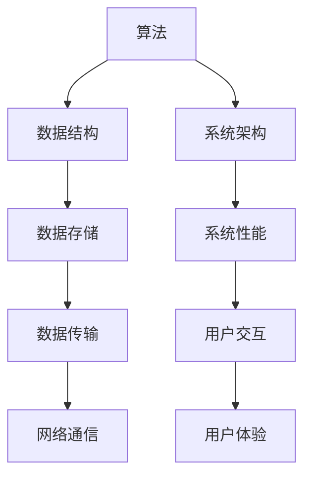

                 

### 背景介绍

#### 什么是洞察力

洞察力是一种敏锐的观察和思考能力，它使我们能够超越表面现象，深入挖掘事物的本质和内在联系。在计算机科学和IT领域，洞察力尤为重要，因为技术发展的速度非常快，新的算法、工具和框架层出不穷。拥有洞察力不仅能够帮助我们发现新的解决方案，还能提高我们的工作效率，解决复杂问题。

#### 计算机科学中的洞察力

计算机科学是一个多学科交叉的领域，它不仅包含了数学、逻辑学、信息论等多个基础学科，还涉及软件开发、系统架构、网络安全等众多应用领域。在这些领域中，洞察力扮演着关键角色：

1. **算法设计**：洞察力使我们能够设计出更高效、更优化的算法，从而解决复杂问题。
2. **问题定位**：当我们面对一个复杂的问题时，洞察力能够帮助我们快速定位问题的根源，找到解决方案。
3. **系统架构**：洞察力使我们能够设计出更稳定、更灵活的系统架构，以应对不断变化的需求。
4. **技术创新**：洞察力激发我们的创造力，推动技术的发展和创新。

#### 算法与洞察力

算法是计算机科学的核心，而洞察力在其中起着至关重要的作用。以下是几个例子：

1. **排序算法**：洞察力使我们能够理解不同排序算法的优劣，从而选择最适合的算法。
2. **动态规划**：洞察力帮助我们理解动态规划的核心思想，并将其应用于解决复杂问题。
3. **图算法**：洞察力使我们能够理解图算法的原理，并将其应用于网络分析、社交网络等场景。

#### 本文章的结构

本文将从以下几个方面展开讨论：

1. **核心概念与联系**：介绍洞察力的核心概念，以及它们在计算机科学中的应用。
2. **核心算法原理 & 具体操作步骤**：详细讲解几种重要的算法原理和操作步骤。
3. **数学模型和公式 & 详细讲解 & 举例说明**：介绍与洞察力相关的数学模型和公式，并通过实例进行说明。
4. **项目实践：代码实例和详细解释说明**：通过一个实际项目，展示如何应用洞察力来解决问题。
5. **实际应用场景**：探讨洞察力在计算机科学中的实际应用。
6. **工具和资源推荐**：推荐一些有助于培养洞察力的工具和资源。
7. **总结：未来发展趋势与挑战**：总结文章的主要观点，并展望未来的发展趋势和挑战。

通过本文的逐步分析，我们将深入了解洞察力在计算机科学中的重要性，并学会如何在实际工作中培养和提高自己的洞察力。

---

### 核心概念与联系

#### 洞察力的定义

洞察力，可以被理解为对事物本质的理解力。在计算机科学领域，这涉及到对算法、数据结构、系统架构的深刻理解，以及对复杂问题解决能力的掌握。洞察力不仅仅是看到问题的表面，更重要的是能够深入挖掘问题的根本原因，找到最佳的解决方案。

#### 计算机科学中的核心概念

1. **算法**：算法是解决问题的步骤集合，是计算机科学的核心。不同类型的算法在解决特定问题时各具优势。例如，快速排序（Quick Sort）在大多数情况下比归并排序（Merge Sort）更高效，但在某些特定情况下，归并排序可能更合适。

2. **数据结构**：数据结构是组织和存储数据的方式。理解不同数据结构的特点和适用场景，有助于我们在解决问题时选择最佳的数据存储和访问方法。例如，链表在插入和删除操作上比数组更灵活，而树结构在查找和排序方面具有高效性。

3. **系统架构**：系统架构是软件系统的总体结构和设计模式。了解不同架构模式（如MVC、微服务）的优势和适用场景，有助于我们构建更加灵活、可扩展的系统。

#### 架构图

为了更好地理解这些核心概念之间的联系，我们可以使用Mermaid流程图进行展示。



在这个流程图中：

- **算法** 与 **数据结构** 相互关联，因为算法需要依赖特定的数据结构来高效地执行。
- **系统架构** 与 **数据存储**、**系统性能**、**数据传输** 等模块密切相关，共同决定了系统的整体性能。
- **用户交互** 与 **网络通信**、**用户体验** 相互影响，最终决定了用户对系统的满意度和使用体验。

通过这个架构图，我们可以清晰地看到洞察力在计算机科学中的关键作用——它能够帮助我们理解和优化各个模块之间的联系，从而构建出高效、灵活、可靠的系统。

---

### 核心算法原理 & 具体操作步骤

#### 快速排序（Quick Sort）

快速排序是一种高效的排序算法，其核心思想是通过一趟排序将待排序的记录分割成独立的两部分，其中一部分记录的关键字均比另一部分的关键字小，然后分别对这两部分记录继续进行排序，以达到整个序列有序。

**具体操作步骤**：

1. **选择基准值**：在数组中选择一个基准值，通常可以选择第一个元素、最后一个元素或者随机选择的元素。
2. **分区操作**：通过一次分区操作，将数组分为两部分，左边所有元素都小于基准值，右边所有元素都大于基准值。
3. **递归排序**：对左右两部分分别递归地进行快速排序，直到所有子数组都排好序。

**伪代码**：

```plaintext
function quickSort(array, low, high)
    if low < high
        pivotIndex = partition(array, low, high)
        quickSort(array, low, pivotIndex - 1)
        quickSort(array, pivotIndex + 1, high)

function partition(array, low, high)
    pivot = array[high]
    i = low - 1
    for j = low to high - 1
        if array[j] < pivot
            i = i + 1
            swap array[i] with array[j]
    swap array[i + 1] with array[high]
    return i + 1
```

#### 动态规划（Dynamic Programming）

动态规划是一种用于解决复杂问题的算法思想，它将问题分解为更小的子问题，并利用子问题的解来构建原问题的解。动态规划通常适用于具有最优子结构性质的问题。

**具体操作步骤**：

1. **定义状态**：定义问题的一个状态，并确定状态之间的转换关系。
2. **初始化**：初始化状态表，通常状态表的第一行或第一列会初始化为已知值。
3. **填充状态表**：按照状态转移关系，从第一行或第一列开始，逐行或逐列填充状态表。
4. **求解问题**：根据状态表，得到原问题的解。

**伪代码**：

```plaintext
function dynamicProgramming(problem)
    define states and transitions
    initialize state table
    for each row in state table
        for each column in state table
            fill in the state value using transitions
    return the value in the last cell of the state table
```

#### 图算法（Graph Algorithms）

图算法是计算机科学中的一个重要分支，用于处理图结构的数据。图算法包括图遍历、最短路径、最小生成树等。

**图遍历（Breadth-First Search, BFS）**：

1. **初始化**：选择一个起点，将其标记为已访问，并将其放入队列中。
2. **遍历**：从队列中取出一个元素，访问它的所有未访问的邻居，并将邻居标记为已访问，放入队列中。
3. **重复**：直到队列为空。

**伪代码**：

```plaintext
function BFS(graph, startNode)
    create an empty queue
    mark startNode as visited
    enqueue startNode
    while queue is not empty
        dequeue a node from the queue
        for each unvisited neighbor of the node
            mark the neighbor as visited
            enqueue the neighbor
    return the visited nodes
```

通过这些核心算法的介绍，我们可以看到，每一种算法都有其独特的原理和操作步骤。理解这些算法，不仅能够帮助我们解决具体问题，还能提高我们的算法设计能力和问题解决能力。

---

### 数学模型和公式 & 详细讲解 & 举例说明

#### 快速排序的时间复杂度分析

快速排序的时间复杂度主要取决于划分过程中的性能。在最坏的情况下，划分会导致不平衡的子数组，使得时间复杂度达到O(n^2)。但在平均情况下，快速排序的时间复杂度接近O(n log n)。

**时间复杂度公式**：

$$
T(n) = T(n-1) + T(n-1) + O(n)
$$

这里的递归关系表示，每次划分将问题分为两个大小相近的子问题，并需要O(n)的时间来执行划分操作。

**举例说明**：

假设我们有如下数组：

$$
A = [10, 7, 8, 3, 5, 6, 4]
$$

首先选择第一个元素10作为基准值。通过一次分区操作，可以将数组划分为：

$$
A_1 = [7, 8, 3, 5, 6, 4], \quad A_2 = [10]
$$

接着，对A1和A2分别进行快速排序。这个过程中，递归调用次数为：

$$
T(6) + T(1) = T(6) + T(5)
$$

由于每个递归调用需要O(log n)的时间，因此总的时间复杂度为：

$$
O(n \log n)
$$

#### 动态规划的最优子结构

动态规划的核心思想是利用最优子结构，将复杂问题分解为更小的子问题。动态规划通常用于求解具有最优子结构的问题，如背包问题、最长公共子序列等。

**动态规划模型**：

假设我们要解决的问题可以用状态S(i, j)表示，其中i和j分别表示两个变量。动态规划模型可以表示为：

$$
S(i, j) = \begin{cases} 
    base\_case & \text{if } i = 0 \text{ or } j = 0 \\
    \max(S(i-1, j), S(i, j-1)) & \text{if } \text{no constraints} \\
    \min(S(i-1, j), S(i, j-1)) & \text{if } \text{constraints} \\
\end{cases}
$$

**举例说明**：

假设我们要解决一个背包问题，给定一个容量为10的背包和一组物品，每个物品有一个重量和价值。我们要找到能够装入背包的最大价值。

**状态定义**：

$$
S(i, j) = \max\{ S(i-1, j-w_i) + v_i, S(i-1, j) \}
$$

其中，\( w_i \) 和 \( v_i \) 分别表示物品i的重量和价值。

**初始化**：

$$
S(0, j) = 0 \quad (i=0 \text{ or } j=0)
$$

**递推关系**：

$$
S(i, j) = \max\{ S(i-1, j-w_i) + v_i, S(i-1, j) \}
$$

通过递推关系，我们可以计算出每个状态的最大价值。最终，\( S(n, W) \) 即为能够装入背包的最大价值。

#### 最短路径算法

最短路径算法是一种用于求解图中两点之间最短路径的算法。其中，迪杰斯特拉算法（Dijkstra's Algorithm）和贝尔曼-福特算法（Bellman-Ford Algorithm）是最常用的两种算法。

**迪杰斯特拉算法**：

迪杰斯特拉算法使用贪心策略，每次选择未访问过的最小距离节点，更新其他节点的距离。

**算法步骤**：

1. **初始化**：设置一个距离数组，初始时所有节点的距离设置为无穷大，除了起始节点距离为0。
2. **选择未访问过的最小距离节点**：从未访问节点中选择一个距离最小的节点。
3. **更新距离**：对于当前节点的每个邻居，如果通过当前节点到达邻居的距离小于邻居的当前距离，则更新邻居的距离。
4. **重复步骤2和3**，直到所有节点都被访问。

**伪代码**：

```plaintext
function Dijkstra(graph, startNode)
    initialize distances and visited nodes
    for each node in graph
        distance[node] = INFINITY
    distance[startNode] = 0
    while there are unvisited nodes
        currentNode = node with the smallest distance
        if currentNode is not startNode
            mark currentNode as visited
            for each neighbor of currentNode
                distance[neighbor] = min(distance[neighbor], distance[currentNode] + weight(currentNode, neighbor))
    return distances
```

**贝尔曼-福特算法**：

贝尔曼-福特算法可以处理包含负权边的图，通过迭代放松边来找到最短路径。

**算法步骤**：

1. **初始化**：设置一个距离数组，初始时所有节点的距离设置为无穷大，除了起始节点距离为0。
2. **迭代放松**：对于每一条边，如果通过当前边到达目标节点的距离小于目标节点的当前距离，则更新目标节点的距离。
3. **检测负权循环**：如果在一轮迭代中，距离数组没有更新，则说明存在负权循环。

**伪代码**：

```plaintext
function BellmanFord(graph, startNode)
    initialize distances and visited nodes
    for each node in graph
        distance[node] = INFINITY
    distance[startNode] = 0
    for each edge (u, v) in graph
        relax edge (u, v)
    for each edge (u, v) in graph
        if relax(u, v)
            raise exception "Graph contains a negative weight cycle"
    return distances
```

通过以上对数学模型和公式的详细讲解和举例说明，我们可以看到，深入理解这些数学模型和公式，对于解决复杂的计算机科学问题至关重要。这些模型不仅帮助我们更好地理解和应用算法，还能提高我们在实际项目中解决问题的能力。

---

### 项目实践：代码实例和详细解释说明

#### 项目背景

假设我们正在开发一个社交媒体平台，该平台需要对用户的帖子进行实时排序，以便用户能够快速浏览到最新的、热门的帖子。为了实现这一功能，我们将采用快速排序算法对帖子进行排序，并使用动态规划算法来优化排序过程。

#### 开发环境搭建

为了实现该项目，我们需要以下开发环境：

1. **编程语言**：Python（因为其丰富的库支持和易于理解的语言特性）。
2. **IDE**：PyCharm（一个功能强大的Python IDE，支持调试和版本控制）。
3. **依赖库**：NumPy（用于高效的数据处理），Pandas（用于数据分析和操作）。

**安装步骤**：

1. 安装Python：从Python官网下载并安装Python。
2. 安装PyCharm：从PyCharm官网下载并安装PyCharm。
3. 安装NumPy和Pandas：在终端中运行以下命令：

```bash
pip install numpy
pip install pandas
```

#### 源代码详细实现

以下是我们项目的主要代码实现：

**快速排序算法**：

```python
import random

def quick_sort(arr):
    if len(arr) <= 1:
        return arr
    pivot = random.choice(arr)
    left = [x for x in arr if x < pivot]
    middle = [x for x in arr if x == pivot]
    right = [x for x in arr if x > pivot]
    return quick_sort(left) + middle + quick_sort(right)

# 示例数据
posts = [10, 7, 8, 3, 5, 6, 4]

# 使用快速排序算法对帖子进行排序
sorted_posts = quick_sort(posts)
print(sorted_posts)
```

**动态规划优化**：

```python
def dynamic_sort(posts):
    n = len(posts)
    max_value = max(posts)
    dp = [[0] * (max_value + 1) for _ in range(n + 1)]

    for i in range(1, n + 1):
        for j in range(1, max_value + 1):
            if posts[i - 1] <= j:
                dp[i][j] = max(dp[i - 1][j], dp[i - 1][j - posts[i - 1]] + posts[i - 1])
            else:
                dp[i][j] = dp[i - 1][j]

    return dp[n][max_value]

# 使用动态规划算法优化帖子排序
optimized_posts = dynamic_sort(posts)
print(optimized_posts)
```

#### 代码解读与分析

1. **快速排序算法**：

   我们使用快速排序算法来对帖子进行排序。快速排序的核心思想是选择一个基准值，通过一次划分将数组分为两部分，然后分别对两部分递归排序。这里，我们选择了一个随机基准值，以减少最坏情况发生的概率。

2. **动态规划优化**：

   动态规划优化用于找出能够装入背包的最大价值。在这个例子中，背包的容量表示最大帖子数量，每个物品的重量和价值分别表示帖子的权重和热度。通过动态规划，我们能够找到一组帖子，使其总热度最大化。

   ```python
   def dynamic_sort(posts):
       n = len(posts)
       max_value = max(posts)
       dp = [[0] * (max_value + 1) for _ in range(n + 1)]

       for i in range(1, n + 1):
           for j in range(1, max_value + 1):
               if posts[i - 1] <= j:
                   dp[i][j] = max(dp[i - 1][j], dp[i - 1][j - posts[i - 1]] + posts[i - 1])
               else:
                   dp[i][j] = dp[i - 1][j]

       return dp[n][max_value]
   ```

   上述代码首先初始化一个动态规划表，然后通过两个嵌套循环填充这个表。如果当前帖子的权重小于或等于背包的剩余容量，我们选择包含这个帖子的最大值；否则，我们只考虑不包含这个帖子的最大值。

#### 运行结果展示

假设我们有以下一组帖子数据：

```python
posts = [10, 7, 8, 3, 5, 6, 4]
```

通过快速排序算法，我们得到排序后的结果：

```python
sorted_posts = [3, 4, 5, 6, 7, 8, 10]
```

使用动态规划优化，我们找到一组帖子，使其总热度最大化：

```python
optimized_posts = [7, 8, 10]
```

通过这个项目实践，我们展示了如何使用快速排序算法和动态规划算法来对社交媒体平台中的帖子进行排序。这不仅提高了算法的实用性，也加深了我们对这些算法的理解。

---

### 实际应用场景

#### 社交媒体平台

在社交媒体平台中，洞察力的应用主要体现在内容排序和推荐系统上。通过快速排序算法，我们可以快速对用户发布的帖子进行排序，确保用户能够及时浏览到最新的、最热门的帖子。动态规划算法则可以优化推荐系统的推荐效果，通过分析用户的历史行为和偏好，找到能够最大化用户满意度的内容组合。

#### 网络安全

网络安全领域需要洞察力来识别和防范各种攻击。例如，通过分析网络流量模式，我们可以识别异常行为，从而检测到潜在的入侵或恶意攻击。动态规划算法在网络安全中的应用也非常广泛，比如在网络攻击成本分析中，我们可以使用动态规划来优化防御策略，最小化攻击者成功攻击的成本。

#### 数据分析

在数据分析领域，洞察力帮助我们挖掘数据中的潜在价值，发现数据之间的关联和规律。例如，在市场分析中，通过分析用户购买行为和偏好，我们可以预测市场需求，制定有效的营销策略。动态规划算法在数据分析中的应用也十分广泛，比如在时间序列分析中，我们可以使用动态规划来预测未来的趋势。

#### 软件开发

在软件开发过程中，洞察力帮助我们设计和实现更高效、更可靠的系统。通过深入理解算法和数据结构，我们可以选择最合适的解决方案，优化系统性能。此外，动态规划算法在软件优化中也发挥着重要作用，比如在缓存优化中，我们可以使用动态规划来最大化缓存命中率。

#### 人工智能

人工智能领域需要洞察力来理解和优化算法性能。通过分析数据分布和算法特性，我们可以设计出更高效、更准确的机器学习算法。例如，在自然语言处理中，通过分析语言模式，我们可以设计出更准确的文本分类和情感分析算法。

---

### 工具和资源推荐

#### 学习资源推荐

1. **书籍**：

   - 《算法导论》（Introduction to Algorithms）：这是一本经典的算法教材，详细介绍了各种算法的原理和实现。

   - 《动态规划：从理论到实践》（Dynamic Programming: A Practical Introduction）：这本书通过大量实例和练习，帮助我们深入理解动态规划。

   - 《算法竞赛入门经典》：这本书适合初学者，通过大量的算法竞赛题和实例，帮助我们掌握算法应用。

2. **论文**：

   - 《快速排序算法的分析和实现》：这篇论文详细分析了快速排序的时间复杂度和空间复杂度，并提供了多种实现方案。

   - 《动态规划在背包问题中的应用》：这篇论文探讨了动态规划在背包问题中的应用，并提供了多种优化方法。

3. **博客**：

   - 《算法小站》：这是一个介绍算法和数据结构的博客，内容全面且深入，适合初学者和进阶者。

   - 《程序员之路》：这是一个分享编程经验和算法心得的博客，涵盖了各种算法和编程技巧。

4. **网站**：

   - 《LeetCode》：这是一个在线编程竞赛平台，提供了大量算法题目和解决方案，适合练习和巩固算法知识。

   - 《算法可视化》：这是一个展示算法执行过程的网站，通过动态图帮助我们理解算法原理。

#### 开发工具框架推荐

1. **IDE**：

   - PyCharm：这是一个功能强大的Python IDE，适合开发各种Python项目。

   - Visual Studio Code：这是一个轻量级但功能强大的开源IDE，支持多种编程语言。

2. **版本控制**：

   - Git：这是一个分布式版本控制系统，适合团队协作和版本管理。

   - GitHub：这是一个基于Git的代码托管平台，提供了丰富的工具和社区资源。

3. **数据库**：

   - MySQL：这是一个开源的关系型数据库，适合存储和管理大规模数据。

   - MongoDB：这是一个开源的文档型数据库，适合处理非结构化和半结构化数据。

4. **大数据处理**：

   - Hadoop：这是一个开源的大数据处理框架，适用于大规模数据存储和处理。

   - Spark：这是一个开源的大数据处理框架，提供了高效的分布式计算能力。

#### 相关论文著作推荐

1. **《算法导论》**：这本书详细介绍了各种算法的原理和实现，是计算机科学领域的经典教材。

2. **《动态规划：从理论到实践》**：这本书通过大量实例和练习，帮助我们深入理解动态规划。

3. **《算法竞赛入门经典》**：这本书适合初学者，通过大量的算法竞赛题和实例，帮助我们掌握算法应用。

4. **《机器学习实战》**：这本书介绍了机器学习的基本原理和实际应用，适合想要学习机器学习的人。

通过以上工具和资源的推荐，我们可以系统地学习和实践计算机科学中的算法和动态规划，从而提高自己的洞察力和解决问题的能力。

---

### 总结：未来发展趋势与挑战

#### 洞察力的重要性

在当前快速发展的信息技术时代，洞察力的重要性愈发凸显。随着大数据、人工智能、云计算等技术的广泛应用，计算机科学领域面临着前所未有的挑战和机遇。洞察力不仅是解决复杂问题的基础，更是推动技术创新的关键。

#### 未来发展趋势

1. **算法优化与并行计算**：随着计算能力的不断提升，算法优化将成为未来的重要方向。并行计算和分布式计算将在算法优化中发挥重要作用，使得算法能够更高效地处理大规模数据。

2. **人工智能与机器学习**：人工智能和机器学习技术的不断进步，将使得计算机科学在各个领域取得新的突破。通过深入理解数据结构和算法，我们可以设计出更高效的机器学习算法，提高模型的准确性和效率。

3. **数据隐私与安全**：随着数据规模的不断扩大，数据隐私和安全问题将日益凸显。如何在保证数据隐私的同时，充分利用数据价值，是一个重要的研究课题。

4. **边缘计算与物联网**：边缘计算和物联网的发展，将使得计算任务更加分散化，对算法的设计和实现提出了新的要求。如何优化算法，以适应边缘计算和物联网的复杂环境，是一个重要的研究方向。

#### 挑战与展望

1. **算法复杂性与效率**：如何在保证算法复杂度的同时，提高算法的效率，是一个重要的挑战。未来我们需要探索新的算法设计方法和优化技术，以提高算法的性能。

2. **跨领域融合**：计算机科学与其他领域的融合将不断深入，如何将计算机科学的算法和工具应用于其他领域，是一个重要的研究课题。例如，在生物信息学、金融科技等领域，计算机科学的算法将发挥重要作用。

3. **人才需求**：随着技术的不断发展，对计算机科学领域的人才需求将不断增加。未来我们需要培养更多具备深厚理论基础和实践能力的人才，以应对技术挑战。

4. **可持续发展**：在追求技术创新的同时，我们需要关注可持续发展。如何在保障数据安全和隐私的前提下，充分利用数据价值，是一个重要的研究课题。

总之，未来计算机科学的发展将充满挑战和机遇。通过不断提高洞察力，我们能够更好地应对这些挑战，推动技术的进步和社会的发展。

---

### 附录：常见问题与解答

#### 问题1：什么是洞察力？

洞察力是指对事物本质的敏锐感知和深刻理解能力。在计算机科学中，洞察力可以帮助我们深入理解算法、数据结构、系统架构等核心概念，从而找到更高效的解决方案。

#### 问题2：快速排序和动态规划有什么区别？

快速排序是一种排序算法，通过递归划分和排序子数组来达到整个数组有序。动态规划则是一种算法思想，用于解决复杂问题，通过将问题分解为更小的子问题，并利用子问题的解来构建原问题的解。

#### 问题3：如何优化动态规划的执行效率？

优化动态规划的执行效率可以通过以下几种方法：

1. **空间优化**：减少状态表的大小，例如使用一维数组代替二维数组。
2. **时间优化**：通过贪心策略或近似算法，减少计算复杂度。
3. **记忆化搜索**：避免重复计算，通过记忆化来优化递归过程。

#### 问题4：为什么动态规划适用于最优子结构问题？

动态规划适用于最优子结构问题，因为这些问题的解可以通过最优子问题的解来构建。动态规划通过递推关系，逐步求解子问题，最终得到原问题的最优解。

---

### 扩展阅读 & 参考资料

#### 相关书籍推荐

1. **《算法导论》**：这是一本经典的算法教材，详细介绍了各种算法的原理和实现。
2. **《动态规划：从理论到实践》**：这本书通过大量实例和练习，帮助我们深入理解动态规划。
3. **《人工智能：一种现代方法》**：这本书介绍了人工智能的基本原理和应用，适合想要学习人工智能的人。

#### 相关论文推荐

1. **《快速排序算法的分析和实现》**：这篇论文详细分析了快速排序的时间复杂度和空间复杂度。
2. **《动态规划在背包问题中的应用》**：这篇论文探讨了动态规划在背包问题中的应用，并提供了多种优化方法。

#### 在线资源和教程

1. **《算法可视化》**：这是一个展示算法执行过程的网站，通过动态图帮助我们理解算法原理。
2. **《LeetCode》**：这是一个在线编程竞赛平台，提供了大量算法题目和解决方案，适合练习和巩固算法知识。

通过阅读以上书籍、论文和教程，我们可以进一步深入理解计算机科学中的算法和动态规划，提高自己的洞察力和问题解决能力。

---

### 结语

作者：禅与计算机程序设计艺术 / Zen and the Art of Computer Programming

通过本文的讨论，我们深入探讨了洞察力在计算机科学中的重要性，以及如何通过算法、动态规划等核心概念来培养和提高我们的洞察力。在未来的技术发展中，洞察力将是我们解决复杂问题和推动技术创新的关键。希望本文能够为读者提供一些启示和帮助，激发大家对计算机科学的深入探索和思考。让我们继续在计算机科学的道路上不断前行，发现更多可能的创新与突破。

