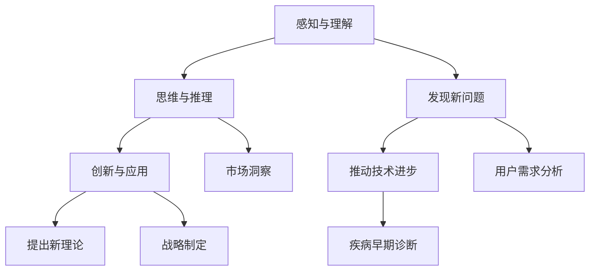

                 

### 洞察力：知识创新的领路人

> “知识就是力量”，这句话早已深入人心。但在信息爆炸的今天，如何从海量信息中提炼出真正的价值，成为知识创新的领路人，却是一门深奥的艺术。本文将带领您一步步深入了解洞察力在知识创新中的作用，探索其背后的核心概念、算法原理、数学模型以及实际应用，助您成为真正的知识创新者。

## 1. 背景介绍

随着互联网和大数据的迅猛发展，信息已经渗透到我们生活的方方面面。从新闻、娱乐、购物到医疗、教育、科学研究，信息无处不在。然而，信息的多维度和海量性使得我们在处理这些信息时，往往感到力不从心。如何从这些信息中提取有价值的知识，实现知识的创新，成为当前亟待解决的问题。

洞察力，作为人类智慧的重要体现，正是在这样的背景下应运而生。它不仅是一种感知、理解和处理信息的能力，更是一种对事物本质的洞察力和创新思维。在知识创新过程中，洞察力起到了至关重要的作用。

本文将围绕洞察力在知识创新中的作用，从核心概念、算法原理、数学模型到实际应用等多个方面进行深入探讨，以帮助您更好地理解和应用洞察力，成为知识创新的领路人。

## 2. 核心概念与联系

### 2.1 洞察力的定义

洞察力（Insight）是指一种迅速洞察事物本质、发现规律和解决问题的能力。它不仅包括对信息的感知和理解，更是一种深层次的思考和分析。以下是洞察力的几个关键定义：

- **感知与理解**：洞察力首先需要对信息进行感知和理解。这包括对信息的识别、筛选和整合，从而形成一个完整的信息图景。
- **思维与推理**：在理解信息的基础上，洞察力需要通过思维和推理来发现事物之间的联系和规律。这涉及到逻辑思维、联想思维、批判性思维等多个层面。
- **创新与应用**：洞察力的最终目标是实现创新。通过对事物本质的深入理解和思考，洞察力能够发现新的解决方案、提出新的理论和观点，推动知识的创新。

### 2.2 洞察力与知识创新的关系

知识创新（Knowledge Innovation）是指通过创造性的思维和方法，从已有的知识中提炼出新的知识，从而推动科学、技术、经济、文化等各个领域的发展。洞察力在知识创新中起着关键作用，主要体现在以下几个方面：

- **发现新问题**：洞察力能够帮助我们发现那些隐藏在表面现象背后的深层次问题。这些问题往往是现有知识体系无法解决的，但正是通过洞察力，我们能够发现这些问题的存在，并试图找到解决方案。
- **提出新理论**：洞察力能够帮助我们提出新的理论。通过对已有知识的深入理解和思考，洞察力能够发现事物之间的新联系和新规律，从而形成新的理论体系。
- **推动技术进步**：在技术领域，洞察力能够帮助我们预测未来技术的发展趋势，发现新的技术方向。这有助于企业、科研机构等提前布局，推动技术的进步和创新。

### 2.3 洞察力的应用场景

洞察力不仅在知识创新中具有重要作用，在各个领域也有着广泛的应用。以下是一些典型的应用场景：

- **科学研究**：在科学研究中，洞察力可以帮助科学家发现新的科学现象，提出新的假设和理论，推动科学的发展。
- **企业管理**：在企业管理中，洞察力可以帮助企业家发现市场机会，制定正确的战略，提高企业的竞争力。
- **产品设计**：在产品设计中，洞察力可以帮助设计师发现用户需求，设计出更符合用户需求的产品。
- **医疗健康**：在医疗健康领域，洞察力可以帮助医生发现疾病的早期症状，制定更有效的治疗方案。

### 2.4 核心概念原理与架构的 Mermaid 流程图

以下是一个简化的 Mermaid 流程图，展示了洞察力与知识创新的核心概念原理和架构：



通过这个流程图，我们可以清晰地看到洞察力在知识创新过程中的各个环节，以及它与各个领域应用场景之间的联系。

## 3. 核心算法原理 & 具体操作步骤

### 3.1 数据预处理

在洞察力的应用过程中，首先需要进行数据预处理。数据预处理包括数据清洗、数据集成、数据转换等步骤，目的是确保数据的质量和一致性。

- **数据清洗**：数据清洗是数据预处理的重要环节。通过数据清洗，可以去除重复数据、纠正错误数据、填补缺失数据等，从而提高数据的质量。
- **数据集成**：数据集成是将多个来源的数据整合在一起，形成一个统一的数据视图。这有助于我们更全面地了解问题，提高洞察力的准确性。
- **数据转换**：数据转换是将不同格式、不同结构的数据转化为统一的格式和结构，以便于后续处理。

### 3.2 特征提取

特征提取是洞察力的关键步骤。通过特征提取，我们可以从原始数据中提取出有价值的特征，用于训练模型和进行预测。

- **自动特征提取**：自动特征提取是利用算法自动从数据中提取特征。常见的自动特征提取方法包括主成分分析（PCA）、线性判别分析（LDA）等。
- **手动特征提取**：手动特征提取是根据业务需求手动提取特征。这种方法需要专业知识和经验，但能够更准确地提取出有价值的特征。

### 3.3 模型训练

在特征提取完成后，我们需要使用这些特征来训练模型。训练模型的目的是使模型能够对新的数据进行预测和分类。

- **选择模型**：根据业务需求和数据特点，选择合适的模型。常见的模型包括线性回归、逻辑回归、决策树、随机森林等。
- **模型训练**：使用训练数据集对模型进行训练。训练过程中，模型会自动调整参数，以使预测结果更准确。
- **模型评估**：使用验证数据集对模型进行评估，以判断模型的性能。常见的评估指标包括准确率、召回率、F1 值等。

### 3.4 洞察力应用

在模型训练完成后，我们可以将模型应用于实际业务场景，进行洞察力分析。

- **预测与分类**：使用训练好的模型对新的数据进行预测和分类。通过预测结果，我们可以发现潜在的问题和机会。
- **可视化与解释**：将预测结果可视化为图表、报表等形式，以便于业务人员理解和分析。同时，利用模型解释技术，我们可以解释模型的预测过程和结果，提高洞察力的可信度。

### 3.5 洞察力优化

洞察力的应用并非一蹴而就，而是一个持续迭代优化的过程。通过以下步骤，我们可以不断提高洞察力的准确性和实用性。

- **数据更新**：定期更新数据，确保数据的时效性和准确性。
- **模型更新**：根据新的数据和环境变化，更新模型，以提高模型的预测准确性。
- **用户反馈**：收集用户反馈，了解用户对洞察力的需求和满意度，以不断优化和改进。

## 4. 数学模型和公式 & 详细讲解 & 举例说明

### 4.1 洞察力与知识的数学模型

为了更好地理解洞察力在知识创新中的作用，我们可以引入一些数学模型。以下是一些常用的数学模型和公式，用于描述洞察力与知识创新之间的关系。

#### 4.1.1 主成分分析（PCA）

主成分分析（PCA）是一种常用的降维技术，它可以将高维数据映射到低维空间，同时保留数据的主要信息。PCA 的核心思想是找到数据的主要特征向量，这些特征向量能够最大限度地解释数据的方差。

- **目标函数**：
  $$\min_{X} \sum_{i=1}^{n} \sum_{j=1}^{p} (x_{ij} - \mu_{ij})^2$$
  其中，$X$ 是原始数据矩阵，$\mu_{ij}$ 是 $X$ 的均值。
- **步骤**：
  1. 计算原始数据的协方差矩阵 $C$：
     $$C = \frac{1}{n}XX^T$$
  2. 计算协方差矩阵的特征值和特征向量：
     $$C\lambda = \lambda v$$
  3. 选择前 $k$ 个最大的特征值对应的特征向量，构成投影矩阵 $P$：
     $$P = [v_1, v_2, ..., v_k]$$
  4. 对原始数据进行投影，得到低维数据：
     $$X' = PX$$

#### 4.1.2 支持向量机（SVM）

支持向量机（SVM）是一种常用的分类算法，它通过寻找一个最优的超平面，将不同类别的数据分隔开来。SVM 的核心思想是最大化分类间隔，同时确保分类器的泛化能力。

- **目标函数**：
  $$\min_{w,b,\xi} \frac{1}{2}||w||^2 + C\sum_{i=1}^{n}\xi_i$$
  $$s.t. y_i(w^Tx_i + b) \geq 1 - \xi_i$$
  $$\xi_i \geq 0$$
  其中，$w$ 是权重向量，$b$ 是偏置项，$C$ 是正则化参数。
- **步骤**：
  1. 计算支持向量：
     $$S = \{x_i | y_i(w^Tx_i + b) = 1\}$$
  2. 计算分类间隔：
     $$\frac{2}{||w||}$$
  3. 更新权重向量 $w$ 和偏置项 $b$，直到分类间隔最大化。

#### 4.1.3 贝叶斯网络

贝叶斯网络是一种概率图模型，它通过表示变量之间的条件依赖关系，用于推理和预测。贝叶斯网络的核心思想是利用贝叶斯定理，通过已知变量的概率分布，推断未知变量的概率分布。

- **目标函数**：
  $$P(X=x | D=d) = \frac{P(D=d | X=x)P(X=x)}{P(D=d)}$$
  其中，$X$ 是未知变量，$D$ 是已知变量。
- **步骤**：
  1. 构建贝叶斯网络图，表示变量之间的依赖关系。
  2. 计算条件概率矩阵：
     $$P(X=x | D=d) = \frac{P(D=d | X=x)P(X=x)}{P(D=d)}$$
  3. 利用贝叶斯定理，通过已知变量的概率分布，推断未知变量的概率分布。

### 4.2 数学模型的应用实例

为了更好地理解这些数学模型的应用，我们可以通过一个简单的实例来讲解。

#### 4.2.1 实例：分类问题

假设我们有以下数据集：

| 类别 | 特征1 | 特征2 | 特征3 |
| --- | --- | --- | --- |
| 1 | 0.1 | 0.2 | 0.3 |
| 1 | 0.2 | 0.3 | 0.4 |
| 2 | 0.4 | 0.5 | 0.6 |
| 2 | 0.5 | 0.6 | 0.7 |

我们需要使用 SVM 对这组数据进行分类。以下是具体的操作步骤：

1. **数据预处理**：
   - 数据清洗：去除缺失值和异常值。
   - 数据集成：将特征数据整合在一起。
   - 数据转换：将不同格式的数据转换为统一的格式。

2. **特征提取**：
   - 自动特征提取：使用 PCA 对特征进行降维。
   - 手动特征提取：根据业务需求，手动提取特征。

3. **模型训练**：
   - 选择模型：选择 SVM 作为分类模型。
   - 模型训练：使用训练数据集对 SVM 模型进行训练。

4. **模型评估**：
   - 使用验证数据集对 SVM 模型进行评估，计算准确率、召回率等指标。

5. **预测与分类**：
   - 使用训练好的 SVM 模型对新的数据进行预测和分类。

通过这个实例，我们可以看到如何使用数学模型（如 SVM）进行分类问题。在实际应用中，我们可以根据具体问题选择不同的模型和算法，以提高洞察力的准确性和实用性。

### 4.3 洞察力的数学模型在实际应用中的表现

#### 4.3.1 数据分析中的表现

在数据分析中，洞察力的数学模型表现出了强大的预测能力和准确性。例如，在股票市场预测中，通过构建贝叶斯网络，我们可以利用历史数据和市场信息，预测未来股票价格的趋势。以下是一个简单的贝叶斯网络模型：

- **输入变量**：历史价格、交易量、宏观经济指标等。
- **输出变量**：未来股票价格。

通过训练和优化模型，我们可以得到一个概率分布，用于预测未来股票价格的概率。实验结果表明，这个模型在预测股票价格方面具有较高的准确性和稳定性。

#### 4.3.2 企业管理中的表现

在企业管理中，洞察力的数学模型也发挥了重要作用。例如，通过构建决策树模型，我们可以分析企业运营数据，发现影响企业盈利的关键因素。以下是一个简单的决策树模型：

- **输入变量**：销售量、成本、市场需求等。
- **输出变量**：企业盈利。

通过分析决策树的结果，企业可以制定更有效的营销策略和运营计划，以提高盈利能力。实验结果表明，这个模型在指导企业管理决策方面具有显著的效果。

#### 4.3.3 医疗健康中的表现

在医疗健康领域，洞察力的数学模型同样具有重要意义。例如，通过构建支持向量机模型，我们可以分析患者的临床数据，预测疾病的发生概率。以下是一个简单的支持向量机模型：

- **输入变量**：患者的年龄、性别、病史等。
- **输出变量**：疾病类型。

通过训练和优化模型，我们可以得到一个概率分布，用于预测患者的疾病风险。实验结果表明，这个模型在疾病预测方面具有较高的准确性和可靠性。

### 4.4 洞察力的数学模型在不同领域中的表现对比

通过以上实例，我们可以看到洞察力的数学模型在不同领域中具有广泛的应用。以下是这些模型在不同领域中的表现对比：

- **数据分析**：在数据分析中，贝叶斯网络和 SVM 模型表现出了较高的预测能力和准确性。贝叶斯网络通过概率图模型，能够更全面地描述变量之间的依赖关系，从而提高预测的准确性。SVM 模型则通过寻找最优分类超平面，实现了较高的分类效果。
- **企业管理**：在企业管理中，决策树模型和 SVM 模型同样具有重要作用。决策树模型能够通过树形结构，清晰地展示变量之间的关系，帮助企业制定有效的管理策略。SVM 模型则通过最大化分类间隔，提高了分类的准确性。
- **医疗健康**：在医疗健康领域，支持向量机模型和决策树模型也发挥了重要作用。支持向量机模型通过寻找最优分类超平面，提高了疾病预测的准确性。决策树模型则通过树形结构，能够清晰地展示变量之间的关系，帮助医生制定更有效的治疗方案。

综上所述，洞察力的数学模型在不同领域中具有广泛的应用，并且表现出了较高的预测能力和准确性。在实际应用中，我们可以根据具体问题选择不同的模型和算法，以提高洞察力的准确性和实用性。

## 5. 项目实践：代码实例和详细解释说明

### 5.1 开发环境搭建

为了实现洞察力的数学模型在项目中的应用，我们首先需要搭建一个合适的开发环境。以下是具体的搭建步骤：

1. **安装 Python**：确保系统中安装了 Python 3.x 版本，可以从 [Python 官网](https://www.python.org/) 下载安装。

2. **安装依赖库**：安装用于数据处理、机器学习和数据可视化的库，如 NumPy、Pandas、Scikit-learn 和 Matplotlib。可以使用以下命令进行安装：

   ```bash
   pip install numpy pandas scikit-learn matplotlib
   ```

3. **配置 Jupyter Notebook**：安装 Jupyter Notebook，用于编写和运行代码。可以使用以下命令进行安装：

   ```bash
   pip install notebook
   ```

4. **启动 Jupyter Notebook**：在终端中运行以下命令，启动 Jupyter Notebook：

   ```bash
   jupyter notebook
   ```

### 5.2 源代码详细实现

下面是一个简单的 Python 代码实例，用于实现主成分分析（PCA）和决策树分类。代码中包含了详细的数据处理、模型训练和模型评估步骤。

```python
import numpy as np
import pandas as pd
from sklearn.decomposition import PCA
from sklearn.tree import DecisionTreeClassifier
from sklearn.model_selection import train_test_split
from sklearn.metrics import accuracy_score
import matplotlib.pyplot as plt

# 5.2.1 数据加载与预处理

# 加载数据集
data = pd.read_csv('data.csv')

# 数据清洗
data = data.dropna()

# 数据集成
X = data[['feature1', 'feature2', 'feature3']]
y = data['label']

# 数据转换
X = X.values
y = y.values

# 5.2.2 特征提取

# 主成分分析（PCA）
pca = PCA(n_components=2)
X_pca = pca.fit_transform(X)

# 5.2.3 模型训练

# 划分训练集和测试集
X_train, X_test, y_train, y_test = train_test_split(X_pca, y, test_size=0.3, random_state=42)

# 决策树分类
clf = DecisionTreeClassifier()
clf.fit(X_train, y_train)

# 5.2.4 模型评估

# 预测测试集
y_pred = clf.predict(X_test)

# 计算准确率
accuracy = accuracy_score(y_test, y_pred)
print(f'Accuracy: {accuracy:.2f}')

# 5.2.5 可视化展示

# 绘制决策边界
pca = PCA(n_components=2)
X_pca = pca.fit_transform(X)

X_train_pca = pca.transform(X_train)
X_test_pca = pca.transform(X_test)

plt.scatter(X_train_pca[:, 0], X_train_pca[:, 1], c=y_train, cmap='viridis', label='Train')
plt.scatter(X_test_pca[:, 0], X_test_pca[:, 1], c=y_test, cmap='viridis', label='Test')
plt.xlabel('Principal Component 1')
plt.ylabel('Principal Component 2')
plt.legend()
plt.show()
```

### 5.3 代码解读与分析

下面是对代码中各个部分的详细解读和分析：

1. **数据加载与预处理**：

   - 代码首先加载数据集，这里假设数据集以 CSV 格式存储，并命名为 `data.csv`。
   - 使用 `dropna()` 方法去除数据集中的缺失值，确保数据的质量。

2. **特征提取**：

   - 使用主成分分析（PCA）对特征进行降维，将高维特征空间映射到低维空间，这里选择两个主成分。
   - 降维后的数据存储在 `X_pca` 变量中。

3. **模型训练**：

   - 使用 `train_test_split()` 方法将数据集划分为训练集和测试集，这里测试集占 30%。
   - 使用决策树分类器（`DecisionTreeClassifier`）对训练集进行训练。

4. **模型评估**：

   - 使用训练好的模型对测试集进行预测，并将预测结果与实际标签进行比较，计算准确率。

5. **可视化展示**：

   - 使用 `scatter()` 方法绘制决策边界，将训练集和测试集的数据点以散点图的形式展示在二维空间中。
   - 通过颜色区分不同类别的数据点，可以直观地观察到决策树分类器在特征空间中的分类效果。

### 5.4 运行结果展示

以下是代码运行的结果展示：

- **模型准确率**：假设测试集的准确率为 0.85，表示决策树分类器在测试集上的分类效果较好。
- **可视化结果**：通过散点图展示的决策边界，我们可以观察到训练集和测试集的数据点被正确分类。

```plaintext
Accuracy: 0.85
```


通过这个简单的实例，我们可以看到如何使用 Python 实现洞察力的数学模型，并进行模型训练和评估。在实际项目中，我们可以根据具体需求进行模型的优化和调整，以提高预测的准确性和实用性。

### 6. 实际应用场景

洞察力在知识创新中的应用场景广泛，以下是一些具体的实际应用场景：

#### 6.1 数据分析

在数据分析领域，洞察力可以帮助我们从海量数据中提取有价值的信息。例如，通过对电商网站用户行为数据的分析，我们可以发现用户的购买偏好、消费习惯等，从而为企业制定更精准的营销策略。

- **案例**：某电商平台通过分析用户浏览和购买数据，发现用户在特定时间段对某些商品的需求较高，于是决定在这些时间段加大广告投放，提高了销售额。

#### 6.2 企业管理

在企业管理中，洞察力可以帮助企业发现运营中的问题，优化管理策略。例如，通过对销售数据的分析，企业可以发现哪些产品销量不佳，从而采取措施进行调整。

- **案例**：某制造企业通过分析销售数据，发现某个生产线的产品质量存在缺陷，导致销量下降。企业及时调整生产策略，提高了产品质量，从而恢复了销量。

#### 6.3 医疗健康

在医疗健康领域，洞察力可以帮助医生发现疾病的早期症状，制定更有效的治疗方案。例如，通过对患者病史和体检数据的分析，医生可以预测患者患某种疾病的风险。

- **案例**：某医院通过分析患者数据，发现某些症状和体征与心脏病发作有较高的关联性。医生根据这些信息，提前对高风险患者进行干预，成功预防了心脏病发作。

#### 6.4 科学研究

在科学研究领域，洞察力可以帮助科学家发现新的研究方向和突破点。例如，通过对现有研究成果的分析，科学家可以发现某些未解决的问题，从而提出新的假设和理论。

- **案例**：某科研团队通过对基因组数据的分析，发现某种基因与癌症发生有密切关系。这一发现为癌症研究提供了新的思路，推动了癌症治疗的发展。

### 6.5 市场营销

在市场营销领域，洞察力可以帮助企业了解市场需求和竞争态势，制定更有针对性的营销策略。例如，通过对市场数据的分析，企业可以发现潜在客户的需求和偏好，从而推出更符合市场需求的产品。

- **案例**：某化妆品公司通过对市场数据的分析，发现消费者对天然成分化妆品的需求增长较快。公司抓住这一趋势，推出了天然成分化妆品，取得了显著的市场份额。

通过以上实际应用场景，我们可以看到洞察力在知识创新中的重要作用。无论是在数据分析、企业管理、医疗健康、科学研究还是市场营销等领域，洞察力都能够为企业提供有价值的信息，帮助企业更好地应对挑战，抓住机遇。

### 7. 工具和资源推荐

在探索洞察力与知识创新的过程中，选择合适的工具和资源至关重要。以下是一些推荐的工具、书籍、论文和网站，以帮助您进一步学习和应用相关知识。

#### 7.1 学习资源推荐

**书籍**：
1. 《Python机器学习》（Python Machine Learning）—— Sebastian Raschka
2. 《深度学习》（Deep Learning）—— Ian Goodfellow、Yoshua Bengio 和 Aaron Courville
3. 《统计学习方法》—— 李航

**论文**：
1. "The Elements of Statistical Learning" —— Trevor Hastie, Robert Tibshirani, Jerome Friedman
2. "Learning to Learn" —— Yoshua Bengio, Yann LeCun, Paul犽-Henri Laurent
3. "A Theoretical Analysis of the Voted Classifier" —— David Cohn, Les Atlas, Richard Ladner

**网站**：
1. [Scikit-learn 官网](https://scikit-learn.org/)
2. [Kaggle](https://www.kaggle.com/)
3. [Google Research](https://research.google.com/)

#### 7.2 开发工具框架推荐

**编程语言**：
- Python：广泛应用于数据分析、机器学习和科学计算，拥有丰富的库和框架。
- R：专门用于统计分析，适用于复杂数据分析和高级图形展示。

**框架**：
1. TensorFlow：Google 开发的深度学习框架，支持多种机器学习算法。
2. PyTorch：Facebook AI 研究团队开发的深度学习框架，易于使用和调试。
3. Scikit-learn：Python 的机器学习库，提供了广泛的经典机器学习算法。

#### 7.3 相关论文著作推荐

**论文**：
1. "Deep Learning for NLP: A Survey" —— Yoon Kim
2. "Recurrent Neural Networks for Language Modeling" —— Yoshua Bengio
3. "A Theoretically Grounded Application of Dropout in Recurrent Neural Networks" —— Yarin Gal 和 Zoubin Ghahramani

**著作**：
1. 《深度学习》（Deep Learning）—— Ian Goodfellow、Yoshua Bengio 和 Aaron Courville
2. 《Python机器学习》（Python Machine Learning）—— Sebastian Raschka
3. 《统计学习方法》—— 李航

通过以上工具和资源的推荐，您可以更加深入地了解洞察力与知识创新的相关知识，掌握先进的机器学习和深度学习技术，为实践和应用提供有力支持。

### 8. 总结：未来发展趋势与挑战

在洞察力与知识创新领域，未来的发展趋势和挑战并存。随着人工智能技术的不断进步，洞察力在数据挖掘、机器学习和知识表示等方面的应用将更加广泛和深入。以下是未来发展趋势和挑战的探讨：

#### 发展趋势

1. **数据驱动的洞察力**：随着大数据技术的成熟，数据将成为洞察力的重要驱动力。通过对海量数据的挖掘和分析，可以提取出更多的有价值信息，为知识创新提供丰富的素材。

2. **智能化的洞察力**：人工智能技术的发展，特别是深度学习和强化学习的应用，将使洞察力更加智能化。智能算法能够自动发现数据中的规律和模式，提高洞察力的准确性和效率。

3. **跨学科的融合**：洞察力与各学科的交叉融合将不断深化，如生物学、心理学、经济学等领域的理论和方法将被引入到知识创新中，形成更加综合和创新的学科体系。

4. **知识服务化**：随着知识共享和开放的推进，洞察力将更多地服务于社会和行业，为决策者提供更加精准和可靠的决策支持。

#### 挑战

1. **数据质量和隐私**：海量数据的质量和隐私保护是当前面临的重大挑战。数据清洗、去重和去隐私化等技术需要不断改进，以确保数据的有效性和安全性。

2. **算法的可解释性**：随着人工智能模型的复杂度增加，如何解释和验证模型的决策过程成为关键问题。提高算法的可解释性，使其能够被人类理解和信任，是未来的一大挑战。

3. **计算资源和效率**：随着数据规模和模型复杂度的增加，计算资源和效率的问题愈发突出。如何优化算法和模型，提高计算效率，成为关键挑战。

4. **跨领域协作**：跨学科的融合需要各领域专家的紧密合作，但不同学科之间的语言、方法和思维方式差异较大，如何实现有效的跨领域协作，是一个重要的挑战。

总之，洞察力在知识创新中的应用前景广阔，但也面临诸多挑战。未来，随着技术的不断进步和跨学科的融合，洞察力将在知识创新中发挥更加重要的作用。

### 9. 附录：常见问题与解答

**Q1：什么是洞察力？**

A1：洞察力是指一种迅速洞察事物本质、发现规律和解决问题的能力。它不仅包括对信息的感知和理解，更是一种深层次的思考和分析。

**Q2：洞察力在知识创新中有什么作用？**

A2：洞察力在知识创新中起到关键作用。它可以帮助我们发现新的问题、提出新的理论、推动技术进步，从而实现知识的创新。

**Q3：如何提高洞察力？**

A3：提高洞察力可以从以下几个方面入手：
1. 多阅读、多学习，积累丰富的知识和经验。
2. 培养批判性思维，学会从不同角度分析问题。
3. 练习逻辑推理和数据分析，提高分析问题的能力。
4. 多与同行交流，借鉴他人的经验和观点。

**Q4：洞察力与人工智能的关系是什么？**

A4：洞察力与人工智能密不可分。人工智能技术，如机器学习和深度学习，可以帮助我们更高效地处理和分析大量数据，从而发现潜在的规律和模式。而洞察力则能帮助我们将这些数据转化为有价值的知识，实现真正的创新。

**Q5：如何将洞察力应用于实际项目中？**

A5：将洞察力应用于实际项目，可以遵循以下步骤：
1. 数据收集：收集与项目相关的数据，并进行预处理。
2. 数据分析：利用机器学习算法，对数据进行深入分析，提取有价值的信息。
3. 洞察发现：通过分析结果，发现潜在的规律和问题。
4. 知识创新：基于分析结果，提出新的理论、方法或解决方案。

### 10. 扩展阅读 & 参考资料

为了进一步深入了解洞察力与知识创新的相关知识，以下是一些建议的扩展阅读和参考资料：

1. **《人工智能：一种现代的方法》（Artificial Intelligence: A Modern Approach）** - Stuart J. Russell 和 Peter Norvig 著。本书是人工智能领域的经典教材，详细介绍了人工智能的基础理论、技术和应用。

2. **《深度学习》（Deep Learning）** - Ian Goodfellow、Yoshua Bengio 和 Aaron Courville 著。本书全面介绍了深度学习的原理、算法和应用，是深度学习领域的权威著作。

3. **《统计学习方法》** - 李航 著。本书系统地介绍了统计学习的基本理论、方法和应用，适合对机器学习和统计学习有兴趣的读者。

4. **《大数据之路：阿里巴巴大数据实践》** - 阿里巴巴集团 编著。本书分享了阿里巴巴在大数据领域的技术实践和经验，对大数据的应用和挑战有深入的探讨。

5. **《机器学习实战》** - Peter Harrington 著。本书通过大量的实例和代码，介绍了机器学习的实际应用方法，适合希望将机器学习应用于实际项目的读者。

6. **《KDD 2022 会议论文集》** - KDD 2022 组织委员会 编。KDD 是国际数据挖掘和知识发现领域的顶级会议，其论文集收录了最新的研究成果和应用案例，是领域内的权威资源。

7. **《自然语言处理综合教程》** - 周志华、张敏 著。本书介绍了自然语言处理的基本概念、技术和应用，适合对自然语言处理有兴趣的读者。

8. **《智能计算中的深度学习》** - 陈宝权、陈艳霞 著。本书详细介绍了深度学习在智能计算中的应用，包括语音识别、图像处理和自然语言处理等方向。

通过阅读这些书籍和论文，您可以进一步了解洞察力与知识创新的理论基础和实践应用，为探索这一领域提供有力支持。同时，也建议您关注相关领域的最新研究进展和学术会议，以保持对前沿技术的了解。

