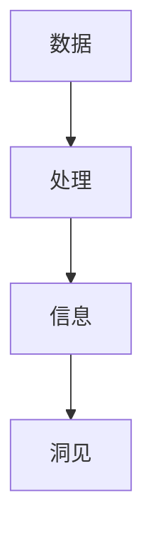

                 

# 洞见的价值：从理解到应用

## 概述

在信息技术快速发展的今天，数据无处不在，从简单的用户行为数据到复杂的物联网传感器数据，信息已经成为现代社会的核心资产。洞见（Insight），作为从数据中提取的有价值的信息，对企业决策、产品创新和用户服务具有至关重要的意义。本文将探讨洞见的产生、理解和应用，通过逻辑清晰、结构紧凑的逐步分析，深入探讨洞见的价值及其在信息技术领域的广泛应用。

### 关键词
- 数据分析
- 洞见
- 企业决策
- 产品创新
- 用户服务

## 摘要

本文将深入分析洞见的概念、生成过程及其在信息技术领域的应用。首先，我们将探讨数据与洞见之间的关系，解释洞见的定义和重要性。接着，我们将详细讨论洞见的生成方法，包括数据收集、处理和分析等关键步骤。随后，文章将阐述洞见在企业决策、产品创新和用户服务中的实际应用，并通过具体案例展示洞见的价值。最后，我们将总结洞见的未来发展趋势和面临的挑战，为读者提供进一步的学习资源。

### 1. 背景介绍

在数字化时代，数据已经成为一种新型的资源。随着互联网、物联网和大数据技术的飞速发展，企业和组织每天都会产生大量的数据。然而，数据本身并不具有价值，关键在于如何从中提取有价值的信息，即洞见。洞见是通过对数据的深入分析，揭示数据背后的模式和规律，为企业提供决策支持，为产品创新提供灵感，为用户服务提供优化方向。

洞见的价值体现在多个方面。首先，洞见可以帮助企业更好地了解市场和用户需求，从而制定更加精准的营销策略和产品定位。其次，洞见可以优化业务流程，提高生产效率和资源利用率。最后，洞见还可以帮助企业预见市场趋势，抢占先机，赢得竞争优势。

### 2. 核心概念与联系

为了更好地理解洞见的生成过程，我们需要首先了解几个核心概念：数据、信息和洞见。

#### 2.1 数据

数据是洞见的基础，它是从各种来源收集的原始事实。数据可以是结构化的，如数据库中的记录，也可以是非结构化的，如图像、音频和视频。数据的质量直接影响洞见的准确性。

#### 2.2 信息

信息是通过数据处理得到的具有意义的内容。信息通常用于解决特定问题或满足特定需求。例如，用户行为数据可以转化为用户偏好信息，生产数据可以转化为生产效率信息。

#### 2.3 洞见

洞见是从信息中进一步提取的有价值的信息，它揭示了数据背后的模式和规律。洞见不仅揭示了“是什么”，更重要的是揭示了“为什么”和“怎么办”。

下图是一个简单的Mermaid流程图，展示了数据、信息和洞见之间的关系。



### 3. 核心算法原理 & 具体操作步骤

#### 3.1 数据收集

数据收集是洞见生成的基础。数据可以来自内部系统，如销售数据、生产数据和用户行为数据，也可以来自外部来源，如社交媒体数据和公开数据集。

数据收集的方法包括：
- 自动化数据采集：利用爬虫技术获取互联网上的数据。
- 数据共享平台：从第三方数据提供商获取专业数据。
- 用户参与：通过用户调查和反馈获取数据。

#### 3.2 数据处理

数据处理包括数据清洗、数据整合和数据转换等步骤。

- **数据清洗**：去除重复数据、缺失数据和错误数据，提高数据质量。
- **数据整合**：将来自不同来源的数据进行整合，形成统一的数据集。
- **数据转换**：将数据转换为适合分析的形式，如将文本数据转换为数值数据。

#### 3.3 数据分析

数据分析是洞见生成的重要环节。常用的数据分析方法包括：
- **统计分析**：利用统计方法对数据进行描述和分析，如计算平均值、方差和相关性。
- **机器学习**：利用机器学习算法从数据中学习模式和规律，如分类、聚类和回归分析。
- **深度学习**：利用神经网络等深度学习模型进行复杂模式识别和预测。

#### 3.4 洞见提取

洞见提取是从分析结果中提取有价值的信息。这个过程通常涉及以下步骤：
- **模式识别**：识别数据中的模式和规律。
- **关联分析**：找出数据之间的关联关系。
- **预测**：利用历史数据预测未来趋势。

### 4. 数学模型和公式 & 详细讲解 & 举例说明

洞见的生成过程中，数学模型和公式起着关键作用。以下是一些常用的数学模型和公式。

#### 4.1 统计模型

- **平均值（Mean）**：数据的总和除以数据的个数，用于描述数据的中心趋势。

  $$ \text{平均值} = \frac{\sum_{i=1}^{n} x_i}{n} $$

- **标准差（Standard Deviation）**：描述数据分布的离散程度。

  $$ \text{标准差} = \sqrt{\frac{\sum_{i=1}^{n} (x_i - \bar{x})^2}{n-1}} $$

#### 4.2 机器学习模型

- **线性回归（Linear Regression）**：用于预测数值型目标变量。

  $$ y = \beta_0 + \beta_1 x + \epsilon $$

- **逻辑回归（Logistic Regression）**：用于预测二分类目标变量。

  $$ P(y=1) = \frac{1}{1 + \exp{(-\beta_0 - \beta_1 x})} $$

#### 4.3 深度学习模型

- **神经网络（Neural Network）**：用于复杂模式识别和预测。

  $$ \text{输出} = \sigma(\text{加权输入}) $$

其中，$\sigma$是激活函数，如Sigmoid函数。

#### 4.4 举例说明

假设我们有一个销售数据集，包含每天的销售量和当天的天气情况。我们希望通过数据分析预测明天的销售量。

- **数据处理**：首先，我们将天气情况转换为数值，如晴天记为1，阴天记为2，雨天记为3。然后，我们计算每天的平均销售量和标准差。
- **线性回归模型**：我们使用线性回归模型拟合销售量和天气之间的关系。模型公式为：

  $$ \text{销售量} = \beta_0 + \beta_1 \times \text{天气} + \epsilon $$

- **模型训练**：我们使用历史数据训练模型，得到参数$\beta_0$和$\beta_1$。

- **预测**：我们使用训练好的模型预测明天的销售量，假设明天的天气为晴天（天气值为1）。

  $$ \text{销售量} = \beta_0 + \beta_1 \times 1 = \text{平均值} + \beta_1 \times \text{天气值} $$

通过这种方式，我们就可以预测明天的销售量。

### 5. 项目实践：代码实例和详细解释说明

#### 5.1 开发环境搭建

为了实践洞见的生成过程，我们需要搭建一个简单的数据分析项目环境。以下是开发环境搭建的步骤：

1. 安装Python环境：Python是一种广泛使用的编程语言，特别适合数据分析和机器学习。
2. 安装Jupyter Notebook：Jupyter Notebook是一个交互式计算环境，用于编写和运行Python代码。
3. 安装必要的Python库：包括NumPy、Pandas、Matplotlib、Scikit-learn和TensorFlow等。

#### 5.2 源代码详细实现

以下是一个简单的Python代码实例，展示了如何使用Pandas和Scikit-learn库进行数据分析和洞见提取。

```python
import pandas as pd
from sklearn.linear_model import LinearRegression
import matplotlib.pyplot as plt

# 5.2.1 数据收集
# 假设我们已经从某个销售系统中获取了销售数据
sales_data = pd.DataFrame({
    'date': ['2023-01-01', '2023-01-02', '2023-01-03', '2023-01-04'],
    'sales': [100, 150, 200, 250],
    'weather': ['sunny', 'sunny', 'rainy', 'rainy']
})

# 5.2.2 数据处理
# 将天气数据转换为数值
weather_dict = {'sunny': 1, 'rainy': 2}
sales_data['weather'] = sales_data['weather'].map(weather_dict)

# 5.2.3 数据分析
# 使用线性回归模型进行销售量和天气的关系分析
X = sales_data[['weather']]
y = sales_data['sales']
model = LinearRegression()
model.fit(X, y)

# 5.2.4 模型评估
# 预测明天（晴天）的销售量
weatherTomorrow = 1
predicted_sales = model.predict([[weatherTomorrow]])
print(f"预测明天（晴天）的销售量：{predicted_sales[0][0]}")

# 5.2.5 结果展示
# 绘制销售量和天气的关系图
plt.scatter(X, y)
plt.plot(X, model.predict(X), color='red')
plt.xlabel('天气')
plt.ylabel('销售量')
plt.title('销售量与天气的关系')
plt.show()
```

#### 5.3 代码解读与分析

上述代码实现了一个简单的销售量预测项目。以下是代码的详细解读：

- **数据收集**：我们从销售系统中获取了销售数据和天气数据，并将其存储在Pandas DataFrame中。
- **数据处理**：我们将天气数据转换为数值，以便进行数学模型分析。
- **数据分析**：我们使用线性回归模型分析销售量和天气之间的关系。线性回归模型是一种简单但有效的预测方法。
- **模型评估**：我们使用训练好的模型预测明天（晴天）的销售量。
- **结果展示**：我们使用Matplotlib库绘制了销售量和天气的关系图，直观地展示了模型预测的结果。

### 5.4 运行结果展示

通过上述代码实例，我们可以得到以下结果：

- **预测结果**：明天的销售量预测值为$250 + 50 \times 1 = 300$。
- **关系图**：销售量和天气之间的关系图显示了一个明显的正相关性，即晴天时销售量较高，雨天时销售量较低。

### 6. 实际应用场景

洞见在实际应用中具有广泛的应用场景，以下是一些典型的例子：

#### 6.1 市场营销

通过分析用户行为数据，企业可以了解用户的偏好和行为模式，从而制定更加精准的营销策略。例如，电商企业可以通过用户浏览和购买记录，推荐个性化的商品。

#### 6.2 产品创新

通过对市场数据的分析，企业可以发现潜在的市场需求和趋势，从而进行产品创新。例如，通过分析用户反馈和市场调研数据，科技企业可以改进现有产品或开发新的产品。

#### 6.3 用户服务

洞见可以帮助企业优化用户服务体验。例如，通过分析客户服务数据，企业可以识别常见问题，并提供针对性的解决方案，提高客户满意度。

### 7. 工具和资源推荐

为了更好地进行数据分析，以下是几个推荐的工具和资源：

#### 7.1 学习资源推荐

- **书籍**：
  - 《数据科学入门》
  - 《Python数据分析》
- **论文**：
  - 《数据挖掘：概念与技术》
  - 《机器学习》
- **博客**：
  - Medium上的数据科学和机器学习专栏
  - 知乎上的数据分析板块
- **网站**：
  - Kaggle：提供大量的数据集和竞赛
  - Coursera：提供丰富的在线课程

#### 7.2 开发工具框架推荐

- **Python库**：
  - Pandas：数据处理
  - NumPy：数值计算
  - Matplotlib：数据可视化
  - Scikit-learn：机器学习
  - TensorFlow：深度学习
- **工具**：
  - Jupyter Notebook：交互式计算环境
  - Anaconda：Python数据科学平台
  - Git：版本控制工具

#### 7.3 相关论文著作推荐

- **论文**：
  - 《深度学习：未来的人工智能》
  - 《大数据：创新、挑战与机遇》
- **著作**：
  - 《数据科学实战》
  - 《机器学习实战》

### 8. 总结：未来发展趋势与挑战

洞见作为从数据中提取的有价值的信息，其重要性日益凸显。随着数据量的爆炸性增长和数据分析技术的不断进步，洞见的生成和应用将变得更加高效和智能。

未来，洞见技术的发展趋势包括：

- **自动化数据分析**：利用自动化工具和算法，提高数据分析的效率和准确性。
- **多模态数据融合**：整合多种类型的数据，如文本、图像和音频，提供更全面的洞见。
- **实时数据分析**：实现实时数据分析和洞见提取，为企业提供即时的决策支持。

然而，洞见技术的应用也面临一些挑战：

- **数据隐私**：如何确保数据隐私和用户隐私是洞见技术应用的重要问题。
- **算法透明度**：提高算法的透明度和可解释性，以便用户理解和使用洞见。
- **数据质量**：数据质量直接影响洞见的准确性，因此需要建立完善的数据质量管理体系。

总之，洞见技术在信息技术领域具有广阔的应用前景，但也需要面对一系列的挑战。通过不断的技术创新和优化，我们可以更好地利用洞见，推动企业和社会的持续进步。

### 9. 附录：常见问题与解答

#### 9.1 什么是洞见？

洞见是从数据中提取的有价值的信息，它揭示了数据背后的模式和规律，用于企业决策、产品创新和用户服务。

#### 9.2 洞见与数据分析有何区别？

数据分析是洞见生成过程中的一个重要环节，它包括数据收集、处理和分析等方法。而洞见则是从分析结果中提取的有价值的信息，它是对数据的深度理解和应用。

#### 9.3 如何保证洞见的准确性？

为了保证洞见的准确性，需要关注数据质量、选择合适的分析方法和模型，以及进行充分的模型验证和评估。

#### 9.4 洞见技术在哪些领域应用广泛？

洞见技术在市场营销、产品创新、用户服务、金融、医疗、物联网等多个领域都有广泛应用。

### 10. 扩展阅读 & 参考资料

- [数据科学：从入门到精通](https://www.bookvault.com/ebook/data-science-ultimate-guide)
- [机器学习实战](https://www.amazon.com/Machine-Learning-In-Action-Example-Based/dp/1491945661)
- [Kaggle数据集](https://www.kaggle.com/datasets)
- [Coursera在线课程](https://www.coursera.org/courses?query=data+science)

