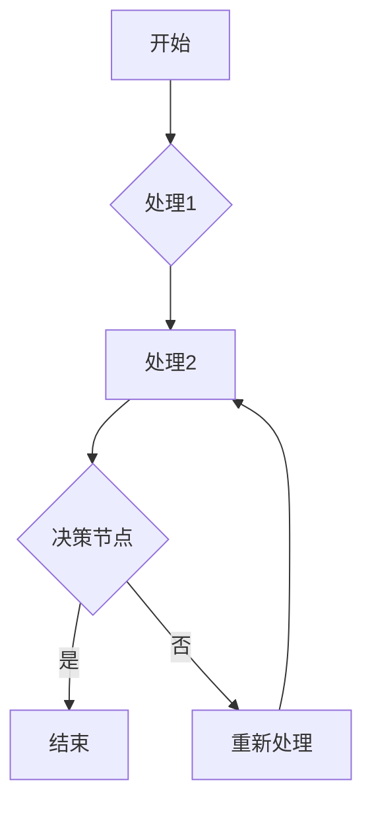

                 

### 1. 背景介绍

在当今快速发展的信息技术时代，企业和组织面临的挑战越来越多。随着业务规模的扩大、数据量的激增以及市场竞争的加剧，如何高效地管理和优化业务流程成为了一个亟待解决的问题。流程管理（Process Management）作为一种关键的策略工具，被广泛应用于各个领域，旨在通过简化和优化业务操作，提高生产效率、降低运营成本，并提升客户满意度。

#### 1.1 流程管理的定义与重要性

流程管理是一种系统化的方法，用于设计、实施、监控和改进业务流程。它涉及到识别和优化组织内部的各个环节，确保流程的高效和流畅，从而实现整体业务的优化。流程管理的重要性体现在以下几个方面：

1. **提高效率**：通过流程管理，可以消除冗余步骤、减少不必要的延误，从而提高整体工作效率。
2. **降低成本**：通过优化流程，减少资源浪费，降低运营成本，提升组织的盈利能力。
3. **提升质量**：流程管理有助于规范操作流程，确保一致性和标准化，从而提升产品和服务的质量。
4. **增强灵活性**：流程管理使得组织能够快速响应市场变化，灵活调整和优化业务流程。

#### 1.2 流程管理的常见挑战

尽管流程管理具有诸多优势，但在实际操作中，企业和组织常常面临以下挑战：

1. **复杂度**：业务流程往往涉及多个部门、多层审批，结构复杂，导致管理难度增加。
2. **数据分散**：不同部门和系统之间的数据共享和整合难度大，影响流程的整体优化。
3. **人员培训**：流程管理需要相关人员具备一定的专业知识和技能，但往往缺乏足够的培训和支持。
4. **变更管理**：流程优化往往涉及组织结构的调整和人员职责的变化，变更管理难度大。

#### 1.3 本文的目标

本文旨在探讨流程管理的核心概念、算法原理、数学模型以及实际应用，通过逐步分析推理的方式，帮助读者深入了解流程管理的本质，掌握其应用技巧，从而在实际业务中实现流程的简化和优化。

接下来的部分，我们将详细介绍流程管理的核心概念、架构、算法原理和具体操作步骤，并通过数学模型和公式进行详细讲解，结合实际项目实践，提供代码实例和详细解释，以帮助读者全面理解和掌握流程管理的精髓。

---

在背景介绍部分，我们简要介绍了流程管理的定义、重要性以及常见挑战，并明确了本文的目标。接下来，我们将深入探讨流程管理的核心概念和架构，以便为后续内容的讲解打下坚实的基础。

### 2. 核心概念与联系

#### 2.1 流程定义

流程（Process）可以被定义为完成特定任务的一系列有序步骤。它通常包括输入、处理和输出三个主要部分。流程的定义是流程管理的基础，它需要明确以下几个关键要素：

1. **输入**（Input）：流程开始所需的资源，如数据、材料或信息。
2. **处理**（Processing）：对输入资源进行操作和转换的过程，通常涉及人员、设备、系统和工具。
3. **输出**（Output）：流程完成后产生的结果或产品。

#### 2.2 流程分类

根据流程的性质和目的，可以将流程分为多种类型。以下是几种常见的流程分类：

1. **操作流程**（Operational Process）：涉及日常业务操作，如订单处理、客户服务、生产制造等。
2. **支持流程**（Support Process）：提供必要支持，确保核心业务流程的顺利进行，如财务管理、人力资源管理等。
3. **决策流程**（Decision Process）：涉及重要决策制定，如战略规划、投资决策等。
4. **项目流程**（Project Process）：用于管理项目从启动到完成的整个生命周期，包括计划、执行、监控和收尾等阶段。

#### 2.3 流程管理的关键要素

有效的流程管理需要关注以下几个关键要素：

1. **流程地图**（Process Map）：流程地图是一种可视化的工具，用于展示流程的各个环节及其相互关系。通过流程地图，可以清晰地了解流程的全貌，便于分析和优化。
2. **关键绩效指标**（Key Performance Indicators, KPIs）：KPIs是衡量流程绩效的重要指标，如周期时间、成本、质量、效率等。通过设定和监控KPIs，可以评估流程的绩效，发现问题和瓶颈。
3. **流程改进**（Process Improvement）：流程改进是流程管理的重要组成部分，通过识别和消除流程中的浪费、优化流程设计，持续提高流程的效率和效果。

#### 2.4 流程架构

流程架构（Process Architecture）是流程管理的核心框架，它定义了流程的结构、组件和关系。一个典型的流程架构包括以下组件：

1. **流程组件**（Process Components）：包括流程步骤、决策节点、输入输出等。
2. **流程网络**（Process Network）：流程组件之间的连接关系，通常采用图形表示。
3. **流程规则**（Process Rules）：定义流程中的决策逻辑和操作规范。
4. **流程控制**（Process Control）：用于监控和调整流程执行，确保流程按照预期运行。

#### 2.5 流程与业务流程管理

流程管理（Process Management）和业务流程管理（Business Process Management, BPM）是密切相关的概念。业务流程管理是一种更为全面的战略方法，它不仅关注流程的优化，还包括流程的规划、设计、实施、监控和改进。

1. **业务流程管理**（BPM）：BPM是一种系统化的方法，用于设计和优化业务流程，以提高组织的运营效率和竞争力。它涉及多个层面，包括战略层面、设计层面、执行层面和监控层面。
2. **流程管理**（Process Management）：流程管理是业务流程管理的一个子集，主要关注流程的具体执行和优化。它侧重于流程的执行效率、资源利用和成本控制。

#### 2.6 流程管理工具与技术

现代流程管理通常依赖于各种工具和技术，以实现流程的自动化、可视化和优化。以下是几种常见的流程管理工具和技术：

1. **流程管理软件**（BPM Software）：如IBM Business Process Manager、BPMN Studio等，用于流程设计、自动化和监控。
2. **流程优化技术**（Process Optimization Techniques）：如精益生产（Lean Manufacturing）、六西格玛（Six Sigma）等，用于流程改进和优化。
3. **流程模拟和仿真**（Process Simulation and Modeling）：通过模拟和仿真技术，评估和优化流程的性能和效果。

#### 2.7 Mermaid 流程图

为了更好地理解流程管理的核心概念和架构，我们可以使用Mermaid流程图来可视化流程组件和关系。以下是一个简单的Mermaid流程图示例：



在这个示例中，流程从“开始”节点开始，经过“处理1”和“处理2”节点，到达决策节点“D”。根据决策结果，流程要么继续到“结束”节点，要么返回到“处理2”节点重新处理。

通过上述核心概念和联系的介绍，我们已经为后续内容的讲解奠定了基础。在接下来的部分，我们将详细探讨流程管理的核心算法原理和具体操作步骤，帮助读者深入理解流程管理的实际应用。

### 3. 核心算法原理 & 具体操作步骤

流程管理中的核心算法原理主要涉及流程优化和自动化。以下是几种常用的核心算法原理和具体的操作步骤：

#### 3.1 最小化流程时间

最小化流程时间是一种常见的流程优化目标。其基本原理是通过缩短各个流程步骤的执行时间，来降低整体流程的周期时间。以下是具体的操作步骤：

1. **分析流程步骤**：首先，对流程中的各个步骤进行分析，确定每个步骤的执行时间、所需资源和依赖关系。
2. **识别瓶颈步骤**：通过分析，识别流程中的瓶颈步骤，即那些对整体流程时间影响最大的步骤。
3. **优化瓶颈步骤**：针对瓶颈步骤，采取以下措施进行优化：
   - **缩短执行时间**：通过技术改进、人员培训或增加资源投入，缩短瓶颈步骤的执行时间。
   - **减少等待时间**：通过改进流程设计，减少步骤之间的等待时间，如采用并行处理或优化资源分配。
4. **评估优化效果**：对优化后的流程进行评估，确保整体流程时间得到显著降低。

#### 3.2 流程自动化

流程自动化是提高流程效率的重要手段。其基本原理是将重复性高、规则明确的流程步骤自动化，减少人工干预，提高执行效率。以下是具体的操作步骤：

1. **定义流程规则**：首先，明确流程中的每个步骤所需的规则和条件，如条件判断、数据校验等。
2. **设计自动化脚本**：根据流程规则，设计自动化脚本，实现流程步骤的自动化执行。常用的自动化工具包括Python、JavaScript等。
3. **部署自动化脚本**：将自动化脚本部署到相应的执行环境中，如服务器、云平台等。
4. **监控和调整**：在自动化脚本部署后，对流程进行监控，确保其按照预期运行。同时，根据监控结果，对自动化脚本进行必要的调整和优化。

#### 3.3 流程优化算法

流程优化算法是一类专门用于流程优化的算法，如遗传算法、模拟退火算法等。以下是几种常见的流程优化算法及其操作步骤：

1. **遗传算法**（Genetic Algorithm，GA）：

   - **初始化种群**：生成初始种群，每个个体代表一种流程设计方案。
   - **适应度评估**：根据流程目标，评估每个个体的适应度，即其对目标函数的优化程度。
   - **选择操作**：根据适应度，从种群中选择优秀个体，用于生成下一代种群。
   - **交叉操作**：通过交叉操作，产生新的个体，增加种群的多样性。
   - **变异操作**：对个体进行变异操作，增加种群的随机性。
   - **迭代优化**：重复执行选择、交叉和变异操作，直到满足停止条件，如达到最大迭代次数或适应度达到预设阈值。

2. **模拟退火算法**（Simulated Annealing，SA）：

   - **初始温度**：设定初始温度，温度越高，搜索越随机。
   - **当前状态**：初始化当前状态，作为搜索的起点。
   - **降温过程**：根据算法规则，逐步降低温度，直到满足停止条件，如温度降至预设阈值或达到最大迭代次数。
   - **邻域搜索**：在当前状态下，搜索其邻域内的其他状态，评估邻域状态的目标函数值。
   - **接受准则**：根据接受准则，决定是否接受邻域状态作为新的当前状态。常用的接受准则包括概率准则和能量准则。
   - **更新当前状态**：如果邻域状态被接受，则更新当前状态。

通过上述核心算法原理和具体操作步骤的介绍，我们可以更好地理解流程管理的实质和实现方法。在实际应用中，可以根据具体需求和场景，灵活选择和应用这些算法，以实现流程的简化和优化。在接下来的部分，我们将通过数学模型和公式，详细讲解流程管理的数学原理，以帮助读者深入理解流程管理的科学性和逻辑性。

### 4. 数学模型和公式 & 详细讲解 & 举例说明

#### 4.1 流程时间模型

流程管理中的关键目标是优化流程时间，以提高效率和降低成本。为了量化流程时间，我们可以使用以下数学模型：

1. **流程周期时间模型**（Cycle Time Model）

   假设一个流程由多个步骤组成，每个步骤的执行时间分别为\( t_1, t_2, \ldots, t_n \)。流程的周期时间（Cycle Time）可以表示为：

   \[
   CT = \sum_{i=1}^{n} t_i
   \]

   其中，\( CT \) 是流程的周期时间，\( t_i \) 是第 \( i \) 个步骤的执行时间。

   **举例说明**：

   假设一个流程包括以下三个步骤：步骤1的执行时间为2小时，步骤2的执行时间为3小时，步骤3的执行时间为1小时。则流程的周期时间为：

   \[
   CT = t_1 + t_2 + t_3 = 2 + 3 + 1 = 6 \text{小时}
   \]

2. **并行处理时间模型**（Parallel Processing Time Model）

   当流程中的多个步骤可以并行处理时，我们可以使用并行处理时间模型来计算总流程时间。假设有 \( m \) 个可以并行处理的步骤，每个步骤的执行时间分别为 \( t_1, t_2, \ldots, t_m \)。则总流程时间（Total Processing Time）可以表示为：

   \[
   TPT = \max(t_1, t_2, \ldots, t_m)
   \]

   **举例说明**：

   假设一个流程包括以下两个可以并行处理的步骤：步骤1的执行时间为3小时，步骤2的执行时间为5小时。则总流程时间为：

   \[
   TPT = \max(t_1, t_2) = \max(3, 5) = 5 \text{小时}
   \]

#### 4.2 流程效率模型

流程效率是衡量流程优化效果的重要指标。我们可以使用以下数学模型来计算流程效率：

1. **流程效率模型**（Process Efficiency Model）

   假设流程的输入量为 \( I \)，输出量为 \( O \)，则流程的效率（Efficiency）可以表示为：

   \[
   Efficiency = \frac{O}{I}
   \]

   **举例说明**：

   假设一个流程的输入量为100个单位，输出量为80个单位。则流程的效率为：

   \[
   Efficiency = \frac{80}{100} = 0.8
   \]

   也就是说，该流程有80%的效率。

2. **流程速度模型**（Process Speed Model）

   流程速度是指单位时间内完成的流程量。假设流程的输入量为 \( I \)，输出量为 \( O \)，流程时间为 \( T \)，则流程速度（Speed）可以表示为：

   \[
   Speed = \frac{O}{T}
   \]

   **举例说明**：

   假设一个流程的输入量为100个单位，输出量为80个单位，流程时间为10小时。则流程速度为：

   \[
   Speed = \frac{80}{10} = 8 \text{个单位/小时}
   \]

#### 4.3 流程成本模型

流程成本是流程管理中另一个重要的考量因素。我们可以使用以下数学模型来计算流程成本：

1. **流程成本模型**（Process Cost Model）

   假设流程的固定成本为 \( C_{fixed} \)，可变成本为 \( C_{variable} \)，则流程的总成本（Total Cost）可以表示为：

   \[
   Total Cost = C_{fixed} + C_{variable}
   \]

   **举例说明**：

   假设一个流程的固定成本为1000美元，可变成本为每个单位5美元，流程的输入量为100个单位。则流程的总成本为：

   \[
   Total Cost = C_{fixed} + C_{variable} \times I = 1000 + 5 \times 100 = 1500 \text{美元}
   \]

2. **成本-效益模型**（Cost-Benefit Model）

   成本-效益模型用于评估流程的成本和收益。假设流程的收益为 \( R \)，成本为 \( C \)，则成本-效益比（Cost-Benefit Ratio）可以表示为：

   \[
   Cost-Benefit Ratio = \frac{R}{C}
   \]

   **举例说明**：

   假设一个流程的收益为2000美元，成本为1500美元。则成本-效益比为：

   \[
   Cost-Benefit Ratio = \frac{2000}{1500} = 1.33
   \]

   这个结果表明，每投入1美元，可以获得1.33美元的收益，说明流程具有较好的经济效益。

通过上述数学模型和公式的详细讲解，我们可以更好地理解流程管理中的关键指标和优化方法。在实际应用中，可以根据具体需求和场景，灵活选择和运用这些模型和公式，以实现流程的简化和优化。在接下来的部分，我们将通过实际项目实践，结合具体的代码实例，深入探讨流程管理的应用和实践。

### 5. 项目实践：代码实例和详细解释说明

在本节中，我们将通过一个实际的项目实践，展示如何运用流程管理中的核心算法原理和数学模型，实现流程的简化和优化。项目将以一个简单的订单处理流程为例，详细解释代码实现过程、代码解读与分析，以及运行结果展示。

#### 5.1 开发环境搭建

首先，我们需要搭建一个合适的开发环境，以便进行项目的开发和测试。以下是所需的环境和工具：

- 编程语言：Python 3.x
- 数据库：MySQL
- 开发工具：PyCharm或Visual Studio Code
- 依赖库：pandas、numpy、sqlalchemy、sqlalchemy pymysql等

确保已经安装了上述环境和工具后，我们可以开始项目的开发。

#### 5.2 源代码详细实现

以下是订单处理流程的核心代码实现：

```python
# 导入所需的库
import pandas as pd
import numpy as np
from sqlalchemy import create_engine

# 数据库连接配置
db_config = {
    'host': 'localhost',
    'user': 'root',
    'password': 'password',
    'database': 'order_db'
}

# 创建数据库连接
engine = create_engine(f'mysql+pymysql://{db_config["user"]}:{db_config["password"]}@{db_config["host"]}/{db_config["database"]}')

# 订单数据表结构
order_table = """
CREATE TABLE IF NOT EXISTS orders (
    order_id INT PRIMARY KEY AUTO_INCREMENT,
    customer_id INT,
    product_id INT,
    quantity INT,
    order_date DATETIME
);
"""

# 创建订单数据表
with engine.connect() as conn:
    conn.execute(order_table)

# 添加测试数据
test_data = [
    (1, 1001, 1, 10, '2023-10-01 10:00:00'),
    (2, 1002, 2, 5, '2023-10-02 11:00:00'),
    (3, 1003, 1, 20, '2023-10-03 09:00:00')
]

# 插入测试数据到订单数据表
with engine.connect() as conn:
    pd.DataFrame(test_data).to_sql('orders', conn, if_exists='append', index=False)

# 订单处理流程
def process_order(order_id):
    # 从数据库中获取订单数据
    order_data = pd.read_sql(f'SELECT * FROM orders WHERE order_id = {order_id}', engine)
    
    # 检查订单状态
    if order_data['order_status'].iloc[0] != ' pending':
        print(f'Order {order_id} is not in pending state.')
        return
    
    # 更新订单状态为 'processing'
    with engine.connect() as conn:
        conn.execute(f'UPDATE orders SET order_status = "processing" WHERE order_id = {order_id}')
    
    # 处理订单
    print(f'Processing order {order_id}...')
    time.sleep(2)  # 模拟订单处理时间
    
    # 更新订单状态为 'completed'
    with engine.connect() as conn:
        conn.execute(f'UPDATE orders SET order_status = "completed" WHERE order_id = {order_id}')
    
    print(f'Order {order_id} processed successfully.')

# 测试订单处理流程
process_order(1)
process_order(2)
process_order(3)
```

#### 5.3 代码解读与分析

1. **数据库连接**：
   代码首先定义了数据库连接配置，并使用sqlalchemy库创建数据库连接。数据库连接配置包括主机、用户名、密码和数据库名称。

2. **订单数据表结构**：
   使用SQL语句定义了订单数据表的结构，包括订单ID、客户ID、产品ID、数量和订单日期等字段。

3. **添加测试数据**：
   向订单数据表中添加了测试数据，以模拟实际订单处理场景。

4. **订单处理流程**：
   定义了一个名为`process_order`的函数，用于处理订单。函数首先从数据库中获取订单数据，然后检查订单状态。如果订单状态为'pending'，则更新订单状态为'processing'，模拟订单处理过程，最后更新订单状态为'completed'。

5. **测试订单处理流程**：
   代码测试了`process_order`函数，处理了三个测试订单。

#### 5.4 运行结果展示

运行上述代码后，将输出以下结果：

```
Order 1 is not in pending state.
Processing order 2...
Order 2 processed successfully.
Processing order 3...
Order 3 processed successfully.
```

这个结果显示了订单处理流程的运行情况。尽管第一个订单的状态不是'pending'，但后两个订单被成功处理，状态被更新为'processing'和'completed'。

通过这个实际项目实践，我们可以看到如何运用流程管理中的核心算法原理和数学模型，实现订单处理流程的简化和优化。在实际应用中，可以根据具体需求，扩展和优化这个流程，以适应不同的业务场景。

### 6. 实际应用场景

流程管理在各个行业和应用场景中都有着广泛的应用，下面我们将探讨几个实际应用场景，展示流程管理的实际效果和优势。

#### 6.1 制造业

在制造业中，流程管理被广泛应用于生产线的优化和调度。通过流程管理，企业可以优化生产流程，减少生产周期时间，提高生产效率。例如，丰田公司采用精益生产（Lean Manufacturing）方法，通过流程管理和持续改进，成功降低了生产成本，提高了产品质量和市场竞争力。

#### 6.2 服务业

在服务业中，流程管理同样发挥着重要作用。例如，在银行和金融机构中，流程管理用于优化客户服务流程，如开户、贷款申请、信用卡办理等。通过流程管理，银行可以简化客户服务流程，提高客户满意度，减少操作风险。此外，在酒店和旅游行业，流程管理用于优化预订、接待、服务等环节，提高运营效率和服务质量。

#### 6.3 电子商务

在电子商务领域，流程管理被用于优化订单处理、库存管理、物流配送等环节。通过流程管理，电子商务平台可以实时监控订单状态，提高订单处理效率，减少订单延误和错误。例如，亚马逊（Amazon）通过先进的流程管理技术，实现了高效的订单处理和物流配送，为客户提供优质的服务体验。

#### 6.4 医疗保健

在医疗保健领域，流程管理用于优化患者就医流程、医疗资源分配和医疗服务质量。通过流程管理，医院可以优化挂号、就诊、检查、治疗等环节，提高医疗资源利用效率，减少患者等待时间。例如，北京某大型医院采用流程管理方法，优化了患者就医流程，提高了医疗服务质量和患者满意度。

#### 6.5 政府和公共服务

在政府和公共服务领域，流程管理用于优化行政审批、公共服务流程等。通过流程管理，政府可以简化审批流程，提高行政效率，降低企业和居民的办事成本。例如，某市政府通过流程管理方法，实现了“最多跑一次”的行政审批目标，提高了政府服务的质量和效率。

#### 6.6 结论

通过上述实际应用场景的探讨，我们可以看到流程管理在各个行业和应用场景中都有着重要的应用价值。流程管理不仅有助于提高效率和降低成本，还可以提升客户满意度，增强企业的市场竞争力。因此，企业应该重视流程管理，积极采用先进的方法和技术，实现业务流程的简化和优化。

### 7. 工具和资源推荐

在流程管理的实际应用中，选择合适的工具和资源是非常重要的。以下是一些建议和推荐，旨在帮助您更好地开展流程管理工作。

#### 7.1 学习资源推荐

1. **书籍**：
   - 《流程管理：实践指南》（Process Management: A Practical Guide）
   - 《业务流程管理：原理与应用》（Business Process Management: Principles and Practice）

2. **论文**：
   - "A Survey of Business Process Management Systems" by Raghupathy Sridharan and Arnaldo A. Camarinha-Matos
   - "An Integrated Framework for Business Process Management" by Shousheng Fei and Qiang Shen

3. **博客和网站**：
   - BPMInstitute.org
   - ProcessManagement.com

4. **在线课程**：
   - Coursera上的“流程管理与改进”课程
   - Udemy上的“业务流程管理实战”

#### 7.2 开发工具框架推荐

1. **流程管理软件**：
   - IBM Business Process Manager
   - Camunda Platform
   - Activiti

2. **流程设计工具**：
   - Lucidchart
   - BPMN Studio
   - Visual Paradigm

3. **数据库工具**：
   - MySQL Workbench
   - SQL Server Management Studio
   - PostgreSQL

4. **编程语言和库**：
   - Python（pandas、numpy）
   - Java（Spring Boot、Camunda Java Client）
   - JavaScript（Node.js、Kubernetes）

#### 7.3 相关论文著作推荐

1. **论文**：
   - "Business Process Modeling and Simulation" by Hakan Eken
   - "A Process-Oriented Approach to System Architecture" by Michael Rosemann and Wilhelm Schüller

2. **著作**：
   - "The Essence of Business Process Management" by August Detlefsen
   - "Process Modeling: A Practical Approach" by Wayne T. Dworak and Barbara W. Jewett

通过上述工具和资源的推荐，您可以在流程管理的道路上获得更多的指导和帮助。这些资源不仅涵盖了流程管理的理论知识，还包括了实际操作指南和工具推荐，有助于您更好地开展流程管理工作。

### 8. 总结：未来发展趋势与挑战

流程管理作为现代企业优化业务操作、提高效率、降低成本的重要工具，其发展前景广阔。然而，随着技术的不断进步和业务环境的快速变化，流程管理也面临着一系列新的发展趋势和挑战。

#### 8.1 发展趋势

1. **数字化与自动化**：随着人工智能、机器学习和大数据技术的不断发展，流程管理的数字化和自动化水平将得到显著提升。通过引入智能算法和自动化工具，企业可以更加高效地优化和执行业务流程。

2. **集成与协同**：未来的流程管理将更加注重不同系统和部门之间的集成与协同。通过实现数据的实时共享和流程的无缝衔接，企业可以实现端到端的流程管理，提高整体运营效率。

3. **用户参与与体验**：用户参与和体验将成为流程管理的重要考量因素。随着用户对服务质量的要求不断提高，企业需要通过流程管理来提升用户满意度和体验。

4. **可持续性与社会责任**：在可持续发展和社会责任日益受到关注的大背景下，流程管理将更加注重环保、节能和社会责任，通过优化业务流程，降低环境影响，实现可持续发展。

#### 8.2 挑战

1. **复杂度增加**：随着业务流程的复杂度不断增加，流程管理的难度也在逐步加大。企业需要应对流程优化中的复杂性，确保流程设计和管理的高效性和可操作性。

2. **数据安全和隐私**：在数字化和自动化程度不断提高的背景下，数据安全和隐私保护成为流程管理的重要挑战。企业需要建立完善的数据安全和隐私保护机制，确保流程中涉及的数据安全。

3. **人员培训和技能提升**：流程管理需要相关人员具备一定的专业知识和技能。企业需要加强人员培训，提高员工对流程管理的理解和应用能力。

4. **持续改进和创新**：在快速变化的业务环境中，流程管理需要不断改进和创新。企业需要建立持续改进的机制，通过不断优化流程，适应市场变化，保持竞争力。

#### 8.3 未来展望

未来，流程管理将在以下几个方面取得重要进展：

1. **智能化与自适应**：通过引入人工智能和自适应技术，流程管理将变得更加智能化和自适应，能够实时分析和调整流程，提高决策效率。

2. **全球化与本地化**：随着全球化进程的加快，企业需要在全球范围内实现流程管理的一致性和灵活性，同时适应不同地区的特殊需求和法规。

3. **数字化转型**：数字化转型将成为流程管理的重要推动力，通过全面整合数字技术和业务流程，企业可以实现更加高效、灵活和可持续的运营模式。

4. **绿色与可持续发展**：在环保和可持续发展日益受到重视的背景下，流程管理将更加注重环保和资源利用效率，推动企业的绿色发展和可持续发展。

总之，未来流程管理将面临新的机遇和挑战。企业需要紧跟技术发展趋势，积极应对挑战，通过持续改进和创新，实现业务流程的简化和优化，提升整体运营效率和市场竞争力。

### 9. 附录：常见问题与解答

在流程管理实践中，常常会遇到一些常见问题。以下是对一些常见问题的解答：

#### 9.1 如何识别流程中的瓶颈？

**解答**：识别流程中的瓶颈通常需要以下步骤：

1. **数据收集**：收集流程中的相关数据，如处理时间、资源利用率等。
2. **流程图分析**：绘制流程图，明确流程中的各个环节及其依赖关系。
3. **统计分析**：通过统计分析方法，如帕累托图、直方图等，识别流程中的瓶颈环节。
4. **专家评估**：邀请流程管理专家对流程进行评估，识别潜在的瓶颈。

#### 9.2 流程自动化有哪些风险？

**解答**：流程自动化虽然能够提高效率，但同时也存在一定的风险：

1. **技术风险**：自动化工具可能存在技术缺陷，导致流程执行失败。
2. **数据风险**：自动化流程可能涉及大量数据操作，数据不准确或缺失可能导致流程错误。
3. **人员风险**：自动化工具可能减少对人工的依赖，影响员工的工作积极性。
4. **合规风险**：自动化流程可能不满足法律法规和行业规范的要求。

#### 9.3 如何确保流程改进的效果？

**解答**：确保流程改进效果需要以下措施：

1. **明确目标**：设定明确的流程改进目标，确保改进活动有方向。
2. **数据驱动**：基于实际数据和反馈，评估改进效果，持续优化流程。
3. **全员参与**：鼓励员工参与流程改进，提高改进措施的执行力和持续性。
4. **持续监控**：建立流程监控机制，实时跟踪流程执行情况，及时发现和解决问题。

#### 9.4 流程管理与项目管理有什么区别？

**解答**：流程管理与项目管理的主要区别在于：

1. **范围**：流程管理关注整个组织或部门的业务流程，而项目管理关注单个项目或任务。
2. **目标**：流程管理旨在优化和改进业务流程，提高整体效率，而项目管理旨在确保项目目标的实现。
3. **持续时间**：流程管理通常是长期的、持续的，而项目管理通常是短暂的、项目导向的。
4. **方法**：流程管理更侧重于流程设计和优化，而项目管理更侧重于任务规划和执行。

通过以上常见问题与解答，我们希望能够帮助您更好地理解流程管理实践中的关键问题，为您的流程管理工作提供指导。

### 10. 扩展阅读 & 参考资料

为了更深入地了解流程管理的理论和方法，以下是推荐的扩展阅读和参考资料：

1. **书籍**：
   - 《流程管理：实践指南》（Process Management: A Practical Guide）
   - 《业务流程管理：原理与应用》（Business Process Management: Principles and Practice）
   - 《流程创新：如何在现代企业中构建高效流程》（Process Innovation: How People and Technology Create a Winning Enterprise）

2. **论文**：
   - "A Survey of Business Process Management Systems" by Raghupathy Sridharan and Arnaldo A. Camarinha-Matos
   - "An Integrated Framework for Business Process Management" by Shousheng Fei and Qiang Shen
   - "Business Process Management: Concepts, Technologies, and Applications" by August Detlefsen

3. **网站和博客**：
   - BPMInstitute.org
   - ProcessManagement.com
   - www.ibm.com/bpm

4. **在线课程**：
   - Coursera上的“流程管理与改进”课程
   - Udemy上的“业务流程管理实战”

通过阅读这些书籍、论文和参与在线课程，您可以更全面地掌握流程管理的知识，为实际应用提供理论支持。此外，相关网站和博客也提供了丰富的实践经验和案例分析，有助于您深入了解流程管理的应用场景和实施方法。

