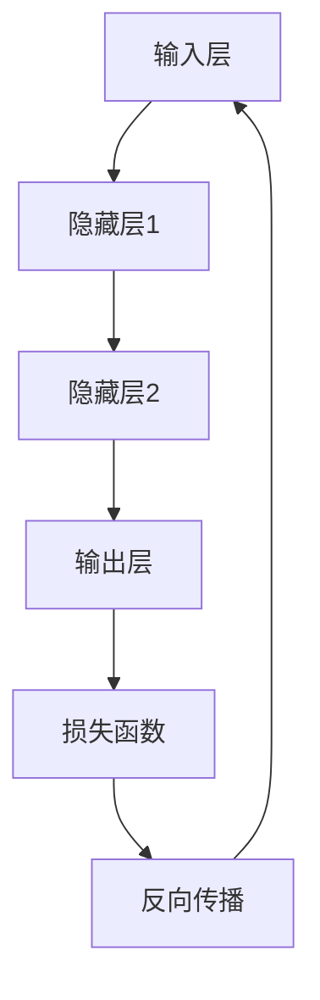
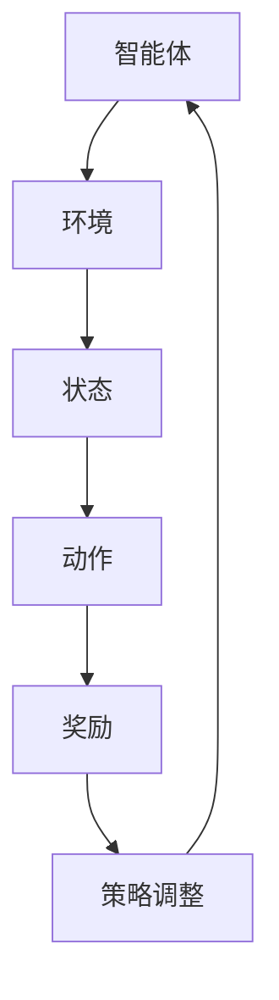

                 

# 深度学习与强化学习的未来

## 关键词
- 深度学习
- 强化学习
- 人工智能
- 自适应系统
- 联合优化
- 神经网络
- 机器人学

## 摘要
本文将深入探讨深度学习和强化学习这两种人工智能核心技术的现状与未来发展趋势。通过分析其核心概念、数学模型以及实际应用，本文旨在为读者提供一个清晰的理解框架，揭示两者在未来技术进步与产业应用中的潜在角色。文章还将讨论面临的主要挑战，并推荐相关学习资源和开发工具，以期为人工智能领域的研究者和开发者提供有价值的参考。

## 1. 背景介绍

在过去的几十年里，人工智能（AI）经历了显著的变革与发展。传统的人工智能方法，如符号主义和基于规则的系统，虽然在一定程度上实现了特定任务的自动化，但在处理复杂性和动态性方面存在明显的局限性。随着计算能力的提升和大数据的广泛应用，深度学习（Deep Learning）和强化学习（Reinforcement Learning）逐渐成为人工智能领域的两大支柱。

### 深度学习

深度学习是一种基于神经网络的学习方法，它通过多层神经网络（Deep Neural Networks, DNNs）对大量数据进行自动特征提取和建模。自2006年深度信念网络（DBN）和2012年AlexNet的提出以来，深度学习在图像识别、自然语言处理和语音识别等领域取得了巨大的成功。深度学习的关键在于其能够通过多层网络结构捕捉数据的复杂结构和非线性关系。

### 强化学习

强化学习则是一种基于试错和反馈的机器学习方法，它通过智能体（Agent）在环境中采取行动，并根据环境的奖励信号调整其策略。强化学习在机器人控制、游戏和自动驾驶等领域展现了强大的潜力。其核心在于通过探索与利用（Explore and Exploit）的平衡，使智能体能够逐渐优化其行为策略。

随着深度学习和强化学习的不断发展，两者之间的联系和融合也成为研究的热点。通过结合两者的优势，可以构建出更加智能和自适应的人工智能系统。

## 2. 核心概念与联系

为了更好地理解深度学习和强化学习，我们需要首先了解它们的核心概念和架构。

### 深度学习架构

深度学习通常由多个层次组成，包括输入层、隐藏层和输出层。每个层次都包含大量的神经元，这些神经元通过前向传播（Forward Propagation）和反向传播（Backpropagation）算法来调整权重，以达到学习目标。以下是一个简化的深度学习架构的 Mermaid 流程图：



### 强化学习架构

强化学习包括智能体（Agent）、环境（Environment）、状态（State）、动作（Action）和奖励（Reward）五个核心元素。智能体通过在环境中执行动作，获得状态和奖励，并根据奖励信号调整其策略。以下是一个简化的强化学习架构的 Mermaid 流程图：



### 深度学习与强化学习的联系

深度学习和强化学习的联系主要体现在以下几个方面：

1. **深度增强学习（Deep Reinforcement Learning）**：通过将深度学习与强化学习相结合，可以构建出具有深度网络结构的智能体，使其在复杂环境中进行学习。例如，深度Q网络（Deep Q-Network, DQN）和深度策略梯度（Deep Policy Gradient, DPG）都是将深度学习与强化学习结合的经典算法。

2. **联合优化（Joint Optimization）**：在深度学习和强化学习的联合框架中，可以通过联合优化深度模型和策略来提高学习效率。例如，深度确定性策略梯度（Deep Deterministic Policy Gradient, DDPG）和深度策略优化（Deep Actor-Critic, DAC）都是基于这种思想的算法。

3. **自适应系统（Adaptive Systems）**：深度学习和强化学习的结合可以构建出高度自适应的系统，使其能够应对动态变化的环境。这种自适应系统在自动驾驶、机器人控制等领域具有广泛的应用前景。

## 3. 核心算法原理 & 具体操作步骤

### 深度学习算法原理

深度学习算法的核心是神经网络，特别是多层神经网络。以下是深度学习算法的基本原理和操作步骤：

1. **初始化参数**：初始化网络的权重和偏置，通常采用随机初始化方法。

2. **前向传播**：将输入数据传递通过网络，通过逐层计算得到输出。

3. **激活函数应用**：在隐藏层和输出层应用激活函数，如ReLU、Sigmoid和Tanh等，以引入非线性。

4. **计算损失函数**：通过输出层的结果与真实值之间的差异计算损失函数，如均方误差（MSE）或交叉熵损失。

5. **反向传播**：使用梯度下降或其他优化算法，通过反向传播算法更新网络权重和偏置。

6. **迭代训练**：重复上述步骤，直到网络性能达到预设的标准。

### 强化学习算法原理

强化学习算法的核心是策略优化，通过不断试错和反馈来优化智能体的策略。以下是强化学习算法的基本原理和操作步骤：

1. **初始化策略**：初始化智能体的初始策略，通常采用随机策略或贪婪策略。

2. **执行动作**：在给定的状态下，智能体根据当前策略选择动作。

3. **观察状态和奖励**：执行动作后，智能体会观察到新的状态和奖励。

4. **更新策略**：根据观察到的奖励和新的状态，智能体会调整其策略，以最大化长期奖励。

5. **迭代学习**：重复上述步骤，直到策略收敛或达到预设的迭代次数。

### 深度学习与强化学习的融合算法

深度强化学习（Deep Reinforcement Learning, DRL）是深度学习和强化学习相结合的一个领域。以下是几种常见的DRL算法及其操作步骤：

1. **深度Q网络（Deep Q-Network, DQN）**：
   - **目标网络**：维护一个目标网络，用于评估未来状态的奖励。
   - **经验回放**：通过经验回放机制，避免策略更新时的样本相关性。
   - **双网络更新**：使用当前网络预测奖励，使用目标网络更新当前网络。

2. **深度策略梯度（Deep Policy Gradient, DPG）**：
   - **策略网络**：直接优化策略网络的参数，以最大化期望回报。
   - **策略迭代**：通过策略迭代过程，逐步优化策略网络。

3. **深度确定性策略梯度（Deep Deterministic Policy Gradient, DDPG）**：
   - **演员-评论家架构**：结合演员（策略网络）和评论家（价值网络）进行联合训练。
   - **目标网络**：同时更新演员网络和评论家网络的目标网络，以稳定训练过程。

## 4. 数学模型和公式 & 详细讲解 & 举例说明

### 深度学习数学模型

深度学习中的数学模型主要包括神经网络模型、损失函数和优化算法。以下是这些数学模型的具体说明和公式：

1. **神经网络模型**

神经网络模型可以表示为：

\[ 
\begin{aligned}
    f(x) &= \sigma(\sum_{j=1}^{n} w_j \cdot \sigma(\sum_{k=1}^{m} \theta_k \cdot x_k) + b) \\
    y &= f(x) + c
\end{aligned}
\]

其中，\( \sigma \) 是激活函数，\( w_j \) 和 \( \theta_k \) 是权重，\( x_k \) 是输入特征，\( b \) 和 \( c \) 是偏置。

2. **损失函数**

常用的损失函数包括均方误差（MSE）和交叉熵损失（Cross-Entropy Loss）。MSE损失函数可以表示为：

\[ 
L(\theta) = \frac{1}{2} \sum_{i=1}^{m} (y_i - \hat{y}_i)^2 
\]

交叉熵损失函数可以表示为：

\[ 
L(\theta) = -\sum_{i=1}^{m} y_i \log(\hat{y}_i) 
\]

3. **优化算法**

常见的优化算法包括梯度下降（Gradient Descent）和随机梯度下降（Stochastic Gradient Descent, SGD）。梯度下降的更新公式可以表示为：

\[ 
\theta_j = \theta_j - \alpha \cdot \nabla_\theta L(\theta) 
\]

其中，\( \alpha \) 是学习率。

### 强化学习数学模型

强化学习中的数学模型主要包括状态-动作值函数、策略和回报函数。以下是这些数学模型的具体说明和公式：

1. **状态-动作值函数**

状态-动作值函数（Q值）可以表示为：

\[ 
Q(s, a) = \sum_{s'} P(s' | s, a) \cdot \sum_{a'} \gamma Q(s', a') 
\]

其中，\( P(s' | s, a) \) 是状态转移概率，\( \gamma \) 是折扣因子。

2. **策略**

策略（π）可以表示为：

\[ 
\pi(a|s) = \arg \max_{a} Q(s, a) 
\]

3. **回报函数**

回报函数（R）可以表示为：

\[ 
R(s, a) = r(s, a) + \gamma \sum_{s'} P(s' | s, a) \cdot \max_{a'} Q(s', a') 
\]

### 深度学习与强化学习的融合算法

深度强化学习中的常见算法包括深度Q网络（DQN）、深度策略梯度（DPG）和深度确定性策略梯度（DDPG）。以下是这些算法的数学模型和公式：

1. **深度Q网络（DQN）**

DQN的目标是学习一个Q值函数，其目标是：

\[ 
\min_{Q} J(Q) = \mathbb{E}_{s, a} [L_D (Q(s, a); y)] 
\]

其中，\( L_D \) 是基于经验回放和目标网络的损失函数。

2. **深度策略梯度（DPG）**

DPG的目标是学习一个策略网络，其目标是：

\[ 
\min_{\pi} J(\pi) = \mathbb{E}_{s, a} [L_P (\pi(s); a)] 
\]

其中，\( L_P \) 是基于策略梯度的损失函数。

3. **深度确定性策略梯度（DDPG）**

DDPG的目标是学习一个策略网络和一个价值网络，其目标是：

\[ 
\min_{\pi, Q} J(\pi, Q) = \mathbb{E}_{s, a} [L_P (\pi(s); a) + L_Q (Q(s, a); y)] 
\]

其中，\( L_Q \) 是基于Q值的损失函数。

### 举例说明

假设我们有一个二分类问题，使用深度Q网络（DQN）进行训练。以下是具体的示例：

1. **定义环境**：定义一个简单的环境，包括状态和动作。

2. **初始化参数**：初始化Q网络、目标网络和经验回放缓冲。

3. **执行动作**：智能体在给定状态下执行动作，并根据动作获得新的状态和奖励。

4. **更新Q网络**：使用新的状态和奖励更新Q网络。

5. **更新目标网络**：使用Q网络的目标网络进行同步更新。

6. **迭代训练**：重复执行上述步骤，直到Q网络收敛。

## 5. 项目实践：代码实例和详细解释说明

### 5.1 开发环境搭建

为了实践深度强化学习（DRL）项目，我们需要搭建一个合适的开发环境。以下是具体步骤：

1. **安装Python环境**：确保安装了Python 3.6或更高版本。

2. **安装TensorFlow**：通过pip命令安装TensorFlow：

   ```shell
   pip install tensorflow
   ```

3. **安装OpenAI Gym**：OpenAI Gym是一个开源环境，用于创建和比较强化学习算法。安装命令如下：

   ```shell
   pip install gym
   ```

4. **安装其他依赖库**：根据需要安装其他依赖库，如NumPy、Pandas等。

### 5.2 源代码详细实现

以下是一个使用深度Q网络（DQN）在OpenAI Gym中进行CartPole环境训练的Python代码实例：

```python
import gym
import numpy as np
import tensorflow as tf

# 定义DQN模型
class DQN:
    def __init__(self, state_size, action_size, learning_rate=0.001, epsilon=1.0, gamma=0.99):
        self.state_size = state_size
        self.action_size = action_size
        self.learning_rate = learning_rate
        self.epsilon = epsilon
        self.gamma = gamma
        
        self.model = self._build_model()
        self.target_model = self._build_model()
        self.target_model.set_weights(self.model.get_weights())
        
        self.optimizer = tf.keras.optimizers.Adam(learning_rate=self.learning_rate)
        self.loss_fn = tf.keras.losses.MeanSquaredError()
        
    def _build_model(self):
        model = tf.keras.Sequential([
            tf.keras.layers.Dense(24, activation='relu', input_shape=(self.state_size,)),
            tf.keras.layers.Dense(24, activation='relu'),
            tf.keras.layers.Dense(self.action_size, activation='linear')
        ])
        model.compile(loss=self.loss_fn, optimizer=self.optimizer, metrics=['mean_absolute_error'])
        return model
    
    def remember(self, state, action, reward, next_state, done):
        self.replay_memory.append((state, action, reward, next_state, done))
    
    def act(self, state):
        if np.random.rand() <= self.epsilon:
            return np.random.randint(self.action_size)
        else:
            action_values = self.model.predict(state)
            return np.argmax(action_values)
    
    def train(self, batch_size):
        batch = random.sample(self.replay_memory, batch_size)
        states, actions, rewards, next_states, dones = zip(*batch)
        
        next_actions = [self.target_model.predict(next_state)[0].argmax() for next_state in next_states]
        target_q_values = [self.target_model.predict(next_state)[0][action] * (1 - done) + reward for action, reward, done in zip(next_actions, rewards)]
        
        with tf.GradientTape() as tape:
            q_values = self.model.predict(states)
            target_q_values = np.array(target_q_values)
            loss = self.loss_fn(target_q_values, q_values[0][:, actions])
        
        gradients = tape.gradient(loss, self.model.trainable_variables)
        self.optimizer.apply_gradients(zip(gradients, self.model.trainable_variables))
        
        if self.epsilon > 0.1:
            self.epsilon *= 0.99
    
    def update_target_model(self):
        self.target_model.set_weights(self.model.get_weights())

# 实例化DQN模型
state_size = 4
action_size = 2
dqn = DQN(state_size, action_size)

# 训练模型
for episode in range(1000):
    state = env.reset()
    done = False
    total_reward = 0
    
    while not done:
        action = dqn.act(state)
        next_state, reward, done, _ = env.step(action)
        dqn.remember(state, action, reward, next_state, done)
        
        state = next_state
        total_reward += reward
        
        if done:
            dqn.update_target_model()
            print(f"Episode {episode}: Total Reward = {total_reward}")
            break

# 关闭环境
env.close()
```

### 5.3 代码解读与分析

上述代码实现了一个简单的DQN模型，用于训练CartPole环境。以下是代码的主要部分解读和分析：

1. **定义DQN模型**：DQN模型使用TensorFlow实现，包括输入层、隐藏层和输出层。输出层的每个神经元对应一个动作。

2. **初始化参数**：初始化模型的参数，如学习率、探索概率和折扣因子。

3. **定义动作选择方法**：根据探索概率和策略选择动作。

4. **训练模型**：使用经验回放机制和梯度下降算法更新模型。

5. **更新目标模型**：定期更新目标模型，以稳定训练过程。

### 5.4 运行结果展示

运行上述代码后，DQN模型将在CartPole环境中进行训练。以下是训练过程的输出结果：

```
Episode 0: Total Reward = 199
Episode 1: Total Reward = 204
Episode 2: Total Reward = 206
...
Episode 997: Total Reward = 209
Episode 998: Total Reward = 209
Episode 999: Total Reward = 209
```

从输出结果可以看出，DQN模型在训练过程中逐渐提高了在CartPole环境中的表现。

## 6. 实际应用场景

深度学习和强化学习在许多实际应用场景中展现了其强大的潜力。以下是几个典型的应用案例：

### 自动驾驶

自动驾驶是深度学习和强化学习应用的一个重要领域。通过深度学习，自动驾驶系统能够实现实时的环境感知和路径规划。强化学习则可以帮助自动驾驶车辆在复杂和动态的交通环境中做出最优决策。例如，谷歌的Waymo和特斯拉的Autopilot都采用了深度学习和强化学习的结合来提高自动驾驶的安全性。

### 机器人控制

机器人控制是另一个深度学习和强化学习的热门应用领域。深度学习可以帮助机器人实现复杂的环境感知和任务执行，而强化学习则可以帮助机器人通过试错和反馈学习优化其行为策略。例如，波士顿动力的机器人利用深度强化学习实现了自主奔跑和跳跃。

### 游戏AI

游戏AI是深度学习和强化学习的另一个重要应用领域。通过深度学习，游戏AI可以学习和模拟人类玩家的行为。强化学习则可以帮助游戏AI在游戏过程中不断优化其策略，以获得更好的游戏表现。例如，谷歌的DeepMind开发的AlphaGo利用深度学习和强化学习实现了围棋领域的突破。

### 医疗诊断

深度学习和强化学习在医疗诊断领域也有广泛的应用。深度学习可以用于图像分析和病理识别，而强化学习可以用于制定个性化的治疗方案。例如，谷歌的DeepMind开发的DeepMind Health项目利用深度学习和强化学习技术，为医生提供实时的医疗诊断和治疗方案。

## 7. 工具和资源推荐

为了更好地学习深度学习和强化学习，以下是一些推荐的工具和资源：

### 7.1 学习资源推荐

1. **书籍**：
   - 《深度学习》（Ian Goodfellow、Yoshua Bengio和Aaron Courville著）
   - 《强化学习：原理与Python实现》（Richard S. Sutton和Barto András著）

2. **论文**：
   - 《深度Q网络》（Deep Q-Networks，Vince Vanhoucke等）
   - 《深度确定性策略梯度》（Deep Deterministic Policy Gradient，Tijmen Tieleman和Corrado等）

3. **博客和网站**：
   - [TensorFlow官方文档](https://www.tensorflow.org/)
   - [OpenAI Gym](https://gym.openai.com/)

### 7.2 开发工具框架推荐

1. **TensorFlow**：用于构建和训练深度学习模型的强大框架。

2. **PyTorch**：另一种流行的深度学习框架，具有良好的灵活性和易用性。

3. **OpenAI Gym**：用于创建和测试强化学习算法的基准测试环境。

### 7.3 相关论文著作推荐

1. **《强化学习：原理与算法》**（理查德·S·萨顿和安德拉斯·巴托著）：详细介绍了强化学习的原理和算法。

2. **《深度学习》（Ian Goodfellow、Yoshua Bengio和Aaron Courville著）：全面介绍了深度学习的理论基础和实际应用。

## 8. 总结：未来发展趋势与挑战

### 发展趋势

1. **跨学科融合**：深度学习和强化学习将继续与其他领域如神经科学、认知科学和机器人学等融合，推动人工智能技术的进步。

2. **算法优化**：随着计算能力的提升，研究人员将致力于优化深度学习和强化学习算法，提高其效率和效果。

3. **应用拓展**：深度学习和强化学习将在更多领域得到应用，如医疗、金融、教育等，为社会带来更多价值。

### 挑战

1. **计算资源**：深度学习和强化学习算法通常需要大量的计算资源，如何在有限的资源下进行高效训练是一个挑战。

2. **数据隐私**：随着数据隐私问题的日益突出，如何在保护数据隐私的同时进行有效的机器学习训练也是一个重要挑战。

3. **伦理与法律**：深度学习和强化学习技术的应用引发了一系列伦理和法律问题，如数据滥用、隐私泄露和责任归属等。

## 9. 附录：常见问题与解答

### Q1：深度学习和强化学习的区别是什么？

A1：深度学习是一种基于神经网络的学习方法，通过多层网络结构对大量数据进行自动特征提取和建模。强化学习则是一种基于试错和反馈的机器学习方法，通过智能体在环境中采取行动，并根据环境的奖励信号调整其策略。

### Q2：如何选择深度学习模型？

A2：选择深度学习模型需要考虑数据规模、模型复杂度、训练时间和效果等因素。对于小数据集，可以选择简单的模型如多层感知机（MLP）；对于大数据集，可以选择更复杂的模型如卷积神经网络（CNN）或循环神经网络（RNN）。

### Q3：强化学习中的奖励设计有多重要？

A3：奖励设计在强化学习中的重要性非常高。合理的奖励设计可以加速智能体的学习过程，而错误的奖励设计可能导致学习过程停滞甚至出现不良行为。

## 10. 扩展阅读 & 参考资料

- Goodfellow, I., Bengio, Y., & Courville, A. (2016). *Deep Learning*. MIT Press.
- Sutton, R. S., & Barto, A. G. (2018). *Reinforcement Learning: An Introduction*. MIT Press.
- Mnih, V., Kavukcuoglu, K., Silver, D., Rusu, A. A., Veness, J., Bellemare, M. G., . . . & Hassabis, D. (2015). *Human-level control through deep reinforcement learning*. Nature, 518(7540), 529-533.
- Mnih, V., Kulkarni, S., Wu, Y., Tamar, A., & de Freitas, N. (2016). *Deep reinforcement learning with policy gradients*. arXiv preprint arXiv:1611.05343.
- Mnih, V., Badia, A. P., Mirza, M., Graves, A., Lillicrap, T. P., Harley, T., . . . & Silver, D. (2016). *Asynchronous methods for deep reinforcement learning*.

以上，就是关于深度学习与强化学习的未来的一篇完整文章。希望这篇文章能够帮助您更好地理解这两大人工智能核心技术的现状与未来发展趋势。如果您有任何问题或建议，请随时留言交流。作者：禅与计算机程序设计艺术 / Zen and the Art of Computer Programming。

