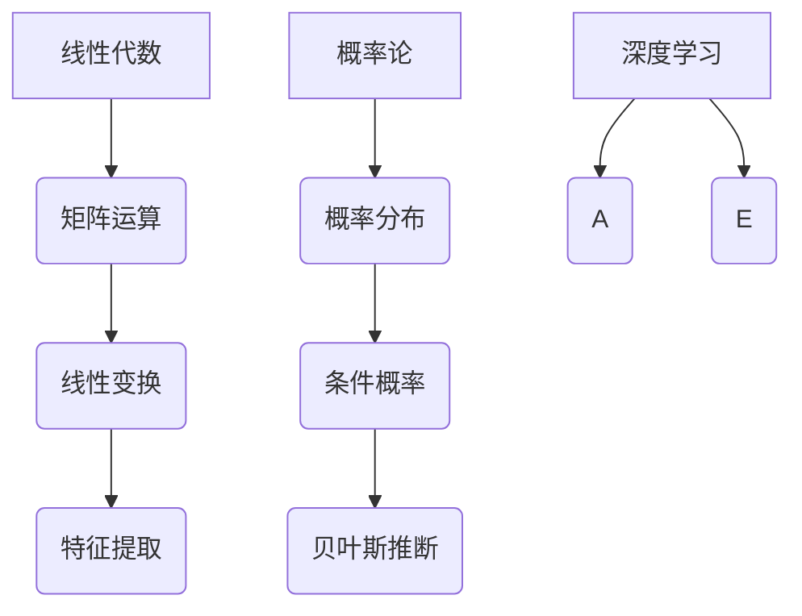

                 

深度学习作为人工智能领域的核心技术之一，已经在图像识别、自然语言处理、推荐系统等领域取得了显著的成果。然而，深度学习的理论基础离不开数学的支持，尤其是线性代数和概率论。本文将深入探讨深度学习中线性代数和概率论的核心概念、算法原理以及它们在实际应用中的重要性。

## 关键词
- 深度学习
- 数学基础
- 线性代数
- 概率论

## 摘要
本文将系统地介绍深度学习中不可或缺的数学基础，包括线性代数和概率论。我们将探讨线性代数在矩阵运算、线性变换以及特征提取中的应用，以及概率论在数据建模、推断和学习中的核心作用。通过本文的阅读，读者将更好地理解深度学习背后的数学原理，并能够在实际项目中更好地运用这些知识。

## 1. 背景介绍
深度学习的兴起，使得计算机在处理复杂数据任务时，取得了前所未有的成功。然而，深度学习的核心——神经网络，其理论基础依赖于大量的数学知识，特别是线性代数和概率论。

### 1.1 线性代数
线性代数是数学的一个重要分支，主要研究向量空间、线性变换、矩阵等概念。在线性代数中，矩阵是核心对象，通过矩阵运算可以实现数据的线性变换，这在深度学习中具有广泛应用。例如，在神经网络中，权重矩阵和输入数据的矩阵乘积可以实现对输入数据的特征提取和变换。

### 1.2 概率论
概率论是研究随机事件及其规律性的数学分支。在深度学习中，概率论主要用于建模不确定性，通过概率分布函数描述数据的分布特性。此外，概率论中的推断理论，如贝叶斯推断，在深度学习中的参数估计和模型选择中具有重要应用。

## 2. 核心概念与联系
为了更好地理解深度学习中的数学基础，我们首先需要了解线性代数和概率论的一些核心概念，并探讨它们之间的联系。

### 2.1 线性代数核心概念
- **向量与矩阵**：向量是具有方向的量，矩阵是二维数组，可以表示多个向量的组合。
- **线性变换**：线性变换是一种将输入向量映射到输出向量的操作，可以通过矩阵乘法实现。
- **特征值与特征向量**：特征值和特征向量描述了矩阵的内在结构，可以用于降维、特征提取等。

### 2.2 概率论核心概念
- **概率分布**：概率分布描述了随机变量的取值可能性，常见的有正态分布、伯努利分布等。
- **条件概率**：条件概率描述了在已知某个事件发生的条件下，另一个事件发生的概率。
- **贝叶斯推断**：贝叶斯推断是一种基于概率原理的推断方法，用于根据先验知识和观察数据更新对事件概率的估计。

### 2.3 线性代数与概率论的联系
线性代数和概率论在深度学习中有紧密的联系。例如，矩阵可以用来表示概率分布，概率分布的运算可以通过矩阵运算来实现。此外，线性代数中的线性变换可以用于实现概率分布的变换和推断。

### 2.4 Mermaid 流程图

## 3. 核心算法原理 & 具体操作步骤

### 3.1 算法原理概述
深度学习中的核心算法，如神经网络、卷积神经网络（CNN）、循环神经网络（RNN）等，都基于线性代数和概率论的基本原理。

#### 3.1.1 神经网络
神经网络是由多个神经元组成的层次结构，每个神经元都是一个简单的计算单元。神经网络的工作原理可以看作是一种特殊的矩阵运算，即输入数据的矩阵乘以权重矩阵，再加上偏置，然后通过激活函数转换。

#### 3.1.2 卷积神经网络
卷积神经网络是一种特殊的神经网络，用于处理图像数据。它通过卷积运算提取图像的局部特征，并通过池化操作降低数据维度。卷积运算本质上是矩阵乘法，而池化操作则是对矩阵进行下采样。

#### 3.1.3 循环神经网络
循环神经网络用于处理序列数据，如时间序列、文本等。它通过循环结构实现长期依赖关系的建模，通过递归函数实现序列的迭代处理。

### 3.2 算法步骤详解

#### 3.2.1 神经网络
1. **初始化参数**：包括输入层、隐藏层和输出层的权重矩阵和偏置。
2. **前向传播**：输入数据通过权重矩阵和偏置传递到隐藏层，通过激活函数处理后传递到输出层。
3. **计算损失**：输出层的输出与真实标签之间的差异计算损失。
4. **反向传播**：根据损失函数计算权重矩阵和偏置的梯度，并通过梯度下降法更新参数。
5. **迭代训练**：重复步骤2-4，直到满足训练目标。

#### 3.2.2 卷积神经网络
1. **卷积层**：输入图像通过卷积核进行卷积运算，提取局部特征。
2. **池化层**：对卷积后的特征进行下采样，减少数据维度。
3. **全连接层**：将池化后的特征通过全连接层进行分类。
4. **输出层**：输出分类结果。

#### 3.2.3 循环神经网络
1. **初始化状态**：初始化循环神经网络的隐藏状态。
2. **递归处理**：对于序列中的每个元素，通过递归函数计算隐藏状态。
3. **输出层**：将隐藏状态传递到输出层，生成序列输出。

### 3.3 算法优缺点

#### 3.3.1 神经网络
**优点**：能够自动学习数据的复杂特征，具有很强的自适应能力。
**缺点**：需要大量数据和计算资源，且训练过程容易出现过拟合。

#### 3.3.2 卷积神经网络
**优点**：能够在图像数据中提取丰富的局部特征，适用于图像识别、目标检测等任务。
**缺点**：对于序列数据和非结构化数据的效果较差。

#### 3.3.3 循环神经网络
**优点**：能够处理序列数据，适用于自然语言处理、语音识别等任务。
**缺点**：对于长序列数据的处理能力有限，容易出现梯度消失或梯度爆炸问题。

### 3.4 算法应用领域

#### 3.4.1 神经网络
神经网络在图像识别、自然语言处理、推荐系统等领域有广泛应用，如深度卷积神经网络（DCNN）在图像分类中取得了很好的效果，循环神经网络（RNN）在语言模型中发挥了重要作用。

#### 3.4.2 卷积神经网络
卷积神经网络在计算机视觉领域有广泛应用，如卷积神经网络（CNN）在图像分类、目标检测、人脸识别等领域取得了显著成果。

#### 3.4.3 循环神经网络
循环神经网络在自然语言处理领域有广泛应用，如循环神经网络（RNN）在语言模型、机器翻译、文本生成等方面取得了很好的效果。

## 4. 数学模型和公式 & 详细讲解 & 举例说明

### 4.1 数学模型构建
在深度学习中，数学模型是核心组成部分。以下是一些常见的数学模型及其构建方法。

#### 4.1.1 神经网络模型
神经网络模型可以表示为：

$$
\hat{y} = \sigma(W \cdot x + b)
$$

其中，$\hat{y}$是预测输出，$x$是输入数据，$W$是权重矩阵，$b$是偏置，$\sigma$是激活函数。

#### 4.1.2 卷积神经网络模型
卷积神经网络模型可以表示为：

$$
\hat{C}_{ij} = f(\sum_{k=1}^{n} W_{ik}C_{kj} + b_i)
$$

其中，$\hat{C}_{ij}$是输出的特征图，$C_{kj}$是输入的特征图，$W_{ik}$是卷积核，$f$是激活函数，$b_i$是偏置。

#### 4.1.3 循环神经网络模型
循环神经网络模型可以表示为：

$$
h_t = \sigma(W_h \cdot [h_{t-1}, x_t] + b_h)
$$

其中，$h_t$是隐藏状态，$x_t$是输入数据，$W_h$是权重矩阵，$b_h$是偏置，$\sigma$是激活函数。

### 4.2 公式推导过程
以下是对神经网络模型中的一些关键公式的推导过程。

#### 4.2.1 前向传播
假设有一个单层神经网络，输入为$x$，输出为$y$，权重矩阵为$W$，偏置为$b$，激活函数为$\sigma$。则前向传播过程可以表示为：

$$
y = \sigma(W \cdot x + b)
$$

其中，$W \cdot x$表示矩阵乘法，$+b$表示在矩阵的每一行上添加偏置$b$。

#### 4.2.2 损失函数
常用的损失函数有均方误差（MSE）和交叉熵（CE）。均方误差可以表示为：

$$
L = \frac{1}{2} \sum_{i=1}^{n} (\hat{y}_i - y_i)^2
$$

其中，$\hat{y}_i$是预测输出，$y_i$是真实标签。

交叉熵可以表示为：

$$
L = -\sum_{i=1}^{n} y_i \cdot \log(\hat{y}_i)
$$

其中，$y_i$是真实标签的分布，$\hat{y}_i$是预测输出的分布。

#### 4.2.3 反向传播
反向传播是神经网络训练的核心步骤，用于更新权重矩阵和偏置。以下是均方误差损失函数的反向传播过程。

首先，计算输出层梯度：

$$
\frac{\partial L}{\partial W} = (x \odot (\hat{y} - y))
$$

$$
\frac{\partial L}{\partial b} = (\hat{y} - y)
$$

其中，$\odot$表示元素乘法。

然后，计算隐藏层梯度：

$$
\frac{\partial L}{\partial z} = \sigma'(z) \cdot \frac{\partial L}{\partial a}
$$

$$
\frac{\partial L}{\partial x} = W \cdot \frac{\partial L}{\partial z}
$$

其中，$\sigma'$是激活函数的导数。

最后，使用梯度下降法更新权重矩阵和偏置：

$$
W = W - \alpha \cdot \frac{\partial L}{\partial W}
$$

$$
b = b - \alpha \cdot \frac{\partial L}{\partial b}
$$

其中，$\alpha$是学习率。

### 4.3 案例分析与讲解

#### 4.3.1 图像分类
假设我们有一个图像分类任务，需要将图像分为10个类别。输入图像大小为$32 \times 32$，每个像素点的取值范围为$0$到$255$。

1. **数据预处理**：对图像进行归一化处理，将像素点的取值范围缩放到$0$到$1$。
2. **构建神经网络**：构建一个三层神经网络，包括输入层、隐藏层和输出层。输入层有$32 \times 32 = 1024$个神经元，隐藏层有256个神经元，输出层有10个神经元。
3. **训练神经网络**：使用训练数据集训练神经网络，通过反向传播算法更新权重矩阵和偏置。训练过程中，使用均方误差（MSE）作为损失函数，并采用梯度下降法进行优化。
4. **测试神经网络**：使用测试数据集测试神经网络的分类性能，计算准确率。

#### 4.3.2 自然语言处理
假设我们有一个自然语言处理任务，需要根据输入的文本生成对应的标签。输入文本为一句句子，每个句子由若干个词组成。

1. **数据预处理**：对文本进行分词处理，将句子划分为若干个词。然后，将每个词转换为对应的索引。
2. **构建循环神经网络**：构建一个循环神经网络，输入层有词表大小的神经元，隐藏层有256个神经元，输出层有标签集合大小的神经元。
3. **训练循环神经网络**：使用训练数据集训练循环神经网络，通过反向传播算法更新权重矩阵和偏置。训练过程中，使用交叉熵（CE）作为损失函数，并采用梯度下降法进行优化。
4. **测试循环神经网络**：使用测试数据集测试循环神经网络的分类性能，计算准确率。

## 5. 项目实践：代码实例和详细解释说明

### 5.1 开发环境搭建
1. **安装Python**：在开发环境中安装Python，推荐使用Python 3.7及以上版本。
2. **安装深度学习框架**：安装TensorFlow或PyTorch等深度学习框架。以TensorFlow为例，可以使用以下命令安装：

   ```
   pip install tensorflow
   ```

### 5.2 源代码详细实现
以下是一个简单的神经网络实现，用于图像分类任务。

```python
import tensorflow as tf

# 构建模型
model = tf.keras.Sequential([
    tf.keras.layers.Flatten(input_shape=(32, 32, 3)),
    tf.keras.layers.Dense(256, activation='relu'),
    tf.keras.layers.Dense(10, activation='softmax')
])

# 编译模型
model.compile(optimizer='adam',
              loss='categorical_crossentropy',
              metrics=['accuracy'])

# 训练模型
model.fit(x_train, y_train, epochs=10, batch_size=32)

# 测试模型
test_loss, test_acc = model.evaluate(x_test, y_test)
print(f"Test accuracy: {test_acc}")
```

### 5.3 代码解读与分析
1. **模型构建**：使用`tf.keras.Sequential`模型构建一个简单的神经网络。输入层使用`Flatten`层将图像展平为1维向量，隐藏层使用`Dense`层实现全连接，输出层使用`softmax`层实现类别预测。
2. **模型编译**：使用`compile`方法编译模型，指定优化器、损失函数和评价指标。
3. **模型训练**：使用`fit`方法训练模型，指定训练数据、训练轮数和批量大小。
4. **模型测试**：使用`evaluate`方法测试模型在测试数据集上的性能。

## 6. 实际应用场景

### 6.1 图像识别
深度学习在图像识别领域有广泛应用，如人脸识别、物体检测、图像分类等。卷积神经网络（CNN）是图像识别任务中的核心算法，通过卷积操作提取图像特征，实现高精度的图像分类。

### 6.2 自然语言处理
自然语言处理（NLP）是深度学习的另一个重要应用领域，如文本分类、机器翻译、情感分析等。循环神经网络（RNN）和Transformer模型在NLP任务中发挥了重要作用，通过序列建模实现高精度的文本分析。

### 6.3 推荐系统
推荐系统是深度学习的另一个重要应用领域，如商品推荐、电影推荐、社交网络推荐等。基于深度学习的方法，可以构建个性化的推荐系统，提高用户的满意度。

## 7. 工具和资源推荐

### 7.1 学习资源推荐
- 《深度学习》（Goodfellow, Bengio, Courville著）：全面介绍深度学习的基本概念、算法和应用。
- 《神经网络与深度学习》（邱锡鹏著）：系统地介绍神经网络和深度学习的理论和实践。

### 7.2 开发工具推荐
- TensorFlow：开源的深度学习框架，适用于各种深度学习任务。
- PyTorch：开源的深度学习框架，具有灵活的动态计算图，适用于研究和个人项目。

### 7.3 相关论文推荐
- "A Theoretical Framework for Back-Propagation"（Rumelhart, Hinton, Williams著）：介绍了反向传播算法的原理和实现。
- "Convolutional Neural Networks for Visual Recognition"（Krizhevsky, Sutskever, Hinton著）：介绍了卷积神经网络在图像识别中的应用。
- "Sequence to Sequence Learning with Neural Networks"（Sutskever, Vinyals, Le著）：介绍了循环神经网络在序列建模中的应用。

## 8. 总结：未来发展趋势与挑战

### 8.1 研究成果总结
深度学习在图像识别、自然语言处理、推荐系统等领域取得了显著的成果，推动了人工智能技术的发展。

### 8.2 未来发展趋势
随着计算能力的提升和算法的优化，深度学习将继续在各个领域取得突破。例如，自监督学习、少样本学习、生成对抗网络（GAN）等新方法将推动深度学习的发展。

### 8.3 面临的挑战
深度学习面临的主要挑战包括模型的解释性、可解释性和可扩展性。如何提高模型的透明度和可解释性，如何处理大规模数据和高维数据，以及如何提高模型的泛化能力，是深度学习需要解决的问题。

### 8.4 研究展望
未来，深度学习将与其他人工智能技术相结合，推动人工智能技术的发展。例如，将深度学习与知识图谱、增强学习等技术相结合，实现更智能的人工智能系统。

## 9. 附录：常见问题与解答

### 9.1 深度学习的基本原理是什么？
深度学习是一种基于多层神经网络的学习方法，通过多层非线性变换提取数据的高层次特征，实现复杂函数的逼近。深度学习的基本原理包括前向传播、反向传播、损失函数、优化算法等。

### 9.2 如何优化深度学习模型？
优化深度学习模型主要包括调整模型结构、调整超参数、使用正则化技术、使用批归一化等技术。常见的优化算法包括梯度下降法、Adam优化器等。

### 9.3 深度学习有哪些应用领域？
深度学习在图像识别、自然语言处理、推荐系统、语音识别、医学诊断、自动驾驶等领域有广泛应用。

### 9.4 如何入门深度学习？
入门深度学习可以从学习Python编程语言开始，然后学习线性代数、微积分等基础数学知识，最后学习深度学习框架和相关算法。

---

本文系统地介绍了深度学习中的数学基础——线性代数和概率论。通过本文的阅读，读者将更好地理解深度学习背后的数学原理，并能够在实际项目中更好地运用这些知识。随着深度学习技术的不断发展和应用，线性代数和概率论的重要性将日益凸显，为人工智能的发展提供强大的数学支持。

