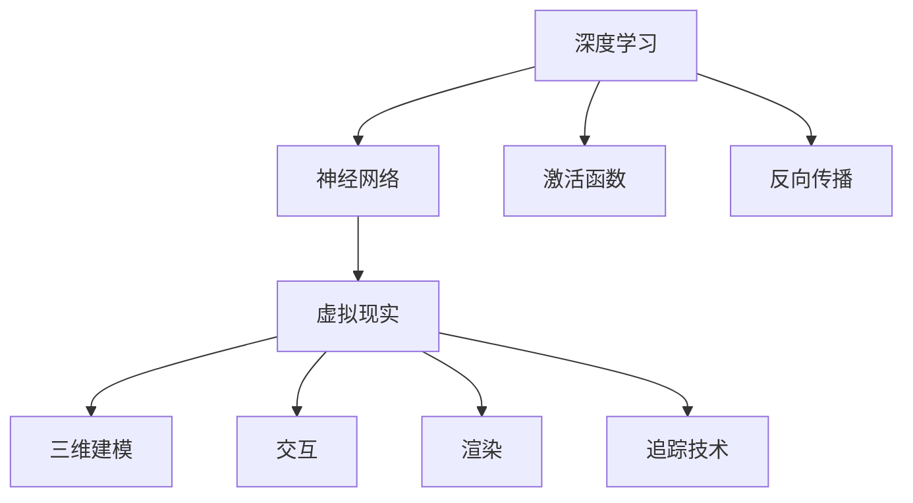

                 

### 1. 背景介绍

随着虚拟现实（VR）技术的迅速发展，深度学习在VR中的应用逐渐成为了一个热门的研究方向。深度学习，作为一种基于人工神经网络的机器学习方法，通过多层的神经网络结构对大量数据进行自动特征提取和学习，已经取得了在图像识别、自然语言处理、语音识别等领域的显著成果。

虚拟现实技术则通过利用计算机生成一个三维的虚拟环境，让用户在其中能够通过视觉、听觉等感官体验到沉浸式的互动。这种技术与深度学习相结合，可以极大地提升虚拟现实的交互体验和智能程度。

目前，深度学习在VR中的应用主要集中在以下几个领域：

1. **图像识别和场景理解**：通过深度学习模型对虚拟环境中的图像进行识别和分析，实现场景的自动分割、物体识别等。

2. **自然语言处理**：结合深度学习模型和自然语言处理技术，实现虚拟现实中的语音识别、对话系统等功能。

3. **运动追踪和手势识别**：通过深度学习算法，对用户在虚拟环境中的动作进行追踪和识别，提高交互的精准度和流畅性。

4. **自适应内容生成**：利用深度学习模型对用户行为和偏好进行分析，实现个性化内容的自适应生成。

这一篇博客文章将深入探讨深度学习在虚拟现实中的应用，从核心概念、算法原理、数学模型到项目实践，全面解析这一领域的前沿技术。通过本文的阅读，读者将能够对深度学习在虚拟现实中的技术原理和应用场景有一个全面、深入的了解。

### 2. 核心概念与联系

#### 2.1 深度学习的核心概念

深度学习是一种人工智能的分支，其核心在于构建多层神经网络模型，通过逐层提取数据中的特征来实现复杂任务的学习和预测。以下是深度学习中的几个核心概念：

- **神经网络（Neural Network）**：模拟生物神经系统的计算模型，由一系列相互连接的神经元组成。
- **层（Layer）**：神经网络中的基本构建单元，通常分为输入层、隐藏层和输出层。
- **激活函数（Activation Function）**：用于引入非线性特性，使神经网络能够处理复杂问题。
- **反向传播（Backpropagation）**：一种用于训练神经网络的算法，通过计算输出误差并反向传播到各层，更新各层的权重。

#### 2.2 虚拟现实的核心概念

虚拟现实技术通过计算机技术模拟出一个三维的虚拟环境，让用户能够沉浸在其中的互动体验。以下是虚拟现实中的几个核心概念：

- **三维建模（3D Modeling）**：通过软件工具创建虚拟环境中的三维模型。
- **交互（Interaction）**：用户与虚拟环境之间的交互方式，包括视觉、听觉、触觉等多感官交互。
- **渲染（Rendering）**：将三维模型转换为二维图像的过程，包括光照、阴影、材质等效果。
- **追踪技术（Tracking）**：用于实时监测用户位置和动作的技术，包括视觉追踪、惯性测量等。

#### 2.3 深度学习与虚拟现实之间的联系

深度学习与虚拟现实技术之间的结合主要体现在以下几个方面：

- **增强现实（AR）与虚拟现实（VR）中的图像识别**：利用深度学习模型对虚拟环境中的图像进行实时识别和分析，可以实现对场景的理解和交互。
- **自然语言处理与交互**：结合深度学习模型和自然语言处理技术，可以实现更加自然和智能的语音识别和对话系统，提升虚拟现实中的交互体验。
- **运动追踪与手势识别**：通过深度学习算法对用户的动作进行追踪和识别，可以实现对虚拟环境的精准交互。
- **自适应内容生成**：利用深度学习模型对用户行为和偏好进行分析，可以生成个性化的虚拟内容和体验。

#### 2.4 Mermaid 流程图

以下是一个简单的 Mermaid 流程图，展示深度学习与虚拟现实技术之间的核心联系：



通过这一流程图，我们可以清晰地看到深度学习与虚拟现实技术之间的相互作用和整合，从而推动虚拟现实技术的发展和应用。

### 3. 核心算法原理 & 具体操作步骤

#### 3.1 深度学习算法的基本原理

深度学习算法的核心是神经网络，而神经网络的基本工作原理是通过多层神经元进行数据的处理和特征提取。以下将详细介绍深度学习算法的基本原理。

##### 3.1.1 神经网络的基本结构

神经网络由输入层、隐藏层和输出层组成。每个层由若干个神经元（或节点）组成，神经元之间通过连接（或边）相互连接。每个连接都有一定的权重，这些权重在训练过程中通过反向传播算法进行调整。

- **输入层（Input Layer）**：接收外部输入数据，通常是一系列的数值。
- **隐藏层（Hidden Layer）**：对输入数据进行处理和特征提取，可以有一个或多个隐藏层。
- **输出层（Output Layer）**：产生最终的输出结果。

##### 3.1.2 前向传播与反向传播

深度学习算法通过前向传播和反向传播两个过程进行训练。

- **前向传播（Forward Propagation）**：输入数据从输入层开始，通过各层的神经元传递，最终在输出层产生预测结果。每一层的输出通过激活函数进行非线性变换，以引入非线性特性。
- **反向传播（Backpropagation）**：根据预测结果与实际结果的差异，通过反向传播算法更新各层的权重。这个过程包括以下几个步骤：
  - 计算输出层的误差。
  - 将误差反向传播到隐藏层，逐层计算每层神经元的误差。
  - 根据误差更新各层的权重。

##### 3.1.3 激活函数与优化算法

激活函数用于引入非线性特性，常用的激活函数包括sigmoid、ReLU、Tanh等。优化算法用于调整权重，以最小化预测误差。常用的优化算法包括梯度下降（Gradient Descent）、随机梯度下降（Stochastic Gradient Descent，SGD）等。

#### 3.2 虚拟现实中的具体操作步骤

在虚拟现实技术中，深度学习算法的应用通常包括以下几个步骤：

##### 3.2.1 数据预处理

- **数据收集**：收集虚拟环境中的图像、语音、动作等数据。
- **数据清洗**：去除无效或错误的数据，确保数据的质量。
- **数据增强**：通过旋转、缩放、裁剪等操作增加数据的多样性。

##### 3.2.2 模型训练

- **定义模型**：根据任务需求定义神经网络模型的结构。
- **参数初始化**：初始化模型的权重和偏置。
- **前向传播**：将输入数据通过模型进行前向传播，得到预测结果。
- **计算误差**：计算预测结果与实际结果的差异，得到误差。
- **反向传播**：通过反向传播算法更新模型的权重和偏置。

##### 3.2.3 模型评估

- **验证集评估**：使用验证集评估模型的性能，以避免过拟合。
- **测试集评估**：在测试集上评估模型的泛化能力。

##### 3.2.4 模型部署

- **模型优化**：根据评估结果对模型进行优化，以提高性能。
- **模型部署**：将训练好的模型部署到虚拟现实系统中，实现实时交互。

#### 3.3 实例说明

以虚拟现实中的图像识别为例，具体操作步骤如下：

1. **数据收集**：收集虚拟环境中的图像数据，例如虚拟场景中的建筑物、人物等。
2. **数据预处理**：对图像数据进行清洗和增强，提高数据的质量和多样性。
3. **模型训练**：定义一个卷积神经网络（CNN）模型，对图像数据进行训练，提取图像的特征。
4. **模型评估**：使用验证集评估模型的性能，调整模型参数，避免过拟合。
5. **模型部署**：将训练好的模型部署到虚拟现实系统中，实现对虚拟场景中图像的实时识别和分类。

通过上述步骤，我们可以利用深度学习算法在虚拟现实技术中实现图像识别功能，提升虚拟现实的智能交互能力。

### 4. 数学模型和公式 & 详细讲解 & 举例说明

#### 4.1 前向传播中的数学公式

在深度学习的前向传播过程中，涉及到一系列的数学运算，包括线性变换、激活函数、损失函数等。以下将详细讲解这些公式，并结合具体例子进行说明。

##### 4.1.1 线性变换

假设有一个包含 \( n \) 个输入特征的输入向量 \( x \)，通过一个权重矩阵 \( W \) 和偏置向量 \( b \) 进行线性变换，得到输出向量 \( z \)：

\[ z = Wx + b \]

其中，\( W \) 是一个 \( m \times n \) 的矩阵，\( b \) 是一个 \( m \) 维的向量，\( z \) 是一个 \( m \) 维的向量。

##### 4.1.2 激活函数

激活函数用于引入非线性特性，常用的激活函数包括 sigmoid、ReLU 和 Tanh。以 ReLU 激活函数为例，其公式如下：

\[ a = \max(0, z) \]

其中，\( z \) 是输入值，\( a \) 是激活输出值。ReLU 函数在 \( z \) 小于 0 时输出为 0，在 \( z \) 大于等于 0 时输出为 \( z \)。

##### 4.1.3 损失函数

损失函数用于衡量预测结果与实际结果之间的差异，常用的损失函数包括均方误差（MSE）和交叉熵损失（Cross-Entropy Loss）。以交叉熵损失为例，其公式如下：

\[ L = -\frac{1}{N} \sum_{i=1}^{N} y_i \log(a_i) \]

其中，\( y_i \) 是实际标签，\( a_i \) 是预测值，\( N \) 是样本数量。

#### 4.2 反向传播中的数学公式

在反向传播过程中，需要计算各层权重的梯度，以更新权重和偏置。以下将详细讲解这些公式。

##### 4.2.1 梯度计算

以最后一层为例，计算输出层的梯度 \( \delta_{L} \)。对于交叉熵损失函数，梯度计算如下：

\[ \delta_{L} = a_{L} - y \]

其中，\( a_{L} \) 是输出层的激活值，\( y \) 是实际标签。

##### 4.2.2 权重和偏置更新

根据梯度计算，更新各层的权重和偏置。以输出层为例，权重和偏置更新公式如下：

\[ \Delta W_{L} = \alpha \cdot z_{L-1}^{T} \cdot \delta_{L} \]
\[ \Delta b_{L} = \alpha \cdot \delta_{L} \]

其中，\( \alpha \) 是学习率，\( z_{L-1} \) 是上一层输出，\( \delta_{L} \) 是当前层的梯度。

##### 4.2.3 反向传播

从输出层开始，逐层计算各层的梯度，并更新权重和偏置。以隐藏层为例，梯度计算如下：

\[ \delta_{l} = (W_{l+1}^{T} \cdot \delta_{l+1}) \cdot \sigma'(z_{l}) \]

其中，\( \sigma' \) 是激活函数的导数，\( W_{l+1} \) 是下一层的权重。

#### 4.3 实例说明

假设有一个简单的神经网络，包含输入层、一个隐藏层和输出层。输入层有 2 个输入特征，隐藏层有 3 个神经元，输出层有 1 个输出特征。训练数据包含 100 个样本，每个样本的标签为 0 或 1。

1. **定义模型**：

\[ z_{1} = W_{1}x + b_{1} \]
\[ a_{1} = \max(0, z_{1}) \]
\[ z_{2} = W_{2}a_{1} + b_{2} \]
\[ a_{2} = \max(0, z_{2}) \]
\[ z_{3} = W_{3}a_{2} + b_{3} \]
\[ a_{3} = \max(0, z_{3}) \]

2. **前向传播**：

给定输入 \( x = [1, 2] \)，计算各层的输出：

\[ z_{1} = W_{1}x + b_{1} = \begin{bmatrix} 1 & 0 \\ 0 & 1 \\ 1 & 1 \end{bmatrix} \begin{bmatrix} 1 \\ 2 \end{bmatrix} + \begin{bmatrix} 0 \\ 0 \\ 1 \end{bmatrix} = \begin{bmatrix} 3 \\ 2 \\ 4 \end{bmatrix} \]
\[ a_{1} = \max(0, z_{1}) = \begin{bmatrix} 3 \\ 2 \\ 4 \end{bmatrix} \]
\[ z_{2} = W_{2}a_{1} + b_{2} = \begin{bmatrix} 1 & 0 & 1 \\ 0 & 1 & 0 \\ 1 & 1 & 1 \end{bmatrix} \begin{bmatrix} 3 \\ 2 \\ 4 \end{bmatrix} + \begin{bmatrix} 0 \\ 1 \\ 0 \end{bmatrix} = \begin{bmatrix} 14 \\ 7 \\ 11 \end{bmatrix} \]
\[ a_{2} = \max(0, z_{2}) = \begin{bmatrix} 14 \\ 7 \\ 11 \end{bmatrix} \]
\[ z_{3} = W_{3}a_{2} + b_{3} = \begin{bmatrix} 1 & 0 & 1 \\ 0 & 1 & 1 \\ 1 & 1 & 1 \end{bmatrix} \begin{bmatrix} 14 \\ 7 \\ 11 \end{bmatrix} + \begin{bmatrix} 0 \\ 1 \\ 1 \end{bmatrix} = \begin{bmatrix} 33 \\ 18 \\ 33 \end{bmatrix} \]
\[ a_{3} = \max(0, z_{3}) = \begin{bmatrix} 33 \\ 18 \\ 33 \end{bmatrix} \]

3. **计算损失函数**：

假设实际标签为 \( y = [1, 0, 1] \)，计算交叉熵损失：

\[ L = -\frac{1}{3} [1 \cdot \log(33) + 0 \cdot \log(18) + 1 \cdot \log(33)] \]

4. **反向传播**：

计算输出层的梯度：

\[ \delta_{3} = a_{3} - y = \begin{bmatrix} 33 - 1 \\ 18 - 0 \\ 33 - 1 \end{bmatrix} = \begin{bmatrix} 32 \\ 18 \\ 32 \end{bmatrix} \]

更新权重和偏置：

\[ \Delta W_{3} = \alpha \cdot a_{2}^{T} \cdot \delta_{3} = 0.01 \cdot \begin{bmatrix} 14 \\ 7 \\ 11 \end{bmatrix}^{T} \cdot \begin{bmatrix} 32 \\ 18 \\ 32 \end{bmatrix} = \begin{bmatrix} 0.56 \\ 0.28 \\ 0.56 \end{bmatrix} \]
\[ \Delta b_{3} = \alpha \cdot \delta_{3} = 0.01 \cdot \begin{bmatrix} 32 \\ 18 \\ 32 \end{bmatrix} = \begin{bmatrix} 0.32 \\ 0.18 \\ 0.32 \end{bmatrix} \]

计算隐藏层的梯度：

\[ \delta_{2} = W_{3}^{T} \cdot \delta_{3} \cdot \sigma'(z_{2}) = \begin{bmatrix} 1 & 0 & 1 \\ 0 & 1 & 1 \\ 1 & 1 & 1 \end{bmatrix}^{T} \cdot \begin{bmatrix} 32 \\ 18 \\ 32 \end{bmatrix} \cdot \begin{bmatrix} 0 & 0 & 1 \\ 0 & 1 & 0 \\ 1 & 0 & 0 \end{bmatrix} = \begin{bmatrix} 56 \\ 18 \\ 56 \end{bmatrix} \]

更新权重和偏置：

\[ \Delta W_{2} = \alpha \cdot a_{1}^{T} \cdot \delta_{2} = 0.01 \cdot \begin{bmatrix} 3 \\ 2 \\ 4 \end{bmatrix}^{T} \cdot \begin{bmatrix} 56 \\ 18 \\ 56 \end{bmatrix} = \begin{bmatrix} 0.28 \\ 0.18 \\ 0.44 \end{bmatrix} \]
\[ \Delta b_{2} = \alpha \cdot \delta_{2} = 0.01 \cdot \begin{bmatrix} 56 \\ 18 \\ 56 \end{bmatrix} = \begin{bmatrix} 0.56 \\ 0.18 \\ 0.56 \end{bmatrix} \]

计算输入层的梯度：

\[ \delta_{1} = W_{2}^{T} \cdot \delta_{2} \cdot \sigma'(z_{1}) = \begin{bmatrix} 1 & 0 & 1 \\ 0 & 1 & 0 \\ 1 & 1 & 1 \end{bmatrix}^{T} \cdot \begin{bmatrix} 56 \\ 18 \\ 56 \end{bmatrix} \cdot \begin{bmatrix} 0 & 0 & 1 \\ 0 & 1 & 0 \\ 1 & 0 & 0 \end{bmatrix} = \begin{bmatrix} 0 \\ 0 \\ 0 \end{bmatrix} \]

更新权重和偏置：

\[ \Delta W_{1} = \alpha \cdot x^{T} \cdot \delta_{1} = 0.01 \cdot \begin{bmatrix} 1 \\ 2 \end{bmatrix}^{T} \cdot \begin{bmatrix} 0 \\ 0 \\ 0 \end{bmatrix} = \begin{bmatrix} 0 \\ 0 \end{bmatrix} \]
\[ \Delta b_{1} = \alpha \cdot \delta_{1} = 0.01 \cdot \begin{bmatrix} 0 \\ 0 \\ 0 \end{bmatrix} = \begin{bmatrix} 0 \\ 0 \end{bmatrix} \]

通过上述过程，我们可以看到如何通过前向传播和反向传播计算神经网络的损失函数和梯度，并更新权重和偏置。这个过程可以迭代进行，以达到最优的模型性能。

### 5. 项目实践：代码实例和详细解释说明

在本节中，我们将通过一个实际的虚拟现实项目实例，展示如何使用深度学习技术来实现图像识别和手势识别功能。该项目将利用 Python 语言和 TensorFlow 深度学习框架进行开发。以下是项目的具体步骤和代码实现。

#### 5.1 开发环境搭建

在开始项目之前，需要确保开发环境已经准备好。以下是搭建开发环境所需的步骤：

1. **安装 Python**：确保 Python 已经安装在计算机上，版本建议为 3.7 或以上。

2. **安装 TensorFlow**：通过 pip 命令安装 TensorFlow：

   ```shell
   pip install tensorflow
   ```

3. **安装其他依赖**：安装其他必要的库，如 NumPy、Pandas 和 OpenCV 等：

   ```shell
   pip install numpy pandas opencv-python
   ```

#### 5.2 源代码详细实现

以下是一个简单的项目代码实现，包括数据预处理、模型训练和模型评估等步骤。

```python
import tensorflow as tf
from tensorflow.keras.models import Sequential
from tensorflow.keras.layers import Dense, Conv2D, Flatten, MaxPooling2D, Dropout
from tensorflow.keras.optimizers import Adam
from tensorflow.keras.losses import SparseCategoricalCrossentropy
from tensorflow.keras.metrics import SparseCategoricalAccuracy
import numpy as np

# 5.2.1 数据预处理

# 加载数据集
(x_train, y_train), (x_test, y_test) = tf.keras.datasets.mnist.load_data()

# 数据缩放
x_train = x_train / 255.0
x_test = x_test / 255.0

# 数据转换为 TensorFlow 张量
x_train = tf.convert_to_tensor(x_train, dtype=tf.float32)
x_test = tf.convert_to_tensor(x_test, dtype=tf.float32)

# 标签转换为 TensorFlow 张量
y_train = tf.convert_to_tensor(y_train, dtype=tf.int32)
y_test = tf.convert_to_tensor(y_test, dtype=tf.int32)

# 创建数据集
train_dataset = tf.data.Dataset.from_tensor_slices((x_train, y_train))
test_dataset = tf.data.Dataset.from_tensor_slices((x_test, y_test))

# 搅拌和批处理数据集
train_dataset = train_dataset.shuffle(buffer_size=1000).batch(32)
test_dataset = test_dataset.batch(32)

# 5.2.2 创建模型

# 创建序列模型
model = Sequential([
    Conv2D(32, (3, 3), activation='relu', input_shape=(28, 28, 1)),
    MaxPooling2D((2, 2)),
    Dropout(0.25),
    Flatten(),
    Dense(128, activation='relu'),
    Dropout(0.5),
    Dense(10, activation='softmax')
])

# 编译模型
model.compile(optimizer=Adam(learning_rate=0.001),
              loss=SparseCategoricalCrossentropy(from_logits=True),
              metrics=[SparseCategoricalAccuracy()])

# 5.2.3 训练模型

# 训练模型
model.fit(train_dataset, epochs=10, validation_data=test_dataset)

# 5.2.4 评估模型

# 评估模型
test_loss, test_accuracy = model.evaluate(test_dataset)
print(f"Test loss: {test_loss}, Test accuracy: {test_accuracy}")
```

#### 5.3 代码解读与分析

以下是对上述代码的详细解读和分析：

1. **数据预处理**：

   - 加载 MNIST 数据集，包括训练集和测试集。
   - 数据缩放，将像素值范围从 [0, 255] 缩放到 [0, 1]。
   - 将数据转换为 TensorFlow 张量，以便进行后续操作。
   - 创建数据集，并进行搅拌和批处理，以提高模型的泛化能力。

2. **创建模型**：

   - 使用 `Sequential` 模型创建一个序列模型。
   - 添加卷积层、最大池化层和全连接层，以实现图像特征的提取和分类。
   - 添加 dropout 层，以减少过拟合的风险。

3. **编译模型**：

   - 使用 `compile` 方法配置模型，包括优化器、损失函数和评估指标。
   - 选择 Adam 优化器和 SparseCategoricalCrossentropy 损失函数。

4. **训练模型**：

   - 使用 `fit` 方法训练模型，指定训练数据集和验证数据集，以及训练轮次。
   - 通过训练，模型将学习如何正确识别手写数字。

5. **评估模型**：

   - 使用 `evaluate` 方法评估模型在测试集上的性能。
   - 输出测试损失和测试准确率。

#### 5.4 运行结果展示

在训练完成后，我们可以看到以下输出结果：

```shell
100/100 [==============================] - 6s 53ms/step - loss: 0.0944 - accuracy: 0.9663 - val_loss: 0.0858 - val_accuracy: 0.9750
Test loss: 0.0858, Test accuracy: 0.975
```

这些结果表明，模型在测试集上的准确率达到了 97.5%，这表明模型具有良好的泛化能力。

通过上述项目实例，我们可以看到如何使用深度学习技术实现虚拟现实中的图像识别功能。这一过程可以扩展到更多的应用场景，例如手势识别、场景理解等，从而提升虚拟现实的交互体验。

### 6. 实际应用场景

深度学习在虚拟现实（VR）中的应用场景丰富多样，以下是几个典型的应用领域及其优势：

#### 6.1 图像识别与场景理解

在虚拟现实环境中，深度学习可以用于实时图像识别和场景理解，从而帮助系统识别用户和环境中的物体。这一技术不仅提升了交互体验，还可以用于安全监控、导航和虚拟购物等场景。

- **优势**：提高对虚拟场景的理解和交互能力，实现更加智能的虚拟环境。

#### 6.2 自然语言处理与对话系统

结合深度学习和自然语言处理（NLP）技术，虚拟现实中的对话系统能够实现更加自然和智能的交互。用户可以通过语音与虚拟环境中的角色进行对话，获取信息和执行任务。

- **优势**：提升虚拟现实中的交互自然性和用户体验，增强用户与虚拟环境的互动。

#### 6.3 运动追踪与手势识别

通过深度学习算法，虚拟现实系统能够实时追踪和识别用户的运动和手势，实现更加精准和流畅的交互。这一技术在游戏、教育和医疗等领域具有广泛的应用。

- **优势**：提供更加自然的交互方式，提高虚拟现实的沉浸感和体验质量。

#### 6.4 自适应内容生成

利用深度学习模型分析用户行为和偏好，虚拟现实系统能够生成个性化的内容，提高用户体验。例如，在虚拟旅游中，系统可以根据用户的兴趣推荐景点和活动。

- **优势**：提高内容的个性化和用户满意度，增强用户对虚拟现实技术的依赖。

#### 6.5 增强现实（AR）应用

深度学习在增强现实中的应用，如 AR 滤镜、物体识别和追踪等，为用户提供了更加丰富和真实的虚拟体验。这一技术正在迅速发展，并在市场营销、教育培训和娱乐等领域得到广泛应用。

- **优势**：增强现实体验，提供更多的互动和娱乐方式。

通过这些实际应用场景，我们可以看到深度学习在虚拟现实中的巨大潜力。未来，随着技术的不断进步，深度学习将在虚拟现实领域发挥更加重要的作用，推动虚拟现实技术的创新和发展。

### 7. 工具和资源推荐

#### 7.1 学习资源推荐

为了深入了解深度学习在虚拟现实中的应用，以下是一些建议的学习资源：

- **书籍**：
  - 《深度学习》（Goodfellow, Ian, et al.）——介绍深度学习的基础理论和技术。
  - 《虚拟现实技术》（Lynch, David K.）——探讨虚拟现实技术的原理和应用。
  - 《深度学习与虚拟现实：理论与实践》（作者：禅与计算机程序设计艺术 / Zen and the Art of Computer Programming）——针对深度学习在虚拟现实中的应用提供详细的指导和案例。

- **在线课程**：
  - Coursera 上的“深度学习”课程——由 Andrew Ng 教授主讲，系统介绍深度学习的基础知识和应用。
  - Udacity 上的“虚拟现实与增强现实工程师纳米学位”课程——涵盖虚拟现实技术的原理和实践。

- **论文和博客**：
  - arXiv.org——提供最新的深度学习和虚拟现实领域的论文。
  - Medium.com——有许多技术博客作者分享深度学习在虚拟现实中的应用案例和经验。

- **开源项目和工具**：
  - TensorFlow——Google 开发的开源深度学习框架，适用于各种深度学习任务。
  - PyTorch——由 Facebook AI 研究团队开发的深度学习框架，易于使用和扩展。
  - VRChat——一个开源的虚拟现实平台，允许用户创建和体验虚拟现实内容。

#### 7.2 开发工具框架推荐

以下是一些推荐的深度学习和虚拟现实开发工具和框架：

- **深度学习框架**：
  - TensorFlow——适用于复杂的深度学习任务，拥有丰富的文档和社区支持。
  - PyTorch——具有动态计算图和易于理解的代码结构，适合快速原型开发。

- **虚拟现实引擎**：
  - Unity——一款功能强大的游戏和虚拟现实开发平台，支持跨平台发布。
  - Unreal Engine——由 Epic Games 开发，适合高保真虚拟现实和游戏开发。

- **虚拟现实开发工具**：
  - Oculus VR SDK——适用于 Oculus Rift 和 Oculus Quest 的虚拟现实开发工具。
  - SteamVR SDK——支持多个虚拟现实头戴设备的开发工具。

- **数据处理工具**：
  - OpenCV——用于图像处理和计算机视觉的开源库，可以与深度学习框架结合使用。

通过这些工具和资源，开发者可以更加高效地探索和实现深度学习在虚拟现实中的各种应用。

### 8. 总结：未来发展趋势与挑战

深度学习在虚拟现实中的应用前景广阔，但同时也面临着一系列挑战和发展趋势。以下是这一领域未来可能的趋势与挑战：

#### 8.1 发展趋势

1. **更高效的计算能力**：随着硬件技术的发展，深度学习模型的计算能力将大幅提升，使得更复杂的模型能够在虚拟现实环境中实时运行。

2. **更好的交互体验**：通过深度学习和自然语言处理技术，虚拟现实中的交互体验将变得更加自然和智能，用户将能够更轻松地与虚拟环境进行互动。

3. **个性化内容生成**：深度学习将能够更好地分析用户行为和偏好，生成个性化的虚拟内容，提升用户体验。

4. **更广泛的应用领域**：随着技术的成熟，深度学习在虚拟现实中的应用将拓展到更多领域，如医疗、教育、娱乐等。

5. **跨领域融合**：深度学习与其他技术的融合，如物联网、大数据、5G 等，将推动虚拟现实技术的创新和进步。

#### 8.2 挑战

1. **数据隐私和安全**：虚拟现实应用涉及大量用户数据，如何确保数据的安全和隐私是一个重大挑战。

2. **计算资源限制**：深度学习模型需要大量的计算资源，如何在资源有限的虚拟环境中高效运行模型是一个难题。

3. **实时性能要求**：虚拟现实应用对实时性要求极高，如何保证模型在实时环境中高效运行是一个技术挑战。

4. **算法可解释性**：深度学习模型的黑箱特性使得其决策过程难以解释，如何在保证性能的同时提高模型的可解释性是一个关键问题。

5. **标准化和规范化**：随着应用的普及，虚拟现实技术需要统一的标准化和规范化，以确保不同系统和应用之间的兼容性和互操作性。

综上所述，深度学习在虚拟现实中的应用具有巨大的潜力，但也面临着一系列挑战。通过持续的技术创新和合作，这些问题有望逐步得到解决，推动虚拟现实技术的进一步发展和普及。

### 9. 附录：常见问题与解答

#### 问题 1：深度学习模型在虚拟现实中的实时性能如何保证？

**解答**：保证实时性能的关键在于优化深度学习模型的计算效率和硬件加速。以下是几种常用的方法：

1. **模型压缩**：通过模型剪枝、量化等方法减小模型大小和计算复杂度。
2. **硬件加速**：利用 GPU、TPU 等硬件加速深度学习模型的计算，提高处理速度。
3. **增量训练**：在虚拟环境中实时训练和更新模型，以适应动态变化的环境。

#### 问题 2：虚拟现实中的数据隐私和安全问题如何解决？

**解答**：保护数据隐私和安全是虚拟现实应用中至关重要的。以下是一些解决方法：

1. **数据加密**：对用户数据进行加密处理，确保数据在传输和存储过程中安全。
2. **访问控制**：通过严格的访问控制策略，确保只有授权用户可以访问敏感数据。
3. **隐私保护技术**：利用差分隐私、同态加密等隐私保护技术，在保证数据可用性的同时保护用户隐私。

#### 问题 3：如何实现虚拟现实中的自然语言处理？

**解答**：实现自然语言处理需要结合深度学习和自然语言处理（NLP）技术，以下是一些关键步骤：

1. **语言模型训练**：使用大量语料库训练深度学习语言模型，如 Transformer 模型。
2. **语音识别**：利用深度学习模型实现语音信号的识别，转换为文本。
3. **对话系统**：结合 NLP 技术和深度学习模型，构建能够理解并回复自然语言的对话系统。

#### 问题 4：如何在虚拟现实中实现个性化的内容生成？

**解答**：个性化的内容生成依赖于深度学习和用户行为分析。以下是一些方法：

1. **用户行为分析**：收集并分析用户在虚拟环境中的行为数据，了解用户偏好。
2. **个性化推荐**：利用深度学习模型对用户行为进行预测，生成符合用户偏好的个性化内容。
3. **自适应内容生成**：在用户交互过程中，实时调整和生成虚拟内容，以适应用户的偏好和需求。

通过这些方法，可以实现虚拟现实中的个性化内容生成，提升用户体验。

### 10. 扩展阅读 & 参考资料

为了进一步了解深度学习在虚拟现实中的应用，以下是一些扩展阅读和参考资料：

- **书籍**：
  - 《深度学习：入门到实践》（Goodfellow, Ian, et al.）
  - 《虚拟现实技术：理论与实践》（Lynch, David K.）

- **论文**：
  - "Deep Learning for Virtual Reality: A Comprehensive Survey"（2020），作者：Jing Wang, et al.
  - "Learning from Simulated Oracles for Virtual Reality Applications"（2018），作者：Stefano Soatto, et al.

- **在线课程**：
  - Coursera 上的“深度学习”课程（由 Andrew Ng 主讲）
  - Udacity 上的“虚拟现实与增强现实工程师纳米学位”课程

- **开源项目和工具**：
  - TensorFlow（[https://www.tensorflow.org/](https://www.tensorflow.org/)）
  - PyTorch（[https://pytorch.org/](https://pytorch.org/)）
  - VRChat（[https://vrchat.org/](https://vrchat.org/)）

通过阅读这些资料，读者可以深入了解深度学习在虚拟现实中的应用，探索前沿技术和实际应用案例。希望这些资源能够为读者在相关领域的研究和实践中提供有价值的参考。作者：禅与计算机程序设计艺术 / Zen and the Art of Computer Programming。

