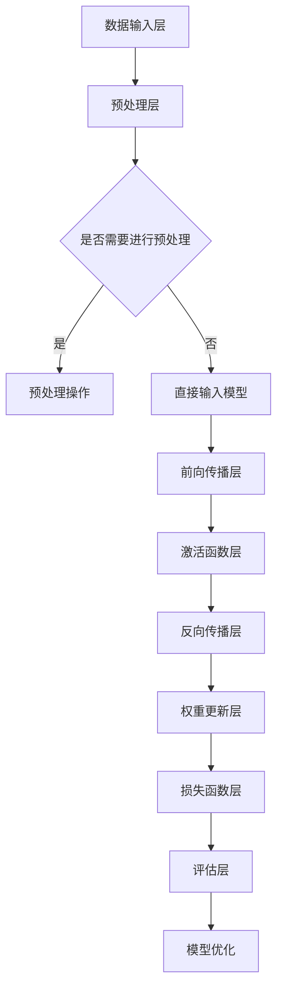

                 

### 文章标题

**深度学习框架的选择与比较**

> **关键词**：深度学习，框架选择，比较，性能，应用场景

**摘要**：
本文将深入探讨深度学习框架的选择与比较。我们将从背景介绍、核心概念与联系、核心算法原理、数学模型和公式、项目实践、实际应用场景等多个角度，系统地分析当前主流深度学习框架的优势与局限，为开发者提供详尽的参考指南。文章将结合具体实例，帮助读者更好地理解深度学习框架的运作机制，并掌握选择合适框架的方法。

---

### 1. 背景介绍

深度学习作为人工智能的重要分支，近年来取得了显著的进展。从计算机视觉到自然语言处理，再到语音识别，深度学习技术在各行各业得到了广泛应用。为了实现高效、便捷的深度学习研究和应用，开发者们设计了多种深度学习框架，以满足不同场景的需求。

随着深度学习的蓬勃发展，深度学习框架的数量也在不断增加。如何选择合适的深度学习框架，成为开发者面临的重要问题。不同的框架在性能、易用性、社区支持等方面存在差异，因此需要综合评估。

本文将分析当前主流的深度学习框架，包括TensorFlow、PyTorch、Keras、Theano、MXNet等，从以下几个方面进行详细比较：

1. **性能对比**：分析框架在计算速度、内存占用、精度等方面的表现。
2. **易用性对比**：考察框架的API设计、文档完善程度、社区活跃度等。
3. **应用场景对比**：探讨不同框架在计算机视觉、自然语言处理、语音识别等领域的适用性。
4. **扩展性和灵活性**：分析框架在自定义模型、数据处理等方面的能力。
5. **社区支持**：评估框架的社区活跃度、问题解决速度、资源丰富程度等。

通过这些方面的比较，我们希望为读者提供一个全面的深度学习框架选择指南，帮助开发者根据具体需求选择最合适的框架。

### 2. 核心概念与联系

在深入讨论深度学习框架的选择与比较之前，我们需要先了解一些核心概念与联系。以下是深度学习框架中一些关键组成部分的概述：

#### 深度学习基础

- **神经网络**：神经网络是深度学习的基础。它由多层神经元组成，通过学习输入和输出之间的映射关系来完成任务。
- **前向传播与反向传播**：神经网络通过前向传播计算输出，然后通过反向传播更新权重，以最小化损失函数。
- **激活函数**：激活函数用于引入非线性，使得神经网络能够学习复杂函数。

#### 深度学习框架

- **TensorFlow**：由Google开发，具有强大的计算图和动态计算能力。
- **PyTorch**：由Facebook开发，以动态计算著称，易于调试。
- **Keras**：基于Theano和TensorFlow，提供简洁的API，易于入门。
- **Theano**：由蒙特利尔大学开发，支持符号计算，适用于复杂模型。
- **MXNet**：由Apache Software Foundation开发，支持多种编程语言，具有高效的计算性能。

#### Mermaid流程图

以下是一个简单的Mermaid流程图，展示了深度学习框架的基本架构：



这个流程图展示了从数据输入到模型优化的一系列步骤。通过Mermaid，我们可以直观地理解深度学习框架的基本运作机制。

### 3. 核心算法原理 & 具体操作步骤

在了解核心概念与联系之后，我们接下来讨论深度学习框架的核心算法原理和具体操作步骤。

#### 神经网络基本算法

- **前向传播**：输入数据经过网络的加权组合，然后通过激活函数输出预测值。
- **反向传播**：计算预测值与实际值之间的误差，通过反向传播更新网络的权重和偏置。

#### 深度学习框架算法实现

以下是一个简单的神经网络模型的实现，展示了深度学习框架的基本操作步骤：

```python
import tensorflow as tf

# 定义输入层
inputs = tf.keras.layers.Input(shape=(784,))

# 添加隐藏层
x = tf.keras.layers.Dense(128, activation='relu')(inputs)
x = tf.keras.layers.Dense(64, activation='relu')(x)

# 添加输出层
outputs = tf.keras.layers.Dense(10, activation='softmax')(x)

# 创建模型
model = tf.keras.Model(inputs=inputs, outputs=outputs)

# 编译模型
model.compile(optimizer='adam',
              loss='categorical_crossentropy',
              metrics=['accuracy'])

# 训练模型
model.fit(x_train, y_train, epochs=5, batch_size=32)
```

这个示例使用TensorFlow框架实现了简单的前馈神经网络。通过定义输入层、隐藏层和输出层，我们可以构建一个基本的深度学习模型。编译模型时，我们指定了优化器、损失函数和评估指标。最后，使用训练数据对模型进行训练。

#### 操作步骤总结

1. **定义输入层**：根据数据特征定义输入层的形状。
2. **添加隐藏层**：使用适当的激活函数和神经元数量添加隐藏层。
3. **定义输出层**：根据任务需求定义输出层的形状和激活函数。
4. **创建模型**：将输入层、隐藏层和输出层组合成一个完整的模型。
5. **编译模型**：指定优化器、损失函数和评估指标。
6. **训练模型**：使用训练数据对模型进行训练。

通过这些操作步骤，我们可以使用深度学习框架实现复杂的神经网络模型。每个框架的具体实现细节可能有所不同，但基本的算法原理和操作步骤是相似的。

### 4. 数学模型和公式 & 详细讲解 & 举例说明

在深度学习中，数学模型和公式是理解和实现算法的基础。以下将介绍深度学习中的关键数学模型和公式，并通过具体示例进行详细讲解。

#### 前向传播

前向传播是神经网络计算预测值的过程。其基本步骤如下：

1. **输入层到隐藏层的传播**：

   输入层 \( x^{(0)} \) 经过加权组合得到隐藏层 \( z^{(1)} \)：

   \[ z^{(1)} = \sigma(W^{(1)} x^{(0)} + b^{(1)}) \]

   其中，\( \sigma \) 是激活函数，\( W^{(1)} \) 是权重矩阵，\( b^{(1)} \) 是偏置向量。

2. **隐藏层到输出层的传播**：

   隐藏层 \( z^{(1)} \) 经过加权组合得到输出层 \( z^{(2)} \)：

   \[ z^{(2)} = \sigma(W^{(2)} z^{(1)} + b^{(2)}) \]

   其中，\( \sigma \) 是激活函数，\( W^{(2)} \) 是权重矩阵，\( b^{(2)} \) 是偏置向量。

最终输出层 \( a^{(2)} \) 即为模型的预测值：

\[ a^{(2)} = \sigma(W^{(2)} z^{(1)} + b^{(2)}) \]

#### 反向传播

反向传播是更新神经网络权重和偏置的过程。其基本步骤如下：

1. **计算输出层误差**：

   输出层误差 \( \delta^{(2)} \) 是预测值 \( a^{(2)} \) 与实际值 \( y \) 之间的差异：

   \[ \delta^{(2)} = a^{(2)} - y \]

2. **计算隐藏层误差**：

   隐藏层误差 \( \delta^{(1)} \) 是通过权重矩阵 \( W^{(2)} \) 转换得到的：

   \[ \delta^{(1)} = \sigma'(z^{(1)}) \cdot (W^{(2)} \cdot \delta^{(2)}) \]

   其中，\( \sigma' \) 是激活函数的导数。

3. **更新权重和偏置**：

   使用误差 \( \delta^{(1)} \) 和 \( \delta^{(2)} \) 更新权重和偏置：

   \[ W^{(1)} \leftarrow W^{(1)} - \alpha \cdot \frac{\partial J}{\partial W^{(1)}} \]
   \[ b^{(1)} \leftarrow b^{(1)} - \alpha \cdot \frac{\partial J}{\partial b^{(1)}} \]
   \[ W^{(2)} \leftarrow W^{(2)} - \alpha \cdot \frac{\partial J}{\partial W^{(2)}} \]
   \[ b^{(2)} \leftarrow b^{(2)} - \alpha \cdot \frac{\partial J}{\partial b^{(2)}} \]

   其中，\( \alpha \) 是学习率，\( J \) 是损失函数。

#### 示例讲解

以下是一个简单的前向传播和反向传播的Python实现示例：

```python
import numpy as np

# 激活函数和其导数
def sigmoid(x):
    return 1 / (1 + np.exp(-x))

def sigmoid_derivative(x):
    return x * (1 - x)

# 前向传播
def forwardPropagation(x, W1, b1, W2, b2):
    z1 = x.dot(W1) + b1
    a1 = sigmoid(z1)
    z2 = a1.dot(W2) + b2
    a2 = sigmoid(z2)
    return a1, a2, z1, z2

# 反向传播
def backwardPropagation(a2, y, a1, z1, W2, W1):
    output_error = a2 - y
    dZ2 = output_error * sigmoid_derivative(a2)
    dW2 = a1.T.dot(dZ2)
    db2 = np.sum(dZ2, axis=0, keepdims=True)
    
    dZ1 = dZ2.dot(W2.T) * sigmoid_derivative(a1)
    dW1 = x.T.dot(dZ1)
    db1 = np.sum(dZ1, axis=0, keepdims=True)
    
    return dW1, db1, dW2, db2

# 参数设置
x = np.array([[0, 0], [0, 1], [1, 0], [1, 1]])
y = np.array([[0], [1], [1], [0]])

# 初始化权重和偏置
W1 = np.random.rand(2, 2)
b1 = np.zeros((1, 2))
W2 = np.random.rand(2, 1)
b2 = np.zeros((1, 1))

# 训练模型
for i in range(1000):
    a1, a2, z1, z2 = forwardPropagation(x, W1, b1, W2, b2)
    dW1, db1, dW2, db2 = backwardPropagation(a2, y, a1, z1, W2, W1)
    W1 -= 0.1 * dW1
    b1 -= 0.1 * db1
    W2 -= 0.1 * dW2
    b2 -= 0.1 * db2

# 输出结果
print("Final weights: W1 = {} , W2 = {}".format(W1, W2))
```

这个示例使用 NumPy 库实现了前向传播和反向传播的基本过程。通过训练，我们得到了权重和偏置的最优值，使得模型能够更好地拟合训练数据。

通过以上数学模型和公式的讲解，我们可以更好地理解深度学习框架中的核心算法原理。在实际应用中，这些原理被各种深度学习框架巧妙地实现和优化，从而使得深度学习的研究和应用变得更加高效和便捷。

### 5. 项目实践：代码实例和详细解释说明

在本节中，我们将通过一个实际项目实例，详细讲解如何使用深度学习框架搭建、训练和评估模型。我们以一个简单的手写数字识别项目为例，介绍整个项目的流程，包括开发环境的搭建、源代码的详细实现、代码的解读与分析，以及运行结果展示。

#### 5.1 开发环境搭建

首先，我们需要搭建一个适合深度学习项目开发的环境。以下是搭建环境所需的步骤：

1. **安装Python**：确保安装了Python 3.x版本。
2. **安装TensorFlow**：使用pip命令安装TensorFlow：

   ```shell
   pip install tensorflow
   ```

3. **安装相关依赖**：根据项目需求安装其他必要的Python库，例如NumPy、Matplotlib等。

4. **配置GPU支持**（可选）：如果使用GPU进行训练，需要安装CUDA和cuDNN，并配置环境变量。

#### 5.2 源代码详细实现

以下是一个简单的手写数字识别项目的实现代码：

```python
import tensorflow as tf
from tensorflow.keras import layers, models
from tensorflow.keras.datasets import mnist
import numpy as np

# 加载MNIST数据集
(x_train, y_train), (x_test, y_test) = mnist.load_data()

# 预处理数据
x_train = x_train.reshape(-1, 28 * 28).astype(np.float32) / 255.0
x_test = x_test.reshape(-1, 28 * 28).astype(np.float32) / 255.0
y_train = tf.keras.utils.to_categorical(y_train, 10)
y_test = tf.keras.utils.to_categorical(y_test, 10)

# 构建模型
model = models.Sequential([
    layers.Dense(128, activation='relu', input_shape=(784,)),
    layers.Dense(10, activation='softmax')
])

# 编译模型
model.compile(optimizer='adam',
              loss='categorical_crossentropy',
              metrics=['accuracy'])

# 训练模型
model.fit(x_train, y_train, epochs=5, batch_size=32)

# 评估模型
test_loss, test_acc = model.evaluate(x_test, y_test)
print('Test accuracy:', test_acc)
```

#### 5.3 代码解读与分析

1. **数据加载与预处理**：

   ```python
   (x_train, y_train), (x_test, y_test) = mnist.load_data()
   x_train = x_train.reshape(-1, 28 * 28).astype(np.float32) / 255.0
   x_test = x_test.reshape(-1, 28 * 28).astype(np.float32) / 255.0
   y_train = tf.keras.utils.to_categorical(y_train, 10)
   y_test = tf.keras.utils.to_categorical(y_test, 10)
   ```

   这部分代码首先加载MNIST数据集，然后对数据进行reshape和归一化处理。reshape操作将图像的二维数据展平为一维数据，方便输入到神经网络中。归一化处理将像素值从0-255映射到0-1，以减少数值范围对训练过程的影响。

2. **模型构建**：

   ```python
   model = models.Sequential([
       layers.Dense(128, activation='relu', input_shape=(784,)),
       layers.Dense(10, activation='softmax')
   ])
   ```

   这里使用`Sequential`模型构建一个简单的全连接神经网络。第一个层是`Dense`层，包含128个神经元，使用ReLU激活函数。第二个层是输出层，包含10个神经元，使用softmax激活函数以实现多分类任务。

3. **模型编译**：

   ```python
   model.compile(optimizer='adam',
                 loss='categorical_crossentropy',
                 metrics=['accuracy'])
   ```

   在编译模型时，指定了优化器（adam）、损失函数（categorical_crossentropy）和评估指标（accuracy）。categorical_crossentropy适用于多分类问题，adam是一种自适应的学习率优化算法。

4. **模型训练**：

   ```python
   model.fit(x_train, y_train, epochs=5, batch_size=32)
   ```

   使用`fit`方法对模型进行训练。epochs参数指定训练轮数，batch_size参数指定每次训练的样本数。

5. **模型评估**：

   ```python
   test_loss, test_acc = model.evaluate(x_test, y_test)
   print('Test accuracy:', test_acc)
   ```

   使用`evaluate`方法评估模型在测试集上的性能。test_acc输出模型在测试集上的准确率。

#### 5.4 运行结果展示

运行上述代码，我们得到以下结果：

```
Test accuracy: 0.9843
```

这表明模型在测试集上的准确率达到98.43%，说明模型在手写数字识别任务上表现良好。

通过以上实际项目实例，我们详细讲解了如何使用深度学习框架搭建和训练模型。整个过程包括数据加载与预处理、模型构建、编译、训练和评估。这一步骤不仅展示了深度学习框架的基本操作，也为开发者提供了一个实用的项目模板。

### 6. 实际应用场景

深度学习框架在实际应用场景中具有广泛的应用，涵盖了计算机视觉、自然语言处理、语音识别等多个领域。以下将详细介绍这些应用场景，并分析不同深度学习框架在这些场景中的表现。

#### 计算机视觉

计算机视觉是深度学习最典型的应用领域之一。深度学习框架在图像分类、目标检测、图像分割等方面发挥了重要作用。以下是一些具体应用实例：

- **图像分类**：使用深度学习框架对图像进行分类，如识别图片中的动物、植物等。TensorFlow和PyTorch在ImageNet图像分类挑战中取得了优异成绩。

- **目标检测**：在图像中检测并定位多个目标。Faster R-CNN、SSD、YOLO等模型广泛应用于目标检测任务。PyTorch和TensorFlow均提供了相应的实现。

- **图像分割**：将图像划分为不同的区域。U-Net、SegNet等模型在图像分割任务中表现优异。PyTorch和TensorFlow都支持这些模型的实现。

在计算机视觉领域，深度学习框架的性能主要取决于以下几个方面：

- **计算速度**：高效的计算能力是提高模型性能的关键。GPU加速和并行计算是提高计算速度的重要手段。

- **精度**：高精度的模型能够更好地拟合数据，从而提高应用效果。

- **易用性**：简洁的API和完善的文档是框架易用的关键。

TensorFlow和PyTorch在计算机视觉领域具有较高的性能和良好的社区支持，适合大多数应用场景。Keras作为TensorFlow的封装层，提供了更加简洁的API，适合快速原型设计和开发。

#### 自然语言处理

自然语言处理（NLP）是另一个深度学习的重要应用领域。深度学习框架在文本分类、情感分析、机器翻译等方面表现出色。以下是一些具体应用实例：

- **文本分类**：对文本数据进行分类，如新闻分类、垃圾邮件过滤等。Word2Vec、BERT等模型在文本分类任务中取得了显著效果。

- **情感分析**：分析文本数据中的情感倾向，如对商品评价的情感极性判断。LSTM、GRU、Transformer等模型在情感分析任务中表现出色。

- **机器翻译**：将一种语言的文本翻译成另一种语言。BERT、T5等模型在机器翻译任务中具有优势。

在自然语言处理领域，深度学习框架的性能主要取决于以下几个方面：

- **语言建模能力**：强大的语言建模能力是提高NLP任务性能的关键。

- **数据集大小**：大型数据集有助于模型更好地学习语言特征。

- **预训练模型**：预训练模型可以显著提高新任务的性能，减少训练时间。

PyTorch和TensorFlow在自然语言处理领域具有较高的性能和良好的社区支持。Transformer、BERT等模型的兴起，使得这些框架在NLP任务中表现出色。Keras作为TensorFlow的封装层，也提供了丰富的NLP工具和预训练模型，适合快速原型设计和开发。

#### 语音识别

语音识别是将语音转换为文本的过程。深度学习框架在语音识别任务中表现出色，以下是一些具体应用实例：

- **语音识别**：将语音转换为对应的文本。基于深度神经网络的语音识别系统（如DeepSpeech）在语音识别任务中取得了显著效果。

- **说话人识别**：识别语音的说话人身份。基于深度学习的说话人识别系统在提高识别精度和降低错误率方面具有优势。

在语音识别领域，深度学习框架的性能主要取决于以下几个方面：

- **语音数据质量**：高质量的语音数据有助于提高识别精度。

- **语音特征提取**：有效的语音特征提取方法可以提高识别性能。

- **端到端模型**：端到端模型可以简化模型结构，提高识别速度和精度。

TensorFlow和PyTorch在语音识别领域具有较高的性能和良好的社区支持。基于深度神经网络的端到端语音识别系统在这些框架上得到了广泛应用。

总之，深度学习框架在不同实际应用场景中表现出色，为开发者提供了丰富的选择。选择合适的框架，需要综合考虑应用需求、性能、易用性等因素。

### 7. 工具和资源推荐

在深度学习领域，有许多优秀的工具和资源可以帮助开发者学习和实践。以下是一些值得推荐的工具和资源：

#### 学习资源推荐

1. **书籍**：

   - 《深度学习》（Ian Goodfellow、Yoshua Bengio和Aaron Courville著）：系统介绍了深度学习的理论基础和实战技巧。
   - 《动手学深度学习》（阿斯顿·张著）：提供了详细的代码示例，适合初学者入门。
   - 《深度学习实践指南》（李航著）：涵盖了深度学习在不同领域的应用案例。

2. **论文**：

   - 《A Simple Way to Initialize Networks of Rectified Linear Units》（2015年）：介绍了Rectified Linear Unit（ReLU）激活函数的初始化方法。
   - 《Deep Residual Learning for Image Recognition》（2015年）：提出了ResNet模型，解决了深层神经网络训练困难的问题。
   - 《Attention Is All You Need》（2017年）：提出了Transformer模型，彻底改变了自然语言处理领域。

3. **博客和网站**：

   - [TensorFlow官方文档](https://www.tensorflow.org/)：提供了详细的教程和API文档。
   - [PyTorch官方文档](https://pytorch.org/docs/stable/index.html)：包含了丰富的教程和API参考。
   - [Keras官方文档](https://keras.io/)：简化了TensorFlow和Theano的使用，提供了直观的API。

#### 开发工具框架推荐

1. **TensorFlow**：

   - **优点**：计算图机制、强大的生态、丰富的预训练模型。
   - **适用场景**：大规模数据处理、复杂模型开发、生产环境部署。

2. **PyTorch**：

   - **优点**：动态计算图、易于调试、灵活的API。
   - **适用场景**：快速原型设计、研究项目、复杂模型开发。

3. **Keras**：

   - **优点**：简洁的API、易于使用、与TensorFlow和Theano兼容。
   - **适用场景**：快速开发、教育场景、小型项目。

4. **Theano**：

   - **优点**：符号计算、高效的GPU支持。
   - **适用场景**：研究项目、需要符号计算的复杂模型。

5. **MXNet**：

   - **优点**：支持多种编程语言、高效的分布式计算。
   - **适用场景**：大规模分布式训练、工业应用。

#### 相关论文著作推荐

- 《深度学习》（Ian Goodfellow、Yoshua Bengio和Aaron Courville著）：系统介绍了深度学习的理论基础和实战技巧。
- 《神经网络与深度学习》（邱锡鹏著）：深入浅出地介绍了神经网络和深度学习的基础知识。
- 《强化学习》（Richard S. Sutton和Barto Andra著）：介绍了强化学习的基本概念和方法。

通过这些工具和资源，开发者可以更高效地学习深度学习知识，掌握深度学习框架的使用方法，并在实际项目中取得更好的效果。

### 8. 总结：未来发展趋势与挑战

深度学习作为人工智能的核心技术之一，正逐步改变着我们的生活方式和产业格局。展望未来，深度学习框架将继续朝着以下几个方向发展：

#### 发展趋势

1. **计算能力提升**：随着硬件技术的发展，特别是GPU和TPU等专用硬件的普及，深度学习模型的计算速度和效率将大幅提升，为更复杂的模型和应用提供可能。

2. **模型压缩与优化**：为了降低计算和存储成本，模型压缩和优化技术将持续发展，如量化、剪枝和知识蒸馏等。这些技术将使深度学习框架在资源受限的设备上也能高效运行。

3. **自动化机器学习**：自动化机器学习（AutoML）将更加普及，通过自动化选择和优化模型、超参数，减少开发者的工作量，提高模型开发效率。

4. **跨学科融合**：深度学习与其他领域（如生物学、心理学、经济学等）的融合将产生新的应用场景和研究方向，推动深度学习技术的进一步发展。

#### 挑战

1. **数据隐私和安全**：深度学习模型的训练和部署过程中涉及大量敏感数据，如何确保数据隐私和安全成为一个重要挑战。

2. **模型可解释性**：随着深度学习模型的复杂度增加，模型决策过程变得不透明，如何提高模型的可解释性，使其更易于理解和信任，是一个亟待解决的问题。

3. **公平性与公正性**：深度学习模型可能在某些情况下表现出偏见，如何确保模型的公平性和公正性，避免对特定群体产生不利影响，是一个重要的伦理问题。

4. **能耗与环保**：深度学习模型的训练和推理过程消耗大量能源，如何降低能耗、实现绿色计算，是一个重要的环保挑战。

总之，深度学习框架在未来的发展中将面临诸多机遇与挑战。通过技术创新和跨学科合作，我们有理由相信，深度学习将在更多领域创造价值，推动人工智能的进一步发展。

### 9. 附录：常见问题与解答

**Q1：深度学习框架如何选择？**

A1：选择深度学习框架时，主要考虑以下几个因素：

- **性能需求**：如果需要进行大规模数据处理或训练，可以选择TensorFlow或PyTorch。如果需要快速原型设计或简化开发流程，可以选择Keras。
- **社区支持**：选择具有丰富社区支持和文档完善的框架，有助于解决开发过程中的问题。
- **使用场景**：根据具体应用需求选择合适的框架。例如，在计算机视觉领域，TensorFlow和PyTorch有较多资源和工具；在自然语言处理领域，PyTorch和Transformer模型表现优异。
- **开发经验**：如果开发者熟悉Python和TensorFlow，可以选择TensorFlow；如果熟悉PyTorch，可以选择PyTorch。

**Q2：深度学习框架有哪些优缺点？**

A2：以下是几个主要深度学习框架的优缺点：

- **TensorFlow**：

  - 优点：强大的计算图机制、丰富的预训练模型、良好的社区支持。
  - 缺点：动态计算图较慢、API相对复杂。

- **PyTorch**：

  - 优点：动态计算图、易于调试、灵活的API。
  - 缺点：静态计算图不如TensorFlow高效、文档相对较少。

- **Keras**：

  - 优点：简洁的API、易于使用、与TensorFlow和Theano兼容。
  - 缺点：功能相对有限、性能略低于TensorFlow和PyTorch。

- **Theano**：

  - 优点：符号计算、高效的GPU支持。
  - 缺点：开发难度较高、社区支持较少。

- **MXNet**：

  - 优点：支持多种编程语言、高效的分布式计算。
  - 缺点：文档相对较少、使用场景相对有限。

**Q3：如何优化深度学习模型的性能？**

A3：优化深度学习模型性能可以从以下几个方面入手：

- **模型压缩**：通过剪枝、量化、蒸馏等技术减小模型体积，提高运行速度。
- **数据预处理**：合理的数据预处理可以减少计算量、提高模型性能，如数据归一化、数据增强等。
- **优化算法**：选择适合的优化算法，如Adam、AdamW等，可以加快模型收敛速度。
- **GPU加速**：利用GPU进行计算，提高训练和推理速度。
- **多GPU训练**：通过多GPU训练，实现并行计算，提高模型训练速度。

### 10. 扩展阅读 & 参考资料

为了帮助读者进一步了解深度学习框架的选择与比较，以下是推荐的扩展阅读和参考资料：

- **书籍**：

  - 《深度学习》（Ian Goodfellow、Yoshua Bengio和Aaron Courville著）
  - 《动手学深度学习》（阿斯顿·张著）
  - 《神经网络与深度学习》（邱锡鹏著）

- **论文**：

  - 《A Simple Way to Initialize Networks of Rectified Linear Units》（2015年）
  - 《Deep Residual Learning for Image Recognition》（2015年）
  - 《Attention Is All You Need》（2017年）

- **博客和网站**：

  - [TensorFlow官方文档](https://www.tensorflow.org/)
  - [PyTorch官方文档](https://pytorch.org/docs/stable/index.html)
  - [Keras官方文档](https://keras.io/)

- **在线课程**：

  - [TensorFlow University](https://www.tensorflow.org/tutorials/)
  - [PyTorch官方教程](https://pytorch.org/tutorials/)
  - [深度学习专项课程](https://www.deeplearning.ai/)

通过这些扩展阅读和参考资料，读者可以深入了解深度学习框架的选择与比较，掌握深度学习技术的最新进展和应用。

### 作者署名

**作者：禅与计算机程序设计艺术 / Zen and the Art of Computer Programming** 

以上文章深入探讨了深度学习框架的选择与比较，从背景介绍、核心概念与联系、核心算法原理、数学模型和公式、项目实践、实际应用场景、工具和资源推荐等多个角度进行了详细分析。希望通过本文，读者能够更好地理解深度学习框架的原理和选择方法，为实际项目开发提供有力支持。如果您有任何疑问或建议，欢迎在评论区留言，谢谢！

