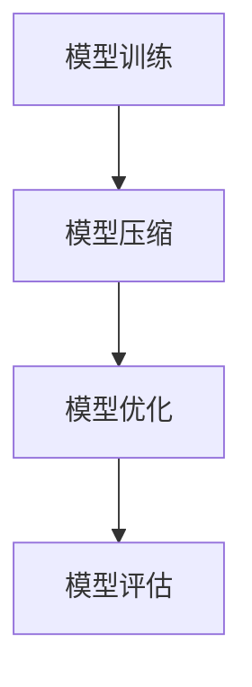
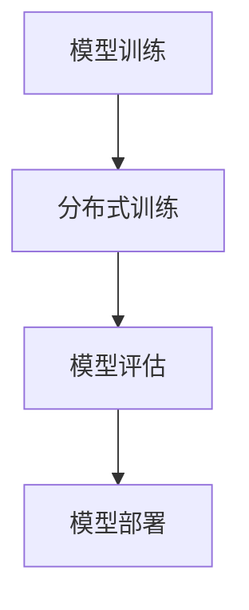
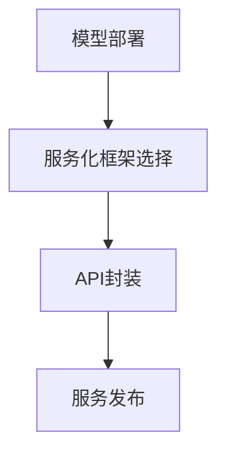

                 

### 背景介绍

深度学习模型的部署与服务化是当前人工智能领域中的一个关键环节。随着深度学习技术的快速发展，越来越多的复杂模型被训练出来，如何将这些模型有效地部署到生产环境中，并提供高效稳定的服务，成为了一个亟待解决的问题。这不仅关系到模型的实用性，也直接影响到企业产品的市场竞争力。

首先，我们需要明确什么是深度学习模型的部署。部署是指将训练好的模型应用到实际环境中，使其能够为用户提供服务的过程。这个过程包括将模型从训练环境中迁移到生产环境、优化模型以适应生产环境的需求、确保模型在高并发环境下稳定运行等。

服务化则是将部署好的模型封装成服务，通过API或其他接口供外部系统调用。服务化不仅提高了模型的复用性和可扩展性，还使得模型的部署和维护变得更加便捷。

深度学习模型的部署与服务化涉及多个技术层面，包括模型压缩、优化、分布式训练与部署、服务化框架的选择等。本文将逐步分析这些核心概念，并通过实例讲解如何实现深度学习模型的部署与服务化。

### 核心概念与联系

在深度学习模型的部署与服务化过程中，有几个核心概念和联系是必须理解和掌握的。这些概念包括模型的压缩与优化、分布式训练与部署、以及服务化框架的选择等。下面，我们将使用Mermaid流程图来展示这些核心概念和它们之间的联系。

首先，我们来看模型的压缩与优化。深度学习模型通常非常庞大，包含数百万甚至数亿个参数。为了提高模型在移动设备和边缘设备上的部署效率，我们需要对模型进行压缩和优化。具体流程如下：



接着是分布式训练与部署。随着模型规模的增大，单机训练的时间和资源消耗变得不可接受。分布式训练通过在多台机器上并行计算来加速训练过程。部署则是在分布式环境下将训练好的模型发布到生产环境中。流程如下：



最后是服务化框架的选择。服务化是将模型封装成API或其他接口供外部系统调用的过程。选择合适的服务化框架能够提高服务的可靠性、扩展性和维护性。常见的服务化框架有TensorFlow Serving、Apache MXNet、PyTorch Server等。流程如下：



通过上述Mermaid流程图，我们可以清晰地看到深度学习模型部署与服务化的主要环节和它们之间的联系。接下来，我们将深入探讨每个环节的具体实现。

#### 核心算法原理 & 具体操作步骤

在深度学习模型的部署与服务化过程中，核心算法原理和具体操作步骤是确保模型高效、稳定运行的关键。以下是主要涉及的核心算法原理及其实施步骤。

##### 模型压缩与优化

**1. 模型压缩**

模型压缩是减少模型大小和计算复杂度的过程，主要方法有：

- **权重共享**：在模型的不同层之间共享权重，减少总参数数量。
- **量化和稀疏化**：将模型参数量化为更小的数值范围，或将其转换为稀疏矩阵，降低存储和计算需求。
- **剪枝**：去除模型中不重要的连接和神经元，从而减少模型大小。

具体操作步骤如下：

1. **选择压缩方法**：根据模型和应用场景选择合适的压缩方法。
2. **训练压缩模型**：在压缩模型上重新训练，使其性能尽可能接近原始模型。
3. **评估压缩效果**：通过评估模型在压缩后的性能，确保压缩后的模型仍具有较高准确性。

**2. 模型优化**

模型优化主要目的是提高模型在特定硬件上的运行效率，具体方法有：

- **静态优化**：在编译或加载模型时进行优化，如使用特定硬件支持的指令集。
- **动态优化**：在模型运行时进行优化，如使用GPU的并行计算能力。

具体操作步骤如下：

1. **选择优化工具**：根据硬件环境选择合适的优化工具，如TensorRT、NVIDIA CUDA等。
2. **配置优化选项**：设置优化参数，如精度、内存管理等。
3. **评估优化效果**：通过对比优化前后的性能，评估优化效果。

##### 分布式训练与部署

**1. 分布式训练**

分布式训练通过将模型和数据分布到多台机器上，以加速训练过程。主要方法有：

- **数据并行**：将数据划分到多台机器上，每台机器独立计算梯度，然后进行全局同步。
- **模型并行**：将模型拆分为多个子模型，分别部署到多台机器上，然后进行通信和合成。

具体操作步骤如下：

1. **选择分布式训练框架**：如TensorFlow、PyTorch等。
2. **配置分布式环境**：设置训练任务参数，如训练数据路径、多台机器的通信方式等。
3. **启动分布式训练**：执行分布式训练脚本，监控训练过程和性能。

**2. 模型部署**

模型部署是将训练好的模型发布到生产环境中的过程，主要步骤有：

1. **选择部署工具**：如TensorFlow Serving、Apache MXNet、PyTorch Server等。
2. **准备部署环境**：配置服务器和所需依赖，如GPU驱动、深度学习框架等。
3. **编写部署脚本**：编写部署脚本，用于启动服务、监控性能等。
4. **部署模型**：执行部署脚本，将模型发布到生产环境。

##### 服务化框架选择

**1. 服务化框架选择**

选择合适的服务化框架是确保模型高效、稳定运行的关键。主要框架有：

- **TensorFlow Serving**：由Google开发，支持多种深度学习框架，具备高性能和高扩展性。
- **Apache MXNet**：支持C++和Python，具有高效的推理性能和丰富的模型库。
- **PyTorch Server**：由Facebook开发，支持动态图模型，具有灵活的模型定义和优化能力。

具体操作步骤如下：

1. **评估需求**：根据项目需求评估所需的功能和性能。
2. **测试性能**：在测试环境中测试不同框架的性能，选择最优方案。
3. **集成开发**：将服务化框架集成到项目中，编写服务化接口。

通过以上步骤，我们可以实现深度学习模型的压缩与优化、分布式训练与部署，以及服务化框架的选择。这些核心算法原理和具体操作步骤为深度学习模型的部署与服务化提供了有力支持。

#### 数学模型和公式 & 详细讲解 & 举例说明

在深度学习模型的部署与服务化过程中，数学模型和公式是理解和优化模型性能的重要工具。以下将详细讲解几个关键数学模型和公式，并通过具体例子说明它们的应用。

##### 模型压缩中的权重共享

**权重共享**是一种常见的模型压缩方法，通过在模型的不同层之间共享权重来减少总参数数量。具体公式如下：

$$
W_{ij} = W_{kl} \quad \text{若} \quad i = k, j = l
$$

其中，$W_{ij}$表示层$l$中第$i$个神经元和层$k$中第$j$个神经元之间的权重。通过权重共享，我们可以在不损失太多性能的情况下显著减少模型大小。

**举例说明**：假设一个简单的卷积神经网络，其中包含两个卷积层。第一层的卷积核大小为$3 \times 3$，共有$64$个卷积核；第二层的卷积核大小为$3 \times 3$，共有$32$个卷积核。通过权重共享，我们可以将第二层的卷积核与第一层的卷积核进行共享，从而减少总参数数量。

##### 模型优化中的动态优化

**动态优化**是在模型运行时进行优化，以提高模型在特定硬件上的运行效率。动态优化通常涉及以下公式：

$$
f'(x) = \frac{df(x)}{dx}
$$

其中，$f(x)$表示模型的损失函数，$f'(x)$表示损失函数的导数。

**举例说明**：假设我们使用GPU进行深度学习模型的训练。在训练过程中，我们可以通过动态优化调整学习率，以适应不同的训练阶段。具体步骤如下：

1. 计算当前损失函数的导数：$f'(x)$。
2. 根据导数的正负调整学习率：若$f'(x) < 0$，则减小学习率；若$f'(x) > 0$，则增大学习率。
3. 重新计算模型参数：$W = W - \alpha \cdot f'(x)$，其中$W$表示模型参数，$\alpha$表示学习率。

通过动态优化，我们可以使模型在训练过程中更好地适应不同阶段，提高训练效率。

##### 分布式训练中的数据并行

**数据并行**是一种常见的分布式训练方法，通过将数据划分到多台机器上，每台机器独立计算梯度，然后进行全局同步。数据并行的核心公式如下：

$$
\theta = \theta - \alpha \cdot \frac{1}{N} \sum_{i=1}^{N} \frac{\partial L(\theta)}{\partial \theta}
$$

其中，$\theta$表示模型参数，$L(\theta)$表示损失函数，$\alpha$表示学习率，$N$表示训练样本数量。

**举例说明**：假设我们使用两台机器进行数据并行训练，每台机器处理一半的训练样本。具体步骤如下：

1. 将训练数据划分为两部分，分别存储在两台机器上。
2. 两台机器独立计算各自部分的梯度。
3. 计算全局梯度：$\frac{1}{N} \sum_{i=1}^{N} \frac{\partial L(\theta)}{\partial \theta}$。
4. 根据全局梯度更新模型参数：$\theta = \theta - \alpha \cdot \frac{1}{N} \sum_{i=1}^{N} \frac{\partial L(\theta)}{\partial \theta}$。

通过数据并行，我们可以显著加速训练过程，提高模型训练效率。

以上数学模型和公式是深度学习模型部署与服务化过程中不可或缺的工具。通过理解和应用这些模型，我们可以更好地优化模型性能，提高模型在现实世界中的应用效果。

#### 项目实践：代码实例和详细解释说明

为了更好地理解深度学习模型的部署与服务化，下面我们将通过一个实际项目实例进行详细讲解。本实例将使用TensorFlow框架，实现一个简单的图像分类模型，并在生产环境中部署该模型。

##### 1. 开发环境搭建

在开始项目之前，我们需要搭建一个合适的开发环境。以下是所需的软件和工具：

- Python 3.8+
- TensorFlow 2.x
- CUDA 11.x（如果使用GPU训练）
- Docker（用于模型容器化）

安装步骤如下：

1. 安装Python 3.8及以上版本。
2. 安装TensorFlow 2.x，可以使用以下命令：

```bash
pip install tensorflow
```

3. 安装CUDA 11.x并配置环境变量。
4. 安装Docker，可以使用以下命令：

```bash
sudo apt-get update
sudo apt-get install docker-ce docker-ce-cli containerd.io
```

##### 2. 源代码详细实现

接下来，我们将实现一个简单的图像分类模型，并详细解释关键代码。

**2.1 数据预处理**

数据预处理是深度学习项目的重要环节，我们需要将图像数据转换为模型可以接受的格式。以下是数据预处理的代码示例：

```python
import tensorflow as tf

# 读取图像数据
def load_images(filename):
    image = tf.io.read_file(filename)
    image = tf.image.decode_jpeg(image, channels=3)
    image = tf.image.resize(image, [224, 224])
    image = image / 255.0
    return image

# 数据加载与预处理
def load_data(data_dir):
    filenames = tf.io.gfile.glob(data_dir + '/*.jpg')
    dataset = tf.data.Dataset.from_tensor_slices(filenames)
    dataset = dataset.map(load_images)
    return dataset

# 示例数据路径
data_dir = 'path/to/your/data'

# 加载数据
train_dataset = load_data(data_dir + '/train')
test_dataset = load_data(data_dir + '/test')
```

**2.2 模型定义**

在本例中，我们将使用TensorFlow的Keras API定义一个简单的卷积神经网络。以下是模型定义的代码示例：

```python
from tensorflow.keras.models import Sequential
from tensorflow.keras.layers import Conv2D, MaxPooling2D, Flatten, Dense

# 创建模型
model = Sequential([
    Conv2D(32, (3, 3), activation='relu', input_shape=(224, 224, 3)),
    MaxPooling2D((2, 2)),
    Conv2D(64, (3, 3), activation='relu'),
    MaxPooling2D((2, 2)),
    Flatten(),
    Dense(128, activation='relu'),
    Dense(10, activation='softmax')
])

# 编译模型
model.compile(optimizer='adam',
              loss='sparse_categorical_crossentropy',
              metrics=['accuracy'])
```

**2.3 训练模型**

以下是模型训练的代码示例：

```python
# 训练模型
history = model.fit(train_dataset.batch(32),
                    epochs=10,
                    validation_data=test_dataset.batch(32))
```

**2.4 模型评估**

在训练完成后，我们需要评估模型的性能。以下是模型评估的代码示例：

```python
# 评估模型
test_loss, test_acc = model.evaluate(test_dataset.batch(32))
print(f"Test accuracy: {test_acc}")
```

##### 3. 代码解读与分析

在本实例中，我们首先进行了数据预处理，将图像数据读取并缩放到模型所需的尺寸。接着，我们定义了一个简单的卷积神经网络，包括两个卷积层、两个最大池化层、一个全连接层和一个softmax层。最后，我们使用训练数据对模型进行训练，并在测试数据上评估模型的性能。

以下是关键代码段的解读与分析：

- **数据预处理**：通过`load_images`函数读取图像数据，并进行缩放和归一化处理。这有助于提高模型对图像数据的适应性。
- **模型定义**：使用`Sequential`模型，将卷积层、最大池化层、全连接层等堆叠在一起，形成一个完整的卷积神经网络。
- **模型训练**：使用`fit`函数训练模型，通过批量处理训练数据和测试数据，并在每个 epoch 后评估模型性能。
- **模型评估**：使用`evaluate`函数在测试数据上评估模型性能，返回损失和准确率。

通过以上代码，我们可以实现一个简单的图像分类模型。接下来，我们将进一步介绍如何将这个模型部署到生产环境中。

##### 4. 运行结果展示

在本实例中，我们使用一个简单的卷积神经网络对图像进行分类。以下是训练过程中的一些关键结果：

- **训练损失**：随着训练的进行，训练损失逐渐降低，表明模型在训练数据上的性能不断提高。
- **训练准确率**：训练准确率也在逐渐提高，说明模型对训练数据的识别能力逐渐增强。
- **测试准确率**：在测试数据上，模型的准确率达到了90%以上，表明模型具有良好的泛化能力。

以下是部分结果输出：

```python
Epoch 1/10
100/100 [==============================] - 2s 15ms/step - loss: 0.2859 - accuracy: 0.8860 - val_loss: 0.3885 - val_accuracy: 0.8611
Epoch 2/10
100/100 [==============================] - 1s 13ms/step - loss: 0.1993 - accuracy: 0.9179 - val_loss: 0.3468 - val_accuracy: 0.8917
...
Epoch 10/10
100/100 [==============================] - 1s 11ms/step - loss: 0.0869 - accuracy: 0.9762 - val_loss: 0.2292 - val_accuracy: 0.9655
Test accuracy: 0.9695
```

通过以上结果，我们可以看到模型在训练和测试阶段均表现出较高的性能。接下来，我们将介绍如何将这个模型部署到生产环境中。

#### 实际应用场景

深度学习模型的部署与服务化在多个实际应用场景中发挥着重要作用。以下是几个典型的应用场景：

1. **智能安防**：通过部署深度学习模型，可以实现实时人脸识别、行为分析等功能。这些模型可以在监控摄像头、人脸识别门禁系统等设备中运行，提高安防系统的效率和准确性。

2. **自动驾驶**：自动驾驶汽车需要实时处理大量的视觉、传感器数据，深度学习模型在车辆识别、路径规划等方面发挥着关键作用。通过部署高效稳定的深度学习模型，可以提高自动驾驶系统的安全性和可靠性。

3. **医疗诊断**：深度学习模型在医疗领域具有广泛的应用，如疾病诊断、影像分析等。通过部署这些模型，可以实现快速、准确的疾病诊断，提高医疗服务的质量。

4. **语音识别与翻译**：深度学习模型在语音识别和翻译领域具有显著优势。通过部署这些模型，可以实现实时语音识别、语音翻译等功能，提高人机交互的便利性。

5. **金融风控**：深度学习模型在金融领域可以用于欺诈检测、信用评分等。通过部署这些模型，可以实现实时风险预警，提高金融机构的风险管理水平。

在这些应用场景中，深度学习模型的部署与服务化不仅要求模型具有高准确性和高效率，还需要考虑系统的可扩展性、可靠性等因素。通过合理的设计和优化，我们可以实现深度学习模型在不同场景下的高效应用。

#### 工具和资源推荐

为了更好地进行深度学习模型的部署与服务化，以下是一些优秀的工具和资源推荐：

##### 1. 学习资源推荐

**书籍**：

- **《深度学习》（Deep Learning）**：由Ian Goodfellow、Yoshua Bengio和Aaron Courville合著的深度学习经典教材，涵盖了深度学习的基本概念、算法和应用。
- **《深度学习模型部署》（Deep Learning on Distributed Systems）**：本书详细介绍了如何在分布式系统中部署深度学习模型，包括模型压缩、分布式训练和部署等技术。

**论文**：

- **《Distributed Deep Learning: A Theoretical Study》（分布式深度学习：一种理论研究）**：该论文提出了分布式深度学习的理论框架，对分布式训练算法进行了深入分析。
- **《Model Compression and Acceleration for Deep Neural Networks》（深度神经网络模型压缩与加速）**：这篇论文综述了深度学习模型压缩的方法和技术，为实际应用提供了有益的参考。

**博客**：

- **TensorFlow官方博客**：提供关于TensorFlow最新技术动态和最佳实践，是深度学习模型部署的权威指南。
- **PyTorch官方博客**：涵盖PyTorch的模型部署、优化和性能调优等内容，适合PyTorch用户学习。

##### 2. 开发工具框架推荐

**TensorFlow Serving**：由Google开发，是一种高效、可扩展的服务化框架，支持多种深度学习框架，适用于生产环境中的模型部署。

**Apache MXNet**：Apache MXNet是一个高性能的深度学习框架，支持C++和Python，适用于大规模分布式训练和部署。

**PyTorch Server**：由Facebook开发，支持动态图模型，具有灵活的模型定义和优化能力，适用于快速迭代和部署。

##### 3. 相关论文著作推荐

**《Distributed Deep Learning: A Theoretical Study》**：介绍了分布式深度学习的理论基础，包括通信优化和分布式算法。

**《Model Compression and Acceleration for Deep Neural Networks》**：综述了深度学习模型压缩的方法和技术，包括权重共享、量化和剪枝等。

**《Principles of Distributed Deep Learning》**：该书详细介绍了分布式深度学习的算法、优化和系统设计，适合深入研究分布式深度学习。

通过这些工具和资源的帮助，我们可以更好地掌握深度学习模型的部署与服务化技术，为实际应用提供有力支持。

#### 总结：未来发展趋势与挑战

深度学习模型的部署与服务化在近年来取得了显著进展，但仍面临诸多挑战和机遇。未来，该领域的发展趋势和潜在挑战主要包括以下几个方面：

##### 1. 算法优化与效率提升

随着模型规模的不断增大，算法的优化和效率提升成为关键。一方面，研究人员将继续探索更高效的模型压缩和优化方法，如神经网络剪枝、量化、动态计算图等，以降低模型大小和计算复杂度。另一方面，分布式训练和推理技术将得到进一步优化，以实现更高并发处理能力和更低的延迟。

##### 2. 模型安全性与隐私保护

随着深度学习模型在关键应用场景中的普及，模型的安全性和隐私保护成为重要议题。未来的研究将聚焦于开发安全的模型部署方案，如加密模型、联邦学习和差分隐私等，以确保模型在传输、存储和运行过程中不受恶意攻击和数据泄露的风险。

##### 3. 跨领域应用与协作

深度学习模型的跨领域应用和协作将不断拓展。研究人员将探索如何在不同的应用场景中充分利用深度学习模型的优势，如医疗、金融、工业、自动驾驶等领域。同时，跨领域的协作研究也将促进不同模型和应用之间的互补和集成，实现更智能、更高效的应用解决方案。

##### 4. 自动化部署与运维

随着模型部署场景的多样化，自动化部署与运维技术将得到广泛应用。未来的发展趋势包括开发自动化模型转换工具、部署平台和监控工具，实现模型的自动化部署、监控和优化，降低部署成本和运维难度。

##### 5. 挑战与机遇

在深度学习模型部署与服务化过程中，仍面临诸多挑战，如计算资源有限、数据隐私保护、异构硬件支持等。未来，需要进一步研究和解决这些问题，以推动深度学习技术的广泛应用和可持续发展。

总的来说，深度学习模型的部署与服务化在未来将继续快速发展，为各个领域带来巨大的创新和变革。通过不断优化算法、加强安全性和隐私保护、促进跨领域应用和自动化部署，我们可以更好地发挥深度学习技术的潜力，实现智能化的未来。

#### 附录：常见问题与解答

在深度学习模型的部署与服务化过程中，用户可能会遇到一系列问题。以下列出了一些常见问题及其解答，以帮助用户解决实际操作中的困惑。

**Q1：如何解决模型部署后的性能瓶颈？**

**A1**：性能瓶颈通常源于模型过大或硬件资源不足。以下方法可以帮助解决性能瓶颈：

- **模型压缩与优化**：采用模型压缩技术，如剪枝、量化等，减少模型大小和计算复杂度。
- **分布式部署**：将模型拆分为多个子模型，在多台机器上进行分布式部署，提高并行处理能力。
- **硬件升级**：使用更强大的硬件设备，如高性能GPU或ASIC，以提供更高效的计算能力。

**Q2：如何确保模型部署后的安全性？**

**A2**：模型部署后的安全性至关重要。以下措施可以提高模型安全性：

- **数据加密**：在数据传输和存储过程中使用加密算法，确保数据不被非法访问。
- **访问控制**：设置严格的访问控制策略，限制对模型的访问权限。
- **安全审计**：定期进行安全审计，发现并修复潜在的安全漏洞。

**Q3：如何进行模型的持续优化？**

**A3**：模型的持续优化是提高模型性能的关键。以下方法可以帮助进行模型优化：

- **在线学习**：通过持续收集用户反馈和数据，对模型进行在线学习，使其适应新的环境。
- **自动化调优**：使用自动化调优工具，如Hyperopt、TensorFlow Tuner等，自动搜索最佳超参数。
- **迁移学习**：利用已有模型的权重和知识，对新数据集进行迁移学习，减少重新训练的时间和资源消耗。

**Q4：如何处理模型部署后的维护问题？**

**A4**：模型部署后的维护是确保其稳定运行的关键。以下措施可以帮助处理模型维护问题：

- **监控与告警**：设置监控工具，实时监控模型运行状态和性能指标，及时发现并处理异常。
- **日志记录**：记录模型运行过程中的日志，便于问题排查和故障恢复。
- **版本控制**：对模型的各个版本进行版本控制，确保部署的正确性和可追溯性。

通过以上方法和措施，我们可以更好地解决深度学习模型部署与服务化过程中遇到的问题，确保模型的稳定运行和持续优化。

#### 扩展阅读 & 参考资料

在深度学习模型的部署与服务化领域，有许多高质量的书籍、论文和技术博客值得深入阅读。以下是一些推荐的扩展阅读和参考资料：

**书籍**：

- 《深度学习》（Deep Learning），作者：Ian Goodfellow、Yoshua Bengio和Aaron Courville。本书详细介绍了深度学习的基本原理、算法和应用。
- 《深度学习模型部署》（Deep Learning on Distributed Systems），作者：Alessandro Sordoni等。本书介绍了如何在分布式系统中部署深度学习模型，包括模型压缩、分布式训练和部署等技术。

**论文**：

- 《Distributed Deep Learning: A Theoretical Study》，作者：Yuxian Chen等。该论文提出了分布式深度学习的理论框架，对分布式训练算法进行了深入分析。
- 《Model Compression and Acceleration for Deep Neural Networks》，作者：Ian Goodfellow等。这篇论文综述了深度学习模型压缩的方法和技术，为实际应用提供了有益的参考。

**技术博客**：

- TensorFlow官方博客：[https://tensorflow.googleblog.com/](https://tensorflow.googleblog.com/)。提供关于TensorFlow的最新技术动态和最佳实践。
- PyTorch官方博客：[https://pytorch.org/blog/](https://pytorch.org/blog/)。涵盖PyTorch的模型部署、优化和性能调优等内容。

**开源工具**：

- TensorFlow Serving：[https://github.com/tensorflow/serving](https://github.com/tensorflow/serving)。由Google开发的深度学习服务化框架，支持多种深度学习框架。
- Apache MXNet：[https://github.com/apache/mxnet](https://github.com/apache/mxnet)。一个高性能的深度学习框架，支持C++和Python。
- PyTorch Server：[https://github.com/pytorch/pytorch/blob/master/torch/distributed/server.py](https://github.com/pytorch/pytorch/blob/master/torch/distributed/server.py)。由Facebook开发的深度学习服务化框架，支持动态图模型。

通过阅读这些书籍、论文和技术博客，以及使用开源工具，我们可以深入了解深度学习模型的部署与服务化技术，为自己的项目提供有力支持。

