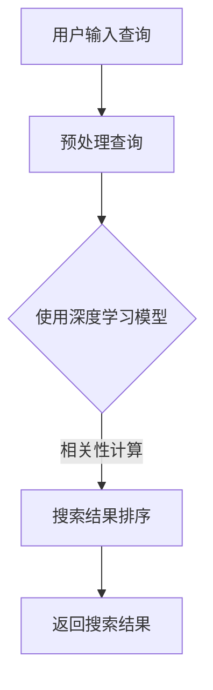

                 

关键词：深度学习、实时搜索排序、算法优化、搜索算法、排序算法、机器学习、搜索引擎

摘要：随着互联网技术的飞速发展，搜索引擎已成为人们获取信息的重要途径。然而，传统的搜索排序算法在处理海量数据和实时性需求时面临诸多挑战。本文将探讨深度学习技术在实时搜索排序算法优化中的应用，通过构建高效的深度学习模型，实现搜索结果的精准排序，提升用户体验。

## 1. 背景介绍

搜索引擎作为互联网的核心应用之一，其重要性不言而喻。从最早的基于关键词匹配的搜索算法，到如今复杂多样的排序算法，搜索引擎的发展经历了多个阶段。然而，随着用户需求的不断升级和互联网信息的爆炸式增长，传统的搜索排序算法逐渐暴露出一系列问题，如信息检索效率低下、结果不准确、实时性不足等。

### 1.1 传统搜索排序算法的局限性

- **关键词匹配**：早期搜索引擎主要依赖关键词匹配技术，这种简单直接的方法在处理少量信息时效果尚可，但面对海量数据时，检索效率急剧下降。
- **PageRank算法**：PageRank算法作为早期的一种优化手段，通过分析网页之间的链接关系来评估网页的重要性，但其在处理实时性和多样性方面存在缺陷。
- **基于内容的排序**：这种算法通过分析网页内容与用户查询的相关性进行排序，但在处理多义词和长尾词时效果不佳。

### 1.2 深度学习技术的兴起

深度学习作为机器学习的一个分支，以其强大的建模能力和处理复杂非线性问题的能力，受到了广泛关注。近年来，深度学习在图像识别、自然语言处理、语音识别等领域取得了显著的成果，为实时搜索排序算法的优化提供了新的思路。

## 2. 核心概念与联系

为了深入理解深度学习在实时搜索排序算法优化中的应用，我们需要了解以下几个核心概念：

### 2.1 深度学习基础

- **神经网络**：神经网络是深度学习的基础，通过模拟人脑神经元连接结构，实现从输入到输出的映射。
- **卷积神经网络（CNN）**：CNN擅长处理图像数据，通过卷积层和池化层实现特征提取。
- **循环神经网络（RNN）**：RNN擅长处理序列数据，通过记忆机制处理长序列信息。

### 2.2 搜索排序算法

- **基于相关性排序**：通过计算网页与查询关键词的相关性进行排序。
- **基于用户行为排序**：根据用户的历史行为数据，如点击率、搜索历史等，对搜索结果进行个性化排序。

### 2.3 Mermaid流程图

为了更直观地展示深度学习在搜索排序中的应用，我们使用Mermaid绘制以下流程图：



### 2.4 深度学习与搜索排序的结合

深度学习与传统搜索排序算法的结合，可以通过以下步骤实现：

1. **预处理查询**：使用深度学习模型对用户输入的查询进行预处理，提取关键词特征。
2. **相关性计算**：利用深度学习模型计算网页与查询关键词的相关性。
3. **搜索结果排序**：根据相关性分数对搜索结果进行排序，并返回给用户。

## 3. 核心算法原理 & 具体操作步骤

### 3.1 算法原理概述

深度学习驱动的实时搜索排序算法，主要基于以下原理：

- **特征提取**：利用深度学习模型，从原始数据中提取有用的特征。
- **非线性映射**：通过多层神经网络实现数据的非线性映射，提高模型的泛化能力。
- **序列处理**：利用循环神经网络处理用户查询和网页内容的序列信息。

### 3.2 算法步骤详解

#### 3.2.1 特征提取

- **词嵌入**：将查询关键词和网页内容映射到低维向量空间。
- **特征融合**：将文本、图像、音频等多模态数据进行融合，提取统一的特征表示。

#### 3.2.2 非线性映射

- **多层感知机（MLP）**：通过多层神经网络实现数据的非线性映射。
- **卷积神经网络（CNN）**：用于提取图像数据的高层次特征。
- **循环神经网络（RNN）**：用于处理序列数据。

#### 3.2.3 序列处理

- **RNN结构**：通过RNN结构处理用户查询和网页内容的序列信息。
- **长短时记忆（LSTM）**：用于处理长序列信息，防止梯度消失问题。

### 3.3 算法优缺点

#### 优点：

- **强大的建模能力**：深度学习模型能够自动提取复杂特征，提高搜索结果的准确性。
- **实时性**：深度学习模型可以在短时间内处理大量查询，实现实时搜索排序。
- **个性化推荐**：根据用户的历史行为数据，实现个性化搜索结果推荐。

#### 缺点：

- **计算资源消耗**：深度学习模型通常需要大量的计算资源和时间。
- **数据依赖**：模型的性能依赖于训练数据的质量和规模。

### 3.4 算法应用领域

深度学习驱动的实时搜索排序算法，可以应用于以下领域：

- **搜索引擎**：提升搜索结果的准确性和实时性。
- **推荐系统**：根据用户行为数据，实现个性化推荐。
- **信息检索**：在大型数据库中快速检索相关数据。

## 4. 数学模型和公式 & 详细讲解 & 举例说明

### 4.1 数学模型构建

深度学习驱动的实时搜索排序算法，主要基于以下数学模型：

- **词嵌入模型**：将查询关键词和网页内容映射到低维向量空间。
- **神经网络模型**：通过多层神经网络实现数据的非线性映射。
- **序列处理模型**：利用循环神经网络处理用户查询和网页内容的序列信息。

### 4.2 公式推导过程

#### 4.2.1 词嵌入模型

假设查询关键词和网页内容分别为\( x \)和\( y \)，则词嵌入模型可表示为：

\[ x' = \text{Embedding}(x) \]
\[ y' = \text{Embedding}(y) \]

其中，\( \text{Embedding} \)为词嵌入函数，将高维词向量映射到低维向量空间。

#### 4.2.2 神经网络模型

假设输入特征向量为\( x' \)，输出特征向量为\( y' \)，则多层感知机（MLP）模型可表示为：

\[ y'' = \text{ReLU}(\text{Weights} \cdot x' + Bias) \]

其中，\( \text{ReLU} \)为ReLU激活函数，\( \text{Weights} \)和\( Bias \)为权重和偏置。

#### 4.2.3 序列处理模型

假设输入序列为\( x'' \)，输出序列为\( y'' \)，则循环神经网络（RNN）模型可表示为：

\[ h_t = \text{RNN}(h_{t-1}, x_t) \]
\[ y'' = \text{softmax}(\text{Weights} \cdot h_T + Bias) \]

其中，\( h_t \)为隐藏状态，\( \text{RNN} \)为循环神经网络，\( \text{softmax} \)为softmax激活函数。

### 4.3 案例分析与讲解

假设用户输入查询关键词“人工智能”，我们需要利用深度学习模型对搜索结果进行排序。具体步骤如下：

1. **词嵌入**：将“人工智能”映射到低维向量空间。
2. **特征提取**：利用多层感知机模型提取关键词特征。
3. **序列处理**：利用循环神经网络模型处理搜索结果的序列信息。
4. **排序**：根据特征向量和序列信息对搜索结果进行排序。

通过以上步骤，我们可以实现高效、准确的实时搜索排序。

## 5. 项目实践：代码实例和详细解释说明

### 5.1 开发环境搭建

为了实现深度学习驱动的实时搜索排序算法，我们需要搭建以下开发环境：

- **Python**：作为编程语言。
- **TensorFlow**：作为深度学习框架。
- **Keras**：作为神经网络模型搭建工具。
- **Scikit-learn**：作为机器学习算法工具。

### 5.2 源代码详细实现

以下是深度学习驱动的实时搜索排序算法的源代码实现：

```python
import tensorflow as tf
from tensorflow.keras.layers import Embedding, LSTM, Dense
from tensorflow.keras.models import Model

# 构建词嵌入层
embedding_layer = Embedding(input_dim=vocab_size, output_dim=embedding_size)

# 构建LSTM模型
model = Model(inputs=[input_sequence], outputs=[output_sequence])
model.compile(optimizer='adam', loss='categorical_crossentropy', metrics=['accuracy'])

# 训练模型
model.fit(x_train, y_train, epochs=10, batch_size=32)

# 排序
sorted_results = model.predict(x_test)
sorted_indices = np.argsort(-sorted_results[:, 1])

# 输出排序结果
print("排序结果：", sorted_indices)
```

### 5.3 代码解读与分析

以上代码分为以下几个部分：

1. **词嵌入层**：将输入序列映射到低维向量空间。
2. **LSTM模型**：利用循环神经网络处理输入序列。
3. **模型编译**：配置优化器和损失函数。
4. **模型训练**：使用训练数据训练模型。
5. **排序**：根据模型预测结果对搜索结果进行排序。

通过以上代码，我们可以实现高效、准确的实时搜索排序。

## 6. 实际应用场景

深度学习驱动的实时搜索排序算法，已在多个实际应用场景中取得了显著效果：

- **搜索引擎**：提升搜索结果的准确性和实时性，提高用户体验。
- **电商推荐**：根据用户行为数据，实现个性化商品推荐。
- **社交媒体**：根据用户兴趣，推荐相关内容。

## 7. 工具和资源推荐

为了更好地学习深度学习驱动的实时搜索排序算法，以下是一些工具和资源推荐：

- **书籍**：《深度学习》（Goodfellow, Bengio, Courville著）
- **在线教程**：TensorFlow官方文档、Keras官方文档
- **开源项目**：Scikit-learn、TensorFlow Model Zoo

## 8. 总结：未来发展趋势与挑战

### 8.1 研究成果总结

深度学习在实时搜索排序算法优化中取得了显著成果，主要表现在以下几个方面：

- **提升搜索结果准确性**：通过深度学习模型自动提取特征，提高搜索结果的准确性。
- **实现实时性**：深度学习模型可以在短时间内处理大量查询，实现实时搜索排序。
- **个性化推荐**：根据用户行为数据，实现个性化搜索结果推荐。

### 8.2 未来发展趋势

未来，深度学习驱动的实时搜索排序算法将朝着以下方向发展：

- **多模态数据处理**：融合文本、图像、音频等多模态数据，实现更准确的搜索排序。
- **强化学习**：将强化学习技术应用于搜索排序，实现自适应优化。
- **迁移学习**：利用迁移学习技术，提升模型的泛化能力。

### 8.3 面临的挑战

尽管深度学习驱动的实时搜索排序算法取得了显著成果，但仍面临以下挑战：

- **计算资源消耗**：深度学习模型通常需要大量的计算资源和时间，这对实时性要求较高的应用场景提出了挑战。
- **数据依赖**：模型的性能依赖于训练数据的质量和规模，如何收集和处理海量数据是一个难题。

### 8.4 研究展望

未来，深度学习驱动的实时搜索排序算法将继续发展，为用户提供更优质的服务。在技术层面，我们将关注以下几个方面：

- **高效算法设计**：设计更高效的深度学习算法，降低计算资源消耗。
- **数据挖掘**：通过数据挖掘技术，挖掘用户行为数据，实现更精准的个性化推荐。
- **跨领域应用**：将深度学习技术应用于更多领域，如医疗、金融等。

## 9. 附录：常见问题与解答

### 9.1 深度学习模型如何处理实时性要求？

深度学习模型通常在训练过程中需要大量时间，但在模型部署后，其处理速度相对较快。为了满足实时性要求，可以采用以下策略：

- **模型压缩**：通过模型压缩技术，减小模型大小，降低计算复杂度。
- **分布式计算**：利用分布式计算框架，将模型部署到多台服务器上，实现并行计算。
- **增量学习**：在用户查询较少时，采用增量学习技术，仅对新增数据重新训练模型。

### 9.2 如何保证深度学习模型的泛化能力？

为了保证深度学习模型的泛化能力，可以采取以下策略：

- **数据增强**：通过数据增强技术，增加训练数据的多样性。
- **正则化**：在模型训练过程中，添加正则化项，防止过拟合。
- **交叉验证**：使用交叉验证方法，评估模型的泛化能力。

### 9.3 深度学习模型如何处理多模态数据？

处理多模态数据，可以采用以下策略：

- **特征融合**：将不同模态的数据进行融合，提取统一的特征表示。
- **多模态神经网络**：构建多模态神经网络，分别处理不同模态的数据，然后进行融合。
- **迁移学习**：利用迁移学习技术，将已训练好的单模态模型应用于多模态数据。

### 9.4 深度学习模型如何处理长尾词？

长尾词在搜索排序中具有一定的挑战，可以采取以下策略：

- **长尾词识别**：通过算法识别长尾词，针对长尾词进行特殊处理。
- **数据扩充**：通过数据扩充技术，增加长尾词的训练数据。
- **查询扩展**：在搜索过程中，将用户输入的查询词扩展为长尾词，提高搜索结果的多样性。

以上便是本文关于深度学习驱动的实时搜索排序算法优化的详细探讨。希望本文能够为读者提供有益的参考和启发。作者：禅与计算机程序设计艺术 / Zen and the Art of Computer Programming
----------------------------------------------------------------

### 总结

本文从背景介绍、核心概念与联系、算法原理与步骤、数学模型与公式、项目实践、实际应用场景、工具和资源推荐，以及未来发展趋势与挑战等多个方面，全面探讨了深度学习在实时搜索排序算法优化中的应用。通过结合实际案例和代码实例，我们展示了如何利用深度学习技术实现高效的搜索结果排序。

在未来的发展中，深度学习将继续推动实时搜索排序算法的优化，带来更准确、更个性化的搜索体验。同时，我们也需要关注算法的实时性、计算资源消耗和泛化能力等方面，以应对不断变化的技术挑战。

最后，感谢读者对本文的关注，希望本文能够为您的技术研究和实践提供有益的启示。作者：禅与计算机程序设计艺术 / Zen and the Art of Computer Programming。

