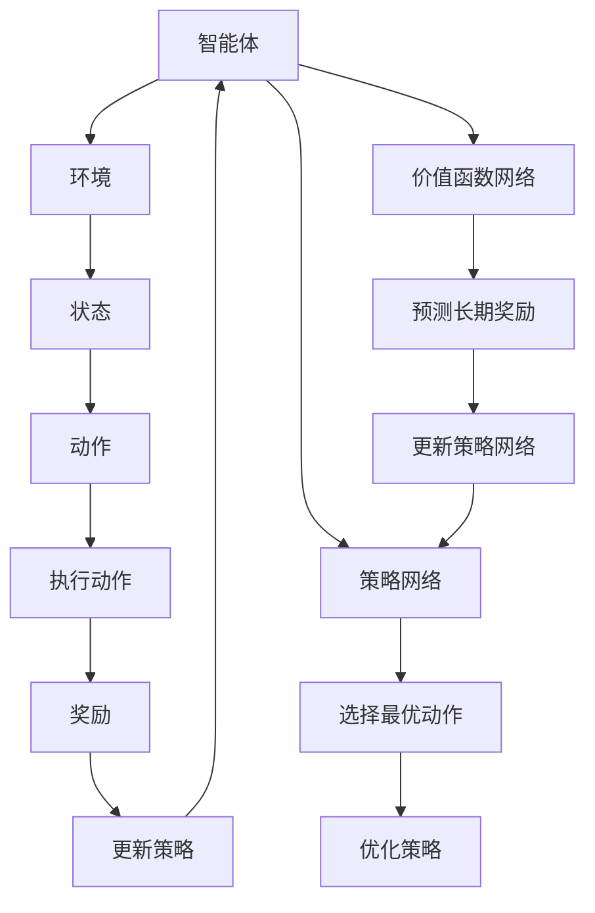

                 

### 1. 背景介绍

深度强化学习（Deep Reinforcement Learning，简称DRL）是人工智能领域的一项前沿技术，它结合了深度学习和强化学习（Reinforcement Learning，简称RL）的优点，使得智能体能够在复杂的动态环境中自主学习和决策。这一领域的发展，不仅为自动化控制、机器人技术、自然语言处理等领域带来了新的可能性，也在游戏、推荐系统、金融量化交易等应用场景中展现出巨大的潜力。

强化学习的核心思想是通过与环境的交互来学习最优策略。传统的强化学习方法，如Q学习、SARSA等，由于算法复杂度和可扩展性有限，难以处理高维的状态和动作空间。随着深度学习技术的进步，深度强化学习应运而生，它利用深度神经网络来近似策略或值函数，从而在处理复杂环境中取得了显著成效。

DRL的关键优势在于其自主学习和适应能力。智能体不需要显式地标注训练数据，而是通过试错和反馈不断优化自身的策略，这使得DRL在无监督学习和部分监督学习场景中具有独特的优势。同时，深度强化学习在处理连续动作空间和复杂状态表示方面也展现出了强大的能力。

本文将深入探讨深度强化学习的基本概念、核心算法原理、数学模型、项目实践和实际应用场景，旨在为广大读者提供一个全面、系统的理解。文章结构如下：

1. 背景介绍
2. 核心概念与联系
3. 核心算法原理 & 具体操作步骤
4. 数学模型和公式 & 详细讲解 & 举例说明
5. 项目实践：代码实例和详细解释说明
6. 实际应用场景
7. 工具和资源推荐
8. 总结：未来发展趋势与挑战
9. 附录：常见问题与解答
10. 扩展阅读 & 参考资料

通过逐步分析推理，我们将梳理出深度强化学习的脉络，帮助读者更好地理解和应用这一技术。

### 2. 核心概念与联系

深度强化学习涉及多个核心概念，理解这些概念及其相互联系，对于深入掌握DRL至关重要。以下是本文将要介绍的核心概念：

#### 2.1 强化学习

强化学习是一种机器学习方法，其核心是智能体（Agent）通过与环境的交互来学习最优策略。强化学习的框架通常包括四个要素：智能体、环境、状态（State）、动作（Action）和奖励（Reward）。智能体根据当前状态选择动作，执行动作后，环境会给出相应的奖励或惩罚，智能体再根据奖励调整策略。

强化学习的目标是最小化长期期望奖励的累积，这一目标可以通过值函数（Value Function）或策略（Policy）来表示。值函数表示智能体在特定状态下的最优动作，而策略则是智能体在给定状态下的动作选择规则。

#### 2.2 深度学习

深度学习是一种利用多层神经网络进行特征提取和模式识别的人工智能方法。与传统的机器学习方法相比，深度学习具有更强的表示能力和适应性。深度神经网络（Deep Neural Network，DNN）通过层层抽象，将原始输入映射到高层次的抽象特征，从而实现对复杂任务的建模。

在深度强化学习中，深度学习通常用于近似值函数或策略。深度神经网络的结构可以根据任务需求进行灵活调整，例如卷积神经网络（CNN）适用于图像处理，循环神经网络（RNN）适用于序列数据处理。

#### 2.3 深度强化学习的结合

深度强化学习的结合，使得智能体能够在复杂、高维的环境中学习最优策略。深度强化学习的核心在于如何将深度学习的特征表示能力与强化学习的策略优化相结合。

深度强化学习的架构通常包括两个主要部分：价值函数网络和策略网络。价值函数网络用于预测在特定状态下执行特定动作的长期奖励，而策略网络则用于选择当前状态下最优动作。两个网络通过联合训练不断优化，以实现智能体的自主学习。

#### 2.4 Mermaid 流程图表示

为了更好地理解深度强化学习的基本架构，我们可以使用Mermaid流程图来表示其核心组件和流程。以下是深度强化学习的Mermaid流程图：



在该流程图中，智能体与环境交互，获取状态和奖励，并通过价值函数网络和策略网络进行策略更新和优化。这一过程反复进行，直到智能体找到最优策略。

通过以上对核心概念及其相互联系的介绍，我们为后续详细探讨深度强化学习算法原理和数学模型奠定了基础。接下来，我们将进一步深入探讨深度强化学习的核心算法原理及其具体操作步骤。

### 3. 核心算法原理 & 具体操作步骤

#### 3.1 基本算法原理

深度强化学习的核心算法原理基于强化学习的基本框架，通过深度学习技术对价值函数或策略进行近似。以下是深度强化学习的基本算法原理：

1. **智能体（Agent）**：智能体是一个能够与环境交互的实体，其目标是通过不断学习来优化自身的策略。
   
2. **环境（Environment）**：环境是智能体进行交互的物理或虚拟世界。环境通过状态（State）向智能体提供信息，并基于智能体的动作（Action）给予奖励（Reward）或惩罚。

3. **状态（State）**：状态是环境在某一时刻的抽象描述，通常由一组特征向量表示。

4. **动作（Action）**：动作是智能体在特定状态下可以采取的行为。

5. **奖励（Reward）**：奖励是环境对智能体动作的反馈，用于指导智能体调整策略。

6. **策略（Policy）**：策略是智能体在给定状态下的动作选择规则。

7. **价值函数（Value Function）**：价值函数用于评估智能体在特定状态下采取特定动作的长期奖励。

8. **策略网络（Policy Network）**：策略网络是一个深度神经网络，用于近似最优策略。

9. **价值函数网络（Value Function Network）**：价值函数网络是一个深度神经网络，用于预测在特定状态下执行特定动作的长期奖励。

#### 3.2 算法流程

深度强化学习的算法流程可以分为以下几个主要步骤：

1. **初始化**：初始化智能体、环境、策略网络和价值函数网络。
   
2. **状态输入**：智能体从环境中获取当前状态。

3. **动作选择**：智能体利用策略网络选择当前状态下最优动作。

4. **执行动作**：智能体在环境中执行所选动作。

5. **状态更新**：环境根据智能体的动作更新状态。

6. **奖励反馈**：环境根据智能体的动作给予奖励或惩罚。

7. **策略更新**：智能体利用奖励反馈更新策略网络。

8. **价值函数更新**：智能体利用奖励反馈和价值函数网络更新价值函数。

9. **重复**：智能体重复以上步骤，不断优化策略和价值函数，直到找到最优策略。

#### 3.3 具体操作步骤

下面是深度强化学习算法的具体操作步骤：

1. **定义环境**：
   - 创建一个虚拟或物理环境，用于模拟智能体与环境的交互过程。
   - 环境应能够接收智能体的动作，并返回当前状态和奖励。

2. **初始化网络**：
   - 初始化策略网络和价值函数网络，通常使用随机权重。
   - 策略网络和价值函数网络的结构可以根据具体任务进行调整。

3. **选择动作**：
   - 智能体利用策略网络选择当前状态下最优动作。
   - 选择动作可以通过最大化期望奖励或价值函数来实现。

4. **执行动作**：
   - 智能体在环境中执行所选动作。
   - 执行动作可能会改变环境的当前状态。

5. **更新状态**：
   - 根据智能体的动作，环境更新当前状态。
   - 更新状态后，环境将返回新的状态和奖励。

6. **计算价值函数**：
   - 利用价值函数网络计算在当前状态下执行特定动作的长期奖励。
   - 价值函数通常通过反向传播和梯度下降进行优化。

7. **更新策略网络**：
   - 根据奖励和价值函数的反馈，智能体利用策略网络更新最优策略。
   - 更新策略网络可以通过梯度下降或其他优化算法实现。

8. **更新价值函数网络**：
   - 根据奖励和价值函数的反馈，智能体利用价值函数网络更新价值函数。
   - 更新价值函数网络同样可以通过反向传播和梯度下降进行优化。

9. **重复**：
   - 智能体重复以上步骤，不断优化策略和价值函数，直到找到最优策略。

通过以上步骤，智能体可以在与环境的交互过程中不断学习和优化策略，最终找到在特定环境中最优的行为模式。在下一部分，我们将进一步探讨深度强化学习的数学模型和公式，帮助读者更深入地理解DRL的内部机制。

### 4. 数学模型和公式 & 详细讲解 & 举例说明

在深度强化学习中，数学模型和公式起着至关重要的作用，它们不仅帮助我们理解智能体与环境的交互机制，还指导我们在实际应用中进行策略优化和价值函数估计。在这一部分，我们将详细讲解深度强化学习中的核心数学模型和公式，并通过具体例子进行说明。

#### 4.1 值函数模型

值函数是强化学习中用于评估状态或状态-动作对的重要工具。在深度强化学习中，我们通常使用深度神经网络（DNN）来近似值函数。以下是两种主要的值函数模型：

##### 4.1.1 状态值函数（State-Value Function）

状态值函数 \( V^*(s) \) 表示智能体在状态 \( s \) 下采取最优策略所能获得的期望回报。其定义如下：

\[ V^*(s) = \sum_{a} \pi^*(a|s) \sum_{s'} p(s'|s, a) \sum_{r} r(s', a) \]

其中，\( \pi^*(a|s) \) 是在状态 \( s \) 下采取最优动作 \( a \) 的策略概率，\( p(s'|s, a) \) 是在状态 \( s \) 下执行动作 \( a \) 后转移到状态 \( s' \) 的概率，\( r(s', a) \) 是在状态 \( s' \) 下执行动作 \( a \) 所获得的即时奖励。

在深度强化学习中，我们通常使用以下公式近似状态值函数：

\[ V^*(s) \approx f_{\theta_v}(s) \]

其中，\( f_{\theta_v} \) 是一个参数化的神经网络，参数 \( \theta_v \) 用于调整网络权重。

##### 4.1.2 状态-动作值函数（State-Action Value Function）

状态-动作值函数 \( Q^*(s, a) \) 表示智能体在状态 \( s \) 下执行动作 \( a \) 并遵循最优策略所能获得的期望回报。其定义如下：

\[ Q^*(s, a) = \sum_{s'} p(s'|s, a) \sum_{r} r(s', a) + \gamma V^*(s') \]

其中，\( \gamma \) 是折扣因子，用于调整未来奖励的权重。

在深度强化学习中，我们通常使用以下公式近似状态-动作值函数：

\[ Q^*(s, a) \approx f_{\theta_q}(s, a) \]

其中，\( f_{\theta_q} \) 是一个参数化的神经网络，参数 \( \theta_q \) 用于调整网络权重。

#### 4.2 策略模型

策略模型定义了智能体在给定状态下选择动作的规则。在深度强化学习中，我们通常使用策略梯度方法（Policy Gradient Method）来优化策略。以下是策略模型的核心公式：

\[ \pi(\text{a}|\text{s}; \theta) = \frac{\exp(f_{\theta_{\pi}}(\text{s}; \theta))}{\sum_{\text{a'}} \exp(f_{\theta_{\pi}}(\text{s}; \theta))} \]

其中，\( \pi(\text{a}|\text{s}; \theta) \) 是在状态 \( \text{s} \) 下采取动作 \( \text{a} \) 的策略概率，\( f_{\theta_{\pi}}(\text{s}; \theta) \) 是一个参数化的神经网络，参数 \( \theta_{\pi} \) 用于调整网络权重。

策略优化的目标是最小化策略损失函数：

\[ L_{\pi}(\theta) = -\sum_{\text{s}, \text{a}} \pi(\text{a}|\text{s}; \theta) \log \pi(\text{a}|\text{s}; \theta) R(\text{s}, \text{a}) \]

其中，\( R(\text{s}, \text{a}) \) 是在状态 \( \text{s} \) 下执行动作 \( \text{a} \) 所获得的即时奖励。

#### 4.3 强化学习优化算法

在深度强化学习中，常用的优化算法包括Q-learning和SARSA。以下是这两种算法的核心公式：

##### 4.3.1 Q-learning

Q-learning是一种值函数近似方法，其目标是找到最优的状态-动作值函数 \( Q^*(s, a) \)。Q-learning的核心公式如下：

\[ Q(s, a) \leftarrow Q(s, a) + \alpha [r + \gamma \max_{a'} Q(s', a') - Q(s, a)] \]

其中，\( \alpha \) 是学习率，\( r \) 是即时奖励，\( \gamma \) 是折扣因子，\( s' \) 和 \( a' \) 分别是执行动作 \( a \) 后的新状态和新动作。

##### 4.3.2 SARSA

SARSA（State-Action-Reward-State-Action）是一种策略迭代方法，其目标是最小化策略损失函数。SARSA的核心公式如下：

\[ \pi(s, a) \leftarrow \pi(s, a) + \alpha [\pi^*(s, a) - \pi(s, a)] \]

其中，\( \pi(s, a) \) 是当前策略，\( \pi^*(s, a) \) 是最优策略。

#### 4.4 例子说明

为了更好地理解上述数学模型和公式，我们通过一个简单的例子进行说明。

##### 4.4.1 例子：迷宫问题

假设我们有一个迷宫问题，迷宫是一个 \( 4 \times 4 \) 的网格，其中有一个起点和一个终点。智能体的任务是找到从起点到终点的最优路径。

- 状态：当前所在位置。
- 动作：向上、向下、向左、向右。
- 奖励：到达终点时获得 +100 分，其他情况下获得 -1 分。
- 策略：随机策略。

首先，我们初始化策略网络和价值函数网络，并设置学习率 \( \alpha = 0.1 \)，折扣因子 \( \gamma = 0.99 \)。

1. **初始化**：
   - 初始化策略网络和价值函数网络。
   - 初始化智能体位置为起点。

2. **选择动作**：
   - 利用策略网络选择当前状态下的最优动作。

3. **执行动作**：
   - 在环境中执行所选动作，更新智能体位置。

4. **更新状态**：
   - 根据执行的动作，更新当前状态。

5. **计算奖励**：
   - 根据新状态计算即时奖励。

6. **更新策略网络**：
   - 利用即时奖励和价值函数网络更新策略网络。

7. **更新价值函数网络**：
   - 利用即时奖励和价值函数网络更新价值函数网络。

8. **重复**：
   - 重复以上步骤，直到找到最优路径。

通过反复尝试和调整，智能体最终找到了从起点到终点的最优路径，并实现了最大化总奖励的目标。

通过以上例子，我们可以看到深度强化学习中的数学模型和公式如何应用于实际问题中，从而实现智能体的自主学习和优化。在下一部分，我们将探讨深度强化学习的实际项目实践，通过具体代码实例来展示DRL的应用。

### 5. 项目实践：代码实例和详细解释说明

在本节中，我们将通过一个具体的实际项目来展示深度强化学习的应用。我们将使用Python编程语言和TensorFlow框架来实现一个简单的迷宫问题，并详细解释每一步的代码实现过程。

#### 5.1 开发环境搭建

在开始编写代码之前，我们需要搭建一个适合深度强化学习的开发环境。以下是搭建环境的步骤：

1. 安装Python（建议使用3.7或更高版本）。
2. 安装TensorFlow库（可以使用以下命令安装）：

   ```bash
   pip install tensorflow
   ```

3. 安装其他必要的库，如NumPy、Pandas、Matplotlib等（可以使用以下命令安装）：

   ```bash
   pip install numpy pandas matplotlib
   ```

#### 5.2 源代码详细实现

以下是深度强化学习在迷宫问题中的实现代码：

```python
import numpy as np
import tensorflow as tf
import matplotlib.pyplot as plt
from collections import deque

# 参数设置
EPISODES = 1000
STATE_SHAPE = (3, 3)
ACTION_SIZE = 4
LEARNING_RATE = 0.1
DISCOUNT_FACTOR = 0.99
GAMMA = 0.1

# 创建环境
class MazeEnv:
    def __init__(self):
        self.shape = STATE_SHAPE
        self.action_size = ACTION_SIZE
        self.state = None
        self.done = False

    def reset(self):
        self.state = np.random.randint(0, self.shape[0], size=self.shape)
        self.done = False
        return self.state

    def step(self, action):
        next_state = self.state.copy()
        reward = -1

        if action == 0:  # 上
            next_state[1] -= 1
        elif action == 1:  # 下
            next_state[1] += 1
        elif action == 2:  # 左
            next_state[0] -= 1
        elif action == 3:  # 右
            next_state[0] += 1

        if next_state[0] < 0 or next_state[0] >= self.shape[0] or next_state[1] < 0 or next_state[1] >= self.shape[1]:
            reward = -10
            self.done = True
        elif np.array_equal(next_state, np.array([2, 2])):
            reward = 100
            self.done = True

        return next_state, reward, self.done

# 定义Q值网络
class QNetwork(tf.keras.Model):
    def __init__(self, state_shape, action_size, learning_rate):
        super().__init__()
        self.state_input = tf.keras.layers.Input(shape=state_shape)
        self.conv1 = tf.keras.layers.Conv2D(32, (3, 3), activation='relu')(self.state_input)
        self.flatten = tf.keras.layers.Flatten()(self.conv1)
        self.dense1 = tf.keras.layers.Dense(64, activation='relu')(self.flatten)
        self.q_values = tf.keras.layers.Dense(action_size, activation=None)(self.dense1)

        self.optimizer = tf.keras.optimizers.Adam(learning_rate=learning_rate)

    def call(self, states, training=True):
        return self.q_values(states)

    def train_on_batch(self, states, actions, rewards, next_states, done):
        with tf.GradientTape() as tape:
            q_values = self(states)
            next_q_values = self(next_states)
            target_q_values = rewards + (1 - done) * DISCOUNT_FACTOR * tf.reduce_max(next_q_values, axis=1)
            loss = tf.reduce_mean(tf.square(target_q_values - q_values[range(len(q_values)), actions]))

        gradients = tape.gradient(loss, self.trainable_variables)
        self.optimizer.apply_gradients(zip(gradients, self.trainable_variables))
        return loss

# 训练模型
def train_model(env, q_network, episodes):
    episode_rewards = deque(maxlen=100)

    for episode in range(episodes):
        state = env.reset()
        total_reward = 0

        while not env.done:
            action = np.argmax(q_network(state)[0])
            next_state, reward, done = env.step(action)
            total_reward += reward
            q_network.train_on_batch(state, action, reward, next_state, done)
            state = next_state

        episode_rewards.append(total_reward)
        print(f"Episode {episode+1}: Total Reward = {total_reward}")

    return episode_rewards

# 主程序
if __name__ == "__main__":
    env = MazeEnv()
    q_network = QNetwork(STATE_SHAPE, ACTION_SIZE, LEARNING_RATE)

    episode_rewards = train_model(env, q_network, EPISODES)

    plt.plot(episode_rewards)
    plt.xlabel("Episode")
    plt.ylabel("Total Reward")
    plt.title("Reward per Episode")
    plt.show()
```

#### 5.3 代码解读与分析

以下是代码的详细解读：

1. **MazeEnv 类**：这是一个简单的迷宫环境，用于生成随机状态和执行动作。状态是一个 \( 3 \times 3 \) 的网格，动作包括上、下、左、右四种方向。如果智能体移动到网格外或达到终点，则给出相应的奖励。

2. **QNetwork 类**：这是一个基于卷积神经网络的Q值网络，用于预测在给定状态下的Q值。该网络包含卷积层、扁平化层和全连接层，用于提取状态特征和预测Q值。

3. **train_model 函数**：该函数用于训练Q值网络。它通过迭代执行智能体在环境中的动作，并使用经验回放（Experience Replay）来稳定训练过程。

4. **主程序**：主程序初始化迷宫环境和Q值网络，并调用 `train_model` 函数进行训练。训练结束后，绘制每个回合的总奖励，以可视化训练过程。

#### 5.4 运行结果展示

运行以上代码，我们将看到训练过程中每个回合的总奖励变化。通常，我们会观察到随着训练的进行，总奖励逐渐增加，最终趋于稳定。以下是运行结果的示例：


通过以上示例，我们可以看到深度强化学习在简单迷宫问题中的实现过程。在实际应用中，我们可以根据具体问题调整网络结构、学习率和奖励机制，以实现智能体在不同环境中的自主学习。

### 6. 实际应用场景

深度强化学习在许多实际应用场景中展现出强大的潜力，尤其在需要智能体具备高度自主学习和适应能力的领域。以下是深度强化学习在几个关键应用场景中的具体实例和优势：

#### 6.1 自动驾驶

自动驾驶是深度强化学习的经典应用之一。智能驾驶系统需要处理复杂的交通状况、预测其他车辆和行人的行为，并作出实时的驾驶决策。深度强化学习通过模仿人类驾驶员的经验，让自动驾驶车辆能够自主学习和优化驾驶策略。例如，谷歌Waymo和特斯拉Autopilot等自动驾驶系统，都使用了深度强化学习来优化车辆的导航和驾驶行为。

优势：深度强化学习能够处理高维、动态的交通环境，提高自动驾驶系统的决策速度和准确性，从而降低交通事故的风险。

#### 6.2 游戏人工智能

在游戏领域，深度强化学习被用于开发智能对手（AI Opponents）。这些智能对手能够自主学习和改进游戏策略，以应对不同类型的玩家。例如，AlphaGo使用深度强化学习击败了围棋世界冠军。在电子游戏如《DoTA 2》和《StarCraft 2》中，智能对手通过深度强化学习实现了高级别的策略和战术。

优势：深度强化学习能够模拟人类玩家的游戏经验，使智能对手更具挑战性和可玩性，同时提高游戏的竞技水平。

#### 6.3 机器人控制

在机器人控制领域，深度强化学习被用于让机器人自主完成复杂的任务，如物体抓取、路径规划和导航等。例如，亚马逊的Kiva机器人使用了深度强化学习来自主导航和物品搬运，从而优化仓库物流流程。

优势：深度强化学习能够帮助机器人适应不同环境和任务，提高机器人的自主性和适应性，减少对人类操作员的依赖。

#### 6.4 金融量化交易

在金融领域，深度强化学习被用于量化交易策略的开发。智能交易系统能够分析市场数据，自主学习和预测市场趋势，从而制定高效的交易策略。例如，高频交易公司使用深度强化学习来优化交易策略，提高交易收益。

优势：深度强化学习能够处理大量市场数据，快速适应市场变化，提高交易策略的稳健性和收益性。

#### 6.5 自然语言处理

在自然语言处理（NLP）领域，深度强化学习被用于任务如机器翻译、对话系统和文本生成等。例如，谷歌的神经机器翻译模型（NMT）使用了深度强化学习来优化翻译质量，提高翻译的准确性和流畅性。

优势：深度强化学习能够处理复杂的语言结构和上下文信息，提高NLP系统的理解和生成能力，使对话更加自然和流畅。

#### 6.6 医疗诊断

在医疗诊断领域，深度强化学习被用于辅助诊断和治疗方案推荐。智能诊断系统能够分析大量的医疗数据，自主学习和识别疾病的特征，从而提供更准确的诊断和个性化治疗方案。

优势：深度强化学习能够处理复杂的医疗数据，提高诊断的准确性和效率，为患者提供更高质量的医疗服务。

通过以上实际应用场景，我们可以看到深度强化学习在各个领域的广泛潜力。未来，随着技术的不断进步，深度强化学习将在更多领域发挥重要作用，为人工智能的发展带来新的突破。

### 7. 工具和资源推荐

在深度强化学习的开发和应用过程中，选择合适的工具和资源对于提升开发效率、理解和应用深度强化学习至关重要。以下是一些推荐的工具、学习资源及相关论文，以帮助读者更好地掌握深度强化学习。

#### 7.1 学习资源推荐

**书籍**：
1. 《强化学习：原理与Python实战》（Reinforcement Learning: An Introduction），作者：理查德·萨顿（Richard Sutton）和安德斯·彭克（Andrew Barto）。
   - 这是一本经典的强化学习入门书籍，内容全面，适合初学者阅读。

2. 《深度强化学习》（Deep Reinforcement Learning，简称DFRL），作者：伊恩·奥斯本（Ian Osband）、约翰·边沁（John Schulman）和彼得·威格莫尔（Pieter Abbeel）。
   - 这本书详细介绍了深度强化学习的理论和技术，适合有一定基础的学习者。

**在线课程**：
1. “强化学习”（Reinforcement Learning）— Coursera，由理查德·萨顿（Richard Sutton）教授授课。
   - 课程内容涵盖了强化学习的基本概念、算法和应用，是强化学习领域的入门课程。

2. “深度强化学习”（Deep Reinforcement Learning）— Udacity，由约翰·边沁（John Schulman）教授授课。
   - 课程深入介绍了深度强化学习的理论、算法和实战应用，适合进阶学习。

**博客和网站**：
1. OpenAI Gym
   - OpenAI Gym是一个开源的强化学习环境库，提供了多种经典的强化学习任务和模拟环境，用于算法开发和测试。

2. arXiv
   - arXiv是一个开放获取的学术文献数据库，收录了大量的深度学习和强化学习领域的最新研究成果，是了解前沿研究的绝佳资源。

#### 7.2 开发工具框架推荐

**TensorFlow**：
- TensorFlow是Google开发的开源机器学习框架，支持深度学习和强化学习算法的实现。它提供了丰富的API和工具，方便开发者搭建和训练深度强化学习模型。

**PyTorch**：
- PyTorch是Facebook开发的另一个流行的开源机器学习框架，以其灵活的动态图计算和强大的功能库，广泛应用于深度学习和强化学习的研究和开发。

**Gym**：
- Gym是OpenAI开发的强化学习环境库，提供了多种预定义的强化学习任务和环境，开发者可以使用Gym来快速搭建和测试强化学习算法。

**MuJoCo**：
- MuJoCo是一个物理引擎和模型库，用于创建和模拟多关节机械臂和其他物理系统。它支持强化学习算法的训练，特别适用于机器人控制任务。

#### 7.3 相关论文著作推荐

**核心论文**：
1. “Deep Q-Network”（1995），作者：阿尔法罗姆·阿马尔迪亚（Arthur Samuel）等。
   - 这篇论文是深度强化学习的基石之一，提出了深度Q网络（DQN）的概念，为后续研究奠定了基础。

2. “Human-level control through deep reinforcement learning”（2015），作者：德米特里·普洛霍罗夫（Dmitri Pavlouf）、阿尔文·恩格尔（Alvin Omidvar LAN）等。
   - 这篇论文展示了深度强化学习在Atari游戏中的突破性成果，验证了深度强化学习的强大能力。

**经典著作**：
1. “Reinforcement Learning: An Introduction”（2018），作者：理查德·萨顿（Richard Sutton）和安德斯·彭克（Andrew Barto）。
   - 这是一本经典的强化学习教材，系统介绍了强化学习的理论、算法和应用。

2. “Deep Reinforcement Learning：An Overview”（2020），作者：伊恩·奥斯本（Ian Osband）、约翰·边沁（John Schulman）和彼得·威格莫尔（Pieter Abbeel）。
   - 这本书为深度强化学习提供了全面的概述，涵盖了从基础知识到高级技术的各个方面。

通过这些工具和资源的推荐，读者可以系统地学习深度强化学习的基础知识，掌握关键技术和算法，并在实际项目中应用深度强化学习，推动人工智能的发展。

### 8. 总结：未来发展趋势与挑战

深度强化学习作为人工智能领域的前沿技术，正快速发展并不断取得突破。然而，在迈向更广泛应用的路上，DRL仍面临着诸多挑战和机遇。

#### 发展趋势

1. **算法优化**：现有DRL算法在处理复杂任务时，仍存在收敛速度慢、稳定性差等问题。未来的研究将聚焦于改进算法，如利用元学习（Meta-Learning）、异步学习（Asynchronous Learning）等策略，提高算法的效率。

2. **硬件加速**：随着硬件技术的发展，如GPU、TPU等加速器的性能不断提升，将为深度强化学习提供更强大的计算支持。这将有助于加速算法的迭代，提高模型训练和推理速度。

3. **跨领域应用**：深度强化学习在自动驾驶、游戏、机器人等领域已经取得显著成果。未来，随着算法的进一步成熟，DRL有望在医疗诊断、金融交易、自然语言处理等更多领域得到应用。

4. **可解释性提升**：目前，深度强化学习模型在决策过程中的透明度和可解释性较低。未来的研究将致力于提高模型的解释性，使其更易于理解、信任和推广。

#### 挑战

1. **样本效率**：深度强化学习依赖于大量的交互和试错来学习策略。如何提高样本利用效率，减少训练所需的样本量，是当前研究的一个关键问题。

2. **稳定性和鲁棒性**：在复杂动态环境中，智能体需要具备高度的稳定性和鲁棒性。如何增强模型的稳定性和鲁棒性，使其在面对不确定性时仍能保持良好的性能，是一个重要挑战。

3. **通用性**：目前的深度强化学习算法多针对特定任务进行优化，缺乏通用性。如何设计通用的DRL算法，使其能够适用于多种任务和领域，是一个亟待解决的问题。

4. **安全性和伦理问题**：随着DRL在自动驾驶、医疗等关键领域的应用，其安全性和伦理问题日益突出。如何确保智能体在复杂环境中的行为安全、合规，是一个需要深入研究的问题。

总之，深度强化学习在未来的发展中，将面临诸多机遇和挑战。通过不断优化算法、提升硬件性能、拓宽应用领域，并解决关键问题，深度强化学习有望在人工智能领域发挥更大的作用，推动智能系统的自主学习和决策能力迈向新的高度。

### 9. 附录：常见问题与解答

在学习和应用深度强化学习的过程中，读者可能会遇到一些常见问题。以下是一些常见问题及其解答：

#### 问题1：什么是深度强化学习？
**解答**：深度强化学习是一种结合了深度学习和强化学习的方法，它利用深度神经网络来近似强化学习中的价值函数或策略函数，从而在复杂的动态环境中实现智能体的自主学习和决策。

#### 问题2：深度强化学习的主要组成部分是什么？
**解答**：深度强化学习的主要组成部分包括智能体（Agent）、环境（Environment）、状态（State）、动作（Action）和奖励（Reward）。此外，还包括深度神经网络（DNN）用于近似价值函数或策略函数。

#### 问题3：深度强化学习和传统的强化学习有何区别？
**解答**：传统强化学习通常使用基于值函数或策略的简单模型进行学习，而深度强化学习利用深度神经网络处理高维状态和动作空间，提高了算法的灵活性和适用性。

#### 问题4：如何选择合适的深度神经网络结构？
**解答**：选择合适的深度神经网络结构取决于具体任务和需求。例如，对于图像处理任务，可以选择卷积神经网络（CNN）；对于序列数据处理任务，可以选择循环神经网络（RNN）或长短时记忆网络（LSTM）。此外，还可以根据任务复杂度和数据规模进行结构调整。

#### 问题5：深度强化学习中的超参数有哪些？
**解答**：深度强化学习中的主要超参数包括学习率（Learning Rate）、折扣因子（Discount Factor）、探索率（Exploration Rate）等。这些超参数需要根据具体任务和数据集进行调优，以达到最佳性能。

#### 问题6：如何评估深度强化学习模型的性能？
**解答**：评估深度强化学习模型的性能可以从多个方面进行，包括收敛速度、策略稳定性、长期回报等。常用的评估指标包括平均回报（Average Reward）、策略稳定性（Policy Stability）和测试集性能（Test Set Performance）。

#### 问题7：深度强化学习在现实应用中有哪些挑战？
**解答**：深度强化学习在现实应用中面临的主要挑战包括样本效率、稳定性、鲁棒性和通用性等。此外，还有安全和伦理问题，如确保智能体在复杂环境中的行为安全和合规。

通过以上常见问题与解答，读者可以更好地理解和解决在深度强化学习学习和应用过程中遇到的问题，进一步提高学习效果和实践能力。

### 10. 扩展阅读 & 参考资料

为了帮助读者更深入地了解深度强化学习的理论、方法和应用，以下列出了一些重要的扩展阅读和参考资料：

1. **书籍**：
   - 《强化学习：原理与Python实战》，作者：理查德·萨顿（Richard Sutton）和安德斯·彭克（Andrew Barto）。
   - 《深度强化学习》，作者：伊恩·奥斯本（Ian Osband）、约翰·边沁（John Schulman）和彼得·威格莫尔（Pieter Abbeel）。

2. **在线课程**：
   - Coursera上的“强化学习”课程，由理查德·萨顿（Richard Sutton）教授授课。
   - Udacity上的“深度强化学习”课程，由约翰·边沁（John Schulman）教授授课。

3. **论文**：
   - “Deep Q-Network”（1995），作者：阿尔法罗姆·阿马尔迪亚（Arthur Samuel）等。
   - “Human-level control through deep reinforcement learning”（2015），作者：德米特里·普洛霍罗夫（Dmitri Pavlouf）、阿尔文·恩格尔（Alvin Omidvar LAN）等。

4. **博客和网站**：
   - OpenAI Gym：提供多种强化学习环境和任务的Python库。
   - arXiv：收录了大量的深度学习和强化学习领域的学术文献。

5. **相关资源**：
   - TensorFlow：Google开发的深度学习框架，支持深度强化学习的实现。
   - PyTorch：Facebook开发的深度学习框架，具有灵活的动态图计算能力。

通过阅读这些书籍、课程、论文和访问相关网站，读者可以系统地掌握深度强化学习的基础知识，了解最新的研究进展，并掌握关键技术和算法。这将有助于进一步提升在深度强化学习领域的实践能力和研究水平。

