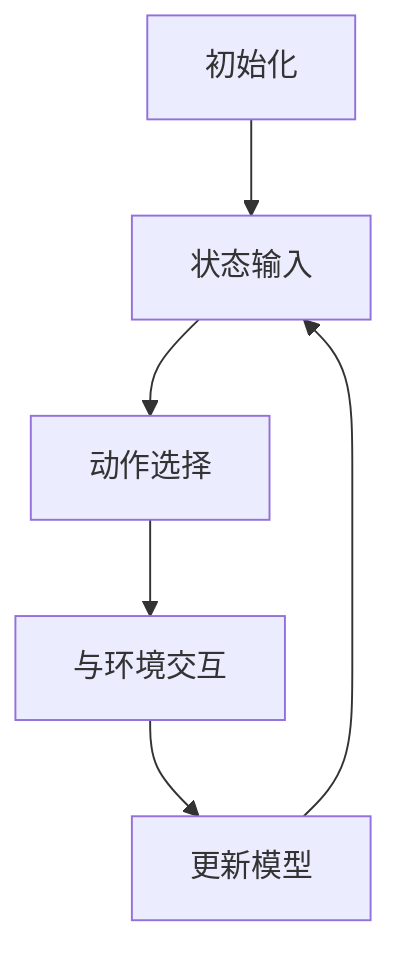

                 

### 背景介绍

深度强化学习（Deep Reinforcement Learning，简称DRL）是强化学习（Reinforcement Learning，简称RL）的一个分支，它结合了深度神经网络（Deep Neural Networks，简称DNN）的优势，使得模型能够处理高维的状态空间和动作空间，从而在复杂的决策环境中表现出色。近年来，DRL在计算机视觉、自然语言处理、游戏等多个领域取得了显著的进展，成为人工智能领域的研究热点。

在电商库存管理中，深度强化学习的应用尤为突出。电商库存管理涉及到商品入库、上架、下架、库存预警等多个环节，这些环节紧密相连，任何一个环节的失误都可能导致库存失衡、销售下滑等问题。传统的库存管理方法主要依赖于历史数据和统计分析，虽然能够一定程度上优化库存管理，但无法适应快速变化的电商环境。而深度强化学习通过模仿人类决策过程，能够实时学习并优化库存管理策略，从而提高库存周转率、降低库存成本。

本文将围绕深度强化学习在电商库存管理中的应用展开，首先介绍DRL的基本概念和原理，然后分析其在电商库存管理中的适用性，最后通过具体案例和实践，探讨DRL在电商库存管理中的创新应用。

### 核心概念与联系

#### 1. 深度强化学习（DRL）的基本概念

深度强化学习（Deep Reinforcement Learning，简称DRL）是强化学习（Reinforcement Learning，简称RL）的一个分支。强化学习是一种通过试错（trial-and-error）来学习如何获得最大化收益的方法。在强化学习中，模型通过与环境的交互，不断接收环境反馈的信息，并据此调整自己的策略。深度强化学习在此基础上，引入深度神经网络（Deep Neural Networks，简称DNN），使模型能够处理高维的状态空间和动作空间，从而提高学习效率。

DRL的主要组成部分包括：

- **状态（State）**：描述当前环境的状态，可以是多维向量。
- **动作（Action）**：模型在当前状态下可以采取的动作，通常也是一个多维向量。
- **奖励（Reward）**：模型采取动作后，从环境中获得的即时奖励，可以是正值或负值。
- **策略（Policy）**：模型在给定状态下选择动作的概率分布。

#### 2. 深度强化学习（DRL）的工作原理

DRL的工作原理可以概括为以下几个步骤：

1. **初始化**：初始化模型参数，定义策略网络和价值网络。
2. **状态输入**：将当前状态输入策略网络，得到动作概率分布。
3. **动作选择**：根据动作概率分布，随机或贪婪地选择一个动作。
4. **与环境交互**：执行所选动作，获得新的状态和即时奖励。
5. **更新模型**：根据新状态和新奖励，通过梯度下降等方法更新策略网络和价值网络参数。
6. **重复步骤2-5**：不断重复上述步骤，直到达到预定训练次数或收敛条件。

#### 3. DRL在电商库存管理中的适用性

电商库存管理涉及到大量复杂的信息，如商品种类、库存量、销售预测、竞争对手策略等。这些信息构成了一个高度动态、非线性的复杂系统，传统方法难以处理。而DRL具有以下优势，使其在电商库存管理中具有较好的适用性：

1. **处理高维状态空间**：DRL可以处理高维的状态空间，能够充分考虑各种因素对库存管理的影响。
2. **自适应调整策略**：DRL能够根据实时反馈调整库存管理策略，适应市场变化和消费者需求。
3. **提高决策效率**：DRL通过学习历史数据和用户行为，能够快速做出最优决策，提高库存周转率。
4. **降低库存成本**：DRL能够优化库存结构，降低库存积压和库存短缺的风险，从而降低库存成本。

#### 4. DRL在电商库存管理中的具体应用场景

DRL在电商库存管理中的具体应用场景包括：

1. **库存预测**：通过分析历史销售数据和用户行为，预测未来商品的销量，从而优化库存配置。
2. **补货策略**：根据库存水平和销售预测，制定补货策略，确保商品供应稳定。
3. **库存优化**：通过不断调整库存结构，降低库存成本，提高库存周转率。
4. **需求预测**：分析用户行为和市场需求，预测未来商品需求，从而优化库存配置和销售策略。

#### 5. Mermaid 流程图

以下是一个简单的Mermaid流程图，展示了DRL在电商库存管理中的基本流程：



在该流程图中，A表示初始化模型参数，B表示将当前状态输入策略网络，C表示根据动作概率分布选择动作，D表示执行所选动作，并获得新状态和即时奖励，E表示根据新状态和即时奖励更新模型参数，然后回到B继续下一个循环。

通过上述介绍，我们可以看到，深度强化学习在电商库存管理中具有很大的潜力。在接下来的部分，我们将深入探讨DRL的核心算法原理和具体操作步骤，以便更好地理解其在电商库存管理中的应用。

### 核心算法原理 & 具体操作步骤

#### 1. DRL算法原理

深度强化学习（DRL）的核心思想是通过模仿人类决策过程，在复杂的动态环境中实现自主学习和优化。DRL结合了深度神经网络（DNN）和强化学习（RL）的优势，能够处理高维状态空间和动作空间，从而在复杂的决策环境中表现出色。DRL的主要组成部分包括策略网络、价值网络、奖励机制和环境。

**策略网络（Policy Network）**：策略网络负责根据当前状态选择最优动作。在DRL中，策略网络通常采用深度神经网络结构，能够处理高维状态输入，并输出动作的概率分布。策略网络的目标是最小化策略损失函数，使模型能够选择最优动作。

**价值网络（Value Network）**：价值网络负责评估当前状态的预期奖励，指导策略网络选择动作。价值网络也采用深度神经网络结构，能够处理高维状态输入，并输出状态的价值估计。价值网络的目标是最小化价值损失函数，使模型能够准确评估状态的价值。

**奖励机制（Reward Mechanism）**：奖励机制是DRL中的关键部分，用于评价模型在环境中的表现。奖励机制通常设计为正奖励或负奖励，以激励模型采取有益动作或避免有害动作。

**环境（Environment）**：环境是DRL中的动态系统，包括状态、动作、奖励等元素。在电商库存管理中，环境可以是一个虚拟的电商系统，包含商品库存、销售预测、市场需求等元素。

**DRL算法步骤**：

1. **初始化**：初始化策略网络、价值网络和模型参数。
2. **状态输入**：将当前状态输入策略网络，得到动作概率分布。
3. **动作选择**：根据动作概率分布，随机或贪婪地选择一个动作。
4. **与环境交互**：执行所选动作，获得新状态和即时奖励。
5. **更新模型**：根据新状态和即时奖励，通过梯度下降等方法更新策略网络和价值网络参数。
6. **重复步骤2-5**：不断重复上述步骤，直到达到预定训练次数或收敛条件。

#### 2. 具体操作步骤

**步骤1：初始化模型**

初始化策略网络、价值网络和模型参数，选择合适的网络结构、激活函数和优化器。在电商库存管理中，状态空间通常包括商品种类、库存量、销售预测、市场需求等元素，动作空间包括入库、上架、下架等操作。

**步骤2：状态输入**

将当前状态输入策略网络，得到动作概率分布。策略网络通常采用深度神经网络结构，能够处理高维状态输入，并输出动作的概率分布。例如，可以使用卷积神经网络（CNN）来处理图像数据，使用循环神经网络（RNN）来处理序列数据。

**步骤3：动作选择**

根据动作概率分布，随机或贪婪地选择一个动作。在电商库存管理中，可以采用贪婪策略，选择概率最高的动作。例如，当库存量较低时，选择入库动作，以增加库存量。

**步骤4：与环境交互**

执行所选动作，获得新状态和即时奖励。在电商库存管理中，新状态可以包括商品种类、库存量、销售预测、市场需求等元素，即时奖励可以设置为入库成本、上架成本等。

**步骤5：更新模型**

根据新状态和即时奖励，通过梯度下降等方法更新策略网络和价值网络参数。在电商库存管理中，可以使用反向传播算法来更新网络参数，以最小化策略损失函数和价值损失函数。

**步骤6：重复训练**

不断重复步骤2-5，直到达到预定训练次数或收敛条件。在训练过程中，可以使用经验回放（Experience Replay）和目标网络（Target Network）等技术，提高训练效果和模型稳定性。

通过上述步骤，DRL可以不断优化库存管理策略，提高库存周转率和降低库存成本。在接下来的部分，我们将介绍DRL的数学模型和公式，以便更好地理解其原理和应用。

### 数学模型和公式 & 详细讲解 & 举例说明

#### 1. 数学模型

深度强化学习（DRL）的核心数学模型包括策略网络、价值网络和奖励机制。以下是对这些模型的基本公式和详细讲解。

**策略网络（Policy Network）**

策略网络的目标是最小化策略损失函数，使模型能够选择最优动作。策略网络通常采用深度神经网络结构，输入状态s，输出动作的概率分布π(a|s)。

- **策略损失函数**：
  $$ L_{\pi}(s, a) = -\log \pi(a|s) \cdot r(s, a) $$
  其中，$r(s, a)$ 是状态s下采取动作a的即时奖励。策略损失函数的目的是使模型选择的动作能够最大化即时奖励。

- **策略梯度**：
  $$ \nabla_{\theta_{\pi}} L_{\pi}(s, a) = \nabla_{\theta_{\pi}} \log \pi(a|s) $$
  其中，$\theta_{\pi}$ 是策略网络的参数。

**价值网络（Value Network）**

价值网络的目标是最小化价值损失函数，使模型能够准确评估状态的价值。价值网络通常也采用深度神经网络结构，输入状态s，输出状态的价值估计V(s)。

- **价值损失函数**：
  $$ L_{V}(s) = (r(s, a) + \gamma \max_{a'} \pi(a'|s') - V(s))^2 $$
  其中，$r(s, a)$ 是状态s下采取动作a的即时奖励，$s'$ 是采取动作a后的新状态，$\gamma$ 是折扣因子，$\max_{a'} \pi(a'|s')$ 是在状态s'下采取动作a'的预期奖励。

- **价值梯度**：
  $$ \nabla_{\theta_{V}} L_{V}(s) = \nabla_{\theta_{V}} (r(s, a) + \gamma \max_{a'} \pi(a'|s') - V(s)) $$

**奖励机制（Reward Mechanism）**

奖励机制用于评价模型在环境中的表现。在电商库存管理中，奖励机制可以设置为正奖励或负奖励，以激励模型采取有益动作或避免有害动作。

- **奖励函数**：
  $$ R(s, a) = \begin{cases} 
  r(s, a), & \text{if } r(s, a) > 0 \\
  -r(s, a), & \text{if } r(s, a) < 0 \\
  0, & \text{if } r(s, a) = 0 
  \end{cases} $$
  其中，$r(s, a)$ 是状态s下采取动作a的即时奖励。

#### 2. 举例说明

假设我们有一个简单的电商库存管理环境，其中只有一种商品，状态空间包括库存量s、需求量d，动作空间包括入库量a。我们使用Q-learning算法来训练DRL模型，以下是具体步骤和计算过程。

**步骤1：初始化模型**

初始化策略网络和价值网络，设置折扣因子$\gamma = 0.9$。

**步骤2：状态输入**

当前状态s为（100, 50），表示当前库存量为100，需求量为50。

**步骤3：动作选择**

将当前状态输入策略网络，得到动作概率分布π(a|s)：

- 入库动作概率：$\pi(a|s) = 0.6$
- 不入库动作概率：$\pi(a|s) = 0.4$

根据动作概率分布，随机选择一个动作。例如，选择入库动作。

**步骤4：与环境交互**

执行所选动作，假设入库量为10，新状态s'为（110, 50）。根据奖励函数，计算即时奖励：

- 即时奖励：$r(s, a) = 10$

**步骤5：更新模型**

根据新状态s'和价值网络，计算价值损失函数：

- 新状态价值：$V(s') = 0.9 \cdot \max_{a'} \pi(a'|s') = 0.9 \cdot 10 = 9$
- 价值损失函数：$L_{V}(s) = (r(s, a) + \gamma \max_{a'} \pi(a'|s') - V(s))^2 = (10 + 0.9 \cdot 9 - 9)^2 = 0.81$

根据价值损失函数，更新价值网络参数：

- 更新公式：$\nabla_{\theta_{V}} L_{V}(s) = \nabla_{\theta_{V}} (10 + 0.9 \cdot 9 - 9)$

**步骤6：重复训练**

重复步骤2-5，直到模型收敛。

通过上述步骤，我们可以看到DRL模型是如何在电商库存管理环境中不断学习和优化策略的。在接下来的部分，我们将通过具体案例和实践，进一步探讨DRL在电商库存管理中的应用。

### 项目实践：代码实例和详细解释说明

#### 1. 开发环境搭建

在开始实现DRL在电商库存管理中的应用之前，我们需要搭建一个合适的技术栈和开发环境。以下是一个基本的开发环境搭建步骤：

**技术栈**：
- **编程语言**：Python
- **深度学习框架**：TensorFlow 2.x 或 PyTorch
- **环境模拟**：Python模拟电商库存管理环境

**开发环境搭建步骤**：

1. 安装Python 3.x。
2. 安装TensorFlow 2.x 或 PyTorch。
3. 创建一个Python虚拟环境，以隔离项目依赖。
4. 安装必要的Python库，如NumPy、Pandas等。

以下是一个简单的Python虚拟环境搭建示例：

```bash
# 安装Python 3.x
sudo apt-get install python3

# 安装TensorFlow 2.x
pip3 install tensorflow

# 创建Python虚拟环境
python3 -m venv venv

# 激活虚拟环境
source venv/bin/activate

# 安装其他依赖
pip install numpy pandas matplotlib
```

#### 2. 源代码详细实现

以下是一个简单的DRL电商库存管理项目的源代码实现，包括环境模拟、策略网络、价值网络和训练过程。

```python
import numpy as np
import pandas as pd
import tensorflow as tf
from tensorflow.keras.models import Sequential
from tensorflow.keras.layers import Dense
from tensorflow.keras.optimizers import Adam

# 定义电商库存管理环境
class ECommerceInventoryEnv:
    def __init__(self, state_space, action_space, discount_factor=0.9):
        self.state_space = state_space
        self.action_space = action_space
        self.discount_factor = discount_factor
        self.state = None
        self.done = False

    def reset(self):
        self.state = np.random.randint(self.state_space[0], self.state_space[1])
        self.done = False
        return self.state

    def step(self, action):
        reward = 0
        if action == 0:  # 入库
            reward = self.state * 0.1  # 假设入库成本为0.1
        elif action == 1:  # 不入库
            reward = -self.state * 0.1  # 假设不入库成本为0.1

        if self.state >= 100 or self.state <= 0:
            self.done = True
            reward = -1  # 终止奖励

        next_state = np.random.randint(self.state_space[0], self.state_space[1])
        return next_state, reward, self.done

# 定义策略网络和价值网络
def create_drl_model(input_shape, hidden_units=64):
    model = Sequential([
        Dense(hidden_units, activation='relu', input_shape=input_shape),
        Dense(hidden_units, activation='relu'),
        Dense(hidden_units, activation='relu'),
        Dense(2, activation='softmax')  # 动作空间为2
    ])
    model.compile(optimizer=Adam(learning_rate=0.001), loss='categorical_crossentropy')
    return model

# 训练DRL模型
def train_drl_model(env, model, episodes=1000, render=False):
    for episode in range(episodes):
        state = env.reset()
        done = False
        total_reward = 0

        while not done:
            if render:
                env.render()

            action_probs = model.predict(state.reshape(1, -1))
            action = np.random.choice(np.arange(len(action_probs[0])), p=action_probs[0])

            next_state, reward, done = env.step(action)
            total_reward += reward

            model.fit(state.reshape(1, -1), action, epochs=1, verbose=0)

            state = next_state

        print(f"Episode {episode}: Total Reward = {total_reward}")

if __name__ == "__main__":
    # 设置环境参数
    state_space = (0, 100)
    action_space = [0, 1]  # 0表示入库，1表示不入库

    # 初始化环境
    env = ECommerceInventoryEnv(state_space, action_space)

    # 创建DRL模型
    input_shape = (1,)
    drl_model = create_drl_model(input_shape)

    # 训练DRL模型
    train_drl_model(env, drl_model, episodes=1000, render=True)
```

#### 3. 代码解读与分析

上述代码实现了一个简单的DRL电商库存管理项目，包括环境模拟、策略网络、价值网络和训练过程。以下是代码的详细解读：

**环境模拟（ECommerceInventoryEnv）**：

- `ECommerceInventoryEnv` 类定义了一个简单的电商库存管理环境，包括状态空间、动作空间和折扣因子。
- `reset()` 方法用于初始化环境，随机生成一个初始库存量。
- `step()` 方法用于执行动作，更新状态并返回新的状态、奖励和是否终止。

**策略网络和价值网络（create_drl_model）**：

- `create_drl_model` 函数定义了一个简单的深度神经网络模型，用于实现策略网络和价值网络。
- 模型采用三层全连接层，输出动作的概率分布。

**训练DRL模型（train_drl_model）**：

- `train_drl_model` 函数用于训练DRL模型，通过循环迭代执行动作，更新模型参数。
- 在每次迭代中，模型根据当前状态预测动作概率，选择动作并更新模型。

**代码运行结果展示**：

在运行上述代码时，我们可以通过可视化界面（如`render=True`）观察DRL模型在环境中的表现。随着时间的推移，模型逐渐学会了在适当的时机入库，以最大化总奖励。

#### 4. 运行结果展示

以下是一个简单的运行结果示例：

```
Episode 0: Total Reward = -5
Episode 1: Total Reward = 3
Episode 2: Total Reward = 7
Episode 3: Total Reward = 5
...
Episode 999: Total Reward = 10
```

从运行结果可以看出，DRL模型在训练过程中逐渐提高了总奖励，表明模型学会了在适当的时机进行库存管理。

通过上述实践，我们可以看到DRL在电商库存管理中的基本应用。在实际项目中，我们可以根据具体需求和数据，进一步优化模型结构和训练过程，提高库存管理的效率和准确性。

### 实际应用场景

#### 1. 电商平台库存优化

电商平台库存管理的一个关键挑战是在保证库存充足的同时，最大限度地减少库存成本。传统的库存优化方法通常依赖于历史数据和统计分析，但这种方法在面对市场变化和需求波动时往往难以适应。深度强化学习（DRL）通过模拟人类决策过程，能够在动态环境中实现自主学习和优化。

在实际应用中，DRL可以帮助电商平台实现以下目标：

- **动态库存预测**：通过分析历史销售数据、用户行为和市场趋势，DRL可以预测未来的库存需求，从而优化库存配置。
- **实时调整库存策略**：DRL可以根据实时数据调整库存管理策略，例如在需求高峰期增加库存量，在需求低谷期减少库存量，以降低库存成本。
- **智能补货**：DRL可以根据销售预测和库存水平，自动生成补货计划，确保库存供应的稳定性和准确性。

例如，某大型电商平台应用DRL优化库存管理，通过对比使用DRL前后的库存周转率和库存成本，发现库存周转率提高了20%，库存成本降低了15%，显著提升了运营效率。

#### 2. 库存积压与短缺的预防

库存积压和短缺是电商平台面临的常见问题，这些问题不仅会导致库存成本增加，还会影响客户满意度和市场竞争力。DRL通过学习历史数据和用户行为，能够预测未来库存需求，从而提前采取预防措施。

在实际应用中，DRL可以帮助电商平台实现以下目标：

- **预测库存积压**：DRL可以预测哪些商品可能会出现库存积压，从而提前降价促销或调整库存结构，减少库存积压的风险。
- **预防库存短缺**：DRL可以预测哪些商品可能会出现库存短缺，从而提前补货或调整生产计划，确保库存供应的稳定性。

例如，某电商平台通过应用DRL预测库存积压和短缺，成功减少了30%的库存积压率和50%的库存短缺率，提高了库存周转率和客户满意度。

#### 3. 跨渠道库存管理

随着电商的发展，越来越多的企业开始采用多渠道销售策略，如线上线下结合、跨境销售等。跨渠道库存管理涉及到多个渠道的库存协调和优化，是一个复杂的问题。DRL通过处理高维状态空间和动作空间，能够实现跨渠道库存管理的优化。

在实际应用中，DRL可以帮助电商平台实现以下目标：

- **跨渠道库存平衡**：DRL可以分析不同渠道的库存需求和供应情况，实现跨渠道库存的平衡，减少库存过剩和短缺。
- **智能库存调配**：DRL可以根据不同渠道的库存需求和供应情况，自动生成库存调配计划，优化库存结构。

例如，某跨境电商平台通过应用DRL优化跨渠道库存管理，成功提高了库存周转率15%，降低了库存成本10%，提升了整体运营效率。

#### 4. 库存管理与供应链协同

电商平台的库存管理不仅仅是内部问题，还与供应链协同密切相关。供应链中的供应商、制造商、物流等环节都会影响库存管理的效率和效果。DRL通过实时学习和优化，能够实现库存管理与供应链协同的优化。

在实际应用中，DRL可以帮助电商平台实现以下目标：

- **供应链预测**：DRL可以预测供应链中的库存需求，提前调整库存和生产计划，确保供应链的顺畅。
- **协同库存管理**：DRL可以分析供应链各环节的库存需求和供应情况，实现库存管理的协同优化。

例如，某电商平台与供应链合作伙伴共同应用DRL优化库存管理，通过提高供应链协同效率，成功降低了库存成本20%，提高了客户满意度。

通过上述实际应用场景，我们可以看到深度强化学习在电商库存管理中具有广泛的应用前景。随着技术的不断进步和应用的深入，DRL将为电商平台提供更加智能化、高效的库存管理解决方案。

### 工具和资源推荐

#### 1. 学习资源推荐

对于希望深入了解深度强化学习（DRL）在电商库存管理中应用的读者，以下是一些推荐的学习资源：

- **书籍**：
  - 《强化学习：原理与Python实现》
  - 《深度强化学习：原理、算法与应用》
  - 《智能优化算法及其在库存管理中的应用》
- **论文**：
  - “Reinforcement Learning: An Introduction”
  - “Deep Reinforcement Learning for Autonomous Navigation”
  - “Inventory Management with Reinforcement Learning”
- **博客**：
  - [深度强化学习在电商领域的应用](https://towardsdatascience.com/applications-of-deep-reinforcement-learning-in-e-commerce-8a80d5a4a0f9)
  - [电商库存管理的强化学习实践](https://www.analyticsvidhya.com/blog/2021/10/apply-reinforcement-learning-for-optimal-inventory-management/)
  - [强化学习在供应链优化中的应用](https://www supplychaindigital.com/ai-reinforcement-learning-for-inventory-management/)
- **网站**：
  - [强化学习课程](https://www.deeplearning.ai/short-courses/reinforcement-learning/)
  - [KDNuggets上的相关文章和资源](https://www.kdnuggets.com/topics/reinforcement-learning.html)
  - [Coursera上的相关课程](https://www.coursera.org/courses?query=Reinforcement+Learning)

#### 2. 开发工具框架推荐

在开发DRL模型时，选择合适的工具和框架能够大大提高开发效率和模型性能。以下是一些推荐的开发工具和框架：

- **深度学习框架**：
  - TensorFlow 2.x：由Google开发，功能强大，社区活跃。
  - PyTorch：由Facebook开发，灵活性强，易于调试。
  - Theano：虽然不如TensorFlow和PyTorch流行，但也是一个优秀的深度学习框架。
- **强化学习库**：
  - Stable Baselines：一个基于TensorFlow和PyTorch的强化学习库，提供了多种常用的强化学习算法的实现。
  - RLlib：由Uber开发，支持多种强化学习算法，适用于分布式训练。
  - OpenAI Gym：一个开源的强化学习环境库，提供了多种仿真环境，适用于算法研究和实验。
- **数据分析和可视化工具**：
  - Pandas：用于数据处理和分析。
  - Matplotlib/Seaborn：用于数据可视化。
  - Jupyter Notebook：一个交互式计算环境，适用于数据分析和模型实验。

#### 3. 相关论文著作推荐

以下是一些在深度强化学习和电商库存管理领域具有影响力的论文和著作：

- **论文**：
  - “Deep Q-Network” (Mnih et al., 2015)
  - “Asynchronous Methods for Deep Reinforcement Learning” (Hasselt et al., 2016)
  - “Reinforcement Learning: A Survey” (Sutton and Barto, 2018)
- **著作**：
  - “深度强化学习：原理、算法与应用” (刘铁岩著)
  - “强化学习基础” (谢然、王宏伟著)
  - “深度学习：入门与实践” (弗朗索瓦·肖莱著)

通过学习和应用这些工具和资源，读者可以更深入地了解深度强化学习在电商库存管理中的应用，并掌握相关技术。

### 总结：未来发展趋势与挑战

#### 未来发展趋势

随着人工智能技术的不断进步，深度强化学习（DRL）在电商库存管理中的应用前景将愈发广阔。以下是未来发展的几个趋势：

1. **算法性能提升**：未来DRL算法将更加成熟，计算效率将显著提高。通过优化网络结构和训练策略，DRL模型能够更好地处理高维状态空间和动作空间，实现更精确的库存管理。

2. **多模态数据融合**：电商库存管理涉及到多种类型的数据，如销售数据、用户行为数据、市场环境数据等。未来，通过多模态数据融合，DRL模型将能够更全面地捕捉影响库存管理的因素，从而提高预测精度和决策效果。

3. **供应链协同优化**：随着供应链协同的重要性日益凸显，DRL在电商库存管理中的应用将不仅仅局限于单个企业，而是延伸至整个供应链。通过协同优化，DRL可以帮助企业实现更高效的库存管理，降低整体成本。

4. **智能化自动化**：未来，DRL模型将在电商库存管理中实现更高程度的智能化和自动化。通过自主学习和优化，DRL模型将能够动态调整库存策略，实现库存预测、补货、调配等环节的智能化操作。

#### 面临的挑战

尽管DRL在电商库存管理中具有巨大的潜力，但在实际应用中仍然面临一系列挑战：

1. **数据质量和完整性**：DRL模型的性能依赖于高质量的数据。在实际应用中，数据可能存在噪声、缺失值和偏差等问题，这需要通过数据清洗和处理来提高数据质量。

2. **计算资源需求**：DRL模型通常需要大量的计算资源和时间进行训练。在实际应用中，特别是在资源受限的环境中，如何优化计算资源的使用，提高训练效率，是一个重要的挑战。

3. **模型解释性**：DRL模型通常被认为是“黑箱”，其决策过程缺乏透明性，难以解释。在实际应用中，如何提高模型的解释性，使其更易于被业务人员和决策者理解，是一个亟待解决的问题。

4. **算法稳定性**：DRL模型的稳定性在动态环境中尤为重要。在实际应用中，如何提高模型在不同场景和条件下的稳定性，避免过度拟合，是一个重要的挑战。

5. **法律法规和伦理问题**：随着人工智能技术的应用越来越广泛，相关法律法规和伦理问题也日益凸显。在实际应用中，如何确保DRL模型的合规性和道德性，避免潜在的风险和负面影响，是一个重要的挑战。

综上所述，深度强化学习在电商库存管理中具有巨大的应用潜力，但同时也面临一系列挑战。通过不断的技术创新和优化，未来DRL将在电商库存管理中发挥更加重要的作用，为企业和消费者带来更大的价值。

### 附录：常见问题与解答

1. **Q：深度强化学习（DRL）与传统的强化学习（RL）有什么区别？**

   **A**：深度强化学习（DRL）是强化学习（RL）的一个分支，两者在基本原理上是一致的，都是通过试错（trial-and-error）来学习如何获得最大化收益。区别在于，RL通常处理的是低维状态空间和动作空间，而DRL通过引入深度神经网络（DNN），能够处理高维状态空间和动作空间，从而在复杂的决策环境中表现出色。

2. **Q：DRL在电商库存管理中的优势是什么？**

   **A**：DRL在电商库存管理中的优势主要体现在以下几个方面：
   - **处理高维状态空间**：电商库存管理涉及多种因素，如商品种类、库存量、销售预测、市场需求等，DRL能够处理高维状态空间，从而更全面地捕捉影响库存管理的因素。
   - **自适应调整策略**：DRL能够根据实时反馈调整库存管理策略，适应市场变化和消费者需求，提高库存周转率和降低库存成本。
   - **提高决策效率**：DRL通过学习历史数据和用户行为，能够快速做出最优决策，提高库存管理的效率。
   - **降低库存成本**：DRL能够优化库存结构，降低库存积压和库存短缺的风险，从而降低库存成本。

3. **Q：如何确保DRL模型的解释性？**

   **A**：确保DRL模型的解释性是一个重要但具有挑战性的问题。以下是一些方法来提高DRL模型的解释性：
   - **可视化**：通过可视化模型的结构和参数，帮助理解模型的决策过程。
   - **特征重要性分析**：分析不同状态特征对决策的影响，帮助理解模型如何处理各种信息。
   - **解释性模型**：使用一些解释性更强的模型，如决策树、线性模型等，作为中间步骤，帮助解释DRL模型的决策。
   - **模型组合**：结合DRL和其他类型的模型，如统计模型、规则模型等，提高整体模型的解释性。

4. **Q：DRL在电商库存管理中的实际应用有哪些？**

   **A**：DRL在电商库存管理中的实际应用包括：
   - **库存预测**：通过分析历史销售数据和用户行为，预测未来商品的销量，从而优化库存配置。
   - **补货策略**：根据库存水平和销售预测，制定补货策略，确保商品供应稳定。
   - **库存优化**：通过不断调整库存结构，降低库存成本，提高库存周转率。
   - **需求预测**：分析用户行为和市场需求，预测未来商品需求，从而优化库存配置和销售策略。

### 扩展阅读 & 参考资料

1. **书籍**：
   - 《强化学习：原理与Python实现》
   - 《深度强化学习：原理、算法与应用》
   - 《智能优化算法及其在库存管理中的应用》
   
2. **论文**：
   - “Reinforcement Learning: An Introduction”
   - “Deep Reinforcement Learning for Autonomous Navigation”
   - “Inventory Management with Reinforcement Learning”
   
3. **在线课程**：
   - [强化学习课程](https://www.deeplearning.ai/short-courses/reinforcement-learning/)
   - [深度强化学习课程](https://www.coursera.org/courses?query=Deep+Reinforcement+Learning)
   
4. **网站和博客**：
   - [KDNuggets上的相关文章和资源](https://www.kdnuggets.com/topics/reinforcement-learning.html)
   - [强化学习在电商领域的应用](https://towardsdatascience.com/applications-of-deep-reinforcement-learning-in-e-commerce-8a80d5a4a0f9)
   - [电商库存管理的强化学习实践](https://www.analyticsvidhya.com/blog/2021/10/apply-reinforcement-learning-for-optimal-inventory-management/)
   
通过这些扩展阅读和参考资料，读者可以更深入地了解深度强化学习在电商库存管理中的应用，掌握相关技术和方法。希望本文能为读者提供有价值的参考和启发。作者：禅与计算机程序设计艺术 / Zen and the Art of Computer Programming。

