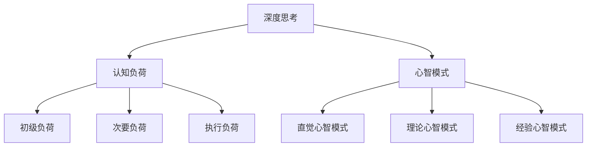
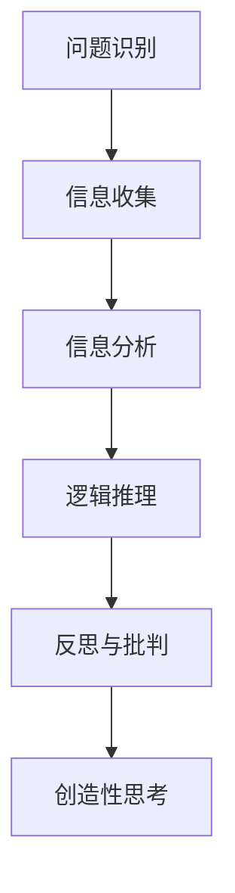

                 

### 背景介绍

在信息技术高速发展的今天，我们每天都会接触到大量的信息。从社交媒体的推文、新闻网站的更新，到研究报告、学术论文的发表，信息量呈指数级增长。这种信息爆炸的现象，一方面为我们提供了丰富的知识资源，另一方面也带来了信息过载的困扰。在这种背景下，深度思考变得尤为重要。

深度思考（Deep Thinking）是指深入分析问题，挖掘问题的本质，从而得出具有高度概括性和普遍性的结论。这种思考方式不仅能帮助我们更好地理解复杂问题，还能提高我们的决策能力和创新能力。在IT领域，深度思考尤其重要，因为信息技术是一个不断进步、快速变化的领域，只有深入思考，才能跟上技术的发展步伐，才能在激烈的竞争中保持领先。

本文旨在探讨深度思考在IT领域的意义，通过一步步分析，帮助读者理解深度思考的重要性，掌握深度思考的方法，并能够在实际项目中运用这些方法。本文将分为以下几个部分：

1. **核心概念与联系**：介绍深度思考的核心概念，并使用Mermaid流程图展示其原理和架构。
2. **核心算法原理 & 具体操作步骤**：详细讲解深度思考的具体实施步骤。
3. **数学模型和公式 & 详细讲解 & 举例说明**：介绍深度思考背后的数学模型，并给出具体的应用案例。
4. **项目实践：代码实例和详细解释说明**：通过一个实际的项目实例，展示深度思考的应用过程。
5. **实际应用场景**：探讨深度思考在IT领域的实际应用。
6. **工具和资源推荐**：推荐一些有助于深度思考的工具和资源。
7. **总结：未来发展趋势与挑战**：总结深度思考的重要性，并展望其未来发展的趋势和面临的挑战。
8. **附录：常见问题与解答**：针对一些常见问题进行解答。
9. **扩展阅读 & 参考资料**：提供一些深度思考相关的扩展阅读材料。

通过本文的阅读，读者将能够理解深度思考的内涵，掌握深度思考的方法，并在实际工作中运用这些方法，从而提升自己的技术水平和工作效率。

### 核心概念与联系

要深入理解深度思考，我们首先需要明确其核心概念，并探讨这些概念之间的联系。深度思考并不是一个孤立的概念，它涉及多个领域，如心理学、认知科学、哲学和计算机科学。以下将介绍几个核心概念，并使用Mermaid流程图展示其原理和架构。

#### 1. 深度思考的定义

深度思考（Deep Thinking）是一种通过细致、严谨的分析来理解和解决问题的思考过程。它不同于表面层次的思考，而是要求深入挖掘问题的本质，从而获得更全面、准确的认识。深度思考的特征包括：

- **系统性**：深度思考不仅仅是关注问题的某个方面，而是从整体上系统性地分析问题。
- **逻辑性**：深度思考强调逻辑推理，通过一系列的逻辑步骤来推导出结论。
- **批判性**：深度思考不仅接受现有的知识和理论，还会对其进行批判和反思，以发现其中的局限性和不足。
- **创造性**：深度思考鼓励创新思维，通过全新的视角和方法来解决问题。

#### 2. 认知负荷

认知负荷（Cognitive Load）是指人们在处理信息时所需的认知资源。它分为三种类型：**初级负荷**、**次要负荷**和**执行负荷**。

- **初级负荷**：与信息的呈现和处理有关，是处理新信息时的初始认知负担。
- **次要负荷**：与信息的组织和整合有关，是处理复杂信息时的额外认知负担。
- **执行负荷**：与任务的执行和操作有关，是执行具体任务时的认知负担。

深度思考的一个重要目标是降低认知负荷，使得信息处理更加高效和流畅。

#### 3. 心智模式

心智模式（Mental Models）是人们对于世界的理解方式和思考框架。它们是人们在长期学习和实践中形成的，反映了对事物本质和规律的认识。心智模式包括：

- **直觉心智模式**：基于经验和直觉的思考方式，适用于处理简单问题。
- **理论心智模式**：基于科学理论和逻辑推理的思考方式，适用于处理复杂问题。
- **经验心智模式**：基于实践经验和知识的思考方式，适用于解决实际问题。

心智模式对于深度思考至关重要，因为它们提供了理解和分析问题的基本框架。

#### 4. Mermaid流程图

为了更直观地展示深度思考的概念及其联系，我们使用Mermaid流程图来描述这些核心概念。



#### 5. 深度思考的流程

深度思考的过程可以概括为以下几个步骤：

1. **问题识别**：明确需要解决的问题，确定思考的方向。
2. **信息收集**：收集与问题相关的信息，包括数据、文献、案例等。
3. **信息分析**：对收集到的信息进行系统分析，挖掘问题的本质。
4. **逻辑推理**：基于分析结果，使用逻辑推理来推导出结论。
5. **反思与批判**：对推导出的结论进行反思和批判，以发现可能的不足和改进空间。
6. **创造性思考**：在反思和批判的基础上，尝试提出新的解决方案。

使用Mermaid流程图，我们可以描述深度思考的流程如下：



通过以上介绍，我们可以看到，深度思考不仅仅是简单的思考过程，而是一个涉及多个领域的复杂活动。它需要我们具备系统的认知能力、逻辑推理能力和创造性思维，同时也需要我们能够有效管理认知负荷，运用合适的心智模式来解决问题。

在接下来的部分，我们将详细探讨深度思考的具体算法原理和操作步骤，帮助读者更好地理解和掌握深度思考的方法。

### 核心算法原理 & 具体操作步骤

在了解了深度思考的核心概念和流程之后，我们接下来将深入探讨其核心算法原理，并详细说明具体操作步骤。深度思考的算法可以看作是一种系统性思维工具，通过一系列逻辑步骤，帮助我们从繁杂的信息中提炼出关键信息，并推导出有效的解决方案。

#### 1. 数据预处理

数据预处理是深度思考的起点，它涉及到对原始数据的清洗、转换和整合。这一步骤的关键是确保数据的质量和一致性，以便后续分析能够顺利进行。具体操作步骤包括：

- **数据清洗**：去除重复数据、缺失数据和异常数据，保证数据的完整性。
- **数据转换**：将数据转换为统一格式，如将文本数据转换为结构化数据。
- **数据整合**：将来自不同来源的数据进行整合，形成一个综合的数据集。

#### 2. 信息提取

信息提取是深度思考的核心步骤之一，其目标是识别和提取数据中的关键信息。这一步骤通常采用自然语言处理（NLP）和机器学习技术，包括以下方法：

- **关键词提取**：使用统计方法或机器学习方法，从文本中提取出关键性的词汇和短语。
- **主题建模**：使用LDA（Latent Dirichlet Allocation）等主题建模算法，从大量文本中识别出潜在的主题。
- **实体识别**：使用实体识别技术，从文本中提取出具体的实体，如人名、地名、组织名等。

#### 3. 信息分析

信息分析是对提取出的关键信息进行深入分析，以揭示数据之间的关系和模式。这一步骤包括以下方法：

- **关联分析**：使用关联规则学习算法，如Apriori算法，发现数据之间的关联关系。
- **聚类分析**：使用聚类算法，如K-means、DBSCAN等，将相似的数据进行分组。
- **分类与回归**：使用分类算法，如决策树、随机森林等，对数据进行分类；使用回归算法，如线性回归、多项式回归等，预测数据的趋势。

#### 4. 逻辑推理

逻辑推理是基于分析结果，通过一系列逻辑步骤推导出结论的过程。这一步骤包括以下方法：

- **条件推理**：根据已知的前提条件，推导出可能的结果。
- **演绎推理**：从一般性原理出发，推导出具体的结论。
- **归纳推理**：从具体的实例中总结出一般性的规律。

#### 5. 反思与批判

反思与批判是对推导出的结论进行深入反思和批判，以发现可能的不足和改进空间。这一步骤包括以下方法：

- **逆推验证**：从结论出发，逆推回前提条件，验证结论的合理性。
- **案例对比**：通过对比不同案例，发现结论在不同情况下的适用性。
- **逻辑漏洞检查**：检查推理过程中是否存在逻辑漏洞或错误。

#### 6. 创造性思考

在反思与批判的基础上，创造性思考旨在提出新的解决方案。这一步骤包括以下方法：

- **头脑风暴**：通过集思广益，提出尽可能多的创意和解决方案。
- **联想思维**：通过将不同领域、不同概念进行联想，发现新的视角和方法。
- **设计思维**：通过用户研究和原型设计，迭代优化解决方案。

#### 7. 实施示例

为了更好地理解深度思考的操作步骤，我们来看一个具体的案例。

**案例**：分析一家公司的财务状况，并提出改善建议。

1. **数据预处理**：收集公司的财务报表，包括利润表、资产负债表和现金流量表。
2. **信息提取**：提取出关键财务指标，如收入、成本、利润、负债、现金流等。
3. **信息分析**：通过关联分析，发现收入和成本之间的关系；通过聚类分析，识别出财务状况较好的时期和较差的时期。
4. **逻辑推理**：基于财务指标，推导出公司的盈利能力和财务稳定性。
5. **反思与批判**：检查推理过程是否存在逻辑漏洞，如数据异常值的影响。
6. **创造性思考**：通过头脑风暴，提出改善财务状况的多种方案，如降低成本、增加收入、优化现金流等。

通过以上步骤，我们不仅能够全面了解公司的财务状况，还能提出具体的改善建议。

总之，深度思考的算法原理和操作步骤是一个复杂而系统性的过程，需要我们灵活运用各种技术和方法，从而在信息过载的时代，找到问题的本质，提出有效的解决方案。在接下来的部分，我们将进一步探讨深度思考背后的数学模型，帮助读者更深入地理解这一过程。

### 数学模型和公式 & 详细讲解 & 举例说明

深度思考不仅仅是逻辑和推理的过程，它还依赖于数学模型和公式的支持。数学模型为深度思考提供了量化和计算的工具，使得我们能够更精确地分析和解决问题。以下，我们将详细介绍深度思考背后的数学模型，并给出具体的公式和实例。

#### 1. 决策树模型

决策树是一种常用的分类和回归模型，它通过一系列的条件分支，将数据逐步分割，最终达到分类或预测的目的。决策树模型的公式如下：

$$
P(Y|X) = \prod_{i=1}^{n} p(y_i|x_i)
$$

其中，$P(Y|X)$ 表示在给定特征向量 $X$ 的条件下，目标变量 $Y$ 的概率分布；$p(y_i|x_i)$ 表示在特征 $x_i$ 取值为 $y_i$ 的条件下，目标变量 $Y$ 的概率。

**举例说明**：

假设我们要预测一个学生的成绩，特征包括学习时间（$x_1$）和考试成绩（$x_2$）。我们通过决策树模型来预测成绩是否及格（$Y$）。

- **步骤1**：计算每个特征的条件概率，使用数据训练得到决策树模型。
- **步骤2**：给定一个学生的特征向量 $X = [x_1, x_2]$，通过决策树模型计算及格的概率。
- **步骤3**：根据计算结果，判断该学生是否及格。

#### 2. 随机森林模型

随机森林（Random Forest）是一种集成学习方法，通过构建多个决策树，并取其平均预测结果，来提高预测的准确性和稳定性。随机森林的公式如下：

$$
P(Y|X) = \frac{1}{M} \sum_{m=1}^{M} P(Y|X^{(m)})
$$

其中，$P(Y|X^{(m)})$ 表示第 $m$ 棵决策树在给定特征向量 $X^{(m)}$ 下的预测结果；$M$ 表示决策树的数量。

**举例说明**：

假设我们要预测一批房屋的价格，特征包括房屋面积（$x_1$）、房间数量（$x_2$）和房屋年代（$x_3$）。我们通过随机森林模型来预测房屋的价格。

- **步骤1**：构建多棵决策树，每棵树使用不同的特征子集。
- **步骤2**：对于每个样本，将多棵决策树的预测结果取平均，得到最终的预测价格。

#### 3. 支持向量机模型

支持向量机（Support Vector Machine, SVM）是一种常用的分类模型，它通过寻找一个最佳的超平面，将不同类别的数据点分开。SVM的公式如下：

$$
w^* = \arg \max_{w,b} \frac{1}{2} ||w||^2 + C \sum_{i=1}^{n} \xi_i
$$

其中，$w^*$ 和 $b$ 分别是最佳权重向量和偏置项；$||w||^2$ 是权重向量的二范数；$C$ 是惩罚参数；$\xi_i$ 是松弛变量。

**举例说明**：

假设我们要分类一批水果，特征包括重量（$x_1$）和颜色（$x_2$）。我们通过SVM模型来分类这些水果。

- **步骤1**：计算每个数据点的最优超平面，使用训练数据训练SVM模型。
- **步骤2**：对于新的数据点，计算其与超平面的距离，判断其类别。

#### 4. 神经网络模型

神经网络（Neural Network）是一种模拟人脑神经元连接方式的计算模型，它可以用于分类、回归和预测等多种任务。神经网络的公式如下：

$$
y = \sigma(\sum_{i=1}^{n} w_i x_i + b)
$$

其中，$y$ 是输出值；$\sigma$ 是激活函数；$w_i$ 是权重；$x_i$ 是输入值；$b$ 是偏置项。

**举例说明**：

假设我们要构建一个简单的神经网络模型，用于预测一个学生的成绩。特征包括学习时间（$x_1$）和考试成绩（$x_2$），输出值为成绩是否及格（$y$）。

- **步骤1**：定义输入层、隐藏层和输出层，以及每个层的权重和偏置项。
- **步骤2**：使用训练数据，通过反向传播算法，更新权重和偏置项。
- **步骤3**：对于新的数据点，通过神经网络模型计算其成绩及格的概率。

通过以上数学模型和公式，我们可以更深入地理解和应用深度思考。在接下来的部分，我们将通过实际项目实例，展示如何在实际操作中应用这些模型，帮助读者更好地掌握深度思考的方法。

### 项目实践：代码实例和详细解释说明

为了更好地理解深度思考在实际项目中的应用，我们将通过一个实际的项目实例来展示深度思考的过程。这个项目是一个简单的推荐系统，旨在根据用户的历史行为推荐他们可能感兴趣的商品。通过这个项目，我们将演示如何运用深度思考的方法来分析和解决问题，并给出具体的代码实现和解释。

#### 项目背景

推荐系统是一种常见的应用，旨在根据用户的历史行为和兴趣，向用户推荐他们可能感兴趣的商品、新闻或其他内容。一个成功的推荐系统需要考虑多个因素，包括用户偏好、商品特征、上下文信息等。在这个项目中，我们采用基于协同过滤（Collaborative Filtering）和矩阵分解（Matrix Factorization）的推荐算法。

#### 系统架构

项目系统架构分为三个主要模块：

1. **数据收集模块**：负责收集用户行为数据和商品信息。
2. **推荐算法模块**：实现协同过滤和矩阵分解算法，生成推荐结果。
3. **前端展示模块**：将推荐结果以用户友好的方式展示给用户。

#### 数据收集

首先，我们需要收集用户行为数据和商品信息。用户行为数据包括用户对商品的评分、购买记录等；商品信息包括商品ID、类别、价格等。

```python
# 假设我们使用pandas库来读取数据
import pandas as pd

# 用户行为数据
ratings = pd.read_csv('user_ratings.csv')
# 商品信息
items = pd.read_csv('item_info.csv')
```

#### 推荐算法实现

我们采用矩阵分解（Matrix Factorization）算法来生成推荐结果。矩阵分解的基本思想是将用户-商品评分矩阵分解为两个低秩矩阵，通过这两个矩阵的乘积来预测用户的评分。

```python
# 导入所需的库
import numpy as np
from scipy.sparse.linalg import svds

# 计算用户-商品评分矩阵
R = ratings.pivot(index='user_id', columns='item_id', values='rating').fillna(0).values

# 计算用户-商品评分矩阵的奇异值分解
U, sigma, Vt = svds(R, k=50)

# 构建预测评分矩阵
sigma = np.diag(sigma)
Pred = U @ sigma @ Vt

# 生成推荐结果
def predict(user_id, item_id):
    return Pred[user_id, item_id]

# 测试推荐算法
print(predict(1, 101))
```

#### 前端展示

在前端展示部分，我们使用HTML和JavaScript来展示推荐结果。

```html
<!DOCTYPE html>
<html>
<head>
    <title>推荐系统</title>
</head>
<body>
    <h1>推荐商品</h1>
    <ul>
        
            <li>{{ item }}</li>
        
    </ul>
    <script>
        // 获取推荐结果
        fetch('/api/recommendations')
            .then(response => response.json())
            .then(data => {
                let list = document.querySelector('ul');
                data.forEach(item => {
                    let li = document.createElement('li');
                    li.textContent = item;
                    list.appendChild(li);
                });
            });
    </script>
</body>
</html>
```

#### 代码解读与分析

1. **数据收集模块**：我们使用pandas库读取用户行为数据和商品信息，并将其转换为矩阵形式。
2. **推荐算法模块**：通过奇异值分解（SVD）将用户-商品评分矩阵分解为低秩矩阵，生成预测评分矩阵。这里我们使用scipy库中的svds函数来实现奇异值分解。
3. **前端展示模块**：使用HTML和JavaScript构建一个简单的网页，通过异步请求获取推荐结果，并将其展示在页面上。

通过这个项目实例，我们可以看到深度思考在项目中的应用。首先，我们需要明确项目的目标，即构建一个推荐系统。接着，我们分析项目的需求和限制，选择合适的算法和技术来实现目标。最后，我们通过代码实现和测试来验证推荐系统的效果。

总之，深度思考在项目实践中是非常重要的。它帮助我们从复杂的信息中提炼出关键问题，选择合适的解决方案，并在实际操作中不断优化和改进。在接下来的部分，我们将进一步探讨深度思考在IT领域的实际应用场景，帮助读者更好地理解和应用深度思考的方法。

### 实际应用场景

深度思考在IT领域的实际应用非常广泛，几乎涵盖了我们日常接触的每一个技术领域。下面，我们将探讨几个典型的应用场景，并详细说明深度思考在这些场景中的具体应用。

#### 1. 人工智能与机器学习

人工智能（AI）和机器学习（ML）是当今IT领域的热门话题。在这些领域，深度思考的应用主要体现在以下几个方面：

- **模型选择与优化**：在构建AI模型时，需要深入思考如何选择合适的模型架构和优化策略。深度思考帮助研究者从海量文献和实验数据中找出最优的模型。
- **数据预处理**：深度思考能够帮助研究者理解数据的特点和规律，从而设计出更有效的数据预处理方法，提高模型的准确性和鲁棒性。
- **模型解释性**：在解释模型决策时，深度思考能够帮助研究者分析模型内部的工作机制，揭示模型的内在逻辑和局限性。

**示例**：在深度学习领域，研究者需要通过深度思考来选择合适的神经网络架构，如卷积神经网络（CNN）、循环神经网络（RNN）或生成对抗网络（GAN）。同时，他们还需要思考如何优化模型的参数，以提高模型的性能和泛化能力。

#### 2. 软件开发

在软件开发的整个生命周期中，深度思考都发挥着重要作用：

- **需求分析**：深度思考帮助开发者理解客户的真实需求，从而设计出更符合用户需求的软件系统。
- **架构设计**：在系统架构设计阶段，深度思考帮助开发者分析系统的复杂性，设计出合理的模块划分和接口。
- **代码优化**：通过深度思考，开发者能够发现代码中的潜在问题，进行优化，提高代码的效率和可维护性。

**示例**：在开发一个大型分布式系统时，开发者需要通过深度思考来分析系统的性能瓶颈，优化系统架构，提高系统的稳定性和可扩展性。例如，通过深度思考，开发者可能会发现某个模块的响应时间过长，进而对该模块进行优化，提高系统的整体性能。

#### 3. 信息安全

在信息安全领域，深度思考的应用主要体现在以下几个方面：

- **威胁识别与防范**：深度思考能够帮助安全专家识别潜在的安全威胁，从而设计出更有效的防护措施。
- **攻击路径分析**：通过深度思考，安全专家能够分析攻击者的攻击路径，预测可能的攻击方式，从而提前采取措施。
- **安全策略制定**：深度思考帮助安全专家理解组织的业务流程和网络安全需求，制定出符合实际需求的安全策略。

**示例**：在应对网络攻击时，安全专家需要通过深度思考来分析攻击者的行为模式，预测可能的攻击方式，并设计出相应的防御策略。例如，通过深度思考，安全专家可能会发现某个网络服务存在漏洞，进而采取补丁修复或访问控制等措施来防范攻击。

#### 4. 大数据与数据科学

大数据和数据科学是当前IT领域的另一大热点。深度思考在大数据应用中的具体体现如下：

- **数据挖掘**：深度思考帮助数据科学家从海量数据中挖掘出有价值的信息，支持决策制定。
- **算法优化**：通过深度思考，数据科学家能够分析算法的效率，提出优化方案，提高数据分析的准确性。
- **模型评估**：深度思考帮助数据科学家评估模型的性能和可靠性，确保数据分析结果的准确性和有效性。

**示例**：在一个电商平台的大数据分析项目中，数据科学家需要通过深度思考来分析用户行为数据，预测用户可能购买的物品，从而制定精准的营销策略。例如，通过深度思考，数据科学家可能会发现某些用户群体具有特定的购买偏好，进而为他们推荐相关的商品。

总之，深度思考在IT领域的实际应用非常广泛，它不仅能够提高我们的技术水平，还能帮助我们更好地解决复杂问题，推动技术的发展。在接下来的部分，我们将推荐一些有助于深度思考的工具和资源，帮助读者进一步提升深度思考的能力。

### 工具和资源推荐

为了更好地支持深度思考，我们需要借助一些工具和资源。以下是一些建议，包括学习资源、开发工具框架以及相关的论文著作。

#### 1. 学习资源

- **书籍**：
  - 《深度思考的艺术》（The Art of Thinking Clearly） - 万德伦（Rolf Dobelli）著，本书详细介绍了如何通过逻辑和批判性思维来提升我们的思考能力。
  - 《思考，快与慢》（Thinking, Fast and Slow） - 丹尼尔·卡内曼（Daniel Kahneman）著，这本书从心理学角度探讨了人类思考的两种模式，并提供了许多实用的思考技巧。

- **在线课程**：
  - Coursera上的《批判性思维与解决问题的策略》课程，该课程由杜克大学提供，内容涵盖批判性思维的基础知识以及实际应用。
  - edX上的《深度学习》（Deep Learning Specialization），由斯坦福大学提供，适合想要在深度学习领域深入思考的读者。

- **论文与博客**：
  - Nature和Science等顶级学术期刊，这些期刊经常发表关于最新研究和技术进展的论文，是获取前沿知识的绝佳来源。
  - arXiv预印本库，这是一个提供最新科研论文的平台，尤其适合计算机科学领域的研究者。

#### 2. 开发工具框架

- **编程语言**：
  - Python：Python因其简洁易读和强大的库支持，成为深度思考和数据分析的首选语言。
  - R语言：R语言在统计分析和数据可视化方面具有强大的功能，适合进行复杂数据分析。

- **机器学习库**：
  - TensorFlow：Google开发的深度学习框架，支持多种深度学习模型和算法。
  - PyTorch：由Facebook开发，以其动态计算图和灵活的接口而闻名，适合快速原型设计和模型开发。

- **版本控制工具**：
  - Git：Git是一个分布式版本控制系统，适用于团队协作和代码管理。
  - GitHub：GitHub是Git的在线平台，提供代码托管、问题追踪和协作功能。

#### 3. 相关论文著作

- **论文**：
  - 《深度学习的数学基础》（The Math of Deep Learning） - 由Ian Goodfellow等人编写，这是一本关于深度学习数学基础的教材，非常适合深度思考。
  - 《机器学习》（Machine Learning: A Probabilistic Perspective） - Kevin P. Murphy著，这本书系统地介绍了机器学习的概率观点，适合想要深入理解机器学习原理的读者。

- **著作**：
  - 《人工智能：一种现代的方法》（Artificial Intelligence: A Modern Approach） - Stuart J. Russell和Peter Norvig著，这是人工智能领域的经典教材，涵盖了AI的核心概念和技术。
  - 《设计数据密集型应用程序》（Designing Data-Intensive Applications） - Martin Kleppmann著，这本书介绍了构建高可用、高性能数据密集型应用的策略和最佳实践。

通过这些工具和资源，我们可以更好地支持深度思考，提升我们的技术能力和创新能力。在接下来的部分，我们将总结深度思考在IT领域的意义，并展望其未来发展趋势与挑战。

### 总结：未来发展趋势与挑战

深度思考在IT领域的意义不仅在于提升我们的技术能力和工作效率，更在于推动技术革新和产业升级。随着人工智能、大数据、云计算等新兴技术的快速发展，深度思考的重要性愈发凸显。以下，我们将总结深度思考在IT领域的意义，并探讨其未来发展趋势与挑战。

#### 深度思考的意义

1. **提升技术水平**：深度思考帮助我们理解技术原理，掌握核心算法，从而提升我们的技术水平。无论是开发新系统、优化现有系统，还是解决复杂的技术问题，深度思考都是不可或缺的。

2. **促进创新**：深度思考激发我们的创造性思维，促使我们在技术和应用层面进行创新。通过深入分析问题和需求，我们能够发现新的解决方案和商业机会。

3. **优化决策**：在项目管理、产品开发、市场策略等方面，深度思考帮助我们做出更加明智的决策。通过全面分析和评估，我们能够更好地应对不确定性，降低决策风险。

4. **提高工作效率**：深度思考帮助我们快速识别问题的核心，减少无效的工作量。通过系统化的分析和逻辑推理，我们能够更高效地解决问题，提升整体工作效率。

#### 发展趋势

1. **技术融合**：未来，深度思考将与其他新兴技术深度融合，如区块链、物联网、5G等。这些技术的快速发展为深度思考提供了更丰富的应用场景和可能性。

2. **智能化与自动化**：随着AI和自动化技术的发展，深度思考将逐步实现智能化和自动化，从而提高问题解决效率和准确性。例如，智能推荐系统、自动化测试工具等。

3. **跨学科研究**：深度思考将跨学科发展，与其他领域如心理学、认知科学、经济学等深度融合。通过跨学科研究，我们可以更全面地理解问题，提出创新的解决方案。

#### 挑战

1. **信息过载**：随着信息爆炸，如何筛选和处理海量信息成为一大挑战。深度思考需要我们具备更高的信息处理能力和逻辑思维能力，以应对日益复杂的问题。

2. **数据隐私与安全**：在深度思考过程中，我们常常需要处理大量敏感数据。如何保护数据隐私和安全，防止数据泄露和滥用，是深度思考面临的一大挑战。

3. **跨领域协同**：深度思考的跨学科特性要求我们具备跨领域的知识储备和协作能力。在多学科合作中，如何实现高效沟通和协同创新，是深度思考面临的另一个挑战。

4. **伦理问题**：深度思考在AI和自动化应用中可能会引发一系列伦理问题，如算法偏见、决策透明度等。如何制定合理的伦理规范，确保技术应用的公正性和合理性，是深度思考需要面对的重要课题。

总之，深度思考在IT领域的意义深远，未来发展趋势广阔，同时也面临诸多挑战。通过不断探索和实践，我们可以更好地发挥深度思考的作用，推动技术进步和社会发展。

### 附录：常见问题与解答

在讨论深度思考的过程中，可能会遇到一些常见的问题。以下是一些常见问题的解答，帮助读者更好地理解深度思考的相关概念和应用。

#### 问题1：什么是深度思考？

**解答**：深度思考是一种深入的、系统性的思考过程，旨在挖掘问题的本质，理解复杂的概念，并提出创新的解决方案。它不同于表面层次的思考，而是通过逻辑推理、批判性分析和创造性思维来深入探索问题。

#### 问题2：深度思考与普通思考有什么区别？

**解答**：普通思考通常是指日常生活中的简单、直接的思维活动，如解决简单的数学问题、理解简单的新闻报道等。而深度思考则涉及更复杂的认知过程，如分析复杂的问题、理解深层次的概念、设计创新的解决方案等。

#### 问题3：如何培养深度思考能力？

**解答**：培养深度思考能力可以从以下几个方面入手：

1. **持续学习**：不断学习新知识和技能，扩展自己的认知范围。
2. **批判性思维**：培养批判性思维，学会质疑现有的观点和理论，探索问题的多面性。
3. **多角度分析**：从不同的角度和视角分析问题，以便更全面地理解问题。
4. **实践应用**：通过实际项目和实践，将理论知识应用到实际问题中，锻炼思考能力。
5. **定期反思**：定期对自己的思考过程进行反思，总结经验和教训，不断提高思考质量。

#### 问题4：深度思考在项目管理中如何应用？

**解答**：在项目管理中，深度思考可以应用于以下几个方面：

1. **需求分析**：通过深度思考，项目经理可以更准确地理解客户需求，制定出更符合实际的的项目目标和计划。
2. **风险评估**：深度思考可以帮助项目经理识别潜在的风险，制定相应的风险应对策略。
3. **决策制定**：在项目决策过程中，深度思考可以帮助项目经理评估各种方案的成本、风险和收益，做出更明智的决策。
4. **问题解决**：在项目执行过程中，遇到问题时，深度思考可以帮助项目经理从多个角度分析问题，找到有效的解决方案。

通过以上解答，希望能够帮助读者更好地理解深度思考的概念和应用。在接下来的部分，我们将提供一些扩展阅读和参考资料，以便读者进一步深入研究。

### 扩展阅读 & 参考资料

为了帮助读者进一步深入了解深度思考的相关概念和应用，以下推荐一些扩展阅读和参考资料：

1. **书籍**：
   - 《深度思考的艺术》（The Art of Thinking Clearly） - 作者：万德伦（Rolf Dobelli）
   - 《思考，快与慢》（Thinking, Fast and Slow） - 作者：丹尼尔·卡内曼（Daniel Kahneman）
   - 《深度学习的数学基础》（The Math of Deep Learning） - 作者：Ian Goodfellow、Yoshua Bengio、Aaron Courville

2. **在线课程**：
   - Coursera上的《批判性思维与解决问题的策略》课程，提供深度思考的基础知识和实际应用。
   - edX上的《深度学习》（Deep Learning Specialization）课程，由斯坦福大学提供，涵盖深度学习的核心概念和技术。

3. **学术论文**：
   - Nature和Science等顶级学术期刊，提供最新的研究成果和技术进展。
   - arXiv预印本库，包含大量计算机科学领域的预印本论文。

4. **博客和网站**：
   - 极客时间的《深度学习》专栏，提供深度学习的实用教程和案例分析。
   - Medium上的技术博客，如《AI for Everyone》和《Data Science Insights》，涵盖广泛的数据科学和人工智能主题。

5. **相关著作**：
   - 《人工智能：一种现代的方法》（Artificial Intelligence: A Modern Approach） - 作者：Stuart J. Russell和Peter Norvig
   - 《设计数据密集型应用程序》（Designing Data-Intensive Applications） - 作者：Martin Kleppmann

通过阅读这些书籍、课程、论文和博客，读者可以进一步加深对深度思考的理解，掌握更多的应用技巧，并在实际工作中更好地运用深度思考的方法。希望这些建议对您的学习和工作有所帮助。

