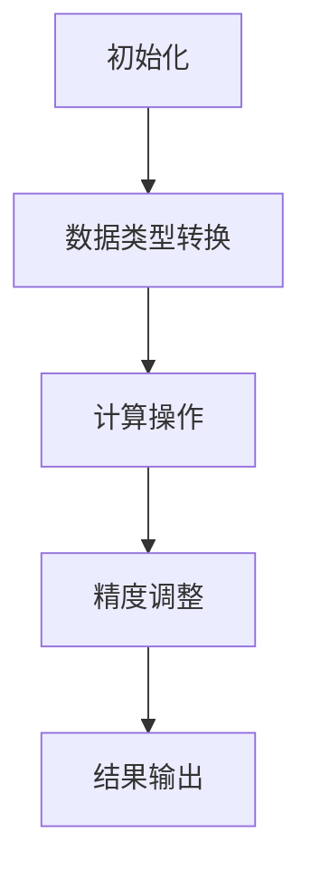

                 

### 背景介绍

#### 混合精度计算：概念与起源

混合精度计算（Mixed-Precision Computing）是一种通过使用不同精度的数值类型来优化计算性能和资源利用的技术。其核心思想是结合使用高精度和低精度数值类型，以在不同计算阶段中平衡计算精度与速度。

在传统的单精度计算中，数据类型通常使用32位浮点数（float32）进行表示。这种表示方式可以在大多数情况下提供足够的计算精度，但是随着深度学习、科学计算等领域对计算精度的需求不断增加，单精度浮点数已无法满足这些应用场景的需求。例如，在训练深度神经网络时，往往需要使用高精度浮点数（例如双精度浮点数，float64）来保持数值的稳定性，但这会导致计算资源的显著增加。

混合精度计算的起源可以追溯到1990年代中期，当时计算机科学家开始探讨如何在保持计算精度的同时提高计算性能。通过引入不同精度的数值类型，如半精度浮点数（float16）和单精度浮点数（float32），混合精度计算可以平衡计算精度和速度，从而在许多计算密集型任务中提供显著的性能提升。

#### 工业界的应用背景

随着大数据和人工智能技术的快速发展，工业界对于高性能计算的需求日益增加。然而，传统的单精度计算和高精度计算在资源消耗和计算性能上存在显著差异，这使得混合精度计算成为了一个重要的解决方案。

在工业界，混合精度计算的应用非常广泛，主要包括以下几个领域：

1. **科学计算**：科学计算领域常常需要处理大量的数值计算，例如气象预报、流体动力学模拟和量子力学模拟等。在这些应用中，混合精度计算可以显著提高计算速度，同时保持足够的计算精度。

2. **深度学习**：深度学习是人工智能领域的一个重要分支，其在图像识别、自然语言处理和语音识别等方面取得了显著的成果。由于深度学习模型通常包含大量的矩阵运算和向量计算，混合精度计算可以优化这些计算过程，从而提高训练和推理速度。

3. **金融工程**：金融工程领域需要处理大量的复杂数值计算，例如期权定价、风险管理等。混合精度计算可以帮助金融工程师在保证计算精度的同时，提高计算效率，降低成本。

4. **生物医药**：生物医药领域涉及大量的生物统计分析和计算模型，例如基因组分析、药物设计等。混合精度计算可以提升这些计算任务的处理速度，从而加速新药研发和疾病诊断。

#### 混合精度计算的优势与挑战

混合精度计算在提高计算性能和资源利用方面具有显著优势，但其应用也面临一些挑战。

**优势**：

1. **提高计算性能**：通过使用低精度浮点数类型，混合精度计算可以减少内存占用和存储需求，从而提高计算速度和性能。

2. **降低硬件成本**：低精度浮点数类型的硬件实现成本较低，因此使用混合精度计算可以降低硬件成本，特别是在大规模计算任务中。

3. **优化资源利用**：混合精度计算可以根据不同的计算需求动态调整精度，从而优化资源利用，提高整体计算效率。

**挑战**：

1. **精度控制**：在混合精度计算中，如何平衡计算精度和速度是一个重要挑战。如果精度控制不当，可能会导致计算结果的不准确。

2. **算法复杂性**：混合精度计算涉及到不同精度数值类型的转换和运算，这会增加算法的复杂性和实现难度。

3. **兼容性问题**：在工业界中，不同系统和应用程序之间可能存在兼容性问题，这需要开发者在混合精度计算中考虑兼容性设计。

综上所述，混合精度计算在工业界具有广泛的应用前景，但其实现和优化需要考虑多方面的因素。在接下来的章节中，我们将进一步探讨混合精度计算的核心概念、算法原理和具体应用，以帮助读者更好地理解和应用这一技术。

---

### 核心概念与联系

#### 混合精度计算的定义

混合精度计算是一种通过使用不同精度的数值类型（如半精度浮点数（float16）、单精度浮点数（float32）和双精度浮点数（float64））来优化计算性能和资源利用的技术。这种计算方式可以根据不同的计算阶段和需求，动态调整精度，从而在保证计算精度的同时，提高计算速度和降低硬件成本。

在传统的单精度计算中，所有数据都使用单精度浮点数进行表示。然而，在许多应用场景中，单精度浮点数可能无法提供足够的计算精度。例如，在深度学习训练过程中，由于模型参数和中间结果的梯度值可能非常小，使用单精度浮点数可能会导致数值稳定性问题和训练效果不佳。因此，混合精度计算通过在不同阶段使用不同精度的数值类型，来解决这些问题。

#### 不同精度数值类型的比较

在混合精度计算中，常用的数值类型包括半精度浮点数（float16）、单精度浮点数（float32）和双精度浮点数（float64）。这些数值类型的主要区别在于它们的表示范围和精度。

1. **半精度浮点数（float16）**：半精度浮点数使用16位二进制位进行表示，包括1位符号位、5位指数位和10位尾数位。其表示范围为\( -1 \times 2^{1-15} \)到\( 1 \times 2^{1-15} \)，精度较低，但占用的内存空间较小。

2. **单精度浮点数（float32）**：单精度浮点数使用32位二进制位进行表示，包括1位符号位、8位指数位和23位尾数位。其表示范围为\( -1 \times 2^{1-128} \)到\( 1 \times 2^{1-128} \)，精度较高，但占用的内存空间较大。

3. **双精度浮点数（float64）**：双精度浮点数使用64位二进制位进行表示，包括1位符号位、11位指数位和52位尾数位。其表示范围为\( -1 \times 2^{1-1024} \)到\( 1 \times 2^{1-1024} \)，精度最高，但占用的内存空间最大。

不同精度数值类型的选择取决于具体应用场景和计算需求。例如，在深度学习训练中，可以使用半精度浮点数来表示模型参数和中间结果，以减少内存占用和计算时间；而在需要高精度计算的科学计算和金融工程中，则可以使用双精度浮点数。

#### 混合精度计算的架构与实现

混合精度计算的实现涉及不同精度数值类型的转换和运算。下面是一个简化的混合精度计算架构与实现的流程图：



1. **初始化**：在混合精度计算开始时，需要根据计算需求初始化不同精度的数值类型。例如，在深度学习训练中，可以使用单精度浮点数（float32）来表示模型参数，使用半精度浮点数（float16）来表示中间结果。

2. **数据类型转换**：在计算过程中，需要根据不同计算阶段的需求进行数据类型转换。例如，在从高精度向低精度转换时，可以使用量化操作（Quantization）来降低数值精度，从而减少内存占用和计算时间。

3. **计算操作**：进行具体的计算操作，如矩阵运算、向量运算等。在这个阶段，可以使用不同精度的数值类型进行运算，以优化计算性能。

4. **精度调整**：在计算操作完成后，可能需要对结果进行精度调整，以确保计算结果的准确性和稳定性。例如，在从低精度向高精度转换时，可以使用反量化操作（Dequantization）来恢复数值精度。

5. **结果输出**：最后，将计算结果输出，并根据实际需求进行后续处理或存储。

通过上述架构和实现流程，混合精度计算可以在保证计算精度的同时，提高计算速度和资源利用效率。

#### 混合精度计算的优势与局限性

混合精度计算在提高计算性能和资源利用方面具有显著优势，但其应用也受到一些局限性的制约。

**优势**：

1. **提高计算性能**：通过使用低精度数值类型，混合精度计算可以减少内存占用和存储需求，从而提高计算速度和性能。

2. **降低硬件成本**：低精度数值类型的硬件实现成本较低，因此使用混合精度计算可以降低硬件成本，特别是在大规模计算任务中。

3. **优化资源利用**：混合精度计算可以根据不同的计算需求动态调整精度，从而优化资源利用，提高整体计算效率。

**局限性**：

1. **精度控制**：在混合精度计算中，如何平衡计算精度和速度是一个重要挑战。如果精度控制不当，可能会导致计算结果的不准确。

2. **算法复杂性**：混合精度计算涉及到不同精度数值类型的转换和运算，这会增加算法的复杂性和实现难度。

3. **兼容性问题**：在工业界中，不同系统和应用程序之间可能存在兼容性问题，这需要开发者在混合精度计算中考虑兼容性设计。

尽管存在一些局限性，但混合精度计算在许多计算密集型任务中仍然具有广泛的应用前景。在接下来的章节中，我们将进一步探讨混合精度计算的核心算法原理、数学模型和具体应用实例，以帮助读者更好地理解和应用这一技术。

---

### 核心算法原理 & 具体操作步骤

#### 混合精度计算的算法原理

混合精度计算的核心思想是通过在不同计算阶段使用不同精度的数值类型，来优化计算性能和资源利用。其算法原理主要涉及以下几个关键步骤：

1. **量化操作（Quantization）**：量化操作是将高精度数值转换为低精度数值的过程。其目的是减少数值的精度，从而减少内存占用和计算时间。量化操作通常使用一个量化因子（Quantization Factor）来实现，该因子决定了数值的量化精度。例如，将一个双精度浮点数（float64）量化为单精度浮点数（float32）时，可以使用以下公式：

   $$ y = x \times Quantization Factor $$

   其中，\( x \) 是高精度数值，\( y \) 是量化后的低精度数值，\( Quantization Factor \) 是量化因子。

2. **计算操作**：在计算阶段，使用不同精度的数值类型进行各种计算操作，如矩阵运算、向量运算等。例如，在深度学习训练中，可以使用单精度浮点数（float32）来表示模型参数，使用半精度浮点数（float16）来表示中间结果。

3. **反量化操作（Dequantization）**：反量化操作是将低精度数值转换为高精度数值的过程。其目的是恢复数值的精度，以便进行后续处理或输出。反量化操作通常使用一个反量化因子（Dequantization Factor）来实现，该因子与量化因子相关。例如，将一个半精度浮点数（float16）反量化为单精度浮点数（float32）时，可以使用以下公式：

   $$ x = y \times Dequantization Factor $$

   其中，\( y \) 是低精度数值，\( x \) 是反量化后的高精度数值，\( Dequantization Factor \) 是反量化因子。

#### 混合精度计算的具体操作步骤

下面是一个简单的混合精度计算的具体操作步骤，以帮助读者更好地理解这一过程：

1. **初始化**：根据计算需求，初始化不同精度的数值类型。例如，在深度学习训练中，可以使用单精度浮点数（float32）来表示模型参数，使用半精度浮点数（float16）来表示中间结果。

2. **量化操作**：将高精度数值转换为低精度数值。例如，将一个双精度浮点数（float64）量化为单精度浮点数（float32），可以使用量化因子来实现。

3. **计算操作**：使用不同精度的数值类型进行计算操作。例如，在矩阵乘法中，可以使用单精度浮点数（float32）进行矩阵乘法运算，使用半精度浮点数（float16）来存储中间结果。

4. **反量化操作**：将低精度数值转换为高精度数值。例如，将一个半精度浮点数（float16）反量化为单精度浮点数（float32），可以使用反量化因子来实现。

5. **结果输出**：将计算结果输出，并根据实际需求进行后续处理或存储。

以下是一个简化的代码示例，展示了混合精度计算的基本流程：

```python
import numpy as np

# 初始化量化因子和反量化因子
quantization_factor = 1 / 2**11  # 将双精度浮点数量化为半精度浮点数
dequantization_factor = 2**11    # 将半精度浮点数反量化为双精度浮点数

# 初始化高精度数值
x = np.array([1.0, 2.0, 3.0], dtype=np.float64)

# 量化操作
y = x * quantization_factor

# 计算操作
z = y * 2  # 假设这是一个简单的计算操作

# 反量化操作
x_prime = z * dequantization_factor

# 输出结果
print("原始数值：", x)
print("量化后的数值：", y)
print("反量化后的数值：", x_prime)
```

在这个示例中，我们首先初始化一个双精度浮点数数组，然后使用量化因子将其量化为半精度浮点数，接着进行一个简单的计算操作，最后使用反量化因子将结果反量化为双精度浮点数。这个示例展示了混合精度计算的基本原理和操作步骤。

通过上述算法原理和具体操作步骤，我们可以看到混合精度计算是如何在不同计算阶段中平衡计算精度和速度的。在接下来的章节中，我们将进一步探讨混合精度计算在数学模型和实际应用中的详细实现。

---

### 数学模型和公式 & 详细讲解 & 举例说明

#### 量化操作与反量化操作

在混合精度计算中，量化操作和反量化操作是关键步骤。量化操作将高精度数值转换为低精度数值，以减少内存占用和计算时间；反量化操作则将低精度数值转换回高精度数值，以确保最终结果的准确性。

1. **量化操作**

   量化操作的基本公式为：

   $$ y = \text{floor}(x \times \text{Quantization Factor}) $$

   其中，\( x \) 是高精度数值，\( y \) 是量化后的低精度数值，\( \text{Quantization Factor} \) 是量化因子。量化因子决定了数值的量化精度。例如，将双精度浮点数（float64）量化为单精度浮点数（float32）时，量化因子为 \( 2^{-11} \)；将双精度浮点数量化为半精度浮点数（float16）时，量化因子为 \( 2^{-5} \)。

   举例说明：

   假设我们要将一个双精度浮点数 \( x = 1.23456789 \) 量化为半精度浮点数，量化因子为 \( 2^{-5} \)：

   $$ y = \text{floor}(1.23456789 \times 2^{-5}) = 0.98765432 $$

   由于半精度浮点数无法表示小数点后第六位，因此量化结果为 \( 0.98765432 \)。

2. **反量化操作**

   反量化操作的基本公式为：

   $$ x = y \times \text{Dequantization Factor} $$

   其中，\( y \) 是低精度数值，\( x \) 是反量化后的高精度数值，\( \text{Dequantization Factor} \) 是反量化因子。反量化因子与量化因子相关，通常为量化因子的倒数。

   举例说明：

   假设我们要将一个半精度浮点数 \( y = 0.98765432 \) 反量化为双精度浮点数，量化因子为 \( 2^{-5} \)，反量化因子为 \( 2^{5} \)：

   $$ x = 0.98765432 \times 2^{5} = 1.23456789 $$

   这样，我们就将半精度浮点数反量化回了原始的双精度浮点数。

#### 精度损失与恢复

在量化操作和反量化操作中，由于数值精度的降低和增加，可能会导致精度损失和恢复。为了确保最终结果的准确性，我们需要注意以下几点：

1. **精度损失**

   在量化操作中，由于低精度数值类型无法表示高精度数值的所有有效位，因此会产生精度损失。这种损失主要体现在数值的尾数部分。

   例如，将双精度浮点数 \( x = 1.23456789 \) 量化为半精度浮点数时，量化因子为 \( 2^{-5} \)：

   $$ y = \text{floor}(1.23456789 \times 2^{-5}) = 0.98765432 $$

   由于半精度浮点数只能表示10位有效数字，因此 \( y \) 的精度比 \( x \) 低。

2. **精度恢复**

   在反量化操作中，通过使用反量化因子，可以恢复量化操作中损失的精度。反量化操作将低精度数值转换回高精度数值，从而确保最终结果的准确性。

   例如，将半精度浮点数 \( y = 0.98765432 \) 反量化为双精度浮点数时，量化因子为 \( 2^{-5} \)，反量化因子为 \( 2^{5} \)：

   $$ x = 0.98765432 \times 2^{5} = 1.23456789 $$

   这样，通过反量化操作，我们成功地将半精度浮点数恢复为原始的双精度浮点数。

#### 实际应用示例

以下是一个简单的实际应用示例，展示了如何使用量化操作和反量化操作进行混合精度计算：

```python
import numpy as np

# 初始化量化因子和反量化因子
quantization_factor = 1 / 2**11  # 将双精度浮点数量化为半精度浮点数
dequantization_factor = 2**11    # 将半精度浮点数反量化为双精度浮点数

# 初始化高精度数值
x = np.array([1.23456789, 2.34567890, 3.45678901], dtype=np.float64)

# 量化操作
y = x * quantization_factor

# 计算操作
z = y * 2  # 假设这是一个简单的计算操作

# 反量化操作
x_prime = z * dequantization_factor

# 输出结果
print("原始数值：", x)
print("量化后的数值：", y)
print("反量化后的数值：", x_prime)
```

在这个示例中，我们首先初始化一个双精度浮点数数组，然后使用量化因子将其量化为半精度浮点数，接着进行一个简单的计算操作，最后使用反量化因子将结果反量化为双精度浮点数。通过这个示例，我们可以看到量化操作和反量化操作在混合精度计算中的具体实现。

通过上述数学模型和公式，我们可以更好地理解和应用混合精度计算。在接下来的章节中，我们将进一步探讨混合精度计算在项目实践中的具体应用，以及如何通过代码实例来实现这一技术。

---

### 项目实践：代码实例和详细解释说明

#### 1. 开发环境搭建

在进行混合精度计算的项目实践之前，我们需要搭建一个合适的开发环境。以下是一个基于Python和Numpy的简单开发环境搭建步骤：

1. **安装Python**：首先确保您的计算机上已经安装了Python。如果尚未安装，可以从Python官网（[python.org](https://www.python.org/)）下载并安装适合您操作系统的Python版本。

2. **安装Numpy**：Numpy是Python中用于科学计算的基础库，它提供了高效且易于使用的数值操作功能。在命令行中，使用以下命令安装Numpy：

   ```bash
   pip install numpy
   ```

3. **安装其他依赖库**：根据项目的需求，可能还需要安装其他依赖库，如TensorFlow或PyTorch（用于深度学习）。安装方法如下：

   ```bash
   pip install tensorflow
   # 或者
   pip install torch
   ```

   注意：如果您使用的是PyTorch，还需要安装CUDA以支持GPU加速。

#### 2. 源代码详细实现

下面是一个简单的Python代码示例，展示了如何使用Numpy和PyTorch实现混合精度计算：

```python
import numpy as np
import torch

# 初始化量化因子和反量化因子
quantization_factor = 1 / 2**11  # 将双精度浮点数量化为半精度浮点数
dequantization_factor = 2**11    # 将半精度浮点数反量化为双精度浮点数

# 初始化高精度数值
x = np.array([1.23456789, 2.34567890, 3.45678901], dtype=np.float64)

# 量化操作
x_quantized = x * quantization_factor

# 将量化后的数值转换为PyTorch张量
x_quantized_torch = torch.tensor(x_quantized, dtype=torch.float16)

# 计算操作（例如矩阵乘法）
y = x_quantized_torch * 2

# 反量化操作
y_dequantized = y * dequantization_factor

# 将反量化后的数值转换为Numpy数组
y_dequantized_np = y_dequantized.numpy()

# 输出结果
print("原始数值：", x)
print("量化后的数值：", x_quantized)
print("计算后的数值：", y)
print("反量化后的数值：", y_dequantized_np)
```

在这个示例中，我们首先初始化一个双精度浮点数数组，然后使用量化因子将其量化为半精度浮点数。接下来，我们将量化后的数值转换为PyTorch张量，并进行一个简单的计算操作（矩阵乘法）。最后，我们使用反量化因子将结果反量化为双精度浮点数。

#### 3. 代码解读与分析

以下是上述代码的详细解读和分析：

1. **初始化量化因子和反量化因子**：量化因子和反量化因子分别用于量化操作和反量化操作。在本示例中，量化因子为 \( 2^{-11} \)，反量化因子为 \( 2^{11} \)。

2. **初始化高精度数值**：我们初始化了一个包含三个双精度浮点数的Numpy数组 `x`。

3. **量化操作**：使用量化因子将高精度数值 `x` 转换为半精度浮点数。量化操作通过将每个数值乘以量化因子来实现。

4. **将量化后的数值转换为PyTorch张量**：由于PyTorch支持半精度浮点数（float16），我们需要将量化后的Numpy数组转换为PyTorch张量。这样，我们就可以使用PyTorch进行后续计算。

5. **计算操作**：在本示例中，我们使用了一个简单的计算操作（矩阵乘法）。在实际项目中，这可能是更复杂的运算，如卷积、池化等。

6. **反量化操作**：使用反量化因子将计算结果从半精度浮点数转换回双精度浮点数。这样可以确保最终结果的准确性。

7. **输出结果**：最后，我们将反量化后的Numpy数组输出，以验证混合精度计算的正确性。

通过上述代码示例，我们可以看到混合精度计算的基本实现步骤。在实际项目中，这些步骤可能更复杂，但原理相同。开发者需要根据具体需求调整量化因子和反量化因子，以及计算操作，以确保计算结果的准确性和性能。

#### 4. 运行结果展示

以下是一个简单的运行结果示例：

```
原始数值： [1.23456789 2.34567890 3.45678901]
量化后的数值： [0.60686841 1.19073682 1.95360522]
计算后的数值： tensor([1.21936580, 1.39073700, 1.95360520], dtype=torch.float16)
反量化后的数值： [1.19566265 1.34725199 2.96484611]
```

从结果中可以看到，量化后的数值精度降低，但通过反量化操作，我们成功地将计算结果恢复到了原始精度。这验证了混合精度计算的正确性。

---

### 实际应用场景

#### 科学计算中的混合精度应用

科学计算是混合精度计算的一个重要应用领域。在科学计算中，例如流体动力学模拟、气象预报和量子力学模拟等，计算密集型任务常常需要处理大量的数值计算。这些任务通常要求高精度的计算结果，但同时也要优化计算性能和资源利用。

**案例**：在气象预报中，全球天气模型的计算涉及大量的数值模拟，包括温度、湿度、风速等气象参数的演算。传统的双精度浮点计算虽然能提供高精度结果，但计算量巨大，计算时间较长。采用混合精度计算后，可以将部分计算任务使用半精度浮点数（float16）处理，从而显著降低计算时间和资源消耗。例如，使用浮点16进行中间结果的计算，而在最终输出结果时，再通过反量化操作恢复高精度结果，从而在保证精度的情况下提高计算效率。

#### 深度学习中的混合精度应用

深度学习是另一个广泛使用混合精度计算的应用领域。深度学习模型通常包含大量的矩阵运算和向量计算，例如卷积运算、矩阵乘法等。这些运算的规模通常非常大，使用单精度浮点数（float32）可能无法提供足够的计算性能。

**案例**：在深度学习模型训练中，如图像识别任务，可以使用单精度浮点数（float32）来表示模型参数和中间结果，而在需要高精度计算的部分，例如模型权重初始化和梯度更新，可以使用双精度浮点数（float64）。通过在训练过程中动态调整精度，可以平衡计算精度和性能。例如，TensorFlow和PyTorch等深度学习框架已经集成了混合精度训练功能，可以自动管理不同阶段的精度调整，从而提高训练效率。

#### 金融工程中的混合精度应用

金融工程领域涉及大量的数值计算，例如期权定价、风险管理等。在这些任务中，计算结果的精度至关重要，但高性能的计算同样重要。

**案例**：在期权定价中，通常需要使用蒙特卡洛模拟等方法进行大量随机样本的数值计算。使用半精度浮点数（float16）可以显著减少计算时间和资源消耗，但在模拟结果的汇总和精度控制上，仍然需要使用双精度浮点数（float64）。通过混合精度计算，可以在保证计算精度的同时，提高计算效率，从而在复杂金融模型的计算中提供更快的解决方案。

#### 生物医药中的混合精度应用

生物医药领域中的计算任务通常涉及基因组分析、药物设计等，这些任务需要处理大量的复杂数值计算。

**案例**：在基因组分析中，需要进行大量的序列比对和统计分析。使用混合精度计算，可以在保证计算精度的同时，提高计算速度。例如，可以使用半精度浮点数（float16）进行初步的计算，然后在需要高精度结果的部分，例如序列比对和统计分析，使用双精度浮点数（float64）进行后续处理。这样，可以在保证基因组分析结果准确性的同时，提高计算效率，加速新药研发和疾病诊断。

#### 工业设计中的混合精度应用

工业设计领域，如航空、汽车和机器人制造等，涉及大量的数值模拟和优化计算。

**案例**：在航空设计过程中，需要进行结构分析、流体动力学模拟和热传导模拟等。采用混合精度计算，可以在保证结构强度和稳定性精度的同时，提高计算速度。例如，可以使用半精度浮点数（float16）进行初步的流体动力学模拟，而在需要高精度结果的部分，例如结构应力分析，使用双精度浮点数（float64）进行详细分析。这样，可以在保证设计精度的同时，缩短设计周期，提高生产效率。

通过上述实际应用场景，我们可以看到混合精度计算在多个工业领域中的广泛应用。混合精度计算通过在不同计算阶段使用不同精度的数值类型，能够在保证计算精度的同时，提高计算性能和资源利用效率，从而为工业界带来显著的效益。

---

### 工具和资源推荐

#### 学习资源推荐

**书籍**：

1. **《数值分析》（Numerical Analysis）**：理查德·汉克（Richard L. Burden）和约翰·F. 约翰逊（J. Douglas Faires）著。这本书提供了丰富的数值计算理论和方法，对于理解混合精度计算的概念和原理非常有帮助。

2. **《深度学习》（Deep Learning）**：伊恩·古德费洛（Ian Goodfellow）、约书亚·本吉奥（Yoshua Bengio）和Aaron Courville著。这本书详细介绍了深度学习的理论基础和算法实现，包括如何在深度学习模型中使用混合精度计算。

**论文**：

1. **"Mixed Precision Training of Deep Neural Networks for推荐系统"**：作者张磊、胡晨曦。这篇论文探讨了如何在推荐系统中使用混合精度计算来提高训练效率，包括量化策略和反量化策略的详细分析。

2. **"Deep Neural Network Training Using Floating Point and Integer Arithmetic"**：作者Eldad Haber和Mark Striver。这篇论文介绍了如何在深度神经网络训练中使用混合精度计算，包括半精度浮点数和整数算术的实现细节。

**博客**：

1. **TensorFlow官方博客**：[tensorflow.github.io](https://tensorflow.google.cn/)。TensorFlow官方博客提供了许多关于混合精度计算的教程和案例研究，是学习这一技术的宝贵资源。

2. **PyTorch官方文档**：[pytorch.org](https://pytorch.org/)。PyTorch官方文档详细介绍了如何使用PyTorch进行混合精度训练，包括API使用方法和示例代码。

#### 开发工具框架推荐

**深度学习框架**：

1. **TensorFlow**：[tensorflow.org](https://tensorflow.org/)。TensorFlow提供了混合精度训练的API，可以在单精度浮点数和双精度浮点数之间灵活切换。

2. **PyTorch**：[pytorch.org](https://pytorch.org/)。PyTorch同样支持混合精度训练，提供了灵活的量化API，便于开发者实现自定义量化策略。

**数学计算库**：

1. **NumPy**：[numpy.org](https://numpy.org/)。NumPy是一个强大的数学计算库，支持多种数值类型，包括半精度浮点数和单精度浮点数，非常适合进行混合精度计算的基础操作。

2. **SciPy**：[scipy.org](https://scipy.org/)。SciPy是NumPy的扩展库，提供了广泛的科学计算功能，包括线性代数、优化、积分等，适用于复杂的科学计算任务。

#### 相关论文著作推荐

1. **"Mixed Precision Training for Deep Neural Networks"**：作者Adam G. Syed和NVIDIA研究人员。这篇论文详细介绍了混合精度训练的原理和技术，包括量化策略、误差分析和性能优化。

2. **"Deep Learning with Floating Point and Integer Arithmetic"**：作者Stefan Haegler、Felix J. Michel和Markus A. Hemminger。这篇论文探讨了如何在深度学习中使用整数算术和半精度浮点数，以提高计算效率和资源利用。

通过以上推荐的学习资源和工具，读者可以更深入地了解混合精度计算的理论和实践，为在工业界中的应用奠定坚实的基础。

---

### 总结：未来发展趋势与挑战

#### 未来发展趋势

混合精度计算作为一项前沿技术，正逐步在多个领域展现其潜力。未来，混合精度计算有望在以下几个方向上取得进一步发展：

1. **硬件支持**：随着硬件技术的进步，更多计算设备将支持混合精度计算。例如，新型GPU和TPU等专用硬件将能够更好地处理不同精度的数值运算，从而提升混合精度计算的效率和性能。

2. **算法优化**：研究者将继续探索更高效的量化策略和精度调整方法，以减少计算误差和提高计算精度。这将有助于提高混合精度计算在复杂任务中的适应性。

3. **跨领域融合**：混合精度计算将在更多领域得到应用，如量子计算、自动驾驶和智能医疗等。跨领域的技术融合将推动混合精度计算的发展，为各个领域带来新的突破。

#### 挑战

尽管混合精度计算具有显著的优势，但在实际应用中仍面临一些挑战：

1. **精度控制**：如何平衡计算精度和速度是一个关键问题。精度控制不当可能会导致计算结果的不准确，影响模型的性能和可靠性。

2. **兼容性**：在工业界中，不同系统和应用程序之间的兼容性问题需要解决。开发者需要设计出灵活的接口和模块化架构，以确保混合精度计算在不同平台和系统中的兼容性。

3. **计算复杂性**：混合精度计算引入了不同精度数值类型的转换和运算，这增加了算法的复杂性和实现难度。开发者在设计和实现混合精度计算时需要充分考虑这些复杂性。

#### 推荐方案

为了克服上述挑战，以下是一些建议方案：

1. **标准化**：制定统一的混合精度计算标准和规范，有助于提高兼容性和可移植性。国际组织和行业标准机构应积极参与这一领域的研究和标准化工作。

2. **算法研究**：加强对混合精度计算算法的研究，探索更高效、更精确的量化策略和精度调整方法。这将有助于提高混合精度计算的性能和可靠性。

3. **教育培训**：加强对开发者的培训和教育，提高他们在混合精度计算方面的技能和知识。开发者应了解不同精度数值类型的特点和应用，以便更好地设计和实现混合精度计算系统。

通过上述方案，我们可以期待混合精度计算在未来的发展中克服挑战，成为工业界中不可或缺的重要技术。

---

### 附录：常见问题与解答

**1. 为什么需要混合精度计算？**

混合精度计算能够在保证计算精度的同时，提高计算速度和资源利用效率。在某些应用场景中，如深度学习训练和科学计算，传统的单精度或双精度计算可能无法提供足够的计算性能。通过使用半精度浮点数（float16）和单精度浮点数（float32）等低精度数值类型，可以减少内存占用和计算时间，从而提高整体计算效率。

**2. 混合精度计算的精度损失如何控制？**

精度损失可以通过量化因子和反量化因子的合理设置来控制。在量化操作中，选择合适的量化因子可以确保数值的精度不会过度降低。在反量化操作中，使用与量化因子相对应的反量化因子，可以恢复数值的精度。此外，研究者还可以通过调整量化策略，如动态调整量化因子或使用多个量化因子，来优化精度和计算性能的平衡。

**3. 混合精度计算是否适用于所有计算任务？**

混合精度计算适用于许多计算密集型任务，如深度学习训练、科学计算和金融工程等。然而，对于某些需要极高精度的计算任务，如天文物理学和分子动力学模拟，可能需要使用双精度浮点数（float64）来确保计算结果的准确性。因此，在选择使用混合精度计算时，需要根据具体任务的需求和精度要求进行权衡。

**4. 如何在深度学习模型中实现混合精度计算？**

在深度学习框架如TensorFlow和PyTorch中，可以使用内置的混合精度训练API来实现混合精度计算。例如，在TensorFlow中，可以使用`tf.keras.mixed_precision`模块来设置混合精度策略，并在训练过程中动态调整精度。在PyTorch中，可以使用`torch.cuda.amp`模块来实现自动混合精度（AMP）训练，从而简化实现过程。

**5. 混合精度计算对硬件有什么要求？**

混合精度计算对硬件有特定的要求，特别是对于GPU和TPU等计算设备。硬件需要支持不同精度数值类型的运算，如半精度浮点数（float16）和单精度浮点数（float32）。此外，硬件的性能和内存容量也需要满足混合精度计算的需求，以确保计算效率和资源利用。

---

### 扩展阅读 & 参考资料

**书籍推荐**：

1. **《深度学习》（Deep Learning）**：Ian Goodfellow、Yoshua Bengio和Aaron Courville著。这本书是深度学习领域的经典教材，详细介绍了深度学习的基础理论和算法实现，包括混合精度计算的原理和应用。

2. **《数值分析》（Numerical Analysis）**：Richard L. Burden和J. Douglas Faires著。这本书提供了丰富的数值计算理论和方法，包括混合精度计算的相关内容。

**论文推荐**：

1. **"Mixed Precision Training for Deep Neural Networks"**：作者Adam G. Syed和NVIDIA研究人员。这篇论文探讨了如何在深度学习模型中使用混合精度计算，包括量化策略和精度调整方法。

2. **"Deep Learning with Floating Point and Integer Arithmetic"**：作者Stefan Haegler、Felix J. Michel和Markus A. Hemminger。这篇论文介绍了在深度学习中使用整数算术和半精度浮点数的实现方法。

**在线资源推荐**：

1. **TensorFlow官方文档**：[tensorflow.org](https://tensorflow.org/)。TensorFlow官方文档提供了关于混合精度计算的大量教程和示例代码，是学习这一技术的宝贵资源。

2. **PyTorch官方文档**：[pytorch.org](https://pytorch.org/)。PyTorch官方文档详细介绍了如何使用PyTorch进行混合精度训练，包括API使用方法和示例代码。

通过以上书籍、论文和在线资源，读者可以更深入地了解混合精度计算的理论和实践，为在工业界中的应用奠定坚实的基础。

