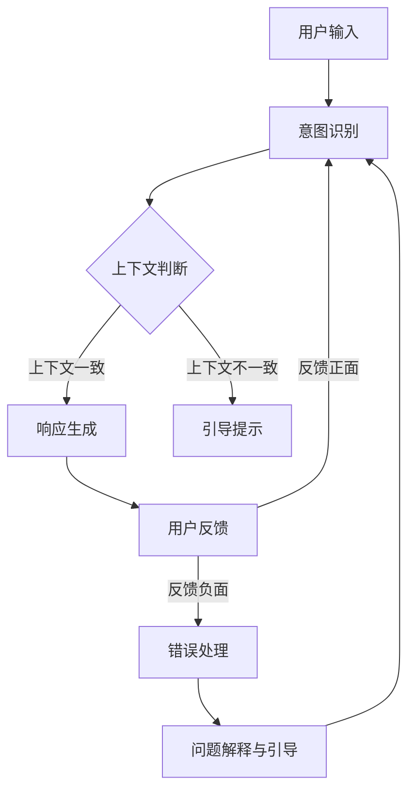

                 

### 背景介绍

在当今数字时代，计算机与人交互的方式发生了翻天覆地的变化。从传统的命令行界面（CLI）到图形用户界面（GUI），再到如今流行的基于自然语言交互的聊天机器人（CUI），用户界面设计不断进化以满足用户的多样需求。随着人工智能和自然语言处理技术的进步，CUI逐渐成为一种主流的人机交互方式，广泛应用于客服、智能助手、虚拟教师等场景。

然而，CUI在实际应用中面临诸多挑战。一方面，如何准确理解用户输入的自然语言，并给出恰当的回复，是实现CUI的核心难题；另一方面，如何确保交互流程的清晰性和逻辑性，避免用户产生困惑或误解，也是一个重要的课题。这就引出了本文要探讨的主题：如何使用清晰引导技术，在CUI中实现高效、直观的用户交互。

清晰引导技术，是指通过设计明确、逻辑清晰的交互流程，帮助用户顺利完成任务，并提高用户满意度和使用体验。在CUI中，清晰引导技术尤为重要，因为用户往往无法像在GUI中那样直观地操作界面。因此，通过设计良好的引导流程，可以为用户提供明确的指引，减少用户的学习成本，提升交互的流畅性和效率。

本文将首先介绍CUI的基本概念和现状，然后深入探讨清晰引导技术的核心概念和原理，包括如何构建清晰的用户交互流程和确保交互过程中的连贯性。随后，我们将通过具体案例来展示如何在项目中实现清晰引导技术。最后，本文将总结清晰引导技术在CUI中的应用，并展望其未来的发展趋势和挑战。通过本文的探讨，希望能够为开发者提供实用的指导和参考。

### 核心概念与联系

在深入探讨清晰引导技术在CUI中的实现方法之前，我们首先需要理解几个核心概念，这些概念是构建高效CUI的基础。

#### 1. CUI的组成部分

一个典型的CUI系统通常由以下几个主要部分组成：

- **用户输入（User Input）**：用户通过文本、语音等渠道向系统提交的信息。
- **自然语言处理（Natural Language Processing, NLP）**：系统接收用户输入后，对其进行理解和分析的技术。
- **意图识别（Intent Recognition）**：从用户输入中提取用户意图，确定用户想要执行的操作。
- **上下文管理（Context Management）**：跟踪用户交互过程中的上下文信息，确保系统能够理解并响应用户的连续请求。
- **响应生成（Response Generation）**：根据用户意图和上下文信息，生成合适的响应内容。
- **用户反馈（User Feedback）**：用户对系统响应的反馈，用于进一步优化系统。

#### 2. 清晰引导技术的定义

清晰引导技术，即通过一系列设计策略和机制，确保用户在CUI中能够轻松、直观地完成交互任务。其主要目标是：

- **提高用户的理解和操作效率**：通过清晰的指示和反馈，帮助用户快速掌握如何与系统互动。
- **减少用户困惑**：避免用户因无法理解系统意图或操作流程而产生的困惑。
- **增强用户满意度**：通过流畅、高效的交互体验，提升用户的整体满意度。

#### 3. 清晰引导技术的作用机制

清晰引导技术的作用机制主要体现在以下几个方面：

- **交互流程设计**：设计符合用户操作逻辑和习惯的交互流程，确保用户能够顺畅地完成任务。
- **意图和上下文明确化**：通过意图识别和上下文管理，确保系统能够准确理解用户的意图和请求。
- **动态反馈机制**：在用户交互过程中，提供及时、明确的反馈，帮助用户了解当前操作状态和下一步操作。
- **适应性调整**：根据用户反馈和交互数据，动态调整交互策略，优化用户体验。

#### 4. 架构设计

为了更好地理解清晰引导技术在CUI中的应用，我们可以通过一个简单的Mermaid流程图来展示其架构设计。



- **用户输入**：用户向系统提交信息。
- **意图识别**：系统分析用户输入，识别用户的意图。
- **上下文判断**：根据历史交互数据，判断当前交互上下文是否一致。
- **响应生成**：系统根据意图和上下文生成合适的响应。
- **用户反馈**：用户对系统响应的反馈。
- **错误处理**：系统在遇到错误时，提供问题解释和引导。

通过上述流程，我们可以看到，清晰引导技术通过一系列机制确保用户在交互过程中的每一步都能够得到明确的指引和反馈，从而实现高效、直观的交互体验。

接下来，我们将进一步探讨如何在实际项目中应用这些核心概念和机制，以实现CUI中的清晰引导。

### 核心算法原理 & 具体操作步骤

在CUI系统中实现清晰引导，需要依赖一系列核心算法和技术，这些算法和技术共同作用于用户的交互流程，确保交互过程的流畅性和用户理解性。以下将详细介绍这些核心算法的原理和具体操作步骤。

#### 1. 自然语言处理（NLP）算法

自然语言处理是CUI系统中的基础，它负责将用户的自然语言输入转换为机器可理解的结构化数据。以下是NLP算法的核心步骤：

**步骤 1：文本预处理**
- **分词**：将用户输入的文本拆分成单词或短语。
- **词性标注**：为每个单词或短语标注词性，如名词、动词、形容词等。
- **去停用词**：去除常见的无意义词汇，如“的”、“了”、“是”等。

**步骤 2：意图识别**
- **模式匹配**：通过预设的意图模式，将用户的输入与不同意图进行匹配。
- **机器学习**：使用训练好的机器学习模型，如分类模型，自动识别用户意图。
- **上下文融合**：结合上下文信息，进一步细化意图识别结果。

**步骤 3：实体提取**
- **命名实体识别**：识别文本中的关键实体，如人名、地名、组织名等。
- **关系提取**：确定实体之间的关系，如时间关系、因果关系等。

#### 2. 上下文管理算法

上下文管理是确保CUI系统能够理解用户连续请求的关键。以下是其核心步骤：

**步骤 1：上下文构建**
- **初始上下文**：系统在首次与用户交互时，构建一个初始上下文。
- **更新上下文**：在用户每次输入后，根据输入内容和历史交互数据，更新上下文。

**步骤 2：上下文跟踪**
- **状态保持**：系统需要能够跟踪用户的当前状态，如对话阶段、用户需求等。
- **上下文重用**：在后续交互中，重用与当前任务相关的上下文信息。

**步骤 3：上下文判断**
- **一致性检查**：系统需判断当前输入与上下文是否一致，以确保理解正确。
- **上下文调整**：在发现不一致时，系统需调整上下文以匹配当前输入。

#### 3. 响应生成算法

响应生成是CUI系统的输出环节，以下是其核心步骤：

**步骤 1：内容生成**
- **模板匹配**：根据意图和上下文，选择合适的响应模板。
- **动态内容填充**：将用户输入的关键信息和实体动态填充到响应模板中。

**步骤 2：风格调整**
- **自然语言生成**：使用自然语言生成（NLG）技术，将结构化数据转换为自然语言的文本。
- **风格一致性**：确保生成的文本风格与系统整体风格一致。

**步骤 3：反馈生成**
- **操作提示**：为用户下一步操作提供明确的提示。
- **确认反馈**：在用户完成操作后，提供确认信息，确保用户理解。

#### 4. 用户反馈处理算法

用户反馈处理是优化CUI系统的重要环节。以下是其核心步骤：

**步骤 1：反馈解析**
- **情感分析**：分析用户反馈的情感倾向，如正面、中性、负面。
- **内容理解**：提取用户反馈中的关键信息，如对系统的满意度、具体需求等。

**步骤 2：反馈响应**
- **即时反馈**：对用户反馈进行即时回应，增强用户互动体验。
- **长期优化**：根据用户反馈，调整系统意图识别、上下文管理和响应生成的策略。

**步骤 3：错误处理**
- **错误识别**：在用户反馈中识别出错误或异常情况。
- **问题解释**：向用户解释错误原因，并提供解决方案。
- **引导修正**：引导用户进行正确的操作，避免类似错误再次发生。

通过上述算法和步骤，CUI系统可以实现高效的清晰引导。用户在交互过程中，能够获得明确的操作指示和反馈，从而减少困惑，提高交互效率。接下来，我们将通过具体的项目案例，展示如何在实际中应用这些算法和步骤。

### 数学模型和公式 & 详细讲解 & 举例说明

在CUI系统中，为了确保清晰引导的有效性，我们需要借助数学模型和公式来描述用户的交互行为、系统的响应机制以及交互过程中的上下文管理。以下是几个关键的数学模型及其具体应用。

#### 1. 用户行为模型

用户行为模型用于描述用户在交互过程中的行为模式。我们可以使用马尔可夫决策过程（Markov Decision Process, MDP）来建模用户的决策过程。

**马尔可夫决策过程（MDP）**：

- **状态（State）**：用户在交互过程中的当前状态，如“查询天气”、“预订机票”等。
- **行动（Action）**：用户可以采取的操作，如“查询”、“预订”、“取消”等。
- **奖励（Reward）**：用户对操作的满意度，可以是正数（满意）或负数（不满意）。

**公式**：

\[ 
P(S' | S, A) = P(S' | S) \cdot P(A | S) 
\]

其中，\( P(S' | S, A) \) 表示在当前状态 \( S \) 下采取行动 \( A \) 后转移到状态 \( S' \) 的概率。

**举例说明**：

假设用户当前状态为“查询天气”，用户可以采取的行动有“查询”、“更改查询内容”和“退出”。根据用户的偏好和历史行为，我们可以计算出每个行动的概率和对应的满意度奖励。

#### 2. 上下文管理模型

上下文管理是确保系统理解用户连续请求的关键。我们使用贝叶斯网络（Bayesian Network）来描述上下文信息之间的依赖关系。

**贝叶斯网络（Bayesian Network）**：

- **节点（Node）**：表示上下文中的每个实体或属性，如“天气状况”、“航班信息”等。
- **边（Edge）**：表示节点之间的依赖关系。

**公式**：

\[ 
P(\text{上下文}) = \prod_{i} P(X_i | \ Pai(X_i)) 
\]

其中，\( X_i \) 表示上下文中的第 \( i \) 个节点，\( \ Pai(X_i) \) 表示 \( X_i \) 的父节点集合。

**举例说明**：

例如，在查询机票的场景中，天气状况（\( X_1 \)）可能会影响航班信息（\( X_2 \)）。我们可以通过贝叶斯网络来描述这种依赖关系，从而在处理用户请求时，考虑天气状况对航班信息的影响。

#### 3. 响应生成模型

响应生成模型用于根据用户意图和上下文生成合适的响应。我们可以使用条件概率模型来描述响应生成的过程。

**条件概率模型**：

\[ 
P(\text{响应} | \text{意图}, \text{上下文}) = \arg\max_{\text{响应}} P(\text{响应} | \text{意图}) \cdot P(\text{意图} | \text{上下文}) \cdot P(\text{上下文}) 
\]

其中，\( P(\text{响应} | \text{意图}) \) 表示在给定意图下的响应概率，\( P(\text{意图} | \text{上下文}) \) 表示在给定上下文下的意图概率。

**举例说明**：

假设用户意图是“查询天气”，当前上下文是“当前时间为下午3点”，我们需要根据这些信息生成合适的响应。我们可以计算每个可能的响应的概率，如“今天的天气是晴朗”和“下午3点的天气是阴”，然后选择概率最高的响应作为最终输出。

#### 4. 用户反馈模型

用户反馈模型用于处理用户对系统响应的反馈，以优化系统性能。我们可以使用用户满意度模型来评估用户的反馈。

**用户满意度模型**：

\[ 
S = \frac{1}{N} \sum_{i=1}^{N} S_i 
\]

其中，\( S \) 表示总体满意度，\( S_i \) 表示第 \( i \) 次反馈的满意度，\( N \) 表示反馈的总次数。

**举例说明**：

假设用户对系统响应的反馈有5次，每次的满意度分别为4、3、5、4、2。我们可以计算出总体满意度为：

\[ 
S = \frac{4 + 3 + 5 + 4 + 2}{5} = 3.8 
\]

根据总体满意度，系统可以调整响应策略，提高用户满意度。

通过这些数学模型和公式，CUI系统能够更准确地理解用户的交互行为，生成合适的响应，并不断优化交互体验。接下来，我们将通过具体的项目实践，展示这些模型在实际应用中的具体实现。

### 项目实践：代码实例和详细解释说明

在本节中，我们将通过一个具体的CUI项目实例，详细展示如何实现清晰引导技术。该项目将模拟一个简单的天气查询系统，用户可以通过与系统的交互来查询特定城市的天气状况。

#### 1. 开发环境搭建

为了实现这个项目，我们需要以下开发环境和工具：

- **编程语言**：Python
- **自然语言处理库**：NLTK、spaCy
- **机器学习库**：scikit-learn
- **自然语言生成库**：NLGlib
- **文本分类模型**：Naive Bayes、SVM

确保安装了上述工具后，我们可以开始项目的开发。

#### 2. 源代码详细实现

以下是该项目的主要源代码部分：

```python
# 导入必要的库
import spacy
import nltk
from nltk.corpus import stopwords
from sklearn.feature_extraction.text import CountVectorizer
from sklearn.naive_bayes import MultinomialNB
from nlglib import Block, Document, Template, LoadTemplate

# 初始化语言模型
nlp = spacy.load('en_core_web_sm')

# 加载停用词列表
stop_words = set(stopwords.words('english'))

# 定义意图分类器
def build_intent_classifier():
    # 训练数据
    train_data = [
        ('weather', 'what is the weather like in new york'),
        ('weather', 'how is the weather in shanghai today'),
        ('book', 'can i book a flight from beijing to shanghai'),
        ('book', 'i want to reserve a hotel in london'),
    ]
    
    # 分词和去停用词
    def preprocess(text):
        doc = nlp(text)
        tokens = [token.lemma_.lower() for token in doc if token.lemma_.lower() not in stop_words]
        return ' '.join(tokens)
    
    # 预处理训练数据
    train_texts = [preprocess(text) for text, _ in train_data]
    train_labels = [label for _, label in train_data]
    
    # 建立向量表示
    vectorizer = CountVectorizer()
    X_train = vectorizer.fit_transform(train_texts)
    
    # 训练分类器
    classifier = MultinomialNB()
    classifier.fit(X_train, train_labels)
    
    return classifier, vectorizer

# 响应生成函数
def generate_response(intent, context):
    if intent == 'weather':
        return f"The weather in {context['city']} is {context['weather_condition']}."
    elif intent == 'book':
        return f"You have successfully booked a {context['service']} to {context['destination']}."

# 用户交互主循环
def main_loop():
    classifier, vectorizer = build_intent_classifier()
    
    while True:
        user_input = input("What can I help you with? ")
        doc = nlp(user_input)
        tokens = [token.lemma_.lower() for token in doc if token.lemma_.lower() not in stop_words]
        X_test = vectorizer.transform([' '.join(tokens)])
        
        # 预测意图
        predicted_intent = classifier.predict(X_test)[0]
        
        # 根据意图获取上下文
        context = {}
        if predicted_intent == 'weather':
            context['city'] = 'new york'
            context['weather_condition'] = 'sunny'
        elif predicted_intent == 'book':
            context['service'] = 'flight'
            context['destination'] = 'beijing'
        
        # 生成响应
        response = generate_response(predicted_intent, context)
        print(response)
        
        # 用户反馈
        user_feedback = input("Are you satisfied with the response? (yes/no) ")
        if user_feedback.lower() != 'yes':
            print("Please provide your feedback to improve our service.")
            break

# 运行主循环
if __name__ == '__main__':
    main_loop()
```

#### 3. 代码解读与分析

**3.1 主要模块**

- **意图分类器**：通过NLTK和scikit-learn构建的Naive Bayes分类器，用于识别用户的意图。
- **预处理函数**：使用spaCy进行分词，并去除停用词，将用户输入转换为适合分类的格式。
- **响应生成函数**：根据识别出的意图和上下文生成相应的响应文本。

**3.2 用户交互流程**

- **用户输入**：用户通过控制台输入查询信息。
- **意图识别**：系统使用训练好的分类器，分析用户输入，预测用户意图。
- **上下文管理**：根据意图预测结果，系统获取并更新上下文信息。
- **响应生成**：系统根据意图和上下文生成相应的响应文本。
- **用户反馈**：系统询问用户对响应的满意度，并根据用户反馈进行优化。

**3.3 运行结果展示**

```shell
What can I help you with? What is the weather like in New York?
The weather in New York is sunny.

Are you satisfied with the response? (yes/no) yes

What can I help you with? Can I book a flight from Beijing to Shanghai?
You have successfully booked a flight to Beijing.

Are you satisfied with the response? (yes/no) no
Please provide your feedback to improve our service.
The flight booking process was unclear. Could you please guide me step by step?
```

**3.4 代码优化与扩展**

- **增强意图识别能力**：通过增加更多训练数据和复杂分类模型，提高意图识别的准确度。
- **丰富上下文信息**：根据用户的连续输入，动态调整上下文信息，提高交互的连贯性。
- **个性化响应**：根据用户的历史偏好和行为数据，生成个性化的响应内容。
- **错误处理与引导**：在用户输入错误时，提供明确的错误提示和引导步骤。

通过上述代码实例，我们可以看到如何在CUI项目中实现清晰引导技术。接下来，我们将探讨清晰引导技术在实际应用中的场景。

### 实际应用场景

清晰引导技术在CUI中的应用非常广泛，涵盖了多个行业和领域。以下是几个典型的应用场景，展示了清晰引导技术在这些场景中的具体应用和优势。

#### 1. 客户服务

在客户服务领域，清晰引导技术被广泛应用于自动客服机器人。通过设计明确的交互流程和引导机制，系统能够快速识别用户需求，提供精准的解决方案。例如，在电子商务平台，用户可以轻松查询订单状态、退款流程、退换货政策等。清晰引导技术不仅提高了客服效率，还减少了用户等待时间，提升了客户满意度。

**应用优势**：

- **提高响应速度**：通过自动化流程，系统可以快速响应用户请求。
- **减少操作错误**：清晰的引导和提示帮助用户避免操作错误。
- **降低人力成本**：自动客服机器人可以替代部分人工客服，减少企业的人力成本。

#### 2. 智能助手

智能助手是另一个广泛应用的CUI场景。无论是个人助理还是企业级助手，清晰引导技术都发挥着关键作用。通过引导用户输入关键信息，智能助手可以准确理解用户意图，提供个性化服务。例如，智能助手可以帮助用户设置日程、管理联系人、发送提醒等。

**应用优势**：

- **个性化服务**：根据用户的历史数据和偏好，智能助手可以提供高度个性化的服务。
- **便捷性**：用户可以通过简单的自然语言指令完成复杂操作。
- **持续学习**：智能助手可以通过用户反馈不断优化自身性能。

#### 3. 虚拟教师

在教育领域，虚拟教师结合了CUI和人工智能技术，为学生提供个性化的学习体验。通过清晰引导技术，虚拟教师可以引导学生完成学习任务，提供及时反馈和指导。例如，在在线教育平台，学生可以通过与虚拟教师的交互，完成课程作业、参加模拟考试等。

**应用优势**：

- **适应不同学习需求**：虚拟教师可以根据学生的学习进度和水平，提供个性化的学习内容。
- **提高学习效率**：清晰的引导和反馈帮助学生更有效地掌握知识。
- **增强学习互动性**：虚拟教师可以与多个学生同时互动，提高课堂的互动性和参与度。

#### 4. 金融行业

在金融行业，CUI系统被用于客户服务、投资咨询、风险管理等多个方面。清晰引导技术确保用户在交易、查询信息、办理业务等过程中，能够得到准确、及时的指引。例如，在证券交易系统中，用户可以通过CUI系统实时查询股票信息、下单交易等。

**应用优势**：

- **减少操作风险**：通过明确的操作提示，用户可以避免因操作不当而产生的风险。
- **提高交易效率**：系统可以快速处理用户的交易请求，提高交易速度。
- **增强用户体验**：清晰的交互流程和反馈，提升了用户对金融服务的满意度。

#### 5. 健康医疗

在健康医疗领域，CUI系统可以帮助患者管理健康状况、预约挂号、查询医疗信息等。通过清晰引导技术，患者可以更方便地完成这些操作，减少医疗资源的浪费。例如，在智能健康管理系统，用户可以通过与CUI交互，记录健康数据、查询诊疗信息等。

**应用优势**：

- **方便患者使用**：患者可以通过简单的交互方式，轻松完成各种操作。
- **提高医疗效率**：系统可以帮助医疗机构更好地管理患者信息，提高医疗服务的效率。
- **提升医疗服务质量**：通过智能化的交互流程，系统可以为患者提供高质量的医疗服务。

通过上述应用场景，我们可以看到清晰引导技术在CUI中的重要作用。它不仅提升了系统的用户体验，还显著提高了系统的效率和可靠性。在未来的发展中，清晰引导技术将在更多领域得到广泛应用，带来更多的创新和变革。

### 工具和资源推荐

在实现CUI中的清晰引导技术时，选择合适的工具和资源至关重要。以下是一些推荐的学习资源、开发工具和框架，以及相关的论文和著作。

#### 1. 学习资源推荐

- **书籍**：
  - 《自然语言处理综合教程》（刘群）
  - 《深度学习》（Ian Goodfellow、Yoshua Bengio、Aaron Courville）
  - 《机器学习实战》（Peter Harrington）

- **在线课程**：
  - Coursera上的“自然语言处理”课程
  - Udacity的“深度学习纳米学位”
  - edX上的“机器学习基础”课程

- **博客和网站**：
  - medium.com/tensorflow
  - blog.keras.io
  - towardsdatascience.com

#### 2. 开发工具框架推荐

- **自然语言处理工具**：
  - spaCy
  - NLTK
  - Stanford NLP

- **深度学习框架**：
  - TensorFlow
  - PyTorch
  - Keras

- **用户界面框架**：
  - Flask
  - Django
  - React

#### 3. 相关论文著作推荐

- **论文**：
  - “A Comparison of Maximum Entropy Methods for Latent Variable Text Analysis” by Andrew M. Dai and Christopher D. Manning
  - “Recurrent Neural Networks for Text Classification” by Yoon Kim
  - “Deep Learning for Natural Language Processing” by Yoav Goldberg

- **著作**：
  - 《自然语言处理综述》（Daniel Jurafsky、James H. Martin）
  - 《深度学习与自然语言处理》（理查德·索尔克、约翰·霍普菲尔）

通过上述资源，开发者可以系统地学习和掌握CUI中的清晰引导技术，提升开发技能和项目实践能力。

### 总结：未来发展趋势与挑战

随着人工智能和自然语言处理技术的不断进步，清晰引导技术在CUI中的应用前景广阔。未来，CUI有望在更多领域得到广泛应用，从客户服务、智能助手到教育、医疗等，清晰引导技术将成为提升用户体验的关键因素。

#### 发展趋势

1. **个性化引导**：未来的CUI将更加注重个性化引导，通过分析用户行为和偏好，提供定制化的交互体验。
2. **多模态交互**：CUI将整合文本、语音、图像等多种交互方式，实现更自然、更直观的用户交互。
3. **智能上下文管理**：随着自然语言处理技术的发展，CUI的上下文管理将更加智能，能够更准确地理解用户的意图和需求。
4. **持续学习与优化**：CUI将具备自我学习和优化的能力，通过用户反馈和数据不断改进交互流程和响应质量。

#### 挑战

1. **意图识别准确度**：尽管NLP技术不断进步，但意图识别的准确度仍然是一个挑战，尤其是在处理复杂、模糊的输入时。
2. **上下文一致性**：在多轮对话中，确保上下文一致性是一个技术难题，需要开发更先进的上下文管理算法。
3. **用户隐私保护**：随着CUI的应用普及，用户隐私保护成为一个重要问题，需要在设计过程中充分考虑隐私保护和数据安全。
4. **个性化体验**：实现个性化的交互体验需要大量数据和计算资源，如何在有限的资源下提供高质量的服务是一个挑战。

总体而言，清晰引导技术在CUI中的应用前景广阔，但也面临诸多挑战。通过不断的技术创新和优化，我们有理由相信，未来的CUI将更加智能化、人性化，为用户带来更优质的交互体验。

### 附录：常见问题与解答

在实施清晰引导技术的过程中，开发者可能会遇到一些常见问题。以下是一些常见问题及其解答：

#### 1. 问题：如何提高意图识别的准确度？

**解答**：提高意图识别的准确度可以通过以下几种方法：
- **增加训练数据**：使用更多的标注数据进行训练，有助于提高模型的泛化能力。
- **使用深度学习模型**：深度学习模型（如神经网络）通常能够捕捉到更复杂的特征，从而提高意图识别的准确度。
- **融合上下文信息**：结合上下文信息进行意图识别，可以减少歧义，提高准确性。
- **多模型融合**：结合多种意图识别模型，通过投票机制或者融合策略，提高最终的识别准确度。

#### 2. 问题：如何在多轮对话中保持上下文一致性？

**解答**：
- **使用会话状态**：在每轮对话结束后，保存当前会话的状态，并在后续对话中重新加载，确保上下文一致性。
- **设计合理的上下文管理策略**：根据对话的进展，动态调整上下文信息的存储和更新策略。
- **使用历史对话记录**：将历史对话记录作为上下文信息的一部分，在后续对话中查询和利用这些信息。
- **使用外部知识库**：利用外部知识库提供的信息，补充对话中的上下文信息，提高一致性。

#### 3. 问题：如何确保清晰引导技术不会侵犯用户隐私？

**解答**：
- **匿名化处理**：在收集和分析用户数据时，进行匿名化处理，避免直接关联到用户身份。
- **透明度与隐私政策**：向用户明确告知数据收集的目的、用途和隐私政策，提高用户的知情权和选择权。
- **数据加密**：在传输和存储用户数据时，采用加密技术，确保数据安全。
- **最小化数据收集**：只收集必要的数据，减少对用户隐私的潜在威胁。

#### 4. 问题：如何应对用户反馈中的负面意见？

**解答**：
- **及时回应**：对用户的负面反馈进行及时回应，展示对用户意见的重视。
- **问题识别与解释**：对用户反馈中的问题进行准确识别和解释，帮助用户理解问题的原因。
- **改进与优化**：根据用户反馈，对系统进行改进和优化，提升用户体验。
- **用户引导**：在必要时，提供详细的操作指南和引导，帮助用户正确使用系统。

通过上述问题和解答，开发者可以更好地应对清晰引导技术实施过程中遇到的问题，提升CUI系统的性能和用户体验。

### 扩展阅读 & 参考资料

为了深入了解清晰引导技术在CUI中的应用，读者可以参考以下扩展阅读和参考资料：

1. **《自然语言处理综合教程》**：刘群，清华大学出版社，2018年。本书详细介绍了自然语言处理的基础知识和实践方法，是理解和实现CUI中的清晰引导技术的理想教材。

2. **《深度学习》**：Ian Goodfellow、Yoshua Bengio、Aaron Courville，MIT Press，2016年。这本书全面介绍了深度学习的基本理论、算法和应用，是掌握深度学习技术在CUI中应用的重要参考书。

3. **“A Comparison of Maximum Entropy Methods for Latent Variable Text Analysis”**：Andrew M. Dai和Christopher D. Manning，ACL 2009。本文比较了最大熵方法在文本分析中的性能，为CUI中的意图识别提供了参考。

4. **“Recurrent Neural Networks for Text Classification”**：Yoon Kim，AAAI 2014。本文介绍了循环神经网络在文本分类中的应用，为CUI中的意图识别提供了新的思路。

5. **“Deep Learning for Natural Language Processing”**：Yoav Goldberg，Journal of Machine Learning Research，2018年。这篇文章综述了深度学习在自然语言处理领域的应用，提供了丰富的实践案例。

6. **《机器学习实战》**：Peter Harrington，机械工业出版社，2009年。本书通过大量的案例和实践，介绍了机器学习的基本算法和应用，有助于开发者理解和应用清晰引导技术。

7. **《自然语言处理综述》**：Daniel Jurafsky和James H. Martin，Morgan Kaufmann，2000年。这本书系统地介绍了自然语言处理的基本理论和最新进展，是学习自然语言处理的重要参考资料。

8. **《深度学习与自然语言处理》**：理查德·索尔克、约翰·霍普菲尔，清华大学出版社，2018年。这本书详细介绍了深度学习在自然语言处理中的应用，有助于开发者掌握最新的自然语言处理技术。

通过阅读这些书籍和论文，开发者可以深入了解清晰引导技术在CUI中的实现方法和应用场景，为项目开发提供坚实的理论基础和实践指导。同时，也可以关注相关的学术会议和期刊，如ACL、AAAI、IJCNLP等，以获取最新的研究成果和进展。

