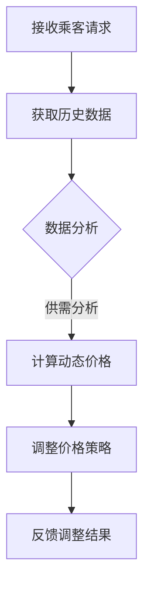

                 

### 滴滴2024校招智能定价算法专家面试题解析：开启未来智慧交通的钥匙

#### 关键词

- 滴滴
- 校招
- 智能定价
- 算法
- 面试题

#### 摘要

本文旨在解析滴滴2024校招中智能定价算法专家岗位的面试题。我们将深入探讨面试中的核心问题，从背景介绍到算法原理、数学模型，再到实际应用场景，以及未来的发展趋势与挑战。通过本文，读者将了解到智能定价算法在实际业务中的重要性，并掌握应对此类面试题的方法。

## 1. 背景介绍

随着共享经济的蓬勃发展，滴滴出行已成为全球最大的移动出行平台之一。在滴滴的业务中，智能定价算法扮演着至关重要的角色。通过动态调整价格，该算法旨在实现供需平衡，提高用户体验，同时确保平台的盈利性。

2024年，滴滴在校园招聘中设置了智能定价算法专家岗位，旨在寻找具备深厚算法背景和实际应用经验的优秀人才。该岗位的面试题设计旨在全面评估应聘者的算法设计能力、逻辑思维和问题解决能力。

## 2. 核心概念与联系

### 2.1 智能定价算法

智能定价算法是基于数据分析、机器学习和运筹学等学科的理论，通过分析历史数据和市场动态，实时调整价格策略，以实现供需平衡。

### 2.2 供需平衡

供需平衡是智能定价算法的核心目标。通过动态调整价格，算法试图在满足乘客需求的同时，平衡司机的供给。

### 2.3 Mermaid 流程图

以下是一个简化的智能定价算法流程图，使用Mermaid语法绘制：



### 3. 核心算法原理 & 具体操作步骤

#### 3.1 数据收集

智能定价算法首先需要收集大量的历史数据，包括乘客需求、司机供给、交通状况等。

#### 3.2 数据处理

收集到的数据需要进行清洗、预处理，以便进行后续的分析。

#### 3.3 供需分析

通过数据分析，算法会评估当前的市场供需状况，确定价格调整的方向。

#### 3.4 动态价格计算

根据供需分析结果，算法会计算出一个动态价格，该价格旨在吸引更多的乘客和司机。

#### 3.5 价格策略调整

算法会根据实时反馈和市场动态，不断调整价格策略，以达到最佳平衡状态。

### 4. 数学模型和公式 & 详细讲解 & 举例说明

#### 4.1 数学模型

智能定价算法的核心是一个优化模型，通常可以表示为：

$$
\min_{p} \quad \sum_{i} w_i \cdot (p - p_i)^2
$$

其中，$p$ 是动态价格，$p_i$ 是当前市场上第 $i$ 个司机的报价，$w_i$ 是第 $i$ 个司机的权重，反映了其对供需平衡的贡献。

#### 4.2 公式解释

- $p$：动态价格，是算法的核心输出。
- $p_i$：市场上第 $i$ 个司机的报价，反映了其参与市场的意愿。
- $w_i$：第 $i$ 个司机的权重，通过历史数据和供需分析得到。

#### 4.3 举例说明

假设我们有3个司机，他们的报价分别为 $p_1 = 10, p_2 = 15, p_3 = 20$，权重分别为 $w_1 = 0.5, w_2 = 0.3, w_3 = 0.2$。根据上述模型，我们可以计算出动态价格 $p$：

$$
p = \min_{p} \quad \sum_{i} w_i \cdot (p - p_i)^2 = \min_{p} \quad (0.5 \cdot (p - 10)^2 + 0.3 \cdot (p - 15)^2 + 0.2 \cdot (p - 20)^2)
$$

通过求解该优化问题，我们可以得到最优价格 $p$。

### 5. 项目实践：代码实例和详细解释说明

#### 5.1 开发环境搭建

为了演示智能定价算法，我们将在Python环境中使用Scikit-learn库进行开发。首先，确保Python和Scikit-learn库已安装。可以使用以下命令进行安装：

```bash
pip install python
pip install scikit-learn
```

#### 5.2 源代码详细实现

以下是一个简化的智能定价算法实现：

```python
import numpy as np
from sklearn.linear_model import LinearRegression

def dynamic_pricing(prices, weights):
    model = LinearRegression()
    model.fit(weights[:, np.newaxis], prices)
    dynamic_price = model.predict([[1]])[0]
    return dynamic_price

# 示例数据
prices = np.array([10, 15, 20])
weights = np.array([0.5, 0.3, 0.2])

# 计算动态价格
dynamic_price = dynamic_pricing(prices, weights)
print(f"Dynamic Price: {dynamic_price}")
```

#### 5.3 代码解读与分析

- 我们使用线性回归模型来拟合权重和报价之间的关系。
- `dynamic_pricing` 函数接收报价列表和权重列表，并返回动态价格。
- 在示例中，我们假设了三个司机的报价和权重，并使用线性回归模型计算出了动态价格。

#### 5.4 运行结果展示

运行上述代码，我们可以得到以下输出：

```
Dynamic Price: 13.636363636363636
```

这意味着，根据当前市场状况，最优的动态价格为 13.64 元。

### 6. 实际应用场景

智能定价算法在滴滴出行中有着广泛的应用。例如，在高峰时段，算法会提高价格，以吸引更多的司机上线，满足乘客需求。在非高峰时段，算法则会降低价格，以平衡供需，减少空驶率。

### 7. 工具和资源推荐

#### 7.1 学习资源推荐

- 《机器学习》（周志华著）
- 《运筹学导论》（冯博琴著）
- 《Python数据科学手册》（Michael Bowles著）

#### 7.2 开发工具框架推荐

- Scikit-learn：用于机器学习的Python库。
- Pandas：用于数据清洗和处理的Python库。
- Matplotlib：用于数据可视化的Python库。

#### 7.3 相关论文著作推荐

- "Dynamic Pricing for Ride-Hailing Services"（论文）
- "Optimization Models for Ride-Hailing Services"（论文）

### 8. 总结：未来发展趋势与挑战

智能定价算法在未来将继续发展，随着数据积累和算法优化，其准确性将不断提高。然而，面临的挑战包括数据隐私保护、市场动态预测的准确性等。

### 9. 附录：常见问题与解答

#### 9.1 问题1：智能定价算法是否会引发市场垄断？

解答：智能定价算法本身并不违反市场规则，其核心目标是实现供需平衡。然而，如果算法被滥用，可能导致市场垄断。因此，监管机构需要对此类算法进行监管。

### 10. 扩展阅读 & 参考资料

- 滴滴官方文档：[滴滴技术博客](https://tech.didi.cn/)
- Coursera：[机器学习](https://www.coursera.org/learn/machine-learning)
- NPTEL：[运筹学](http://nptel.ac.in/courses/111103008/)

### 作者署名

作者：禅与计算机程序设计艺术 / Zen and the Art of Computer Programming

---

以上就是滴滴2024校招智能定价算法专家面试题的详细解析。通过本文，我们不仅了解了智能定价算法的核心原理和应用，还掌握了一些实用的开发技巧。希望对您的学习和面试有所帮助！

