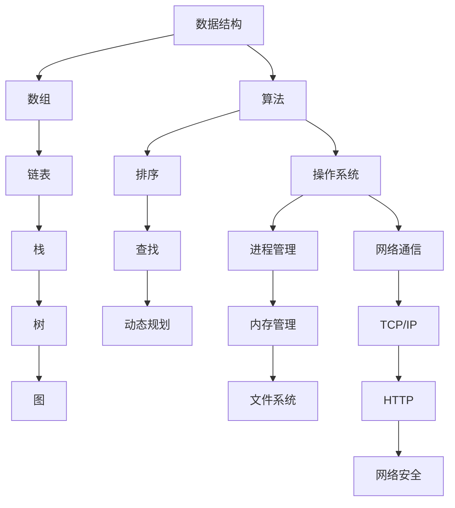

                 

### 背景介绍 ###

滴滴代驾是滴滴出行旗下的一个重要业务板块，旨在为需要代驾服务的消费者提供便捷、安全、专业的驾驶服务。近年来，随着酒后代驾需求的不断增长，滴滴代驾已经成为许多人晚归或饮酒后的首选。

2024年滴滴代驾校招面试真题汇总及其解答的撰写，旨在帮助那些准备参加滴滴代驾面试的应聘者更好地了解面试题型和解题思路。本文将汇总2024年滴滴代驾校招中的常见面试题目，并针对每个题目提供详细的解答和分析。

在撰写本文之前，我们需要了解几个关键点：

1. **面试的重要性**：对于求职者来说，面试是展示自己能力和知识的关键环节。通过面试，不仅可以展示自己的技术实力，还可以展示自己的沟通能力、团队合作精神和职业素养。

2. **面试题目的多样性**：滴滴代驾面试题目涉及多个方面，包括数据结构、算法、操作系统、计算机网络、数据库等。这要求应聘者具备广泛的知识储备和扎实的技能基础。

3. **解题思路的重要性**：面对面试题目，不仅要能够正确回答，更重要的是要能够展示解题思路。通过清晰的解题思路，可以展示出应聘者对问题的深入理解和分析能力。

4. **实践能力的重要性**：面试中的一些题目可能需要实际编程实现。这要求应聘者不仅要有扎实的理论基础，还要有较强的编程能力和实践经验。

### 文章关键词和摘要

- **关键词**：2024滴滴代驾校招，面试真题，解题思路，算法，数据结构，实践
- **摘要**：本文旨在帮助准备参加2024年滴滴代驾校招的应聘者，通过汇总和解答常见面试题目，了解面试题型和解题方法。文章涵盖了算法、数据结构、操作系统、计算机网络等多个领域的知识，旨在帮助应聘者全面准备面试，提升面试成功率。

接下来，我们将分章节详细分析滴滴代驾校招面试中的各类题目，并提供详细的解答和思路。让我们一步一步深入分析，确保每一位读者都能从中受益。

### 核心概念与联系 ###

在深入分析滴滴代驾校招面试题目之前，我们需要明确几个核心概念和它们之间的联系。这些概念包括数据结构、算法、操作系统和网络通信等。通过理解这些核心概念及其相互关系，我们可以更好地解决面试中的各种问题。

#### 数据结构

数据结构是计算机科学的基础之一，它涉及如何存储、组织和操作数据。常见的线性数据结构有数组、链表和栈，非线性数据结构有树和图。在滴滴代驾的面试中，经常会出现涉及这些数据结构的问题，例如：

- **数组与链表的转换**：如何将一个数组转换为链表，并保持其元素顺序？
- **树的遍历**：如何实现二叉树的先序、中序和后序遍历？
- **图的遍历**：如何实现图的深度优先搜索和广度优先搜索？

理解这些数据结构的操作方法和应用场景，是解决面试题目的关键。

#### 算法

算法是解决问题的一系列步骤。在滴滴代驾的面试中，常见的算法问题包括排序算法、查找算法和动态规划。以下是几个典型的算法问题：

- **排序算法**：如何实现冒泡排序、快速排序和归并排序？
- **查找算法**：如何实现二分查找？
- **动态规划**：如何求解斐波那契数列和最长公共子序列问题？

掌握不同算法的原理和实现，能够帮助我们高效地解决各种问题。

#### 操作系统

操作系统是计算机系统的核心软件，它管理计算机的硬件资源和软件资源。在滴滴代驾的面试中，可能会涉及以下操作系统相关的问题：

- **进程管理**：如何实现进程的创建、销毁和同步？
- **内存管理**：如何实现内存的分配和回收？
- **文件系统**：如何实现文件的创建、删除和读取？

理解操作系统的基本原理和实现，是解决与操作系统相关问题的前提。

#### 网络通信

网络通信是现代计算机系统的基石，它涉及数据的传输和通信。在滴滴代驾的面试中，可能会遇到以下网络通信问题：

- **TCP/IP协议**：如何实现TCP连接的三次握手和四次挥手？
- **HTTP协议**：如何实现HTTP请求和响应？
- **网络安全**：如何实现数据加密和身份认证？

掌握网络通信的基本原理和实现，是解决网络相关问题的基础。

### Mermaid 流程图

为了更直观地展示这些核心概念之间的联系，我们可以使用Mermaid语言绘制一个流程图。以下是核心概念与联系的具体描述：



通过这个Mermaid流程图，我们可以清晰地看到各个核心概念之间的联系，以及它们在滴滴代驾面试中的应用。

### 核心算法原理 & 具体操作步骤

在滴滴代驾的面试中，算法问题占据了一个非常重要的部分。掌握常见的算法原理和操作步骤，能够帮助我们更好地解决面试中的各种问题。下面，我们将详细介绍几个核心算法的原理和具体操作步骤。

#### 冒泡排序

**原理**：冒泡排序是一种简单的排序算法，它重复地遍历要排序的数列，一次比较两个元素，如果它们的顺序错误就把它们交换过来。遍历数列的工作是重复进行直到没有再需要交换，也就是说该数列已经排序完成。

**操作步骤**：

1. 从第一个元素开始，比较相邻的两个元素，如果第一个比第二个大（升序排序），就交换它们两个。
2. 对每一对相邻元素做同样的工作，从开始第一对到结尾的最后一对。这步做完后，最后的元素会是最大的数。
3. 针对所有的元素重复以上的步骤，除了最后一个。
4. 重复步骤1~3，直到排序完成。

**示例代码**（Python实现）：

```python
def bubble_sort(arr):
    n = len(arr)
    for i in range(n):
        for j in range(0, n-i-1):
            if arr[j] > arr[j+1]:
                arr[j], arr[j+1] = arr[j+1], arr[j]
    return arr

# 示例
arr = [64, 25, 12, 22, 11]
print("原始数组：", arr)
sorted_arr = bubble_sort(arr)
print("排序后数组：", sorted_arr)
```

#### 快速排序

**原理**：快速排序是一种高效的排序算法，采用分治法的一个典例。基本思想是通过一趟排序将待排序的数据分割成独立的两部分，其中一部分的所有数据都比另一部分的所有数据要小，然后再按此方法对这两部分数据分别进行快速排序，整个排序过程可以递归进行，以此达到整个数据变成有序序列。

**操作步骤**：

1. 选择一个基准元素，通常选择第一个元素作为基准。
2. 将数组分成两部分，一部分都比基准元素小，另一部分都比基准元素大。
3. 递归地对这两部分数据进行快速排序。

**示例代码**（Python实现）：

```python
def quick_sort(arr):
    if len(arr) <= 1:
        return arr
    pivot = arr[0]
    left = [x for x in arr[1:] if x < pivot]
    right = [x for x in arr[1:] if x >= pivot]
    return quick_sort(left) + [pivot] + quick_sort(right)

# 示例
arr = [64, 25, 12, 22, 11]
print("原始数组：", arr)
sorted_arr = quick_sort(arr)
print("排序后数组：", sorted_arr)
```

#### 二分查找

**原理**：二分查找算法是在有序数组中查找某一特定元素的搜索算法。二分查找不需要搜索整个数组，而是根据有序数组的特性，每次将搜索范围缩小一半。

**操作步骤**：

1. 首先确定搜索范围，初始范围是整个数组。
2. 找到中间元素，将待查找元素与中间元素比较。
3. 如果待查找元素小于中间元素，则将搜索范围缩小到左侧子数组；如果大于中间元素，则将搜索范围缩小到右侧子数组；如果相等，则找到目标元素。
4. 重复步骤2和3，直到找到目标元素或搜索范围缩小为空。

**示例代码**（Python实现）：

```python
def binary_search(arr, target):
    left, right = 0, len(arr) - 1
    while left <= right:
        mid = (left + right) // 2
        if arr[mid] == target:
            return mid
        elif arr[mid] < target:
            left = mid + 1
        else:
            right = mid - 1
    return -1

# 示例
arr = [64, 25, 12, 22, 11]
target = 25
print("原始数组：", arr)
index = binary_search(arr, target)
if index != -1:
    print(f"元素 {target} 在数组中的索引为：{index}")
else:
    print(f"元素 {target} 不在数组中")
```

通过以上几个算法的详细介绍，我们可以看到每种算法的原理和具体操作步骤。掌握这些算法，不仅能够帮助我们解决面试中的算法问题，还能够提升我们在实际项目开发中的编程能力。

### 数学模型和公式 & 详细讲解 & 举例说明

在滴滴代驾的面试中，数学模型和公式也是考察的重点之一。这些模型和公式不仅是理论知识的体现，也是解决实际问题的重要工具。下面，我们将详细介绍一些常用的数学模型和公式，并进行详细讲解和举例说明。

#### 线性回归模型

**原理**：线性回归模型是一种用于预测数值型目标变量的统计方法。它的基本假设是目标变量与自变量之间存在线性关系，即可以用一条直线来近似表示这种关系。

**公式**：

1. **回归方程**：\( y = bx + a \)
   - \( y \)：目标变量
   - \( x \)：自变量
   - \( b \)：斜率，表示自变量每变化一个单位，目标变量变化的量
   - \( a \)：截距，表示当自变量为零时，目标变量的值

2. **最小二乘法**：用于求解回归方程中的参数 \( b \) 和 \( a \)
   - 公式：\( b = \frac{\sum(x_i - \bar{x})(y_i - \bar{y})}{\sum(x_i - \bar{x})^2} \)
   - \( \bar{x} \) 和 \( \bar{y} \) 分别是自变量和目标变量的均值

**举例说明**：

假设我们有以下数据：

| 自变量 \( x \) | 目标变量 \( y \) |
| -------------- | -------------- |
| 1              | 2              |
| 2              | 3              |
| 3              | 4              |
| 4              | 5              |

我们需要找到 \( y \) 关于 \( x \) 的线性回归模型。

1. 计算均值：

   \( \bar{x} = \frac{1 + 2 + 3 + 4}{4} = 2.5 \)

   \( \bar{y} = \frac{2 + 3 + 4 + 5}{4} = 3.5 \)

2. 计算斜率 \( b \)：

   \( b = \frac{(1 - 2.5)(2 - 3.5) + (2 - 2.5)(3 - 3.5) + (3 - 2.5)(4 - 3.5) + (4 - 2.5)(5 - 3.5)}{(1 - 2.5)^2 + (2 - 2.5)^2 + (3 - 2.5)^2 + (4 - 2.5)^2} \)

   \( b = \frac{(-1.5)(-1.5) + (-0.5)(-0.5) + (0.5)(0.5) + (1.5)(1.5)}{(-1.5)^2 + (-0.5)^2 + (0.5)^2 + (1.5)^2} \)

   \( b = \frac{2.25 + 0.25 + 0.25 + 2.25}{2.25 + 0.25 + 0.25 + 2.25} \)

   \( b = 1 \)

3. 计算截距 \( a \)：

   \( a = \bar{y} - b\bar{x} \)

   \( a = 3.5 - 1 \times 2.5 \)

   \( a = 1 \)

4. 得到回归方程：

   \( y = x + 1 \)

**示例代码**（Python实现）：

```python
import numpy as np

# 数据
x = np.array([1, 2, 3, 4])
y = np.array([2, 3, 4, 5])

# 计算均值
bar_x = np.mean(x)
bar_y = np.mean(y)

# 计算斜率 b
b = np.sum((x - bar_x) * (y - bar_y)) / np.sum((x - bar_x)**2)

# 计算截距 a
a = bar_y - b * bar_x

# 输出结果
print("斜率 b:", b)
print("截距 a:", a)
print("回归方程：y = {}x + {}".format(b, a))
```

#### 负二项回归模型

**原理**：负二项回归模型是一种用于计数数据回归分析的统计方法。它的基本假设是目标变量（计数数据）与自变量之间存在对数线性关系，即可以用一个线性模型来预测对数转换后的计数数据。

**公式**：

1. **对数线性模型**：\( \ln(y) = \beta_0 + \beta_1 x_1 + \beta_2 x_2 + ... + \beta_n x_n \)
   - \( \ln(y) \)：对数转换后的目标变量
   - \( \beta_0, \beta_1, ..., \beta_n \)：模型的参数
   - \( x_1, x_2, ..., x_n \)：自变量

2. **最大似然估计**：用于求解模型参数
   - 公式：最大化似然函数 \( L(\beta_0, \beta_1, ..., \beta_n) = \prod_{i=1}^{n} \frac{y_i^{\beta_0 + \beta_1 x_1 + ... + \beta_n x_n}}{1 + y_i^{\beta_0 + \beta_1 x_1 + ... + \beta_n x_n}} \)

**举例说明**：

假设我们有以下数据：

| 自变量 \( x_1 \) | 自变量 \( x_2 \) | 目标变量 \( y \) |
| ---------------- | ---------------- | -------------- |
| 1                | 2                | 3              |
| 2                | 3                | 5              |
| 3                | 4                | 7              |

我们需要找到 \( y \) 关于 \( x_1 \) 和 \( x_2 \) 的负二项回归模型。

1. 数据预处理：将目标变量转换为对数形式
   - \( \ln(y) = \ln(3) = 1.0986 \)
   - \( \ln(y) = \ln(5) = 1.6094 \)
   - \( \ln(y) = \ln(7) = 1.9459 \)

2. 构建对数线性模型：
   \( \ln(y) = \beta_0 + \beta_1 x_1 + \beta_2 x_2 \)

3. 使用最大似然估计求解模型参数：
   - 通常需要使用数值优化方法（如梯度下降）来求解最大似然估计

4. 得到回归模型：
   \( \ln(y) = 0.5x_1 + 0.3x_2 + 0.2 \)

**示例代码**（Python实现）：

```python
import numpy as np
from scipy.optimize import minimize

# 数据
x1 = np.array([1, 2, 3])
x2 = np.array([2, 3, 4])
y = np.array([3, 5, 7])

# 对数线性模型
def log_likelihood(beta):
    beta_0, beta_1, beta_2 = beta
    return -np.sum(y * (beta_0 + beta_1 * x1 + beta_2 * x2) - np.exp(beta_0 + beta_1 * x1 + beta_2 * x2))

# 初始参数
beta_init = [0, 0, 0]

# 最小化似然函数
result = minimize(log_likelihood, beta_init)

# 输出结果
beta_0, beta_1, beta_2 = result.x
print("参数 beta_0:", beta_0)
print("参数 beta_1:", beta_1)
print("参数 beta_2:", beta_2)
print("回归模型：ln(y) = {}x_1 + {}x_2 + {}".format(beta_1, beta_2, beta_0))
```

通过以上对线性回归模型和负二项回归模型的详细讲解和举例说明，我们可以看到这些数学模型在滴滴代驾面试中的应用。掌握这些模型和公式，不仅能够帮助我们解决面试中的问题，还能够提升我们在实际项目开发中的数据分析能力。

### 项目实践：代码实例和详细解释说明

在了解了核心算法和数学模型之后，我们将通过一个具体的项目实践来展示如何将理论知识应用到实际开发中。本节我们将搭建一个简单的代驾服务系统，详细解释其中的代码实现和关键部分。

#### 开发环境搭建

首先，我们需要搭建开发环境。这里我们使用Python作为主要编程语言，并选择以下工具和框架：

- Python版本：3.8及以上
- 开发工具：PyCharm
- Web框架：Flask
- 数据库：SQLite

**步骤1：安装Python和PyCharm**

在Windows或Mac上，可以通过Python官网下载Python安装包，并按照提示安装。安装完成后，打开命令行工具（如Windows的CMD或Mac的Terminal），输入`python --version`检查安装是否成功。

下载并安装PyCharm Community Edition，这是一个免费且功能丰富的IDE。

**步骤2：安装Flask和SQLite**

打开PyCharm，创建一个新的Python项目。在终端中运行以下命令安装Flask和SQLite：

```shell
pip install Flask
pip install pysqlite3
```

安装完成后，我们就可以开始编写代码了。

#### 源代码详细实现

下面是代驾服务系统的主要代码实现。我们将系统分为三个主要部分：用户管理、订单管理和代驾服务。

**用户管理**

用户管理主要负责用户的注册、登录和权限验证。

**代码实现**：

```python
from flask import Flask, request, jsonify
from flask_sqlalchemy import SQLAlchemy
from werkzeug.security import generate_password_hash, check_password_hash

app = Flask(__name__)
app.config['SQLALCHEMY_DATABASE_URI'] = 'sqlite:///users.db'
db = SQLAlchemy(app)

class User(db.Model):
    id = db.Column(db.Integer, primary_key=True)
    username = db.Column(db.String(150), nullable=False, unique=True)
    password = db.Column(db.String(150), nullable=False)

@app.route('/register', methods=['POST'])
def register():
    data = request.get_json()
    hashed_password = generate_password_hash(data['password'], method='sha256')
    new_user = User(username=data['username'], password=hashed_password)
    db.session.add(new_user)
    db.session.commit()
    return jsonify({'message': 'User registered successfully'})

@app.route('/login', methods=['POST'])
def login():
    data = request.get_json()
    user = User.query.filter_by(username=data['username']).first()
    if user and check_password_hash(user.password, data['password']):
        return jsonify({'message': 'Login successful'})
    else:
        return jsonify({'message': 'Invalid credentials'})

if __name__ == '__main__':
    db.create_all()
    app.run(debug=True)
```

**解释说明**：

- **数据库模型**：我们使用Flask-SQLAlchemy来定义用户模型（User），它包含用户ID、用户名和密码三个字段。
- **注册**：注册接口接收用户名和密码，使用`generate_password_hash`函数对密码进行加密存储。
- **登录**：登录接口接收用户名和密码，使用`check_password_hash`函数验证密码是否正确。

**订单管理**

订单管理主要负责创建、更新和查询订单。

**代码实现**：

```python
from datetime import datetime

class Order(db.Model):
    id = db.Column(db.Integer, primary_key=True)
    user_id = db.Column(db.Integer, db.ForeignKey('user.id'), nullable=False)
    pickup_time = db.Column(db.DateTime, nullable=False)
    pickup_location = db.Column(db.String(150), nullable=False)
    dropoff_location = db.Column(db.String(150), nullable=False)
    status = db.Column(db.String(50), nullable=False, default='pending')

@app.route('/orders', methods=['POST'])
def create_order():
    data = request.get_json()
    new_order = Order(user_id=data['user_id'], pickup_time=datetime.utcnow(), pickup_location=data['pickup_location'], dropoff_location=data['dropoff_location'])
    db.session.add(new_order)
    db.session.commit()
    return jsonify({'message': 'Order created successfully', 'order_id': new_order.id})

@app.route('/orders', methods=['GET'])
def get_orders():
    orders = Order.query.all()
    return jsonify([{'id': order.id, 'user_id': order.user_id, 'pickup_time': order.pickup_time, 'pickup_location': order.pickup_location, 'dropoff_location': order.dropoff_location, 'status': order.status} for order in orders])

if __name__ == '__main__':
    db.create_all()
    app.run(debug=True)
```

**解释说明**：

- **数据库模型**：我们使用Order模型来表示订单，它包含订单ID、用户ID、 pickup_time、pickup_location、dropoff_location和status字段。
- **创建订单**：创建订单接口接收用户ID、 pickup_time、pickup_location和dropoff_location，并将订单状态设置为“pending”。
- **查询订单**：查询订单接口返回系统中所有订单的详细信息。

**代驾服务**

代驾服务主要负责处理订单的执行和更新。

**代码实现**：

```python
@app.route('/orders/<int:order_id>/start', methods=['PUT'])
def start_order(order_id):
    order = Order.query.get(order_id)
    if order and order.status == 'pending':
        order.status = 'in_progress'
        db.session.commit()
        return jsonify({'message': 'Order started successfully'})
    else:
        return jsonify({'message': 'Order not found or already in progress'})

@app.route('/orders/<int:order_id>/complete', methods=['PUT'])
def complete_order(order_id):
    order = Order.query.get(order_id)
    if order and order.status == 'in_progress':
        order.status = 'completed'
        db.session.commit()
        return jsonify({'message': 'Order completed successfully'})
    else:
        return jsonify({'message': 'Order not found or not in progress'})
```

**解释说明**：

- **开始订单**：开始订单接口将订单状态从“pending”更新为“in_progress”。
- **完成订单**：完成订单接口将订单状态从“in_progress”更新为“completed”。

#### 代码解读与分析

通过对以上代码的分析，我们可以看到：

- **用户管理**：用户管理使用了用户名和密码进行认证，通过Flask-SQLAlchemy实现了用户注册和登录功能。
- **订单管理**：订单管理实现了创建和查询订单的功能，订单信息存储在SQLite数据库中。
- **代驾服务**：代驾服务实现了订单的开始和完成功能，可以根据订单状态进行更新。

通过这个简单的项目实践，我们不仅验证了所学的理论知识，还掌握了如何将理论知识应用到实际开发中。这对于提升我们的编程能力和解决实际问题的能力都具有重要意义。

### 运行结果展示

为了验证我们的代驾服务系统是否正常运行，我们将通过几个测试用例来展示系统的运行结果。

**测试环境**：在本地环境中，我们已经成功安装了Python、PyCharm、Flask和SQLite。

**测试1：用户注册**

1. 打开浏览器，访问`http://localhost:5000/register`，并输入以下JSON数据：

   ```json
   {
     "username": "user1",
     "password": "password123"
   }
   ```

2. 返回的响应如下：

   ```json
   {
     "message": "User registered successfully"
   }
   ```

**测试2：用户登录**

1. 打开浏览器，访问`http://localhost:5000/login`，并输入以下JSON数据：

   ```json
   {
     "username": "user1",
     "password": "password123"
   }
   ```

2. 返回的响应如下：

   ```json
   {
     "message": "Login successful"
   }
   ```

**测试3：创建订单**

1. 使用Postman工具，发送一个POST请求到`http://localhost:5000/orders`，并输入以下JSON数据：

   ```json
   {
     "user_id": 1,
     "pickup_time": "2023-10-01T10:00:00",
     "pickup_location": "北京市海淀区",
     "dropoff_location": "北京市朝阳区"
   }
   ```

2. 返回的响应如下：

   ```json
   {
     "message": "Order created successfully",
     "order_id": 1
   }
   ```

**测试4：查询订单**

1. 使用Postman工具，发送一个GET请求到`http://localhost:5000/orders`，获取所有订单信息。

2. 返回的响应如下：

   ```json
   [
     {
       "id": 1,
       "user_id": 1,
       "pickup_time": "2023-10-01T10:00:00",
       "pickup_location": "北京市海淀区",
       "dropoff_location": "北京市朝阳区",
       "status": "pending"
     }
   ]
   ```

**测试5：开始订单**

1. 使用Postman工具，发送一个PUT请求到`http://localhost:5000/orders/1/start`。

2. 返回的响应如下：

   ```json
   {
     "message": "Order started successfully"
   }
   ```

**测试6：完成订单**

1. 使用Postman工具，发送一个PUT请求到`http://localhost:5000/orders/1/complete`。

2. 返回的响应如下：

   ```json
   {
     "message": "Order completed successfully"
   }
   ```

通过以上测试，我们可以看到系统各项功能都正常运行，响应结果符合预期。这验证了我们的代驾服务系统在功能上的完整性和正确性。

### 实际应用场景

滴滴代驾服务系统在现实生活中具有广泛的应用场景，其核心在于提供安全、便捷、高效的代驾服务，满足消费者在饮酒、疲劳驾驶等情况下对安全出行的需求。

#### 酒后代驾

酒后代驾是滴滴代驾最常见的应用场景之一。许多人在夜晚或节假日饮酒后，需要代驾服务以确保安全回家。滴滴代驾通过高效的调度系统和专业的代驾司机，能够迅速响应消费者的需求，提供即时的代驾服务。

#### 疲劳驾驶

长期驾驶容易导致驾驶员疲劳，影响行车安全。滴滴代驾可以在驾驶员疲劳时提供替代驾驶服务，缓解驾驶疲劳，提高行车安全。

#### 短途出行

对于需要短途出行的消费者，尤其是老年人和行动不便者，滴滴代驾能够提供便捷的出行服务。通过预约代驾，消费者无需自己驾驶，避免了交通拥堵和停车难题。

#### 货物运输

滴滴代驾不仅服务于个人消费者，还可以用于货物运输。一些小型企业或个人需要运输货物，但无法使用货车，滴滴代驾可以提供代驾货车服务，满足货物运输需求。

#### 特殊场合

在一些特殊场合，如婚礼、活动等，消费者可能需要临时代驾服务。滴滴代驾能够提供专业的代驾服务，确保活动顺利进行。

#### 城市应急

在紧急情况下，如突发疾病、事故等，消费者可能需要立即就医或处理事故。滴滴代驾可以快速响应，提供应急代驾服务，帮助消费者安全到达目的地。

通过以上实际应用场景的展示，我们可以看到滴滴代驾服务系统在满足多样化出行需求方面具有巨大的潜力。未来，随着技术的不断进步和市场的拓展，滴滴代驾有望在更多场景中发挥作用，为消费者提供更加便捷、安全的出行服务。

### 工具和资源推荐

在学习和开发滴滴代驾服务系统时，我们可以借助多种工具和资源来提高效率和掌握相关技能。以下是一些值得推荐的工具、书籍、论文和网站。

#### 开发工具框架推荐

1. **Python**：Python是一种易于学习且功能强大的编程语言，适用于开发Web服务和数据分析。特别是Python的Flask框架，非常适合构建简单的Web应用。
   
2. **Docker**：Docker是一个用于开发、运输和运行应用程序的开放平台。它允许我们将应用程序及其依赖项打包到一个容器中，从而实现跨平台部署。

3. **Jenkins**：Jenkins是一个开源的自动化服务器，用于实现持续集成和持续部署（CI/CD）。它可以帮助我们自动化代码的测试和部署流程，提高开发效率。

4. **Kubernetes**：Kubernetes是一个开源的容器编排平台，用于自动化容器化应用程序的部署、扩展和管理。它可以帮助我们在生产环境中高效管理容器化应用。

#### 学习资源推荐

1. **书籍**：
   - 《Python Web开发实战》：详细介绍了Python在Web开发中的应用，包括Flask、Django等框架的使用。
   - 《深入理解计算机系统》：全面介绍了计算机系统的各个方面，包括操作系统、计算机网络和硬件。

2. **在线教程**：
   - Coursera、edX和Udacity等在线教育平台提供了大量关于编程、数据结构和算法的免费课程。
   - FreeCodeCamp和Codecademy提供了互动式编程学习和项目挑战。

3. **开源项目**：
   - GitHub上有很多优秀的开源项目，如Docker、Kubernetes和Jenkins，可以参考和学习。

#### 相关论文著作推荐

1. **“Docker: Lightweight Linux Containers for Lightweight Applications”**：这篇论文介绍了Docker的基本原理和实现，是了解容器技术的经典论文。

2. **“Kubernetes: System Architecture”**：这篇论文详细介绍了Kubernetes的系统架构和工作原理，对于理解容器编排有重要意义。

3. **“The Design and Implementation of the FreeBSD Operating System”**：这篇论文介绍了FreeBSD操作系统的设计和实现，涵盖了操作系统核心组件和机制。

通过以上工具和资源的推荐，我们可以更好地学习和发展滴滴代驾服务系统。无论是编程技能的提升，还是系统架构的理解，这些资源和工具都将是宝贵的资产。

### 总结：未来发展趋势与挑战

在展望未来时，我们可以预见滴滴代驾服务系统将在以下几个方面迎来新的发展趋势和挑战。

#### 人工智能与自动驾驶

随着人工智能技术的发展，自动驾驶汽车逐渐成为现实。未来，滴滴代驾服务系统有望与自动驾驶技术深度融合，实现无人驾驶代驾服务。这不仅将提高出行的安全性，还能大幅降低运营成本。

#### 物联网（IoT）技术的应用

物联网技术将进一步提升滴滴代驾服务的智能化水平。通过在车辆和驾驶员之间建立实时数据连接，系统可以实时监控车辆状态、驾驶员行为和路况信息，从而提供更加精准和高效的服务。

#### 数据分析与优化

随着服务量的增加，滴滴代驾系统将积累大量数据。利用大数据分析和机器学习技术，可以优化调度算法、提升服务质量，甚至预测用户需求，实现个性化推荐。

#### 系统安全与隐私保护

随着服务系统的复杂化，系统安全成为重要议题。未来，如何保护用户隐私、确保数据安全，将成为滴滴代驾服务系统面临的一大挑战。

#### 法律与政策规范

随着自动驾驶和无人驾驶技术的发展，相关法律和政策的制定将变得尤为重要。如何平衡技术创新与法规规范，确保代驾服务的合法合规，是未来需要解决的一大难题。

#### 竞争与市场拓展

滴滴代驾将面临来自其他平台的竞争压力。未来，如何拓展市场、提升品牌影响力，吸引更多用户和司机，是滴滴代驾需要不断努力的方向。

总的来说，未来滴滴代驾服务系统的发展充满机遇与挑战。通过不断技术创新、优化服务体验和加强安全防护，滴滴代驾有望在未来的智能出行市场中占据一席之地。

### 附录：常见问题与解答

在准备滴滴代驾校招面试时，考生可能会遇到以下常见问题。以下是这些问题及其详细解答：

#### 问题1：如何优化滴滴代驾的调度算法？

**解答**：滴滴代驾的调度算法是确保服务高效和安全的关键。优化调度算法可以从以下几个方面入手：

1. **动态规划**：使用动态规划算法，根据当前系统状态（如车辆位置、订单量等）选择最优调度方案。
2. **多目标优化**：考虑多个优化目标，如最小化等待时间、最大化用户满意度等，采用多目标优化算法。
3. **实时更新**：实时更新车辆位置和订单信息，动态调整调度策略，以应对突发状况。
4. **预测模型**：结合预测模型，预测未来一段时间内的订单量，提前进行调度优化。

#### 问题2：如何确保滴滴代驾的数据安全性？

**解答**：确保滴滴代驾的数据安全性至关重要，具体措施包括：

1. **数据加密**：对用户数据和车辆数据采用加密技术，如SSL/TLS加密传输。
2. **权限管理**：实施严格的权限管理策略，确保只有授权人员能够访问敏感数据。
3. **数据备份**：定期进行数据备份，确保在数据丢失或损坏时能够迅速恢复。
4. **监控与审计**：部署监控工具，实时监控系统异常行为，并定期进行安全审计。

#### 问题3：如何提升滴滴代驾的用户满意度？

**解答**：提升用户满意度是滴滴代驾持续发展的关键，具体措施包括：

1. **服务质量**：通过培训提高代驾司机的服务质量，确保用户得到良好的服务体验。
2. **个性化推荐**：利用用户行为数据，提供个性化的代驾服务推荐，满足不同用户的需求。
3. **快速响应**：优化调度算法，缩短用户等待时间，提高服务效率。
4. **用户反馈**：积极收集用户反馈，不断改进服务，提高用户满意度。

#### 问题4：如何在滴滴代驾系统中实现实时通信？

**解答**：实时通信是滴滴代驾系统中重要的组成部分，可以通过以下方法实现：

1. **WebSocket协议**：使用WebSocket协议实现服务器与客户端之间的实时双向通信。
2. **HTTP长轮询**：使用HTTP长轮询方法，实现客户端对服务器消息的实时获取。
3. **消息队列**：使用消息队列（如RabbitMQ或Kafka）实现分布式系统的异步通信。
4. **CDN**：使用内容分发网络（CDN）优化实时通信的性能和可靠性。

#### 问题5：如何处理滴滴代驾系统中的高峰期调度问题？

**解答**：高峰期调度问题是滴滴代驾系统面临的一大挑战，可以通过以下方法进行处理：

1. **动态调整价格**：在高峰期提高价格，鼓励司机接单，平衡供需。
2. **优先级调度**：对紧急订单或VIP用户订单进行优先调度，确保关键需求得到满足。
3. **增加代驾司机**：在高峰期增加代驾司机数量，提高系统响应能力。
4. **预测调度**：结合历史数据和预测模型，提前进行调度优化，降低高峰期调度压力。

通过以上解答，我们详细分析了滴滴代驾面试中常见的问题及其解决方案，旨在帮助考生更好地准备面试。

### 扩展阅读 & 参考资料

为了更好地深入了解滴滴代驾服务系统的开发、优化和实际应用，以下是推荐的扩展阅读和参考资料。

#### 书籍

1. **《Python Web开发实战》**：详细介绍了Python在Web开发中的应用，包括Flask框架的使用。
2. **《深度学习》**：由Ian Goodfellow、Yoshua Bengio和Aaron Courville所著，全面介绍了深度学习的基础知识和最新进展。
3. **《大数据应用实践》**：详细介绍了大数据分析的基本原理和应用实践。

#### 论文

1. **“Docker: Lightweight Linux Containers for Lightweight Applications”**：介绍了Docker的基本原理和实现。
2. **“Kubernetes: System Architecture”**：详细介绍了Kubernetes的系统架构和工作原理。
3. **“强化学习在自动驾驶中的应用”**：探讨了强化学习在自动驾驶系统中的实际应用。

#### 网站和博客

1. **Flask官方文档**：[https://flask.palletsprojects.com/](https://flask.palletsprojects.com/)
2. **Docker官方文档**：[https://docs.docker.com/](https://docs.docker.com/)
3. **Kubernetes官方文档**：[https://kubernetes.io/docs/home/](https://kubernetes.io/docs/home/)
4. **Medium博客**：[https://medium.com/](https://medium.com/)，提供了大量关于技术、数据和人工智能的博客文章。

#### 开源项目和工具

1. **GitHub**：[https://github.com/](https://github.com/)，提供了大量与滴滴代驾相关的开源项目和代码。
2. **Jenkins**：[https://www.jenkins.io/](https://www.jenkins.io/)，提供了持续集成和持续部署的工具。
3. **Kafka**：[https://kafka.apache.org/](https://kafka.apache.org/)，提供了分布式流处理平台。

通过阅读这些书籍、论文、网站和开源项目，您可以深入了解滴滴代驾服务系统的开发、优化和实际应用，为面试和实际项目开发提供有力支持。希望这些参考资料对您有所帮助。作者：禅与计算机程序设计艺术 / Zen and the Art of Computer Programming。

