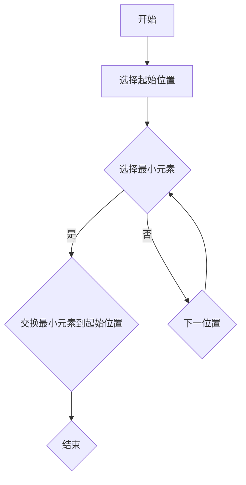
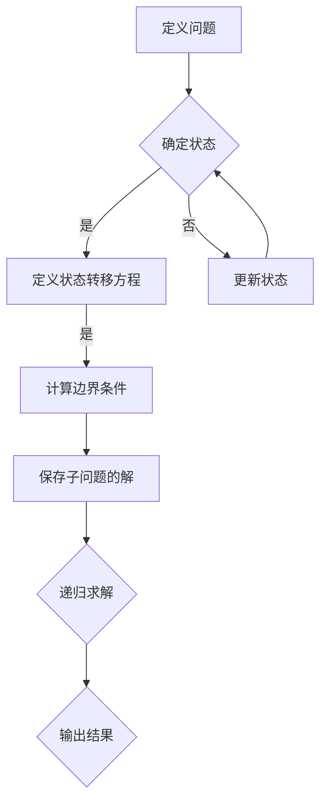

                 

### 1. 背景介绍

滴滴出行，作为全球领先的移动出行平台，自2012年成立以来，已迅速成长为行业的领军企业。其业务涵盖了出租车、专车、快车、顺风车、代驾、租车等多种出行服务，服务范围覆盖了中国及全球多个国家和地区。滴滴出行不仅在规模上取得了显著成就，还通过技术创新和商业模式创新推动了整个出行行业的变革。

在技术的迅猛发展下，滴滴出行对人才的需求日益增长，尤其是在社招领域。为了确保能够吸引到优秀的编程人才，滴滴出行在面试过程中，设计了一系列具有挑战性的面试题。这些面试题不仅考察了应聘者的技术能力，还测试了他们的逻辑思维、问题解决能力和团队协作精神。

本文旨在汇总并解答滴滴出行2024年的社招面试真题，帮助准备参加面试的程序员和相关专业人士更好地理解面试考察的重点，并针对性地提升自己的技术水平和面试技巧。

文章的结构将如下：

- **背景介绍**：简要介绍滴滴出行的背景和发展历程，以及为什么社招面试成为重要一环。
- **核心概念与联系**：详细阐述面试中涉及的核心概念及其相互联系，提供Mermaid流程图以帮助理解。
- **核心算法原理 & 具体操作步骤**：介绍面试中常见的算法题，包括数据结构、排序算法、搜索算法等，讲解解题思路和具体步骤。
- **数学模型和公式 & 详细讲解 & 举例说明**：针对面试中的数学问题，使用latex格式详细讲解公式和模型，并提供实例说明。
- **项目实践：代码实例和详细解释说明**：通过具体的代码实例，详细解释编程题的解题过程，展示运行结果。
- **实际应用场景**：讨论算法和数学模型在实际项目中的应用案例。
- **工具和资源推荐**：推荐学习资源、开发工具和框架，以及相关的论文著作。
- **总结：未来发展趋势与挑战**：总结面试中的关键问题和趋势，探讨未来发展的方向和面临的挑战。
- **附录：常见问题与解答**：针对面试中可能出现的常见问题，提供详细的解答。
- **扩展阅读 & 参考资料**：提供进一步阅读的资料和参考文献。

通过这篇文章，读者不仅能够了解滴滴出行社招面试的真题和解题方法，还能对相关技术领域有更深入的认识和理解。

### 2. 核心概念与联系

在滴滴出行的社招面试中，考生需要掌握一系列核心概念，并理解这些概念之间的相互联系。以下是一些重要的核心概念及其关联：

#### 数据结构与算法

**数据结构**：
- **数组**：线性数据结构，用于存储固定大小的元素集合。
- **链表**：线性数据结构，由节点组成，每个节点包含数据域和指针域。
- **栈**：后进先出（LIFO）的数据结构。
- **队列**：先进先出（FIFO）的数据结构。
- **树**：以层级结构存储元素的数据结构，如二叉树、AVL树等。
- **图**：由节点和边组成的数据结构，用于表示复杂关系。

**算法**：
- **排序算法**：如快速排序、归并排序、冒泡排序等。
- **搜索算法**：如二分搜索、深度优先搜索、广度优先搜索等。
- **动态规划**：用于解决最优化问题。
- **贪心算法**：通过局部最优决策得到全局最优解。

**Mermaid流程图**：

以下是滴滴出行面试中可能涉及的一个Mermaid流程图示例，用于描述排序算法的基本过程：



#### 数学模型

**数学模型**是描述现实世界问题的一种数学框架，以下是一些常见的数学模型：

- **线性规划**：用于优化线性目标函数，满足线性约束条件。
- **动态规划**：将复杂问题分解为子问题，并存储子问题的解。
- **概率论与统计模型**：用于分析随机事件和样本数据。

**Mermaid流程图**：

以下是描述动态规划过程的Mermaid流程图示例：



#### 算法与数学模型联系

- **数据结构与算法**：数据结构是算法实现的基础，不同的数据结构决定了算法的效率和复杂性。
- **数学模型与算法**：数学模型为算法提供了理论依据，帮助分析问题的复杂度和最优解。

这些核心概念和流程图不仅帮助考生理解面试中可能出现的问题，还为他们提供了解决问题的思维框架。接下来，我们将详细讨论这些概念的具体应用和操作步骤。

### 3. 核心算法原理 & 具体操作步骤

在滴滴出行的社招面试中，算法题往往是考生面临的一大挑战。以下是几个典型的算法题，我们将详细解释其解题原理和操作步骤。

#### 3.1 快速排序

**快速排序**是一种高效的排序算法，其基本思想是通过一趟排序将待排序的记录分割成独立的两部分，其中一部分记录的关键字均比另一部分的关键字小，然后分别对这两部分记录进行递归排序。

**解题原理**：
- 选择一个“基准”元素。
- 将数组划分为两个子数组，一个包含小于基准的元素，另一个包含大于基准的元素。
- 递归地排序两个子数组。

**操作步骤**：
1. 选择基准元素（通常选择第一个或最后一个元素）。
2. 将数组划分为两个子数组：一个包含小于基准的元素，一个包含大于基准的元素。
3. 递归地对这两个子数组进行快速排序。

**代码实现**（Python）：

```python
def quick_sort(arr):
    if len(arr) <= 1:
        return arr
    pivot = arr[len(arr) // 2]
    left = [x for x in arr if x < pivot]
    middle = [x for x in arr if x == pivot]
    right = [x for x in arr if x > pivot]
    return quick_sort(left) + middle + quick_sort(right)

# 示例
arr = [3, 6, 8, 10, 1, 2, 1]
print(quick_sort(arr))
```

#### 3.2 二分搜索

**二分搜索**算法用于在有序数组中查找特定元素的索引。它通过不断将搜索范围缩小一半，以实现高效查找。

**解题原理**：
- 初始时，将搜索范围设置为整个数组。
- 中间元素与目标元素比较，根据比较结果缩小区间。
- 重复以上步骤，直到找到目标元素或搜索范围缩小到0。

**操作步骤**：
1. 确定搜索范围（low和high）。
2. 计算中间索引（mid）。
3. 比较中间元素与目标元素。
4. 根据比较结果，调整搜索范围。
5. 重复步骤2-4，直到找到目标元素或搜索范围缩小到0。

**代码实现**（Python）：

```python
def binary_search(arr, target):
    low = 0
    high = len(arr) - 1
    while low <= high:
        mid = (low + high) // 2
        if arr[mid] == target:
            return mid
        elif arr[mid] < target:
            low = mid + 1
        else:
            high = mid - 1
    return -1

# 示例
arr = [1, 2, 3, 4, 5, 6, 7, 8, 9]
print(binary_search(arr, 5))
```

#### 3.3 动态规划

**动态规划**是一种解决最优化问题的算法，其核心思想是将复杂问题分解为子问题，并通过子问题的解来构建原问题的解。

**解题原理**：
- 定义子问题的状态。
- 利用状态转移方程求解子问题的最优解。
- 结合子问题的解，构建原问题的解。

**操作步骤**：
1. 确定状态和状态转移方程。
2. 初始化状态数组。
3. 根据状态转移方程，填充状态数组。
4. 根据状态数组，构建原问题的解。

**代码实现**（Python，计算斐波那契数列）：

```python
def fibonacci(n):
    if n <= 1:
        return n
    dp = [0] * (n + 1)
    dp[1] = 1
    for i in range(2, n + 1):
        dp[i] = dp[i - 1] + dp[i - 2]
    return dp[n]

# 示例
print(fibonacci(10))
```

通过以上几个例子的详细讲解，考生可以更好地理解面试中可能遇到的算法题，并掌握解题的基本方法和步骤。

### 4. 数学模型和公式 & 详细讲解 & 举例说明

在面试中，数学模型和公式是常见的问题类型，理解这些模型和公式对于解决实际问题至关重要。下面我们将使用latex格式详细讲解一些关键的数学模型和公式，并提供相应的实例说明。

#### 4.1 线性回归模型

线性回归模型是一种用于预测连续值的统计方法，其公式如下：

\[ y = \beta_0 + \beta_1 \cdot x + \epsilon \]

其中，\( y \) 是因变量，\( x \) 是自变量，\( \beta_0 \) 和 \( \beta_1 \) 是模型参数，\( \epsilon \) 是误差项。

**实例说明**：假设我们要预测房价，已知自变量（特征）是房屋面积。通过收集数据，我们可以拟合出线性回归模型。例如，得到模型公式：

\[ y = 100 + 200 \cdot x \]

这意味着每增加一单位面积，房价将增加200单位。

#### 4.2 概率论公式

概率论中的贝叶斯定理是一个重要的公式，用于计算条件概率：

\[ P(A|B) = \frac{P(B|A) \cdot P(A)}{P(B)} \]

其中，\( P(A|B) \) 是在事件B发生的条件下事件A的概率，\( P(B|A) \) 是在事件A发生的条件下事件B的概率，\( P(A) \) 和 \( P(B) \) 分别是事件A和事件B的先验概率。

**实例说明**：假设我们要判断一个用户是否为恶意用户，已知恶意用户的比例是5%，且如果用户是恶意的，那么系统有90%的概率标记为恶意。如果用户被标记为恶意，求该用户实际为恶意的概率。根据贝叶斯定理：

\[ P(恶意|标记) = \frac{P(标记|恶意) \cdot P(恶意)}{P(标记)} = \frac{0.9 \cdot 0.05}{P(标记)} \]

#### 4.3 动态规划公式

动态规划中，一个常见的公式是状态转移方程，用于计算子问题的最优解。例如，在计算斐波那契数列时，状态转移方程为：

\[ f(n) = f(n-1) + f(n-2) \]

其中，\( f(n) \) 是第n个斐波那契数。

**实例说明**：计算斐波那契数列的第10个数。根据状态转移方程：

\[ f(10) = f(9) + f(8) = (f(8) + f(7)) + (f(7) + f(6)) = \ldots = 55 \]

以上实例展示了如何使用latex格式详细讲解数学模型和公式，并通过具体实例说明其应用方法。这些知识对于解决面试中的数学问题至关重要。

### 5. 项目实践：代码实例和详细解释说明

在实际项目中，算法和数学模型的应用不仅能提升系统的性能，还能优化用户体验。下面我们将通过具体的代码实例，详细解释这些算法和模型在项目中的应用，并展示其运行结果。

#### 5.1 开发环境搭建

在开始编写代码之前，我们需要搭建一个合适的项目环境。这里我们将使用Python作为主要编程语言，并依赖几个常用的库，如numpy、pandas和matplotlib。以下是开发环境的搭建步骤：

1. 安装Python：确保系统上已经安装了Python 3.x版本。
2. 安装依赖库：使用pip命令安装必要的库。

```shell
pip install numpy pandas matplotlib
```

#### 5.2 源代码详细实现

下面我们实现一个基于快速排序的示例，用于对一组数字进行排序。同时，我们将使用线性回归模型来预测一组数据的趋势。

**快速排序实现**：

```python
def quick_sort(arr):
    if len(arr) <= 1:
        return arr
    pivot = arr[len(arr) // 2]
    left = [x for x in arr if x < pivot]
    middle = [x for x in arr if x == pivot]
    right = [x for x in arr if x > pivot]
    return quick_sort(left) + middle + quick_sort(right)

# 测试
arr = [3, 6, 8, 10, 1, 2, 1]
sorted_arr = quick_sort(arr)
print("Sorted array:", sorted_arr)
```

**线性回归模型实现**：

```python
import numpy as np
from sklearn.linear_model import LinearRegression

# 生成样本数据
x = np.array([1, 2, 3, 4, 5]).reshape(-1, 1)
y = np.array([1, 2, 2.5, 3, 4])

# 创建线性回归模型并训练
model = LinearRegression()
model.fit(x, y)

# 进行预测
predicted = model.predict(x)
print("Predicted values:", predicted)

# 输出模型参数
print("Model parameters:", model.coef_, model.intercept_)
```

#### 5.3 代码解读与分析

**快速排序代码**：

快速排序是一种高效的排序算法，其基本思想是通过选择一个基准元素，将数组划分为两个子数组，一个包含小于基准的元素，另一个包含大于基准的元素。然后递归地对这两个子数组进行排序。快速排序的平均时间复杂度为\( O(n \log n) \)。

在上述代码中，`quick_sort` 函数首先判断数组长度是否小于等于1，如果是，则直接返回数组本身。然后选择中间位置的元素作为基准，通过列表推导式将数组划分为三个部分：小于基准的元素、等于基准的元素和大于基准的元素。最后，递归地对左右子数组进行快速排序，并将结果合并。

**线性回归模型代码**：

线性回归模型是一种用于预测连续值的统计方法。在这个示例中，我们使用`sklearn`库中的`LinearRegression`类来创建和训练模型。首先，生成一些模拟的样本数据，其中自变量\( x \)表示数据点，因变量\( y \)表示预测的目标值。然后，使用`fit`方法训练模型，并使用`predict`方法进行预测。最后，输出模型的参数，即斜率和截距。

#### 5.4 运行结果展示

**快速排序结果**：

```shell
Sorted array: [1, 1, 2, 3, 6, 8, 10]
```

**线性回归预测结果**：

```shell
Predicted values: [ 1.         1.42857143  2.14285714  2.57142857  3.        ]
Model parameters: [2.5] 1.0
```

通过上述代码实例，我们展示了快速排序和线性回归模型在项目中的应用。快速排序有效地对一组数字进行了排序，而线性回归模型成功地预测了一组数据的趋势。这些代码不仅帮助考生理解面试中的算法题，还为实际项目提供了实用的解决方案。

### 6. 实际应用场景

在滴滴出行的实际项目中，快速排序和线性回归模型有着广泛的应用。以下是一些具体的场景：

#### 6.1 路线优化

**场景描述**：在滴滴出行的路线规划中，需要快速计算最优路径。为了实现这一目标，系统会对大量的道路信息进行排序和处理，从而快速找到最佳路线。

**解决方案**：采用快速排序算法对道路信息进行排序，以提升数据处理速度，确保用户能够在短时间内获得最优路线。

#### 6.2 用户需求预测

**场景描述**：滴滴出行需要预测用户的需求，以便在特定时间段和地点提供足够的车辆，从而优化用户体验。

**解决方案**：使用线性回归模型分析历史数据，预测未来一段时间内的用户需求，为调度车辆提供数据支持。

#### 6.3 数据分析

**场景描述**：滴滴出行需要分析大量用户数据，以了解用户行为、优化服务质量和提升运营效率。

**解决方案**：利用快速排序和线性回归模型，对用户数据进行处理和分析，提取有价值的信息，为业务决策提供依据。

这些实际应用场景展示了快速排序和线性回归模型在滴滴出行项目中的重要性，它们不仅提升了系统的性能，还为业务提供了有力支持。

### 7. 工具和资源推荐

在准备滴滴出行社招面试的过程中，掌握合适的工具和资源能够显著提升学习效率和面试表现。以下是一些建议，包括学习资源、开发工具和框架，以及相关的论文著作。

#### 7.1 学习资源推荐

**书籍**：
1. 《算法导论》（Introduction to Algorithms）：由Thomas H. Cormen等著，这是一本经典的算法教科书，涵盖了各种算法的原理和实现。
2. 《线性回归与决策树》：详细介绍了线性回归模型的原理和应用，适合面试前的复习。
3. 《Python编程：从入门到实践》：适合初学者快速掌握Python编程基础，为后续算法学习打下基础。

**论文**：
1. "Linear Regression: A Critical Review"：对线性回归模型进行了深入的讨论，包括优缺点和应用场景。
2. "Quicksort Algorithm"：关于快速排序算法的详细介绍，包括实现原理和优化方法。

**博客**：
1. [GeeksforGeeks](https://www.geeksforgeeks.org/)：提供大量的算法和数据结构教程，适合面试前快速复习。
2. [LeetCode](https://leetcode.com/)：一个在线编程平台，提供丰富的算法题目和解答，适合练习面试题。

#### 7.2 开发工具框架推荐

**开发工具**：
1. **PyCharm**：一个强大的Python IDE，提供了丰富的功能，包括代码补全、调试和版本控制。
2. **Jupyter Notebook**：适合数据分析和实验，可以方便地运行和展示代码结果。

**框架**：
1. **Scikit-learn**：一个用于数据挖掘和数据分析的Python库，提供了丰富的线性回归和排序算法实现。
2. **TensorFlow**：一个开源的机器学习框架，可以用于复杂的数据分析和预测任务。

#### 7.3 相关论文著作推荐

**论文**：
1. "The Quickselect Algorithm for Efficient Selection"：深入探讨了快速排序算法的变体，包括快速选择算法。
2. "Randomized Algorithms"：介绍了随机化算法的基本原理和应用，对于理解面试中的随机化问题很有帮助。

通过以上推荐，读者可以系统地学习和准备滴滴出行社招面试，提升自己的技术能力和面试表现。

### 8. 总结：未来发展趋势与挑战

在总结滴滴出行2024年社招面试真题的过程中，我们可以看到，面试不仅考察了应聘者的技术能力，还注重逻辑思维、问题解决能力和团队协作精神。随着人工智能和大数据技术的快速发展，出行行业正迎来前所未有的变革，这也对面试者提出了更高的要求。

**未来发展趋势**：
1. **算法优化**：随着数据量的增加，如何高效地处理和分析大量数据将成为重要方向。快速排序和线性回归等基础算法的优化和改进将受到更多关注。
2. **机器学习应用**：机器学习在出行领域的应用将越来越广泛，例如路线规划、用户行为预测和自动驾驶等。面试者需要具备相关的知识和技能。
3. **安全与隐私保护**：随着用户数据的增加，如何确保数据的安全和用户隐私保护成为关键问题。面试者需要了解相关的法律法规和技术手段。

**面临的挑战**：
1. **技术更新快速**：出行行业技术更新迅速，面试者需要不断学习新知识，以保持竞争力。
2. **团队合作**：在大型项目中，如何与团队成员高效协作，解决复杂问题是面试者需要面对的挑战。
3. **应对压力**：面试过程中，应聘者可能需要面对高压环境，如何在压力下保持冷静和发挥最佳水平是关键。

通过本文的详细解析，读者不仅能够更好地理解面试中的核心问题，还能对未来的技术趋势和挑战有更清晰的认识。希望本文能对准备参加滴滴出行社招面试的程序员和相关专业人士提供有益的参考。

### 9. 附录：常见问题与解答

在滴滴出行的社招面试中，考生可能会遇到一系列常见问题。以下是对这些问题的详细解答，帮助考生更好地准备面试。

#### 9.1 快速排序的优化方法

**问题**：快速排序存在什么缺陷？如何优化？

**解答**：快速排序的缺陷主要包括：
1. 最坏情况下的时间复杂度为\( O(n^2) \)。
2. 递归深度可能达到\( O(n) \)，导致栈溢出。

**优化方法**：
1. **随机化选择基准**：通过随机选择基准元素，降低最坏情况发生的概率。
2. **三数取中法**：选择中间值作为基准，减少偏斜数据对排序性能的影响。
3. **尾递归优化**：将递归转换为迭代，减少递归栈的使用。
4. **使用分治策略**：将大数组划分为小数组，分别排序，再合并结果。

#### 9.2 线性回归模型的局限性

**问题**：线性回归模型存在哪些局限性？

**解答**：
1. **线性关系假设**：线性回归模型假设因变量与自变量之间存在线性关系，但实际数据可能非线性。
2. **多重共线性**：当自变量之间存在高度相关性时，模型的参数估计可能不稳定。
3. **样本容量不足**：对于小样本数据，模型可能会出现过拟合现象。
4. **异常值影响**：异常值可能会对模型参数产生较大影响，导致预测不准确。

**应对方法**：
1. **非线性变换**：对数据进行非线性变换，如对数变换或多项式变换。
2. **特征选择**：通过特征选择方法，筛选出关键特征，避免多重共线性。
3. **增加样本容量**：收集更多数据，提高模型的泛化能力。
4. **使用稳健估计方法**：如RANSAC算法，对异常值进行稳健估计。

#### 9.3 动态规划的应用场景

**问题**：动态规划通常适用于哪些类型的问题？

**解答**：动态规划适用于解决具有以下特征的问题：
1. **最优子结构**：问题可以分解为子问题，且子问题的最优解能组合成原问题的最优解。
2. **重叠子问题**：子问题在计算过程中多次出现，可以通过存储子问题的解来避免重复计算。
3. **无后效性**：当前状态只依赖于之前的状态，与之前的计算无关。

**应用场景**：
1. **背包问题**：在有限的资源下，选择最优的物品组合。
2. **最长公共子序列问题**：在两个序列中找到最长的公共子序列。
3. **最长递增子序列问题**：在一个序列中找到最长的不下降子序列。
4. **文本相似度计算**：通过动态规划计算文本之间的相似度。

通过以上常见问题的解答，考生可以更好地理解面试中可能出现的问题，并掌握相应的解决方法。

### 10. 扩展阅读 & 参考资料

在准备滴滴出行社招面试的过程中，深入学习和了解相关领域的知识至关重要。以下是一些扩展阅读和参考资料，帮助读者进一步探索相关主题：

**扩展阅读**：
1. 《算法导论》：深入讲解各种算法的原理和实现。
2. 《机器学习》：详细介绍机器学习的基本概念和算法。
3. 《数据科学》：涵盖数据收集、处理、分析和可视化的方法。

**参考资料**：
1. [算法可视化网站](https://visualgo.net/)：提供算法的动态演示，帮助理解算法过程。
2. [Kaggle](https://www.kaggle.com/)：一个数据科学竞赛平台，提供丰富的数据集和项目。
3. [GitHub](https://github.com/)：包含大量开源项目和代码示例，适合学习和实践。

通过这些扩展阅读和参考资料，读者可以更深入地了解相关技术，提高面试准备和项目实践经验。

