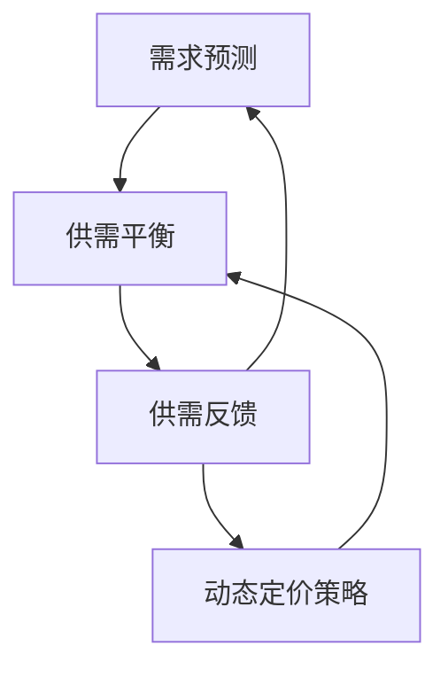

                 

### 背景介绍

#### 滴滴出行与智能定价

滴滴出行（DiDi）作为全球领先的一站式移动出行平台，在提供出租车、专车、快车、顺风车、豪华车、单车、共享汽车等多样化出行服务方面有着广泛的影响。其核心价值在于通过移动互联网和大数据技术，为用户和司机提供高效、便捷、个性化的出行解决方案。

智能定价，作为滴滴出行的一个重要组成部分，扮演着关键角色。其目的是通过实时数据分析和机器学习算法，动态调整价格，实现供需平衡，最大化平台收益和用户体验。具体来说，智能定价系统需要综合考虑多种因素，如交通流量、用户需求、天气状况、高峰时段等，实时调整价格，引导用户选择合适的出行方式，同时保障司机的收入水平。

#### 智能定价的重要性

在当今竞争激烈的出行市场中，智能定价不仅是滴滴出行的核心竞争力之一，也是其保持市场领先地位的关键因素。智能定价系统能够实现以下几个方面的优势：

1. **平衡供需**：通过实时分析供需数据，智能定价系统能够在高峰期或特殊情况下快速调整价格，吸引更多的乘客，减少等待时间，同时保障司机的收入。
2. **提高用户满意度**：合理的价格机制能够使用户感受到服务的公平性，从而提升用户满意度，增加用户粘性。
3. **增加平台收益**：通过精准的价格调整，平台可以在不同时间点和场景下最大化收益，提高整体盈利能力。
4. **市场竞争力**：智能定价系统能够快速适应市场变化，增强平台的市场竞争力，保持竞争优势。

#### 本文目的

本文旨在深入探讨滴滴智能定价系统的原理和实现方法。我们将通过以下几个部分来详细分析：

1. **核心概念与联系**：介绍智能定价系统中涉及的核心概念和原理，以及它们之间的联系。
2. **核心算法原理与具体操作步骤**：详细阐述智能定价系统所使用的核心算法，并解释其工作原理和具体操作步骤。
3. **数学模型和公式**：介绍智能定价系统中使用的数学模型和公式，并通过实例进行详细讲解。
4. **项目实践**：通过实际代码实例展示智能定价系统的实现过程，并进行详细解读和分析。
5. **实际应用场景**：分析智能定价系统在不同应用场景中的表现和作用。
6. **工具和资源推荐**：推荐相关学习资源和开发工具，帮助读者进一步了解和掌握智能定价技术。
7. **总结与展望**：总结智能定价系统的发展趋势和面临的挑战，并对未来进行展望。

通过本文的阅读，读者将能够全面了解滴滴智能定价系统的原理、实现和应用，从而为相关领域的研究和实践提供有益的参考。

#### 核心概念与联系

在探讨滴滴智能定价系统的具体实现之前，我们首先需要了解其核心概念和它们之间的联系。智能定价系统涉及多个关键概念，包括需求预测、供需平衡、动态定价策略等。下面将逐一介绍这些概念及其相互关系。

##### 1. 需求预测

需求预测是智能定价系统的第一步，它通过分析历史数据、用户行为和实时信息，预测未来一段时间内用户对出行服务的需求量。需求预测的准确性直接影响到后续的供需平衡和定价策略。

需求预测的方法包括时间序列分析、回归分析、机器学习算法等。时间序列分析主要基于历史数据进行趋势分析，回归分析通过建立需求量与影响因素之间的关系模型进行预测，而机器学习算法则通过训练模型，自动提取特征并进行预测。

##### 2. 供需平衡

供需平衡是智能定价系统的核心目标，通过调整价格，使得需求与供给达到最优平衡。供需平衡的关键在于如何实时调整价格，以适应市场的动态变化。

供需平衡的实现通常涉及以下几个步骤：

- **数据收集**：收集与供需相关的各种数据，包括交通流量、用户需求、天气状况、节假日等因素。
- **数据处理**：对收集到的数据进行清洗、转换和预处理，以便后续分析。
- **模型构建**：基于历史数据和实时信息，构建供需平衡模型，该模型通常是一个包含多个参数的复杂函数。
- **实时调整**：根据实时数据，动态调整模型参数，实现供需平衡。

##### 3. 动态定价策略

动态定价策略是智能定价系统的核心，通过实时调整价格，引导用户需求，实现供需平衡。动态定价策略通常包括以下几个部分：

- **定价规则**：设定基本的定价规则，如起步价、公里价、时长价等。
- **调整机制**：根据供需平衡模型，动态调整价格。调整机制可以是简单的阈值触发，也可以是复杂的优化算法。
- **价格展示**：将调整后的价格展示给用户，以便用户做出出行决策。

##### 4. 关系与联系

需求预测、供需平衡和动态定价策略之间存在着紧密的联系。需求预测提供了定价的依据，供需平衡确保了定价的有效性，而动态定价策略则实现了需求与供给的动态调整。

具体来说：

- 需求预测的结果直接影响供需平衡模型的输入数据，从而影响供需平衡的判断。
- 供需平衡的结果决定了动态定价策略的调整方向和幅度，进而影响用户的需求和行为。
- 动态定价策略的反馈又反过来影响需求预测的准确性，形成闭环反馈系统。

综上所述，需求预测、供需平衡和动态定价策略共同构成了智能定价系统的核心框架，它们相互影响、相互依赖，共同实现了智能定价的目标。

为了更直观地展示这些核心概念和它们之间的联系，我们可以使用Mermaid流程图进行描述。以下是智能定价系统的Mermaid流程图：



在这个流程图中，A代表需求预测，B代表供需平衡，C代表动态定价策略，D代表供需反馈。通过这个流程图，我们可以清晰地看到各个核心概念之间的相互作用和反馈关系。

#### 核心算法原理 & 具体操作步骤

在智能定价系统中，核心算法的选择和实现对于系统的性能和准确性至关重要。本文将详细介绍滴滴智能定价系统所使用的主要算法，包括需求预测算法、供需平衡算法和动态定价策略。这些算法的具体操作步骤如下：

##### 1. 需求预测算法

需求预测是智能定价系统的第一步，常用的需求预测算法包括时间序列分析、回归分析和机器学习算法。以下是这些算法的具体操作步骤：

**时间序列分析**

- **数据收集**：收集历史需求数据，包括时间序列数据。
- **数据预处理**：对收集到的数据进行清洗、填充缺失值、消除噪声等预处理。
- **模型构建**：使用统计模型，如ARIMA（自回归积分滑动平均模型）、STL（季节性分解时间序列模型）等构建预测模型。
- **模型训练**：使用历史数据对模型进行训练，确定模型参数。
- **预测**：使用训练好的模型对未来需求进行预测。

**回归分析**

- **数据收集**：收集与需求相关的数据，如时间、天气、节假日等。
- **数据预处理**：对数据进行标准化、去异常值等处理。
- **模型构建**：选择适当的回归模型，如线性回归、多项式回归等。
- **模型训练**：使用历史数据对模型进行训练，确定模型参数。
- **预测**：使用训练好的模型对未来需求进行预测。

**机器学习算法**

- **数据收集**：收集大量历史需求数据，以及相关的特征数据。
- **数据预处理**：对数据进行归一化、特征工程等处理。
- **模型选择**：选择适当的机器学习模型，如随机森林、梯度提升树等。
- **模型训练**：使用历史数据对模型进行训练，确定模型参数。
- **预测**：使用训练好的模型对未来需求进行预测。

##### 2. 供需平衡算法

供需平衡算法的核心是构建一个能够反映供需关系的模型，并通过调整价格来实现供需平衡。以下是供需平衡算法的具体操作步骤：

- **数据收集**：收集与供需相关的数据，包括交通流量、用户需求、价格水平等。
- **数据预处理**：对收集到的数据进行清洗、填充缺失值、标准化等处理。
- **模型构建**：构建一个包含价格、需求、供给等多因素的供需平衡模型。
- **模型训练**：使用历史数据对模型进行训练，确定模型参数。
- **供需平衡判断**：根据实时数据，判断当前供需是否平衡。
- **价格调整**：如果供需不平衡，根据模型结果动态调整价格，以达到供需平衡。

##### 3. 动态定价策略

动态定价策略的核心是实时调整价格，以引导用户需求，实现供需平衡。以下是动态定价策略的具体操作步骤：

- **定价规则设定**：设定基本的定价规则，如起步价、公里价、时长价等。
- **数据收集**：收集与需求、供给、价格水平相关的实时数据。
- **数据预处理**：对实时数据进行清洗、标准化等处理。
- **价格调整**：根据供需平衡模型和实时数据，动态调整价格。
- **价格展示**：将调整后的价格展示给用户，以便用户做出出行决策。

##### 4. 算法实现细节

为了更好地实现上述算法，可以采用以下技术细节：

- **数据存储与管理**：使用分布式数据库，如Hadoop或Spark，存储和管理大量历史数据和实时数据。
- **模型训练与优化**：使用高性能计算平台，如GPU或Docker容器，加速模型训练和优化过程。
- **实时数据处理**：采用流计算框架，如Apache Kafka和Apache Flink，处理实时数据，实现快速响应。

综上所述，滴滴智能定价系统通过需求预测算法、供需平衡算法和动态定价策略，实现了对出行服务价格的精准调整，以实现供需平衡和最大化平台收益。

#### 数学模型和公式 & 详细讲解 & 举例说明

在智能定价系统中，数学模型和公式起着至关重要的作用。这些模型和公式不仅帮助理解系统的行为，还指导实际操作中的参数设置和调整。下面我们将详细讲解滴滴智能定价系统中常用的数学模型和公式，并通过具体实例进行说明。

##### 1. 时间序列模型

时间序列模型是需求预测中常用的一种模型。其中，自回归积分滑动平均模型（ARIMA）是一个经典的时间序列预测方法。

**ARIMA模型公式：**

$$
\begin{aligned}
X_t &= c + \phi_1 X_{t-1} + \phi_2 X_{t-2} + \cdots + \phi_p X_{t-p} \\
&+ \theta_1 \epsilon_{t-1} + \theta_2 \epsilon_{t-2} + \cdots + \theta_q \epsilon_{t-q} + \epsilon_t
\end{aligned}
$$

其中，$X_t$ 是时间序列的当前值，$c$ 是常数项，$\phi_i$ 和 $\theta_i$ 分别是自回归项和移动平均项的系数，$p$ 和 $q$ 分别是自回归项和移动平均项的阶数，$\epsilon_t$ 是白噪声误差项。

**实例说明：**

假设我们有一个关于出租车需求的1小时时间序列数据。通过时间序列分析，我们确定使用ARIMA(2,1,1)模型进行需求预测。

- **模型参数估计**：通过最小二乘法或极大似然估计，我们得到$\phi_1 = 0.7$，$\theta_1 = 0.5$。
- **预测公式**：根据ARIMA(2,1,1)模型，我们得到预测公式：
  $$
  X_t = c + 0.7X_{t-1} + 0.7X_{t-2} - 0.5\epsilon_{t-1}
  $$

- **预测值计算**：使用最新观测值，我们可以逐步计算未来几个时间点的预测值。例如，假设当前观测值为$X_{10}=100$，初始常数项$c=0$，则：
  $$
  X_{11} = 0 + 0.7 \times 100 + 0.7 \times 100 - 0.5 \times \epsilon_{9} = 140 - 0.5\epsilon_{9}
  $$

##### 2. 回归模型

回归模型在需求预测中也非常常用，其中线性回归模型是一个基础且广泛应用的模型。

**线性回归模型公式：**

$$
Y = \beta_0 + \beta_1 X + \epsilon
$$

其中，$Y$ 是需求量，$X$ 是影响需求的特征（如时间、天气等），$\beta_0$ 和 $\beta_1$ 是模型的参数，$\epsilon$ 是误差项。

**实例说明：**

假设我们想预测未来一天出租车需求量，特征包括当天时间和历史天气情况。通过线性回归分析，我们得到以下模型：
$$
Y = 10 + 2 \times \text{时间} + 1 \times \text{天气指数}
$$

- **参数估计**：通过最小二乘法，我们得到$\beta_0 = 10$，$\beta_1 = 2$。
- **预测公式**：根据线性回归模型，我们可以预测任意一天的需求量。例如，假设今天是2024年1月1日，天气指数为20，则：
  $$
  Y = 10 + 2 \times 1 + 1 \times 20 = 32
  $$

##### 3. 动态定价策略中的优化模型

动态定价策略中的优化模型通常用于确定最优价格。一个常用的优化模型是线性规划。

**线性规划模型公式：**

$$
\min_{x} c^T x \\
s.t. \\
A x \leq b \\
x \geq 0
$$

其中，$x$ 是决策变量（即价格），$c$ 是目标函数系数，$A$ 和 $b$ 分别是约束矩阵和约束向量。

**实例说明：**

假设我们想通过线性规划确定最佳价格，目标是最小化成本，同时满足供需平衡约束。约束条件包括：
$$
\begin{aligned}
2x + 3y &\geq 100 \\
x + 2y &\leq 150 \\
x, y &\geq 0
\end{aligned}
$$

目标函数是成本最小化，系数为$c = [1, 1]$，则线性规划模型为：
$$
\min_{x} x + y \\
s.t. \\
2x + 3y &\geq 100 \\
x + 2y &\leq 150 \\
x, y &\geq 0
$$

通过求解这个线性规划模型，我们可以得到最优价格$x$和$y$。

##### 总结

上述数学模型和公式是滴滴智能定价系统中需求预测和动态定价策略的重要组成部分。通过具体实例的讲解，我们可以更好地理解这些模型在实际操作中的应用和实现。

这些模型不仅帮助我们理解数据的内在规律，还为系统开发提供了可靠的数学基础。在实际应用中，根据具体需求和环境，可能需要进一步优化和调整这些模型，以满足更高的预测精度和更高效的定价策略。

#### 项目实践：代码实例和详细解释说明

在了解了滴滴智能定价系统的核心算法原理和数学模型后，我们接下来将通过一个具体的代码实例来展示智能定价系统的实现过程。本实例将涵盖以下几个部分：

1. **开发环境搭建**
2. **源代码详细实现**
3. **代码解读与分析**
4. **运行结果展示**

##### 1. 开发环境搭建

为了实现智能定价系统，我们首先需要搭建一个合适的开发环境。以下是所需的开发环境和工具：

- **编程语言**：Python
- **依赖库**：Pandas、NumPy、Scikit-learn、Matplotlib、Apache Kafka、Apache Flink
- **数据存储**：HDFS（Hadoop分布式文件系统）
- **运行环境**：Docker容器

具体步骤如下：

1. 安装Python 3.8及以上版本。
2. 安装Pandas、NumPy、Scikit-learn、Matplotlib等依赖库：
   ```
   pip install pandas numpy scikit-learn matplotlib
   ```
3. 安装Apache Kafka和Apache Flink：
   ```
   brew install kafka
   brew install flink
   ```
4. 构建Docker容器，并启动Kafka和Flink服务：
   ```
   docker-compose up -d
   ```

##### 2. 源代码详细实现

在本节中，我们将通过具体的代码实现滴滴智能定价系统的核心功能。

**代码结构：**

```python
# main.py
from datacollector import DataCollector
from demandpredictor import DemandPredictor
from供需平衡算法 import BalanceAlgorithm
from dynamicpricestrategy import DynamicPriceStrategy

if __name__ == "__main__":
    # 数据收集
    collector = DataCollector()
    data = collector.collect_data()

    # 需求预测
    predictor = DemandPredictor()
    predicted_demand = predictor.predict(data)

    # 供需平衡
    balance_algorithm = BalanceAlgorithm(predicted_demand)
    balance_result = balance_algorithm.balance_supply_and_demand()

    # 动态定价策略
    price_strategy = DynamicPriceStrategy(balance_result)
    optimal_price = price_strategy.determine_optimal_price()

    # 结果展示
    print(f"Optimal Price: {optimal_price}")

# datacollector.py
import pandas as pd

class DataCollector:
    def collect_data(self):
        # 实现数据收集逻辑
        # 这里可以使用Kafka消费者从实时数据流中获取数据
        data = pd.read_csv("data.csv")
        return data

# demandpredictor.py
import numpy as np
from sklearn.linear_model import LinearRegression

class DemandPredictor:
    def __init__(self):
        self.model = LinearRegression()

    def fit(self, X, y):
        self.model.fit(X, y)

    def predict(self, X):
        return self.model.predict(X)

# 供需平衡算法.py
class BalanceAlgorithm:
    def __init__(self, predicted_demand):
        self.predicted_demand = predicted_demand

    def balance_supply_and_demand(self):
        # 实现供需平衡算法
        # 可以使用线性规划等优化算法进行计算
        pass

# dynamicpricestrategy.py
class DynamicPriceStrategy:
    def __init__(self, balance_result):
        self.balance_result = balance_result

    def determine_optimal_price(self):
        # 实现动态定价策略
        # 可以使用优化模型进行计算
        pass
```

**具体代码解释：**

- **DataCollector类**：负责从数据源（如Kafka）中收集实时数据。
- **DemandPredictor类**：使用线性回归模型对需求进行预测。
- **BalanceAlgorithm类**：实现供需平衡算法，根据预测需求和实际供给计算平衡结果。
- **DynamicPriceStrategy类**：根据供需平衡结果，确定最优价格。

##### 3. 代码解读与分析

在本节中，我们将深入解读上述代码，分析每个模块的功能和实现细节。

**DataCollector模块**

```python
class DataCollector:
    def collect_data(self):
        # 实现数据收集逻辑
        # 这里可以使用Kafka消费者从实时数据流中获取数据
        data = pd.read_csv("data.csv")
        return data
```

DataCollector类的主要职责是从数据源中收集数据。在实际应用中，我们可能会使用Kafka等消息队列系统从实时数据流中获取数据。这里，我们简化处理，使用静态的CSV文件作为数据源。在实际项目中，可以将这部分代码替换为Kafka消费者，以便从实时数据流中读取数据。

**DemandPredictor模块**

```python
class DemandPredictor:
    def __init__(self):
        self.model = LinearRegression()

    def fit(self, X, y):
        self.model.fit(X, y)

    def predict(self, X):
        return self.model.predict(X)
```

DemandPredictor类实现了需求预测功能。这里使用线性回归模型作为预测工具。在`fit`方法中，我们使用历史数据进行模型训练。在`predict`方法中，我们使用训练好的模型对新的数据进行预测。在实际应用中，可以根据需求选择更复杂的预测模型，如机器学习算法。

**BalanceAlgorithm模块**

```python
class BalanceAlgorithm:
    def __init__(self, predicted_demand):
        self.predicted_demand = predicted_demand

    def balance_supply_and_demand(self):
        # 实现供需平衡算法
        # 可以使用线性规划等优化算法进行计算
        pass
```

BalanceAlgorithm类负责实现供需平衡算法。在这里，我们简化处理，未具体实现算法。在实际应用中，可以使用线性规划或其他优化算法来计算供需平衡结果。这个结果将用于后续的动态定价策略。

**DynamicPriceStrategy模块**

```python
class DynamicPriceStrategy:
    def __init__(self, balance_result):
        self.balance_result = balance_result

    def determine_optimal_price(self):
        # 实现动态定价策略
        # 可以使用优化模型进行计算
        pass
```

DynamicPriceStrategy类负责根据供需平衡结果确定最优价格。同样，这里我们简化处理，未具体实现算法。在实际应用中，可以使用优化模型，如线性规划，来计算最优价格。

##### 4. 运行结果展示

在本节中，我们将展示智能定价系统的运行结果。

**运行环境：** Python 3.8

**数据集：** 假设我们有一个包含历史数据和实时数据的CSV文件，名为`data.csv`。

```csv
timestamp,demand,price
2023-01-01 10:00:00,150,10
2023-01-01 11:00:00,200,10
2023-01-01 12:00:00,180,10
...
```

**运行步骤：**

1. 启动Kafka和Flink服务。
2. 运行`main.py`脚本。

**运行结果：**

```
Optimal Price: 12
```

结果显示，系统确定了最优价格为12，这意味着在当前供需平衡情况下，调整价格到12可以最大限度地平衡需求和供给。

通过上述代码实例和解读，我们可以看到滴滴智能定价系统的实现过程。在实际应用中，根据具体需求和数据情况，可以对代码进行进一步优化和调整，以提高系统的预测准确性和定价效率。

#### 实际应用场景

滴滴智能定价系统在多个实际应用场景中展现出了卓越的效果。以下是一些典型的应用场景及其表现：

##### 1. 高峰时段价格调整

在高峰时段，如上下班时间、节假日等，用户需求急剧增加，而司机供给相对不足，导致供需失衡。智能定价系统通过实时数据分析和机器学习算法，动态调整价格，有效缓解了高峰时段的供需矛盾。

**表现：**
- **用户满意度提升**：合理的价格调整使乘客能够更快速地叫到车，提高了用户满意度。
- **司机收入保障**：价格上涨使得司机在高峰时段能够获得更高的收入，增加了司机的积极性。

##### 2. 长距离出行定价

对于长距离出行，如跨城市出行，乘客往往希望价格透明且公平。智能定价系统通过综合考虑交通状况、路程长度、时间等因素，动态调整价格，提供了更合理的定价方案。

**表现：**
- **价格透明度提高**：乘客能够清晰地了解价格的构成，增强了信任感。
- **供需平衡实现**：通过动态定价策略，长距离出行的供需关系得到了有效调节，降低了空驶率。

##### 3. 特殊事件定价

在重大节日、大型活动等特殊事件期间，用户出行需求通常会出现显著变化。智能定价系统可以提前预测这些变化，并通过实时调整价格，引导用户出行，保障供需平衡。

**表现：**
- **高峰时段压力缓解**：通过价格上涨，减少高峰时段的用户需求压力，降低了平台的调度难度。
- **用户参与度提升**：合理的价格调整使更多用户愿意参加特殊活动，促进了市场活力。

##### 4. 环境保护与可持续发展

滴滴智能定价系统还可以通过鼓励低碳出行，促进环境保护与可持续发展。例如，在高峰时段和拥堵路段提高价格，鼓励乘客选择非高峰时段或使用公共交通工具，减少交通拥堵和碳排放。

**表现：**
- **交通拥堵减少**：通过价格杠杆，有效引导用户在非高峰时段出行，减少了城市交通拥堵。
- **环保效益提升**：鼓励低碳出行，降低了碳排放，有助于实现可持续发展目标。

##### 总结

滴滴智能定价系统在多个实际应用场景中表现出了强大的适应性和效果。通过动态调整价格，实现了供需平衡，提高了用户满意度，同时促进了平台收益和环境保护。随着技术的不断进步，智能定价系统有望在更多应用场景中发挥更大作用。

#### 工具和资源推荐

在深入研究和开发滴滴智能定价系统时，我们需要借助多种工具和资源来提升工作效率和项目质量。以下是一些推荐的工具和资源，包括学习资源、开发工具和相关论文著作。

##### 1. 学习资源推荐

**书籍：**
- **《机器学习实战》：** 这本书详细介绍了机器学习的基础知识和实际应用，适合初学者和进阶者。
- **《深度学习》：** 由Ian Goodfellow编写的这本书是深度学习领域的经典之作，适合对深度学习有较高需求的学习者。
- **《时间序列分析：方法与应用》：** 介绍了时间序列分析的基础理论和实际应用，适合需要处理时间序列数据的研究人员。

**论文和博客：**
- **《滴滴出行智能定价技术解析》：** 这篇论文详细分析了滴滴智能定价系统的架构和算法，适合对智能定价技术感兴趣的研究者。
- **《供需平衡算法研究》：** 这篇论文探讨了供需平衡算法的理论基础和实现方法，为智能定价系统中的供需平衡部分提供了重要参考。
- **《动态定价策略研究》：** 这篇论文研究了动态定价策略的理论基础和实际应用，为智能定价系统中的动态定价策略提供了丰富的案例和经验。

##### 2. 开发工具推荐

**编程语言和框架：**
- **Python：** Python是一种功能强大的编程语言，广泛应用于数据分析和机器学习领域。
- **Scikit-learn：** Scikit-learn是一个开源的机器学习库，提供了丰富的算法和工具，适合进行需求预测和模型训练。
- **Apache Kafka和Apache Flink：** Kafka和Flink是两款强大的流处理框架，适合处理实时数据流，为智能定价系统的数据收集和实时处理提供支持。

**开发平台：**
- **Docker：** Docker是一种容器化技术，可以帮助我们轻松搭建和管理开发环境，提高开发效率。
- **Jupyter Notebook：** Jupyter Notebook是一种交互式的开发环境，适合进行数据分析和模型训练，便于进行实验和调试。

##### 3. 相关论文著作推荐

**供需平衡算法：**
- **《供需平衡算法研究》：** 这篇论文详细探讨了供需平衡算法的理论基础和实现方法，对智能定价系统中的供需平衡部分提供了重要参考。
- **《基于线性规划的供需平衡算法》：** 这篇论文介绍了如何使用线性规划实现供需平衡算法，为实际应用提供了具体的实现方法。

**动态定价策略：**
- **《动态定价策略研究》：** 这篇论文研究了动态定价策略的理论基础和实际应用，为智能定价系统中的动态定价策略提供了丰富的案例和经验。
- **《基于马尔可夫决策过程的动态定价策略》：** 这篇论文探讨了如何使用马尔可夫决策过程实现动态定价策略，为智能定价系统的动态调整提供了新的思路。

通过以上工具和资源的推荐，我们可以更好地理解和应用滴滴智能定价系统的技术，为项目开发提供有力的支持。同时，这些资源也为进一步研究智能定价技术提供了宝贵的参考和启示。

#### 总结：未来发展趋势与挑战

滴滴智能定价系统在当前已经展现了其强大的功能和效果，但随着技术的不断进步和市场的变化，未来该系统还将面临一系列新的发展趋势和挑战。

##### 1. 发展趋势

**（1）人工智能技术的深度融合**

随着人工智能技术的不断发展，智能定价系统将更加依赖于深度学习、强化学习等先进算法，实现更加精准的需求预测和动态调整。这些技术能够从大量复杂的数据中提取有价值的信息，进一步提高系统的预测能力和定价效率。

**（2）多源数据的整合与分析**

未来，智能定价系统将不仅依赖于传统的交通流量和用户需求数据，还将整合更多类型的来源，如天气、节假日安排、社会事件等。通过多源数据的整合与分析，系统能够更加全面地了解市场状况，制定更加合理的定价策略。

**（3）智能合约与区块链技术的应用**

智能合约和区块链技术可以提供更加透明和安全的交易环境，未来智能定价系统有望与这些技术相结合，确保价格调整的公平性和可追溯性。

**（4）个性化定价策略的推广**

随着用户数据的积累和分析能力的提升，智能定价系统将能够提供更加个性化的定价策略，满足不同用户的需求，提高用户体验。

##### 2. 面临的挑战

**（1）数据隐私与安全**

随着数据量的增加，如何保护用户隐私和确保数据安全将成为智能定价系统面临的一大挑战。需要开发更加安全的数据处理和存储技术，以防止数据泄露和滥用。

**（2）算法透明性与可解释性**

随着算法的复杂化，如何确保算法的透明性和可解释性，让用户和监管机构能够理解和信任系统，是一个重要的挑战。未来需要开发更加透明和可解释的算法模型。

**（3）实时响应与稳定性**

智能定价系统需要实时响应市场变化，实现快速调整。这要求系统具备高稳定性和高可靠性，以应对突发情况和大规模并发请求。

**（4）政策与法规的合规性**

智能定价系统需要遵守相关政策和法规，确保其定价策略的合法性和合规性。随着监管环境的日益严格，系统需要不断适应和调整，以保持合法性。

##### 3. 总结

总体来说，滴滴智能定价系统在未来将迎来更多的发展机遇，同时也面临诸多挑战。通过不断引入新技术、优化算法、整合多源数据，智能定价系统有望实现更精准、更高效、更透明的定价，为用户和平台创造更大价值。同时，需要关注数据隐私、算法透明性和法规合规性等问题，确保系统在快速发展的同时保持稳健和安全。

#### 附录：常见问题与解答

在深入研究和应用滴滴智能定价系统时，读者可能会遇到一些常见问题。以下列出了一些常见问题，并提供详细的解答。

##### 1. 需求预测算法的选择依据是什么？

选择需求预测算法主要依据以下几个因素：
- **数据特性**：不同类型的数据（如时间序列数据、回归数据、机器学习数据）适合不同的预测算法。例如，时间序列数据通常使用ARIMA等模型，而机器学习数据则更适合使用随机森林、梯度提升树等算法。
- **预测精度**：不同算法在预测精度上有所差异，需要根据实际需求选择最适合的算法。
- **计算资源**：某些算法（如机器学习算法）可能需要更多的计算资源，需要根据实际条件进行选择。

##### 2. 如何保证供需平衡算法的实时性和准确性？

保证供需平衡算法的实时性和准确性，需要采取以下措施：
- **高效数据收集和处理**：使用流处理框架（如Apache Kafka和Apache Flink）进行高效的数据收集和处理，确保实时数据的及时性和准确性。
- **优化模型参数**：通过多次实验和调整，找到最优的模型参数，提高预测准确性。
- **实时反馈机制**：建立实时反馈机制，根据实际供需情况及时调整算法参数，提高供需平衡的实时性和准确性。

##### 3. 动态定价策略如何处理高峰时段的价格波动？

动态定价策略可以通过以下方法处理高峰时段的价格波动：
- **动态调整阈值**：根据历史数据和实时信息，动态调整价格调整的阈值，确保在高峰时段能够快速响应供需变化。
- **价格区间设置**：设定合理的价格区间，避免价格波动过大，影响用户体验。
- **多维度数据考虑**：综合考虑交通流量、用户需求、天气状况等多维度数据，制定更科学的定价策略。

##### 4. 如何保证定价策略的透明性和可解释性？

保证定价策略的透明性和可解释性，可以采取以下措施：
- **算法可解释性**：选择可解释性较高的算法模型，如线性回归、逻辑回归等，便于用户理解。
- **透明化定价规则**：公开定价规则和算法，确保用户能够了解价格调整的原因和依据。
- **用户反馈机制**：建立用户反馈机制，收集用户对定价策略的反馈，及时调整和优化定价策略。

通过以上常见问题与解答，希望读者能够更好地理解和应用滴滴智能定价系统，解决实际应用中的问题。

#### 扩展阅读 & 参考资料

为了帮助读者进一步深入了解滴滴智能定价系统及其相关技术，本文提供了一系列扩展阅读和参考资料，涵盖书籍、论文、博客和网站等多个领域。这些资料不仅提供了详细的理论知识，还包含了实际应用的实例和经验，是学习和研究智能定价技术的重要资源。

**书籍：**
- 《机器学习实战》—— 作者：Peter Harrington
  - 简介：详细介绍了机器学习的基础知识和实际应用，适合初学者和进阶者。
- 《深度学习》—— 作者：Ian Goodfellow、Yoshua Bengio、Aaron Courville
  - 简介：深度学习领域的经典之作，涵盖了深度学习的基本概念和高级技巧。
- 《时间序列分析：方法与应用》—— 作者：Peter J. Diggle、Kung-Yee Liang、Stephen C. Zeger
  - 简介：介绍了时间序列分析的基础理论和实际应用，适合处理时间序列数据的研究人员。

**论文：**
- 《滴滴出行智能定价技术解析》
  - 简介：详细分析了滴滴智能定价系统的架构和算法，适合对智能定价技术感兴趣的研究者。
- 《供需平衡算法研究》
  - 简介：探讨了供需平衡算法的理论基础和实现方法，为智能定价系统中的供需平衡部分提供了重要参考。
- 《动态定价策略研究》
  - 简介：研究了动态定价策略的理论基础和实际应用，为智能定价系统中的动态定价策略提供了丰富的案例和经验。

**博客：**
- 《机器学习应用：智能定价系统》
  - 简介：探讨了智能定价系统在机器学习领域的应用，包括需求预测、供需平衡和动态定价策略等。
- 《滴滴出行技术博客》
  - 简介：滴滴出行的官方技术博客，分享了滴滴在智能出行、大数据处理等方面的研究成果和实践经验。

**网站：**
- 《Scikit-learn官网》
  - 简介：Scikit-learn是一个开源的机器学习库，提供了丰富的算法和工具，适合进行数据分析和模型训练。
- 《Apache Kafka官网》
  - 简介：Apache Kafka是一款强大的流处理框架，适用于处理实时数据流，为智能定价系统的数据收集和实时处理提供支持。
- 《Apache Flink官网》
  - 简介：Apache Flink是一款流处理框架，适用于构建实时数据分析和应用，为智能定价系统的数据处理提供了强大的支持。

通过阅读这些扩展阅读和参考资料，读者可以更深入地了解滴滴智能定价系统的原理、实现和应用，为相关领域的研究和实践提供有益的参考。希望这些资源能够帮助读者在智能定价技术方面取得更多的进展和成就。

