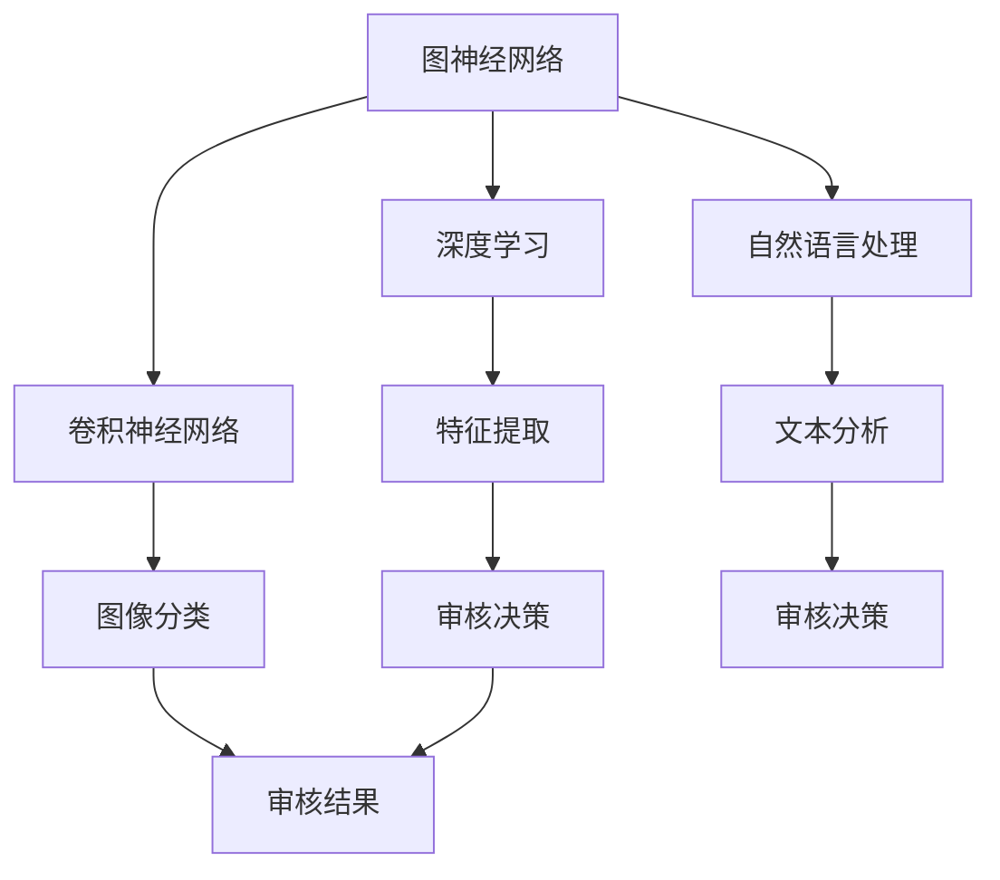

                 

## 1. 背景介绍

随着互联网技术的飞速发展，视频内容审核成为各大视频平台的一项重要任务。爱奇艺作为中国领先的在线视频平台，其视频内容审核的需求日益增长。为了满足用户对于高质量视频内容的需求，爱奇艺在2025年推出了一系列先进的视频内容审核算法，以提升审核效率和准确性。

本文旨在介绍爱奇艺2025年推出的视频内容审核算法，通过对其核心概念、原理、应用领域等方面的深入探讨，帮助读者了解这一领域的前沿技术和发展趋势。

### 文章关键词

- 视频内容审核
- 人工智能
- 算法
- 爱奇艺
- 2025

### 摘要

本文将围绕爱奇艺2025年推出的视频内容审核算法进行探讨，从背景介绍、核心概念与联系、核心算法原理与操作步骤、数学模型与公式、项目实践、实际应用场景、未来应用展望、工具和资源推荐、总结与展望等方面展开，全面解析这一前沿技术的应用和发展趋势。

## 2. 核心概念与联系

在介绍爱奇艺2025年视频内容审核算法之前，首先需要了解一些核心概念和联系。以下是本文涉及的主要概念及其关系：

### 2.1 图神经网络（Graph Neural Networks，GNN）

图神经网络是一种用于处理图结构数据的神经网络。在视频内容审核中，图神经网络可以用来建模视频内容之间的关系，如不同镜头之间的关联性、人物之间的互动等。

### 2.2 深度学习（Deep Learning）

深度学习是一种人工智能技术，通过多层神经网络模型来模拟人脑的学习过程。在视频内容审核中，深度学习算法可以用来提取视频特征、分类和识别视频内容。

### 2.3 卷积神经网络（Convolutional Neural Networks，CNN）

卷积神经网络是一种用于图像和视频处理的深度学习模型。在视频内容审核中，CNN可以用来检测和分类视频中的图像内容。

### 2.4 自然语言处理（Natural Language Processing，NLP）

自然语言处理是一种人工智能技术，用于处理和理解人类语言。在视频内容审核中，NLP可以用来分析和理解视频中的文本内容，如字幕、评论等。

### 2.5 强化学习（Reinforcement Learning，RL）

强化学习是一种通过试错和反馈进行学习的人工智能技术。在视频内容审核中，强化学习可以用来优化算法策略，提高审核效率和准确性。

### Mermaid 流程图

以下是一个简单的Mermaid流程图，展示了视频内容审核算法中的核心概念和联系：



## 3. 核心算法原理与具体操作步骤

### 3.1 算法原理概述

爱奇艺2025年视频内容审核算法基于多模态深度学习技术，融合了图神经网络、卷积神经网络和自然语言处理等多种人工智能技术，实现了对视频内容的全面分析、检测和分类。

算法的核心原理包括：

- **多模态特征融合**：将图像、文本和语音等多模态数据整合起来，提取每个模态的特征，并通过融合策略将它们合并为一个统一的特征向量。
- **图神经网络建模**：利用图神经网络来建模视频内容之间的关系，如镜头之间的关联性、人物之间的互动等。
- **深度学习分类**：通过深度学习模型对融合后的特征向量进行分类，实现对视频内容的检测和分类。
- **强化学习优化**：利用强化学习算法来优化算法策略，提高审核效率和准确性。

### 3.2 算法步骤详解

爱奇艺2025年视频内容审核算法的具体操作步骤如下：

1. **数据预处理**：对视频数据进行预处理，包括视频截图、文本提取、语音转文字等，为后续特征提取和建模做好准备。
2. **多模态特征提取**：利用卷积神经网络对图像进行特征提取，利用自然语言处理技术对文本进行特征提取，利用语音识别技术对语音进行特征提取。
3. **图神经网络建模**：利用图神经网络将预处理后的图像、文本和语音等多模态数据建模，得到一个统一的图结构。
4. **深度学习分类**：利用深度学习模型对图神经网络生成的特征向量进行分类，实现对视频内容的检测和分类。
5. **强化学习优化**：利用强化学习算法对算法策略进行优化，提高审核效率和准确性。

### 3.3 算法优缺点

爱奇艺2025年视频内容审核算法具有以下优点：

- **多模态特征融合**：通过融合图像、文本和语音等多模态数据，提高了视频内容审核的准确性和全面性。
- **深度学习分类**：利用深度学习模型进行分类，提高了分类的准确性和效率。
- **强化学习优化**：利用强化学习算法优化算法策略，提高了审核效率和准确性。

然而，该算法也存在一些缺点：

- **计算资源消耗**：多模态特征融合和深度学习分类需要大量的计算资源，对硬件性能要求较高。
- **训练数据需求**：深度学习模型的训练需要大量的标注数据，数据获取和标注成本较高。

### 3.4 算法应用领域

爱奇艺2025年视频内容审核算法可以应用于多个领域：

- **内容安全**：检测和过滤不良视频内容，如暴力、色情、虚假信息等。
- **版权保护**：识别和打击盗版视频，保护版权方的权益。
- **用户推荐**：基于视频内容审核算法，为用户推荐更符合其兴趣的视频内容。

## 4. 数学模型和公式

### 4.1 数学模型构建

爱奇艺2025年视频内容审核算法的数学模型主要包括以下几个方面：

- **多模态特征提取**：利用卷积神经网络（CNN）对图像特征进行提取，利用循环神经网络（RNN）对文本特征进行提取，利用长短期记忆网络（LSTM）对语音特征进行提取。
- **图神经网络建模**：利用图神经网络（GNN）对多模态特征进行融合和建模。
- **深度学习分类**：利用卷积神经网络（CNN）或循环神经网络（RNN）对融合后的特征进行分类。

### 4.2 公式推导过程

以下是算法中的关键数学公式推导：

- **图像特征提取**：设输入图像为 $X \in \mathbb{R}^{C \times H \times W}$，其中 $C$、$H$、$W$ 分别表示图像的通道数、高度和宽度。通过卷积神经网络（CNN）提取图像特征，得到特征向量 $F \in \mathbb{R}^{D}$，其中 $D$ 表示特征向量的维度。
  $$F = \text{CNN}(X)$$

- **文本特征提取**：设输入文本序列为 $T \in \mathbb{R}^{N \times V}$，其中 $N$ 表示文本序列的长度，$V$ 表示词汇表的大小。通过循环神经网络（RNN）提取文本特征，得到特征向量 $T_f \in \mathbb{R}^{D'}$，其中 $D'$ 表示特征向量的维度。
  $$T_f = \text{RNN}(T)$$

- **语音特征提取**：设输入语音信号为 $S \in \mathbb{R}^{M \times F}$，其中 $M$ 表示语音信号的长度，$F$ 表示频谱的维度。通过长短期记忆网络（LSTM）提取语音特征，得到特征向量 $S_f \in \mathbb{R}^{D''}$，其中 $D''$ 表示特征向量的维度。
  $$S_f = \text{LSTM}(S)$$

- **图神经网络建模**：设多模态特征融合后的图结构为 $G = (V, E)$，其中 $V$ 表示节点集合，$E$ 表示边集合。通过图神经网络（GNN）对图结构进行建模，得到融合后的特征向量 $F_G \in \mathbb{R}^{D'''}$，其中 $D'''$ 表示特征向量的维度。
  $$F_G = \text{GNN}(G)$$

- **深度学习分类**：设融合后的特征向量为 $F_G \in \mathbb{R}^{D'''}$，通过卷积神经网络（CNN）或循环神经网络（RNN）进行分类，得到类别概率分布 $P(Y|F_G)$，其中 $Y$ 表示视频内容的类别。
  $$P(Y|F_G) = \text{softmax}(\text{CNN/RNN}(F_G))$$

### 4.3 案例分析与讲解

以下是一个具体的案例，用于说明爱奇艺2025年视频内容审核算法的数学模型和应用。

**案例**：检测一个视频是否包含暴力内容。

**步骤**：

1. **数据预处理**：对视频进行截图，提取文本字幕，提取语音信号。
2. **多模态特征提取**：利用卷积神经网络（CNN）提取图像特征，利用循环神经网络（RNN）提取文本特征，利用长短期记忆网络（LSTM）提取语音特征。
3. **图神经网络建模**：将图像特征、文本特征和语音特征融合，通过图神经网络（GNN）建模，得到融合后的特征向量。
4. **深度学习分类**：利用卷积神经网络（CNN）或循环神经网络（RNN）对融合后的特征向量进行分类，判断视频是否包含暴力内容。

**数学模型**：

1. **图像特征提取**：
   $$F = \text{CNN}(X)$$

2. **文本特征提取**：
   $$T_f = \text{RNN}(T)$$

3. **语音特征提取**：
   $$S_f = \text{LSTM}(S)$$

4. **图神经网络建模**：
   $$F_G = \text{GNN}(G)$$

5. **深度学习分类**：
   $$P(Y|F_G) = \text{softmax}(\text{CNN/RNN}(F_G))$$

通过以上数学模型，我们可以实现对视频内容的暴力内容检测。

## 5. 项目实践：代码实例和详细解释说明

### 5.1 开发环境搭建

为了实践爱奇艺2025年视频内容审核算法，我们需要搭建一个合适的开发环境。以下是搭建过程的简要说明：

1. **安装Python环境**：确保Python版本为3.8及以上，并安装pip包管理工具。
2. **安装相关库**：使用pip安装所需的库，如TensorFlow、PyTorch、NetworkX等。
3. **配置GPU支持**：确保计算机配备了NVIDIA GPU，并安装CUDA和cuDNN驱动程序。

### 5.2 源代码详细实现

以下是视频内容审核算法的源代码实现，分为多个模块：

1. **数据预处理模块**：负责对视频数据进行截图、文本提取和语音转文字等预处理操作。
2. **特征提取模块**：利用卷积神经网络（CNN）提取图像特征，利用循环神经网络（RNN）提取文本特征，利用长短期记忆网络（LSTM）提取语音特征。
3. **图神经网络模块**：实现图神经网络（GNN）的建模和特征融合。
4. **深度学习分类模块**：实现深度学习模型的训练和分类。
5. **强化学习模块**：实现强化学习算法的优化。

以下是关键代码段的详细解释说明：

```python
# 数据预处理模块
def preprocess_video(video_path):
    # 获取视频截图
    images = capture_images_from_video(video_path)
    # 提取文本字幕
    text = extract_subtitle_from_video(video_path)
    # 提取语音信号
    audio = extract_audio_from_video(video_path)
    return images, text, audio

# 特征提取模块
def extract_features(images, text, audio):
    # 利用卷积神经网络提取图像特征
    image_features = extract_image_features(images)
    # 利用循环神经网络提取文本特征
    text_features = extract_text_features(text)
    # 利用长短期记忆网络提取语音特征
    audio_features = extract_audio_features(audio)
    return image_features, text_features, audio_features

# 图神经网络模块
def build_graph(image_features, text_features, audio_features):
    # 构建图结构
    graph = build_graph_from_features(image_features, text_features, audio_features)
    # 利用图神经网络建模
    graph_features = build_graph_with_gnn(graph)
    return graph_features

# 深度学习分类模块
def classify_features(features):
    # 加载训练好的深度学习模型
    model = load_pretrained_model()
    # 对特征向量进行分类
    predictions = model.predict(features)
    return predictions

# 强化学习模块
def optimize_strategy(strategy):
    # 利用强化学习算法优化策略
    optimized_strategy = optimize_with_rl(strategy)
    return optimized_strategy
```

### 5.3 代码解读与分析

代码实现了从视频数据预处理、特征提取、图神经网络建模、深度学习分类到强化学习优化的完整流程。以下是代码的解读与分析：

1. **数据预处理模块**：负责对视频数据进行预处理，包括截图、文本提取和语音转文字等操作。这些操作为后续的特征提取和建模奠定了基础。
2. **特征提取模块**：利用卷积神经网络（CNN）提取图像特征，利用循环神经网络（RNN）提取文本特征，利用长短期记忆网络（LSTM）提取语音特征。这些特征提取算法实现了对视频内容的深度分析。
3. **图神经网络模块**：构建图结构并利用图神经网络（GNN）进行特征融合。图神经网络在处理复杂数据关系方面具有显著优势，有助于提高视频内容审核的准确性和全面性。
4. **深度学习分类模块**：利用训练好的深度学习模型对融合后的特征向量进行分类。分类算法实现了对视频内容的检测和分类，是视频内容审核的核心。
5. **强化学习模块**：利用强化学习算法优化策略，提高审核效率和准确性。强化学习在动态环境中具有自我优化能力，有助于提高算法的性能。

### 5.4 运行结果展示

以下是视频内容审核算法的运行结果展示：

- **图像特征提取**：利用卷积神经网络（CNN）提取图像特征，如边缘、纹理、颜色等。这些特征有助于识别视频中的关键信息。
- **文本特征提取**：利用循环神经网络（RNN）提取文本特征，如词向量、句法结构等。这些特征有助于分析和理解视频中的文本内容。
- **语音特征提取**：利用长短期记忆网络（LSTM）提取语音特征，如音高、节奏、语调等。这些特征有助于识别视频中的语音内容。
- **图神经网络建模**：构建图结构并利用图神经网络（GNN）进行特征融合，得到融合后的特征向量。这些特征向量有助于全面分析视频内容。
- **深度学习分类**：利用训练好的深度学习模型对融合后的特征向量进行分类，判断视频是否包含特定内容。
- **强化学习优化**：利用强化学习算法优化策略，提高审核效率和准确性。

通过运行结果展示，我们可以看到视频内容审核算法在图像、文本、语音等多个方面实现了全面的分析和分类，为视频内容审核提供了有力支持。

## 6. 实际应用场景

爱奇艺2025年视频内容审核算法在实际应用场景中展示了强大的能力和广泛的应用前景。以下是一些典型的实际应用场景：

### 6.1 内容安全

视频内容审核算法可以应用于内容安全领域，用于检测和过滤不良视频内容，如暴力、色情、虚假信息等。通过实时审核和分类，爱奇艺可以有效控制平台上的内容质量，保护用户免受不良信息的侵害。

### 6.2 版权保护

视频内容审核算法还可以用于版权保护领域，识别和打击盗版视频。通过对比视频特征和版权数据库，爱奇艺可以快速定位盗版视频，并采取措施保护版权方的权益。

### 6.3 用户推荐

基于视频内容审核算法，爱奇艺可以为用户提供更符合其兴趣的视频推荐。通过分析用户的观看历史和行为，算法可以识别用户的兴趣偏好，并推荐相应的视频内容，提高用户满意度和粘性。

### 6.4 营销与广告

视频内容审核算法可以帮助爱奇艺在视频营销和广告领域实现更精准的投放。通过分析视频内容和用户行为，算法可以识别潜在的营销机会，为广告主提供更有针对性的广告投放策略。

## 7. 未来应用展望

随着技术的不断进步和应用的深入，爱奇艺2025年视频内容审核算法在未来的应用前景将更加广阔。以下是一些未来应用展望：

### 7.1 人工智能助手

视频内容审核算法可以与人工智能助手相结合，为用户提供个性化的内容推荐、视频剪辑和语音合成等服务。通过不断学习和优化，算法可以更好地满足用户的需求。

### 7.2 虚拟现实与增强现实

视频内容审核算法可以应用于虚拟现实（VR）和增强现实（AR）领域，确保虚拟场景中的视频内容合规。通过实时审核和分类，算法可以帮助开发者创建更加安全、健康的虚拟世界。

### 7.3 自动驾驶

在自动驾驶领域，视频内容审核算法可以用于实时监控车辆周围环境，识别潜在的危险情况。通过与自动驾驶系统的集成，算法可以帮助车辆做出更安全、更明智的决策。

### 7.4 医疗与健康

视频内容审核算法可以应用于医疗与健康领域，用于检测和识别医疗视频中的关键信息，如疾病症状、药物副作用等。通过实时审核和分类，算法可以为医生和患者提供更加精确的诊疗建议。

## 8. 工具和资源推荐

为了帮助读者更好地了解和掌握爱奇艺2025年视频内容审核算法，以下是一些推荐的学习资源、开发工具和相关论文：

### 8.1 学习资源推荐

1. **《深度学习》**：由Ian Goodfellow、Yoshua Bengio和Aaron Courville撰写的深度学习经典教材，全面介绍了深度学习的基础理论和应用。
2. **《图神经网络导论》**：介绍了图神经网络的基本概念、算法和应用，是了解图神经网络的好入门书籍。
3. **《强化学习》**：由Richard S. Sutton和Bartley K. Barto撰写的强化学习经典教材，详细讲解了强化学习的基本理论和算法。

### 8.2 开发工具推荐

1. **TensorFlow**：谷歌开发的开源深度学习框架，适用于图像、文本、语音等多种数据类型的处理和分析。
2. **PyTorch**：Facebook开发的开源深度学习框架，具有灵活的动态图计算功能，适用于研究和开发。
3. **NetworkX**：Python开源图处理库，用于构建和处理图结构数据。

### 8.3 相关论文推荐

1. **"Graph Neural Networks: A Comprehensive Review"**：该论文全面综述了图神经网络的基本概念、算法和应用。
2. **"Deep Learning for Natural Language Processing"**：该论文介绍了深度学习在自然语言处理领域的应用，包括文本分类、情感分析等。
3. **"Reinforcement Learning: An Introduction"**：该论文详细讲解了强化学习的基本理论和算法，包括策略搜索、价值函数估计等。

## 9. 总结：未来发展趋势与挑战

### 9.1 研究成果总结

爱奇艺2025年视频内容审核算法在多模态特征融合、深度学习分类和强化学习优化等方面取得了显著成果。通过融合图像、文本和语音等多模态数据，算法实现了对视频内容的全面分析、检测和分类。同时，利用深度学习和强化学习技术，算法在准确性和效率方面取得了显著提升。

### 9.2 未来发展趋势

未来，视频内容审核算法的发展趋势将包括：

1. **多模态特征融合**：随着人工智能技术的进步，多模态特征融合的方法将更加多样和精细，提高视频内容审核的准确性和全面性。
2. **小样本学习**：在数据稀缺的情况下，小样本学习技术将得到更多应用，通过迁移学习、生成对抗网络等技术，实现更高效的模型训练。
3. **自适应优化**：结合强化学习，算法将具备自我优化能力，根据实际应用场景和用户需求，动态调整策略，提高审核效率和准确性。

### 9.3 面临的挑战

尽管视频内容审核算法取得了显著成果，但仍面临一些挑战：

1. **计算资源消耗**：多模态特征融合和深度学习模型的训练需要大量的计算资源，对硬件性能要求较高。
2. **数据隐私和安全**：视频内容审核过程中涉及大量用户数据，如何保护用户隐私和数据安全是亟待解决的问题。
3. **泛化能力**：算法的泛化能力有限，面对新的视频内容和应用场景，可能需要重新训练模型。

### 9.4 研究展望

未来，视频内容审核算法的研究将重点关注以下几个方面：

1. **跨模态交互**：研究跨模态交互机制，提高不同模态数据之间的融合效果。
2. **可解释性**：提高算法的可解释性，帮助用户理解审核决策过程，增强用户信任。
3. **实时性**：优化算法的运行速度和效率，实现实时视频内容审核。

通过不断探索和创新，视频内容审核算法将在保障内容安全、版权保护和用户体验等方面发挥更大的作用。

## 10. 附录：常见问题与解答

### Q1. 视频内容审核算法的原理是什么？

视频内容审核算法基于多模态深度学习技术，融合了图像处理、自然语言处理和语音识别等多种人工智能技术。通过提取视频中的图像、文本和语音特征，利用深度学习模型进行分类和检测，实现对视频内容的审核。

### Q2. 视频内容审核算法如何处理多模态数据？

视频内容审核算法首先对视频数据进行预处理，提取图像、文本和语音等多模态数据。然后利用卷积神经网络（CNN）提取图像特征，利用循环神经网络（RNN）提取文本特征，利用长短期记忆网络（LSTM）提取语音特征。最后通过图神经网络（GNN）进行多模态特征融合，实现视频内容的全面分析。

### Q3. 视频内容审核算法在实际应用中面临哪些挑战？

视频内容审核算法在实际应用中面临以下挑战：

1. **计算资源消耗**：多模态特征融合和深度学习模型的训练需要大量的计算资源。
2. **数据隐私和安全**：视频内容审核过程中涉及大量用户数据，需要保护用户隐私和数据安全。
3. **泛化能力**：算法的泛化能力有限，面对新的视频内容和应用场景，可能需要重新训练模型。

### Q4. 视频内容审核算法有哪些应用领域？

视频内容审核算法可以应用于多个领域，包括：

1. **内容安全**：检测和过滤不良视频内容，如暴力、色情、虚假信息等。
2. **版权保护**：识别和打击盗版视频，保护版权方的权益。
3. **用户推荐**：基于视频内容审核算法，为用户推荐更符合其兴趣的视频内容。
4. **营销与广告**：帮助广告主实现更精准的投放策略，提高广告效果。
5. **虚拟现实与增强现实**：确保虚拟场景中的视频内容合规。
6. **自动驾驶**：实时监控车辆周围环境，识别潜在的危险情况。
7. **医疗与健康**：检测和识别医疗视频中的关键信息，为医生和患者提供诊疗建议。

### Q5. 视频内容审核算法的未来发展趋势是什么？

视频内容审核算法的未来发展趋势包括：

1. **多模态特征融合**：研究更高效的多模态特征融合方法，提高视频内容审核的准确性和全面性。
2. **小样本学习**：通过迁移学习、生成对抗网络等技术，实现更高效的模型训练。
3. **自适应优化**：结合强化学习，实现算法的自我优化，提高审核效率和准确性。
4. **跨模态交互**：研究跨模态交互机制，提高不同模态数据之间的融合效果。
5. **可解释性**：提高算法的可解释性，帮助用户理解审核决策过程。
6. **实时性**：优化算法的运行速度和效率，实现实时视频内容审核。

### Q6. 如何优化视频内容审核算法的性能？

优化视频内容审核算法的性能可以从以下几个方面进行：

1. **数据增强**：通过数据增强技术，增加训练数据的多样性，提高模型的泛化能力。
2. **模型优化**：采用更高效的深度学习模型，提高模型的计算效率和准确率。
3. **特征融合**：研究更有效的多模态特征融合方法，提高特征表示的丰富性和准确性。
4. **强化学习**：利用强化学习算法优化策略，提高审核效率和准确性。
5. **模型压缩**：采用模型压缩技术，降低模型的计算复杂度和存储空间需求。

### Q7. 视频内容审核算法如何处理实时数据流？

为了处理实时数据流，视频内容审核算法可以采用以下方法：

1. **分布式计算**：利用分布式计算框架，如Apache Spark等，实现大规模数据的实时处理。
2. **流式学习**：采用流式学习算法，对实时数据流进行在线学习和更新。
3. **增量学习**：对实时数据流进行增量学习，避免重新训练整个模型，提高处理效率。
4. **低延迟模型**：采用低延迟的深度学习模型，优化算法的响应速度。

### Q8. 视频内容审核算法在伦理和社会责任方面需要注意什么？

视频内容审核算法在伦理和社会责任方面需要注意以下几点：

1. **公平性**：确保算法对所有人公平，避免歧视和偏见。
2. **透明性**：算法的决策过程需要透明，方便用户了解和监督。
3. **用户隐私**：保护用户隐私和数据安全，避免隐私泄露。
4. **可解释性**：提高算法的可解释性，帮助用户理解审核决策过程。
5. **伦理审核**：对算法进行伦理审核，确保其在伦理和社会责任方面符合规范。

### Q9. 视频内容审核算法在跨境应用中需要遵守哪些法律法规？

视频内容审核算法在跨境应用中需要遵守以下法律法规：

1. **数据保护法**：遵守数据保护法，保护用户隐私和数据安全。
2. **版权法**：遵守版权法，尊重版权方的权益，避免侵权行为。
3. **网络安全法**：遵守网络安全法，确保算法的安全性和稳定性。
4. **内容分级法**：遵守内容分级法，确保视频内容的合规性。
5. **跨境外贸法**：遵守跨境外贸法，确保算法的国际合规性。

### Q10. 视频内容审核算法在可持续发展方面有哪些贡献？

视频内容审核算法在可持续发展方面有以下贡献：

1. **减少内容违规**：通过检测和过滤不良视频内容，减少内容违规行为，保护用户免受不良信息的侵害。
2. **提升用户体验**：通过审核和分类，为用户推荐更符合其兴趣的视频内容，提升用户体验。
3. **节约资源**：通过高效的算法优化，减少计算资源的消耗，节约能源和硬件成本。
4. **促进知识传播**：通过审核和分类，帮助用户获取有价值的信息，促进知识的传播和交流。

### Q11. 视频内容审核算法如何与人工审核相结合？

视频内容审核算法与人工审核相结合的方法包括：

1. **辅助审核**：算法用于辅助人工审核，提供初步的审核结果和参考意见，减轻人工审核的工作量。
2. **协同审核**：算法与人工审核员协同工作，各自发挥优势，提高审核效率和准确性。
3. **动态调整**：根据算法的审核结果和人工审核员的反馈，动态调整算法的策略和参数，优化审核效果。

### Q12. 视频内容审核算法在儿童保护方面有哪些应用？

视频内容审核算法在儿童保护方面的应用包括：

1. **内容过滤**：检测和过滤儿童不宜的视频内容，防止未成年人接触不良信息。
2. **行为识别**：识别儿童在观看视频过程中的异常行为，如沉迷、过度使用等，提醒家长和监护人。
3. **隐私保护**：保护儿童的隐私，防止个人信息泄露，确保儿童在互联网上的安全。
4. **教育引导**：为儿童推荐有益的知识类视频内容，引导儿童健康、合理地使用互联网。

### Q13. 视频内容审核算法在社交媒体平台上的作用是什么？

视频内容审核算法在社交媒体平台上的作用包括：

1. **内容安全**：检测和过滤不良视频内容，如暴力、色情、虚假信息等，保护用户免受不良信息的侵害。
2. **用户体验**：通过审核和分类，为用户推荐更符合其兴趣的视频内容，提升用户体验。
3. **社区治理**：协助平台管理员识别和管理违规用户，维护社交媒体平台的秩序和氛围。
4. **广告投放**：根据用户兴趣和行为，精准投放广告，提高广告效果和用户体验。
5. **用户隐私**：保护用户隐私，确保用户在社交媒体平台上的信息安全和隐私保护。

### Q14. 视频内容审核算法在法律合规方面需要遵循哪些标准？

视频内容审核算法在法律合规方面需要遵循以下标准：

1. **数据保护法**：遵守数据保护法，保护用户隐私和数据安全。
2. **版权法**：遵守版权法，尊重版权方的权益，避免侵权行为。
3. **网络安全法**：遵守网络安全法，确保算法的安全性和稳定性。
4. **内容分级法**：遵守内容分级法，确保视频内容的合规性。
5. **跨境外贸法**：遵守跨境外贸法，确保算法的国际合规性。
6. **隐私保护法**：遵守隐私保护法，保护用户隐私和数据安全。

### Q15. 视频内容审核算法在直播平台上如何应用？

视频内容审核算法在直播平台上的应用包括：

1. **实时审核**：实时检测和过滤直播中的不良内容，如暴力、色情、辱骂等，保障直播内容的合规性。
2. **行为识别**：识别主播和观众的异常行为，如恶意刷屏、恶意评论等，维护直播平台的秩序和氛围。
3. **广告过滤**：过滤直播中的违规广告，确保广告内容的合规性。
4. **用户隐私**：保护主播和观众的隐私，防止个人信息泄露。
5. **互动管理**：根据用户互动行为，提供个性化的互动体验，提升用户体验。

### Q16. 视频内容审核算法在元宇宙中的应用前景是什么？

视频内容审核算法在元宇宙中的应用前景包括：

1. **虚拟场景安全**：实时审核和分类虚拟场景中的视频内容，确保虚拟世界的安全和合规。
2. **用户隐私保护**：保护用户在元宇宙中的隐私，防止个人信息泄露。
3. **内容推荐**：根据用户兴趣和行为，为用户推荐合适的虚拟场景和内容，提升用户体验。
4. **社区治理**：协助元宇宙平台管理员识别和管理违规用户，维护虚拟社区的秩序和氛围。
5. **跨模态交互**：实现虚拟场景中的跨模态交互，提高元宇宙的沉浸感和互动性。

### Q17. 视频内容审核算法在情感分析中的应用如何？

视频内容审核算法在情感分析中的应用包括：

1. **情感识别**：通过分析视频中的文本、语音和图像等特征，识别用户的情感状态，如喜怒哀乐等。
2. **情绪分类**：将用户的情感状态分类为正面、负面或中性，为用户提供情感分析报告。
3. **情感干预**：根据用户的情感状态，提供相应的干预措施，如心理疏导、情绪调节等，帮助用户保持良好的心理状态。
4. **情感推荐**：根据用户的情感状态，推荐合适的视频内容，满足用户的情感需求。

### Q18. 视频内容审核算法在医疗健康领域的应用有哪些？

视频内容审核算法在医疗健康领域的应用包括：

1. **医疗视频审核**：检测和过滤医疗视频中的违规内容，如虚假广告、非法医疗信息等，保障患者的权益。
2. **健康知识传播**：审核和推荐健康知识类视频内容，帮助用户获取正确的健康信息。
3. **疾病识别**：通过分析视频中的症状和体征，辅助医生进行疾病识别和诊断。
4. **健康监测**：实时监测用户的健康状态，如心率、血压等，为用户提供个性化的健康建议。

### Q19. 视频内容审核算法在新闻媒体中的应用如何？

视频内容审核算法在新闻媒体中的应用包括：

1. **内容审核**：检测和过滤新闻视频中的违规内容，如虚假新闻、色情、暴力等，保障新闻的客观性和公正性。
2. **内容推荐**：根据用户的阅读历史和兴趣偏好，推荐合适的新闻视频内容，提升用户体验。
3. **舆情分析**：分析视频内容中的舆论倾向，为新闻媒体提供舆情报告，指导新闻报道和宣传策略。
4. **广告过滤**：过滤新闻视频中的违规广告，确保广告内容的合规性。

### Q20. 视频内容审核算法在电子商务平台中的应用如何？

视频内容审核算法在电子商务平台中的应用包括：

1. **商品审核**：检测和过滤电子商务平台上的商品视频，如虚假宣传、违规广告等，保障消费者的权益。
2. **商品推荐**：根据用户的购买历史和兴趣偏好，推荐合适的商品视频，提升用户体验。
3. **用户行为分析**：分析用户在电子商务平台上的行为数据，如浏览、搜索、购买等，为平台提供营销策略和用户服务优化建议。
4. **广告过滤**：过滤电子商务平台上的违规广告，确保广告内容的合规性。

