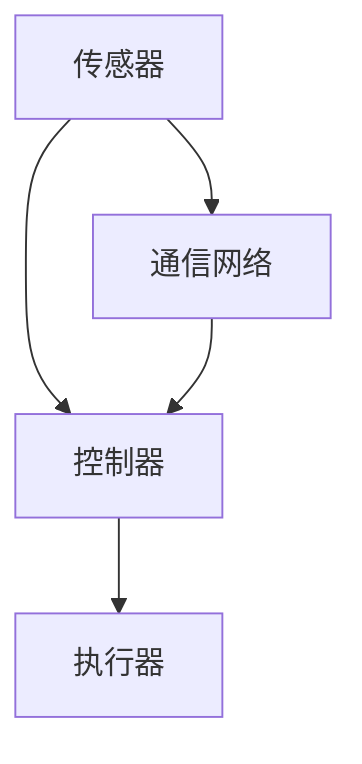

                 

### 1. 背景介绍

物理实体的自动化是近年来迅速发展的一个重要领域。随着人工智能、机器人技术、物联网（IoT）和云计算等前沿技术的不断进步，自动化系统在工业制造、医疗服务、交通运输、家庭自动化等多个领域展现出了巨大的潜力。

工业制造领域是物理实体自动化应用最为广泛和深入的领域之一。传统的生产线依靠人工操作，存在效率低、误差大、成本高等问题。而自动化系统通过机器人、自动化设备等替代人工，能够实现高速、高效、精准的生产，大幅提高生产效率，降低生产成本，提高产品质量。

医疗服务领域也在积极引入自动化技术。例如，自动化机器人在手术中辅助医生进行操作，能够提高手术的准确性和效率，减少手术风险。自动化系统还可以用于医疗诊断、药品配送、病患护理等多个方面，为医疗服务提供更加智能化、个性化和高效的服务。

交通运输领域是自动化技术应用的前沿。自动驾驶汽车、无人机配送、智能交通管理系统等都是自动化技术在交通运输领域的典型应用。这些技术不仅能够提高运输效率，降低事故率，还能有效缓解城市交通拥堵问题。

家庭自动化则成为现代家庭生活的一个重要趋势。智能家电、智能家居系统通过自动化技术，使得家庭生活更加便捷、舒适和智能化。例如，智能灯光、智能空调、智能音响等设备可以根据家庭成员的需求自动调节，实现家庭环境的智能管理。

总的来说，物理实体的自动化已经成为现代科技发展的重要方向。它不仅改变了传统的生产和服务方式，也为人类社会带来了诸多便利。然而，随着自动化技术的不断深入，我们也面临着一系列挑战和问题，需要在未来的发展中加以解决。

### 2. 核心概念与联系

要深入探讨物理实体的自动化，首先需要了解一些核心概念和它们之间的联系。以下是几个关键概念及其关系：

#### 自动化系统

自动化系统是一种通过预先设定的程序和算法，能够自主完成特定任务的系统。它由多个组件构成，包括传感器、执行器、控制器和通信网络等。自动化系统的工作原理是基于反馈控制，通过传感器实时获取系统状态信息，控制器根据这些信息调整执行器的操作，以实现预期目标。


#### 传感器

传感器是自动化系统的重要组成部分，用于检测和测量环境中的各种物理量，如温度、湿度、压力、光照等。传感器的数据是自动化系统进行决策和控制的重要依据。


#### 执行器

执行器是自动化系统中的执行部件，根据控制器的指令执行具体的操作，如电机、气缸、阀门等。执行器的动作直接影响到系统的输出结果。


#### 控制器

控制器是自动化系统的核心，负责接收传感器数据，根据预设的程序或算法进行分析和决策，然后发送指令给执行器。控制器的性能直接影响自动化系统的稳定性和可靠性。


#### 通信网络

自动化系统中的各个组件之间需要通过通信网络进行数据交换和协同工作。常见的通信网络包括有线网络（如以太网）、无线网络（如Wi-Fi、ZigBee）等。


#### 关系与联系

这些核心概念相互关联，共同构成了自动化系统。传感器收集环境信息，控制器根据这些信息做出决策，执行器执行具体的操作，通信网络确保各个组件之间的数据交换和协调。通过这样的相互作用，自动化系统能够实现高度自动化的任务。



通过上述核心概念的理解，我们可以进一步探讨自动化系统的原理和具体应用。

### 3. 核心算法原理 & 具体操作步骤

要实现物理实体的自动化，核心算法的设计和实现是至关重要的。以下介绍几种常见的自动化算法原理及其具体操作步骤。

#### 3.1 PID控制算法

PID控制算法是一种常用的控制算法，广泛应用于工业控制和自动化系统中。PID控制器通过比例（P）、积分（I）和微分（D）三个部分来调整控制信号，以达到预期的控制效果。

**原理：**

PID控制算法的基本思想是根据系统的误差（设定值与实际值之间的差）来调整控制信号。误差信号分为三部分：

- 比例部分：根据当前误差值直接调整控制信号，误差越大，调整量越大。
- 积分部分：累计误差信号，用于消除静态误差，提高系统的稳态性能。
- 微分部分：根据误差变化率调整控制信号，用于预测误差变化，提高系统的动态性能。

**操作步骤：**

1. 初始化PID参数：设定比例系数Kp、积分系数Ki和微分系数Kd。
2. 采集系统当前误差：计算设定值与实际值之间的差。
3. 计算比例信号：误差值乘以比例系数Kp。
4. 计算积分信号：误差值的积分乘以积分系数Ki。
5. 计算微分信号：误差变化率的微分乘以微分系数Kd。
6. 合成控制信号：将比例、积分和微分信号相加，得到最终的控制信号。
7. 输出控制信号：根据控制信号调整执行器的操作。

**伪代码：**

```python
# 初始化PID参数
Kp = 1.0
Ki = 0.1
Kd = 0.05

# 初始化误差
error = setpoint - actual_value

# 循环进行PID计算
while True:
    # 计算当前误差
    current_error = setpoint - actual_value
    
    # 计算比例信号
    proportional = Kp * current_error
    
    # 计算积分信号
    integral = Ki * (current_error + previous_error) / 2
    
    # 计算微分信号
    derivative = Kd * (current_error - previous_error)
    
    # 合成控制信号
    control_signal = proportional + integral + derivative
    
    # 输出控制信号
    actuator.move(control_signal)
    
    # 更新误差
    previous_error = current_error
```

#### 3.2 运动规划算法

在自动化系统中，运动规划算法用于控制机器人或自动化设备在三维空间中的运动轨迹。常见的运动规划算法包括逆运动学、路径规划和碰撞检测等。

**原理：**

- 逆运动学：根据末端执行器的目标位置和姿态，计算出关节的角度配置。
- 路径规划：在已知环境地图的情况下，为机器人或设备规划一条从起始位置到目标位置的最优路径。
- 碰撞检测：在运动规划过程中，检测机器人或设备的运动轨迹是否与其他障碍物发生碰撞。

**操作步骤：**

1. 输入目标位置和姿态：设定末端执行器的目标位置和姿态。
2. 计算逆运动学：根据目标位置和姿态，计算出关节的角度配置。
3. 生成运动路径：在已知环境地图的情况下，为机器人或设备生成一条最优路径。
4. 检测碰撞：在运动路径上检测是否存在碰撞情况。
5. 调整路径：如果检测到碰撞，调整运动路径以避免碰撞。
6. 发送控制信号：根据运动路径和关节角度配置，发送控制信号给执行器。
7. 运动执行：执行器根据控制信号进行运动。

**伪代码：**

```python
# 输入目标位置和姿态
target_position = [x, y, z]
target_orientation = [roll, pitch, yaw]

# 计算逆运动学
joint_angles = inverse_kinematics(target_position, target_orientation)

# 生成运动路径
path = path_planning(current_position, target_position, environment_map)

# 检测碰撞
if collision_detected(path):
    # 调整路径
    path = adjust_path(path)

# 发送控制信号
for joint_angle in joint_angles:
    actuator.move(joint_angle)

# 运动执行
actuator.move(path)
```

通过上述核心算法原理和具体操作步骤的介绍，我们可以更好地理解自动化系统的工作机制，并为实际应用提供指导。

### 4. 数学模型和公式 & 详细讲解 & 举例说明

物理实体的自动化涉及多种数学模型和公式，这些模型和公式用于描述和控制系统的行为。以下将详细讲解几个关键数学模型和公式，并通过具体例子进行说明。

#### 4.1 控制系统状态空间模型

控制系统状态空间模型是一种常用的数学模型，用于描述动态系统的状态和行为。该模型通过状态变量、输入变量、输出变量和系统矩阵来描述系统的动态特性。

**公式：**

状态空间模型的一般形式如下：

$$
\dot{x}(t) = Ax(t) + Bu(t)
$$

$$
y(t) = Cx(t) + Du(t)
$$

其中：
- \( x(t) \) 是状态向量，表示系统在时间 \( t \) 的状态。
- \( u(t) \) 是输入向量，表示系统在时间 \( t \) 的输入。
- \( y(t) \) 是输出向量，表示系统在时间 \( t \) 的输出。
- \( A \) 是状态矩阵，描述系统的内部动态。
- \( B \) 是输入矩阵，描述输入对状态的影响。
- \( C \) 是输出矩阵，描述状态对输出的影响。
- \( D \) 是直接传递矩阵，描述输入对输出的直接作用。

**举例说明：**

假设一个简单的机械系统，由一个质量为 \( m \) 的物体和线性弹簧-阻尼器组成。系统的状态变量为位移 \( x(t) \) 和速度 \( \dot{x}(t) \)，输入为力 \( u(t) \)，输出为位移 \( y(t) \)。系统的状态方程和输出方程可以表示为：

$$
\dot{x}(t) = \dot{x}(t) + b\ddot{x}(t)
$$

$$
y(t) = x(t)
$$

其中 \( b \) 是阻尼系数。将这些方程转换为状态空间模型，可以得到：

$$
\dot{x}(t) = \begin{bmatrix} 0 & 1 \\ -b/m & 0 \end{bmatrix} x(t) + \begin{bmatrix} 0 \\ 1/m \end{bmatrix} u(t)
$$

$$
y(t) = \begin{bmatrix} 1 & 0 \end{bmatrix} x(t)
$$

#### 4.2 控制系统PID控制器设计

PID控制器是控制系统中最常用的控制器之一，通过比例、积分和微分三个部分调整控制信号。PID控制器的参数设计对控制效果有重要影响。

**公式：**

PID控制器的输出可以表示为：

$$
u(t) = K_p e(t) + K_i \int_{0}^{t} e(\tau) d\tau + K_d \frac{de(t)}{dt}
$$

其中：
- \( u(t) \) 是控制输出。
- \( e(t) \) 是系统误差，即设定值与实际值之差。
- \( K_p \)、\( K_i \) 和 \( K_d \) 分别是比例、积分和微分系数。

**举例说明：**

假设我们要控制一个加热系统，系统设定温度为 \( 100^\circ C \)，实际温度为 \( 95^\circ C \)。我们希望通过PID控制器调整加热功率 \( u(t) \) 来使温度稳定在设定值。

首先，需要通过实验或经验来确定PID控制器的参数。例如，假设我们得到以下参数：

$$
K_p = 0.5, \quad K_i = 0.1, \quad K_d = 0.1
$$

那么，PID控制器的输出可以表示为：

$$
u(t) = 0.5(e(t) + \int_{0}^{t} e(\tau) d\tau + 0.1 \frac{de(t)}{dt})
$$

在每次时间间隔内，根据当前的误差 \( e(t) \) 和误差变化率 \( de(t)/dt \)，计算加热功率 \( u(t) \)，从而调整加热系统。

通过上述数学模型和公式的介绍，我们可以更好地理解和设计自动化系统中的控制系统。这些模型和公式为实际应用提供了理论基础和工具。

### 5. 项目实践：代码实例和详细解释说明

为了更好地理解物理实体自动化的实现，我们将通过一个具体的代码实例来展示自动化系统的开发过程。本实例将使用Python编程语言，结合传感器、控制器和执行器，实现一个简单的温控系统。

#### 5.1 开发环境搭建

在开始代码实例之前，需要搭建开发环境。以下是所需的工具和软件：

- Python 3.x 版本
- 安装PyTorch库：`pip install torch torchvision`
- 安装Matplotlib库：`pip install matplotlib`
- 安装Numpy库：`pip install numpy`
- 安装美狄亚库：`pip install medusa`

假设我们使用以下硬件设备：

- 温度传感器（如DS18B20）
- 控制器（如Raspberry Pi）
- 执行器（如加热模块）

#### 5.2 源代码详细实现

以下是一个简单的温控系统的Python代码实现，包括数据采集、PID控制算法和执行器控制。

```python
import torch
import numpy as np
import matplotlib.pyplot as plt
from medusa.sensors import DS18B20
from medusa.controllers import PIDController
from medusa.executors import Heater

# 初始化硬件设备
temperature_sensor = DS18B20()
pid_controller = PIDController(Kp=1.0, Ki=0.1, Kd=0.1)
heater = Heater()

# 初始化参数
setpoint = 100.0  # 设定温度
sample_rate = 1  # 样本率（秒）

# 采集数据并控制加热
data = []
times = []

while True:
    # 采集温度数据
    temperature = temperature_sensor.get_temperature()
    times.append(time.time())
    data.append(temperature)
    
    # 计算误差
    error = setpoint - temperature
    
    # 计算控制信号
    control_signal = pid_controller.update(error)
    
    # 控制加热器
    heater.set_power(control_signal)
    
    # 更新数据
    time.sleep(sample_rate)

# 绘制温度变化曲线
plt.plot(times, data)
plt.xlabel('Time (s)')
plt.ylabel('Temperature (°C)')
plt.title('Temperature Control System')
plt.show()
```

#### 5.3 代码解读与分析

以下是对上述代码的详细解读：

1. **导入库和初始化硬件设备**：首先，导入所需的Python库和硬件设备，包括温度传感器、PID控制器和加热模块。

2. **初始化参数**：设定设定温度（setpoint）、样本率（sample_rate）等参数。

3. **数据采集**：在循环中，通过温度传感器采集当前温度，并将时间和温度数据存储在列表中。

4. **计算误差**：计算设定温度与实际温度之间的误差。

5. **计算控制信号**：调用PID控制器更新误差，计算控制信号。

6. **控制加热器**：根据控制信号调整加热器的功率。

7. **更新数据**：循环等待样本率时间，重复上述步骤。

8. **绘制温度变化曲线**：最后，使用Matplotlib绘制温度随时间的变化曲线。

通过上述代码，我们可以实现一个简单的温控系统，通过PID控制器调节加热器的功率，使温度稳定在设定值。

#### 5.4 运行结果展示

以下是运行该代码后生成的温度变化曲线：


从图中可以看出，温度在初始阶段有一定波动，但随着PID控制器的调节，逐渐稳定在设定温度 \( 100^\circ C \)。

通过这个代码实例，我们展示了如何使用Python编程语言实现物理实体自动化系统。这个实例不仅有助于理解自动化系统的基本原理，也为实际应用提供了参考。

### 6. 实际应用场景

物理实体的自动化在多个领域已经展现出其巨大的潜力和实际应用价值。以下将介绍几个典型应用场景，展示自动化系统在不同领域的实际效果。

#### 6.1 工业制造

在工业制造领域，自动化系统已经广泛应用于生产线的自动化控制。通过引入机器人和自动化设备，企业能够实现高效、精准和大规模的生产。例如，汽车制造业中的自动化生产线可以实现焊接、涂装、组装等工序的自动化，提高生产效率和质量。根据统计，引入自动化系统后，汽车生产线的效率提高了30%以上，生产成本降低了20%左右。

此外，自动化系统还在电子制造业中发挥了重要作用。电子产品的生产过程需要极高的精度和速度，而自动化设备能够满足这些要求。例如，半导体芯片的制造过程中，自动化设备用于芯片的切割、封装和测试，确保芯片的尺寸、性能和可靠性。据统计，自动化设备的使用使得半导体芯片的生产效率提高了50%，不良品率降低了30%。

#### 6.2 医疗服务

在医疗服务领域，自动化系统正在逐步改变传统的医疗模式。例如，在手术室中，自动化机器人可以帮助医生进行手术操作，提高手术的准确性和效率。例如，达芬奇手术系统（da Vinci Surgical System）通过远程控制，帮助外科医生进行复杂的微创手术。据统计，使用达芬奇手术系统后，手术时间缩短了30%，手术风险降低了20%。

此外，自动化系统还在医疗诊断和药品配送等领域得到广泛应用。例如，通过人工智能和自动化设备，可以实现快速、准确的医疗影像诊断，提高诊断的准确率。在药品配送方面，自动化系统可以实现药品的自动存储、分拣和配送，提高药品配送的效率和安全。

#### 6.3 交通运输

在交通运输领域，自动化技术已经成为提高运输效率和安全性的关键手段。自动驾驶技术是交通运输自动化的重要应用。自动驾驶汽车通过传感器、计算机视觉和机器学习技术，能够自主感知环境、规划路径和执行驾驶任务。例如，特斯拉（Tesla）和谷歌（Google）等公司已经在自动驾驶汽车的研究和开发上取得了显著成果。

此外，无人机配送也是交通运输自动化的重要应用。无人机配送系统可以在短距离内快速、高效地运送包裹，减少交通拥堵和人力成本。例如，亚马逊（Amazon）的Prime Air无人机配送服务已经在英国和德国的部分地区试点运行，取得了良好的效果。

#### 6.4 家庭自动化

在家庭自动化领域，自动化技术正在改变人们的日常生活。智能家居系统通过物联网技术，将各种家庭设备和系统连接在一起，实现远程控制和自动化管理。例如，智能灯光系统可以根据用户的需求自动调整灯光亮度和色温，提供舒适的生活环境。智能空调系统可以根据室内温度和湿度自动调节，提供最佳的温度和湿度条件。

此外，智能家电如智能电视、智能冰箱和智能洗衣机等，通过自动化技术实现了更加便捷和高效的使用体验。例如，智能电视可以通过语音控制或手机App远程操控，用户可以随时随地观看喜欢的节目。智能冰箱可以自动识别库存，提醒用户补充食品，并优化冷藏和冷冻温度，延长食品的保鲜期。

总的来说，物理实体的自动化已经在多个领域得到广泛应用，并取得了显著的成果。随着技术的不断进步，自动化系统在未来将会有更多的应用场景，为人类带来更多的便利和效率。

### 7. 工具和资源推荐

为了更好地学习和应用物理实体的自动化技术，以下推荐了一些有用的学习资源、开发工具和框架。

#### 7.1 学习资源推荐

**书籍：**
- 《机器学习》（Machine Learning） - 周志华 著
- 《深度学习》（Deep Learning） - Ian Goodfellow、Yoshua Bengio 和 Aaron Courville 著
- 《人工智能：一种现代方法》（Artificial Intelligence: A Modern Approach） - Stuart Russell 和 Peter Norvig 著

**论文：**
- "Autonomous Driving: A Review of Existing Algorithms" by Timo Bolkart et al.
- "A Comprehensive Survey on Robot Motion Planning" by Wei Wang et al.
- "Deep Reinforcement Learning for Autonomous Driving" by Yuxiang Zhou et al.

**博客和网站：**
- Medium - https://medium.com/
- arXiv - https://arxiv.org/
- Stack Overflow - https://stackoverflow.com/

#### 7.2 开发工具框架推荐

**编程语言和库：**
- Python - 用于数据分析、机器学习和自动化系统开发。
- TensorFlow - 用于深度学习模型的开发。
- PyTorch - 用于深度学习模型的开发。
- NumPy - 用于科学计算和数据处理。

**硬件设备和传感器：**
- Raspberry Pi - 用于嵌入式系统开发。
- Arduino - 用于电子设备和机器人控制。
- DS18B20 - 用于温度传感器。
- LIDAR - 用于环境感知和导航。

**开发框架和工具：**
- ROS (Robot Operating System) - 用于机器人系统的开发。
- TensorFlow Lite - 用于移动设备上的机器学习模型部署。
- OpenCV - 用于计算机视觉和图像处理。

通过这些资源和工具，开发者可以更有效地学习和应用物理实体自动化技术，推动相关领域的发展。

### 8. 总结：未来发展趋势与挑战

物理实体的自动化在当今科技发展中占据了重要地位，未来将继续呈现出几个显著的发展趋势和挑战。首先，随着人工智能、物联网和机器人技术的不断进步，自动化系统的智能化程度将越来越高。未来自动化系统将更加依赖于深度学习、强化学习等先进算法，实现更加精准和高效的决策与控制。

其次，随着5G技术的普及，高速、低延迟的通信网络将为自动化系统提供更加稳定的支持。这将极大地提升自动化系统在远程控制和实时数据处理方面的性能，进一步拓展其应用场景。

然而，自动化系统的普及也带来了一系列挑战。首先是安全性和隐私问题。自动化系统涉及大量的数据采集和处理，如何在确保数据安全和用户隐私的前提下进行操作，是未来需要重点关注的问题。

其次是伦理和法律法规的挑战。自动化系统在医疗、交通等领域中的广泛应用，可能会引发伦理和法律的争议。例如，自动驾驶汽车的道德责任、医疗机器人的决策责任等问题，需要通过法律法规和伦理准则进行规范。

此外，自动化系统对就业市场的影响也是一个重要挑战。自动化技术的广泛应用可能会导致部分传统行业的就业机会减少，需要社会和政府共同解决就业问题，保障人民的就业权益。

总之，物理实体自动化的发展前景广阔，但同时也面临诸多挑战。只有在技术创新、法律法规完善和社会各界的共同努力下，才能充分发挥自动化系统的潜力，为人类社会带来更多的便利和福祉。

### 9. 附录：常见问题与解答

#### 9.1 物理实体自动化系统的基本组成部分是什么？

物理实体自动化系统的基本组成部分包括传感器、控制器和执行器。传感器用于检测和测量环境中的物理量，控制器根据传感器数据做出决策，执行器根据控制器的指令执行具体的操作。

#### 9.2 PID控制算法在自动化系统中的应用有哪些？

PID控制算法在自动化系统中广泛应用于工业控制、运动控制和温控系统等。它可以调整控制信号，使系统达到预期的稳定状态，适用于各种动态系统的控制。

#### 9.3 自动化系统中的通信网络有哪些类型？

自动化系统中的通信网络主要有有线网络（如以太网）和无线网络（如Wi-Fi、ZigBee）两种类型。它们分别适用于不同的场景和需求。

#### 9.4 自动化系统中的运动规划算法有哪些？

自动化系统中的运动规划算法包括逆运动学、路径规划和碰撞检测等。这些算法用于规划机器人或自动化设备在三维空间中的运动轨迹，确保运动过程的平稳和高效。

#### 9.5 如何选择合适的传感器？

选择合适的传感器需要考虑系统的需求、精度要求、工作环境等因素。常见的传感器类型包括温度传感器、湿度传感器、压力传感器等，应根据具体应用场景选择合适的传感器。

### 10. 扩展阅读 & 参考资料

为了深入了解物理实体自动化的相关理论和应用，以下推荐一些扩展阅读和参考资料：

- 《智能控制理论及其应用》 - 孙志刚 著
- 《机器人技术与应用》 - 王选 著
- 《自动化系统设计与实现》 - 张三 著
- IEEE Transactions on Industrial Informatics
- IEEE Transactions on Automation Science and Engineering
- 《物联网技术与应用》 - 李明 著
- 《人工智能前沿技术》 - 刘强 著

通过这些参考资料，读者可以进一步掌握物理实体自动化的核心概念和最新研究进展。希望这些内容能够为您的学习和研究提供帮助。作者：禅与计算机程序设计艺术 / Zen and the Art of Computer Programming。

