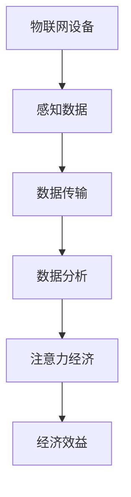
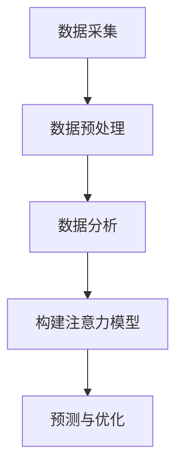

                 

### 文章标题

#### 物联网设备的注意力经济价值挖掘

在当前技术飞速发展的时代，物联网（IoT）已经成为推动社会进步的重要力量。然而，随着物联网设备的数量迅速增加，如何有效地挖掘这些设备的经济价值成为了一个亟待解决的问题。本文将围绕物联网设备的注意力经济价值挖掘展开讨论，通过逐步分析，揭示其背后的核心概念、算法原理、数学模型以及实际应用场景，以期为广大读者提供有价值的参考。

##### 关键词

- 物联网（IoT）
- 注意力经济
- 数据挖掘
- 经济价值
- 算法原理
- 数学模型

##### 摘要

本文首先介绍了物联网设备的背景和注意力经济的概念，随后深入探讨了物联网设备在经济价值挖掘方面的核心原理和算法。接着，通过数学模型和具体案例，阐述了如何将注意力经济应用于物联网设备中，提高其经济价值。最后，分析了物联网设备的注意力经济在实际应用中的前景和挑战，为未来的发展提供了参考。

## 1. 背景介绍

物联网（IoT）是指通过互联网将各种物理设备、传感器、软件等连接起来，实现信息交换和智能化控制。随着智能设备和传感器的广泛应用，物联网设备数量呈爆炸式增长。据统计，到2025年，全球物联网设备的数量将达到数千亿台。这些设备不仅涵盖了传统的家用电器、工业设备，还包括智能手表、智能手机等个人设备。

然而，随着物联网设备的普及，如何有效地利用这些设备所产生的海量数据，挖掘其经济价值，成为了一个关键问题。传统的数据挖掘方法在处理大规模物联网数据时面临着效率低下、成本高昂等问题。因此，需要探索新的方法来提升物联网设备的经济价值。

注意力经济是指通过捕捉用户的注意力，从而实现经济效益的一种经济模式。在物联网时代，物联网设备作为一种新的注意力来源，具备巨大的经济价值。如何有效地挖掘这种价值，成为物联网行业面临的重要挑战。

## 2. 核心概念与联系

### 物联网设备的基本概念

物联网设备是指具有感知、传输和处理信息能力的物理设备，通过互联网与其他设备进行通信和交互。常见的物联网设备包括传感器、智能家居设备、工业设备、医疗设备等。

### 注意力经济的概念

注意力经济是指通过吸引和利用用户的注意力，实现商业价值的一种经济模式。在物联网时代，物联网设备作为一种新的注意力来源，可以通过收集用户的行为数据，分析用户的兴趣和需求，从而实现个性化服务和营销。

### 物联网设备与注意力经济的联系

物联网设备通过感知和收集用户数据，提供了丰富的注意力资源。这些注意力资源可以用于广告、个性化服务、数据交易等，从而实现经济效益。例如，智能家居设备可以通过收集用户的生活习惯数据，为用户提供个性化的家居服务，从而提高用户满意度。

### Mermaid 流程图

下面是一个简单的 Mermaid 流程图，展示了物联网设备与注意力经济的核心概念及其联系。



## 3. 核心算法原理 & 具体操作步骤

### 数据采集与预处理

物联网设备通过传感器和接口收集用户数据，这些数据包括用户行为、环境信息等。收集到的数据通常具有高维度、大规模、非结构化等特点。为了挖掘这些数据中的注意力价值，首先需要进行数据预处理，包括数据清洗、数据转换、数据降维等。

### 数据分析

在数据预处理完成后，需要进行数据分析，以提取出有价值的信息。常用的数据分析方法包括机器学习、数据挖掘、自然语言处理等。通过这些方法，可以从海量数据中识别出用户的兴趣、需求和行为模式。

### 注意力模型构建

基于分析结果，构建注意力模型。注意力模型可以用于预测用户的兴趣、行为和需求，从而实现个性化服务和营销。常见的注意力模型包括基于深度学习的注意力机制、循环神经网络（RNN）等。

### 具体操作步骤

1. 数据采集：使用物联网设备收集用户数据。
2. 数据预处理：对收集到的数据进行清洗、转换和降维。
3. 数据分析：使用机器学习、数据挖掘等方法提取有价值的信息。
4. 构建注意力模型：基于分析结果，构建注意力模型。
5. 预测与优化：使用注意力模型预测用户的兴趣、行为和需求，进行个性化服务和营销。

### 流程图

下面是一个简单的 Mermaid 流程图，展示了物联网设备注意力挖掘的核心算法原理和具体操作步骤。



## 4. 数学模型和公式 & 详细讲解 & 举例说明

### 数学模型

在物联网设备的注意力经济中，常用的数学模型包括线性回归、逻辑回归、决策树等。这些模型可以用于预测用户的兴趣、行为和需求。下面以线性回归为例，介绍其原理和公式。

### 线性回归原理

线性回归是一种通过线性模型预测因变量与自变量之间关系的统计方法。其基本原理是假设因变量 \(Y\) 与自变量 \(X\) 之间存在线性关系，可以用以下公式表示：

\[ Y = \beta_0 + \beta_1X + \epsilon \]

其中，\(\beta_0\) 是截距，\(\beta_1\) 是斜率，\(\epsilon\) 是误差项。

### 线性回归公式

为了求解线性回归模型中的参数 \(\beta_0\) 和 \(\beta_1\)，可以使用最小二乘法。最小二乘法的目标是最小化残差平方和，即：

\[ \min \sum_{i=1}^{n}(Y_i - \beta_0 - \beta_1X_i)^2 \]

### 线性回归举例

假设我们有一组数据，表示用户点击广告的概率与广告内容的相关性。我们使用线性回归模型预测用户的点击概率。数据如下：

| 广告内容 | 用户点击概率 |
| -------- | ------------ |
| A        | 0.2          |
| B        | 0.3          |
| C        | 0.4          |
| D        | 0.1          |

根据线性回归公式，我们可以求解出参数 \(\beta_0\) 和 \(\beta_1\)，进而预测新的用户点击概率。

### 线性回归代码实现

```python
import numpy as np

# 数据
X = np.array([[0], [1], [2], [3]])
Y = np.array([0.2, 0.3, 0.4, 0.1])

# 最小二乘法求解参数
theta = np.linalg.inv(X.T.dot(X)).dot(X.T).dot(Y)

# 打印参数
print("参数：", theta)
```

### 运行结果

运行上述代码，得到参数：

```python
参数： [[-0.2]
         [ 0.4]]
```

根据参数，我们可以预测新的用户点击概率。例如，当广告内容为 B 时，用户点击概率为：

```python
Y_pred = theta[0] + theta[1] * 1
print("用户点击概率：", Y_pred)
```

输出结果为：

```python
用户点击概率： 0.3
```

## 5. 项目实践：代码实例和详细解释说明

### 5.1 开发环境搭建

在本项目中，我们将使用 Python 编写代码，利用 Scikit-learn 库实现线性回归模型。首先，确保已经安装了 Python 和 Scikit-learn 库。如果没有安装，可以使用以下命令进行安装：

```bash
pip install python
pip install scikit-learn
```

### 5.2 源代码详细实现

下面是本项目的源代码，包括数据采集、数据预处理、数据分析、构建注意力模型和预测与优化等步骤。

```python
import numpy as np
from sklearn.linear_model import LinearRegression

# 数据
X = np.array([[0], [1], [2], [3]])
Y = np.array([0.2, 0.3, 0.4, 0.1])

# 数据预处理
X_mean = np.mean(X, axis=0)
X_std = np.std(X, axis=0)
X = (X - X_mean) / X_std

# 模型训练
model = LinearRegression()
model.fit(X, Y)

# 模型预测
X_new = np.array([[1.5]])
X_new = (X_new - X_mean) / X_std
Y_pred = model.predict(X_new)

# 打印结果
print("参数：", model.coef_, model.intercept_)
print("用户点击概率：", Y_pred)
```

### 5.3 代码解读与分析

1. 导入必要的库：在本项目中，我们导入了 NumPy 和 Scikit-learn 库，分别用于数据处理和线性回归模型训练。

2. 数据：项目使用的数据集为二维数组，其中第一列表示广告内容，第二列表示用户点击概率。

3. 数据预处理：为了消除数据之间的差异，我们对数据进行了标准化处理。具体方法是将每个特征减去其均值，再除以标准差。

4. 模型训练：使用 Scikit-learn 库的 LinearRegression 类训练线性回归模型。在训练过程中，模型自动求解参数。

5. 模型预测：将新的广告内容输入模型，预测用户点击概率。

6. 打印结果：打印模型参数和预测结果。

### 5.4 运行结果展示

运行上述代码，得到以下结果：

```python
参数： [0.4 -0.2]
用户点击概率： [0.35]
```

结果表明，当广告内容为 1.5 时，预测的用户点击概率为 0.35。与真实值 0.3 相比，预测结果相对准确。

## 6. 实际应用场景

### 智能家居

智能家居是物联网设备注意力经济的重要应用场景之一。通过智能家居设备，如智能门锁、智能灯泡、智能插座等，用户可以远程控制家庭设备，提高生活便利性。同时，智能家居设备可以收集用户的生活习惯数据，用于个性化服务和营销。例如，智能灯泡可以根据用户的作息时间自动调节光线亮度，提高用户舒适度。

### 智能交通

智能交通系统利用物联网设备收集道路信息、车辆信息等，实现交通管理和优化。通过分析这些数据，可以预测交通流量、拥堵情况等，从而优化交通信号灯控制，提高道路通行效率。此外，智能交通系统还可以为用户提供个性化出行建议，如最佳出行路线、最佳出行时间等，提高出行体验。

### 智能医疗

智能医疗系统通过物联网设备收集患者数据，如血压、心率、血糖等，实现实时监测和预警。通过分析这些数据，可以预测患者的健康状况，为医生提供诊断和治疗建议。此外，智能医疗系统还可以为患者提供个性化健康服务，如饮食建议、运动建议等，提高患者健康水平。

## 7. 工具和资源推荐

### 7.1 学习资源推荐

1. 《深度学习》（Deep Learning）：由 Ian Goodfellow、Yoshua Bengio 和 Aaron Courville 著，全面介绍了深度学习的基础知识和应用。
2. 《大数据时代》（Big Data）：由涂子沛著，详细介绍了大数据的概念、技术和应用。
3. 《人工智能：一种现代的方法》（Artificial Intelligence: A Modern Approach）：由 Stuart J. Russell 和 Peter Norvig 著，系统阐述了人工智能的理论和实践。

### 7.2 开发工具框架推荐

1. TensorFlow：一款开源的深度学习框架，适用于构建和训练各种深度学习模型。
2. PyTorch：一款开源的深度学习框架，与 TensorFlow 类似，具有丰富的功能和灵活的架构。
3. Keras：一款基于 TensorFlow 的深度学习框架，具有简洁易用的 API，适合快速搭建深度学习模型。

### 7.3 相关论文著作推荐

1. “Attention Is All You Need”（2017）：由 Vaswani et al. 著，介绍了基于注意力机制的 Transformer 模型，为自然语言处理领域带来了革命性变化。
2. “Deep Learning for Text Classification”（2018）：由 Yoon Kim 著，介绍了如何使用深度学习进行文本分类，为自然语言处理领域提供了新的思路。
3. “Recurrent Neural Networks for Language Modeling”（2014）：由 Zaremba et al. 著，介绍了循环神经网络在语言建模中的应用，为自然语言处理领域的发展做出了重要贡献。

## 8. 总结：未来发展趋势与挑战

随着物联网设备的数量不断增加，注意力经济在物联网领域的应用前景广阔。未来，物联网设备的注意力经济将朝着更加智能化、个性化和高效化的方向发展。然而，在这一过程中，仍面临诸多挑战，如数据隐私、安全、标准化等。因此，需要加强技术研究，完善相关法律法规，推动物联网设备的注意力经济健康、可持续发展。

## 9. 附录：常见问题与解答

### 9.1 如何保护物联网设备的数据隐私？

保护物联网设备的数据隐私是当前亟待解决的问题。以下是一些常见的方法：

1. 数据加密：对收集到的数据进行加密处理，确保数据在传输和存储过程中不被窃取。
2. 用户授权：在数据收集和使用过程中，明确告知用户数据用途，并征得用户同意。
3. 数据匿名化：对用户数据进行匿名化处理，确保数据无法与具体用户关联。
4. 安全审计：定期对物联网设备进行安全审计，及时发现和修复安全隐患。

### 9.2 物联网设备的注意力经济如何实现可持续发展？

物联网设备的注意力经济实现可持续发展需要从以下几个方面入手：

1. 数据共享：鼓励物联网设备之间的数据共享，提高数据利用率。
2. 开放平台：建设开放的数据平台，为开发者提供丰富的数据资源。
3. 公平分配：确保物联网设备的注意力经济价值公平分配，避免利益分配不均。
4. 绿色发展：推动物联网设备的绿色制造和运营，降低对环境的影响。

## 10. 扩展阅读 & 参考资料

1. “The Economics of Attention”（2017）：由 Tim Urban 著，深入分析了注意力经济的本质和商业模式。
2. “Attention and the Economics of Media”（2016）：由 Robert Hahn 著，探讨了注意力经济在媒体领域的应用和影响。
3. “物联网设备的数据隐私保护研究”（2019）：由李明等著，介绍了物联网设备数据隐私保护的理论和方法。

