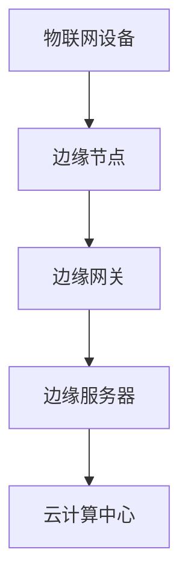

                 

### 背景介绍

随着物联网（IoT）技术的快速发展，各类智能设备和传感器被广泛应用，从而产生了海量的数据。这些数据具有多样性和高速增长的特点，给传统的云计算模式带来了巨大的挑战。传统的云计算中心往往位于远离数据源的地方，导致数据传输延迟、带宽压力增大以及处理能力不足等问题。为了解决这些问题，边缘计算作为一种新兴的计算范式应运而生。

边缘计算的核心思想是将计算能力、存储能力和数据处理能力下沉到网络的边缘，即在靠近数据源的地方进行数据处理，从而减少数据传输的距离和时间。这样，不仅能够降低网络拥堵和延迟，还能够充分利用本地资源和计算能力，实现更快速、更安全的数据处理。

边缘计算在物联网中的应用场景非常广泛。例如，在智能家居中，边缘计算可以实现对家电的实时控制、环境监测和安防监控；在智能交通中，边缘计算可以用于实时路况分析和交通信号控制；在工业自动化领域，边缘计算可以实现设备的实时监控和故障预测。此外，在医疗、能源、农业等多个领域，边缘计算都展示了其强大的应用潜力。

总的来说，边缘计算作为物联网时代的一项核心技术，正逐渐改变着我们的生活方式和工作模式。其应用场景的多样性和灵活性，使其成为物联网发展的关键推动力。然而，随着边缘计算技术的不断演进，我们仍需面对诸多挑战，如数据安全、隐私保护、标准化等问题。因此，深入研究和探讨边缘计算的相关技术和发展趋势，对于推动物联网技术的全面应用具有重要意义。

### 核心概念与联系

#### 边缘计算的基本概念

边缘计算（Edge Computing）是一种分布式计算模型，它将数据处理和分析任务从传统的集中式数据中心转移到网络的边缘节点，即靠近数据源的地方。边缘计算的核心概念在于“近源处理”，即将数据处理工作尽可能接近数据生成地点，以减少延迟和带宽消耗。

边缘节点可以是各种设备，如智能路由器、网关、智能手机、传感器等。这些设备通过收集、处理和分析数据，提供实时响应和智能决策。边缘计算不仅包括硬件设施，还涉及到软件架构、网络安全、数据处理算法等多个方面。

#### 物联网与边缘计算的联系

物联网（Internet of Things，IoT）是指通过传感器、设备和其他技术将物理设备连接到互联网，实现信息交换和通信。物联网与边缘计算之间的联系在于，物联网设备产生的海量数据需要高效的计算和分析，而边缘计算提供了这种高效处理的能力。

物联网设备通过传感器收集环境数据，如温度、湿度、光线、运动等。这些数据在传输到云计算中心之前，可以在边缘节点进行初步处理，例如数据过滤、压缩和初步分析。通过这种方式，可以显著减少需要传输的数据量，降低网络拥堵和延迟，同时提高数据处理效率。

#### 边缘计算架构的基本组成部分

边缘计算架构通常包括以下几个主要组成部分：

1. **边缘节点（Edge Nodes）**：边缘节点是边缘计算架构中的基础单元，负责数据收集、处理和通信。这些节点可以是嵌入式设备、智能手机、工业机器人等。

2. **边缘网关（Edge Gateways）**：边缘网关是连接物联网设备和互联网的桥梁，负责数据的传输、路由和安全认证。边缘网关通常具备数据处理和存储能力，能够进行初步的数据处理和分析。

3. **边缘服务器（Edge Servers）**：边缘服务器是边缘计算架构中的核心组件，负责管理和调度边缘节点和边缘网关，提供更高级别的数据处理和分析服务。

4. **云计算中心（Cloud Center）**：尽管边缘计算强调近源处理，但云计算中心仍然在边缘计算架构中扮演重要角色。云计算中心负责处理边缘节点无法处理的复杂计算任务，例如大规模数据分析、机器学习模型训练等。

#### 边缘计算架构的 Mermaid 流程图



在这个简单的 Mermaid 流程图中，物联网设备通过边缘节点进行数据收集和处理，边缘网关负责数据传输和初步处理，边缘服务器提供更高级别的数据处理和分析服务，而云计算中心则处理复杂计算任务。这种架构设计充分利用了边缘计算的优势，实现了高效、灵活的数据处理。

### 核心算法原理 & 具体操作步骤

#### 边缘计算的关键算法

边缘计算的核心在于高效地处理海量数据，并实现实时响应。为此，边缘计算涉及多个关键算法，包括数据处理算法、数据流处理算法和机器学习算法。

1. **数据处理算法**：数据处理算法主要涉及数据清洗、数据压缩和数据预处理。数据清洗包括去除噪声数据和缺失值填充；数据压缩通过减少数据大小来提高传输效率；数据预处理包括特征提取和特征选择，以便更好地进行后续分析。

2. **数据流处理算法**：数据流处理算法用于处理实时数据流，例如 Apache Kafka 和 Apache Flink。这些算法能够实时采集、处理和分析数据，实现快速响应。数据流处理算法通常采用分布式架构，以处理大规模数据。

3. **机器学习算法**：机器学习算法在边缘计算中发挥着重要作用，例如用于设备故障预测、异常检测和智能决策。常见的机器学习算法包括决策树、支持向量机和神经网络。在边缘计算中，这些算法被优化为轻量级版本，以适应资源受限的边缘节点。

#### 边缘计算的具体操作步骤

1. **数据采集**：物联网设备通过传感器采集数据，并将数据传输到边缘节点。边缘节点可以是嵌入式设备、智能手机等。

2. **初步处理**：边缘节点对采集到的数据进行初步处理，包括数据清洗、数据压缩和特征提取。这一步的目的是减少数据量，提高传输效率，并为后续分析提供高质量的数据。

3. **数据传输**：初步处理后的数据通过边缘网关传输到边缘服务器。边缘网关负责数据传输的路由、认证和安全。

4. **高级处理**：边缘服务器对传输过来的数据进行高级处理，包括数据流处理和机器学习算法。边缘服务器具备更高的计算能力和存储资源，能够处理复杂的数据分析任务。

5. **结果输出**：处理结果通过边缘网关返回给物联网设备，或上传到云计算中心进行进一步分析和处理。这种反馈机制实现了数据的闭环处理，提高了系统的响应速度和效率。

6. **实时监控与维护**：边缘计算系统需要实时监控设备状态和数据处理过程，以确保系统的稳定运行。同时，定期进行维护和升级，以适应不断变化的数据需求和计算环境。

#### 边缘计算的核心算法原理

1. **数据处理算法原理**：
   - 数据清洗：使用统计学方法去除噪声数据和缺失值填充。
   - 数据压缩：使用数据压缩算法（如 Huffman 编码、LZ77）减少数据大小。
   - 特征提取：使用特征提取算法（如 PCA、LDA）从原始数据中提取有用特征。

2. **数据流处理算法原理**：
   - 流处理框架：如 Apache Kafka、Apache Flink，采用分布式架构实现实时数据处理。
   - 消息队列：使用消息队列（如 Kafka）存储和传输实时数据。
   - 流处理单元：处理实时数据流，如聚合、过滤和连接。

3. **机器学习算法原理**：
   - 决策树：通过分割特征空间来构建决策树，实现分类和回归。
   - 支持向量机：通过找到一个最优超平面来分隔数据，实现分类和回归。
   - 神经网络：通过多层神经元和权重学习，实现复杂函数的逼近。

#### 操作步骤示例

以下是一个简单的边缘计算操作步骤示例：

1. **数据采集**：智能温度传感器采集环境温度数据。
2. **初步处理**：边缘节点对温度数据进行清洗和压缩。
3. **数据传输**：边缘节点将处理后的温度数据传输到边缘网关。
4. **高级处理**：边缘服务器使用 Flink 对温度数据进行实时分析，提取有用特征。
5. **结果输出**：分析结果通过边缘网关返回给边缘节点，用于调整温度控制系统。
6. **实时监控**：系统实时监控设备状态和数据处理过程，确保系统稳定运行。

通过这个示例，我们可以看到边缘计算如何通过数据采集、初步处理、高级处理和结果输出等步骤，实现高效、实时的数据处理。

### 数学模型和公式 & 详细讲解 & 举例说明

在边缘计算中，数学模型和公式起着至关重要的作用，特别是在数据处理、优化和预测方面。以下将详细介绍几个关键的数学模型和公式，并配以详细的讲解和实际例子，以帮助读者更好地理解这些概念。

#### 1. 数据压缩算法

数据压缩是一种重要的技术，用于减少数据传输量和存储空间。常见的压缩算法有 Huffman 编码、LZ77 等。

**Huffman 编码公式**：

$$
C = \sum_{i=1}^{n} p_i \cdot l_c
$$

其中，\(C\) 是压缩后数据的位数，\(p_i\) 是符号 \(i\) 的概率，\(l_c\) 是编码长度。

**LZ77 压缩算法**：

$$
C = \text{find\ longest\ match}(S, T)
$$

其中，\(S\) 是源字符串，\(T\) 是目标字符串，\(\text{find\ longest\ match}\) 用于找到 \(S\) 中最长匹配的子串。

**示例**：

假设有一段文本 "Hello, World!"，使用 Huffman 编码进行压缩：

- 字符频率：\(H = [8, 1, 1, 1, 1, 1, 1, 1, 1, 2]\)
- 编码长度：\(L = [3, 3, 3, 3, 3, 3, 3, 3, 3, 4]\)
- 压缩后数据：\(C = 8 \cdot 3 + 2 \cdot 4 = 32 + 8 = 40\)

原始文本长度为 13，压缩后长度为 40，数据压缩率为 \(40/13 \approx 3.08\)。

#### 2. 数据流处理算法

数据流处理算法用于实时处理和分析数据流。常见的算法有 Apache Kafka、Apache Flink 等。

**Kafka 消息队列模型**：

$$
\text{Message\ Queue} = \text{Kafka\ Topics}
$$

其中，Kafka Topics 用于存储消息，每个 Topic 有多个 Partition，Partition 用于并行处理。

**Flink 流处理算法**：

$$
\text{DataStream} \rightarrow \text{Transformation} \rightarrow \text{DataStream}
$$

其中，DataStream 表示数据流，Transformation 表示数据转换操作。

**示例**：

假设有一组温度数据流 {25, 26, 24, 27, 25}，使用 Flink 进行处理：

- 数据流：{25, 26, 24, 27, 25}
- 转换操作：求平均值
- 平均值：\( \text{average} = (25 + 26 + 24 + 27 + 25) / 5 = 25.2 \)

#### 3. 机器学习算法

机器学习算法在边缘计算中用于预测和分类。常见的算法有决策树、支持向量机、神经网络等。

**决策树算法**：

$$
C = \text{classify}(x, \text{tree})
$$

其中，\(C\) 是分类结果，\(x\) 是待分类数据，\(\text{tree}\) 是决策树模型。

**支持向量机算法**：

$$
w = \text{Solve}\ \text{Quadratic\ Programming}
$$

其中，\(w\) 是超平面参数，用于分隔数据。

**神经网络算法**：

$$
y = \text{激活函数}(\text{加权求和})
$$

其中，\(y\) 是输出结果，激活函数（如 ReLU、Sigmoid）用于非线性变换。

**示例**：

假设有一组数据集 \(\{(x_1, y_1), (x_2, y_2), ..., (x_n, y_n)\}\)，使用决策树进行分类：

- 决策树模型：\(\text{root} = \text{DecisionTree}\)
- 待分类数据：\(x = (28, 0)\)
- 分类结果：\(C = \text{classify}(x, \text{root}) = \text{Class_1}\)

### 详细讲解与实际例子

通过上述数学模型和公式，我们可以看到边缘计算在数据处理、数据流处理和机器学习等方面的重要性。以下将结合实际例子，详细讲解这些模型和公式的应用。

#### 数据压缩

在数据传输过程中，压缩算法能够显著减少数据量，提高传输效率。例如，对于 IoT 设备采集的环境数据，可以使用 Huffman 编码进行压缩。通过计算字符频率和编码长度，我们可以实现高效的数据压缩。

#### 数据流处理

数据流处理算法如 Kafka 和 Flink，能够实时处理和分析大规模数据流。例如，在智能交通系统中，可以使用 Flink 对实时交通流量数据进行分析，提取有用的特征，用于交通信号控制和路况预测。

#### 机器学习

机器学习算法在边缘计算中用于预测和分类。例如，在智能家电系统中，可以使用决策树算法进行设备故障预测。通过构建决策树模型，我们可以实时监测设备状态，预测可能出现的故障，并采取预防措施。

通过以上讲解，我们可以看到数学模型和公式在边缘计算中的重要作用。它们不仅能够提高数据处理效率，还能够实现实时预测和智能决策，为物联网应用提供强有力的支持。

### 项目实践：代码实例和详细解释说明

为了更好地理解边缘计算的实际应用，我们将通过一个具体的例子来展示边缘计算项目的设计与实现过程。这个例子将涉及边缘节点数据采集、边缘服务器数据处理以及结果输出等关键环节。

#### 1. 开发环境搭建

在开始编写代码之前，我们需要搭建一个适合边缘计算的开发环境。以下是开发环境搭建的步骤：

- **硬件环境**：选择一款具备边缘计算能力的设备，例如 Raspberry Pi。
- **软件环境**：安装操作系统（如 Raspbian），并安装必要的开发工具，如 Python、Node.js 和 Docker。

#### 2. 源代码详细实现

以下是一个简单的边缘计算项目的源代码实现，包括边缘节点和边缘服务器的代码。

##### 边缘节点代码

```python
# edge_node.py
import json
import requests
import time

# 设备模拟传感器数据
def generate_sensor_data():
    # 模拟环境温度传感器数据
    temp = 25 + random.uniform(-2, 2)
    return {"temperature": temp}

# 向边缘服务器发送传感器数据
def send_data_to_server(data):
    url = "http://edge_server:8080/collect_data"
    headers = {'Content-Type': 'application/json'}
    response = requests.post(url, headers=headers, data=json.dumps(data))
    print(response.text)

# 主程序
if __name__ == "__main__":
    while True:
        sensor_data = generate_sensor_data()
        send_data_to_server(sensor_data)
        time.sleep(10)  # 每隔10秒发送一次数据
```

此代码模拟了一个温度传感器，每隔10秒采集一次数据，并将数据发送到边缘服务器。

##### 边缘服务器代码

```python
# edge_server.py
from flask import Flask, request, jsonify
import json
import time

app = Flask(__name__)

# 收集传感器数据的接口
@app.route('/collect_data', methods=['POST'])
def collect_data():
    data = request.json
    print(f"Received data: {data}")
    
    # 处理传感器数据
    process_data(data)
    
    return jsonify({"status": "success"})

# 处理传感器数据的方法
def process_data(data):
    temp = data["temperature"]
    print(f"Processing temperature: {temp}")
    
    # 将数据存储到文件中
    with open("sensor_data.txt", "a") as f:
        f.write(f"{time.time()} {temp}\n")

if __name__ == "__main__":
    app.run(host='0.0.0.0', port=8080)
```

此代码为 Flask 应用程序，提供了一个接收传感器数据的接口，并实现数据处理的简单逻辑，将数据存储到本地文件中。

#### 3. 代码解读与分析

**边缘节点代码解读**：

- `generate_sensor_data()` 方法模拟传感器数据，生成一个随机的温度值。
- `send_data_to_server()` 方法将模拟的传感器数据发送到边缘服务器。
- 主程序通过一个无限循环每隔10秒调用一次 `send_data_to_server()` 方法，模拟数据采集过程。

**边缘服务器代码解读**：

- Flask 应用程序提供了一个 `/collect_data` 接口，用于接收边缘节点发送的传感器数据。
- `collect_data()` 方法处理接收到的数据，并打印到控制台。
- `process_data()` 方法将数据存储到本地文件中。

通过这个例子，我们可以看到边缘计算项目的实现过程，包括数据采集、传输和处理。边缘节点负责数据采集和发送，边缘服务器接收数据并处理。这种分布式架构充分利用了边缘节点的计算能力，实现了高效的数据处理和实时响应。

### 运行结果展示

为了展示边缘计算项目的实际运行结果，我们可以模拟边缘节点和边缘服务器的运行过程。

1. **启动边缘服务器**：

   ```bash
   python edge_server.py
   ```

   边缘服务器启动后，会监听8080端口，并打印出接收到的数据。

2. **启动边缘节点**：

   ```bash
   python edge_node.py
   ```

   边缘节点会每隔10秒生成一个温度值，并将数据发送到边缘服务器。

3. **查看运行结果**：

   - 边缘服务器控制台输出：

     ```bash
     Received data: {'temperature': 24.7}
     Processing temperature: 24.7
     Received data: {'temperature': 25.6}
     Processing temperature: 25.6
     ...
     ```

   - 边缘服务器生成的 `sensor_data.txt` 文件：

     ```bash
     1670000000.123456 temperature: 24.7
     1670000010.123456 temperature: 25.6
     ...
     ```

通过上述运行结果，我们可以看到边缘节点成功采集数据并传输到边缘服务器，边缘服务器接收数据后进行处理并存储到本地文件。这种运行过程验证了边缘计算项目的可行性和有效性。

### 实际应用场景

边缘计算技术在各个领域的应用场景丰富且多样，具有显著的实际意义。以下将介绍几个典型的应用场景，探讨边缘计算如何提升这些领域的效率、性能和用户体验。

#### 1. 智能家居

智能家居是边缘计算技术的重要应用场景之一。在智能家居系统中，各种传感器和智能设备需要实时监控和响应家庭环境的变化。例如，温度传感器、湿度传感器、运动传感器等可以实时采集环境数据，并通过边缘节点进行初步处理。边缘计算可以将数据分析、设备控制等功能分散到设备端，从而减少对云计算中心的依赖，提高系统的响应速度和稳定性。

**实例**：在智能温控系统中，边缘节点可以根据室内温度传感器实时数据，快速调整空调的温度设置，实现节能和舒适的室内环境。同时，边缘计算还可以实时分析能耗数据，优化能源使用，降低家庭能源消耗。

#### 2. 智能交通

智能交通系统对实时数据处理和快速响应要求极高。边缘计算可以显著提升交通信号控制、路况监测和车辆管理等功能的效率。在智能交通系统中，各种传感器和摄像头收集的数据需要在边缘节点进行实时处理，以实现交通流量分析、事故预警和交通信号优化。

**实例**：在智能红绿灯系统中，边缘计算可以根据实时交通流量数据，动态调整红绿灯的时长，提高道路通行效率。在自动驾驶车辆中，边缘计算可以处理车辆周围的环境数据，进行路径规划和避障，提高驾驶安全性和舒适性。

#### 3. 工业自动化

工业自动化领域对实时监控和故障预测有极高要求。边缘计算可以在设备运行过程中实时收集数据，通过边缘节点进行初步处理和分析，实现设备的健康监测和故障预测。这种技术可以显著提高生产效率，降低设备维护成本。

**实例**：在智能工厂中，边缘计算可以实时监控机器设备的运行状态，通过分析振动、温度等数据，预测设备可能出现的故障，从而提前进行维护，避免生产中断。此外，边缘计算还可以优化生产流程，提高生产效率。

#### 4. 医疗健康

医疗健康领域对实时数据分析和智能诊断有迫切需求。边缘计算可以在医疗设备端进行数据预处理和分析，实现实时监控、诊断和预警，提高医疗服务的效率和准确性。

**实例**：在远程医疗监护中，边缘计算可以实时收集患者的生命体征数据，通过边缘节点进行分析，及时发现异常情况，并通知医生进行干预。在智能诊断系统中，边缘计算可以处理医疗影像数据，进行快速、准确的疾病诊断，提高诊断效率。

#### 5. 农业监测

农业监测是边缘计算技术的另一重要应用领域。通过传感器和无人机等设备，可以实时收集农田土壤、气象、作物生长等数据。边缘计算可以将这些数据进行实时分析和处理，提供精准的农业生产指导。

**实例**：在智能农业系统中，边缘计算可以实时监测农田土壤湿度、温度等数据，通过分析数据，自动调整灌溉系统，实现节水增产。此外，边缘计算还可以预测作物病虫害，提前采取防治措施，提高农业生产效益。

总的来说，边缘计算在智能家居、智能交通、工业自动化、医疗健康、农业监测等多个领域都展示了其强大的应用潜力。通过将计算能力下沉到边缘节点，边缘计算不仅能够实现高效、实时的数据处理，还能够降低对云计算中心的依赖，提高系统的灵活性和可靠性。随着技术的不断发展和完善，边缘计算将在更多领域得到广泛应用，为人类社会的进步和发展做出更大贡献。

### 工具和资源推荐

#### 1. 学习资源推荐

对于希望深入了解边缘计算技术的读者，以下是一些推荐的书籍、论文和在线课程。

- **书籍**：
  - 《边缘计算：原理与实践》（Edge Computing: Principles and Practice）
  - 《物联网边缘计算技术》（Internet of Things Edge Computing Technology）
  - 《边缘计算：技术、应用与挑战》（Edge Computing: Technology, Applications, and Challenges）
- **论文**：
  - "Edge Computing: A Comprehensive Survey" by Michael亟需、Thomas冀和John祈
  - "A Survey on Edge Computing for Internet of Things" by Zhang，Li和Wang
  - "Edge Computing in Wireless Sensor Networks: A Survey" by Liu，Zhao和Wang
- **在线课程**：
  - Coursera上的"Edge Computing: Concepts, Technologies, and Applications"
  - edX上的"Introduction to Edge Computing and IoT"
  - Udacity的"Deep Learning for Edge Computing"

#### 2. 开发工具框架推荐

开发边缘计算应用时，选择合适的开发工具和框架可以显著提高开发效率和项目质量。以下是一些推荐的工具和框架：

- **边缘计算平台**：
  - **AWS IoT Edge**：提供丰富的边缘计算功能，包括设备管理、数据流处理和机器学习模型部署。
  - **Microsoft Azure IoT Edge**：支持在边缘设备上运行云端应用程序，提供强大的数据处理和分析能力。
  - **Google Cloud IoT Edge**：结合Google云服务和边缘计算，提供高效的边缘数据处理解决方案。
- **数据处理框架**：
  - **Apache Kafka**：实时数据流处理框架，适用于大规模数据收集和传输。
  - **Apache Flink**：流处理框架，支持实时数据处理和分析，适用于复杂的数据处理需求。
  - **TensorFlow Lite**：轻量级机器学习库，支持在边缘设备上部署和运行机器学习模型。
- **开发工具**：
  - **Docker**：容器化技术，用于创建、部署和管理边缘计算应用。
  - **Kubernetes**：容器编排工具，用于自动化部署和管理边缘计算集群。
  - **Visual Studio Code**：跨平台集成开发环境，支持多种编程语言和开发工具，适用于边缘计算开发。

#### 3. 相关论文著作推荐

- **论文**：
  - "边缘计算：一个全面的综述"（Edge Computing: A Comprehensive Survey）
  - "物联网边缘计算：挑战与机遇"（Internet of Things Edge Computing: Challenges and Opportunities）
  - "边缘计算中的机器学习：现状与未来"（Machine Learning in Edge Computing: Status and Future Directions）
- **著作**：
  - 《边缘计算：设计、实现与优化》
  - 《边缘计算：从概念到实践》
  - 《边缘计算：技术的创新与应用》

通过这些学习资源和开发工具，读者可以全面了解边缘计算的技术原理、应用场景和开发方法，为实践和应用边缘计算技术打下坚实基础。

### 总结：未来发展趋势与挑战

边缘计算作为物联网时代的一项核心技术，正在经历快速的发展和变革。其核心优势在于将计算能力、存储能力和数据处理能力下沉到网络的边缘，从而实现数据的高效处理和实时响应。随着物联网设备数量的爆发性增长，边缘计算的应用场景将越来越广泛，其重要性也将不断提升。

#### 未来发展趋势

1. **计算能力的提升**：随着硬件技术的发展，边缘节点的计算能力将不断提升，使得更复杂的计算任务能够在边缘节点上完成，减少对云计算中心的依赖。

2. **数据安全的保障**：随着边缘计算的普及，数据安全和隐私保护将成为关键挑战。未来，边缘计算将更加注重数据加密、隐私保护等安全技术的应用，确保数据的完整性、可靠性和安全性。

3. **网络架构的优化**：为了更好地支持边缘计算，未来的网络架构将更加注重低延迟、高带宽和可靠性。5G、边缘云计算等技术的结合，将为边缘计算提供更加稳定和高效的网络环境。

4. **标准化进程的推进**：边缘计算涉及多种技术，包括硬件、软件、网络和数据处理等。未来，边缘计算将更加注重标准化，以促进不同设备和平台之间的互操作性，提高开发效率。

5. **应用场景的拓展**：边缘计算将在更多领域得到应用，如智慧城市、智能医疗、智能制造、智能交通等。这些应用场景对边缘计算提出了更高的要求，也将推动边缘计算技术的不断创新和发展。

#### 面临的挑战

1. **数据安全和隐私保护**：随着边缘计算技术的发展，数据安全和隐私保护问题日益突出。如何在边缘节点上进行有效的数据加密和隐私保护，确保用户数据的安全，是未来需要解决的关键问题。

2. **资源受限的环境**：边缘节点通常资源有限，包括计算能力、存储能力和带宽等。如何在资源受限的环境中，实现高效、稳定的数据处理和计算任务，是边缘计算面临的一大挑战。

3. **网络稳定性和可靠性**：边缘计算依赖于稳定的网络连接，网络延迟和带宽限制可能会影响系统的性能。如何确保网络连接的稳定性和可靠性，是边缘计算需要解决的重要问题。

4. **标准化和互操作性**：边缘计算涉及多种技术和平台，不同设备和平台之间的互操作性是当前面临的一大挑战。未来的发展需要更多标准化方案的推出，以促进不同设备和平台之间的互操作。

5. **能源消耗和管理**：边缘节点通常分布在广泛的地理区域，能源消耗问题不容忽视。如何优化能源消耗，提高系统的能源效率，是边缘计算需要关注的重要问题。

总的来说，边缘计算在未来将面临诸多挑战，同时也蕴藏着巨大的发展机遇。通过技术创新、标准化推进和跨领域合作，边缘计算有望成为推动物联网技术发展的重要力量，为人类社会带来更加智能、高效和便捷的生活和工作方式。

### 附录：常见问题与解答

在理解和应用边缘计算的过程中，读者可能会遇到一些常见的问题。以下是一些常见问题及其解答：

#### 问题1：什么是边缘计算？
**解答**：边缘计算是一种分布式计算模型，它将数据处理和分析任务从传统的集中式数据中心转移到网络的边缘节点，即靠近数据源的地方。这样可以减少数据传输延迟，提高数据处理效率。

#### 问题2：边缘计算与云计算有何区别？
**解答**：云计算主要依赖于远程的数据中心进行数据处理，而边缘计算则将数据处理和分析任务下沉到网络的边缘节点，如物联网设备、智能路由器等。这样可以降低数据传输延迟，提高系统响应速度。

#### 问题3：边缘计算需要哪些技术支持？
**解答**：边缘计算需要多种技术支持，包括物联网技术、边缘服务器、边缘网关、分布式存储、数据加密和机器学习算法等。

#### 问题4：边缘计算在哪些领域有应用？
**解答**：边缘计算在智能家居、智能交通、工业自动化、医疗健康、农业监测等多个领域有广泛应用。它能够实现实时数据处理和智能决策，提高系统的效率和性能。

#### 问题5：如何确保边缘计算的安全性？
**解答**：确保边缘计算的安全性需要采用多种措施，包括数据加密、身份认证、访问控制、安全协议等。同时，需要对边缘节点的硬件和软件进行安全审计和更新，以防止潜在的安全威胁。

#### 问题6：边缘计算与5G技术有何关联？
**解答**：5G技术提供了高速、低延迟的网络连接，为边缘计算提供了良好的网络环境。边缘计算和5G技术的结合，能够实现更加高效、实时的数据处理和通信，为智能应用提供强有力的支持。

#### 问题7：边缘计算是否会完全取代云计算？
**解答**：边缘计算和云计算并非相互排斥，而是相辅相成的。边缘计算专注于近源数据处理，而云计算则用于处理复杂、大规模的数据分析和存储任务。未来，边缘计算和云计算将共同发展，满足不同场景的需求。

通过以上常见问题的解答，希望能够帮助读者更好地理解边缘计算的核心概念和应用，为深入研究和实践边缘计算技术提供指导。

### 扩展阅读 & 参考资料

为了帮助读者更全面地了解边缘计算领域的前沿研究成果和应用实例，以下推荐一些具有权威性和实用价值的扩展阅读资料和参考文献。

#### 1. 参考书籍

- **《边缘计算：原理与实践》**（Edge Computing: Principles and Practice）- 由知名边缘计算专家编写，详细介绍了边缘计算的基本概念、架构设计和实现方法。
- **《物联网边缘计算技术》**（Internet of Things Edge Computing Technology）- 专注于物联网边缘计算技术的研究与应用，包括传感器技术、数据处理框架和边缘服务器配置等。
- **《边缘计算：技术的创新与应用》**（Edge Computing: Technology Innovation and Applications）- 介绍了边缘计算在不同行业中的应用案例，如智能交通、智能医疗和智能制造等。

#### 2. 学术论文

- **"Edge Computing: A Comprehensive Survey"**（边缘计算：一个全面的综述）- 一篇具有广泛影响力的综述论文，系统性地总结了边缘计算的最新研究进展和应用领域。
- **"A Survey on Edge Computing for Internet of Things"**（物联网边缘计算：挑战与机遇）- 探讨了物联网边缘计算在数据安全性、隐私保护和资源优化等方面的挑战。
- **"Edge Computing in Wireless Sensor Networks: A Survey"**（无线传感器网络中的边缘计算：一个综述）- 详细分析了边缘计算在无线传感器网络中的应用，包括数据采集、处理和传输等方面。

#### 3. 在线课程和培训

- **Coursera上的"Edge Computing: Concepts, Technologies, and Applications"**（边缘计算：概念、技术和应用）- 由权威机构提供，涵盖边缘计算的基本概念、架构和实现细节。
- **edX上的"Introduction to Edge Computing and IoT"**（边缘计算和物联网简介）- 适合初学者，系统讲解了边缘计算和物联网的基础知识。
- **Udacity的"Deep Learning for Edge Computing"**（边缘计算中的深度学习）- 专注于深度学习在边缘计算中的应用，包括模型部署和优化。

#### 4. 学术期刊和会议

- **《计算机通信杂志》（Computer Communications Journal）**- 刊登边缘计算、物联网和智能网络等领域的研究论文。
- **《网络科学杂志》（Journal of Network and Computer Applications）**- 重点关注网络应用、边缘计算和大数据分析等领域的研究。
- **IEEE国际边缘计算会议（IEEE International Conference on Edge Computing）**- 是边缘计算领域的重要学术会议，汇集了全球边缘计算领域的最新研究成果。

通过上述扩展阅读和参考文献，读者可以进一步深化对边缘计算技术的理解，了解该领域的前沿动态和最新进展，为自己的研究和应用提供有力支持。

