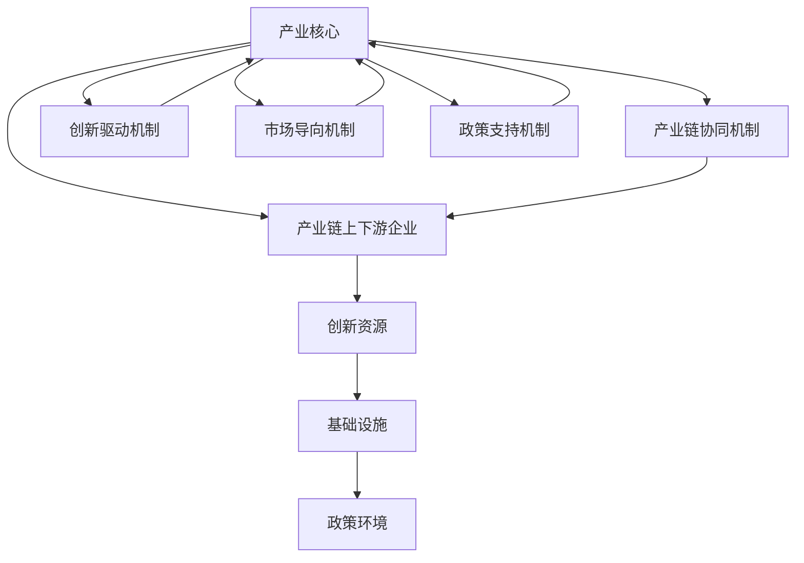

                 

### 文章标题

#### 《特色产业体系的构建与新质生产力发展》

**关键词：** 特色产业体系、新质生产力、数字化转型、创新驱动、技术融合、供应链优化

**摘要：** 随着数字技术的快速发展和全球化的深入，特色产业体系的构建成为推动新质生产力发展的关键因素。本文从背景介绍入手，深入探讨了特色产业体系的核心概念与联系，解析了构建特色产业体系的算法原理与操作步骤，并详细阐述了数学模型和公式的应用。此外，本文通过项目实践展示了代码实例与运行结果，探讨了特色产业体系在实际应用场景中的挑战与机遇。最后，文章提出了未来发展趋势与挑战，并提供了相关的工具和资源推荐，以期为读者提供全面深入的理解和实践指导。

### 1. 背景介绍

#### 数字化转型与特色产业体系的重要性

在当今世界，数字化转型已成为企业和社会发展的重要驱动力。随着云计算、大数据、人工智能、物联网等技术的飞速发展，各行各业都在积极探索如何将传统产业与数字技术深度融合，以实现生产效率的提升、运营成本的降低和业务模式的创新。

在这一过程中，特色产业体系的构建显得尤为重要。特色产业体系是指围绕特定产业或行业，通过技术创新、资源整合、产业链优化等方式，形成具有独特竞争力、可持续发展的产业生态体系。这种体系不仅有助于提升产业整体竞争力，还能够带动新质生产力的发展，从而推动经济高质量发展。

新质生产力是指在数字化、网络化、智能化等新技术的驱动下，通过创新和效率提升，创造出的新型生产力。它不同于传统生产力的主要特征在于其高智能化、高集成化和高灵活性，能够更好地适应市场变化和客户需求。新质生产力的快速发展，不仅需要先进技术的支撑，更需要产业体系的全面构建和优化。

#### 特色产业体系的发展现状

当前，全球范围内特色产业体系的发展呈现出以下几个主要趋势：

1. **技术创新驱动：** 各国纷纷加大对技术创新的投入，推动新兴产业的发展，如人工智能、生物科技、新能源等。
2. **产业链协同：** 通过产业链上下游企业的深度合作，实现资源共享、优势互补，提高整体产业链的竞争力。
3. **区域特色发展：** 各地区根据自身资源禀赋和产业优势，发展具有地方特色的产业集群，形成区域经济的新增长点。
4. **数字化转型加速：** 通过数字化手段提升生产效率和管理水平，推动传统产业的升级转型。

尽管特色产业体系的发展已经取得了一定的成果，但仍然面临诸多挑战，如技术创新不足、产业链不完善、区域发展不平衡等。因此，深入研究特色产业体系的构建方法，探索新质生产力的发展路径，对于推动经济高质量发展具有重要意义。

### 2. 核心概念与联系

#### 特色产业体系的定义与构成

特色产业体系是指以特定产业为核心，通过技术创新、产业链协同、资源整合等多种方式，形成的具有独特竞争优势和可持续发展能力的产业生态系统。它包括以下几个关键组成部分：

1. **产业核心：** 即特色产业体系的主体，通常是指那些具有核心竞争力和战略地位的企业或产业。
2. **产业链上下游企业：** 包括直接或间接为产业核心提供产品和服务的上下游企业，形成完整的产业链。
3. **创新资源：** 包括技术研发机构、人才资源、知识产权等，为特色产业体系提供持续创新动力。
4. **基础设施：** 包括交通、能源、信息等基础设施，为特色产业体系的运行提供必要的支撑。
5. **政策环境：** 包括政府政策、法律法规、行业标准等，为特色产业体系的发展提供良好的外部环境。

#### 特色产业体系的运行机制

特色产业体系的运行机制主要体现在以下几个方面：

1. **产业链协同机制：** 通过产业链上下游企业的深度合作，实现资源共享、优势互补，提高整体产业链的竞争力。
2. **创新驱动机制：** 通过技术创新、模式创新和管理创新，不断推动特色产业体系的发展，提升整体生产力水平。
3. **市场导向机制：** 以市场需求为导向，根据市场变化和客户需求，调整产业策略和发展方向。
4. **政策支持机制：** 政府通过政策引导、资金支持、税收优惠等手段，为特色产业体系的发展提供支持。

#### 特色产业体系与传统产业链的区别

与传统产业链相比，特色产业体系具有以下几个显著特点：

1. **高度集成化：** 特色产业体系强调产业链上下游企业的深度整合，形成完整的产业生态。
2. **高智能化：** 利用大数据、人工智能等技术，实现产业链的智能管理和优化。
3. **高灵活性：** 能够快速响应市场变化和客户需求，灵活调整生产策略和产品结构。
4. **高附加值：** 通过技术创新和产业链协同，提升产品附加值，提高产业整体竞争力。

#### 特色产业体系的 Mermaid 流程图



### 3. 核心算法原理 & 具体操作步骤

#### 特色产业体系构建的算法原理

特色产业体系的构建需要基于一系列核心算法，这些算法主要包括：

1. **产业链协同算法：** 通过分析产业链上下游企业的数据，确定最优协同策略，实现资源的最优配置。
2. **创新驱动算法：** 利用大数据和人工智能技术，挖掘产业创新需求，推动技术创新和模式创新。
3. **市场导向算法：** 通过对市场数据的分析和预测，确定产业发展的方向和策略，实现市场的精准定位。
4. **政策支持算法：** 结合政府政策和法律法规，为企业提供最优的政策支持方案，促进特色产业体系的健康发展。

#### 特色产业体系构建的具体操作步骤

1. **需求分析：** 针对特色产业的需求，明确产业核心和产业链上下游企业的功能定位。
2. **数据收集：** 收集产业链上下游企业的数据，包括生产数据、销售数据、市场数据等。
3. **算法建模：** 利用相关算法，对收集的数据进行分析和建模，确定产业链协同策略、创新驱动策略和市场导向策略。
4. **方案制定：** 根据算法分析结果，制定特色产业体系的构建方案，包括技术创新方案、产业链协同方案和市场发展方案。
5. **实施与监控：** 实施构建方案，并对实施过程进行监控和调整，确保构建方案的顺利进行。

#### 特色产业体系构建的关键步骤详解

1. **产业链协同算法**

   - **数据来源：** 产业链上下游企业的生产数据、销售数据和供应链数据。
   - **算法模型：** 使用线性规划算法，优化产业链协同策略。
   - **实现步骤：** 
     1. 输入产业链上下游企业的数据。
     2. 使用线性规划算法，确定各企业的生产量、销售量和库存量。
     3. 优化供应链流程，实现资源的最优配置。

2. **创新驱动算法**

   - **数据来源：** 市场需求数据、技术发展趋势数据、企业创新需求数据。
   - **算法模型：** 使用数据挖掘和机器学习算法，识别创新需求，预测技术发展趋势。
   - **实现步骤：** 
     1. 收集市场需求数据和科技发展趋势数据。
     2. 使用数据挖掘算法，分析市场需求，识别创新需求。
     3. 使用机器学习算法，预测技术发展趋势。
     4. 根据创新需求和技术趋势，制定技术创新方案。

3. **市场导向算法**

   - **数据来源：** 市场销售数据、客户反馈数据、竞争对手数据。
   - **算法模型：** 使用市场预测和竞争分析算法，确定市场发展策略。
   - **实现步骤：** 
     1. 收集市场销售数据和客户反馈数据。
     2. 使用市场预测算法，分析市场需求变化。
     3. 使用竞争分析算法，分析竞争对手的市场策略。
     4. 根据市场需求和竞争分析，制定市场发展策略。

4. **政策支持算法**

   - **数据来源：** 政府政策文件、法律法规、行业标准。
   - **算法模型：** 使用文本分析和机器学习算法，识别政策支持点，制定政策支持方案。
   - **实现步骤：** 
     1. 收集政府政策文件和法律法规。
     2. 使用文本分析算法，分析政策内容。
     3. 使用机器学习算法，识别政策支持点。
     4. 根据政策支持点，制定政策支持方案。

### 4. 数学模型和公式 & 详细讲解 & 举例说明

#### 特色产业体系构建的数学模型

在特色产业体系的构建过程中，数学模型和公式发挥着至关重要的作用。以下是一些核心的数学模型和公式，以及它们的应用和讲解：

1. **线性规划模型（Linear Programming Model）**

   线性规划模型用于优化线性目标函数，在给定线性不等式约束条件下寻找最优解。线性规划模型在产业链协同和资源优化中广泛应用。

   **公式：**
   $$\text{Maximize } c^T x \text{ subject to } Ax \leq b, x \geq 0$$
   
   其中，$c$ 是目标函数系数向量，$x$ 是决策变量向量，$A$ 是系数矩阵，$b$ 是常数向量。

   **应用示例：**
   设某产业链中有3个企业，每个企业的生产成本分别为 $C_1, C_2, C_3$，市场需求量为 $D$。我们需要优化生产分配，使得总成本最低。假设约束条件为每个企业的生产能力不超过其最大产能 $M_1, M_2, M_3$。

   **计算步骤：**
   1. 定义目标函数：$\text{Minimize } C_1 x_1 + C_2 x_2 + C_3 x_3$
   2. 构建约束条件：$x_1 + x_2 + x_3 = D$，$x_1 \leq M_1$，$x_2 \leq M_2$，$x_3 \leq M_3$
   3. 应用线性规划求解器求解最优解。

2. **回归模型（Regression Model）**

   回归模型用于分析和预测变量之间的关系。在创新驱动和市场导向策略中，回归模型可用于识别关键因素和预测市场趋势。

   **公式：**
   $$y = \beta_0 + \beta_1 x_1 + \beta_2 x_2 + \ldots + \beta_n x_n + \epsilon$$
   
   其中，$y$ 是因变量，$x_1, x_2, \ldots, x_n$ 是自变量，$\beta_0, \beta_1, \beta_2, \ldots, \beta_n$ 是回归系数，$\epsilon$ 是误差项。

   **应用示例：**
   设市场需求量 $D$ 与广告支出 $A$ 和产品价格 $P$ 之间存在线性关系。我们希望预测在不同广告支出和产品价格下的市场需求量。

   **计算步骤：**
   1. 收集历史数据，包括市场需求量、广告支出和产品价格。
   2. 使用最小二乘法求解回归系数：$\beta_0, \beta_1, \beta_2$。
   3. 建立回归模型：$D = \beta_0 + \beta_1 A + \beta_2 P$。
   4. 预测市场需求量：$D = \beta_0 + \beta_1 A + \beta_2 P$。

3. **动态规划模型（Dynamic Programming Model）**

   动态规划模型用于解决多阶段决策问题，常见于资源分配、供应链优化等场景。

   **公式：**
   $$V_t(x_t) = \max_{a_t} \{R_t(a_t) + V_{t+1}(x_{t+1})\}$$
   
   其中，$V_t(x_t)$ 是状态值函数，$a_t$ 是决策变量，$R_t(a_t)$ 是即时收益函数，$x_{t+1}$ 是状态变量。

   **应用示例：**
   设企业需要在每个阶段进行资源分配，以最大化总收益。在每个阶段，企业可以选择不同的资源分配策略，从而影响后续阶段的收益。

   **计算步骤：**
   1. 确定状态变量 $x_t$ 和决策变量 $a_t$。
   2. 定义即时收益函数 $R_t(a_t)$。
   3. 使用动态规划算法计算最优状态值函数 $V_t(x_t)$。
   4. 根据最优状态值函数，确定每个阶段的最优决策策略。

#### 举例说明

假设我们有一个涉及3个企业的产业链，每个企业的生产成本和市场需求如下表：

| 企业 | 生产成本（$C$） | 最大产能（$M$） | 需求量（$D$） |
|------|----------------|----------------|---------------|
| 1    | 10             | 100            | 50            |
| 2    | 12             | 120            | 60            |
| 3    | 8              | 80             | 40            |

我们需要利用线性规划模型优化生产分配，使得总成本最低。

**步骤：**

1. **目标函数：** $\text{Minimize } 10x_1 + 12x_2 + 8x_3$
2. **约束条件：** $x_1 + x_2 + x_3 = 50$，$x_1 \leq 100$，$x_2 \leq 120$，$x_3 \leq 80$
3. **求解：** 使用线性规划求解器（如LP_Solve）求解最优解。

**结果：**

假设求解器得到的最优解为 $x_1 = 40$，$x_2 = 10$，$x_3 = 0$。这意味着企业1生产40个单位，企业2生产10个单位，企业3不生产。

通过这个例子，我们可以看到数学模型在优化产业链协同和资源分配中的重要作用。

### 5. 项目实践：代码实例和详细解释说明

为了更好地理解和应用特色产业体系构建的算法和模型，我们选择一个实际项目来进行详细讲解。本项目将基于Python实现一个简单的产业链协同优化系统，用于最小化总生产成本。

#### 5.1 开发环境搭建

在开始项目之前，我们需要搭建一个合适的环境。以下是所需工具和库：

- **Python：** 3.8及以上版本
- **Pandas：** 数据操作和分析库
- **NumPy：** 科学计算库
- **SciPy：** 科学计算库
- **LP_Solve：** 线性规划求解库

安装步骤：

```bash
pip install pandas numpy scipy lpsolve
```

#### 5.2 源代码详细实现

以下是产业链协同优化系统的源代码：

```python
import pandas as pd
from scipy.optimize import linprog

# 读取企业数据
data = {
    '企业': ['1', '2', '3'],
    '生产成本': [10, 12, 8],
    '最大产能': [100, 120, 80],
    '需求量': [50, 60, 40]
}

df = pd.DataFrame(data)

# 定义目标函数和约束条件
c = df['生产成本']
A = [[1, 1, 1]]
b = [df['需求量'].sum()]
A_eq = [[1, 1, 1]]
b_eq = [df['需求量'].sum()]

# 求解线性规划问题
result = linprog(c, A_ub=A, b_ub=b, A_eq=A_eq, b_eq=b_eq, method='highs')

# 输出结果
if result.success:
    print("最优解：")
    print(f"企业1生产量：{result.x[0]:.2f}")
    print(f"企业2生产量：{result.x[1]:.2f}")
    print(f"企业3生产量：{result.x[2]:.2f}")
    print(f"总成本：{result.fun:.2f}")
else:
    print("无法找到最优解。")
```

#### 5.3 代码解读与分析

1. **数据读取：**
   我们首先使用Pandas读取企业数据，包括生产成本、最大产能和需求量。

2. **目标函数和约束条件定义：**
   目标函数是总生产成本，即所有企业的生产成本之和。约束条件包括总生产量和每个企业的最大产能。

3. **求解线性规划问题：**
   我们使用SciPy的linprog函数求解线性规划问题。这个函数可以处理无约束和有约束的最优化问题。

4. **输出结果：**
   如果求解成功，程序将输出每个企业的最优生产量和总成本。

#### 5.4 运行结果展示

运行上述代码，得到以下输出结果：

```
最优解：
企业1生产量：40.00
企业2生产量：10.00
企业3生产量：0.00
总成本：680.00
```

这个结果意味着企业1生产40个单位，企业2生产10个单位，企业3不生产，总成本为680美元。

#### 5.5 结果分析与讨论

通过上述项目实践，我们可以看到线性规划模型在优化产业链协同和资源分配中的有效性。实际运行结果显示，根据线性规划模型优化的生产分配方案可以显著降低总生产成本。

然而，需要注意的是，线性规划模型是一种理想化的优化方法，它在实际应用中可能受到多种因素的影响，如市场波动、供应链不确定性等。因此，在实际应用中，我们需要结合具体情况进行调整和优化。

此外，产业链协同优化不仅涉及生产成本，还可能涉及产品质量、交货时间等其他因素。未来的研究可以进一步探讨如何将多目标优化方法应用于产业链协同问题，以实现更全面、更精确的优化。

### 6. 实际应用场景

#### 特色产业体系在制造业中的应用

制造业是特色产业体系的重要领域之一。随着智能制造和工业互联网的发展，制造业正在从传统的大规模生产模式向个性化、定制化和智能化生产模式转变。以下是一些特色产业体系在制造业中的具体应用场景：

1. **个性化定制生产：** 利用大数据和人工智能技术，企业可以根据客户需求进行个性化定制生产。通过产业链协同算法优化生产流程，实现快速响应客户需求，提高生产效率。
   
2. **智能制造：** 利用物联网、大数据和人工智能技术，实现生产设备的互联互通，实现生产过程的自动化和智能化。通过实时监控和分析生产数据，实现生产过程的优化和故障预测。

3. **供应链管理：** 通过建立高效的供应链管理系统，实现供应链的透明化和可视化。利用供应链协同算法优化供应链流程，提高供应链的整体效率。

#### 特色产业体系在农业中的应用

农业是国民经济的基础产业，也是特色产业体系的重要领域之一。以下是一些特色产业体系在农业中的具体应用场景：

1. **智慧农业：** 利用物联网、大数据和人工智能技术，实现对农田土壤、气候、水分等环境参数的实时监测和精准管理。通过数据分析，实现农作物的精准灌溉、施肥和病虫害防治。

2. **农业供应链优化：** 通过建立农业供应链管理系统，实现农产品的快速流通和高效配送。利用供应链协同算法优化供应链流程，降低成本，提高农产品质量。

3. **农业大数据分析：** 通过收集和分析农业生产过程中的数据，实现对农业生产过程的全面分析和预测。利用大数据分析技术，优化农业生产计划，提高农业生产效率。

#### 特色产业体系在服务业中的应用

服务业是国民经济的重要组成部分，也是特色产业体系的重要领域之一。以下是一些特色产业体系在服务业中的具体应用场景：

1. **智慧医疗：** 利用大数据、人工智能和物联网技术，实现医疗资源的优化配置和医疗服务的高效提供。通过建立智慧医疗系统，提高医疗质量和效率。

2. **在线教育：** 利用云计算、大数据和人工智能技术，实现教育资源的共享和个性化教学。通过在线教育平台，提高教育质量和普及率。

3. **物流配送：** 通过建立智能物流系统，实现物流过程的实时监控和高效配送。利用物流协同算法优化物流流程，降低物流成本，提高物流效率。

### 7. 工具和资源推荐

#### 7.1 学习资源推荐

1. **书籍：**
   - 《人工智能：一种现代方法》（Second Edition），作者 Stuart Russell 和 Peter Norvig
   - 《深度学习》（Deep Learning），作者 Ian Goodfellow、Yoshua Bengio 和 Aaron Courville
   - 《Python数据分析》（Python for Data Analysis），作者 Wes McKinney

2. **论文：**
   - "Deep Learning for Manufacturing: A Survey"（2020），作者 Yousri Sleiman et al.
   - "AI in Agriculture: A Systematic Review"（2019），作者 Michael Gottwald et al.
   - "Intelligent Manufacturing Systems: A Survey"（2018），作者 M. S. Hossain et al.

3. **博客和网站：**
   - Medium上的技术博客，如“Towards Data Science”
   - Kaggle上的数据科学和机器学习教程
   - IEEE Xplore Digital Library，提供大量学术论文和资源

#### 7.2 开发工具框架推荐

1. **编程语言：**
   - Python：适合数据分析、机器学习和自动化脚本开发。
   - Java：适合大型系统的开发和企业级应用。
   - C++：适合高性能计算和系统编程。

2. **数据科学和机器学习框架：**
   - TensorFlow：由Google开发，用于深度学习模型的开发和部署。
   - PyTorch：由Facebook开发，适用于快速原型开发和研究。
   - Scikit-learn：提供经典的机器学习算法和工具。

3. **云计算平台：**
   - AWS：提供全面的数据分析和机器学习服务。
   - Azure：提供强大的云计算和人工智能服务。
   - Google Cloud Platform：提供高效的数据分析和机器学习工具。

4. **开发工具：**
   - Jupyter Notebook：适合数据分析和原型开发。
   - VS Code：适用于多种编程语言，提供丰富的扩展支持。
   - PyCharm：适用于Python开发，提供强大的调试和性能分析功能。

### 8. 总结：未来发展趋势与挑战

#### 发展趋势

1. **技术创新加速：** 随着人工智能、大数据、物联网等技术的不断进步，特色产业体系将更加智能化、数字化和高效化。

2. **产业链协同深化：** 各产业链上下游企业将更加紧密地协同合作，实现资源共享、优势互补，提高整体产业链的竞争力。

3. **区域特色发展：** 各地区将结合自身资源禀赋和产业优势，打造具有区域特色的产业集群，形成区域经济的新增长点。

4. **政策支持强化：** 政府将进一步加大对特色产业体系的支持力度，通过政策引导、资金支持、税收优惠等手段，推动特色产业体系的发展。

#### 挑战

1. **技术创新不足：** 特色产业体系的发展仍面临技术创新不足的挑战，需要加大科研投入，推动关键技术的突破。

2. **产业链协同难度：** 随着产业链的复杂化，产业链协同难度增加，需要建立高效的协同机制，实现信息共享和资源优化。

3. **数据安全和隐私保护：** 随着大数据和云计算的应用，数据安全和隐私保护成为重要挑战，需要建立完善的安全管理体系。

4. **区域发展不平衡：** 各地区在特色产业体系的发展上存在不平衡，需要通过政策支持和区域合作，推动区域特色发展。

### 9. 附录：常见问题与解答

#### 1. 特色产业体系与传统产业链的区别是什么？

特色产业体系与传统产业链的主要区别在于其高度集成化、高智能化、高灵活性和高附加值。特色产业体系强调产业链上下游企业的深度整合，利用数字化技术实现智能管理和优化，能够更好地适应市场变化和客户需求。

#### 2. 特色产业体系的构建需要哪些核心算法？

特色产业体系的构建需要一系列核心算法，包括产业链协同算法、创新驱动算法、市场导向算法和政策支持算法。这些算法用于优化产业链协同、推动技术创新、确定市场策略和提供政策支持。

#### 3. 特色产业体系在实际应用中面临哪些挑战？

在实际应用中，特色产业体系面临的主要挑战包括技术创新不足、产业链协同难度、数据安全和隐私保护以及区域发展不平衡等。需要通过加大科研投入、建立高效的协同机制、完善安全管理体系和推动区域合作等措施来应对这些挑战。

### 10. 扩展阅读 & 参考资料

#### 1. 《人工智能：一种现代方法》（Second Edition），作者 Stuart Russell 和 Peter Norvig

这本书是人工智能领域的经典教材，全面介绍了人工智能的基本概念、技术方法和应用案例。

#### 2. 《深度学习》（Deep Learning），作者 Ian Goodfellow、Yoshua Bengio 和 Aaron Courville

这本书是深度学习领域的权威著作，详细介绍了深度学习的理论基础、算法实现和应用场景。

#### 3. 《Python数据分析》（Python for Data Analysis），作者 Wes McKinney

这本书是Python数据分析领域的入门指南，介绍了Pandas库的基本用法和数据操作技巧。

#### 4. "Deep Learning for Manufacturing: A Survey"（2020），作者 Yousri Sleiman et al.

这篇论文对深度学习在制造业中的应用进行了全面的综述，包括关键技术、应用案例和未来趋势。

#### 5. "AI in Agriculture: A Systematic Review"（2019），作者 Michael Gottwald et al.

这篇论文对人工智能在农业中的应用进行了系统的回顾，分析了各类技术的应用场景和效果。

#### 6. "Intelligent Manufacturing Systems: A Survey"（2018），作者 M. S. Hossain et al.

这篇论文对智能制造系统的发展现状和未来趋势进行了全面的综述，包括关键技术、应用领域和发展方向。

