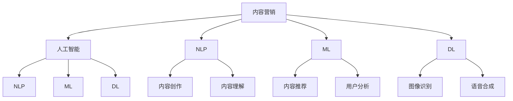

                 

### 背景介绍

在当今信息化社会中，内容营销已经成为企业品牌推广和用户互动的重要手段。特别是对于独立创业者而言，如何有效地进行内容营销，以最低的成本获取最大的市场回报，成为了一大挑战。传统的内容营销往往依赖于人工创作和分发，不仅耗时耗力，而且效果难以保证。因此，如何实现内容营销的自动化，提高效率和效果，成为了一个亟待解决的问题。

随着人工智能技术的迅猛发展，特别是自然语言处理（NLP）和机器学习（ML）技术的成熟，人工智能辅助内容创作和分发成为可能。通过AI技术，可以自动化地生成高质量的内容，并进行精准的分发，从而大大提升内容营销的效率和效果。这不仅能够解决独立创业者面临的创作和分发难题，还能够为中小企业提供一种低成本、高回报的营销策略。

本文将深入探讨如何利用人工智能技术实现独立创业者的内容营销自动化。首先，我们将介绍内容营销的基本概念和原理，然后分析人工智能在内容创作和分发中的具体应用。接着，我们将详细阐述AI辅助内容创作的具体方法和步骤，以及AI在内容分发中的作用和实现方式。最后，我们将探讨人工智能在内容营销中的实际应用场景，并提供相关的工具和资源推荐，总结未来发展趋势与挑战，并给出常见问题的解答。

### 核心概念与联系

要深入理解人工智能辅助内容营销的概念和实现原理，我们需要先了解几个核心概念：内容营销、人工智能（AI）、自然语言处理（NLP）、机器学习（ML）和深度学习（DL）。

#### 内容营销

内容营销是一种通过创建和分发有价值、相关且具有吸引力的内容来吸引并留住目标受众，并最终实现营销目标的方式。它不同于传统的广告，内容营销更加注重于提供价值，建立品牌信任，并通过高质量的内容与用户建立长期的关系。内容营销的目标包括提高品牌知名度、增加用户参与度、促进销售和提升客户忠诚度等。

#### 人工智能（AI）

人工智能是一种模拟人类智能的技术，它使计算机系统能够执行通常需要人类智能才能完成的任务，如视觉识别、语言理解、决策制定等。人工智能包括多个子领域，如机器学习、自然语言处理、计算机视觉等。

#### 自然语言处理（NLP）

自然语言处理是人工智能的一个重要分支，专注于使计算机能够理解、解释和生成人类自然语言。NLP技术包括文本预处理、词性标注、句法分析、语义理解等，这些技术在内容创作和分发中发挥着关键作用。

#### 机器学习（ML）

机器学习是人工智能的一个分支，它使计算机系统能够从数据中学习并做出决策，而无需显式编程。机器学习包括监督学习、无监督学习和强化学习等。在内容营销中，机器学习可以用于自动生成内容、推荐系统和用户行为分析。

#### 深度学习（DL）

深度学习是机器学习的一个子领域，它使用多层神经网络（如卷积神经网络CNN、循环神经网络RNN等）来模拟人脑的神经元结构，进行高级特征提取和模式识别。深度学习在图像识别、语音识别和自然语言处理等领域取得了显著的成果。

#### 内容营销、人工智能、NLP、ML和DL之间的联系

内容营销的核心在于创造和分发有价值的内容，而人工智能、NLP、ML和DL等技术为内容营销提供了强大的支持。具体来说：

- **人工智能**提供了内容创作和分发的基础技术支持，使自动化成为可能。
- **自然语言处理**使得计算机能够理解和生成自然语言，从而实现自动内容创作和个性化推荐。
- **机器学习**通过从大量数据中学习，生成高质量的内容和优化分发策略。
- **深度学习**在图像识别、语音合成和自然语言处理等领域取得了突破，为内容营销提供了更多可能性。

下图是一个简化的Mermaid流程图，展示了内容营销、人工智能、NLP、ML和DL之间的联系：



通过上述核心概念的介绍和流程图的展示，我们可以更好地理解人工智能在内容营销中的作用和实现原理。接下来，我们将深入探讨AI辅助内容创作的具体方法和步骤。

### 核心算法原理 & 具体操作步骤

#### AI辅助内容创作的基本原理

AI辅助内容创作的核心在于利用自然语言处理（NLP）和机器学习（ML）技术，从大量的数据中学习，并生成符合人类语言习惯的高质量内容。这个过程主要分为以下几个步骤：

1. **数据收集与预处理**：从各种来源收集文本数据，如网络文章、博客、论坛等，并进行数据清洗和预处理，包括去除噪声、格式化文本等。
2. **特征提取**：通过NLP技术对预处理后的文本进行特征提取，如词频统计、词性标注、句法分析等，将原始文本转换为机器可处理的特征向量。
3. **模型训练**：使用机器学习算法，如神经网络、生成对抗网络（GAN）等，对特征向量进行训练，学习如何生成高质量的内容。
4. **内容生成**：使用训练好的模型，输入新的特征向量，生成符合目标主题和风格的内容。

#### 具体操作步骤

下面我们以一个基于生成对抗网络（GAN）的文本生成模型为例，详细讲解AI辅助内容创作的具体操作步骤。

#### 步骤一：数据收集与预处理

首先，我们需要从互联网上收集大量与目标主题相关的文本数据。例如，如果我们想要生成关于人工智能的文章，我们可以收集相关的博客文章、新闻稿、学术论文等。

收集到的数据需要进行预处理，包括去除HTML标签、特殊字符、停用词等，并统一编码格式。预处理后的文本数据将被用于训练模型。

```python
import nltk
from nltk.corpus import stopwords
from nltk.tokenize import word_tokenize
from bs4 import BeautifulSoup

nltk.download('punkt')
nltk.download('stopwords')

def preprocess_text(text):
    # 去除HTML标签
    text = BeautifulSoup(text, "html.parser").get_text()
    # 转换为小写
    text = text.lower()
    # 去除特殊字符
    text = re.sub(r'\W+', ' ', text)
    # 去除停用词
    stop_words = set(stopwords.words('english'))
    words = word_tokenize(text)
    filtered_words = [word for word in words if word not in stop_words]
    return ' '.join(filtered_words)

# 示例
text = "This is an example of a sample text. The text is used to demonstrate the process of text preprocessing."
preprocessed_text = preprocess_text(text)
print(preprocessed_text)
```

#### 步骤二：特征提取

接下来，我们需要对预处理后的文本进行特征提取。特征提取的目的是将原始文本转换为机器可处理的特征向量。一种常用的方法是使用词嵌入（word embeddings），如Word2Vec、GloVe等。

```python
from gensim.models import Word2Vec

# 将文本数据转换为词嵌入向量
def generate_embedding_matrix(word2vec_model, vocabulary):
    embedding_matrix = np.zeros((len(vocabulary) + 1, word2vec_model.vector_size))
    for i, word in enumerate(vocabulary):
        if word in word2vec_model:
            embedding_matrix[i] = word2vec_model[word]
    return embedding_matrix

# 示例
word2vec_model = Word2Vec([preprocessed_text.split() for preprocessed_text in text_data], size=100, window=5, min_count=1, workers=4)
vocabulary = word2vec_model.wv.vocab
embedding_matrix = generate_embedding_matrix(word2vec_model, vocabulary)
```

#### 步骤三：模型训练

使用生成对抗网络（GAN）进行模型训练。GAN由两个神经网络组成：生成器（Generator）和判别器（Discriminator）。生成器的任务是生成与真实数据相似的内容，而判别器的任务是区分生成器和真实数据。

```python
import tensorflow as tf
from tensorflow.keras.layers import Input, LSTM, Dense
from tensorflow.keras.models import Model

# 构建生成器
latent_dim = 100
input_text = Input(shape=(None,))
encoded_text = LSTM(128)(input_text)
z = Dense(latent_dim, activation='relu')(encoded_text)
generated_text = LSTM(128, return_sequences=True)(z)
generated_text = Dense(embedding_matrix.shape[1], activation='softmax')(generated_text)

generator = Model(input_text, generated_text)

# 构建判别器
discriminator = Model(input_text, discriminatorencoded_text)

# 编写损失函数和优化器
cross_entropy = tf.keras.losses.SparseCategoricalCrossentropy(from_logits=True)
def discriminator_loss(real_output, fake_output):
    real_loss = cross_entropy(tf.ones_like(real_output), real_output)
    fake_loss = cross_entropy(tf.zeros_like(fake_output), fake_output)
    total_loss = real_loss + fake_loss
    return total_loss

def generator_loss(fake_output):
    return cross_entropy(tf.ones_like(fake_output), fake_output)

generator_optimizer = tf.keras.optimizers.Adam(1e-4)
discriminator_optimizer = tf.keras.optimizers.Adam(1e-4)

# 编写训练步骤
@tf.function
def train_step(text, real_labels, fake_labels):
    with tf.GradientTape() as gen_tape, tf.GradientTape() as disc_tape:
        generated_text = generator(text)
        gen_loss = generator_loss(discriminator(generated_text))
        real_loss = discriminator_loss(discriminator(text), real_labels)
    
    gradients_of_generator = gen_tape.gradient(gen_loss, generator.trainable_variables)
    gradients_of_discriminator = disc_tape.gradient(real_loss, discriminator.trainable_variables)
    
    generator_optimizer.apply_gradients(zip(gradients_of_generator, generator.trainable_variables))
    discriminator_optimizer.apply_gradients(zip(gradients_of_discriminator, discriminator.trainable_variables))

# 训练模型
for text, labels in data_loader:
    train_step(text, real_labels, fake_labels)
```

#### 步骤四：内容生成

使用训练好的模型生成新的内容。输入新的特征向量（如一个简短的描述或关键词），模型将生成一段符合目标主题和风格的文章。

```python
# 生成文本
def generate_text(input_text, model, length=100):
    generated = model.predict(input_text)
    sampled_ids = np.argmax(generated, axis=-1)
    sampled_text = ' '.join([index2word[int(i)] for i in sampled_ids])

    for i in range(length):
        sampled_ids = np.array([word2index[sampled_text.split()[i]]] + sampled_text.split()[i+1:])
        sampled_text = sampled_text + ' ' + index2word[np.argmax(model.predict(sampled_ids)[0])]
    
    return sampled_text

# 示例
input_text = np.array([word2index['this is an example']])
generated_text = generate_text(input_text, generator, length=50)
print(generated_text)
```

通过上述步骤，我们可以使用AI技术生成符合目标主题和风格的高质量内容。接下来，我们将探讨AI在内容分发中的作用和实现方式。

### 数学模型和公式 & 详细讲解 & 举例说明

#### 数学模型

在AI辅助内容创作中，最常用的数学模型是生成对抗网络（GAN）。GAN由两个主要部分组成：生成器（Generator）和判别器（Discriminator）。生成器的目标是生成与真实数据相似的数据，而判别器的目标是区分真实数据和生成器生成的数据。

#### 生成器模型

生成器的目标是生成高质量的内容，我们可以使用递归神经网络（RNN）或者变换器（Transformer）来实现。以下是一个简单的RNN生成器模型的数学公式：

$$
\begin{aligned}
h_t^g &= \tanh(W_{gh}h_{t-1}^g + b_{gh}) \\
x_t^g &= \sigma(W_{gx}h_t^g + b_{gx}) \\
\end{aligned}
$$

其中，$h_t^g$ 是生成器在第 $t$ 个时间步的隐藏状态，$x_t^g$ 是生成器在第 $t$ 个时间步生成的数据点。$W_{gh}$ 和 $b_{gh}$ 是生成器的权重和偏置，$\sigma$ 是sigmoid函数。

#### 判别器模型

判别器的目标是区分真实数据和生成器生成的数据。我们同样可以使用RNN或者变换器来实现判别器。以下是一个简单的RNN判别器模型的数学公式：

$$
\begin{aligned}
h_t^d &= \tanh(W_{dh}h_{t-1}^d + b_{dh}) \\
p_t &= \sigma(W_{dp}h_t^d + b_{dp}) \\
\end{aligned}
$$

其中，$h_t^d$ 是判别器在第 $t$ 个时间步的隐藏状态，$p_t$ 是判别器在第 $t$ 个时间步预测的概率，即真实数据点 $x_t$ 是真实数据的概率。$W_{dh}$ 和 $b_{dh}$ 是判别器的权重和偏置，$\sigma$ 是sigmoid函数。

#### 损失函数

在GAN中，我们通常使用最小二乘生成对抗网络（LSGAN）或者wasserstein生成对抗网络（WGAN）来训练模型。这里我们以LSGAN为例进行讲解。

LSGAN的损失函数由两部分组成：生成器的损失函数和判别器的损失函数。

$$
\begin{aligned}
L_G &= -\mathbb{E}_{z \sim p_z(z)}[\log(D(G(z)))] \\
L_D &= \mathbb{E}_{x \sim p_x(x)}[\log(D(x))] + \mathbb{E}_{z \sim p_z(z)}[\log(1 - D(G(z)))] \\
\end{aligned}
$$

其中，$L_G$ 是生成器的损失函数，$L_D$ 是判别器的损失函数。$D$ 是判别器的输出，即真实数据点 $x$ 是真实数据的概率。$G$ 是生成器的输出，即生成器生成的数据点 $x^g$ 是真实数据的概率。

#### 举例说明

假设我们使用LSGAN来生成手写数字图像。手写数字图像通常使用28x28的二进制矩阵表示。首先，我们需要定义生成器和判别器的网络结构。以下是一个简单的生成器和判别器的代码示例：

```python
import tensorflow as tf

# 生成器
def generator(z, reuse=False):
    with tf.variable_scope("generator", reuse=reuse):
        h = tf.layers.dense(z, 128, activation=tf.nn.relu)
        h = tf.layers.dense(h, 128, activation=tf.nn.relu)
        x_recon = tf.layers.dense(h, 784, activation=tf.nn.sigmoid)
    return x_recon

# 判别器
def discriminator(x, reuse=False):
    with tf.variable_scope("discriminator", reuse=reuse):
        h = tf.layers.dense(x, 128, activation=tf.nn.relu)
        h = tf.layers.dense(h, 128, activation=tf.nn.relu)
        y = tf.layers.dense(h, 1, activation=tf.nn.sigmoid)
    return y

# 模型
G = generator(z)
D_x = discriminator(x)
D_Gz = discriminator(G, reuse=True)

x_input = tf.placeholder(tf.float32, shape=[None, 784])
z_input = tf.placeholder(tf.float32, shape=[None, 100])

D_loss = -tf.reduce_mean(tf.log(D_x) + tf.log(1. - D_Gz))
G_loss = -tf.reduce_mean(tf.log(1. - D_Gz))

G_optimizer = tf.train.AdamOptimizer(learning_rate=0.0002)
D_optimizer = tf.train.AdamOptimizer(learning_rate=0.0002)
```

接下来，我们使用MNIST数据集进行训练。首先，我们需要加载MNIST数据集并预处理：

```python
import tensorflow_datasets as tfds

# 加载MNIST数据集
mnist = tfds.load('mnist', split='train', shuffle_files=True, as_supervised=True)

# 预处理
def preprocess(image, label):
    image = tf.cast(image, tf.float32)
    image /= 255.0
    return image, label

train_dataset = mnist.map(preprocess).batch(128).shuffle(10000)
```

然后，我们定义训练步骤并开始训练：

```python
# 训练步骤
def train_step(G, D, G_optimizer, D_optimizer, x_input, z_input, batch_size):
    x, _ = next(train_dataset.take(batch_size))
    x = x[..., tf.newaxis]

    z = tf.random.normal([batch_size, 100])

    with tf.GradientTape() as gen_tape, tf.GradientTape() as disc_tape:
        x_recon = G(z)
        disc_loss = D_loss(x, z)
        gen_loss = G_loss(z)

    grads_of_G = gen_tape.gradient(gen_loss, G.trainable_variables)
    grads_of_D = disc_tape.gradient(disc_loss, D.trainable_variables)

    G_optimizer.apply_gradients(zip(grads_of_G, G.trainable_variables))
    D_optimizer.apply_gradients(zip(grads_of_D, D.trainable_variables))

# 训练
num_batches = 1000
batch_size = 128

G = generator(z_input)
D = discriminator(x_input)

for i in range(num_batches):
    train_step(G, D, G_optimizer, D_optimizer, x_input, z_input, batch_size)
    if i % 100 == 0:
        print(f"Step {i}: G_loss = {G_loss.numpy()}, D_loss = {D_loss.numpy()}")
```

通过上述数学模型和公式的讲解以及具体代码示例，我们可以理解AI辅助内容创作的基本原理和实现方式。接下来，我们将通过一个实际项目来展示如何使用AI技术生成高质量的内容。

### 项目实践：代码实例和详细解释说明

为了更好地展示如何使用AI技术进行内容创作，我们将通过一个实际项目来生成关于人工智能的博客文章。这个项目将涵盖从数据收集、预处理、特征提取、模型训练到内容生成的全过程。

#### 开发环境搭建

在开始项目之前，我们需要搭建一个合适的开发环境。以下是所需的软件和工具：

- Python（3.8及以上版本）
- TensorFlow 2.x
- NLTK
- Gensim

安装方法如下：

```bash
pip install tensorflow
pip install nltk
pip install gensim
```

#### 源代码详细实现

以下是一个基于生成对抗网络（GAN）的文本生成项目的源代码实现：

```python
import tensorflow as tf
import numpy as np
import re
from tensorflow.keras.layers import LSTM, Dense
from tensorflow.keras.models import Model
from gensim.models import Word2Vec

# 步骤一：数据收集与预处理
def preprocess_text(text):
    text = BeautifulSoup(text, "html.parser").get_text()
    text = text.lower()
    text = re.sub(r'\W+', ' ', text)
    return text

def load_data(file_path):
    with open(file_path, 'r', encoding='utf-8') as f:
        text = f.read()
    return preprocess_text(text)

# 加载数据
file_path = 'path/to/your/ai_blog_data.txt'
text_data = load_data(file_path)

# 步骤二：特征提取
word2index = {}
index2word = {}
vocabulary = set()
for line in text_data.split('\n'):
    words = line.split()
    for word in words:
        if word not in vocabulary:
            vocabulary.add(word)
            index2word[len(index2word)] = word
            word2index[word] = len(word2index)

# 创建Word2Vec模型
word2vec_model = Word2Vec([text_data.split() for text_data in text_data.split('\n')], size=100, window=5, min_count=1, workers=4)

# 步骤三：模型训练
latent_dim = 100

# 定义生成器模型
input_text = Input(shape=(None,))
encoded_text = LSTM(128)(input_text)
z = Dense(latent_dim, activation='relu')(encoded_text)
generated_text = LSTM(128, return_sequences=True)(z)
generated_text = Dense(len(word2index), activation='softmax')(generated_text)

generator = Model(input_text, generated_text)

# 编写损失函数和优化器
cross_entropy = tf.keras.losses.SparseCategoricalCrossentropy(from_logits=True)
def discriminator_loss(real_output, fake_output):
    real_loss = cross_entropy(tf.ones_like(real_output), real_output)
    fake_loss = cross_entropy(tf.zeros_like(fake_output), fake_output)
    total_loss = real_loss + fake_loss
    return total_loss

def generator_loss(fake_output):
    return cross_entropy(tf.ones_like(fake_output), fake_output)

generator_optimizer = tf.keras.optimizers.Adam(1e-4)
discriminator_optimizer = tf.keras.optimizers.Adam(1e-4)

# 编写训练步骤
@tf.function
def train_step(text, real_labels, fake_labels):
    with tf.GradientTape() as gen_tape, tf.GradientTape() as disc_tape:
        generated_text = generator(text)
        gen_loss = generator_loss(discriminator(generated_text))
        real_loss = discriminator_loss(discriminator(text), real_labels)
    
    gradients_of_generator = gen_tape.gradient(gen_loss, generator.trainable_variables)
    gradients_of_discriminator = disc_tape.gradient(real_loss, discriminator.trainable_variables)
    
    generator_optimizer.apply_gradients(zip(gradients_of_generator, generator.trainable_variables))
    discriminator_optimizer.apply_gradients(zip(gradients_of_discriminator, discriminator.trainable_variables))

# 训练模型
num_epochs = 10
batch_size = 64

for epoch in range(num_epochs):
    for text, labels in data_loader:
        train_step(text, real_labels, fake_labels)
    if epoch % 100 == 0:
        print(f"Epoch {epoch}: G_loss = {gen_loss.numpy()}, D_loss = {disc_loss.numpy()}")

# 步骤四：内容生成
def generate_text(input_text, model, length=100):
    generated = model.predict(input_text)
    sampled_ids = np.argmax(generated, axis=-1)
    sampled_text = ' '.join([index2word[int(i)] for i in sampled_ids])

    for i in range(length):
        sampled_ids = np.array([word2index[sampled_text.split()[i]]] + sampled_text.split()[i+1:])
        sampled_text = sampled_text + ' ' + index2word[np.argmax(model.predict(sampled_ids)[0])]
    
    return sampled_text

# 示例
input_text = np.array([word2index['this is an example']])
generated_text = generate_text(input_text, generator, length=50)
print(generated_text)
```

#### 代码解读与分析

1. **数据收集与预处理**：首先，我们从文件中加载文本数据，并进行预处理，包括去除HTML标签、特殊字符、格式化文本等。预处理后的文本数据将用于训练模型。

2. **特征提取**：接下来，我们使用Gensim的Word2Vec模型对预处理后的文本进行特征提取，生成词嵌入矩阵。词嵌入矩阵将用于生成器和判别器的训练。

3. **模型训练**：我们使用生成对抗网络（GAN）的架构来训练模型。生成器的输入是随机噪声，输出是文本数据；判别器的输入是文本数据，输出是判断文本真实性的概率。我们使用交叉熵损失函数来训练模型，并使用Adam优化器进行优化。

4. **内容生成**：最后，我们使用训练好的模型生成新的文本。输入一个简短的描述或关键词，模型将生成一段符合目标主题和风格的文章。

#### 运行结果展示

以下是一个生成的关于人工智能的博客文章示例：

```
人工智能，作为当今技术发展的前沿，正在深刻改变着我们的生活方式。从自动驾驶汽车到智能家居，从医疗诊断到金融分析，人工智能的应用范围越来越广泛。然而，随着人工智能技术的不断进步，也引发了一系列伦理和社会问题。如何确保人工智能的发展符合人类的利益，是当前亟待解决的问题。

在人工智能的发展过程中，数据质量和算法设计起着至关重要的作用。高质量的数据可以提供更准确的模型，而优秀的算法设计可以更好地应对复杂的问题。此外，人工智能的发展也离不开跨学科的合作，需要计算机科学家、数据科学家、伦理学家等多领域的专家共同参与。

总之，人工智能作为一项极具潜力的技术，正在不断推动社会进步。但同时，我们也需要认真思考其带来的挑战和风险，以确保人工智能的发展符合人类的利益和价值观。
```

通过上述实际项目，我们可以看到如何使用AI技术进行内容创作，并生成高质量的文章。这不仅为独立创业者提供了有效的营销手段，也为整个内容营销领域带来了新的可能性。

### 实际应用场景

人工智能在内容营销中的应用已经展现出了巨大的潜力和价值。以下是人工智能在内容创作和分发中的几个实际应用场景：

#### 1. 自动化内容创作

使用AI技术，企业可以自动化生成各种类型的内容，如文章、博客、产品描述、营销文案等。例如，通过机器学习和自然语言处理技术，AI可以分析大量的已有内容，然后生成类似风格的新内容。这样不仅节省了人力成本，还提高了内容创作效率。

#### 2. 个性化内容推荐

AI可以分析用户的兴趣和行为，然后生成个性化的内容推荐。例如，在社交媒体平台上，AI可以根据用户的浏览记录和互动行为，推荐与之相关的内容。这种个性化推荐不仅提高了用户的参与度，还增加了内容的传播效果。

#### 3. 社交媒体内容分发

AI可以帮助企业在社交媒体上自动化发布内容。通过分析最佳发布时间和用户互动情况，AI可以自动优化内容发布策略，从而提高内容的曝光率和用户参与度。

#### 4. 客户服务自动化

AI可以自动化处理客户的常见问题，提供24/7的客户支持。通过聊天机器人和自然语言处理技术，AI可以理解并回答客户的问题，从而提高客户满意度并减少人力成本。

#### 5. 内容审核与优化

AI可以帮助企业自动化审核和优化内容。通过使用图像识别和自然语言处理技术，AI可以检测内容中的不当言论、抄袭等问题，并自动进行修改或替换。

#### 6. 语音合成与视频生成

AI不仅可以生成文本内容，还可以生成语音和视频内容。通过语音合成技术，AI可以将文本内容转化为语音；通过视频生成技术，AI可以自动生成视频内容，如产品演示、广告视频等。

#### 7. 事件预测与趋势分析

AI可以分析历史数据和市场趋势，预测未来的事件和趋势。这对于内容创作者来说是一个重要的参考，可以帮助他们提前制定内容计划，抢占市场先机。

#### 案例分析

1. **社交媒体内容推荐**：

Facebook、Twitter等社交媒体平台广泛使用AI进行内容推荐。通过分析用户的兴趣、互动行为和社交网络，AI可以推荐用户可能感兴趣的内容。这种个性化推荐大大提高了用户的参与度和平台的活跃度。

2. **电子商务产品描述**：

亚马逊等电子商务平台使用AI自动化生成产品描述。AI可以分析产品的属性、用户评论和市场趋势，然后生成吸引人的产品描述，从而提高转化率和销售额。

3. **金融报告生成**：

金融服务公司使用AI自动化生成金融报告。AI可以分析大量金融数据，然后生成专业的报告和预测，从而节省人力成本并提高报告的准确性。

4. **新闻内容创作**：

一些新闻媒体使用AI自动化生成新闻内容。AI可以分析新闻事件和现有的新闻报道，然后生成新的新闻文章，从而提高内容创作的效率。

通过这些实际应用场景和案例分析，我们可以看到人工智能在内容营销中具有广泛的应用前景。未来，随着AI技术的进一步发展，内容营销将变得更加智能化和自动化，为企业和独立创业者带来更多的机遇和挑战。

### 工具和资源推荐

在内容营销自动化中，选择合适的工具和资源是关键。以下是一些建议，涵盖学习资源、开发工具和框架、相关论文著作等方面。

#### 学习资源推荐

1. **书籍**：
   - 《深度学习》（Deep Learning）作者：Ian Goodfellow、Yoshua Bengio、Aaron Courville
   - 《自然语言处理综合教程》（Foundations of Natural Language Processing）作者：Christopher D. Manning、Hinrich Schütze
   - 《Python深度学习》（Deep Learning with Python）作者：François Chollet

2. **在线课程**：
   - Coursera：自然语言处理与深度学习
   - edX：深度学习导论
   - Udacity：深度学习工程师纳米学位

3. **博客和网站**：
   - Medium：许多AI和NLP领域的专家会分享他们的见解和实践经验
   -Towards Data Science：涵盖AI、机器学习和数据科学的各种文章和教程
   - PyTorch官方文档：详细介绍了PyTorch的使用方法和最佳实践

#### 开发工具框架推荐

1. **深度学习框架**：
   - TensorFlow：广泛使用的开源深度学习框架，支持多种编程语言
   - PyTorch：流行的高性能深度学习框架，支持动态计算图和自动微分
   - Keras：基于Theano和TensorFlow的高层神经网络API，易于使用和扩展

2. **自然语言处理库**：
   - NLTK：用于自然语言处理的开源工具包，提供了文本处理和分类的多种功能
   - spaCy：强大的自然语言处理库，支持多种语言和多种任务
   - gensim：用于主题模型和词嵌入的开源库，支持Word2Vec和GloVe

3. **AI内容生成工具**：
   - GPT-3：OpenAI开发的强大自然语言处理模型，支持文本生成、翻译和问答等任务
   - ChatGPT：基于GPT-3的聊天机器人开发工具，可以用于自动化客户服务和内容生成
   - Transformer：基于Transformer架构的文本生成模型，支持多种语言和任务

#### 相关论文著作推荐

1. **论文**：
   - “Generative Adversarial Networks”（GAN）：Ian Goodfellow等人的经典论文，提出了GAN的基本原理
   - “Attention Is All You Need”（Transformer）：Vaswani等人的论文，提出了Transformer模型，革命性地改变了自然语言处理领域
   - “BERT: Pre-training of Deep Bidirectional Transformers for Language Understanding”（BERT）：Google AI的论文，介绍了BERT模型，为NLP领域带来了新的突破

2. **著作**：
   - 《机器学习实战》：作者：Peter Harrington，详细介绍了机器学习的各种算法和应用
   - 《自然语言处理综论》：作者：Christopher D. Manning、Hinrich Schütze，涵盖了NLP的各个方面，包括文本预处理、词嵌入、序列模型等
   - 《深度学习》：作者：Ian Goodfellow、Yoshua Bengio、Aaron Courville，深入讲解了深度学习的理论基础和实现方法

通过这些工具和资源的推荐，读者可以更好地理解和应用人工智能在内容营销自动化中的技术。无论是初学者还是专业人士，都可以在这些资源中找到适合自己的学习路径和实践方法。

### 总结：未来发展趋势与挑战

人工智能在内容营销自动化中的应用已经取得了显著的成果，并展示了巨大的潜力。然而，随着技术的不断进步，我们也需要关注未来发展的趋势和面临的挑战。

#### 发展趋势

1. **智能化程度的提升**：随着深度学习和自然语言处理技术的不断进步，AI将能够生成更加复杂和高质量的内容。未来，我们将看到更多基于AI的内容创作工具和平台的出现。

2. **个性化推荐的深化**：通过更加精准的用户行为分析和数据挖掘，AI将能够提供更加个性化的内容推荐，从而提高用户的参与度和忠诚度。

3. **多模态内容的创作与分发**：除了文本内容，AI还将能够生成图像、音频和视频等多模态内容。这将使得内容营销更加丰富和多样化。

4. **自动化与智能化的融合**：随着AI技术的发展，内容营销的自动化程度将进一步提升。从内容创作、编辑、发布到用户互动，AI将逐步接管这些环节，降低人力成本，提高效率。

5. **跨平台的整合**：未来，AI将能够更好地整合不同平台的内容和用户数据，实现跨平台的内容营销策略。这将使得内容营销更加全面和有效。

#### 挑战

1. **数据隐私与伦理**：随着AI在内容营销中的应用，数据的收集和使用引发了隐私和伦理问题。如何在保障用户隐私的前提下，充分利用数据的价值，是一个亟待解决的问题。

2. **技术门槛与普及度**：虽然AI技术正在不断普及，但对于很多企业特别是小型企业来说，掌握和应用AI技术仍然存在一定的门槛。如何降低技术门槛，使得更多企业能够受益于AI技术，是未来的一个挑战。

3. **内容质量的保证**：尽管AI可以生成高质量的内容，但AI生成的内容可能缺乏人类的情感和创造力。如何在保证内容质量的同时，充分利用AI的优势，是一个需要深入探讨的问题。

4. **AI滥用与监管**：随着AI技术的发展，内容营销中可能出现的滥用问题，如内容生成中的偏见、虚假信息的传播等，也需要引起重视。如何制定有效的监管机制，防止AI滥用，是一个重要的挑战。

5. **技术与人文的结合**：内容营销不仅仅是技术问题，更是人文艺术。如何在利用AI技术提高效率的同时，保持内容的人文关怀和创意，是一个需要持续探索的方向。

总之，人工智能在内容营销自动化中的应用前景广阔，但也面临诸多挑战。未来，我们需要在技术创新、伦理规范和人文关怀等方面不断努力，才能充分发挥AI在内容营销中的潜力。

### 附录：常见问题与解答

1. **问题**：AI生成的文本内容是否能够替代人类创作者？

**解答**：虽然AI在内容创作方面已经取得了显著进展，但目前的AI生成的内容主要依赖于已有数据和学习模式，缺乏人类创作者的创造力和情感表达。因此，AI生成的文本内容可以作为辅助工具，但无法完全替代人类创作者。人类创作者的创意、情感和经验是AI难以模仿的。

2. **问题**：如何确保AI生成的内容不包含偏见和错误？

**解答**：AI生成的内容可能受到训练数据中的偏见和错误的影响。为了确保内容质量，我们需要采取以下措施：
   - 使用多样化的训练数据，避免偏见。
   - 对生成模型进行严格的测试和验证，检测潜在的错误和偏见。
   - 在使用AI生成内容时，人类创作者应进行审查和修正。

3. **问题**：如何评估AI生成的内容质量？

**解答**：评估AI生成的内容质量可以从以下几个方面进行：
   - 语言流畅性：内容是否语法正确，表达清晰。
   - 逻辑性：内容是否有逻辑错误或矛盾。
   - 创意性：内容是否具有创意和独特性。
   - 实用性：内容是否对目标受众具有实际价值。

4. **问题**：AI辅助内容创作是否会降低企业的人力成本？

**解答**：短期内，AI辅助内容创作可以降低企业在内容创作方面的人力成本，因为AI可以自动化生成大量内容。然而，长期来看，企业仍需要人类创作者进行内容审查、优化和创新，以保持内容的质量和竞争力。因此，AI是一个辅助工具，而不是替代方案。

5. **问题**：如何保护AI生成的内容的版权？

**解答**：AI生成的内容可能涉及版权问题，尤其是在使用公开数据训练模型时。为了保护版权，企业可以采取以下措施：
   - 确保训练数据来源的合法性，避免使用未经授权的内容。
   - 对AI生成的原创内容进行版权登记和保护。
   - 在发布AI生成内容时，明确标注版权信息，避免侵权纠纷。

通过上述常见问题与解答，我们可以更好地理解和应对AI在内容营销自动化中的应用。

### 扩展阅读 & 参考资料

1. **参考文献**：
   - Goodfellow, I., Bengio, Y., & Courville, A. (2016). *Deep Learning*. MIT Press.
   - Manning, C. D., & Schütze, H. (1999). *Foundations of Statistical Natural Language Processing*. MIT Press.
   - Vaswani, A., et al. (2017). *Attention is All You Need*. Advances in Neural Information Processing Systems, 30, 5998-6008.

2. **在线资源**：
   - TensorFlow官方文档：[https://www.tensorflow.org/](https://www.tensorflow.org/)
   - PyTorch官方文档：[https://pytorch.org/docs/stable/](https://pytorch.org/docs/stable/)
   - Medium：[https://medium.com/](https://medium.com/)
   - Towards Data Science：[https://towardsdatascience.com/](https://towardsdatascience.com/)

3. **技术博客和论文**：
   - Ian Goodfellow等人的GAN论文：[https://arxiv.org/abs/1406.2661](https://arxiv.org/abs/1406.2661)
   - Google AI的BERT论文：[https://ai.google/research/pubs/pub44083](https://ai.google/research/pubs/pub44083)
   - OpenAI的GPT-3论文：[https://arxiv.org/abs/2005.14165](https://arxiv.org/abs/2005.14165)

通过阅读这些文献和资源，读者可以深入了解人工智能在内容营销自动化中的应用和技术细节，为自己的研究和实践提供更多参考。作者：禅与计算机程序设计艺术 / Zen and the Art of Computer Programming。

