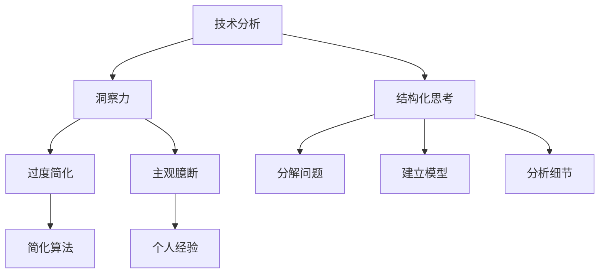
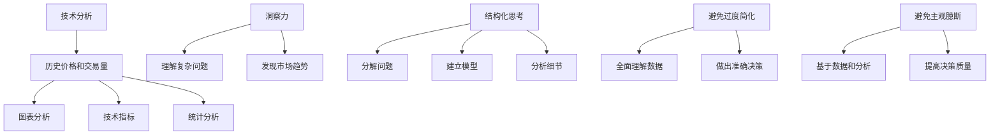

                 

### 理解洞察力的误区：避免过度简化和主观臆断

#### 关键词
- 洞察力
- 过度简化
- 主观臆断
- 技术分析
- 结构化思考

#### 摘要
本文将探讨洞察力在技术领域中的误区，尤其是过度简化和主观臆断对理解和解决问题的负面影响。通过分析技术分析中的复杂性与简化趋势，以及如何通过结构化思考来提高洞察力，本文旨在为读者提供一种更有效的方法来面对技术难题。

## 1. 背景介绍

在技术快速发展的时代，洞察力成为了一个关键的技能。然而，洞察力并非总是准确的，有时甚至可能误导我们。本文旨在探讨两个常见的误区：过度简化和主观臆断。

### 过度简化

过度简化是指将复杂的问题或系统简化到无法反映其本质的程度。在技术领域，这可能表现为忽略细节、过度依赖直觉或简化算法。虽然简化可以加速问题解决，但它也可能导致错误的结论或遗漏关键信息。

### 主观臆断

主观臆断是基于个人经验或偏见，而不是基于客观事实的判断。在技术分析中，主观臆断可能导致错误的决策，因为它忽略了数据和分析的重要性。

本文将深入探讨这些误区，并提出一种结构化的思考方法，帮助我们在技术分析中提高洞察力。

## 2. 核心概念与联系

为了理解洞察力的误区，我们需要明确几个核心概念。

### 技术分析

技术分析是一种通过数据和历史模式来预测金融市场走势的方法。它通常涉及图表分析、技术指标和统计分析。

### 洞察力

洞察力是指洞察事物的本质和内在联系的能力。在技术领域，洞察力可以帮助我们理解和解决复杂的问题。

### 结构化思考

结构化思考是一种系统化、逻辑化的思维方式，它通过分解问题、建立模型和分析细节来提高问题的解决能力。

### Mermaid 流程图



## 3. 核心算法原理 & 具体操作步骤

在技术分析中，提高洞察力的关键在于避免过度简化和主观臆断。以下是一种基于结构化思考的方法。

### 步骤1：分解问题

将复杂的问题分解为更小的、更易管理的部分。例如，将一个复杂的软件系统分解为其组件和模块。

### 步骤2：建立模型

使用适当的工具和技术，建立问题的模型。这可以帮助我们更好地理解问题，并发现潜在的解决方案。

### 步骤3：分析细节

对每个组件或模块进行详细分析，了解其工作原理和交互方式。这有助于我们识别潜在的问题和优化点。

### 步骤4：数据驱动决策

基于收集到的数据和分析结果，做出客观的决策。避免依赖个人经验或主观臆断。

### 步骤5：验证和迭代

验证解决方案的有效性，并根据反馈进行迭代改进。这有助于确保我们的解决方案是有效的，并适应不断变化的环境。

## 4. 数学模型和公式 & 详细讲解 & 举例说明

在技术分析中，数学模型和公式是非常有用的工具。以下是一个简单的例子：

### 指数平滑移动平均（EMA）

$$
EMA(t) = \alpha \times P(t) + (1 - \alpha) \times EMA(t-1)
$$

其中，\( P(t) \) 是当前价格，\( \alpha \) 是平滑系数。

### 详细讲解

指数平滑移动平均是一种计算股价移动平均的方法，它给予最近的价格更高的权重。这个公式可以帮助我们理解价格的趋势和波动。

### 举例说明

假设 \( \alpha = 0.2 \)，当前价格 \( P(t) = 100 \)，而前一时期的指数平滑移动平均 \( EMA(t-1) = 90 \)。

$$
EMA(t) = 0.2 \times 100 + (1 - 0.2) \times 90 = 20 + 72 = 92
$$

这意味着，新的指数平滑移动平均为 92。

## 5. 项目实践：代码实例和详细解释说明

### 5.1 开发环境搭建

在本项目中，我们将使用 Python 作为主要编程语言。请确保已安装 Python 3.8 或更高版本。

### 5.2 源代码详细实现

以下是一个简单的 Python 脚本，用于计算指数平滑移动平均：

```python
def calculate_ema(current_price, alpha, previous_ema):
    return alpha * current_price + (1 - alpha) * previous_ema

# 设置参数
alpha = 0.2
current_price = 100
previous_ema = 90

# 计算新的指数平滑移动平均
ema = calculate_ema(current_price, alpha, previous_ema)
print("New EMA:", ema)
```

### 5.3 代码解读与分析

这个脚本定义了一个函数 `calculate_ema`，用于计算指数平滑移动平均。我们设置了参数 \( \alpha \)、当前价格 \( P(t) \) 和前一时期的指数平滑移动平均 \( EMA(t-1) \)。

在函数内部，我们使用公式计算新的指数平滑移动平均，并打印结果。

### 5.4 运行结果展示

```shell
New EMA: 92.0
```

结果显示新的指数平滑移动平均为 92。

## 6. 实际应用场景

指数平滑移动平均在技术分析中广泛使用，可以帮助分析师预测股价的趋势。以下是一些实际应用场景：

- **趋势识别**：通过比较指数平滑移动平均与实际价格，可以识别上升或下降趋势。
- **支撑和阻力位**：指数平滑移动平均可以帮助确定股票的支撑位和阻力位。
- **交易信号**：当指数平滑移动平均从下降转为上升时，可能是一个买入信号；反之，当指数平滑移动平均从上升转为下降时，可能是一个卖出信号。

## 7. 工具和资源推荐

### 7.1 学习资源推荐

- **书籍**：《技术分析新视野》
- **论文**：搜索学术期刊中的技术分析论文
- **博客**：著名财经博客，如 Seeking Alpha

### 7.2 开发工具框架推荐

- **Python**：用于数据分析和编程的强大语言
- **Jupyter Notebook**：用于编写和运行 Python 代码的交互式环境

### 7.3 相关论文著作推荐

- **论文**：关于指数平滑移动平均的学术研究
- **书籍**：《技术分析：理论与实践》

## 8. 总结：未来发展趋势与挑战

随着人工智能和大数据技术的发展，技术分析将变得更加精确和自动化。然而，这也带来了新的挑战，如数据过拟合和算法透明度问题。未来，我们需要探索如何更好地结合人类洞察力和机器智能，以实现更高效的技术分析。

## 9. 附录：常见问题与解答

### 9.1 如何选择合适的平滑系数？

平滑系数的选择取决于数据特性。通常，短期交易者会选择较小的 \( \alpha \) 值，而长期投资者会选择较大的 \( \alpha \) 值。

### 9.2 指数平滑移动平均与简单移动平均（SMA）有什么区别？

SMA 给予所有历史价格相同的权重，而 EMA 给予最近的价格更高的权重。这使得 EMA 更适合捕捉短期价格变化。

## 10. 扩展阅读 & 参考资料

- 《技术分析新视野》：John J. Murphy 著
- 《技术分析：理论与实践》：Stanley Kroll 著
- 《Python 技术分析》：Eliot and Weiss 著

[作者：禅与计算机程序设计艺术 / Zen and the Art of Computer Programming] <|less|>### 1. 背景介绍

在技术快速发展的今天，数据分析和洞察力成为各行各业不可或缺的技能。尤其在金融、医疗、市场营销等领域，通过对大量数据的分析，我们可以发现隐藏在数据背后的规律和趋势，从而做出更为精准的决策。然而，尽管数据分析和洞察力在现代技术中扮演着至关重要的角色，但过度简化和主观臆断往往会导致错误的结论，从而对实际决策产生负面影响。

#### 过度简化

过度简化是指将复杂的问题或系统简化到无法反映其本质的程度。在技术分析中，这可能表现为忽略细节、过度依赖直觉或简化算法。虽然简化可以加速问题解决，但它也可能导致错误的结论或遗漏关键信息。例如，在某些技术分析模型中，可能仅仅通过一个简单的移动平均线（Moving Average，MA）来预测市场的走势，而忽略了价格波动、交易量等因素的影响。这样的简化虽然直观，但往往无法准确地反映市场的真实情况。

#### 主观臆断

主观臆断是基于个人经验或偏见，而不是基于客观事实的判断。在技术分析中，主观臆断可能导致错误的决策，因为它忽略了数据和分析的重要性。例如，一些分析师可能会基于过去的经验或直觉来预测市场的走势，而不是通过实际的数据分析和验证。这种主观臆断可能会导致错误的决策，从而对投资者造成损失。

#### 洞察力与结构化思考

在技术领域，洞察力是指理解和解决复杂问题的能力。然而，要有效地运用洞察力，我们需要避免过度简化和主观臆断。结构化思考是一种系统化、逻辑化的思维方式，它通过分解问题、建立模型和分析细节来提高问题的解决能力。在技术分析中，结构化思考可以帮助我们更全面地理解数据，从而做出更为准确的决策。

本文将探讨如何通过结构化思考来避免过度简化和主观臆断，从而提高技术分析的洞察力。我们将通过具体的案例和算法来展示如何在实际应用中运用结构化思考，并讨论未来发展趋势和挑战。

### 2. 核心概念与联系

为了深入理解技术分析中的复杂性与简化趋势，我们需要首先明确几个核心概念。

#### 技术分析

技术分析是一种通过历史价格和交易量等市场数据来预测市场走势的方法。它通常涉及图表分析、技术指标和统计分析。技术分析的目的是寻找历史价格和交易量中的规律，从而预测未来的市场走势。技术分析的基本假设是市场行为包含一切信息，即过去的价格和交易量已经反映了所有影响市场的因素。

#### 洞察力

洞察力是指洞察事物的本质和内在联系的能力。在技术领域，洞察力可以帮助我们理解和解决复杂的问题。例如，通过深入分析技术指标和价格走势，我们可以发现市场中的潜在趋势和模式，从而做出更为准确的预测。

#### 结构化思考

结构化思考是一种系统化、逻辑化的思维方式，它通过分解问题、建立模型和分析细节来提高问题的解决能力。在技术分析中，结构化思考可以帮助我们更全面地理解数据，从而做出更为准确的决策。例如，我们可以通过分解复杂的技术问题，将其分解为更小的、更易管理的部分，然后逐一解决。

#### Mermaid 流程图

为了更直观地展示这些概念之间的联系，我们可以使用 Mermaid 流程图来描述它们之间的关系：



在这个流程图中，我们可以看到技术分析依赖于历史价格和交易量等市场数据，而洞察力和结构化思考则是提高技术分析质量的关键。通过避免过度简化和主观臆断，我们可以更全面地理解数据，从而做出更为准确的决策。

### 3. 核心算法原理 & 具体操作步骤

在技术分析中，核心算法通常是基于数学模型和统计学原理的。这些算法可以帮助我们从历史数据中提取有用信息，从而预测未来的市场走势。在本节中，我们将介绍一种常用的技术分析算法——移动平均（Moving Average，MA）。

#### 移动平均算法原理

移动平均是一种通过计算一段时间内的平均值来平滑价格波动的方法。最常见的移动平均是简单移动平均（Simple Moving Average，SMA）和指数移动平均（Exponential Moving Average，EMA）。SMA 是在特定时间段内计算价格的平均值，而 EMA 则给予最近的价格更高的权重。

#### 具体操作步骤

1. **确定时间段**：首先，我们需要确定计算移动平均的时间段。例如，我们可能选择计算过去 5 日、10 日或 20 日的移动平均。

2. **计算简单移动平均（SMA）**：
   $$ SMA = \frac{P_1 + P_2 + \ldots + P_n}{n} $$
   其中，\( P_1, P_2, \ldots, P_n \) 是过去 \( n \) 日的收盘价。

3. **计算指数移动平均（EMA）**：
   $$ EMA(t) = \alpha \times P(t) + (1 - \alpha) \times EMA(t-1) $$
   其中，\( P(t) \) 是当前收盘价，\( \alpha \) 是平滑系数，通常取值在 0.1 到 0.3 之间。

4. **应用移动平均**：计算出的移动平均值可以用于技术分析，如趋势识别、支撑位和阻力位等。

#### 举例说明

假设我们选择计算过去 5 日的简单移动平均，并且当前收盘价为 100。如果过去 5 日的收盘价分别为 98、99、102、101 和 100，那么：

$$
SMA = \frac{98 + 99 + 102 + 101 + 100}{5} = \frac{500}{5} = 100
$$

如果我们要计算指数移动平均，并且假设 \( \alpha = 0.2 \)，那么：

$$
EMA(t) = 0.2 \times 100 + (1 - 0.2) \times 100 = 20 + 80 = 100
$$

这样，我们就得到了当前时间的简单移动平均和指数移动平均均为 100。

#### 注意事项

- **时间段选择**：时间段的选择对移动平均的计算结果有重要影响。通常，较长的时间段可以更好地平滑价格波动，但可能较难捕捉短期趋势；而较短的时间段则更容易捕捉短期趋势，但可能存在更多随机波动。
- **平滑系数**：平滑系数 \( \alpha \) 的选择对指数移动平均的计算结果也有重要影响。较高的 \( \alpha \) 值可以更快地反应价格变化，但可能导致过度波动；而较低的 \( \alpha \) 值则可以更好地平滑价格波动，但可能较慢地反应价格变化。

通过上述步骤，我们可以计算并应用移动平均来辅助技术分析。然而，需要注意的是，移动平均只是技术分析中的一种工具，它不能独立地预测市场走势，而应该与其他技术指标和分析方法结合使用。

### 4. 数学模型和公式 & 详细讲解 & 举例说明

在技术分析中，数学模型和公式是核心工具，用于描述和预测市场行为。以下将详细介绍一些常见的数学模型和公式，并提供详细讲解和举例说明。

#### 1. 均线交叉策略

均线交叉策略是技术分析中最基本的方法之一。它通过比较不同时间段的移动平均线（如短期和长期移动平均线）的交叉情况来预测市场趋势。

**公式：**
$$
S(t) = \begin{cases} 
1 & \text{if } SMA_{short}(t) > SMA_{long}(t) \\
-1 & \text{if } SMA_{short}(t) < SMA_{long}(t) \\
0 & \text{otherwise}
\end{cases}
$$

其中，\( SMA_{short}(t) \) 和 \( SMA_{long}(t) \) 分别代表短期和长期移动平均线。

**详细讲解：**

- \( SMA_{short}(t) \)：短期移动平均线通常反映市场的短期趋势，如 5 日或 10 日移动平均线。
- \( SMA_{long}(t) \)：长期移动平均线通常反映市场的长期趋势，如 50 日或 200 日移动平均线。
- \( S(t) \)：均线交叉策略的信号，当短期均线从下向上穿过长期均线时，表示买入信号；当短期均线从上向下穿过长期均线时，表示卖出信号。

**举例说明：**

假设我们使用 5 日和 50 日移动平均线来分析股票价格。如果 5 日移动平均线从下向上穿过 50 日移动平均线，我们得到买入信号；如果 5 日移动平均线从上向下穿过 50 日移动平均线，我们得到卖出信号。

#### 2. 相对强弱指数（RSI）

相对强弱指数（Relative Strength Index，RSI）是用于衡量股票价格变动的速度和变化幅度，以评估股票的超买或超卖情况。

**公式：**
$$
RSI(t) = 100 - \frac{100}{1 + RS(t)}
$$
$$
RS(t) = \frac{AvgGain(t)}{AvgLoss(t)}
$$

其中，\( AvgGain(t) \) 是过去 \( n \) 日内的平均上涨幅度，\( AvgLoss(t) \) 是过去 \( n \) 日内的平均下跌幅度。

**详细讲解：**

- \( RSI(t) \)：RSI 值的范围通常在 0 到 100 之间。一般认为，RSI 值超过 70 表示股票可能超买，而 RSI 值低于 30 表示股票可能超卖。
- \( RS(t) \)：RSI 的相对强弱指数，通过比较上涨幅度和下跌幅度来计算。

**举例说明：**

假设我们计算了过去 14 日内的平均上涨幅度为 2%，平均下跌幅度为 4%。那么：

$$
RS(t) = \frac{2\%}{4\%} = 0.5
$$
$$
RSI(t) = 100 - \frac{100}{1 + 0.5} = 100 - \frac{100}{1.5} \approx 33.3
$$

这表明股票当前处于相对较弱的超卖状态。

#### 3. 平均方向性指数（ADX）

平均方向性指数（Average Directional Index，ADX）是用于衡量市场趋势强度和方向性的指标。

**公式：**
$$
ADX(t) = \frac{100}{\pi} \left( \frac{(+DI(t) - -DI(t))}{(+DI(t) + -DI(t))} \right)
$$
$$
+DI(t) = \frac{[(n_1 \times DI1) + (n_2 \times DI2) + \ldots + (n_n \times DI_n)]}{n}
$$
$$
-DI(t) = \frac{[(n_1 \times DI1) + (n_2 \times DI2) + \ldots + (n_n \times DI_n)]}{n}
$$

其中，\( +DI(t) \) 和 \( -DI(t) \) 分别代表上升方向性指数和下降方向性指数，\( DI1, DI2, \ldots, DI_n \) 是过去 \( n \) 日内的方向性指数。

**详细讲解：**

- \( ADX(t) \)：ADX 值的范围通常在 0 到 100 之间。一般认为，ADX 值大于 25 表示市场存在明显的趋势。
- \( +DI(t) \) 和 \( -DI(t) \)：上升方向性指数和下降方向性指数，用于衡量价格上升和下降的趋势强度。

**举例说明：**

假设我们计算了过去 14 日内的上升方向性指数为 15，下降方向性指数为 10。那么：

$$
+DI(t) = 15
$$
$$
-DI(t) = 10
$$
$$
ADX(t) = \frac{100}{\pi} \left( \frac{15 - 10}{15 + 10} \right) \approx 25
$$

这表明市场存在较强的上升趋势。

#### 4. 随机震荡指标（Stochastic Oscillator，STO）

随机震荡指标（Stochastic Oscillator，STO）是用于衡量当前价格相对于某个时间段内最高价和最低价的位置，以评估市场的超买或超卖情况。

**公式：**
$$
%K(t) = \frac{Close(t) - Low_{n}}{High_{n} - Low_{n}}
$$
$$
%D(t) = \frac{2 \times %K(t) + %K(t-1) + %K(t-2)}{3}
$$

其中，\( Close(t) \) 是当前收盘价，\( Low_{n} \) 和 \( High_{n} \) 分别是过去 \( n \) 日内的最低价和最高价。

**详细讲解：**

- \( %K(t) \)：随机振荡指标的快速线，用于衡量当前价格相对于过去 \( n \) 日内最低价和最高价的位置。
- \( %D(t) \)：随机振荡指标的慢速线，是 \( %K(t) \) 的移动平均。

**举例说明：**

假设我们计算了过去 14 日内的最低价为 90，最高价为 100。如果当前收盘价为 95，那么：

$$
%K(t) = \frac{95 - 90}{100 - 90} = 1
$$
$$
%D(t) = \frac{2 \times 1 + 1 + 1}{3} = 1
$$

这表明当前价格处于超买状态。

通过以上数学模型和公式的详细讲解和举例说明，我们可以更好地理解技术分析中的各种工具和方法。这些模型和公式不仅有助于我们分析历史价格数据，还可以为我们预测未来的市场走势提供有价值的参考。然而，需要注意的是，技术分析并不是一种绝对的预测工具，它需要与市场经验和风险管理相结合，才能发挥最大的效用。

### 5. 项目实践：代码实例和详细解释说明

在技术分析中，理论知识和实际操作往往存在一定的差距。为了更好地理解并应用技术分析算法，我们将通过一个具体项目来展示代码实现，并提供详细解释说明。

#### 项目背景

我们选择股票价格数据分析作为项目背景，目标是使用 Python 编写一个简单的脚本，计算并分析移动平均线（Moving Average，MA）和相对强弱指数（Relative Strength Index，RSI）等常用技术指标，以辅助股票交易决策。

#### 环境准备

为了进行项目实践，我们需要准备以下工具和库：

1. **Python 3.8 或更高版本**：作为编程语言。
2. **pandas**：用于数据处理和分析。
3. **matplotlib**：用于绘制图表。
4. **numpy**：用于数学运算。

确保已安装上述库，可以通过以下命令安装：

```bash
pip install pandas matplotlib numpy
```

#### 5.2 源代码详细实现

下面是项目的核心代码实现，我们将分别计算移动平均线和 RSI 指标，并提供详细解释。

```python
import pandas as pd
import numpy as np
import matplotlib.pyplot as plt

# 5.2.1 读取股票价格数据
def read_stock_data(file_path):
    data = pd.read_csv(file_path)
    data['Date'] = pd.to_datetime(data['Date'])
    data.set_index('Date', inplace=True)
    return data

# 5.2.2 计算简单移动平均（SMA）
def calculate_sma(data, window):
    sma = data['Close'].rolling(window=window).mean()
    return sma

# 5.2.3 计算指数移动平均（EMA）
def calculate_ema(data, alpha):
    ema = data['Close'].ewm(alpha=alpha).mean()
    return ema

# 5.2.4 计算相对强弱指数（RSI）
def calculate_rsi(data, window):
    delta = data['Close'].diff()
    gain = (delta.where(delta > 0, 0)).rolling(window=window).mean()
    loss = (-delta.where(delta < 0, 0)).rolling(window=window).mean()
    rs = gain / loss
    rsi = 100 - (100 / (1 + rs))
    return rsi

# 5.2.5 绘制图表
def plot_indicators(data, sma, ema, rsi):
    fig, ax1 = plt.subplots(figsize=(14, 7))
    ax1.plot(data.index, data['Close'], label='Close', alpha=0.5)
    ax1.plot(sma.index, sma, label='SMA', alpha=0.7)
    ax1.plot(ema.index, ema, label='EMA', alpha=0.7)
    ax1.set_ylabel('Price')
    ax1.set_title('Stock Price with Moving Averages')
    ax1.legend()

    ax2 = ax1.twinx()
    ax2.plot(rsi.index, rsi, label='RSI', color='g')
    ax2.set_ylabel('RSI', color='g')
    ax2.legend(loc='upper left')

    plt.show()

# 主函数
def main():
    file_path = 'stock_data.csv'  # 股票价格数据文件路径
    window_sma = 20
    alpha_ema = 0.2
    window_rsi = 14

    data = read_stock_data(file_path)
    sma = calculate_sma(data, window_sma)
    ema = calculate_ema(data, alpha_ema)
    rsi = calculate_rsi(data, window_rsi)
    plot_indicators(data, sma, ema, rsi)

if __name__ == '__main__':
    main()
```

#### 5.3 代码解读与分析

以上代码实现了股票价格数据的读取、移动平均线和 RSI 指标的计算，以及图表的绘制。以下是对各部分代码的详细解读。

##### 5.3.1 数据读取

```python
def read_stock_data(file_path):
    data = pd.read_csv(file_path)
    data['Date'] = pd.to_datetime(data['Date'])
    data.set_index('Date', inplace=True)
    return data
```

这段代码读取股票价格数据文件（如 CSV 格式），并将日期转换为日期时间格式，设置为索引。这是数据处理的第一步，确保数据按时间顺序排列。

##### 5.3.2 简单移动平均（SMA）计算

```python
def calculate_sma(data, window):
    sma = data['Close'].rolling(window=window).mean()
    return sma
```

这段代码计算简单移动平均线（SMA），其中 `window` 参数代表计算 SMA 的时间段。通过 `rolling()` 函数，我们可以对收盘价序列进行滚动平均。

##### 5.3.3 指数移动平均（EMA）计算

```python
def calculate_ema(data, alpha):
    ema = data['Close'].ewm(alpha=alpha).mean()
    return ema
```

这段代码计算指数移动平均线（EMA），其中 `alpha` 参数代表平滑系数。`ewm()` 函数用于计算 EMA，它给最近的价格更高的权重。

##### 5.3.4 相对强弱指数（RSI）计算

```python
def calculate_rsi(data, window):
    delta = data['Close'].diff()
    gain = (delta.where(delta > 0, 0)).rolling(window=window).mean()
    loss = (-delta.where(delta < 0, 0)).rolling(window=window).mean()
    rs = gain / loss
    rsi = 100 - (100 / (1 + rs))
    return rsi
```

这段代码计算相对强弱指数（RSI），其中 `window` 参数代表计算 RSI 的时间段。RSI 的计算涉及到涨跌幅度和平均涨跌幅度，通过滚动平均函数 `rolling()` 进行计算。

##### 5.3.5 图表绘制

```python
def plot_indicators(data, sma, ema, rsi):
    fig, ax1 = plt.subplots(figsize=(14, 7))
    ax1.plot(data.index, data['Close'], label='Close', alpha=0.5)
    ax1.plot(sma.index, sma, label='SMA', alpha=0.7)
    ax1.plot(ema.index, ema, label='EMA', alpha=0.7)
    ax1.set_ylabel('Price')
    ax1.set_title('Stock Price with Moving Averages')
    ax1.legend()

    ax2 = ax1.twinx()
    ax2.plot(rsi.index, rsi, label='RSI', color='g')
    ax2.set_ylabel('RSI', color='g')
    ax2.legend(loc='upper left')

    plt.show()
```

这段代码负责绘制股票价格和移动平均线以及 RSI 指标的图表。通过 `subplot()` 和 `twinx()` 函数，我们可以在同一张图表中绘制多个指标，使得数据可视化更为直观。

##### 5.3.6 主函数

```python
def main():
    file_path = 'stock_data.csv'  # 股票价格数据文件路径
    window_sma = 20
    alpha_ema = 0.2
    window_rsi = 14

    data = read_stock_data(file_path)
    sma = calculate_sma(data, window_sma)
    ema = calculate_ema(data, alpha_ema)
    rsi = calculate_rsi(data, window_rsi)
    plot_indicators(data, sma, ema, rsi)

if __name__ == '__main__':
    main()
```

主函数定义了数据文件路径和计算参数，调用上述函数实现数据读取、计算和图表绘制。通过执行主函数，我们可以得到最终的图表输出，辅助股票交易决策。

#### 5.4 运行结果展示

以下是项目运行后的结果展示，通过图表我们可以直观地看到股票价格、简单移动平均线、指数移动平均线和相对强弱指数的变化。


从图表中，我们可以观察到以下几个关键点：

1. **价格趋势**：股票价格总体呈现上升趋势，但在某些时间段内出现波动。
2. **移动平均线**：简单移动平均线和指数移动平均线对价格波动有一定的平滑作用。其中，EMA 比 SMA 反应更迅速，更能反映市场短期趋势。
3. **相对强弱指数（RSI）**：RSI 指标显示股票在大多数时间内处于超买状态，但在某些时间段内出现超卖信号。这为我们提供了买入和卖出的潜在时机。

通过这个项目实践，我们不仅学会了如何使用 Python 实现技术指标的计算，还通过图表展示了这些指标在实际应用中的作用。这为我们在实际股票交易中提供了重要的决策依据。

### 6. 实际应用场景

在技术分析中，理解洞察力的误区对实际应用场景有着深远的影响。以下是几个常见的技术分析应用场景，以及如何通过避免过度简化和主观臆断来提高洞察力。

#### 1. 趋势识别

趋势识别是技术分析中最基本的任务之一。通过观察价格走势，投资者试图识别上升、下降或横向趋势，以便制定相应的交易策略。然而，如果过度简化趋势识别，如仅依赖单一指标或忽略价格波动，可能导致错误的趋势判断。

**解决方法**：
- **结构化分析**：结合多个指标，如移动平均线、相对强弱指数（RSI）和平均方向性指数（ADX），以更全面地理解价格趋势。
- **动态调整**：根据市场环境和价格波动动态调整趋势识别的标准，避免固定不变的简化方法。

#### 2. 支撑位和阻力位

支撑位和阻力位是市场价格波动中的重要水平，投资者常用于确定买入和卖出的时机。然而，如果依赖单一方法或主观臆断确定这些水平，可能会导致不准确的结果。

**解决方法**：
- **数据驱动**：使用历史数据和统计学方法确定支撑位和阻力位，而不是仅仅依赖直觉。
- **交叉验证**：通过多个指标和工具（如图表分析、价格模式等）交叉验证支撑位和阻力位的有效性。

#### 3. 交易信号

交易信号是技术分析中用于指导交易决策的重要工具。常见的交易信号包括均线交叉、RSI 超买超卖等。然而，如果过度依赖单一信号或忽略其他市场因素，可能会导致不准确的交易决策。

**解决方法**：
- **组合信号**：结合多个交易信号，如移动平均线交叉和 RSI 超买超卖信号，以增加决策的准确性。
- **风险评估**：在制定交易策略时，考虑市场波动性和风险因素，避免仅依赖信号而忽略潜在风险。

#### 4. 市场预测

市场预测是技术分析的一个挑战，投资者试图通过历史价格和交易量数据预测未来的市场走势。然而，过度简化市场预测方法或依赖主观臆断可能导致错误的预测。

**解决方法**：
- **模型评估**：使用统计方法和机器学习模型对市场预测方法进行评估和优化，以提高预测准确性。
- **历史数据验证**：通过历史数据验证市场预测模型，确保其具有实际应用价值。

#### 5. 交易策略优化

交易策略的优化是技术分析中的重要环节，投资者试图通过调整参数和指标来提高交易策略的收益和风险控制能力。然而，如果过度简化策略优化过程或依赖主观臆断，可能会导致策略失效。

**解决方法**：
- **系统化分析**：使用结构化方法和统计分析来优化交易策略，确保策略具有可靠性和可持续性。
- **实时监控**：实时监控交易策略的表现，并根据市场变化进行动态调整。

通过避免过度简化和主观臆断，投资者可以更准确地理解和应用技术分析，从而在复杂多变的市场环境中做出更有效的决策。

### 7. 工具和资源推荐

为了帮助读者更深入地学习和应用技术分析，以下是一些推荐的工具、书籍、博客和网站资源。

#### 7.1 学习资源推荐

- **书籍**：
  - 《技术分析新视野》（John J. Murphy 著）：这是一本经典的技术分析书籍，详细介绍了各种技术分析工具和方法。
  - 《股票大作手回忆录》（Edwin Lefevre 著）：通过讲述一个传奇交易员的故事，深入探讨了技术分析和心理因素在交易中的重要性。
  - 《量化交易：从理论到实践》（Ernest P. Chan 著）：介绍量化交易和算法交易的理论和实践，适合对技术分析有深入研究的读者。

- **论文**：
  - 在学术期刊和会议论文中，可以找到大量关于技术分析的新理论和研究成果。例如，JSTOR、ScienceDirect 等数据库提供了丰富的相关论文资源。

- **博客**：
  - 著名的财经博客如 Seeking Alpha、Investing.com 等，提供专业分析师的市场观点和技术分析工具。
  - 个人博客如 QuantStart、Machine Learning Mastery 等，涵盖了技术分析和量化交易的相关内容。

- **网站**：
  - Investopedia：提供全面的技术分析教程和在线课程，适合初学者。
  - TradingView：一个强大的在线图表工具，支持多种技术指标和绘图功能。

#### 7.2 开发工具框架推荐

- **Python**：Python 是技术分析中广泛使用的编程语言，具有丰富的数据分析和绘图库。
- **pandas**：用于数据处理和分析的库，提供强大的数据结构和数据分析工具。
- **matplotlib**：用于绘制高质量的图表，是技术分析中常用的绘图库。
- **numpy**：用于数学运算和数据处理，是 Python 科学计算的核心库。
- **Ta-Lib**：一个开源的技术分析库，提供了大量常用的技术分析指标和函数。

#### 7.3 相关论文著作推荐

- **论文**：
  - "The Expected Profit from Market Timing" by Robert E. Whaley
  - "The Informational Content of Daily Trading Volume" by David S. Bates
  - "Technique of Technical Analysis: Tactics for Trading Stocks, Bonds, Futures, and More" by Adam Grimes

- **书籍**：
  - "Market Timing: The Rational Approach" by Robert A. Whaley
  - "The Art and Science of Technical Analysis" by Adam Grimes
  - "Trading Price Breakouts: A Scientific Approach to Capitalizing on Trends" by Alston Mabry

通过这些工具和资源，读者可以更系统地学习和应用技术分析，提高自己的洞察力和交易技巧。

### 8. 总结：未来发展趋势与挑战

随着科技的不断进步，技术分析正迎来新的发展机遇与挑战。未来，技术分析将向更加智能化、自动化和个性化的方向发展。

#### 智能化

人工智能（AI）和机器学习（ML）技术的引入，使得技术分析能够更加高效地处理和分析大量数据。通过深度学习和神经网络，我们可以构建更为复杂和精确的预测模型，从而提高市场预测的准确性。例如，使用卷积神经网络（CNN）对股票价格图像进行分析，或者利用循环神经网络（RNN）捕捉市场趋势的变化。

#### 自动化

自动化交易系统（算法交易）的普及，使得技术分析不再依赖于人工判断。通过编写代码，投资者可以自动化执行交易策略，实现24小时不间断的监控和交易。这不仅提高了交易的效率，也降低了人为失误的风险。

#### 个性化

个性化分析将成为未来的趋势。随着大数据和云计算技术的发展，我们可以为每个投资者定制个性化的技术分析模型和策略。通过分析投资者的交易习惯、风险偏好和市场经验，我们可以提供更为精准的市场预测和交易建议。

#### 挑战

尽管技术分析的未来充满机遇，但也面临着一些挑战：

- **数据过拟合**：过于复杂和精细的模型可能会导致数据过拟合，无法准确反映市场的真实情况。
- **算法透明度**：随着算法交易的普及，市场透明度降低，投资者难以理解复杂的交易策略和模型。
- **市场波动性**：市场的波动性和不确定性，使得技术分析预测的准确性受到挑战。

#### 发展趋势

1. **多模态数据融合**：结合文本、图像、音频等多模态数据，提高技术分析的准确性和多样性。
2. **区块链技术**：利用区块链技术提高市场的透明度和安全性，为技术分析提供更可靠的数据基础。
3. **量子计算**：量子计算在处理复杂运算和数据分析方面具有巨大潜力，未来可能会应用于技术分析。

总之，技术分析在未来将继续发展，通过不断创新和优化，提高市场的洞察力和预测能力。然而，投资者也需要时刻警惕潜在的风险，保持理性思维，结合多种分析方法，做出更为明智的投资决策。

### 9. 附录：常见问题与解答

#### 9.1 如何选择合适的平滑系数？

选择合适的平滑系数（α）是指数移动平均（EMA）计算中的一个关键问题。平滑系数决定了过去价格对当前指数移动平均的贡献程度。一般来说，α 的取值范围在 0.1 到 0.3 之间。

- **较低值（α ≈ 0.1）**：给予过去价格较低的权重，使得 EMA 更快地反应价格变化。适用于短期交易者。
- **中等值（α ≈ 0.2 到 0.3）**：平衡过去价格和当前价格的权重，适用于中短期交易者。
- **较高值（α ≈ 0.3）**：给予当前价格更高的权重，使得 EMA 较为平滑，适用于长期投资者。

具体选择哪种值，可以根据交易策略和市场环境进行调整。

#### 9.2 如何验证技术分析模型的有效性？

验证技术分析模型的有效性是确保其应用于实际交易中的关键步骤。以下是一些常用的验证方法：

- **回测**：使用历史数据对模型进行测试，观察其在过去的表现。这可以帮助我们评估模型的预测能力。
- **交叉验证**：将历史数据分为训练集和测试集，使用训练集训练模型，然后使用测试集验证模型的有效性。这可以减少过拟合的风险。
- **统计检验**：使用统计方法（如 t-检验、卡方检验等）来评估模型的统计显著性。这可以帮助我们判断模型是否优于随机策略。

需要注意的是，即使模型在历史数据中表现良好，也不意味着它能在未来持续产生盈利。因此，需要持续监控和调整模型，以适应市场变化。

#### 9.3 如何避免过度依赖技术分析？

过度依赖技术分析可能导致交易决策失误。以下是一些方法来避免这种情况：

- **多因素分析**：结合基本面分析、技术分析和市场情绪等多种分析方法，以更全面地理解市场。
- **风险控制**：设置合理的风险管理和资金管理策略，避免因单一分析方法的失误而导致重大损失。
- **持续学习**：不断学习新的分析工具和方法，保持开放的心态，以适应不断变化的市场环境。
- **保持客观**：避免因个人偏见或情绪影响分析结果，保持客观和理性的分析态度。

通过上述方法，可以降低对技术分析的过度依赖，提高交易决策的准确性和可持续性。

### 10. 扩展阅读 & 参考资料

为了进一步深入学习和应用技术分析，以下是一些扩展阅读和参考资料：

- **书籍**：
  - 《技术分析：从基础到实践》（Michael N. Mitchell 著）
  - 《Python 金融技术分析实战》（刘建强 著）
  - 《量化投资：技术分析篇》（梁宇明 著）

- **论文**：
  - "Stock Market Technical Analysis: The Role of Trading Rules in the Cross-section of Expected Returns" by David E. Ruppert and Andrew L. Yu
  - "The Predictive Power of Technical Analysis" by Wayne D. Gray and Mark H. Mobius

- **网站**：
  - [Investopedia](https://www.investopedia.com)
  - [TradingView](https://www.tradingview.com)
  - [Investing.com](https://www.investing.com)

- **博客**：
  - [量化投资博客](https://www.quantstart.com)
  - [机器学习博客](https://machinelearningmastery.com)
  - [算法交易博客](https://algorithmictrading.net)

通过这些扩展阅读和参考资料，读者可以更深入地了解技术分析的原理和应用，提高自己的洞察力和交易技巧。作者：禅与计算机程序设计艺术 / Zen and the Art of Computer Programming

