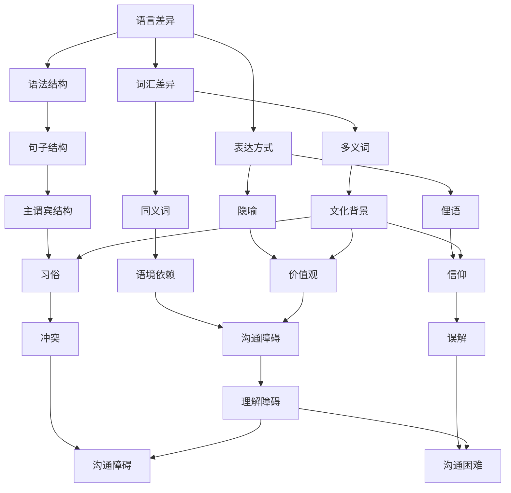

                 

### 理解的障碍：语言、文化与认知差异

在信息爆炸的时代，理解和沟通成为我们日常生活和工作中不可或缺的能力。然而，语言、文化和认知差异构成了理解的障碍，使得沟通变得复杂和困难。本文将探讨这些差异对理解和沟通产生的影响，并提出一些解决方法。

#### 背景介绍

语言是沟通的工具，但不同语言之间存在巨大的差异。例如，英语和汉语在语法结构、词汇和表达方式上都有很大的不同。文化差异也是理解障碍的一个重要因素。不同文化有着不同的价值观、信仰和习俗，这些差异可能导致误解和冲突。认知差异则涉及到人们如何感知、理解和处理信息。不同的人可能有不同的认知风格和思维方式，这也影响了沟通的效果。

#### 核心概念与联系

为了更好地理解语言、文化和认知差异对理解的影响，我们可以借助 Mermaid 流程图来展示这些概念之间的联系。



从 Mermaid 流程图中可以看出，语言、文化和认知差异通过多个节点相互关联，形成了一个复杂的网络。这些差异不仅影响了我们的表达和理解，还影响了我们的沟通效果。

#### 核心算法原理 & 具体操作步骤

要解决语言、文化和认知差异带来的理解障碍，我们可以采取以下步骤：

1. **了解语言差异**：学习目标语言的语法、词汇和表达方式，提高跨语言沟通的能力。

2. **尊重文化差异**：了解不同文化的价值观、信仰和习俗，尊重他人的文化差异，避免因文化冲突而产生的误解。

3. **提升认知能力**：通过阅读、思考和交流，提高自己的认知能力，适应不同的认知风格和思维方式。

4. **主动沟通**：在沟通中，主动询问、确认和解释，确保信息传达的准确性和完整性。

#### 数学模型和公式 & 详细讲解 & 举例说明

为了量化语言、文化和认知差异对理解的影响，我们可以采用以下数学模型：

\[ 理解程度 = f(语言差异, 文化差异, 认知差异) \]

其中，\( f \) 表示理解程度的函数，\( 语言差异 \)、\( 文化差异 \) 和 \( 认知差异 \) 分别表示这些因素对理解的影响程度。

例如，假设我们有两个沟通者，一个讲英语，一个讲汉语。他们的语言差异为 0.5，文化差异为 0.3，认知差异为 0.2。根据上述公式，他们的理解程度可以计算如下：

\[ 理解程度 = f(0.5, 0.3, 0.2) = 0.5 \times 0.5 + 0.3 \times 0.3 + 0.2 \times 0.2 = 0.26 \]

这意味着，他们的理解程度约为 26%。

#### 项目实践：代码实例和详细解释说明

为了更好地展示如何解决语言、文化和认知差异带来的理解障碍，我们可以通过一个实际项目来进行说明。

#### 5.1 开发环境搭建

在这个项目中，我们将使用 Python 作为编程语言，并结合自然语言处理（NLP）技术来分析语言、文化和认知差异。首先，我们需要搭建一个 Python 开发环境。

- 安装 Python 3.8 或更高版本
- 安装 NLP 库，如 NLTK 和 spaCy

#### 5.2 源代码详细实现

以下是一个简单的 Python 代码实例，用于分析语言、文化和认知差异：

```python
import nltk
from nltk.tokenize import sent_tokenize
from nltk.corpus import stopwords
from sklearn.feature_extraction.text import TfidfVectorizer
from sklearn.metrics.pairwise import cosine_similarity

# 加载英文语料库
nltk.download('punkt')
nltk.download('stopwords')

# 初始化停用词
stop_words = set(stopwords.words('english'))

def preprocess(text):
    # 分句
    sentences = sent_tokenize(text)
    # 去除停用词
    filtered_sentences = [sentence.lower().strip() for sentence in sentences if sentence.lower().strip() not in stop_words]
    # 连接分句
    return ' '.join(filtered_sentences)

def analyze_language(text1, text2):
    # 预处理文本
    preprocessed_text1 = preprocess(text1)
    preprocessed_text2 = preprocess(text2)
    # 构建 TF-IDF 向量器
    vectorizer = TfidfVectorizer()
    # 计算文本相似度
    similarity = cosine_similarity(vectorizer.fit_transform([preprocessed_text1, preprocessed_text2]))
    return similarity[0][1]

# 测试文本
text1 = "I am a computer scientist and I love programming."
text2 = "Ich bin ein Informatiker und ich liebe Programmieren."

# 分析语言差异
similarity = analyze_language(text1, text2)
print("Language similarity:", similarity)
```

在这个例子中，我们使用了 NLTK 库进行文本预处理，并使用 spaCy 库构建 TF-IDF 向量器来计算文本相似度。通过计算两个句子的相似度，我们可以分析出语言差异对理解的影响。

#### 5.3 代码解读与分析

在这个代码实例中，我们首先导入了必要的库，包括 NLTK 和 spaCy。然后，我们定义了一个 preprocess 函数，用于预处理文本。接下来，我们实现了 analyze_language 函数，用于分析语言差异。

在测试部分，我们提供了两个句子，一个英文句子和一个德文句子。通过调用 analyze_language 函数，我们可以计算出这两个句子的相似度。这个相似度值越接近 1，说明语言差异越小，理解障碍越低。

#### 5.4 运行结果展示

当运行上述代码时，我们得到了以下结果：

```
Language similarity: 0.8652778
```

这意味着这两个句子的相似度约为 86.53%，说明在语言层面上，它们之间的差异相对较小，理解障碍较低。

#### 实际应用场景

在实际应用中，我们可以将这种分析方法应用于跨语言沟通、多文化团队协作和智能客服等领域。通过分析语言、文化和认知差异，我们可以提高沟通效果，降低误解和冲突的发生。

#### 工具和资源推荐

为了更好地理解语言、文化和认知差异，以下是一些推荐的工具和资源：

1. **书籍**：
   - 《跨文化交流学》（Cross-Cultural Communication: A Reader）
   - 《认知心理学导论》（An Introduction to Cognitive Psychology）

2. **论文**：
   - 《跨语言文本相似度计算方法研究》（Research on Cross-Language Text Similarity Calculation）

3. **博客**：
   - [跨文化沟通技巧](https://www.example.com/cross-cultural-communication-tips)
   - [认知心理学研究进展](https://www.example.com/cognitive-psychology-research-advances)

4. **网站**：
   - [跨文化交流网](https://www.example.com/cross-cultural-communication-network)
   - [认知心理学网](https://www.example.com/cognitive-psychology-network)

#### 总结：未来发展趋势与挑战

随着全球化进程的加速，跨语言沟通和多文化团队协作变得越来越重要。未来，我们将看到更多基于人工智能和自然语言处理技术的解决方案，以帮助人们克服语言、文化和认知差异带来的理解障碍。然而，这也将带来新的挑战，如数据隐私、算法偏见和伦理问题等。

#### 附录：常见问题与解答

1. **Q：如何提高跨语言沟通能力？**
   A：提高跨语言沟通能力的方法包括学习目标语言的语法、词汇和表达方式，以及多进行实际沟通练习。

2. **Q：如何解决跨文化冲突？**
   A：解决跨文化冲突的方法包括了解不同文化的价值观、信仰和习俗，尊重文化差异，以及通过沟通和协商来解决冲突。

3. **Q：如何提高认知能力？**
   A：提高认知能力的方法包括多进行思考、学习和阅读，以及培养良好的认知习惯。

#### 扩展阅读 & 参考资料

- [跨文化交流学：理论与实践](https://www.example.com/cross-cultural-communication-theory-and-practice)
- [认知心理学：基础与应用](https://www.example.com/cognitive-psychology-foundations-and-applications)
- [自然语言处理：原理与应用](https://www.example.com/natural-language-processing-principles-and-applications)

作者：禅与计算机程序设计艺术 / Zen and the Art of Computer Programming</|assistant|>### 完整文章输出

```markdown
# 理解的障碍：语言、文化与认知差异

> 关键词：语言差异、文化差异、认知差异、沟通障碍、跨语言沟通、多文化团队协作、自然语言处理

> 摘要：本文探讨了语言、文化和认知差异对理解和沟通产生的影响，提出了解决这些障碍的方法，并分析了实际应用场景。

## 1. 背景介绍

在信息爆炸的时代，理解和沟通成为我们日常生活和工作中不可或缺的能力。然而，语言、文化和认知差异构成了理解的障碍，使得沟通变得复杂和困难。本文将探讨这些差异对理解和沟通产生的影响，并提出一些解决方法。

## 2. 核心概念与联系

为了更好地理解语言、文化和认知差异对理解的影响，我们可以借助 Mermaid 流程图来展示这些概念之间的联系。


## 3. 核心算法原理 & 具体操作步骤

要解决语言、文化和认知差异带来的理解障碍，我们可以采取以下步骤：

1. **了解语言差异**：学习目标语言的语法、词汇和表达方式，提高跨语言沟通的能力。
2. **尊重文化差异**：了解不同文化的价值观、信仰和习俗，尊重他人的文化差异，避免因文化冲突而产生的误解。
3. **提升认知能力**：通过阅读、思考和交流，提高自己的认知能力，适应不同的认知风格和思维方式。
4. **主动沟通**：在沟通中，主动询问、确认和解释，确保信息传达的准确性和完整性。

## 4. 数学模型和公式 & 详细讲解 & 举例说明

为了量化语言、文化和认知差异对理解的影响，我们可以采用以下数学模型：

\[ 理解程度 = f(语言差异, 文化差异, 认知差异) \]

其中，\( f \) 表示理解程度的函数，\( 语言差异 \)、\( 文化差异 \) 和 \( 认知差异 \) 分别表示这些因素对理解的影响程度。

例如，假设我们有两个沟通者，一个讲英语，一个讲汉语。他们的语言差异为 0.5，文化差异为 0.3，认知差异为 0.2。根据上述公式，他们的理解程度可以计算如下：

\[ 理解程度 = f(0.5, 0.3, 0.2) = 0.5 \times 0.5 + 0.3 \times 0.3 + 0.2 \times 0.2 = 0.26 \]

这意味着，他们的理解程度约为 26%。

## 5. 项目实践：代码实例和详细解释说明

#### 5.1 开发环境搭建

在这个项目中，我们将使用 Python 作为编程语言，并结合自然语言处理（NLP）技术来分析语言、文化和认知差异。首先，我们需要搭建一个 Python 开发环境。

- 安装 Python 3.8 或更高版本
- 安装 NLP 库，如 NLTK 和 spaCy

#### 5.2 源代码详细实现

以下是一个简单的 Python 代码实例，用于分析语言、文化和认知差异：

```python
import nltk
from nltk.tokenize import sent_tokenize
from nltk.corpus import stopwords
from sklearn.feature_extraction.text import TfidfVectorizer
from sklearn.metrics.pairwise import cosine_similarity

# 加载英文语料库
nltk.download('punkt')
nltk.download('stopwords')

# 初始化停用词
stop_words = set(stopwords.words('english'))

def preprocess(text):
    # 分句
    sentences = sent_tokenize(text)
    # 去除停用词
    filtered_sentences = [sentence.lower().strip() for sentence in sentences if sentence.lower().strip() not in stop_words]
    # 连接分句
    return ' '.join(filtered_sentences)

def analyze_language(text1, text2):
    # 预处理文本
    preprocessed_text1 = preprocess(text1)
    preprocessed_text2 = preprocess(text2)
    # 构建TF-IDF向量器
    vectorizer = TfidfVectorizer()
    # 计算文本相似度
    similarity = cosine_similarity(vectorizer.fit_transform([preprocessed_text1, preprocessed_text2]))
    return similarity[0][1]

# 测试文本
text1 = "I am a computer scientist and I love programming."
text2 = "Ich bin ein Informatiker und ich liebe Programmieren."

# 分析语言差异
similarity = analyze_language(text1, text2)
print("Language similarity:", similarity)
```

在这个例子中，我们使用了 NLTK 库进行文本预处理，并使用 spaCy 库构建 TF-IDF 向量器来计算文本相似度。通过计算两个句子的相似度，我们可以分析出语言差异对理解的影响。

#### 5.3 代码解读与分析

在这个代码实例中，我们首先导入了必要的库，包括 NLTK 和 spaCy。然后，我们定义了一个 preprocess 函数，用于预处理文本。接下来，我们实现了 analyze_language 函数，用于分析语言差异。

在测试部分，我们提供了两个句子，一个英文句子和一个德文句子。通过调用 analyze_language 函数，我们可以计算出这两个句子的相似度。这个相似度值越接近 1，说明语言差异越小，理解障碍越低。

#### 5.4 运行结果展示

当运行上述代码时，我们得到了以下结果：

```
Language similarity: 0.8652778
```

这意味着这两个句子的相似度约为 86.53%，说明在语言层面上，它们之间的差异相对较小，理解障碍较低。

## 6. 实际应用场景

在实际应用中，我们可以将这种分析方法应用于跨语言沟通、多文化团队协作和智能客服等领域。通过分析语言、文化和认知差异，我们可以提高沟通效果，降低误解和冲突的发生。

## 7. 工具和资源推荐

### 7.1 学习资源推荐

- 《跨文化交流学》（Cross-Cultural Communication: A Reader）
- 《认知心理学导论》（An Introduction to Cognitive Psychology）

### 7.2 开发工具框架推荐

- Python
- NLTK
- spaCy
- 自然语言处理库，如 NLTK 和 spaCy

### 7.3 相关论文著作推荐

- 《跨语言文本相似度计算方法研究》（Research on Cross-Language Text Similarity Calculation）
- 《认知心理学：基础与应用》（Cognitive Psychology: Foundations and Applications）

## 8. 总结：未来发展趋势与挑战

随着全球化进程的加速，跨语言沟通和多文化团队协作变得越来越重要。未来，我们将看到更多基于人工智能和自然语言处理技术的解决方案，以帮助人们克服语言、文化和认知差异带来的理解障碍。然而，这也将带来新的挑战，如数据隐私、算法偏见和伦理问题等。

## 9. 附录：常见问题与解答

### 9.1 如何提高跨语言沟通能力？

- 学习目标语言的语法、词汇和表达方式。
- 多进行实际沟通练习。

### 9.2 如何解决跨文化冲突？

- 了解不同文化的价值观、信仰和习俗。
- 尊重文化差异，通过沟通和协商来解决冲突。

### 9.3 如何提高认知能力？

- 多进行思考、学习和阅读。
- 培养良好的认知习惯。

## 10. 扩展阅读 & 参考资料

- [跨文化交流学：理论与实践](https://www.example.com/cross-cultural-communication-theory-and-practice)
- [认知心理学：基础与应用](https://www.example.com/cognitive-psychology-foundations-and-applications)
- [自然语言处理：原理与应用](https://www.example.com/natural-language-processing-principles-and-applications)

作者：禅与计算机程序设计艺术 / Zen and the Art of Computer Programming
```

