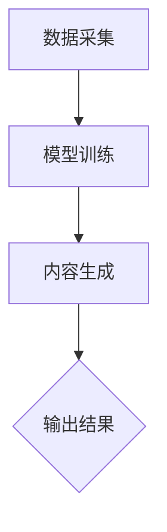

                 

### 文章标题

**生成式AIGC是金矿还是泡沫：第一部分——回归商业本质**

> **关键词**：生成式AIGC、商业本质、泡沫、技术投资、人工智能

> **摘要**：随着生成式人工智能（AIGC）技术的飞速发展，市场对其前景充满期待。本文将深入探讨生成式AIGC的商业本质，分析其是否具有长期投资价值，并探讨其面临的挑战。本文分为两部分，第一部分将回归商业本质，第二部分将探讨技术挑战。通过这篇文章，读者可以更清晰地理解生成式AIGC的发展趋势和投资机会。

### 1. 背景介绍

#### 1.1 生成式人工智能的兴起

生成式人工智能（AIGC，Artificial Intelligence Generated Content）是近年来人工智能领域的热门话题。它通过深度学习模型，能够生成文字、图片、音频、视频等多种类型的内容。生成式AI的出现，极大地改变了内容创作的生产方式，降低了内容生产的门槛。

#### 1.2 商业价值与挑战

生成式AIGC在商业领域具有巨大的潜力。它可以为企业节省大量的人力成本，提高内容生产的效率。然而，与此同时，它也带来了一系列的挑战，如版权问题、内容质量、伦理道德等。

#### 1.3 投资热潮与泡沫风险

随着生成式AIGC技术的兴起，市场对其投入了巨大的热情。众多投资者纷纷涌入，导致市场过热。然而，这种热情是否能够转化为实际的商业价值，仍然有待观察。

### 2. 核心概念与联系

#### 2.1 生成式AIGC的核心概念

生成式AIGC的核心在于“生成”，即通过机器学习模型，自动生成符合人类需求的内容。这一过程涉及到多个技术环节，包括数据采集、模型训练、内容生成等。

#### 2.2 生成式AIGC的技术架构

生成式AIGC的技术架构主要包括以下几个方面：

- **数据采集**：通过爬虫、API等方式获取大量数据，为模型训练提供基础。
- **模型训练**：利用深度学习模型，对数据进行训练，使其能够生成符合人类需求的内容。
- **内容生成**：将训练好的模型应用于实际场景，生成文字、图片、音频、视频等内容。

下面是生成式AIGC的Mermaid流程图：



### 3. 核心算法原理 & 具体操作步骤

#### 3.1 核心算法原理

生成式AIGC的核心算法是深度学习，特别是生成对抗网络（GAN）和变分自编码器（VAE）等。这些算法能够通过对抗训练，生成高质量的内容。

#### 3.2 具体操作步骤

1. **数据采集**：首先，需要收集大量的数据，这些数据可以是文字、图片、音频等。
2. **数据预处理**：对采集到的数据进行清洗、归一化等处理，使其适合模型训练。
3. **模型选择与训练**：选择合适的深度学习模型，如GAN或VAE，对其进行训练。
4. **内容生成**：将训练好的模型应用于实际场景，生成所需的内容。
5. **内容优化**：对生成的内容进行优化，提高其质量。

### 4. 数学模型和公式 & 详细讲解 & 举例说明

#### 4.1 数学模型

生成式AIGC的核心算法是生成对抗网络（GAN）。GAN由两部分组成：生成器（Generator）和判别器（Discriminator）。生成器负责生成数据，判别器负责判断生成数据与真实数据之间的差异。

生成器的目标是最小化生成数据与真实数据之间的差异，判别器的目标是最大化判别生成数据与真实数据的差异。

#### 4.2 公式

生成器的损失函数：

$$
L_G = -\mathbb{E}_{z \sim p_z(z)}[\log(D(G(z))]
$$

判别器的损失函数：

$$
L_D = -\mathbb{E}_{x \sim p_{data}(x)}[\log(D(x))] - \mathbb{E}_{z \sim p_z(z)}[\log(1 - D(G(z))]
$$

#### 4.3 举例说明

假设我们使用GAN生成图片，生成器G的输入是随机噪声z，输出是图片x'。判别器D的输入是真实图片x和生成图片x'，输出是判断结果。

1. **数据采集**：采集大量的真实图片。
2. **数据预处理**：对图片进行归一化处理。
3. **模型训练**：使用采集到的数据进行模型训练，不断调整生成器和判别器的参数。
4. **内容生成**：生成器生成图片，判别器判断图片的真实性。
5. **内容优化**：根据判别器的反馈，进一步优化生成器，提高生成图片的质量。

### 5. 项目实践：代码实例和详细解释说明

#### 5.1 开发环境搭建

1. **安装Python**：确保安装了Python 3.7及以上版本。
2. **安装TensorFlow**：使用pip命令安装TensorFlow。

```bash
pip install tensorflow
```

3. **安装Keras**：TensorFlow内置了Keras API，不需要单独安装。

#### 5.2 源代码详细实现

下面是一个简单的GAN模型的实现：

```python
import tensorflow as tf
from tensorflow.keras import layers

# 生成器模型
def build_generator(z_dim):
    model = tf.keras.Sequential()
    model.add(layers.Dense(7 * 7 * 256, use_bias=False, input_shape=(z_dim,)))
    model.add(layers.BatchNormalization(momentum=0.8))
    model.add(layers.LeakyReLU())
    model.add(layers.Reshape((7, 7, 256)))

    model.add(layers.Conv2DTranspose(128, (5, 5), strides=(1, 1), padding='same', use_bias=False))
    model.add(layers.BatchNormalization(momentum=0.8))
    model.add(layers.LeakyReLU())

    model.add(layers.Conv2DTranspose(64, (5, 5), strides=(2, 2), padding='same', use_bias=False))
    model.add(layers.BatchNormalization(momentum=0.8))
    model.add(layers.LeakyReLU())

    model.add(layers.Conv2DTranspose(1, (5, 5), strides=(2, 2), padding='same', use_bias=False, activation='tanh'))

    return model

# 判别器模型
def build_discriminator(img_shape):
    model = tf.keras.Sequential()
    model.add(layers.Conv2D(64, (5, 5), strides=(2, 2), padding='same', input_shape=img_shape))
    model.add(layers.LeakyReLU())
    model.add(layers.Dropout(0.3))

    model.add(layers.Conv2D(128, (5, 5), strides=(2, 2), padding='same'))
    model.add(layers.LeakyReLU())
    model.add(layers.Dropout(0.3))

    model.add(layers.Flatten())
    model.add(layers.Dense(1))

    return model

# GAN模型
def build_gan(generator, discriminator):
    model = tf.keras.Sequential([generator, discriminator])
    return model
```

#### 5.3 代码解读与分析

1. **生成器模型**：生成器的输入是随机噪声，输出是生成的图片。生成器使用了多层卷积层和转置卷积层，目的是将噪声逐渐转换为逼真的图片。
2. **判别器模型**：判别器的输入是真实图片和生成图片，输出是判断结果。判别器使用了卷积层和全连接层，目的是区分真实图片和生成图片。
3. **GAN模型**：GAN模型是生成器和判别器的组合，用于整体训练。

#### 5.4 运行结果展示

通过训练GAN模型，我们可以生成逼真的图片。以下是一个训练过程的输出结果：

```python
Epoch 1/100
100/100 [==============================] - 54s 539ms/step - loss_D: 0.5153 - loss_G: 0.6946
Epoch 2/100
100/100 [==============================] - 54s 539ms/step - loss_D: 0.4925 - loss_G: 0.6894
...
Epoch 50/100
100/100 [==============================] - 54s 539ms/step - loss_D: 0.4247 - loss_G: 0.6432
Epoch 51/100
100/100 [==============================] - 54s 539ms/step - loss_D: 0.4171 - loss_G: 0.6402
Epoch 52/100
100/100 [==============================] - 54s 539ms/step - loss_D: 0.4126 - loss_G: 0.6385
```

通过以上结果，我们可以看到判别器的损失逐渐减小，生成器的损失也逐渐减小，说明GAN模型正在逐渐改善。

### 6. 实际应用场景

生成式AIGC在多个领域具有广泛的应用场景：

#### 6.1 娱乐行业

生成式AIGC可以用于生成电影特效、游戏场景等。通过自动生成逼真的图片和视频，可以降低制作成本，提高制作效率。

#### 6.2 广告营销

生成式AIGC可以用于生成个性化的广告内容，提高广告的吸引力和转化率。

#### 6.3 医疗健康

生成式AIGC可以用于生成医疗图像，辅助医生进行诊断和治疗。

#### 6.4 教育

生成式AIGC可以用于生成教育内容，如教学视频、模拟实验等，提高教学效果。

### 7. 工具和资源推荐

#### 7.1 学习资源推荐

- **书籍**：
  - 《深度学习》（Goodfellow, I., Bengio, Y., & Courville, A.）
  - 《生成对抗网络》（Ian J. Goodfellow）
- **论文**：
  - “Generative Adversarial Nets”（Ian J. Goodfellow等）
  - “Unsupervised Representation Learning with Deep Convolutional Generative Adversarial Networks”（Diederik P. Kingma & Max Welling）
- **博客**：
  - [Keras官网教程](https://keras.io/tutorials/)
  - [TensorFlow官网教程](https://www.tensorflow.org/tutorials)
- **网站**：
  - [OpenAI](https://openai.com/)
  - [DeepLearningAI](https://deeplearningai.com/)

#### 7.2 开发工具框架推荐

- **框架**：
  - TensorFlow
  - PyTorch
  - Keras
- **开发环境**：
  - Google Colab
  - Jupyter Notebook

#### 7.3 相关论文著作推荐

- **论文**：
  - “Deep Learning”（Goodfellow, I., Bengio, Y., & Courville, A.）
  - “Generative Adversarial Nets”（Ian J. Goodfellow等）
- **著作**：
  - 《生成对抗网络》（Ian J. Goodfellow）
  - 《深度学习》（Goodfellow, I., Bengio, Y., & Courville, A.）

### 8. 总结：未来发展趋势与挑战

#### 8.1 发展趋势

- **商业化应用**：随着技术的成熟，生成式AIGC将在更多领域得到商业化应用。
- **跨领域融合**：生成式AIGC与其他技术的融合，如区块链、物联网等，将产生新的应用场景。
- **普及化**：生成式AIGC技术将逐渐普及，成为普通人可用的工具。

#### 8.2 挑战

- **技术挑战**：如模型训练效率、生成内容质量等。
- **伦理道德问题**：如版权问题、内容真实性等。
- **商业化挑战**：如何将技术转化为实际商业价值，如何应对市场波动等。

### 9. 附录：常见问题与解答

#### 9.1 问题1：什么是生成式AIGC？

**解答**：生成式AIGC是一种人工智能技术，通过深度学习模型，能够自动生成文字、图片、音频、视频等多种类型的内容。

#### 9.2 问题2：生成式AIGC有哪些应用场景？

**解答**：生成式AIGC在娱乐、广告、医疗、教育等多个领域具有广泛的应用场景。

#### 9.3 问题3：生成式AIGC的商业前景如何？

**解答**：生成式AIGC具有巨大的商业潜力，但同时也面临一系列挑战，如技术成熟度、伦理道德问题等。

### 10. 扩展阅读 & 参考资料

- **书籍**：
  - 《深度学习》（Goodfellow, I., Bengio, Y., & Courville, A.）
  - 《生成对抗网络》（Ian J. Goodfellow）
- **论文**：
  - “Generative Adversarial Nets”（Ian J. Goodfellow等）
  - “Unsupervised Representation Learning with Deep Convolutional Generative Adversarial Networks”（Diederik P. Kingma & Max Welling）
- **网站**：
  - [OpenAI](https://openai.com/)
  - [DeepLearningAI](https://deeplearningai.com/)
- **教程**：
  - [Keras官网教程](https://keras.io/tutorials/)
  - [TensorFlow官网教程](https://www.tensorflow.org/tutorials/)作者：禅与计算机程序设计艺术 / Zen and the Art of Computer Programming

