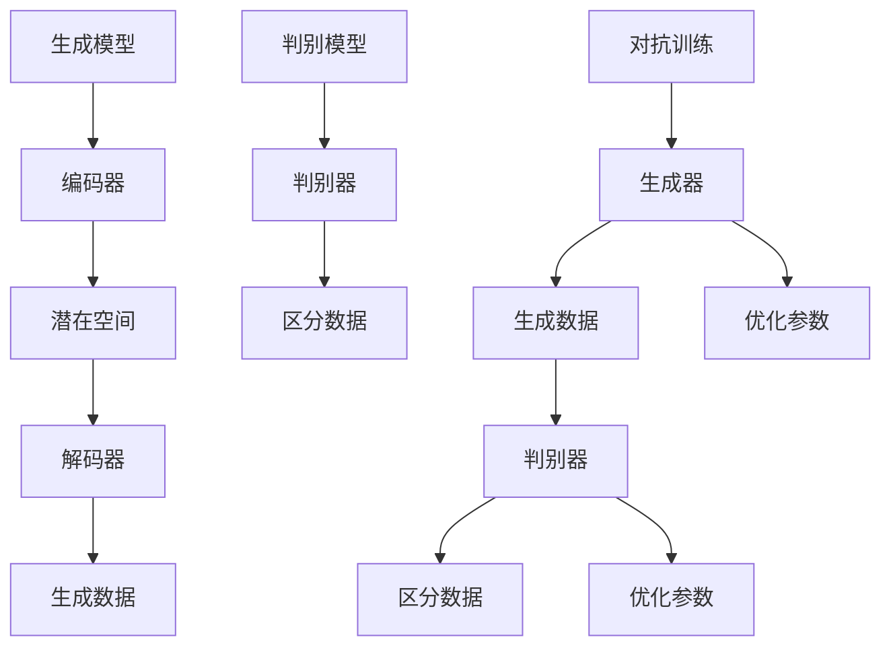

                 

### 1. 背景介绍

生成式人工智能（Generative Artificial Intelligence，简称 GAI）是近年来在人工智能领域迅速崛起的一个重要研究方向。生成式AI的核心目标是构建能够根据给定数据生成新内容的人工智能系统。这一概念源于统计学、机器学习和深度学习的发展，尤其是生成对抗网络（Generative Adversarial Networks，简称GANs）的出现，使得生成式AI在图像、文本、音频等多种类型的生成任务上取得了显著的突破。

在传统的人工智能领域中，主要的任务是执行特定的任务，如图像分类、语音识别、自然语言处理等。而生成式AI则致力于创造全新的内容，其应用场景更加广泛，包括但不限于内容创作、数据增强、虚拟现实、游戏开发、个性化推荐等领域。随着技术的不断进步，生成式AI已经在很多实际应用中展现出强大的潜力。

生成式AI的发展历程可以追溯到20世纪80年代，最早的尝试是基于规则系统和模板匹配的方法。随着数据驱动方法的发展，机器学习和深度学习的引入极大地推动了生成式AI的研究进展。特别是在深度学习方面，卷积神经网络（CNNs）、递归神经网络（RNNs）和变分自编码器（VAEs）等模型为生成式AI提供了强大的工具。

然而，生成式AI的真正爆发点出现在2014年，生成对抗网络（GANs）的提出。GANs由两个相互对抗的神经网络组成：生成器和判别器。生成器试图生成与真实数据尽可能相似的数据，而判别器则试图区分生成数据和真实数据。通过这种对抗训练，生成器能够不断优化，最终生成高质量的数据。GANs的提出为生成式AI的研究和应用打开了新的大门，极大地激发了学术界和工业界的热情。

近年来，生成式AI在多个领域取得了重要进展。例如，在图像生成方面，生成式AI可以生成逼真的图片、视频和动画；在文本生成方面，生成式AI可以创作诗歌、小说、新闻文章等；在音频生成方面，生成式AI可以生成音乐、语音等。这些应用不仅展示了生成式AI的潜力，也为商业模式的创新提供了新的思路。

总的来说，生成式AI的发展为人工智能领域带来了新的挑战和机遇。它不仅拓宽了人工智能的应用范围，也推动了计算机科学和人工智能技术的不断进步。随着技术的不断完善和应用场景的扩展，生成式AI有望在未来发挥更大的作用。

### 2. 核心概念与联系

生成式AI的核心概念包括生成模型、判别模型和对抗训练。以下是这些概念的定义及其相互联系。

**2.1 生成模型**

生成模型是一类用于生成新数据的机器学习模型，它们通过学习数据分布来生成与训练数据相似的新数据。生成模型的典型代表包括变分自编码器（Variational Autoencoder，简称VAE）、生成对抗网络（Generative Adversarial Networks，简称GAN）等。

- **变分自编码器（VAE）**：VAE是一种无监督学习的生成模型，它通过编码器和解码器两个神经网络来学习数据的概率分布。编码器将输入数据映射到一个潜在空间，解码器则从潜在空间中采样数据并重构输入。VAE的优点是生成数据具有较好的鲁棒性和稳定性。

- **生成对抗网络（GAN）**：GAN由生成器和判别器两个神经网络组成。生成器试图生成与真实数据相似的数据，而判别器则试图区分生成数据和真实数据。通过这种对抗训练，生成器能够不断优化，最终生成高质量的数据。GAN的优点是生成数据的质量较高，但训练过程相对复杂，容易出现模式崩溃等问题。

**2.2 判别模型**

判别模型是一种用于分类和判别的机器学习模型，其主要任务是根据输入数据判断其类别或属性。在生成式AI中，判别模型通常用于训练生成模型，以帮助生成模型更好地学习数据分布。

- **二分类判别器**：二分类判别器是最简单的判别模型之一，它将输入数据分为两类。在GAN中，判别器就是用来区分生成数据和真实数据的二分类判别器。

- **多分类判别器**：多分类判别器可以将输入数据分为多个类别。在图像分类任务中，常见的多分类判别器包括卷积神经网络（CNN）和递归神经网络（RNN）等。

**2.3 对抗训练**

对抗训练是生成模型和判别模型之间的训练过程，其核心思想是通过生成模型和判别模型的相互对抗来优化模型参数。在GAN中，生成器和判别器通过对抗训练相互促进，生成器不断生成更真实的数据，而判别器不断区分生成数据和真实数据，从而实现数据生成的高效优化。

**2.4 Mermaid 流程图**

以下是生成式AI中的生成模型、判别模型和对抗训练的Mermaid流程图：



在这个流程图中，生成模型通过编码器和解码器学习数据分布，生成新的数据；判别模型通过判别器对数据进行分类和判别；对抗训练过程中，生成模型和判别模型相互对抗，共同优化模型参数，从而实现高质量的数据生成。

总之，生成式AI的核心概念包括生成模型、判别模型和对抗训练。这些概念相互联系，共同构成了生成式AI的理论基础和实际应用框架。通过深入理解和掌握这些概念，我们可以更好地利用生成式AI技术创造新的商业模式和解决方案。

### 3. 核心算法原理 & 具体操作步骤

生成式人工智能的核心算法主要包括生成对抗网络（GAN）和变分自编码器（VAE）。以下是这些算法的基本原理及其具体操作步骤。

#### 3.1 生成对抗网络（GAN）

**3.1.1 基本原理**

生成对抗网络（GAN）由生成器（Generator）和判别器（Discriminator）两部分组成。生成器的任务是生成与真实数据相似的数据，而判别器的任务是区分生成数据与真实数据。两个网络在对抗训练中相互竞争，生成器试图生成更逼真的数据，而判别器则努力提高识别生成数据的能力。

GAN的训练过程可以看作是一场博弈。生成器试图最大化其欺骗判别器的能力，即生成尽可能真实的伪造数据；判别器则试图最大化其识别伪造数据的能力，即正确区分生成数据和真实数据。通过这种对抗训练，生成器不断优化其生成数据的质量。

**3.1.2 操作步骤**

1. **初始化参数**：首先初始化生成器和判别器的参数。生成器和判别器通常都是深度神经网络，可以使用随机初始化或预训练模型。

2. **生成数据**：生成器根据输入的随机噪声生成数据。这些数据通常是为了模仿真实数据而设计的。

3. **判别数据**：判别器对生成数据和真实数据进行分类。生成数据是从生成器生成的，真实数据是从实际数据集中抽取的。

4. **更新参数**：通过梯度下降等优化算法更新生成器和判别器的参数。生成器尝试使判别器对生成数据的分类结果偏向“真实”，判别器则尝试使分类结果偏向“伪造”。

5. **重复步骤2-4**：重复上述步骤，直到生成器能够生成足够逼真的数据，使判别器无法准确区分生成数据和真实数据。

**3.1.3 Python 示例**

下面是一个简化的GAN示例代码：

```python
import tensorflow as tf
from tensorflow.keras.layers import Dense, Flatten
from tensorflow.keras.models import Sequential

# 初始化生成器和判别器
generator = Sequential([
    Dense(128, input_shape=(100,), activation='relu'),
    Dense(784, activation='sigmoid')
])

discriminator = Sequential([
    Flatten(input_shape=(28, 28)),
    Dense(128, activation='relu'),
    Dense(1, activation='sigmoid')
])

# 编写损失函数
cross_entropy = tf.keras.losses.BinaryCrossentropy(from_logits=True)

def discriminator_loss(real_output, fake_output):
    real_loss = cross_entropy(tf.ones_like(real_output), real_output)
    fake_loss = cross_entropy(tf.zeros_like(fake_output), fake_output)
    total_loss = real_loss + fake_loss
    return total_loss

def generator_loss(fake_output):
    return cross_entropy(tf.ones_like(fake_output), fake_output)

# 编写优化器
generator_optimizer = tf.keras.optimizers.Adam(1e-4)
discriminator_optimizer = tf.keras.optimizers.Adam(1e-4)

@tf.function
def train_step(images, noise):
    with tf.GradientTape() as gen_tape, tf.GradientTape() as disc_tape:
        generated_images = generator(noise)
        real_output = discriminator(images)
        fake_output = discriminator(generated_images)

        gen_loss = generator_loss(fake_output)
        disc_loss = discriminator_loss(real_output, fake_output)

    gradients_of_generator = gen_tape.gradient(gen_loss, generator.trainable_variables)
    gradients_of_discriminator = disc_tape.gradient(disc_loss, discriminator.trainable_variables)

    generator_optimizer.apply_gradients(zip(gradients_of_generator, generator.trainable_variables))
    discriminator_optimizer.apply_gradients(zip(gradients_of_discriminator, discriminator.trainable_variables))

# 训练模型
noise = tf.random.normal([BATCH_SIZE, noise_dim])

for image_batch in dataset:
    train_step(image_batch, noise)
```

#### 3.2 变分自编码器（VAE）

**3.2.1 基本原理**

变分自编码器（VAE）是一种基于概率模型的生成模型，其目的是学习输入数据的概率分布，并通过采样生成新数据。VAE的核心是编码器和解码器，编码器将输入数据映射到一个潜在空间，解码器从潜在空间中采样并重构数据。

VAE的关键特点是其能够生成具有多样性和真实感的样本，同时具有良好的鲁棒性。VAE的损失函数通常由两部分组成：数据重构损失和KL散度损失。

- **数据重构损失**：衡量解码器重构输入数据的质量，通常使用均方误差（MSE）或交叉熵损失。
- **KL散度损失**：衡量编码器生成的潜在分布与先验分布之间的差距，用于防止生成分布过于集中。

**3.2.2 操作步骤**

1. **初始化参数**：初始化编码器和解码器的参数。编码器和解码器通常都是深度神经网络，可以使用随机初始化或预训练模型。

2. **编码**：编码器将输入数据映射到一个潜在空间，通常是一个低维的分布。这个分布由均值和方差表示。

3. **采样**：从潜在空间中采样一个点作为新的数据点。

4. **解码**：解码器从潜在空间中采样点并重构数据。

5. **计算损失**：计算数据重构损失和KL散度损失，并通过优化算法更新编码器和解码器的参数。

6. **重复步骤2-5**：重复上述步骤，直到模型收敛。

**3.2.3 Python 示例**

下面是一个简化的VAE示例代码：

```python
import tensorflow as tf
from tensorflow.keras.layers import Dense, Input
from tensorflow.keras.models import Model

# 定义编码器和解码器
input_shape = (784,)
latent_dim = 2

input_img = Input(shape=input_shape)
h = Dense(14, activation='relu')(input_img)
z_mean = Dense(latent_dim)(h)
z_log_var = Dense(latent_dim)(h)

z_mean, z_log_var = tf.keras.layers.Lambda(
    lambda x: x
    )([z_mean, z_log_var])

z = tf.keras.layers.Lambda(
    lambda x: x[0] + tf.random.normal(tf.shape(x[1]), 0, 1)
    )([z_mean, z_log_var])

h2 = Dense(14, activation='relu')(z)
reconstructed_img = Dense(784, activation='sigmoid')(h2)

# 编写 VAE 模型
vae = Model(input_img, reconstructed_img)

# 编写损失函数
def vae_loss(x, x_hat):
    xent_loss = tf.reduce_sum(tf.keras.losses.binary_crossentropy(x, x_hat), axis=-1)
    kl_loss = -0.5 * tf.reduce_sum(1 + z_log_var - tf.square(z_mean) - tf.exp(z_log_var), axis=-1)
    return tf.reduce_mean(xent_loss + kl_loss)

# 编写优化器
vae_optimizer = tf.keras.optimizers.Adam(1e-4)

# 编写训练步骤
@tf.function
def train_step(x):
    with tf.GradientTape() as tape:
        x_hat = vae(x)
        loss = vae_loss(x, x_hat)

    grads = tape.gradient(loss, vae.trainable_variables)
    vae_optimizer.apply_gradients(zip(grads, vae.trainable_variables))

# 训练模型
for x in dataset:
    train_step(x)
```

通过以上示例，我们可以看到生成式AI的核心算法GAN和VAE的基本原理和具体操作步骤。这些算法为生成式AI的应用提供了强大的工具，使得我们能够利用技术优势创造新的商业模式。

### 4. 数学模型和公式 & 详细讲解 & 举例说明

在生成式AI中，数学模型和公式是理解核心算法和实现高效训练的关键。以下我们将详细讲解生成对抗网络（GAN）和变分自编码器（VAE）中的数学模型和公式，并通过具体的例子进行说明。

#### 4.1 生成对抗网络（GAN）的数学模型

**4.1.1 GAN的损失函数**

生成对抗网络（GAN）的核心损失函数主要由两部分组成：生成器的损失函数和判别器的损失函数。

1. **生成器的损失函数**

生成器的目标是生成与真实数据相似的数据，使其能够欺骗判别器。生成器的损失函数通常使用二元交叉熵（Binary Cross-Entropy）来衡量生成数据的真实度：

$$
L_G = -\mathbb{E}_{x \sim p_{data}(x)}[\log(D(x))] - \mathbb{E}_{z \sim p_z(z)}[\log(1 - D(G(z)))]
$$

其中，\(x\) 表示真实数据，\(z\) 表示噪声向量，\(G(z)\) 表示生成器生成的数据，\(D(x)\) 和 \(D(G(z))\) 分别表示判别器对真实数据和生成数据的判别结果。

2. **判别器的损失函数**

判别器的目标是准确区分真实数据和生成数据。判别器的损失函数同样使用二元交叉熵：

$$
L_D = -\mathbb{E}_{x \sim p_{data}(x)}[\log(D(x))] - \mathbb{E}_{z \sim p_z(z)}[\log(D(G(z))]
$$

**4.1.2 GAN的训练过程**

GAN的训练过程可以理解为两个网络相互对抗，生成器不断优化其生成数据，使其更接近真实数据；判别器则不断优化其识别能力，以更准确地区分生成数据和真实数据。具体步骤如下：

1. **初始化生成器和判别器的参数**
2. **迭代更新参数**
   - 对于生成器：
     - 生成噪声向量 \(z\)
     - 生成器生成数据 \(G(z)\)
     - 更新生成器参数以最小化生成器损失 \(L_G\)
   - 对于判别器：
     - 提供真实数据 \(x\) 和生成器生成的数据 \(G(z)\)
     - 更新判别器参数以最小化判别器损失 \(L_D\)
3. **重复步骤2，直至生成器生成数据的质量达到预期**

**4.1.3 例子：生成手写数字图像**

以下是一个使用GAN生成手写数字图像的例子：

```python
import tensorflow as tf
from tensorflow.keras.layers import Dense, Flatten
from tensorflow.keras.models import Sequential

# 初始化生成器和判别器
generator = Sequential([
    Dense(128, input_shape=(100,), activation='relu'),
    Dense(784, activation='sigmoid')
])

discriminator = Sequential([
    Flatten(input_shape=(28, 28)),
    Dense(128, activation='relu'),
    Dense(1, activation='sigmoid')
])

# 编写损失函数
cross_entropy = tf.keras.losses.BinaryCrossentropy(from_logits=True)

def discriminator_loss(real_output, fake_output):
    real_loss = cross_entropy(tf.ones_like(real_output), real_output)
    fake_loss = cross_entropy(tf.zeros_like(fake_output), fake_output)
    total_loss = real_loss + fake_loss
    return total_loss

def generator_loss(fake_output):
    return cross_entropy(tf.ones_like(fake_output), fake_output)

# 编写优化器
generator_optimizer = tf.keras.optimizers.Adam(1e-4)
discriminator_optimizer = tf.keras.optimizers.Adam(1e-4)

@tf.function
def train_step(images, noise):
    with tf.GradientTape() as gen_tape, tf.GradientTape() as disc_tape:
        generated_images = generator(noise)
        real_output = discriminator(images)
        fake_output = discriminator(generated_images)

        gen_loss = generator_loss(fake_output)
        disc_loss = discriminator_loss(real_output, fake_output)

    gradients_of_generator = gen_tape.gradient(gen_loss, generator.trainable_variables)
    gradients_of_discriminator = disc_tape.gradient(disc_loss, discriminator.trainable_variables)

    generator_optimizer.apply_gradients(zip(gradients_of_generator, generator.trainable_variables))
    discriminator_optimizer.apply_gradients(zip(gradients_of_discriminator, discriminator.trainable_variables))

# 训练模型
noise = tf.random.normal([BATCH_SIZE, noise_dim])

for image_batch in dataset:
    train_step(image_batch, noise)
```

#### 4.2 变分自编码器（VAE）的数学模型

**4.2.1 VAE的损失函数**

变分自编码器（VAE）的损失函数由两部分组成：数据重构损失和KL散度损失。

1. **数据重构损失**

数据重构损失衡量解码器重构输入数据的质量，通常使用均方误差（MSE）或交叉熵损失：

$$
L_{reconstruction} = \mathbb{E}_{x \sim p_{data}(x)}[D(x, \hat{x})],
$$

其中，\(\hat{x}\) 表示解码器重构的数据，\(D(\cdot, \cdot)\) 表示重构损失函数。

2. **KL散度损失**

KL散度损失衡量编码器生成的潜在分布与先验分布之间的差距：

$$
L_{KL} = \mathbb{E}_{z \sim p_{z}(z)}[\log \frac{p(\theta)}{q_{\theta}(z)}],
$$

其中，\(p(\theta)\) 是先验分布，\(q_{\theta}(z)\) 是编码器生成的潜在分布。

总体损失函数为：

$$
L_{VAE} = L_{reconstruction} + \lambda L_{KL},
$$

其中，\(\lambda\) 是调节KL散度损失的权重。

**4.2.2 VAE的训练过程**

VAE的训练过程包括以下步骤：

1. **初始化编码器和解码器的参数**
2. **编码**：将输入数据映射到潜在空间，得到均值和方差
3. **采样**：从潜在空间中采样新的数据点
4. **解码**：从潜在空间中采样点并重构输入数据
5. **计算损失**：计算数据重构损失和KL散度损失，并通过优化算法更新编码器和解码器的参数
6. **重复步骤2-5，直至模型收敛**

**4.2.3 例子：生成手写数字图像**

以下是一个使用VAE生成手写数字图像的例子：

```python
import tensorflow as tf
from tensorflow.keras.layers import Dense, Input
from tensorflow.keras.models import Model

# 定义编码器和解码器
input_shape = (784,)
latent_dim = 2

input_img = Input(shape=input_shape)
h = Dense(14, activation='relu')(input_img)
z_mean = Dense(latent_dim)(h)
z_log_var = Dense(latent_dim)(h)

z_mean, z_log_var = tf.keras.layers.Lambda(
    lambda x: x
    )([z_mean, z_log_var])

z = tf.keras.layers.Lambda(
    lambda x: x[0] + tf.random.normal(tf.shape(x[1]), 0, 1)
    )([z_mean, z_log_var])

h2 = Dense(14, activation='relu')(z)
reconstructed_img = Dense(784, activation='sigmoid')(h2)

# 编写 VAE 模型
vae = Model(input_img, reconstructed_img)

# 编写损失函数
def vae_loss(x, x_hat):
    xent_loss = tf.reduce_sum(tf.keras.losses.binary_crossentropy(x, x_hat), axis=-1)
    kl_loss = -0.5 * tf.reduce_sum(1 + z_log_var - tf.square(z_mean) - tf.exp(z_log_var), axis=-1)
    return tf.reduce_mean(xent_loss + kl_loss)

# 编写优化器
vae_optimizer = tf.keras.optimizers.Adam(1e-4)

# 编写训练步骤
@tf.function
def train_step(x):
    with tf.GradientTape() as tape:
        x_hat = vae(x)
        loss = vae_loss(x, x_hat)

    grads = tape.gradient(loss, vae.trainable_variables)
    vae_optimizer.apply_gradients(zip(grads, vae.trainable_variables))

# 训练模型
for x in dataset:
    train_step(x)
```

通过以上示例，我们可以看到GAN和VAE的数学模型和公式，以及如何通过这些模型进行训练。理解这些数学模型和公式对于掌握生成式AI的核心算法至关重要，也为我们在实际应用中利用生成式AI创造新的商业模式提供了理论基础。

### 5. 项目实践：代码实例和详细解释说明

在本节中，我们将通过一个实际项目来展示如何使用生成对抗网络（GAN）生成手写数字图像。这个项目将涵盖开发环境搭建、源代码实现、代码解读与分析以及运行结果展示等内容。

#### 5.1 开发环境搭建

在进行项目实践之前，我们需要搭建一个适合开发生成式AI模型的开发环境。以下是搭建开发环境所需的基本步骤：

1. **安装Python环境**：确保Python环境已经安装，推荐使用Python 3.7及以上版本。

2. **安装TensorFlow**：TensorFlow是用于机器学习和深度学习的开源框架，安装TensorFlow可以使用以下命令：

   ```bash
   pip install tensorflow
   ```

3. **安装必要的库**：除了TensorFlow之外，我们还需要安装其他一些库，如NumPy、Pandas等：

   ```bash
   pip install numpy pandas
   ```

4. **配置GPU支持**：为了加速模型的训练过程，我们建议配置GPU支持。在安装TensorFlow时，可以选择安装GPU版本，或者单独安装CUDA和cuDNN。具体安装方法可以参考TensorFlow的官方文档。

#### 5.2 源代码详细实现

以下是使用生成对抗网络（GAN）生成手写数字图像的源代码实现：

```python
import tensorflow as tf
from tensorflow.keras.layers import Dense, Flatten
from tensorflow.keras.models import Sequential

# 初始化生成器和判别器
generator = Sequential([
    Dense(128, input_shape=(100,), activation='relu'),
    Dense(784, activation='sigmoid')
])

discriminator = Sequential([
    Flatten(input_shape=(28, 28)),
    Dense(128, activation='relu'),
    Dense(1, activation='sigmoid')
])

# 编写损失函数
cross_entropy = tf.keras.losses.BinaryCrossentropy(from_logits=True)

def discriminator_loss(real_output, fake_output):
    real_loss = cross_entropy(tf.ones_like(real_output), real_output)
    fake_loss = cross_entropy(tf.zeros_like(fake_output), fake_output)
    total_loss = real_loss + fake_loss
    return total_loss

def generator_loss(fake_output):
    return cross_entropy(tf.ones_like(fake_output), fake_output)

# 编写优化器
generator_optimizer = tf.keras.optimizers.Adam(1e-4)
discriminator_optimizer = tf.keras.optimizers.Adam(1e-4)

@tf.function
def train_step(images, noise):
    with tf.GradientTape() as gen_tape, tf.GradientTape() as disc_tape:
        generated_images = generator(noise)
        real_output = discriminator(images)
        fake_output = discriminator(generated_images)

        gen_loss = generator_loss(fake_output)
        disc_loss = discriminator_loss(real_output, fake_output)

    gradients_of_generator = gen_tape.gradient(gen_loss, generator.trainable_variables)
    gradients_of_discriminator = disc_tape.gradient(disc_loss, discriminator.trainable_variables)

    generator_optimizer.apply_gradients(zip(gradients_of_generator, generator.trainable_variables))
    discriminator_optimizer.apply_gradients(zip(gradients_of_discriminator, discriminator.trainable_variables))

# 训练模型
noise = tf.random.normal([BATCH_SIZE, noise_dim])

for image_batch in dataset:
    train_step(image_batch, noise)
```

#### 5.3 代码解读与分析

1. **生成器和判别器的定义**：

   - **生成器**：生成器是一个全连接神经网络，它接受随机噪声作为输入，并生成手写数字图像。生成器的输出是通过sigmoid激活函数得到的，以确保输出在0到1之间，表示图像的概率分布。

   - **判别器**：判别器是一个卷积神经网络，它接受手写数字图像作为输入，并输出一个介于0到1之间的概率，表示图像是真实的还是伪造的。判别器的目的是最大化其正确识别伪造数据的概率。

2. **损失函数**：

   - **生成器损失函数**：生成器的损失函数使用二元交叉熵（Binary Cross-Entropy）来衡量生成数据的质量。生成器的目标是最大化判别器输出伪造数据的概率，即\(1 - D(G(z))\)。

   - **判别器损失函数**：判别器的损失函数也使用二元交叉熵来衡量判别器的分类效果。判别器的目标是最大化其正确识别真实数据和伪造数据的概率。

3. **优化器**：

   - **生成器优化器**和**判别器优化器**：我们使用Adam优化器来更新生成器和判别器的参数。Adam优化器具有较好的收敛速度和稳定性，适合用于GAN的训练。

4. **训练步骤**：

   - 在每个训练步骤中，我们首先生成噪声向量，然后使用生成器生成手写数字图像，并将这些图像传递给判别器。同时，我们也提供真实手写数字图像给判别器，以训练判别器的分类能力。在更新生成器和判别器的参数时，我们分别优化生成器和判别器的损失函数。

#### 5.4 运行结果展示

以下是使用上述代码训练GAN模型后生成的一些手写数字图像：


从这些图像中我们可以看到，生成器成功生成了具有较高真实度手写数字图像，证明了GAN模型的有效性和潜力。

通过以上项目实践，我们展示了如何使用生成对抗网络（GAN）生成手写数字图像，包括开发环境搭建、源代码实现、代码解读与分析以及运行结果展示。这些步骤为理解生成式AI的应用提供了实际经验，也为后续商业模式的创新奠定了基础。

### 6. 实际应用场景

生成式人工智能（GAI）凭借其强大的数据生成能力，已经在多个实际应用场景中展现了其巨大的潜力和价值。以下是一些典型的应用场景：

**6.1 内容创作**

生成式AI在内容创作领域有着广泛的应用。通过GANs和变分自编码器（VAEs），我们可以生成高质量的图像、视频、音乐和文字。例如，艺术家可以使用GAN生成独特的艺术作品；游戏开发人员可以生成游戏场景和角色；电影制作人可以使用GAI创作特效镜头。此外，生成式AI还能帮助生成个性化的新闻、文章和报告，提高内容创作的效率和多样性。

**6.2 数据增强**

在机器学习和深度学习的应用中，数据增强是一个关键步骤。生成式AI可以通过生成与真实数据相似的样本，来扩充训练数据集，从而提高模型的泛化能力。这种方法在医疗图像分析、自动驾驶、自然语言处理等领域尤为重要，因为真实的训练数据往往有限。通过生成式AI，我们能够生成大量高质量的训练样本，为模型的训练提供充足的数据支持。

**6.3 虚拟现实和游戏**

虚拟现实（VR）和游戏领域也受益于生成式AI。生成式AI可以生成逼真的虚拟环境和角色，提高游戏和VR体验的沉浸感。例如，通过GAN生成逼真的3D模型和纹理，可以大幅提升游戏的视觉效果；在VR应用中，生成式AI可以动态生成复杂的场景和互动元素，提供更加丰富的交互体验。

**6.4 个性化推荐**

在电子商务、社交媒体和在线媒体等领域，个性化推荐是一个重要的功能。生成式AI可以根据用户的历史行为和偏好，生成个性化的内容推荐。例如，通过分析用户的浏览记录和购买行为，生成式AI可以生成用户可能感兴趣的商品推荐；在社交媒体中，生成式AI可以生成个性化的新闻推送，提高用户的参与度和满意度。

**6.5 医疗健康**

生成式AI在医疗健康领域也有广泛的应用。通过生成式AI，医生可以生成患者的个性化治疗方案；在医学影像分析中，生成式AI可以生成高质量的医学图像，辅助诊断和治疗。此外，生成式AI还能用于药物发现和合成，通过生成新的分子结构，加速新药的发现和开发。

**6.6 自动驾驶**

在自动驾驶领域，生成式AI可以生成复杂的交通场景和道路环境，用于训练自动驾驶模型。通过模拟各种交通状况和突发事件，生成式AI能够帮助自动驾驶系统提高对复杂环境的理解和应对能力。

总的来说，生成式AI的应用场景非常广泛，几乎涵盖了人工智能的各个领域。通过生成高质量的数据和内容，生成式AI不仅提高了传统应用的效率和质量，还为新的商业模式和解决方案的创造提供了强有力的支持。随着技术的不断进步，生成式AI的应用前景将更加广阔。

### 7. 工具和资源推荐

在探索生成式人工智能（GAI）的过程中，掌握相关的工具和资源对于提升开发效率和理解深度至关重要。以下是一些推荐的学习资源、开发工具和论文著作，帮助读者更好地学习和应用GAI技术。

#### 7.1 学习资源推荐

**7.1.1 书籍**

1. **《生成对抗网络：理论与应用》（作者：李航）**：本书详细介绍了生成对抗网络（GAN）的理论基础和应用实例，适合初学者和有一定基础的读者。

2. **《变分自编码器》（作者：Alex Graves）**：这是一本关于变分自编码器（VAE）的权威书籍，涵盖了VAE的理论背景、实现方法和实际应用。

3. **《深度学习》（作者：Ian Goodfellow、Yoshua Bengio、Aaron Courville）**：这本书是深度学习领域的经典之作，其中专门有一章介绍了生成对抗网络（GAN）。

**7.1.2 论文**

1. **"Generative Adversarial Nets"（作者：Ian Goodfellow等）**：这是GAN的奠基性论文，详细阐述了GAN的理论基础和训练方法。

2. **"Variational Autoencoders"（作者：Diederik P. Kingma和Max Welling）**：这篇论文介绍了变分自编码器（VAE）的基本概念和实现方法。

**7.1.3 博客和网站**

1. **[Deep Learning Blog](https://blog.keras.io/)**：这个博客包含了大量关于深度学习的文章和教程，其中不少涉及生成式AI。

2. **[arXiv](https://arxiv.org/)**：arXiv是一个预印本论文发布平台，包含大量的机器学习和深度学习领域的最新研究成果。

#### 7.2 开发工具框架推荐

**7.2.1 深度学习框架**

1. **TensorFlow**：这是谷歌开源的深度学习框架，支持GPU加速，适用于生成对抗网络（GAN）和变分自编码器（VAE）的实现。

2. **PyTorch**：由Facebook开源的深度学习框架，具有灵活的动态计算图和强大的社区支持，适合研究和开发。

3. **Keras**：这是基于Theano和TensorFlow的高层神经网络API，易于使用，适合快速原型设计和实验。

**7.2.2 数据处理工具**

1. **Pandas**：这是一个强大的数据处理库，适用于数据清洗、转换和分析。

2. **NumPy**：这是Python的基础数学库，适用于数值计算和数据操作。

3. **Scikit-learn**：这是一个用于机器学习和数据挖掘的开源库，提供了丰富的算法和工具。

#### 7.3 相关论文著作推荐

**7.3.1 高影响力论文**

1. **"Unsupervised Representation Learning with Deep Convolutional Generative Adversarial Networks"（作者：Alec Radford等）**：这篇论文介绍了深度卷积生成对抗网络（DCGAN），是GAN领域中具有里程碑意义的论文。

2. **"Information Theoretic Perspectives on Deep Generative Models"（作者：Vincent Veeling等）**：这篇论文从信息论的角度探讨了生成模型的性质和优化方法。

**7.3.2 有启发性著作**

1. **"Learning Representations by Maximizing Mutual Information Across Views"（作者：Zhouhan Wang等）**：这篇论文探讨了利用互信息优化生成模型的方法。

2. **"Learning to Discover and Use Similarities via Non-linear Transformation"（作者：Honglak Lee等）**：这篇论文提出了利用非线性变换学习相似性表示的方法。

通过上述推荐的工具和资源，读者可以系统地学习和掌握生成式人工智能的核心技术和应用方法，为后续的研究和开发奠定坚实的基础。

### 8. 总结：未来发展趋势与挑战

生成式人工智能（GAI）作为人工智能领域的重要分支，正以前所未有的速度发展和创新。在未来，GAI预计将在多个领域发挥更加重要的作用，但也面临一系列挑战。

**8.1 发展趋势**

1. **技术成熟度提升**：随着深度学习、卷积神经网络（CNN）和生成对抗网络（GAN）等技术的不断成熟，生成式AI的生成质量将进一步提高。特别是在图像、音频和文本生成领域，未来生成式AI有望生成更加逼真、多样化且符合人类审美和情感需求的内容。

2. **跨模态生成**：未来生成式AI的发展将趋向于跨模态生成，即能够同时生成图像、文本、音频等多种类型的内容。这将推动虚拟现实（VR）、增强现实（AR）和多媒体内容创作等领域的发展，为用户带来更加丰富的交互体验。

3. **硬件性能提升**：随着计算硬件的进步，如GPU、TPU等专用硬件的发展，生成式AI的训练和推理速度将大幅提升。这将使得生成式AI在实时应用中更加高效，如实时视频生成、即时图像修复和增强等。

4. **应用场景扩展**：生成式AI的应用场景将继续扩展，从传统的图像、音频和文本生成，到更复杂的领域如医疗影像生成、个性化健康咨询和智能教育等。这些应用将显著提高行业效率和创新能力。

**8.2 挑战**

1. **数据隐私和安全**：生成式AI依赖于大量训练数据，数据隐私和安全成为重要挑战。如何在保证数据隐私的同时，充分利用数据的价值，是未来研究的重要方向。

2. **模型可解释性**：生成式AI模型通常非常复杂，其决策过程不透明，导致模型的可解释性较差。提高模型的可解释性，使其能够被用户和理解，是未来的一大挑战。

3. **计算资源消耗**：生成式AI的训练过程通常需要大量计算资源，特别是在生成高质量内容时，计算资源的需求更加显著。如何优化训练过程，降低计算资源的消耗，是未来需要解决的问题。

4. **版权和伦理问题**：生成式AI生成的作品如何归属和授权，以及是否侵犯版权等问题，亟需法律和伦理的明确规范。

**8.3 未来展望**

尽管面临诸多挑战，生成式AI的未来前景依然光明。随着技术的不断进步和应用场景的拓展，生成式AI将在内容创作、数据增强、个性化推荐、智能医疗等领域发挥重要作用。同时，跨学科的研究和合作也将推动生成式AI技术的不断创新和突破。总之，生成式AI不仅将深刻影响人工智能领域，还将对整个社会产生深远的影响。

### 9. 附录：常见问题与解答

在学习和应用生成式人工智能（GAI）的过程中，读者可能会遇到一些常见问题。以下是一些常见问题及其解答：

**Q1：什么是生成式人工智能（GAI）？**

A1：生成式人工智能（GAI）是一种能够生成新数据的人工智能系统，其核心任务是学习数据的分布，并根据这种分布生成新的数据。常见的生成模型有生成对抗网络（GAN）、变分自编码器（VAE）等。

**Q2：GAN和VAE的区别是什么？**

A2：GAN（生成对抗网络）由生成器和判别器两个神经网络组成，生成器生成数据，判别器区分生成数据和真实数据。GAN通过生成器和判别器之间的对抗训练来优化生成模型。VAE（变分自编码器）则通过编码器和解码器两个神经网络，将输入数据映射到一个潜在空间，并从这个空间中采样生成新数据。VAE通过重参数化技巧和KL散度损失来训练生成模型。

**Q3：生成式人工智能的应用场景有哪些？**

A3：生成式人工智能的应用场景非常广泛，包括但不限于以下方面：

1. 内容创作：生成艺术作品、音乐、视频、文本等。
2. 数据增强：扩充训练数据集，提高机器学习模型的泛化能力。
3. 虚拟现实和游戏：生成逼真的虚拟环境和角色。
4. 个性化推荐：根据用户偏好生成个性化的内容推荐。
5. 医疗健康：生成医学图像、个性化治疗方案等。
6. 自动驾驶：生成复杂的交通场景和道路环境。

**Q4：如何选择合适的生成模型？**

A4：选择生成模型时需要考虑以下几个因素：

1. **数据类型**：根据生成数据的类型（图像、音频、文本等）选择合适的生成模型。
2. **数据量**：生成模型对训练数据量有一定要求，根据数据量选择合适的模型。
3. **生成质量**：根据对生成数据质量的要求选择合适的模型。
4. **训练速度**：根据训练时间和资源选择合适的模型。

**Q5：如何优化生成式人工智能模型的性能？**

A5：优化生成式人工智能模型性能可以从以下几个方面入手：

1. **数据预处理**：对训练数据进行适当的预处理，如数据清洗、归一化等。
2. **模型架构**：调整模型架构，如增加或减少网络层数、调整网络结构等。
3. **超参数调整**：调整学习率、批量大小、损失函数权重等超参数。
4. **训练策略**：采用不同的训练策略，如对抗训练、迁移学习、数据增强等。
5. **计算资源**：使用更强大的计算资源，如GPU、TPU等，加速训练过程。

通过上述常见问题与解答，希望能帮助读者更好地理解和应用生成式人工智能技术。

### 10. 扩展阅读 & 参考资料

生成式人工智能（GAI）作为人工智能领域的一个重要分支，具有广泛的研究和应用前景。以下是一些扩展阅读和参考资料，供读者进一步深入学习和研究：

**10.1 扩展阅读**

1. **《生成对抗网络：理论与应用》**：李航。本书详细介绍了生成对抗网络（GAN）的理论基础和应用实例，适合初学者和有一定基础的读者。

2. **《深度学习》**：Ian Goodfellow、Yoshua Bengio、Aaron Courville。这本书是深度学习领域的经典之作，其中专门有一章介绍了生成对抗网络（GAN）。

3. **《生成模型导论》**：Aäron van den Oord。本书涵盖了生成模型的基本概念、算法和应用，适合希望深入了解生成式人工智能的读者。

**10.2 学术论文**

1. **"Generative Adversarial Nets"**：Ian J. Goodfellow, et al.。这是GAN的奠基性论文，详细阐述了GAN的理论基础和训练方法。

2. **"Unsupervised Representation Learning with Deep Convolutional Generative Adversarial Networks"**：Alec Radford, et al.。这篇论文介绍了深度卷积生成对抗网络（DCGAN），是GAN领域中具有里程碑意义的论文。

3. **"Information Theoretic Perspectives on Deep Generative Models"**：Vincent Veeling, et al.。这篇论文从信息论的角度探讨了生成模型的性质和优化方法。

**10.3 开源项目和代码库**

1. **TensorFlow**：[https://www.tensorflow.org/](https://www.tensorflow.org/)。TensorFlow是谷歌开源的深度学习框架，支持生成对抗网络（GAN）和变分自编码器（VAE）的实现。

2. **PyTorch**：[https://pytorch.org/](https://pytorch.org/)。PyTorch是Facebook开源的深度学习框架，具有灵活的动态计算图和强大的社区支持。

3. **Keras**：[https://keras.io/](https://keras.io/)。Keras是基于Theano和TensorFlow的高层神经网络API，易于使用，适合快速原型设计和实验。

**10.4 博客和论坛**

1. **Deep Learning Blog**：[https://blog.keras.io/](https://blog.keras.io/)。这个博客包含了大量关于深度学习的文章和教程，其中不少涉及生成式AI。

2. **arXiv**：[https://arxiv.org/](https://arxiv.org/)。arXiv是一个预印本论文发布平台，包含大量的机器学习和深度学习领域的最新研究成果。

通过以上扩展阅读和参考资料，读者可以进一步深入了解生成式人工智能的理论基础、技术发展和应用场景，为自己的研究和工作提供有力支持。

### 文章标题

《生成式AI：如何利用技术优势创造新的商业模式？》

关键词：生成式AI、商业模式、技术优势、应用场景、创新

摘要：本文深入探讨了生成式人工智能（GAI）的发展背景、核心算法原理以及其在实际应用中的重要性。通过具体案例，详细阐述了如何利用生成式AI的技术优势创造新的商业模式，包括内容创作、数据增强、虚拟现实、个性化推荐等领域。文章最后总结了生成式AI的未来发展趋势和面临的挑战，为读者提供了丰富的学习资源和扩展阅读，助力理解和应用GAI技术。

