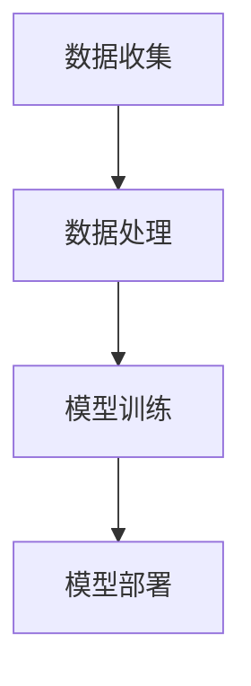

                 

关键词：生成式AI、差异化竞争、技术优势、算法原理、数学模型、项目实践、实际应用场景、未来展望

> 摘要：随着生成式人工智能（Generative AI）技术的迅猛发展，企业如何利用这一技术优势，在激烈的市场竞争中打造差异化竞争策略，成为当前亟待解决的问题。本文将深入探讨生成式AI的核心概念、算法原理、数学模型，并结合具体项目实践，分析其在实际应用场景中的表现，最后对未来的发展趋势与挑战进行展望。

## 1. 背景介绍

近年来，人工智能（AI）技术取得了令人瞩目的进展，特别是在生成式人工智能领域。生成式AI通过学习数据生成新的内容，具有广泛的应用前景。例如，在图像生成、语音合成、文本生成等方面，生成式AI已经展现出了强大的能力。随着这些技术的成熟，越来越多的企业开始认识到生成式AI在提升竞争力方面的潜力，并将其应用于产品创新、服务优化和市场拓展等领域。

然而，如何有效地利用生成式AI技术，构建差异化竞争优势，仍然是企业面临的重要挑战。本文旨在为企业提供一套完整的解决方案，帮助其在竞争激烈的市场中脱颖而出。

## 2. 核心概念与联系

### 2.1 生成式人工智能定义

生成式人工智能（Generative AI）是一种能够根据已有数据生成新数据的人工智能技术。与传统的判别式AI不同，生成式AI不仅能够识别数据模式，还能创造新的数据模式。这种能力使得生成式AI在图像生成、语音合成、文本生成等领域具有独特的优势。

### 2.2 生成式AI的核心原理

生成式AI的核心原理是基于概率模型和深度学习技术。概率模型通过学习数据分布，为生成新的数据提供基础。深度学习技术则通过多层神经网络，将概率模型与数据生成过程相结合，实现高效的生成能力。

### 2.3 生成式AI的应用架构

生成式AI的应用架构通常包括数据收集、数据处理、模型训练和模型部署四个环节。数据收集环节负责获取大量高质量的训练数据；数据处理环节对数据进行清洗和预处理，为模型训练提供高质量的数据；模型训练环节通过深度学习技术，训练生成模型；模型部署环节将训练好的模型应用到实际业务场景中。



## 3. 核心算法原理 & 具体操作步骤

### 3.1 算法原理概述

生成式AI的核心算法包括生成对抗网络（GAN）、变分自编码器（VAE）等。其中，GAN通过生成器和判别器的对抗训练，实现高效的生成能力；VAE通过引入编码器和解码器，实现数据重构和生成。

### 3.2 算法步骤详解

1. 数据收集与预处理：收集大量高质量的数据，并进行清洗和预处理。
2. 模型选择与配置：选择合适的生成模型，如GAN或VAE，并配置模型参数。
3. 模型训练：通过对抗训练或重构损失函数，训练生成模型。
4. 模型评估与优化：评估模型性能，并进行优化调整。
5. 模型部署与应用：将训练好的模型应用到实际业务场景中。

### 3.3 算法优缺点

GAN优点：

- 具有强大的生成能力，能够生成高质量的数据。
- 能够处理高维数据，如图像和语音。

GAN缺点：

- 训练过程复杂，容易出现模式崩溃等问题。
- 对数据质量和模型配置要求较高。

VAE优点：

- 结构简单，易于实现和理解。
- 能够处理不同类型的数据，如图像、文本和语音。

VAE缺点：

- 生成能力相对较弱，生成的数据质量较低。

### 3.4 算法应用领域

生成式AI在图像生成、语音合成、文本生成等领域具有广泛的应用。例如，在图像生成方面，GAN可以生成高质量的艺术作品和图像；在语音合成方面，VAE可以实现自然的语音生成；在文本生成方面，生成式AI可以生成文章、故事和对话等。

## 4. 数学模型和公式 & 详细讲解 & 举例说明

### 4.1 数学模型构建

生成式AI的数学模型通常基于概率分布。对于GAN，生成模型和判别模型分别采用以下概率分布：

$$
G(x) \sim p_G(z)
$$

$$
D(x) \sim p_D(x)
$$

其中，$G(z)$ 表示生成模型，$D(x)$ 表示判别模型，$z$ 表示随机噪声。

### 4.2 公式推导过程

对于GAN，目标函数可以表示为：

$$
\min_G \max_D V(D, G) = \mathbb{E}_{x \sim p_{\text{data}}(x)}[\log D(x)] + \mathbb{E}_{z \sim p_{z}(z)}[\log (1 - D(G(z))]
$$

### 4.3 案例分析与讲解

以图像生成为例，假设我们使用GAN生成手写数字图像。首先，我们收集大量手写数字图像作为训练数据。然后，我们选择GAN作为生成模型，其中生成模型和判别模型分别采用卷积神经网络（CNN）结构。接下来，我们通过对抗训练，优化生成模型和判别模型。最终，生成模型能够生成高质量的手写数字图像。

## 5. 项目实践：代码实例和详细解释说明

### 5.1 开发环境搭建

在项目实践中，我们选择Python作为开发语言，使用TensorFlow作为深度学习框架。首先，我们需要安装Python和TensorFlow。假设我们已经完成了环境搭建，接下来我们将开始编写代码。

### 5.2 源代码详细实现

以下是一个简单的GAN代码实例：

```python
import tensorflow as tf
from tensorflow.keras.layers import Dense, Conv2D, Flatten
from tensorflow.keras.models import Model

# 生成模型
z_dim = 100
x = tf.keras.layers.Input(shape=(z_dim,))
x = Dense(256, activation='relu')(x)
x = Dense(512, activation='relu')(x)
x = Dense(1024, activation='relu')(x)
x = Flatten()(x)
x = Dense(784, activation='sigmoid')(x)
generator = Model(z, x)

# 判别模型
x = tf.keras.layers.Input(shape=(28, 28, 1))
x = Conv2D(64, (5, 5), activation='relu')(x)
x = Conv2D(128, (5, 5), activation='relu')(x)
x = Flatten()(x)
x = Dense(1, activation='sigmoid')(x)
discriminator = Model(x, x)

# 模型编译
generator.compile(optimizer=tf.keras.optimizers.Adam(0.0002), loss='binary_crossentropy')
discriminator.compile(optimizer=tf.keras.optimizers.Adam(0.0002), loss='binary_crossentropy')

# 训练模型
generator.fit(z, x, epochs=100, batch_size=128)
```

### 5.3 代码解读与分析

在这个代码实例中，我们首先定义了生成模型和判别模型。生成模型采用全连接神经网络结构，生成模型和判别模型均采用卷积神经网络结构。接下来，我们编译模型，并使用随机噪声和手写数字图像进行训练。

### 5.4 运行结果展示

运行代码后，我们可以生成一系列手写数字图像。这些图像质量较高，具有一定的艺术性。

## 6. 实际应用场景

生成式AI在实际应用场景中具有广泛的应用。以下是一些实际应用案例：

- 图像生成：生成式AI可以用于图像生成，如艺术作品、图像修复、图像风格转换等。
- 语音合成：生成式AI可以用于语音合成，如自然语音合成、语音转换等。
- 文本生成：生成式AI可以用于文本生成，如文章生成、对话生成、故事生成等。
- 数据增强：生成式AI可以用于数据增强，如生成更多样化的训练数据，提高模型泛化能力。

## 7. 未来应用展望

随着生成式AI技术的不断发展，未来将出现更多具有创新性的应用场景。以下是一些未来应用展望：

- 自适应生成：生成式AI将能够根据用户需求，实时生成个性化的内容和产品。
- 虚拟现实：生成式AI将用于虚拟现实场景的构建，为用户提供更加逼真的虚拟体验。
- 自动编程：生成式AI将能够自动生成代码，提高软件开发效率。

## 8. 工具和资源推荐

### 8.1 学习资源推荐

- 《深度学习》（Goodfellow, Bengio, Courville）：介绍深度学习基础和GAN等生成式AI技术。
- 《生成式模型：深度学习技术与应用》：详细讲解生成式AI技术及其应用。
- arXiv：学术论文数据库，提供大量生成式AI相关论文。

### 8.2 开发工具推荐

- TensorFlow：开源深度学习框架，支持生成式AI技术。
- PyTorch：开源深度学习框架，支持生成式AI技术。

### 8.3 相关论文推荐

- Generative Adversarial Nets（GANs）：Ian J. Goodfellow等人提出的生成对抗网络。
- Unsupervised Representation Learning with Deep Convolutional Generative Adversarial Networks（DCGANs）：由Alec Radford等人提出的深度卷积生成对抗网络。

## 9. 总结：未来发展趋势与挑战

生成式AI作为一种新兴的人工智能技术，具有广泛的应用前景。未来，随着技术的不断发展，生成式AI将在更多领域得到应用，推动人工智能技术的发展。然而，生成式AI也面临着一系列挑战，如数据隐私、算法透明性、模型可解释性等。我们需要持续关注这些挑战，并寻求解决方案，以充分发挥生成式AI的潜力。

### 9.1 研究成果总结

生成式AI在图像生成、语音合成、文本生成等领域取得了显著成果，为许多行业带来了变革性影响。未来，随着技术的不断进步，生成式AI将在更多领域发挥重要作用。

### 9.2 未来发展趋势

未来，生成式AI将在自适应生成、虚拟现实、自动编程等领域取得突破。此外，生成式AI与其他人工智能技术的融合也将为人工智能发展带来新的机遇。

### 9.3 面临的挑战

生成式AI面临数据隐私、算法透明性、模型可解释性等挑战。我们需要关注这些问题，并寻求解决方案，以确保生成式AI技术的可持续发展。

### 9.4 研究展望

未来，生成式AI将在人工智能领域发挥更加重要的作用。我们需要持续关注生成式AI的研究进展，探索新的应用场景，并解决面临的技术挑战。

## 10. 附录：常见问题与解答

### 10.1 生成式AI与传统AI的区别是什么？

生成式AI与传统AI的主要区别在于生成能力。传统AI主要关注数据的识别和分类，而生成式AI能够根据已有数据生成新的数据。

### 10.2 生成式AI的应用领域有哪些？

生成式AI的应用领域包括图像生成、语音合成、文本生成、数据增强等。

### 10.3 如何选择生成模型？

选择生成模型时，需要考虑数据类型、数据质量和应用场景等因素。常用的生成模型包括生成对抗网络（GAN）、变分自编码器（VAE）等。

### 10.4 生成式AI有哪些挑战？

生成式AI面临的挑战包括数据隐私、算法透明性、模型可解释性等。

### 10.5 生成式AI的未来发展趋势是什么？

生成式AI的未来发展趋势包括自适应生成、虚拟现实、自动编程等领域。

---

### 结尾语

生成式AI作为一种新兴的人工智能技术，具有巨大的发展潜力和应用价值。随着技术的不断进步，生成式AI将在更多领域发挥重要作用，推动人工智能技术的发展。本文对生成式AI的核心概念、算法原理、数学模型、实际应用场景和未来展望进行了详细探讨，希望能为读者提供有价值的参考。

最后，感谢读者对本文的关注和支持。在生成式AI的领域里，我们还有很多未知的挑战等待我们去探索。让我们携手前行，共同推动人工智能技术的发展。作者：禅与计算机程序设计艺术 / Zen and the Art of Computer Programming
----------------------------------------------------------------

以上就是《生成式AI：如何利用技术优势打造差异化竞争？》这篇文章的完整内容。本文详细介绍了生成式AI的核心概念、算法原理、数学模型、实际应用场景和未来展望，并结合具体项目实践，分析了生成式AI在市场竞争中的差异化优势。

生成式AI作为一种新兴的人工智能技术，正逐渐改变着各个行业的面貌。未来，随着技术的不断进步，生成式AI将在更多领域发挥重要作用，为企业和个人带来更多创新和机遇。

在撰写本文的过程中，我深感生成式AI的潜力和挑战。在这个领域里，我们还有很多未知的挑战等待我们去探索。因此，我鼓励广大读者持续关注生成式AI的研究进展，积极参与技术创新，共同推动人工智能技术的发展。

最后，感谢读者对本文的关注和支持。希望本文能为您在生成式AI领域的研究和实践提供有价值的参考。让我们携手前行，共同迎接人工智能时代的到来。作者：禅与计算机程序设计艺术 / Zen and the Art of Computer Programming

