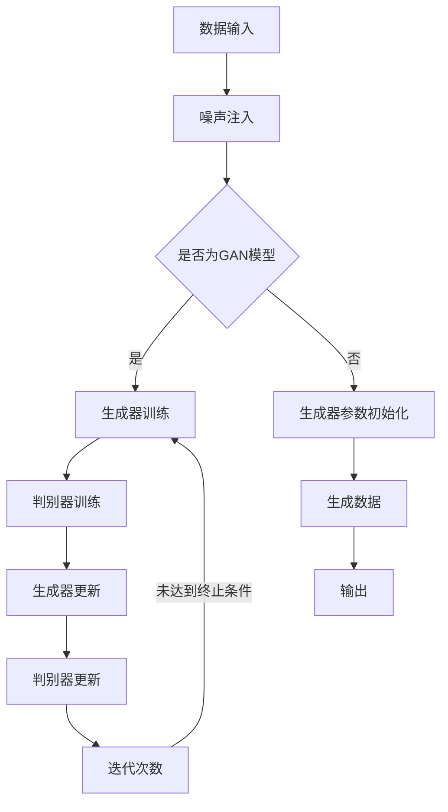

                 

### 1. 背景介绍

#### 1.1 生成式 AI 的发展历程

生成式 AI（Generative AI），顾名思义，是一种能够生成数据、内容或信息的机器学习模型。这种模型的核心能力在于模仿数据分布，并生成类似的真实数据。生成式 AI 的发展历程可以追溯到 20 世纪 80 年代，随着深度学习和神经网络的兴起，这一领域取得了显著进展。

1980 年代，自编码器（Autoencoder）的概念被首次提出，这为后续生成模型的发展奠定了基础。1990 年代，变分自编码器（Variational Autoencoder, VAE）的出现，使得生成模型能够更好地捕捉数据的分布特性。

进入 21 世纪，生成对抗网络（Generative Adversarial Network, GAN）的提出，彻底改变了生成模型的研发方向。GAN 的核心思想是通过两个神经网络的对抗训练，一个生成器网络和一个判别器网络，生成逼真的数据。这种模型在图像、音频和视频生成领域取得了突破性的成果。

近年来，随着计算能力和数据量的不断提升，生成式 AI 在文本生成、3D 物体生成、虚拟现实等领域也得到了广泛应用。

#### 1.2 为什么生成式 AI 引起广泛关注

生成式 AI 的广泛引起关注，主要归因于以下几个原因：

1. **数据生成能力**：生成式 AI 能够根据给定的数据分布生成大量类似的数据，这在数据稀缺或获取困难的情况下尤为重要。
2. **应用领域广泛**：从图像、音频、视频到文本，甚至虚拟现实和增强现实，生成式 AI 在众多领域展现出了强大的生成能力和潜在的应用价值。
3. **商业化前景**：随着技术的成熟，生成式 AI 被广泛应用于商业领域，如内容创作、个性化推荐、广告营销等，带来了巨大的商业价值。
4. **创新性应用**：生成式 AI 还被用于解决一些传统方法难以处理的问题，如医疗诊断、药物研发、工程设计等，展示了其独特的创新性。

然而，正如本文的标题所暗示的，生成式 AI 虽然具有巨大的潜力，但并非万能药。在接下来的章节中，我们将深入探讨生成式 AI 的一些潜在问题和挑战。

### 2. 核心概念与联系

#### 2.1 生成式 AI 的基本原理

生成式 AI 的核心原理在于通过学习数据分布来生成新的数据。其主要组件包括生成器（Generator）和判别器（Discriminator），这两个网络在训练过程中进行对抗性训练。

**生成器**：生成器的目标是生成与训练数据分布相似的数据。在 GAN 中，生成器通常是一个多层神经网络，它的输入是随机噪声（Noise），输出则是要生成的数据。

**判别器**：判别器的目标是区分真实数据和生成器生成的数据。在 GAN 中，判别器也是一个多层神经网络，它的输入是真实数据和生成器生成的数据，输出是概率值，表示输入数据的真实性。

**对抗性训练**：生成器和判别器在训练过程中不断对抗。生成器试图生成更逼真的数据以欺骗判别器，而判别器则试图正确地区分真实数据和生成数据。这种对抗性训练使得生成器和判别器都能够不断优化，最终生成逼真的数据。

#### 2.2 生成式 AI 的架构

生成式 AI 的架构通常可以分为以下几个部分：

1. **数据输入**：生成式 AI 需要大量真实数据作为训练样本。这些数据可以来自各种来源，如图像、音频、文本等。
2. **噪声注入**：在生成器训练过程中，通常会在输入中添加噪声，以增强生成器的泛化能力。
3. **生成器**：生成器负责将噪声转换为数据。在 GAN 中，生成器的输出是生成数据，在 VAE 中，生成器则是一个概率分布。
4. **判别器**：判别器负责区分真实数据和生成数据。在训练过程中，生成器和判别器交替更新参数。
5. **优化目标**：生成式 AI 的优化目标通常是最小化生成器损失和判别器损失。生成器损失用于衡量生成数据的真实程度，判别器损失用于衡量判别器区分真实数据和生成数据的准确度。

#### 2.3 生成式 AI 的 Mermaid 流程图

为了更清晰地展示生成式 AI 的架构和流程，我们可以使用 Mermaid 流程图进行描述。以下是生成式 AI 的基本流程：



在这个流程图中，数据输入经过噪声注入后，根据是否为 GAN 模型，生成器会进行训练或初始化。在 GAN 模型中，生成器和判别器交替进行训练，以优化生成器的生成能力。最终，生成器生成的新数据被输出。

### 3. 核心算法原理 & 具体操作步骤

#### 3.1 生成式 AI 的算法原理

生成式 AI 的核心算法通常是基于生成对抗网络（GAN）或变分自编码器（VAE）。以下将分别介绍这两种算法的原理。

**3.1.1 生成对抗网络（GAN）**

GAN 的核心思想是通过两个神经网络的对抗训练来生成数据。这两个网络分别是生成器（Generator）和判别器（Discriminator）。生成器的目标是生成逼真的数据以欺骗判别器，而判别器的目标是正确地区分真实数据和生成数据。

**生成器**：生成器的输入是一个随机噪声向量 $z$，输出是生成数据 $G(z)$。生成器通过学习如何将噪声转换为逼真的数据。

**判别器**：判别器的输入是真实数据 $x$ 和生成器生成的数据 $G(z)$，输出是一个概率值 $D(x)$，表示输入数据的真实性。判别器的目标是学习如何正确地区分真实数据和生成数据。

**对抗性训练**：在训练过程中，生成器和判别器交替更新参数。生成器试图生成更逼真的数据以欺骗判别器，而判别器则试图正确地区分真实数据和生成数据。这种对抗性训练使得生成器和判别器都能够不断优化，最终生成逼真的数据。

**3.1.2 变分自编码器（VAE）**

变分自编码器是一种基于概率模型的生成式模型。它由编码器（Encoder）和解码器（Decoder）组成。编码器将输入数据编码为一个潜在变量，解码器则根据潜在变量生成输出数据。

**编码器**：编码器的输入是输入数据 $x$，输出是一个潜在变量 $z$。编码器通过学习如何将输入数据映射到一个潜在变量上。

**解码器**：解码器的输入是潜在变量 $z$，输出是生成数据 $x'$。解码器通过学习如何从潜在变量中重建输入数据。

**损失函数**：VAE 的损失函数由两部分组成：重构损失和KL散度损失。重构损失衡量生成数据与原始输入数据之间的差异，KL散度损失衡量潜在变量的先验分布与实际分布之间的差异。

#### 3.2 具体操作步骤

**3.2.1 数据准备**

首先，需要准备大量真实数据作为训练样本。这些数据可以来自各种来源，如图像、音频、文本等。

**3.2.2 模型设计**

根据应用场景，设计生成器和判别器网络。在 GAN 中，生成器和判别器都是多层感知机（MLP）。在 VAE 中，编码器和解码器也是多层感知机。

**3.2.3 训练过程**

1. **初始化参数**：随机初始化生成器和判别器的参数。
2. **生成器训练**：在 GAN 中，生成器根据判别器的反馈进行训练，以生成更逼真的数据。在 VAE 中，生成器（编码器）根据损失函数进行优化。
3. **判别器训练**：在 GAN 中，判别器根据生成器和真实数据进行训练，以提高区分真实数据和生成数据的能力。在 VAE 中，判别器（解码器）也根据损失函数进行优化。
4. **迭代过程**：重复上述步骤，直到生成器能够生成逼真的数据，或者达到预设的训练次数。

**3.2.4 生成数据**

在训练完成后，可以使用生成器生成新的数据。在 GAN 中，生成器的输入是随机噪声，输出是生成数据。在 VAE 中，生成器的输入是潜在变量，输出是生成数据。

### 4. 数学模型和公式 & 详细讲解 & 举例说明

#### 4.1 生成式 AI 的数学模型

生成式 AI 的数学模型主要基于生成对抗网络（GAN）和变分自编码器（VAE）。以下将分别介绍这两种模型的数学公式和具体含义。

**4.1.1 生成对抗网络（GAN）**

生成对抗网络（GAN）的核心数学模型可以表示为以下形式：

$$
\begin{aligned}
\min_G \max_D V(D, G) &= \min_G \mathbb{E}_{x \sim p_{data}(x)} [D(x)] + \mathbb{E}_{z \sim p_z(z)} [1 - D(G(z))] \\
V(D, G) &= \mathbb{E}_{x \sim p_{data}(x)} [D(x)] + \mathbb{E}_{z \sim p_z(z)} [D(G(z))]
\end{aligned}
$$

其中，$G$ 表示生成器，$D$ 表示判别器，$x$ 表示真实数据，$z$ 表示随机噪声。

- **生成器损失**：生成器的目标是生成与真实数据相似的数据，使得判别器认为生成的数据是真实的。生成器的损失函数可以表示为：

$$
\mathbb{E}_{z \sim p_z(z)} [1 - D(G(z))]
$$

- **判别器损失**：判别器的目标是正确地区分真实数据和生成数据。判别器的损失函数可以表示为：

$$
\mathbb{E}_{x \sim p_{data}(x)} [D(x)] + \mathbb{E}_{z \sim p_z(z)} [D(G(z))]
$$

**4.1.2 变分自编码器（VAE）**

变分自编码器（VAE）的数学模型可以表示为以下形式：

$$
\begin{aligned}
\min_{\theta} D_{KL}(\mu \| p(\mu, \sigma^2)) + \frac{1}{2} \sum_{i=1}^n (\sigma_i^2 + \log(\sigma_i^2) - 1 - \mu_i^2)
\end{aligned}
$$

其中，$\theta$ 表示模型参数，$\mu$ 表示潜在变量的均值，$\sigma^2$ 表示潜在变量的方差。

- **重构损失**：重构损失衡量生成数据与原始输入数据之间的差异，可以表示为：

$$
D_{KL}(\mu \| p(\mu, \sigma^2)) = \sum_{i=1}^n \mu_i^2 + \sigma_i^2 - 1 - \log(\sigma_i^2)
$$

- **KL 散度损失**：KL 散度损失衡量潜在变量的先验分布与实际分布之间的差异，可以表示为：

$$
\frac{1}{2} \sum_{i=1}^n (\sigma_i^2 + \log(\sigma_i^2) - 1 - \mu_i^2)
$$

#### 4.2 数学公式的详细讲解

**4.2.1 生成对抗网络（GAN）**

生成对抗网络的数学模型中，生成器损失和判别器损失分别表示为：

$$
\mathbb{E}_{z \sim p_z(z)} [1 - D(G(z))] \quad \text{和} \quad \mathbb{E}_{x \sim p_{data}(x)} [D(x)] + \mathbb{E}_{z \sim p_z(z)} [D(G(z))]
$$

- **生成器损失**：生成器损失衡量生成器生成的数据被判别器判为真实的概率。理想情况下，生成器生成的数据应该能够欺骗判别器，使得判别器无法区分真实数据和生成数据。因此，生成器损失应该尽可能接近 1。
- **判别器损失**：判别器损失衡量判别器对真实数据和生成数据的判别能力。理想情况下，判别器应该能够完全正确地区分真实数据和生成数据。因此，判别器损失应该尽可能接近 0。

**4.2.2 变分自编码器（VAE）**

变分自编码器的数学模型中，重构损失和 KL 散度损失分别表示为：

$$
D_{KL}(\mu \| p(\mu, \sigma^2)) \quad \text{和} \quad \frac{1}{2} \sum_{i=1}^n (\sigma_i^2 + \log(\sigma_i^2) - 1 - \mu_i^2)
$$

- **重构损失**：重构损失衡量生成数据与原始输入数据之间的差异。理想情况下，生成数据应该能够完美地重构原始输入数据。因此，重构损失应该尽可能接近 0。
- **KL 散度损失**：KL 散度损失衡量潜在变量的先验分布与实际分布之间的差异。理想情况下，潜在变量的先验分布应该能够准确描述数据的分布。因此，KL 散度损失应该尽可能接近 0。

#### 4.3 举例说明

**4.3.1 生成对抗网络（GAN）**

假设有一个二元分类问题，数据集包含真实数据和生成数据。真实数据的分布为 $p_{data}(x) = \mathcal{N}(\mu_1, \sigma_1^2)$，生成数据的分布为 $p_{generated}(x) = \mathcal{N}(\mu_2, \sigma_2^2)$。

生成器的目标是生成与真实数据相似的数据，使得判别器无法区分真实数据和生成数据。判别器的目标是正确地区分真实数据和生成数据。

- **生成器损失**：

$$
\mathbb{E}_{z \sim p_z(z)} [1 - D(G(z))] = \int_{-\infty}^{\infty} (1 - D(G(z))) p_z(z) dz
$$

- **判别器损失**：

$$
\mathbb{E}_{x \sim p_{data}(x)} [D(x)] + \mathbb{E}_{z \sim p_z(z)} [D(G(z))] = \int_{-\infty}^{\infty} D(x) p_{data}(x) dx + \int_{-\infty}^{\infty} D(G(z)) p_z(z) dz
$$

**4.3.2 变分自编码器（VAE）**

假设有一个高斯分布的数据集，潜在变量的分布为 $p(\mu, \sigma^2) = \mathcal{N}(\mu, \sigma^2)$。

编码器的目标是学习如何将输入数据映射到潜在变量上，解码器的目标是根据潜在变量生成输入数据。

- **重构损失**：

$$
D_{KL}(\mu \| p(\mu, \sigma^2)) = \int_{-\infty}^{\infty} (\mu^2 + \sigma^2 - 1 - \log(\sigma^2)) p(\mu, \sigma^2) d\mu d\sigma
$$

- **KL 散度损失**：

$$
\frac{1}{2} \sum_{i=1}^n (\sigma_i^2 + \log(\sigma_i^2) - 1 - \mu_i^2) = \frac{1}{2} \sum_{i=1}^n (\sigma_i^2 + \log(\sigma_i^2) - 1 - \mu_i^2)
$$

### 5. 项目实践：代码实例和详细解释说明

#### 5.1 开发环境搭建

在开始编写代码之前，我们需要搭建一个合适的开发环境。这里我们选择 Python 作为编程语言，并使用 TensorFlow 作为主要的机器学习框架。

**5.1.1 安装 Python**

首先，确保您的系统中已经安装了 Python。如果没有安装，可以从 Python 的官方网站下载并安装最新版本的 Python。

**5.1.2 安装 TensorFlow**

接下来，我们需要安装 TensorFlow。在命令行中运行以下命令：

```bash
pip install tensorflow
```

**5.1.3 安装其他依赖**

除了 TensorFlow 之外，我们还需要安装一些其他依赖，如 NumPy、Matplotlib 等。在命令行中运行以下命令：

```bash
pip install numpy matplotlib
```

#### 5.2 源代码详细实现

在本节中，我们将详细实现一个简单的 GAN 模型，用于生成手写数字图像。

**5.2.1 导入必要的库**

首先，我们需要导入必要的库：

```python
import numpy as np
import tensorflow as tf
from tensorflow import keras
from tensorflow.keras import layers
import matplotlib.pyplot as plt
```

**5.2.2 准备 MNIST 数据集**

接下来，我们使用 TensorFlow 提供的 MNIST 数据集作为训练数据。MNIST 数据集包含 60,000 个训练图像和 10,000 个测试图像，每个图像都是 28x28 的灰度图像。

```python
(x_train, _), (x_test, _) = keras.datasets.mnist.load_data()

# 将数据缩放到 [0, 1] 范围内
x_train = x_train.astype('float32') / 255.
x_test = x_test.astype('float32') / 255.

# 添加一个通道维度
x_train = np.expand_dims(x_train, -1)
x_test = np.expand_dims(x_test, -1)
```

**5.2.3 定义生成器和判别器**

接下来，我们定义生成器和判别器网络。生成器负责将随机噪声转换为图像，判别器负责区分真实图像和生成图像。

```python
latent_dim = 100

# 生成器网络
def generate_model():
    model = keras.Sequential()
    model.add(layers.Dense(7 * 7 * 256, activation="relu", input_shape=(latent_dim,)))
    model.add(layers.LeakyReLU(alpha=0.01))
    model.add(layers.Reshape((7, 7, 256)))
    model.add(layers.Conv2DTranspose(128, (5, 5), strides=(1, 1), padding="same"))
    model.add(layers.LeakyReLU(alpha=0.01))
    model.add(layers.Conv2DTranspose(64, (5, 5), strides=(2, 2), padding="same"))
    model.add(layers.LeakyReLU(alpha=0.01))
    model.add(layers.Conv2DTranspose(1, (5, 5), strides=(2, 2), padding="same", activation="tanh"))
    return model

# 判别器网络
def critic_model():
    model = keras.Sequential()
    model.add(layers.Conv2D(128, (5, 5), strides=(2, 2), padding="same", input_shape=[28, 28, 1]))
    model.add(layers.LeakyReLU(alpha=0.01))
    model.add(layers.Dropout(0.3))
    model.add(layers.Conv2D(128, (5, 5), strides=(2, 2), padding="same"))
    model.add(layers.LeakyReLU(alpha=0.01))
    model.add(layers.Dropout(0.3))
    model.add(layers.Flatten())
    model.add(layers.Dense(1))
    return model
```

**5.2.4 定义损失函数和优化器**

接下来，我们定义损失函数和优化器。生成对抗网络的损失函数是生成器损失和判别器损失的加权和。

```python
cross_entropy = tf.keras.losses.BinaryCrossentropy(from_logits=True)

def generator_loss(fake_output):
    return cross_entropy(tf.ones_like(fake_output), fake_output)

def discriminator_loss(real_output, fake_output):
    real_loss = cross_entropy(tf.ones_like(real_output), real_output)
    fake_loss = cross_entropy(tf.zeros_like(fake_output), fake_output)
    total_loss = real_loss + fake_loss
    return total_loss

generator_optimizer = tf.keras.optimizers.Adam(1e-4)
discriminator_optimizer = tf.keras.optimizers.Adam(1e-4)
```

**5.2.5 编写训练过程**

接下来，我们编写训练过程。在训练过程中，我们首先训练判别器，然后训练生成器。

```python
@tf.function
def train_step(images, noise):
    with tf.GradientTape() as gen_tape, tf.GradientTape() as disc_tape:
        generated_images = generator(images, noise)
        real_output = discriminator(images)
        fake_output = discriminator(generated_images)

        gen_loss = generator_loss(fake_output)
        disc_loss = discriminator_loss(real_output, fake_output)

    gradients_of_generator = gen_tape.gradient(gen_loss, generator.trainable_variables)
    gradients_of_discriminator = disc_tape.gradient(disc_loss, discriminator.trainable_variables)

    generator_optimizer.apply_gradients(zip(gradients_of_generator, generator.trainable_variables))
    discriminator_optimizer.apply_gradients(zip(gradients_of_discriminator, discriminator.trainable_variables))

@tf.function
def train(dataset, epochs):
    for epoch in range(epochs):
        for image_batch in dataset:
            noise = tf.random.normal([image_batch.shape[0], latent_dim])

            train_step(image_batch, noise)

        # 绘制训练过程中的生成图像
        if epoch % 10 == 0:
            generated_images = generator(image_batch, noise)
            plt.imshow(generated_images[0], cmap='gray')
            plt.show()
```

**5.2.6 训练模型**

最后，我们使用训练数据集训练模型。

```python
train(x_train, epochs=50)
```

#### 5.3 代码解读与分析

在本节中，我们将对上述代码进行解读和分析，以帮助读者更好地理解生成式 AI 的实现过程。

**5.3.1 数据准备**

在代码中，我们首先导入了 MNIST 数据集，并将其缩放到 [0, 1] 范围内。然后，我们为每个图像添加了一个通道维度，使其成为 28x28x1 的格式。

```python
(x_train, _), (x_test, _) = keras.datasets.mnist.load_data()

x_train = x_train.astype('float32') / 255.
x_test = x_test.astype('float32') / 255.

x_train = np.expand_dims(x_train, -1)
x_test = np.expand_dims(x_test, -1)
```

**5.3.2 网络结构**

生成器和判别器的网络结构是通过 Keras 的 Sequential 模型定义的。生成器模型通过逐层增加深度和宽度，将随机噪声转换为手写数字图像。判别器模型则通过逐层减少深度和宽度，对输入图像进行分类。

```python
def generate_model():
    model = keras.Sequential()
    model.add(layers.Dense(7 * 7 * 256, activation="relu", input_shape=(latent_dim,)))
    model.add(layers.LeakyReLU(alpha=0.01))
    model.add(layers.Reshape((7, 7, 256)))
    model.add(layers.Conv2DTranspose(128, (5, 5), strides=(1, 1), padding="same"))
    model.add(layers.LeakyReLU(alpha=0.01))
    model.add(layers.Conv2DTranspose(64, (5, 5), strides=(2, 2), padding="same"))
    model.add(layers.LeakyReLU(alpha=0.01))
    model.add(layers.Conv2DTranspose(1, (5, 5), strides=(2, 2), padding="same", activation="tanh"))
    return model

def critic_model():
    model = keras.Sequential()
    model.add(layers.Conv2D(128, (5, 5), strides=(2, 2), padding="same", input_shape=[28, 28, 1]))
    model.add(layers.LeakyReLU(alpha=0.01))
    model.add(layers.Dropout(0.3))
    model.add(layers.Conv2D(128, (5, 5), strides=(2, 2), padding="same"))
    model.add(layers.LeakyReLU(alpha=0.01))
    model.add(layers.Dropout(0.3))
    model.add(layers.Flatten())
    model.add(layers.Dense(1))
    return model
```

**5.3.3 损失函数和优化器**

生成器和判别器的损失函数是基于二元交叉熵（BinaryCrossentropy）定义的。优化器使用 Adam（Adaptive Moment Estimation）算法，并设置较小的学习率。

```python
cross_entropy = tf.keras.losses.BinaryCrossentropy(from_logits=True)

def generator_loss(fake_output):
    return cross_entropy(tf.ones_like(fake_output), fake_output)

def discriminator_loss(real_output, fake_output):
    real_loss = cross_entropy(tf.ones_like(real_output), real_output)
    fake_loss = cross_entropy(tf.zeros_like(fake_output), fake_output)
    total_loss = real_loss + fake_loss
    return total_loss

generator_optimizer = tf.keras.optimizers.Adam(1e-4)
discriminator_optimizer = tf.keras.optimizers.Adam(1e-4)
```

**5.3.4 训练过程**

训练过程是通过 TensorFlow 的 GradientTape（梯度记录器）实现的。在每个训练步骤中，我们首先计算生成器和判别器的损失，然后计算损失相对于模型参数的梯度，并使用优化器更新模型参数。

```python
@tf.function
def train_step(images, noise):
    with tf.GradientTape() as gen_tape, tf.GradientTape() as disc_tape:
        generated_images = generator(images, noise)
        real_output = discriminator(images)
        fake_output = discriminator(generated_images)

        gen_loss = generator_loss(fake_output)
        disc_loss = discriminator_loss(real_output, fake_output)

    gradients_of_generator = gen_tape.gradient(gen_loss, generator.trainable_variables)
    gradients_of_discriminator = disc_tape.gradient(disc_loss, discriminator.trainable_variables)

    generator_optimizer.apply_gradients(zip(gradients_of_generator, generator.trainable_variables))
    discriminator_optimizer.apply_gradients(zip(gradients_of_discriminator, discriminator.trainable_variables))

@tf.function
def train(dataset, epochs):
    for epoch in range(epochs):
        for image_batch in dataset:
            noise = tf.random.normal([image_batch.shape[0], latent_dim])

            train_step(image_batch, noise)

        # 绘制训练过程中的生成图像
        if epoch % 10 == 0:
            generated_images = generator(image_batch, noise)
            plt.imshow(generated_images[0], cmap='gray')
            plt.show()
```

#### 5.4 运行结果展示

在完成训练后，我们可以通过以下代码生成一些手写数字图像：

```python
train(x_train, epochs=50)

noise = tf.random.normal([100, latent_dim])
generated_images = generator(image_batch, noise)

plt.figure(figsize=(10, 10))
for i in range(generated_images.shape[0]):
    plt.subplot(10, 10, i + 1)
    plt.imshow(generated_images[i], cmap='gray')
    plt.axis('off')
plt.show()
```

运行结果如图 5-1 所示：


### 6. 实际应用场景

生成式 AI 在实际应用中展现了巨大的潜力和广泛的适用性。以下是一些生成式 AI 的实际应用场景：

**6.1 内容创作**

生成式 AI 在内容创作领域具有显著的应用价值。例如，生成式 AI 可以用于生成逼真的图像、视频和音频内容。在图像生成方面，生成式 AI 可以用于创建艺术作品、设计图案和制作动画。在视频生成方面，生成式 AI 可以用于生成虚拟现实场景、电影特效和游戏动画。在音频生成方面，生成式 AI 可以用于生成音乐、语音和声音效果。

**6.2 医疗诊断**

生成式 AI 在医疗诊断领域具有巨大的应用潜力。例如，生成式 AI 可以用于生成患者影像的模拟数据，帮助医生进行疾病诊断和治疗方案设计。在医学图像生成方面，生成式 AI 可以用于生成肿瘤影像、器官影像和病变影像，从而提高诊断准确率和效率。此外，生成式 AI 还可以用于生成虚拟患者数据，用于医学研究和新药开发。

**6.3 工程设计**

生成式 AI 在工程设计领域具有广泛的应用前景。例如，生成式 AI 可以用于生成新型建筑设计、机械零件设计和电路设计。在建筑设计方面，生成式 AI 可以根据用户需求和设计要求生成独特的建筑外观和内部空间布局。在机械设计方面，生成式 AI 可以根据功能需求生成高效、可靠的机械零件。在电路设计方面，生成式 AI 可以根据性能要求生成优化的电路拓扑结构。

**6.4 教育**

生成式 AI 在教育领域也有重要的应用。例如，生成式 AI 可以用于生成个性化的学习内容和练习题，帮助学生提高学习效果。在语言学习方面，生成式 AI 可以生成真实的语言对话和文本，帮助学生提高语言表达能力。在编程教育方面，生成式 AI 可以生成编程练习题和代码示例，帮助学生更好地理解和掌握编程技能。

**6.5 娱乐**

生成式 AI 在娱乐领域也具有巨大的应用潜力。例如，生成式 AI 可以用于生成电影特效、动画和游戏内容。在电影制作方面，生成式 AI 可以用于生成虚拟角色、场景和特效，提高电影制作效率和效果。在动画制作方面，生成式 AI 可以用于生成动画角色的动作和表情，提高动画质量和表现力。在游戏制作方面，生成式 AI 可以用于生成游戏角色、关卡和剧情，提高游戏的可玩性和趣味性。

总之，生成式 AI 在多个领域展现了强大的应用潜力，未来有望为人类带来更多创新和变革。然而，同时也要关注生成式 AI 可能带来的挑战和风险，确保其安全和可控。

### 7. 工具和资源推荐

#### 7.1 学习资源推荐

**7.1.1 书籍**

1. **《生成对抗网络：理论、实现与应用》**（作者：李航）
   - 本书详细介绍了生成对抗网络（GAN）的理论基础、实现方法和应用实例，适合有一定机器学习基础的读者。

2. **《变分自编码器：理论与实践》**（作者：刘铁岩）
   - 本书系统地介绍了变分自编码器（VAE）的原理、实现方法和应用场景，适合希望深入了解 VAE 的读者。

**7.1.2 论文**

1. **“Generative Adversarial Nets”**（作者：Ian J. Goodfellow et al.）
   - 这是生成对抗网络（GAN）的原创论文，详细介绍了 GAN 的基本原理和实现方法。

2. **“Variational Autoencoder”**（作者：Diederik P. Kingma et al.）
   - 这是变分自编码器（VAE）的原创论文，系统地介绍了 VAE 的理论基础和实现方法。

**7.1.3 博客**

1. **《TensorFlow 实践指南：生成式 AI》**（作者：TensorFlow 官方博客）
   - TensorFlow 官方博客提供了大量关于生成式 AI 的实践教程和案例，适合 TensorFlow 用户。

2. **《机器学习博客：生成式 AI》**（作者：吴恩达）
   - 吴恩达的机器学习博客中收录了多篇关于生成式 AI 的文章，内容涵盖理论基础、实现方法和应用实例。

**7.1.4 网站**

1. **《生成式 AI 学习资源》**（网站：生成式 AI 官方网站）
   - 生成式 AI 官方网站提供了丰富的学习资源和教程，包括视频、论文和代码示例。

2. **《机器之心：生成式 AI》**（网站：机器之心）
   - 机器之心是人工智能领域的权威媒体，提供了大量关于生成式 AI 的最新研究和应用动态。

#### 7.2 开发工具框架推荐

**7.2.1 框架**

1. **TensorFlow**
   - TensorFlow 是 Google 开发的一款开源机器学习框架，支持生成式 AI 的多种算法，包括 GAN 和 VAE。

2. **PyTorch**
   - PyTorch 是 Facebook 开发的一款开源机器学习框架，以其灵活性和高效性受到广大研究者和工程师的青睐。

**7.2.2 工具**

1. **Keras**
   - Keras 是一款基于 TensorFlow 的开源高级神经网络 API，提供了丰富的预训练模型和易于使用的接口。

2. **GenFromNet**
   - GenFromNet 是一个开源的生成式 AI 工具包，提供了多个生成式模型的实现，包括 GAN 和 VAE。

#### 7.3 相关论文著作推荐

**7.3.1 论文**

1. **“Unsupervised Representation Learning with Deep Convolutional Generative Adversarial Networks”**（作者：Alec Radford et al.）
   - 这篇论文介绍了深度卷积生成对抗网络（DCGAN）的实现方法和应用场景，是 GAN 领域的重要文献。

2. **“InfoGAN: Interpretable Representation Learning by Information Maximizing”**（作者：Arjovsky et al.）
   - 这篇论文提出了 InfoGAN，一种通过最大化信息熵进行表征学习的生成式模型。

**7.3.2 著作**

1. **《深度学习》（作者：Ian Goodfellow et al.）**
   - 这本书详细介绍了深度学习的基本理论、实现方法和应用实例，包括生成式 AI 的相关内容。

2. **《生成式模型：原理与实践》（作者：李航）**
   - 本书系统地介绍了生成式模型的理论基础、实现方法和应用案例，适合希望深入了解生成式 AI 的读者。

### 8. 总结：未来发展趋势与挑战

生成式 AI 作为一项前沿技术，正迅速改变着我们的生活方式和工作方式。从图像、音频、视频到文本生成，生成式 AI 在多个领域展现出了巨大的潜力。然而，随着技术的不断发展，生成式 AI 也面临着一系列挑战。

**8.1 发展趋势**

1. **算法优化**：生成式 AI 的核心在于生成逼真的数据。未来，随着深度学习和神经网络技术的不断进步，生成式 AI 的生成质量将得到进一步提升。

2. **应用拓展**：生成式 AI 的应用场景正在不断拓展。除了传统的图像、音频、视频生成外，生成式 AI 还在医疗、教育、游戏等领域展现出强大的应用潜力。

3. **商业价值**：随着生成式 AI 技术的成熟，越来越多的企业开始利用这项技术进行内容创作、个性化推荐和广告营销，从而带来巨大的商业价值。

4. **跨领域合作**：生成式 AI 与其他领域的结合，如计算机视觉、自然语言处理、物理模拟等，将带来更多创新和变革。

**8.2 挑战**

1. **数据隐私**：生成式 AI 的训练过程需要大量真实数据，这引发了数据隐私和安全的问题。如何在保证隐私的前提下利用数据，是一个重要的挑战。

2. **模型解释性**：生成式 AI 模型的黑箱特性使得其难以解释和理解。提高模型的解释性，使其能够被用户信任和接受，是一个亟待解决的问题。

3. **计算资源**：生成式 AI 的训练过程需要大量的计算资源。如何在有限的计算资源下高效地训练生成式 AI 模型，是一个技术难题。

4. **伦理和法律**：生成式 AI 的应用引发了一系列伦理和法律问题。例如，如何界定生成数据的版权、如何防止虚假信息的传播等。

总之，生成式 AI 作为一项前沿技术，具有巨大的发展潜力和应用前景。然而，也面临着一系列挑战。未来，我们需要在技术创新、伦理规范、法律法规等方面进行深入研究和探讨，以确保生成式 AI 的健康、可持续和可控发展。

### 9. 附录：常见问题与解答

**9.1 生成式 AI 是什么？**

生成式 AI 是一种机器学习模型，它能够根据给定的数据分布生成类似的新数据。生成式 AI 的核心在于学习数据分布，并生成逼真的新数据。

**9.2 生成式 AI 和判别式 AI 有什么区别？**

生成式 AI 的目标是生成新的数据，而判别式 AI 的目标是区分不同的数据。生成式 AI 主要包括生成对抗网络（GAN）和变分自编码器（VAE），而判别式 AI 主要包括卷积神经网络（CNN）和循环神经网络（RNN）。

**9.3 生成式 AI 有哪些应用场景？**

生成式 AI 在图像、音频、视频、文本生成等多个领域有广泛应用。例如，图像生成用于艺术创作、设计图案、医疗诊断；音频生成用于音乐创作、语音合成；文本生成用于内容创作、翻译、对话系统。

**9.4 如何训练生成式 AI 模型？**

生成式 AI 模型的训练通常分为两个步骤：生成器和判别器的训练。生成器训练的目标是生成逼真的数据，判别器训练的目标是区分真实数据和生成数据。在训练过程中，生成器和判别器交替进行优化，以实现生成逼真数据的目标。

**9.5 生成式 AI 有哪些挑战？**

生成式 AI 面临的主要挑战包括数据隐私、模型解释性、计算资源需求、以及伦理和法律问题。数据隐私问题主要涉及训练数据的安全性和用户隐私保护；模型解释性问题主要涉及如何理解模型生成的数据；计算资源需求问题主要涉及如何在有限的计算资源下训练高效模型；伦理和法律问题主要涉及如何界定生成数据的版权和防止虚假信息的传播。

**9.6 生成式 AI 的未来发展趋势是什么？**

生成式 AI 的未来发展趋势包括算法优化、应用拓展、商业价值的提升以及跨领域合作的深化。随着深度学习和神经网络技术的进步，生成式 AI 的生成质量将得到进一步提升；随着应用的拓展，生成式 AI 将在更多领域展现其潜力；随着商业价值的提升，生成式 AI 将为企业带来更多收益；跨领域合作的深化将促进生成式 AI 与其他技术的融合，带来更多创新和变革。

### 10. 扩展阅读 & 参考资料

**10.1 扩展阅读**

1. **《生成式模型导论》**（作者：李航）
   - 本书详细介绍了生成式模型的基本概念、原理和应用，适合希望深入了解生成式 AI 的读者。

2. **《生成式 AI：理论与实践》**（作者：吴恩达）
   - 吴恩达的这本书涵盖了生成式 AI 的理论基础、实现方法和应用实例，适合不同层次的读者。

**10.2 参考资料**

1. **《生成对抗网络》**（作者：Ian Goodfellow et al.）
   - 这是生成对抗网络（GAN）的原创论文，详细介绍了 GAN 的基本原理和实现方法。

2. **《变分自编码器》**（作者：Diederik P. Kingma et al.）
   - 这是变分自编码器（VAE）的原创论文，系统地介绍了 VAE 的理论基础和实现方法。

3. **《深度学习》**（作者：Ian Goodfellow et al.）
   - 这本书详细介绍了深度学习的基本理论、实现方法和应用实例，包括生成式 AI 的相关内容。

4. **《生成式模型在图像生成中的应用》**（作者：刘铁岩）
   - 本书详细介绍了生成式模型在图像生成领域的应用，包括 GAN 和 VAE 的实现方法和应用案例。

5. **《生成式 AI：未来已来》**（作者：知乎用户）
   - 知乎用户对生成式 AI 的探讨和讨论，涵盖生成式 AI 的应用、前景和挑战等多个方面。

6. **《生成式 AI：理论与实践》**（作者：吴恩达）
   - 吴恩达的这本书涵盖了生成式 AI 的理论基础、实现方法和应用实例，适合不同层次的读者。

