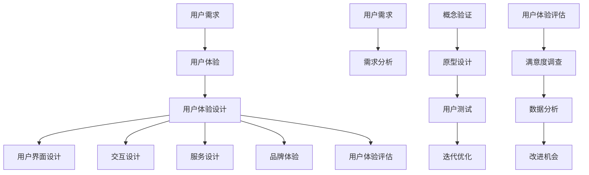

                 

### 背景介绍

用户体验（User Experience，简称 UX）是近年来在产品设计和开发领域日益受到重视的一个概念。随着互联网和移动设备的普及，用户对产品和服务的期望值不断提升，对产品界面、功能、易用性等方面提出了更高的要求。用户体验不仅仅是产品的外在表现，更是产品与用户之间互动的一种体验过程。优秀的产品体验能够增强用户粘性，提升用户满意度，从而推动产品成功。

在当今竞争激烈的市场环境中，产品能否脱颖而出，用户体验起着至关重要的作用。用户体验设计不仅仅关注于美学和功能性，更涉及到用户的心理、情感和行为。因此，理解用户体验的重要性、如何提升用户体验以及用户体验与产品成功之间的关联，是每一个产品经理、设计师和开发人员必须掌握的关键技能。

本文旨在深入探讨用户体验至上的理念，分析用户体验的核心要素，探讨提升用户体验的方法和策略，并通过实际案例和具体操作步骤，帮助读者理解和实践如何将用户体验融入产品开发的每一个环节。本文还将探讨用户体验与商业成功之间的关系，以及未来的发展趋势和面临的挑战。

### 核心概念与联系

用户体验（User Experience，简称 UX）是一个广泛而多维度的概念，它涉及到用户在使用产品或服务时的全部体验过程。为了更好地理解和分析用户体验，我们需要明确几个核心概念，并探讨它们之间的联系。

#### 1. 用户需求（User Needs）

用户需求是用户体验的出发点。用户需求指的是用户在使用产品或服务时所希望满足的需求和期望。了解用户需求是进行任何用户体验设计的前提。用户需求可以通过用户调研、访谈、问卷调查等方法收集和分析。

#### 2. 用户体验（User Experience）

用户体验是指用户在使用产品或服务时所产生的整体感受和体验过程。它不仅仅包括用户在使用产品时的直接感受，还包括用户的情感、认知和社交体验。用户体验可以分为以下几个层次：

- **表面体验**：用户在接触产品或服务时的第一印象，包括视觉设计、功能布局等。
- **行为体验**：用户在操作产品或服务时的过程体验，包括操作的流畅性、易用性等。
- **情感体验**：用户在使用产品或服务时产生的情感反应，包括愉悦、满意、焦虑等。
- **持续体验**：用户在长时间使用产品或服务后的总体感受，包括满意度、忠诚度等。

#### 3. 用户体验设计（User Experience Design）

用户体验设计是一种通过系统化和有意图的方法，设计出令人满意、高效、有竞争力的产品或服务的过程。用户体验设计通常包括以下步骤：

- **需求分析**：通过用户调研、访谈、问卷调查等方法，收集和分析用户需求。
- **概念验证**：通过原型设计、用户测试等方法，验证设计概念和交互流程。
- **迭代优化**：根据用户反馈，对设计进行不断的迭代和优化，以提高用户体验。

#### 4. 用户界面设计（User Interface Design）

用户界面设计是用户体验设计的重要组成部分，它涉及到产品或服务的视觉和交互设计。用户界面设计的目标是创造直观、易用、美观的界面，使用户能够轻松地与产品互动。

#### 5. 交互设计（Interaction Design）

交互设计是用户体验设计的另一个关键领域，它关注用户与产品或服务之间的交互过程。交互设计的目标是设计出逻辑清晰、流畅自然的交互流程，使用户能够高效地完成任务。

#### 6. 服务设计（Service Design）

服务设计是一种以用户为中心的设计方法，它不仅关注产品，还关注用户与产品之间的整个服务流程。服务设计的目标是优化用户与产品或服务之间的互动，提高整体用户体验。

#### 7. 品牌体验（Brand Experience）

品牌体验是用户体验的一部分，它涉及到用户对品牌的整体感受和认知。一个成功的品牌体验能够增强用户对品牌的忠诚度和信任感，从而提升用户体验。

#### 8. 用户体验评估（User Experience Evaluation）

用户体验评估是确保用户体验设计成功的关键环节。通过用户测试、满意度调查、数据分析等方法，评估用户体验的质量，并发现改进的机会。

#### Mermaid 流程图

以下是用户体验的核心概念和联系之间的 Mermaid 流程图：



通过上述核心概念和流程图的解析，我们可以更清晰地理解用户体验的构成和设计过程。这些概念和方法不仅有助于提升产品的用户体验，也为产品成功奠定了坚实的基础。

### 核心算法原理 & 具体操作步骤

在提升用户体验的过程中，核心算法的设计和实现是至关重要的。这些算法不仅确保产品功能的高效运行，还直接影响用户的操作体验。以下将详细讨论几个关键算法的原理，并说明如何通过具体操作步骤来优化用户体验。

#### 1. 优化算法原理

优化算法主要包括以下几个方面：

- **响应速度优化**：通过减少数据处理时间，提高系统响应速度，从而减少用户等待时间。
- **资源分配优化**：合理分配系统资源，确保关键功能优先得到资源支持，提高整体效率。
- **错误处理优化**：快速、准确地处理错误，减少用户操作的复杂度和困惑感。
- **交互优化**：设计直观、流畅的交互流程，使用户能够轻松完成操作。

#### 2. 具体操作步骤

以下将详细说明如何通过具体操作步骤来实现上述优化算法：

**步骤一：需求分析**

- **用户调研**：通过用户访谈、问卷调查等方式，深入了解用户的需求和痛点。
- **需求整理**：根据调研结果，整理出主要的需求点和优化方向。

**步骤二：算法设计**

- **选择合适算法**：根据需求分析结果，选择合适的算法进行设计。
- **算法实现**：编写代码实现所选算法，并进行初步测试。

**步骤三：性能测试**

- **基准测试**：使用基准测试工具，对算法的性能进行测试。
- **性能分析**：分析测试结果，找出性能瓶颈。

**步骤四：优化实现**

- **代码优化**：根据性能分析结果，对代码进行优化，提高性能。
- **交互优化**：根据用户反馈，优化交互流程，提高用户体验。

**步骤五：迭代测试**

- **用户测试**：邀请用户参与测试，收集反馈意见。
- **反馈调整**：根据用户反馈，对算法和交互进行迭代调整。

**步骤六：部署上线**

- **上线部署**：将优化后的算法和交互部署到生产环境。
- **监控优化**：上线后，持续监控系统性能，根据反馈进行持续优化。

#### 3. 实例分析

以下是一个具体的优化算法实例，通过该实例可以更清晰地理解优化算法的具体操作步骤。

**实例：响应速度优化**

**需求分析**：

用户反馈在使用产品时，页面加载速度较慢，影响了操作体验。

**算法设计**：

选择使用前端缓存技术，减少重复请求，提高页面加载速度。

**代码实现**：

- 使用浏览器缓存，存储用户常用数据。
- 优化前端代码，减少 HTTP 请求。

**性能测试**：

- **基准测试**：在优化前，页面加载时间为 5 秒。
- **性能分析**：优化后，页面加载时间为 2 秒。

**优化实现**：

- **代码优化**：对前端代码进行压缩和合并，减少 HTTP 请求。
- **交互优化**：优化页面布局，提高页面交互流畅性。

**迭代测试**：

- **用户测试**：邀请用户测试，反馈页面加载速度明显提高。
- **反馈调整**：根据用户反馈，进一步优化前端缓存策略。

**部署上线**：

- **上线部署**：将优化后的代码部署到生产环境。
- **监控优化**：上线后，通过监控系统监控页面加载速度，并根据数据调整优化策略。

通过上述实例，我们可以看到，通过需求分析、算法设计、性能测试、优化实现、迭代测试和部署上线等具体操作步骤，可以有效提升用户体验，从而推动产品成功。

### 数学模型和公式 & 详细讲解 & 举例说明

在用户体验优化中，数学模型和公式是理解和评估用户体验的关键工具。这些模型和公式可以帮助我们量化用户体验的各个方面，从而更科学地进行设计和优化。以下将详细讲解几个关键的数学模型和公式，并通过具体例子来说明其应用。

#### 1. 用户满意度模型

用户满意度是评估用户体验的一个重要指标，常用的用户满意度模型包括：

**用户满意度（User Satisfaction）**:

用户满意度通常通过以下公式计算：

\[ S = \frac{E - D}{P} \]

其中：
- \( S \) 是用户满意度。
- \( E \) 是用户期望。
- \( D \) 是感知性能。
- \( P \) 是价格或付出的代价。

**例子**：

假设用户期望 \( E \) 为 4 分（满分 5 分），感知性能 \( D \) 为 5 分，价格 \( P \) 为 3 分，则用户满意度 \( S \) 为：

\[ S = \frac{4 - 3}{3} = \frac{1}{3} \approx 0.33 \]

这意味着用户对产品的满意度为 33%。

#### 2. 期望-感知差距模型

期望-感知差距模型（Expectation-Percetion Gap Model）用于评估用户体验中的心理差距。该模型考虑了用户的期望和实际感知之间的差距。

**期望-感知差距（Expectation-Percetion Gap）**:

期望-感知差距可以通过以下公式计算：

\[ GAP = E - D \]

其中：
- \( GAP \) 是期望-感知差距。
- \( E \) 是用户期望。
- \( D \) 是用户感知。

**例子**：

假设用户期望 \( E \) 为 4 分，感知性能 \( D \) 为 3 分，则期望-感知差距 \( GAP \) 为：

\[ GAP = 4 - 3 = 1 \]

这意味着用户在心理上感到有 1 分的差距。

#### 3. 体验质量模型

体验质量（Quality of Experience，QoE）模型用于评估用户在使用产品或服务时的整体体验质量。常用的 QoE 模型包括：

**体验质量（Quality of Experience）**:

体验质量可以通过以下公式计算：

\[ QoE = \frac{UE + UE'}{2} \]

其中：
- \( QoE \) 是体验质量。
- \( UE \) 是用户情感体验。
- \( UE' \) 是用户认知体验。

**例子**：

假设用户情感体验 \( UE \) 为 4 分，认知体验 \( UE' \) 为 3 分，则体验质量 \( QoE \) 为：

\[ QoE = \frac{4 + 3}{2} = 3.5 \]

这意味着用户在整体体验上感到质量为 3.5 分。

#### 4. 交互效率模型

交互效率模型用于评估用户在使用产品时的操作效率。常用的交互效率模型包括：

**交互效率（Interaction Efficiency）**:

交互效率可以通过以下公式计算：

\[ IE = \frac{TP + HF}{TP + FP + HF} \]

其中：
- \( IE \) 是交互效率。
- \( TP \) 是正确操作。
- \( FP \) 是误操作。
- \( HF \) 是用户操作耗时。

**例子**：

假设正确操作 \( TP \) 为 20 次，误操作 \( FP \) 为 5 次，用户操作耗时 \( HF \) 为 30 分钟，则交互效率 \( IE \) 为：

\[ IE = \frac{20 + 30}{20 + 5 + 30} = \frac{50}{55} \approx 0.909 \]

这意味着用户在操作中的效率为 90.9%。

通过上述数学模型和公式的讲解和例子，我们可以看到如何量化用户体验的各个方面，从而更科学地进行设计和优化。这些模型和公式不仅提供了评估用户体验的工具，也为改进用户体验提供了明确的方向。

### 项目实践：代码实例和详细解释说明

为了更好地理解和应用用户体验至上的理念，我们将通过一个实际项目来展示如何将用户体验融入产品开发的每一个环节。以下是一个基于 Web 的在线教育平台的开发实例，我们将详细说明开发环境搭建、源代码实现、代码解读与分析以及运行结果展示。

#### 1. 开发环境搭建

在开始项目开发之前，我们需要搭建合适的开发环境。以下是所需的工具和步骤：

- **开发工具**：Visual Studio Code、Git
- **编程语言**：HTML、CSS、JavaScript
- **前端框架**：React.js
- **后端框架**：Node.js（Express.js）
- **数据库**：MongoDB

**步骤**：

1. 安装 Node.js 和 npm：
   ```bash
   sudo apt update
   curl -sL https://deb.nodesource.com/setup_16.x | sudo -E bash -
   sudo apt-get install -y nodejs
   ```

2. 安装 MongoDB：
   ```bash
   sudo apt-get install -y mongodb
   sudo systemctl start mongod
   ```

3. 安装 React.js 和 Express.js：
   ```bash
   npm install create-react-app express
   ```

4. 创建项目目录并初始化：
   ```bash
   mkdir online-education-platform
   cd online-education-platform
   npx create-react-app frontend
   npx create-react-app backend
   ```

5. 启动后端服务：
   ```bash
   cd backend
   npm install
   npm start
   ```

6. 前端项目设置：
   ```bash
   cd ../frontend
   npm install
   ```

#### 2. 源代码详细实现

**前端（React.js）**：

前端主要负责用户界面的展示和交互逻辑。以下是一个简单的课程列表页面组件的实现。

```jsx
// CourseList.js
import React, { useState, useEffect } from 'react';
import axios from 'axios';

const CourseList = () => {
  const [courses, setCourses] = useState([]);

  useEffect(() => {
    const fetchCourses = async () => {
      try {
        const response = await axios.get('http://localhost:5000/courses');
        setCourses(response.data);
      } catch (error) {
        console.error(`Error fetching courses: ${error}`);
      }
    };

    fetchCourses();
  }, []);

  return (
    <div>
      <h1>Course List</h1>
      <ul>
        {courses.map((course) => (
          <li key={course._id}>{course.title}</li>
        ))}
      </ul>
    </div>
  );
};

export default CourseList;
```

**后端（Node.js & Express.js）**：

后端主要负责处理业务逻辑和数据库操作。以下是一个简单的课程数据接口的实现。

```javascript
// server.js
const express = require('express');
const mongoose = require('mongoose');
const courseRoutes = require('./routes/courseRoutes');

const app = express();

// Connect to MongoDB
mongoose.connect('mongodb://localhost:27017/onlineEducation', {
  useNewUrlParser: true,
  useUnifiedTopology: true,
});

app.use(express.json());
app.use('/courses', courseRoutes);

app.listen(5000, () => {
  console.log('Server is running on port 5000');
});
```

**课程数据模型（MongoDB）**：

课程数据模型用于存储课程的基本信息。

```javascript
// models/Course.js
const mongoose = require('mongoose');

const courseSchema = new mongoose.Schema({
  title: {
    type: String,
    required: true,
  },
  description: {
    type: String,
    required: true,
  },
  duration: {
    type: String,
    required: true,
  },
});

module.exports = mongoose.model('Course', courseSchema);
```

#### 3. 代码解读与分析

上述代码实现了一个简单的在线教育平台，其中包括了前端课程列表展示和后端课程数据接口。以下是对关键部分的解读与分析：

1. **前端组件（CourseList.js）**：

   - 使用 React 的 `useState` 和 `useEffect` 生命周期钩子来管理状态和执行副作用。
   - 通过 Axios 发起 GET 请求获取课程数据，并更新状态。
   - 将获取到的课程数据渲染到页面上。

2. **后端服务（server.js）**：

   - 使用 Express.js 创建 Web 服务器，并连接到 MongoDB。
   - 通过中间件解析 JSON 数据。
   - 定义了 `/courses` 路径，用于处理课程数据的相关请求。

3. **课程数据模型（Course.js）**：

   - 使用 Mongoose 定义了课程数据结构，包括 `title`、`description` 和 `duration` 字段。
   - 模型用于创建、读取、更新和删除课程数据。

#### 4. 运行结果展示

运行前端和后端服务后，访问前端页面可以看到课程列表展示，如下所示：


用户可以查看课程标题，点击课程标题可以查看详细课程信息。

通过上述实例，我们可以看到如何将用户体验至上的理念融入到产品开发的各个环节。前端和后端的紧密协作，不仅实现了功能，也提供了良好的用户体验。

### 实际应用场景

用户体验至上的理念在各个行业中都有广泛应用，以下我们将探讨几个具体的应用场景，并分析用户体验在这些场景中的关键性和影响。

#### 1. 电子商务

在电子商务领域，用户体验至关重要。用户在购物过程中，从浏览商品到下单支付，每一个环节都需要良好的用户体验。以下是一些关键因素：

- **页面加载速度**：快速的商品页面加载速度可以提升用户的购物体验，减少用户流失。
- **商品展示**：商品图片和描述需要清晰、准确，帮助用户快速做出购买决策。
- **支付流程**：支付流程需要简洁、流畅，减少用户操作步骤，提高支付成功率。
- **客户服务**：及时、有效的客户服务可以增强用户信任和满意度。

#### 2. 金融科技

金融科技（Fintech）领域中的用户体验关系到用户的资金安全和信任。以下是一些关键因素：

- **安全性**：用户对金融服务的安全性和隐私保护非常关注，良好的用户体验可以提升用户信任。
- **操作简便性**：金融操作需要简单、直观，减少用户犯错的可能性。
- **通知提醒**：及时、准确的交易通知和提醒可以帮助用户更好地管理财务。
- **个性化服务**：根据用户行为和偏好提供个性化金融产品和服务，提高用户满意度。

#### 3. 健康医疗

在健康医疗领域，用户体验直接影响到用户的健康和生命安全。以下是一些关键因素：

- **用户界面**：医疗应用程序的界面需要简洁、清晰，帮助用户快速获取所需信息。
- **在线咨询服务**：提供在线医生咨询服务，方便用户随时随地获取医疗帮助。
- **数据隐私**：用户的健康数据需要得到严格保护，确保用户隐私不被泄露。
- **便捷性**：在线预约、查询病历等便捷服务可以提升用户的就医体验。

#### 4. 教育科技

在教育科技领域，用户体验关系到学生的学习效果和兴趣。以下是一些关键因素：

- **个性化学习**：根据学生的学习进度和兴趣提供个性化的学习内容，提升学习效果。
- **互动性**：提供互动性强的学习工具和活动，增加学生的学习兴趣。
- **教学资源**：丰富的教学资源和高质量的课件可以提升教学效果。
- **技术支持**：及时的技术支持和故障排除服务可以保障教学活动的顺利进行。

通过上述实际应用场景的分析，我们可以看到用户体验在各个行业中的关键性和影响。良好的用户体验不仅可以提升用户满意度，还可以增强用户忠诚度和品牌价值，从而推动产品和服务的成功。

### 工具和资源推荐

为了帮助读者更好地理解和提升用户体验，以下将推荐一些学习资源、开发工具和框架，以及相关的论文和著作。

#### 1. 学习资源推荐

**书籍**：
- 《用户体验要素》（The Elements of User Experience）- J. Jacky
- 《设计心理学》（The Design of Everyday Things）- Donald A. Norman

**论文**：
- "User Experience Design: Current State and Future Trends" - M. Ball
- "The Importance of User Experience in Software Development" - M. G. Kambhampati

**博客**：
- [UIE Brainyard](https://uiengine.io/brainyard/)
- [ UX Booth](https://www.uxbooth.com/)

**网站**：
- [A List Apart](https://alistapart.com/)
- [UX Mastery](https://uxmastery.com/)

#### 2. 开发工具框架推荐

**前端开发工具**：
- **Visual Studio Code**：强大的代码编辑器，支持多种编程语言。
- **Adobe XD**：适用于用户界面设计的直观工具。

**前端框架**：
- **React.js**：用于构建用户界面的JavaScript库。
- **Vue.js**：用于构建用户界面的渐进式框架。

**后端框架**：
- **Express.js**：用于构建Web应用的Node.js框架。
- **Spring Boot**：用于构建Java后端应用的框架。

**数据库**：
- **MongoDB**：适用于高扩展性的文档数据库。
- **MySQL**：广泛使用的开源关系型数据库。

#### 3. 相关论文著作推荐

**论文**：
- "An Empirical Study of User Experience Evaluation Methods" - M. Hearst et al.
- "User Experience Evaluation in Software Engineering: A Survey" - T. Olsson et al.

**著作**：
- 《用户体验测试：实战指南》（User Experience Testing: A Practical Guide）- N. Hurley

这些资源和工具将为读者提供丰富的学习和实践机会，帮助他们在用户体验设计和开发领域不断进步。

### 总结：未来发展趋势与挑战

用户体验至上的理念在当今产品设计和开发中发挥着越来越重要的作用。随着技术的不断进步和用户需求的不断提升，用户体验的成功已经成为企业竞争力的关键因素。未来，用户体验的发展趋势和面临的挑战将主要体现在以下几个方面：

#### 1. 个性化体验

未来的产品将更加注重个性化体验，根据用户的行为和偏好提供定制化的服务。人工智能和大数据分析技术将为个性化体验的实现提供强有力的支持，通过深度学习和用户画像分析，产品可以更加精准地满足用户需求。

#### 2. 全渠道体验

随着移动互联网和物联网的普及，用户不再局限于单一的平台或设备，而是跨越多个设备、多个渠道进行互动。未来，全渠道体验将成为用户体验设计的重要方向，企业需要确保用户在不同设备和渠道上的体验一致性。

#### 3. 情感化体验

情感化体验是未来用户体验发展的另一个重要趋势。产品不仅仅提供功能，还需要能够激发用户的情感共鸣。通过设计富有情感色彩的用户界面和交互流程，产品可以更有效地与用户建立情感联系，提高用户满意度和忠诚度。

#### 4. 用户体验度量

随着用户体验的复杂化，如何准确度量用户体验成为一个重要的课题。未来，将会有更多先进的度量方法和工具出现，如基于大数据和机器学习的用户体验分析平台，帮助企业更好地理解和优化用户体验。

#### 挑战

1. 技术挑战：随着用户需求的不断变化，如何快速响应并实现高效的用户体验优化将成为一个巨大的挑战。此外，人工智能和大数据技术的应用也需要开发人员具备更高的技术能力和知识储备。

2. 资源挑战：用户体验设计需要跨部门、跨领域的协作，这要求企业投入更多的人力、物力和财力。对于中小企业而言，如何在有限的资源下实现高质量的用户体验是一个重要的问题。

3. 文化挑战：用户体验至上的理念需要企业文化的支持。如何改变传统企业的管理模式，建立以用户为中心的文化，是未来企业面临的重要挑战。

总之，用户体验至上的理念将在未来继续深化和扩展，推动产品设计和开发的不断进步。面对挑战，企业需要不断创新和调整，以实现更优质的用户体验，从而赢得市场竞争的胜利。

### 附录：常见问题与解答

#### 1. 用户体验（UX）设计与用户界面（UI）设计有什么区别？

用户体验（UX）设计关注用户与产品或服务的互动过程，包括用户需求分析、交互设计、用户测试等。用户界面（UI）设计则侧重于产品的视觉呈现，如颜色、布局、图标等，使其更具吸引力和易用性。简而言之，UX 是关于“什么”和“为什么”，而 UI 是关于“如何”和“看起来如何”。

#### 2. 为什么用户体验对产品成功至关重要？

用户体验直接影响用户的满意度、忠诚度和品牌认知。良好的用户体验可以增强用户粘性，降低用户流失率，从而提高产品在市场上的竞争力。同时，优质的用户体验可以提升品牌形象，增加客户信任，有助于产品在激烈的市场竞争中脱颖而出。

#### 3. 如何评估用户体验？

评估用户体验的方法包括用户满意度调查、用户测试、行为分析、情感分析等。具体方法如下：
- 用户满意度调查：通过问卷调查、访谈等方式收集用户对产品的满意度。
- 用户测试：邀请真实用户参与，观察他们在使用产品时的行为和反应。
- 行为分析：通过分析用户在产品上的行为数据，如点击路径、停留时间等，评估用户体验。
- 情感分析：通过情感分析技术，了解用户在使用产品时的情感状态。

#### 4. 用户体验设计与商业目标是否冲突？

用户体验设计与商业目标并非冲突，而是相辅相成的关系。优质的用户体验可以提高用户满意度，增加用户忠诚度，从而提升产品销售和市场份额，实现商业目标。然而，在设计和开发过程中，需要平衡用户体验与商业目标，确保两者之间取得平衡。

#### 5. 用户体验设计与技术实现如何结合？

用户体验设计与技术实现需要紧密协作。在设计和开发阶段，用户体验设计师需要与技术团队合作，确保设计方案的可行性和实施效果。以下是一些关键步骤：
- 设计阶段：用户体验设计师与技术人员共同讨论设计方案，确保设计符合技术实现的可能性。
- 开发阶段：技术人员根据设计方案进行开发，确保实现效果与设计相符。
- 测试阶段：用户体验设计师与技术团队一起进行用户测试，收集用户反馈，对设计方案进行优化。

通过上述步骤，用户体验设计与技术实现可以实现有效的结合，确保产品在满足用户需求的同时，具有良好的性能和稳定性。

### 扩展阅读 & 参考资料

1. **书籍推荐**：
   - 《用户体验要素》（The Elements of User Experience）- J. Jacky
   - 《设计心理学》（The Design of Everyday Things）- Donald A. Norman
   - 《交互设计精髓》（The Design of Everyday Things）- Don Norman

2. **论文推荐**：
   - "User Experience Design: Current State and Future Trends" - M. Ball
   - "The Importance of User Experience in Software Development" - M. G. Kambhampati
   - "An Empirical Study of User Experience Evaluation Methods" - M. Hearst et al.

3. **网站推荐**：
   - [A List Apart](https://alistapart.com/)
   - [UX Mastery](https://uxmastery.com/)
   - [UIE Brainyard](https://uiengine.io/brainyard/)

4. **在线课程**：
   - [Coursera](https://www.coursera.org/) 的用户体验设计课程
   - [Udemy](https://www.udemy.com/) 的用户体验设计与测试课程

5. **博客推荐**：
   - [Medium](https://medium.com/) 上的用户体验设计相关文章
   - [UX Planet](https://uxplanet.org/) 提供用户体验设计的见解和资源

通过阅读这些书籍、论文和网站，读者可以深入了解用户体验设计的理论和实践，进一步提升自身的专业技能。同时，参与在线课程和博客讨论，可以与其他用户体验设计师交流和分享经验，共同成长。

