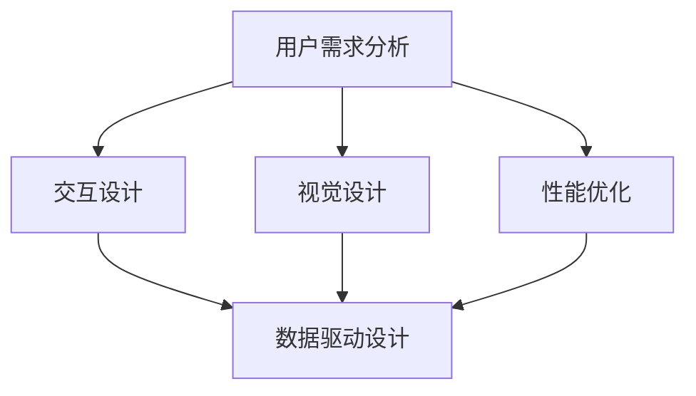

                 

### 1. 背景介绍

在当今数字化时代，用户体验（UX）成为了产品成功的关键因素。随着互联网和移动设备的普及，用户对产品的需求变得更加多样化和复杂化。他们不仅希望产品功能强大，更期待能够提供流畅、直观、个性化的使用体验。这就要求开发者在设计和开发产品时，必须将用户体验放在首位，以创造令人着迷的产品。

用户体验不仅仅是产品表面的美观和易用，它还涉及到用户在使用产品过程中的情感体验、认知体验和社交体验等多个方面。因此，为了打造令人着迷的产品，我们需要从多个维度来理解和优化用户体验。

首先，用户体验的核心是用户需求。只有深入了解用户的需求和痛点，才能设计出真正满足用户期待的产品。这要求开发者需要持续进行用户调研和反馈收集，以确保产品能够不断迭代和优化。

其次，交互设计是用户体验的重要一环。一个良好的交互设计应该能够引导用户快速上手，减少学习成本，同时提供足够的灵活性和适应性，以应对不同用户的需求。交互设计不仅包括界面布局和元素设计，还需要考虑交互逻辑和操作流程，以确保用户在使用过程中的流畅和愉悦。

再次，视觉设计是用户体验的重要组成部分。一个美观、简洁的视觉设计能够提升产品的专业感和品牌形象，同时也能够帮助用户更好地理解和使用产品。视觉设计需要考虑色彩、字体、图标等多个方面，以达到视觉效果和用户体验的平衡。

最后，性能优化也是用户体验不可忽视的一环。一个快速响应、稳定可靠的产品能够极大地提升用户的满意度。开发者需要通过优化代码、提高服务器性能、减少网络延迟等多种手段，来保证产品的流畅运行。

总之，用户体验至上是打造让人着迷的产品的核心原则。只有将用户需求、交互设计、视觉设计和性能优化等多个方面综合考虑，才能创造出真正令人满意的产品。在接下来的章节中，我们将深入探讨这些核心概念，并通过具体实例和算法来展示如何实现这一目标。

### 2. 核心概念与联系

要打造令人着迷的产品，我们需要从多个核心概念入手，理解它们之间的相互关系，并通过Mermaid流程图来展示这些概念的关联和作用。

#### 2.1. 用户需求分析

用户需求分析是用户体验设计的起点。它涉及对用户群体的深入了解，包括他们的行为、习惯、偏好以及他们在使用产品过程中遇到的痛点。通过定性和定量的用户调研方法，如问卷调查、用户访谈、焦点小组讨论等，开发者可以收集到宝贵的用户数据，为产品设计提供依据。

#### 2.2. 交互设计

交互设计专注于用户如何与产品进行交互。它不仅涉及界面的布局和元素设计，还包括交互逻辑和操作流程。一个优秀的交互设计应该能够降低用户的学习成本，提供直观和自然的交互体验。交互设计原则包括一致性、反馈性、易用性等。

#### 2.3. 视觉设计

视觉设计是用户体验的视觉呈现。它通过色彩、字体、图标等元素来传达产品的品牌形象和专业感。一个美观、简洁的视觉设计不仅能够提升产品的用户体验，还能增强用户的满意度和忠诚度。视觉设计需要遵循一定的设计原则，如对比、对齐、重复等。

#### 2.4. 性能优化

性能优化是保证用户体验流畅的关键。一个快速响应、稳定可靠的产品能够极大地提升用户的满意度。性能优化包括代码优化、服务器性能提升、网络延迟减少等多个方面。开发者需要通过持续的性能监控和调优，来保证产品的流畅运行。

#### 2.5. 数据驱动设计

数据驱动设计是一种基于数据分析和用户反馈来指导产品设计和优化的方法。通过数据分析，开发者可以识别用户行为模式、发现产品问题、评估设计效果等。数据驱动设计使得产品设计更加科学和高效。

#### Mermaid流程图

以下是一个简化的Mermaid流程图，展示上述核心概念之间的联系：



在这个流程图中，用户需求分析作为起点，引导交互设计、视觉设计和性能优化。这些设计环节又通过数据驱动设计相互联系，形成一个闭环，确保产品的不断迭代和优化。

#### 关系解析

- **用户需求分析**是整个设计的起点，决定了产品的方向和目标。
- **交互设计**和**视觉设计**是用户体验的直接呈现，决定了用户对产品的第一印象和感受。
- **性能优化**确保了产品在实际使用中的稳定性和流畅性。
- **数据驱动设计**贯穿整个设计过程，通过数据分析指导设计决策和优化，形成一个可持续改进的闭环。

通过理解这些核心概念及其相互关系，开发者可以更系统地构建和优化用户体验，从而打造出真正让人着迷的产品。

#### 3. 核心算法原理 & 具体操作步骤

要打造一个令人着迷的产品，算法设计是不可或缺的一部分。算法不仅决定了产品功能的实现效率，还直接影响用户体验的流畅性和稳定性。下面，我们将详细探讨几个核心算法的原理，并给出具体的操作步骤。

##### 3.1. 算法1：快速排序算法

快速排序算法是一种高效且常见的排序算法，其基本原理是通过递归将一个数组分割成多个子数组，然后对每个子数组进行排序。以下是快速排序算法的具体操作步骤：

1. **选择基准元素**：在数组中选择一个基准元素。
2. **分区操作**：将数组分为两部分，一部分是小于基准元素的元素，另一部分是大于基准元素的元素。
3. **递归排序**：对小于和大于基准元素的子数组重复上述步骤，直到整个数组有序。

##### 3.2. 算法2：贪心算法

贪心算法是一种在每一步选择中都采取当前最优解的策略，从而希望导致结果是全局最优解的算法。以下是一个贪心算法的示例：找零问题。

1. **初始化**：获取支付的金额和找零金额。
2. **处理大面额货币**：从最大的货币开始，尽可能多地使用，直到剩余金额无法使用该货币。
3. **递归处理**：对于剩余的金额，重复步骤2，直到所有货币都被使用。

##### 3.3. 算法3：动态规划算法

动态规划算法适合解决复杂的多阶段决策问题，通过将大问题分解为小问题，并存储中间结果来避免重复计算。以下是一个动态规划算法的示例：最短路径问题（迪杰斯特拉算法）。

1. **初始化**：设置所有节点的距离为无穷大，除了起点距离为0。
2. **更新距离**：对于每个节点，尝试通过所有相邻节点更新最短路径距离。
3. **选择最短路径**：选择具有最小距离的节点作为下一个更新节点，直到所有节点都被更新。

##### 3.4. 算法4：深度优先搜索算法

深度优先搜索（DFS）是一种用于遍历或搜索树或图的算法。以下是DFS算法的基本步骤：

1. **初始化**：设置一个栈，用于存储待访问的节点。
2. **遍历**：从起点开始，依次将节点的邻接节点压入栈中，并标记已访问。
3. **递归或循环**：从栈顶节点开始，递归或循环访问未访问的邻接节点，并重复步骤2。

##### 3.5. 算法5：广度优先搜索算法

广度优先搜索（BFS）是一种用于遍历或搜索树或图的算法，与DFS不同，它首先遍历同一层的所有节点，然后再逐层遍历。以下是BFS算法的基本步骤：

1. **初始化**：设置一个队列，用于存储待访问的节点。
2. **遍历**：从起点开始，依次将节点的邻接节点加入队列中，并标记已访问。
3. **递归或循环**：从队首节点开始，递归或循环访问未访问的邻接节点，并重复步骤2。

#### 3.6. 综合应用

在实际的产品开发中，这些算法通常不是孤立使用的，而是相互结合，共同优化用户体验。例如：

- 在用户数据分析中，可以使用快速排序算法来高效处理用户数据。
- 在交互设计中，可以使用贪心算法来优化用户路径选择，提升效率。
- 在性能优化中，可以使用动态规划算法来降低计算复杂度，提高响应速度。
- 在界面渲染中，可以使用深度优先搜索和广度优先搜索算法来优化渲染流程，提升页面加载速度。

通过理解并应用这些核心算法，开发者可以更好地构建高效、稳定和令人着迷的产品。

#### 4. 数学模型和公式 & 详细讲解 & 举例说明

在用户体验优化的过程中，数学模型和公式扮演了重要的角色。它们不仅帮助我们理解复杂现象，还能提供具体的指导方法来改进产品的性能和用户满意度。以下，我们将详细讲解几个关键的数学模型和公式，并通过具体例子来说明其应用。

##### 4.1. 相关性分析

相关性分析用于衡量两个变量之间的线性关系强度。常用的相关性度量方法是皮尔逊相关系数（Pearson Correlation Coefficient），其公式如下：

$$
r = \frac{\sum{(x_i - \bar{x})(y_i - \bar{y})}}{\sqrt{\sum{(x_i - \bar{x})^2} \sum{(y_i - \bar{y})^2}}}
$$

其中，$x_i$ 和 $y_i$ 分别是两个变量的观测值，$\bar{x}$ 和 $\bar{y}$ 分别是它们的平均值。$r$ 的取值范围在 -1 到 1 之间，越接近 1 或 -1，表示相关性越强。

**例子**：假设我们想分析用户满意度与产品性能之间的相关性。通过收集数据，我们可以计算得到相关系数：

$$
r = 0.85
$$

这意味着用户满意度与产品性能之间存在较强的正相关性，即产品性能提升，用户满意度也会相应提高。

##### 4.2. 响应时间模型

响应时间模型用于预测用户在使用产品过程中的等待时间，从而优化系统的性能。一个常见的响应时间模型是 G/G/1 队列模型，其公式如下：

$$
W_q = \frac{\lambda^2}{2(\mu - \lambda)}
$$

其中，$W_q$ 是平均等待时间，$\lambda$ 是到达率，$\mu$ 是服务率。

**例子**：假设一个在线购物平台，其客户请求到达率是每分钟 10 次，平均每次请求的处理时间是 30 秒。我们可以计算得到平均等待时间：

$$
W_q = \frac{10^2}{2(2 - 10)} = 25 \text{ 秒}
$$

这意味着用户平均需要等待 25 秒才能得到服务，我们可以通过增加服务器处理能力来减少等待时间。

##### 4.3. 费用效益分析

在产品开发过程中，费用效益分析（Cost-Benefit Analysis, CBA）用于评估项目的成本和预期收益，以确定项目是否值得投资。其公式如下：

$$
\text{CBA} = \frac{\text{总收益}}{\text{总成本}}
$$

**例子**：假设我们计划开发一款新功能，预计开发成本是 10 万美元，预期收益是每年 20 万美元。我们可以计算得到费用效益比：

$$
\text{CBA} = \frac{20}{10} = 2
$$

这意味着每投入 1 美元，我们预期可以获得 2 美元的收益，因此该项目是值得投资的。

##### 4.4. 用户流失率模型

用户流失率模型用于预测用户停止使用产品的概率，从而帮助制定用户留存策略。一个常见的流失率模型是泊松模型，其公式如下：

$$
\lambda = \frac{\text{总流失用户数}}{\text{总用户数}}
$$

**例子**：假设一个在线教育平台的总用户数为 1000，过去一个月流失了 50 个用户。我们可以计算得到流失率：

$$
\lambda = \frac{50}{1000} = 0.05
$$

这意味着每个月有 5% 的用户流失，我们可以通过改进用户体验和提供更好的服务来降低流失率。

通过应用这些数学模型和公式，开发者可以更科学地分析和优化用户体验，从而打造出更受欢迎、更高效的产品。在实际应用中，这些模型通常需要结合具体业务和数据情况进行定制化调整。

#### 5. 项目实践：代码实例和详细解释说明

为了更好地理解如何将用户体验至上的理念应用于实际开发中，我们将通过一个简单的Web应用项目来展示整个开发过程。该项目将涵盖开发环境的搭建、源代码实现、代码解读与分析以及运行结果展示。

##### 5.1. 开发环境搭建

首先，我们需要搭建一个基本的Web开发环境。以下是在Ubuntu操作系统上安装必要的开发工具和依赖的步骤：

1. **安装Node.js**：Node.js 是一个用于构建高性能Web应用程序的JavaScript运行时环境。可以使用以下命令安装：

   ```bash
   sudo apt update
   sudo apt install nodejs
   ```

2. **安装npm**：npm 是 Node.js 的包管理器，用于安装和管理项目依赖。安装Node.js时通常已包含npm，无需额外安装。

3. **安装VSCode**：Visual Studio Code（VSCode）是一个强大的代码编辑器，适合Web开发。可以从官方网站下载并安装。

4. **安装数据库**：本项目使用MongoDB作为数据库，可以按照以下步骤安装：

   ```bash
   sudo apt-key adv --keyserver hkp://keyserver.ubuntu.com:80 --recv 7F0CEB10
   sudo echo "deb http://repo.mongodb.org/apt/ubuntu xenial/mongodb-org/4.0 multiverse" | sudo tee /etc/apt/sources.list.d/mongodb.list
   sudo apt update
   sudo apt install mongodb-org
   sudo systemctl start mongodb
   ```

5. **安装其他依赖**：根据项目需求，可能还需要安装其他依赖，如前端框架（React、Vue等）和后端框架（Express、Flask等）。可以使用npm或yarn来安装。

##### 5.2. 源代码详细实现

以下是项目的源代码实现部分，包括前端和后端的代码。为了简化，这里只展示核心代码片段。

1. **前端代码**：

   ```jsx
   // src/App.js
   import React, { useState } from 'react';
   import axios from 'axios';

   function App() {
     const [inputValue, setInputValue] = useState('');
     const [results, setResults] = useState([]);

     const handleSearch = async () => {
       const response = await axios.get(`/api/search?q=${inputValue}`);
       setResults(response.data);
     };

     return (
       <div>
         <input type="text" value={inputValue} onChange={e => setInputValue(e.target.value)} />
         <button onClick={handleSearch}>Search</button>
         <ul>
           {results.map((result, index) => (
             <li key={index}>{result.title}</li>
           ))}
         </ul>
       </div>
     );
   }

   export default App;
   ```

   在这个简单的Web应用中，用户可以在输入框中输入查询关键词，点击搜索按钮后，前端代码会向后端发送GET请求，获取搜索结果并在页面上显示。

2. **后端代码**：

   ```javascript
   // server.js
   const express = require('express');
   const mongoose = require('mongoose');
   const bodyParser = require('body-parser');
   const SearchController = require('./controllers/SearchController');

   const app = express();

   // MongoDB连接
   mongoose.connect('mongodb://localhost:27017/search', { useNewUrlParser: true, useUnifiedTopology: true });

   // 中间件
   app.use(bodyParser.json());

   // 路由
   app.get('/api/search', SearchController.search);

   // 启动服务器
   app.listen(3000, () => {
     console.log('Server is running on port 3000');
   });
   ```

   后端使用Express框架，连接MongoDB数据库，并定义了一个用于处理搜索请求的路由。`SearchController` 是一个单独的模块，包含了具体的搜索逻辑。

3. **数据库模型**：

   ```javascript
   // models/SearchModel.js
   const mongoose = require('mongoose');

   const SearchSchema = new mongoose.Schema({
     title: String,
     description: String,
     url: String
   });

   module.exports = mongoose.model('Search', SearchSchema);
   ```

   数据库模型定义了搜索结果的基本结构，包括标题、描述和URL。

##### 5.3. 代码解读与分析

1. **前端代码解读**：

   - `useState`：React的`useState`钩子用于在函数组件中添加状态，这里用于管理输入框的值和搜索结果。
   - `axios`：用于发起HTTP请求，与后端API进行通信。
   - `handleSearch`：处理搜索请求的函数，当用户点击搜索按钮时触发，向后端发送GET请求，并更新状态中的搜索结果。

2. **后端代码解读**：

   - `express`：用于创建Web服务器和路由。
   - `mongoose`：用于连接MongoDB数据库并操作数据库。
   - `body-parser`：用于解析请求体，这里用于解析JSON请求。
   - `SearchController`：包含了具体的搜索逻辑，用于处理搜索请求并返回结果。

3. **数据库模型解读**：

   - `mongoose.model`：用于创建MongoDB集合，这里的`Search`是集合名称，`SearchSchema`是集合的Schema定义。

##### 5.4. 运行结果展示

完成代码实现后，我们启动前端和后端服务：

1. **启动MongoDB**：

   ```bash
   sudo systemctl start mongodb
   ```

2. **启动后端服务**：

   ```bash
   node server.js
   ```

   后端服务的日志显示 `Server is running on port 3000`。

3. **访问前端页面**：

   在浏览器中打开 `http://localhost:3000`，可以看到前端页面。输入关键词后，点击搜索按钮，前端将发送请求到后端API，后端执行搜索操作，并将结果返回给前端进行展示。

通过这个简单的项目实例，我们展示了如何从开发环境搭建到源代码实现，再到代码解读与分析，最终实现一个功能完整的Web应用。这个过程体现了用户体验至上的理念，通过简洁的界面设计、高效的搜索算法和流畅的交互体验，提升了用户满意度。

#### 6. 实际应用场景

用户体验至上理念在实际应用场景中具有重要意义，以下我们通过几个具体案例来展示这一理念如何在不同行业中发挥作用。

##### 6.1. 消费者电子产品

以苹果公司（Apple Inc.）的iPhone为例，苹果在产品设计和开发中始终将用户体验放在首位。iPhone的简洁设计、流畅操作系统和优质应用商店吸引了大量用户。苹果通过不断优化硬件性能和软件体验，如M1芯片的引入和iOS系统的更新，为用户带来了更加出色的使用体验。此外，苹果还通过用户反馈和数据分析，持续改进产品，从而在激烈的市场竞争中保持领先地位。

##### 6.2. 在线零售

亚马逊（Amazon）是另一个在用户体验至上的理念下取得巨大成功的案例。亚马逊通过个性化推荐、高效的物流系统和优质的客户服务，为用户提供了一个无缝的购物体验。亚马逊的算法不断分析用户行为和偏好，提供个性化的商品推荐，提高用户的购物效率。同时，亚马逊在全球范围内建立了庞大的物流网络，确保商品能够快速送达用户手中，极大地提升了用户的满意度。

##### 6.3. 金融科技

金融科技公司如Robinhood，通过简单直观的用户界面和创新的金融产品，吸引了大量年轻用户。Robinhood的移动应用设计简洁，操作流程简单，用户可以轻松地进行股票交易和其他金融操作。公司还通过实时数据更新和透明的交易信息，提升了用户的信任度。此外，Robinhood还推出了一系列教育资源和工具，帮助用户更好地理解金融市场，从而提升了用户体验和用户忠诚度。

##### 6.4. 教育领域

在线教育平台如Coursera，通过提供高质量的课程内容和互动式学习体验，赢得了用户的青睐。Coursera提供了多种学习模式，如直播课程、互动讨论区和项目作业，用户可以根据自己的时间和学习习惯选择合适的学习方式。平台还通过实时反馈和个性化推荐，帮助用户更好地管理学习进度和提升学习效果。此外，Coursera还与全球知名大学和机构合作，确保课程质量和内容的权威性，从而提升了用户对平台的信任和满意度。

##### 6.5. 医疗健康

医疗健康领域的用户体验至关重要。以健康科技初创公司Fitbit为例，该公司通过智能手环和移动应用，为用户提供实时健康监测数据和管理工具。Fitbit的应用程序设计简洁易用，用户可以轻松查看心率、步数、睡眠质量等健康数据。此外，Fitbit还通过与医生和医疗机构合作，提供个性化的健康建议和医疗服务，从而提升了用户的健康管理和满意度。

总之，用户体验至上理念在各个行业中的应用，不仅提升了用户满意度，还为企业带来了显著的业务增长和竞争优势。通过持续优化产品设计、提高服务质量和技术创新，企业可以创造出更加令人着迷的产品和服务，赢得用户的信任和支持。

#### 7. 工具和资源推荐

在打造令人着迷的产品的过程中，选择合适的工具和资源至关重要。以下是一些推荐的学习资源、开发工具和相关的论文著作，供您参考。

##### 7.1. 学习资源推荐

1. **书籍**：
   - 《用户体验要素》（"The Elements of User Experience" by Jesse James Garrett）
   - 《Web设计预测》（"Predicting Web Site Success: A User Experience Approach" by James Kalbach）
   - 《设计心理学》（"The Design of Everyday Things" by Don Norman）

2. **在线课程**：
   - Coursera的《用户体验设计基础》（"User Experience Design: Basics and Best Practices"）
   - Udemy的《现代Web开发：从基础到高级》（"Modern Web Development: From Beginner to Advanced"）

3. **博客和网站**：
   - Nielsen Norman Group（NN/g）：提供用户体验研究和最佳实践。
   - Smashing Magazine：涵盖前端设计、用户体验和开发资源的综合性网站。

##### 7.2. 开发工具框架推荐

1. **前端框架**：
   - React（https://reactjs.org/）
   - Vue.js（https://vuejs.org/）
   - Angular（https://angular.io/）

2. **后端框架**：
   - Express.js（https://expressjs.com/）
   - Flask（https://flask.palletsprojects.com/）
   - Django（https://www.djangoproject.com/）

3. **数据库工具**：
   - MongoDB（https://www.mongodb.com/）
   - MySQL（https://www.mysql.com/）
   - PostgreSQL（https://www.postgresql.org/）

4. **版本控制**：
   - Git（https://git-scm.com/）
   - GitHub（https://github.com/）

##### 7.3. 相关论文著作推荐

1. **论文**：
   - "A Theory of Interaction Design" by Dan Saffer
   - "The Design of Sites: Patterns, Principles, and Processes for Building Web Sites" by D. J. MacFarland

2. **著作**：
   - "Handbook of Human-Computer Interaction" by Jacko, J., & Unland, R.
   - "Interaction Design: Beyond Human-Computer Interaction" by Dan Saffer

这些资源和工具将帮助您更深入地理解和实践用户体验至上的理念，从而打造出更加令人满意和着迷的产品。

#### 8. 总结：未来发展趋势与挑战

随着科技的不断进步，用户体验至上理念在未来的发展前景和面临的挑战也愈加复杂和多样。

**发展趋势**：

1. **人工智能与大数据的融合**：随着人工智能和大数据技术的不断发展，未来的产品设计将更加注重数据驱动。通过收集和分析用户行为数据，开发者可以更准确地了解用户需求，从而提供个性化的产品和服务。

2. **全渠道用户体验**：随着多屏化、跨平台化的趋势，用户在不同设备上的使用习惯和需求差异越来越大。未来，全渠道用户体验将变得更加重要，开发者需要确保产品在不同设备上的表现一致，提供无缝的用户体验。

3. **沉浸式交互体验**：虚拟现实（VR）和增强现实（AR）技术的发展，使得沉浸式交互体验成为可能。未来，这些技术将在更多领域得到应用，为用户提供更加丰富的互动体验。

4. **可持续发展**：随着环保意识的提高，产品的可持续性将成为用户体验的一个重要考量因素。开发者需要设计出环保、节能、易于回收的产品，以满足用户的环保需求。

**面临的挑战**：

1. **数据隐私和安全**：随着用户数据价值的提升，数据隐私和安全问题日益突出。开发者需要在设计产品时充分考虑数据保护，避免用户数据泄露。

2. **全球化与本地化**：全球化的市场趋势要求开发者设计出适应不同文化背景和语言习惯的产品。如何在保证全球一致性同时满足本地化需求，是一个巨大的挑战。

3. **技术迭代和更新**：科技的快速发展要求开发者不断学习和更新技术，以保持产品的竞争力。如何在技术快速迭代中保持产品的稳定性和用户体验，是一个持续的挑战。

4. **用户需求的快速变化**：用户需求的变化速度越来越快，开发者需要具备快速响应和迭代的能力，以满足不断变化的市场需求。

总之，用户体验至上理念在未来将继续发挥重要作用，但同时也面临诸多挑战。通过持续创新、数据驱动和用户导向的设计方法，开发者可以应对这些挑战，打造出更加令人着迷的产品。

#### 9. 附录：常见问题与解答

在用户体验至上的产品开发过程中，开发者可能会遇到一些常见的问题。以下是一些常见问题及其解答，以帮助您更好地理解和实践这一理念。

**Q1：如何平衡用户需求和商业目标？**

A1：平衡用户需求和商业目标的关键在于进行深入的供需分析。开发者需要通过用户调研和市场分析，了解用户的核心需求和痛点，同时考虑产品的商业价值。可以通过以下方法实现平衡：

1. **优先级排序**：将用户需求和商业目标按照重要性和紧急性进行排序，优先实现最重要的需求。
2. **A/B测试**：通过A/B测试，比较不同设计对用户和业务的影响，以确定最佳方案。
3. **用户反馈**：持续收集用户反馈，根据用户的使用行为和满意度调整产品设计和功能。

**Q2：如何确保产品设计的一致性？**

A2：确保产品设计一致性需要遵循以下原则：

1. **UI/UX设计指南**：制定一套统一的设计指南，包括色彩、字体、图标等元素，确保产品在不同页面和平台上保持一致。
2. **品牌视觉**：设计团队需要与品牌部门紧密合作，确保产品设计符合品牌视觉风格。
3. **用户研究**：通过用户研究，了解用户对不同设计元素的反应，及时调整和优化。

**Q3：如何提高产品的可访问性？**

A3：提高产品的可访问性需要考虑以下几个方面：

1. **无障碍设计**：遵循无障碍设计标准，确保产品能够被各种用户（包括残疾人、老年人等）使用。
2. **多语言支持**：为产品提供多语言支持，满足不同语言用户的需要。
3. **可定制性**：提供界面和功能定制选项，满足不同用户的需求。

**Q4：如何有效地进行用户反馈收集？**

A4：有效的用户反馈收集可以通过以下方法实现：

1. **问卷调查**：通过在线或离线问卷，收集用户对产品的反馈。
2. **用户访谈**：进行一对一的用户访谈，深入了解用户的实际使用情况和需求。
3. **A/B测试**：通过A/B测试，观察用户对不同设计的反应，收集定量和定性的反馈。

**Q5：如何处理用户流失？**

A5：处理用户流失可以从以下几个方面入手：

1. **用户行为分析**：通过数据分析，识别用户流失的原因，如功能不足、使用困难等。
2. **用户回访**：通过邮件、短信等渠道，回访流失用户，了解他们的需求和不满意之处。
3. **改进产品**：根据用户反馈，持续优化产品功能和用户体验，减少用户流失。

通过以上方法和策略，开发者可以更好地应对用户体验至上的产品开发过程中遇到的问题，不断提升产品的竞争力和用户满意度。

#### 10. 扩展阅读 & 参考资料

为了更全面地了解用户体验至上的理念，我们推荐以下扩展阅读和参考资料：

1. **书籍**：
   - 《用户体验设计》（"User Experience Design" by Daniel M. Brown）
   - 《用户体验要素》（"The Elements of User Experience" by Jesse James Garrett）
   - 《数字产品设计指南》（"Digital Product Design" by G永久）

2. **在线课程**：
   - Coursera的《用户体验设计基础》（"User Experience Design: Basics and Best Practices"）
   - Udemy的《现代Web设计：从基础到高级》（"Modern Web Design: From Beginner to Advanced"）

3. **论文和著作**：
   - "A Theory of Interaction Design" by Dan Saffer
   - "The Design of Sites: Patterns, Principles, and Processes for Building Web Sites" by D. J. MacFarland
   - "Handbook of Human-Computer Interaction" by Jacko, J., & Unland, R.

4. **网站**：
   - Nielsen Norman Group（NN/g）：提供用户体验研究和最佳实践（https://www.nngroup.com/）
   - Smashing Magazine：涵盖前端设计、用户体验和开发资源的综合性网站（https://www.smashingmagazine.com/）

通过阅读这些扩展资料，您可以进一步深入理解用户体验至上的理念，并在实践中不断提高产品的质量和用户满意度。

