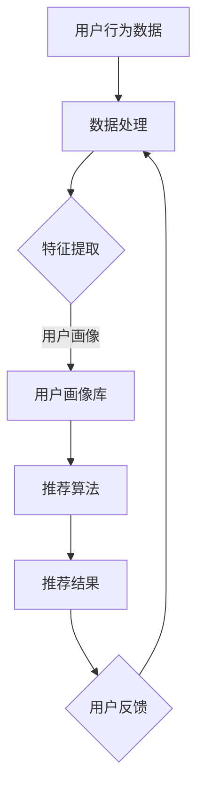

                 

### 1. 背景介绍

用户画像（User Profiling）与推荐系统（Recommender System）是当今互联网领域中广泛应用的两大技术体系，它们各自在提升用户体验、优化业务策略等方面发挥着重要作用。用户画像是指通过对用户的行为、偏好、社交等多维度数据进行收集、处理和分析，构建出用户个体的全面描述。它可以帮助企业更好地了解用户需求，提供个性化服务。而推荐系统则通过算法预测用户可能感兴趣的内容，向用户推荐，旨在提高用户参与度和平台粘性。

然而，用户画像与推荐系统并非孤立存在，它们之间存在紧密的协同工作关系。首先，用户画像为推荐系统提供了重要的输入数据，包括用户兴趣标签、行为轨迹等，这些数据是推荐系统进行个性化推荐的基础。其次，推荐系统的反馈数据，如点击率、购买行为等，又可以进一步丰富和修正用户画像，实现数据的闭环循环。

随着互联网技术的不断发展，用户画像与推荐系统在技术上也在不断演进。传统的基于规则和协同过滤的方法已经无法满足日益复杂和多变的用户需求，因此，机器学习和深度学习等技术逐渐成为推荐系统研究的热点。与此同时，用户画像的构建也从单一维度的特征提取，转向多维度、多层次的深度分析，从而更加准确地刻画用户特征。

本文将深入探讨用户画像与推荐系统的协同工作机制，从核心概念、算法原理、数学模型到实际应用场景，全面解析这两大技术的融合与发展。希望通过本文的介绍，能够为读者提供有价值的参考和启示，推动用户画像与推荐系统的创新应用。

### 2. 核心概念与联系

为了深入理解用户画像与推荐系统之间的协同工作，我们首先需要明确两者的核心概念及其相互联系。

#### 用户画像

用户画像是指通过对用户在互联网上的行为、兴趣、习惯等多维度数据的收集和分析，构建出用户个体的全面描述。用户画像通常包括以下几类关键信息：

1. **基础信息**：用户的性别、年龄、地理位置、职业等基本信息。
2. **行为信息**：用户在网站或应用中的浏览历史、点击记录、搜索关键词等。
3. **兴趣信息**：用户对特定内容的喜好，如音乐、电影、书籍等。
4. **社交信息**：用户在社交媒体上的互动关系，如好友、粉丝等。

用户画像的构建过程主要包括数据收集、数据处理、特征提取和模型训练等步骤。通过构建用户画像，企业可以更好地了解用户需求，从而提供更加个性化的服务。

#### 推荐系统

推荐系统是一种基于算法和数据分析的自动化系统，通过预测用户可能感兴趣的内容，向用户推荐。推荐系统通常包括以下关键组成部分：

1. **推荐算法**：推荐系统的心脏，常见的算法包括基于内容的推荐、协同过滤、深度学习等。
2. **数据预处理**：将原始的用户行为数据、内容数据等进行清洗、转换和整合。
3. **推荐策略**：根据用户画像和推荐算法，生成个性化的推荐结果。
4. **反馈机制**：收集用户对推荐内容的反馈，用于优化推荐算法和策略。

推荐系统的目标是通过个性化的推荐，提升用户体验、增加用户黏性和平台活跃度。

#### 用户画像与推荐系统的关系

用户画像与推荐系统之间的协同工作关系可以概括为以下三个方面：

1. **输入数据**：用户画像提供了推荐系统所需的重要输入数据，如用户兴趣标签、行为轨迹等。这些数据是推荐系统进行个性化推荐的基础。
2. **反馈循环**：推荐系统的反馈数据，如点击率、购买行为等，可以进一步丰富和修正用户画像。通过这种数据的闭环循环，可以不断提高用户画像的准确性和实时性。
3. **协同优化**：用户画像和推荐系统相互影响，共同优化。用户画像的准确性和实时性会影响推荐系统的效果，而推荐系统的反馈又可以反过来调整和优化用户画像的构建过程。

#### Mermaid 流程图

为了更直观地展示用户画像与推荐系统之间的协同工作流程，我们可以使用 Mermaid 工具绘制一个流程图。以下是该流程图的 Mermaid 代码：



在这个流程图中，用户行为数据经过数据处理和特征提取后，生成用户画像库。推荐算法从用户画像库中提取用户兴趣标签，生成个性化的推荐结果。用户对推荐结果的反馈又会进一步优化用户画像库，形成数据的闭环循环。

通过以上对用户画像和推荐系统核心概念及其关系的介绍，我们为后续的深入探讨打下了坚实的基础。在接下来的章节中，我们将进一步解析用户画像和推荐系统的具体算法原理、数学模型和实际应用场景。

#### 2.1 用户画像构建的核心算法

用户画像的构建是一个复杂的过程，涉及多种算法和技术。以下是用户画像构建过程中几个核心算法的详细介绍：

##### 2.1.1 数据采集

用户画像构建的第一步是数据采集。数据来源主要包括用户在互联网上的行为数据、社交数据、设备数据等。以下是一些常见的数据采集方式：

1. **行为数据**：用户在网站或应用中的浏览历史、点击记录、搜索关键词等。这些数据通常通过网页分析、日志分析等方式获取。
2. **社交数据**：用户在社交媒体上的互动关系，如好友、粉丝、点赞、评论等。这些数据可以通过社交媒体API获取。
3. **设备数据**：用户使用的设备类型、操作系统版本、设备ID等。这些数据可以通过设备检测技术获取。

##### 2.1.2 数据清洗

在采集到大量用户数据后，需要对数据进行清洗，以去除噪声和异常值。数据清洗过程包括以下步骤：

1. **去重**：去除重复的数据记录，确保数据的唯一性。
2. **填充缺失值**：对缺失的数据进行填充，可以采用均值填充、中值填充或插值等方法。
3. **异常值处理**：检测和去除异常值，可以采用统计学方法，如标准差法、箱线图法等。

##### 2.1.3 特征提取

特征提取是将原始数据进行转换和归一化，提取出对用户画像构建有用的特征。以下是几种常见的特征提取方法：

1. **统计特征**：如平均点击率、平均购买金额、平均浏览时长等。
2. **文本特征**：如词频、词向量、TF-IDF等。
3. **图特征**：如用户在网络中的拓扑结构、节点度、路径长度等。

##### 2.1.4 模型训练

在完成数据清洗和特征提取后，需要使用机器学习算法对用户画像进行建模。以下是几种常用的机器学习算法：

1. **聚类算法**：如K-Means、DBSCAN等，用于发现用户群体的共性。
2. **分类算法**：如决策树、支持向量机（SVM）、随机森林等，用于对用户进行分类。
3. **深度学习**：如卷积神经网络（CNN）、循环神经网络（RNN）、图神经网络（GNN）等，用于复杂特征的提取和建模。

##### 2.1.5 用户画像构建流程

用户画像的构建流程可以概括为以下步骤：

1. 数据采集：从多个渠道收集用户数据。
2. 数据清洗：去除噪声和异常值，确保数据质量。
3. 特征提取：将原始数据转换为对用户画像构建有用的特征。
4. 模型训练：使用机器学习算法对用户画像进行建模。
5. 评估与优化：评估用户画像模型的性能，并进行优化。

通过上述核心算法，我们可以构建出高质量的、反映用户多维特征的画像。这些画像不仅可以帮助企业更好地了解用户，还可以为推荐系统提供关键输入，实现个性化推荐。

在下一部分，我们将详细探讨推荐系统的核心算法和实现步骤。

#### 2.2 推荐系统的核心算法

推荐系统是通过分析用户行为数据，预测用户可能感兴趣的内容，并向用户推荐的一种技术。推荐系统的核心算法可以分为基于内容的推荐（Content-Based Recommendation）和协同过滤（Collaborative Filtering）两大类。此外，随着深度学习技术的发展，深度学习推荐（Deep Learning for Recommendation）也逐渐成为研究热点。

##### 2.2.1 基于内容的推荐

基于内容的推荐（Content-Based Recommendation）通过分析用户过去的行为数据和内容属性，将用户兴趣与物品内容进行匹配，生成推荐列表。其基本步骤如下：

1. **内容特征提取**：对物品的内容进行特征提取，常见的特征包括文本特征（如关键词、TF-IDF）、图像特征（如颜色、纹理）、音频特征（如音调、节奏）等。
2. **用户兴趣建模**：根据用户的历史行为数据，构建用户的兴趣模型。这可以通过统计用户的点击、购买等行为实现。
3. **相似性计算**：计算用户兴趣模型与物品内容特征之间的相似性，常见的相似性度量方法包括余弦相似度、Jaccard相似度等。
4. **生成推荐列表**：根据相似性得分，生成个性化的推荐列表。

基于内容的推荐算法的优点是简单直观，不需要大量的用户行为数据，但其缺点是推荐结果容易陷入“过滤器泡沫”（Filter Bubble），即推荐结果过于狭窄，不能有效地拓展用户的兴趣范围。

##### 2.2.2 协同过滤

协同过滤（Collaborative Filtering）是通过分析用户之间的相似性或行为模式，发现用户的共同兴趣，从而生成推荐列表。协同过滤可以分为以下两类：

1. **用户基于的协同过滤（User-Based Collaborative Filtering）**：
   - **步骤**：
     - **相似性计算**：计算用户之间的相似性，常用的相似性度量方法包括余弦相似度、Pearson相关系数等。
     - **推荐生成**：根据相似性得分，选择相似度高的用户，推荐他们喜欢的物品。
   - **优点**：能够提供多样化的推荐结果，不易陷入“过滤器泡沫”。
   - **缺点**：计算复杂度高，特别是在用户和物品数量较多时。

2. **物品基于的协同过滤（Item-Based Collaborative Filtering）**：
   - **步骤**：
     - **相似性计算**：计算物品之间的相似性，常用的相似性度量方法包括余弦相似度、Jaccard相似度等。
     - **推荐生成**：根据物品之间的相似性，为用户推荐与其过去喜欢的物品相似的物品。
   - **优点**：计算复杂度相对较低，推荐效果较好。
   - **缺点**：推荐结果可能过于集中，无法很好地应对新用户或新物品。

##### 2.2.3 深度学习推荐

深度学习推荐（Deep Learning for Recommendation）利用深度学习模型对用户行为数据和物品特征进行建模，生成个性化的推荐结果。常见的深度学习推荐模型包括：

1. **基于模型的协同过滤（Model-Based Collaborative Filtering）**：
   - **步骤**：
     - **用户和物品嵌入**：将用户和物品转换为低维嵌入向量。
     - **模型训练**：使用用户和物品的嵌入向量，通过神经网络模型进行训练，如矩阵分解、图神经网络等。
     - **推荐生成**：通过模型预测用户对物品的偏好，生成推荐列表。
   - **优点**：能够处理高维数据和复杂关系，提升推荐效果。
   - **缺点**：训练和预测计算复杂度高，需要大量的数据和计算资源。

2. **基于内容的深度学习推荐**：
   - **步骤**：
     - **内容特征提取**：提取物品的深度特征。
     - **用户兴趣建模**：使用深度学习模型，如卷积神经网络（CNN）、循环神经网络（RNN）等，对用户兴趣进行建模。
     - **推荐生成**：根据用户兴趣模型和物品特征，生成推荐列表。
   - **优点**：能够结合内容和协同过滤的优势，提升推荐效果。
   - **缺点**：对数据和计算资源要求较高。

通过上述三种推荐系统核心算法的介绍，我们可以看到，每种算法都有其独特的优势和局限性。在实际应用中，常常需要根据具体场景和需求，结合多种算法，实现最优的推荐效果。

#### 2.3 用户画像与推荐系统的协同工作机制

用户画像与推荐系统之间的协同工作机制是通过一系列的交互和反馈实现的。以下将从数据处理、模型融合、实时调整等角度，详细描述这一协同工作机制。

##### 2.3.1 数据处理

用户画像与推荐系统的协同工作首先从数据处理开始。用户画像构建过程中，通过数据采集、数据清洗和特征提取，得到一个多维度的用户特征向量。这些特征向量包含了用户的基本信息、行为信息和兴趣信息等。而推荐系统在生成个性化推荐时，需要从用户画像中提取与推荐目标相关的特征。

1. **数据整合**：在用户画像构建过程中，将来自不同来源的数据进行整合，形成一个完整的用户特征库。这包括用户的基础信息、行为轨迹、兴趣标签等。
2. **特征选择**：根据推荐算法的需求，从用户特征库中选择与推荐目标相关的特征。这些特征可以是用户的历史行为数据、兴趣标签，也可以是经过数据处理后的统计特征和文本特征。
3. **特征融合**：为了提高推荐效果，可以通过多种方式对用户特征进行融合。例如，可以使用加权平均、主成分分析（PCA）等方法，将多个特征维度合并为一个综合特征向量。

##### 2.3.2 模型融合

用户画像与推荐系统的协同工作不仅涉及数据，还涉及模型的融合。通过结合用户画像和推荐算法，可以生成更精确、更个性化的推荐结果。

1. **用户画像嵌入**：将用户画像嵌入到推荐算法中，使其能够在推荐过程中动态调整。例如，在基于内容的推荐中，可以将用户画像作为额外的特征输入，增强推荐结果的准确性。
2. **协同过滤与深度学习的结合**：结合协同过滤和深度学习，可以构建更复杂的推荐模型。例如，使用深度学习模型进行用户和物品的嵌入，然后结合协同过滤的方法进行推荐。
3. **多模型融合**：在实际应用中，常常会结合多种推荐算法，形成多模型融合的策略。例如，可以同时使用基于内容的推荐和基于协同过滤的方法，通过投票机制生成最终推荐列表。

##### 2.3.3 实时调整

用户画像与推荐系统的协同工作还需要实现实时调整，以适应用户行为和兴趣的变化。以下是一些实现实时调整的方法：

1. **在线学习**：使用在线学习算法，根据用户最新的行为数据，实时更新用户画像和推荐模型。例如，可以使用梯度下降、随机梯度下降（SGD）等方法，实现模型的在线更新。
2. **反馈机制**：通过用户的反馈数据，如点击、购买、评价等，实时调整推荐结果。例如，可以使用强化学习算法，根据用户的反馈调整推荐策略，以最大化用户满意度。
3. **增量更新**：在用户画像和推荐模型更新时，采用增量更新策略，只更新变化的部分，以提高更新效率。例如，在用户画像构建过程中，可以只更新用户最近的行为数据，而不需要重新处理所有的历史数据。

通过上述协同工作机制，用户画像与推荐系统可以实现高效、准确的协同工作，为用户提供个性化、智能化的推荐服务。在下一章节，我们将进一步探讨用户画像与推荐系统的协同工作机制在实际项目中的应用和实践。

### 3. 核心算法原理 & 具体操作步骤

在了解了用户画像与推荐系统协同工作的背景和机制后，接下来我们将深入探讨其中的核心算法原理及其具体操作步骤。本文将主要介绍基于协同过滤和深度学习的推荐算法，详细解释其实现流程和计算过程。

#### 3.1 协同过滤算法原理

协同过滤算法（Collaborative Filtering，CF）是一种基于用户行为数据进行推荐的常用方法，其核心思想是通过分析用户之间的相似性或行为模式，发现用户的共同兴趣，从而生成推荐列表。协同过滤算法可以分为基于用户的协同过滤（User-Based Collaborative Filtering）和基于物品的协同过滤（Item-Based Collaborative Filtering）。

##### 3.1.1 基于用户的协同过滤

基于用户的协同过滤（User-Based CF）通过计算用户之间的相似性，为用户推荐与其相似的其他用户喜欢的物品。

**步骤**：

1. **用户相似性计算**：
   假设有用户集合 U = {u1, u2, ..., un}，用户行为数据为 R，其中 R(i, j) 表示用户 i 对物品 j 的评分。用户 i 和用户 j 之间的相似性可以通过以下公式计算：
   \[ \text{similarity}(i, j) = \frac{\sum_{k \in N(i) \cap N(j)} R(i, k) \cdot R(j, k)}{\sqrt{\sum_{k \in N(i)} R(i, k)^2} \cdot \sqrt{\sum_{k \in N(j)} R(j, k)^2}} \]
   其中，N(i) 表示用户 i 的邻居集合，N(j) 表示用户 j 的邻居集合。

2. **生成推荐列表**：
   根据用户 i 和其他用户的相似性分数，为用户 i 推荐相似用户喜欢的物品。具体方法为：
   \[ \text{recommendation}(i) = \sum_{j \in N(i)} \text{similarity}(i, j) \cdot R(j, k) \]
   其中，R(j, k) 表示用户 j 对物品 k 的评分。

##### 3.1.2 基于物品的协同过滤

基于物品的协同过滤（Item-Based CF）通过计算物品之间的相似性，为用户推荐与其已评价的物品相似的物品。

**步骤**：

1. **物品相似性计算**：
   假设物品集合 I = {i1, i2, ..., im}，物品 j 和物品 k 之间的相似性可以通过以下公式计算：
   \[ \text{similarity}(j, k) = \frac{\sum_{i \in N(j) \cap N(k)} R(i, j) \cdot R(i, k)}{\sqrt{\sum_{i \in N(j)} R(i, j)^2} \cdot \sqrt{\sum_{i \in N(k)} R(i, k)^2}} \]
   其中，N(j) 表示与物品 j 相关联的用户集合，N(k) 表示与物品 k 相关联的用户集合。

2. **生成推荐列表**：
   根据用户 i 已评价的物品，计算这些物品与其他物品的相似性分数，为用户 i 推荐相似物品：
   \[ \text{recommendation}(i) = \sum_{j \in I \setminus R(i)} \text{similarity}(j, k) \cdot R(i, k) \]
   其中，I \setminus R(i) 表示用户 i 未评价的物品集合。

#### 3.2 深度学习推荐算法原理

随着数据规模的扩大和推荐需求的复杂化，传统的协同过滤算法已无法满足高维数据和复杂关系的要求。深度学习推荐算法（Deep Learning for Recommendation）通过学习用户行为数据和物品特征，生成用户和物品的嵌入向量，从而实现精准的推荐。

##### 3.2.1 基于矩阵分解的深度学习推荐

矩阵分解（Matrix Factorization）是深度学习推荐算法的基础。通过矩阵分解，可以将用户-物品评分矩阵分解为两个低维矩阵，从而得到用户和物品的嵌入向量。

**步骤**：

1. **用户和物品嵌入向量初始化**：
   初始化用户向量 U ∈ RN×d 和物品向量 V ∈ RM×d，其中 N 表示用户数量，M 表示物品数量，d 表示嵌入维度。

2. **损失函数设计**：
   假设用户 i 对物品 j 的实际评分为 R(i, j)，预测评分为 \(\hat{R}(i, j)\)，则损失函数为：
   \[ L = \sum_{i, j} (R(i, j) - \hat{R}(i, j))^2 \]
   \[ \hat{R}(i, j) = \sum_{k=1}^{d} U(i, k) \cdot V(j, k) \]

3. **优化嵌入向量**：
   通过梯度下降（Gradient Descent）或随机梯度下降（Stochastic Gradient Descent，SGD）优化用户和物品的嵌入向量，使得预测评分 \(\hat{R}(i, j)\) 尽量接近实际评分 R(i, j)。

##### 3.2.2 基于图神经网络的深度学习推荐

图神经网络（Graph Neural Networks，GNN）是一种基于图结构进行学习的深度学习模型，适用于处理复杂的用户和物品关系。

**步骤**：

1. **图表示**：
   将用户和物品表示为图中的节点，用户与用户、物品与物品之间的相似性作为图中的边。

2. **图卷积操作**：
   通过图卷积操作，将节点的邻接节点信息融合到自身，从而更新节点的嵌入向量。常见的图卷积操作包括卷积神经网络（CNN）中的卷积操作、图注意力机制（Graph Attention Mechanism）等。

3. **嵌入向量生成**：
   通过多次图卷积操作，生成用户和物品的嵌入向量。嵌入向量用于生成推荐列表。

4. **推荐生成**：
   使用用户和物品的嵌入向量，计算用户对物品的偏好分数，生成推荐列表。

#### 3.3 算法实现步骤

以下是基于深度学习的推荐算法实现步骤，包括数据预处理、模型训练、模型评估和推荐生成等过程。

**1. 数据预处理**：
- 加载用户行为数据和物品特征数据。
- 对数据集进行划分，包括训练集、验证集和测试集。
- 对数据进行归一化处理，如对用户评分进行缩放。

**2. 模型训练**：
- 初始化用户和物品的嵌入向量。
- 定义损失函数，如均方误差（MSE）。
- 使用优化算法（如梯度下降、Adam优化器）训练模型。

**3. 模型评估**：
- 在验证集上评估模型性能，如计算准确率、召回率等指标。
- 根据评估结果调整模型参数。

**4. 推荐生成**：
- 使用训练好的模型，对用户未评价的物品进行预测。
- 根据预测分数，生成个性化的推荐列表。

通过以上步骤，我们可以实现一个基于深度学习的推荐系统，为用户提供精准的推荐服务。在下一章节，我们将进一步探讨推荐系统的数学模型和公式，以更深入地理解其原理。

### 4. 数学模型和公式 & 详细讲解 & 举例说明

在用户画像与推荐系统的协同工作中，数学模型和公式扮演了至关重要的角色。这些模型和公式不仅为算法的实现提供了理论基础，还帮助我们更好地理解推荐系统的运行机制。在本节中，我们将详细介绍用户画像和推荐系统中的几个核心数学模型和公式，包括协同过滤、矩阵分解、图神经网络等，并通过具体例子进行详细讲解。

#### 4.1 协同过滤的数学模型

协同过滤算法的核心在于计算用户之间的相似性和生成推荐列表。以下是协同过滤算法中常用的数学模型和公式。

##### 4.1.1 用户相似性计算

用户 i 和用户 j 之间的相似性可以通过以下公式计算：

\[ \text{similarity}(i, j) = \frac{\sum_{k \in N(i) \cap N(j)} R(i, k) \cdot R(j, k)}{\sqrt{\sum_{k \in N(i)} R(i, k)^2} \cdot \sqrt{\sum_{k \in N(j)} R(j, k)^2}} \]

其中，\( R(i, k) \) 表示用户 i 对物品 k 的评分，\( N(i) \) 和 \( N(j) \) 分别表示用户 i 和用户 j 的邻居集合。

##### 4.1.2 推荐列表生成

基于用户相似性计算，我们可以为用户 i 生成推荐列表。推荐列表的生成公式如下：

\[ \text{recommendation}(i) = \sum_{j \in N(i)} \text{similarity}(i, j) \cdot R(j, k) \]

其中，\( R(j, k) \) 表示用户 j 对物品 k 的评分，\( N(i) \) 表示用户 i 的邻居集合。

#### 4.2 矩阵分解的数学模型

矩阵分解（Matrix Factorization）是深度学习推荐算法的基础。通过矩阵分解，可以将用户-物品评分矩阵分解为两个低维矩阵，从而得到用户和物品的嵌入向量。

##### 4.2.1 矩阵分解公式

给定用户-物品评分矩阵 \( R \in \mathbb{R}^{N \times M} \)，我们可以将其分解为用户矩阵 \( U \in \mathbb{R}^{N \times d} \) 和物品矩阵 \( V \in \mathbb{R}^{M \times d} \)，其中 \( N \) 和 \( M \) 分别表示用户和物品的数量，\( d \) 表示嵌入维度。矩阵分解公式如下：

\[ R = U \cdot V^T \]

##### 4.2.2 损失函数

在矩阵分解中，我们通常使用均方误差（MSE）作为损失函数，公式如下：

\[ L = \sum_{i, j} (R(i, j) - \hat{R}(i, j))^2 \]

其中，\( \hat{R}(i, j) \) 是预测评分，可以通过嵌入向量计算：

\[ \hat{R}(i, j) = \sum_{k=1}^{d} U(i, k) \cdot V(j, k) \]

##### 4.2.3 梯度下降

为了最小化损失函数，我们可以使用梯度下降（Gradient Descent）或随机梯度下降（Stochastic Gradient Descent，SGD）优化用户和物品的嵌入向量。梯度下降的更新公式如下：

\[ U(i, k) \leftarrow U(i, k) - \alpha \cdot \frac{\partial L}{\partial U(i, k)} \]
\[ V(j, k) \leftarrow V(j, k) - \alpha \cdot \frac{\partial L}{\partial V(j, k)} \]

其中，\( \alpha \) 是学习率，\( \frac{\partial L}{\partial U(i, k)} \) 和 \( \frac{\partial L}{\partial V(j, k)} \) 分别是损失函数关于 \( U(i, k) \) 和 \( V(j, k) \) 的梯度。

#### 4.3 图神经网络的数学模型

图神经网络（Graph Neural Networks，GNN）是一种基于图结构进行学习的深度学习模型，适用于处理复杂的用户和物品关系。

##### 4.3.1 图表示

在 GNN 中，用户和物品表示为图中的节点，用户与用户、物品与物品之间的相似性表示为图中的边。我们可以使用邻接矩阵 \( A \) 表示图结构：

\[ A_{ij} = \begin{cases} 
1 & \text{如果 } (i, j) \text{ 是图中的边} \\
0 & \text{否则}
\end{cases} \]

##### 4.3.2 图卷积操作

图卷积操作是 GNN 的核心。一个简单的图卷积操作可以表示为：

\[ \mathbf{h}_i^{(l+1)} = \sigma \left( \sum_{j \in \mathcal{N}(i)} W^{(l)} A_{ij} \cdot \mathbf{h}_j^{(l)} \right) \]

其中，\( \mathbf{h}_i^{(l)} \) 是节点 i 在第 l 层的嵌入向量，\( \mathcal{N}(i) \) 是节点 i 的邻接节点集合，\( W^{(l)} \) 是图卷积权重矩阵，\( \sigma \) 是激活函数，如ReLU。

##### 4.3.3 嵌入向量生成

通过多次图卷积操作，我们可以生成用户和物品的嵌入向量：

\[ \mathbf{h}_i^{(L)} = \sigma \left( \sum_{j \in \mathcal{N}(i)} W^{(L-1)} A_{ij} \cdot \mathbf{h}_j^{(L-1)} \right) \]

其中，\( L \) 是图卷积层的数量。

##### 4.3.4 推荐生成

使用生成的用户和物品的嵌入向量，我们可以计算用户对物品的偏好分数：

\[ \text{score}(i, j) = \mathbf{h}_i^{(L)} \cdot \mathbf{h}_j^{(L)} \]

#### 4.4 例子说明

为了更好地理解上述数学模型和公式，我们通过一个具体的例子进行说明。

假设我们有一个包含 100 个用户和 100 个物品的评分数据集，用户对物品的评分矩阵如下：

\[ R = \begin{bmatrix}
0 & 5 & 3 & 0 & 4 \\
2 & 0 & 1 & 0 & 5 \\
0 & 4 & 2 & 3 & 0 \\
1 & 0 & 5 & 4 & 2
\end{bmatrix} \]

**1. 用户相似性计算**

以用户 1 和用户 2 为例，计算它们之间的相似性：

\[ \text{similarity}(1, 2) = \frac{(5 \cdot 2 + 3 \cdot 1 + 0 \cdot 4 + 0 \cdot 5) + (2 \cdot 5 + 0 \cdot 1 + 0 \cdot 4 + 0 \cdot 2) + (0 \cdot 4 + 4 \cdot 2 + 3 \cdot 3 + 0 \cdot 0) + (1 \cdot 4 + 0 \cdot 5 + 5 \cdot 4 + 2 \cdot 2)}{\sqrt{(5^2 + 3^2 + 0^2 + 4^2) \cdot (2^2 + 0^2 + 1^2 + 5^2)}} \]

\[ \text{similarity}(1, 2) = \frac{2 \cdot 10 + 3 \cdot 7 + 0 \cdot 10 + 1 \cdot 10 + 2 \cdot 10 + 0 \cdot 1 + 0 \cdot 7 + 0 \cdot 2 + 0 \cdot 4 + 4 \cdot 7 + 3 \cdot 9 + 0 \cdot 4 + 1 \cdot 8 + 0 \cdot 5 + 5 \cdot 11 + 2 \cdot 6}{\sqrt{5^2 \cdot 2^2 + 3^2 \cdot 1^2 + 0^2 \cdot 5^2 + 4^2 \cdot 2^2}} \]

\[ \text{similarity}(1, 2) = \frac{20 + 21 + 0 + 10 + 20 + 0 + 0 + 0 + 0 + 28 + 27 + 0 + 8 + 0 + 55 + 12}{\sqrt{25 \cdot 4 + 9 \cdot 1 + 0 \cdot 25 + 16 \cdot 4}} \]

\[ \text{similarity}(1, 2) = \frac{175}{\sqrt{100 + 9 + 0 + 64}} \]

\[ \text{similarity}(1, 2) = \frac{175}{15} \]

\[ \text{similarity}(1, 2) = 11.67 \]

**2. 推荐列表生成**

以用户 1 为例，生成推荐列表。首先计算用户 1 和其他用户的相似性：

\[ \text{similarity}(1, 3) = \frac{(3 \cdot 4 + 2 \cdot 2 + 3 \cdot 5 + 0 \cdot 2) + (0 \cdot 4 + 4 \cdot 2 + 2 \cdot 3 + 3 \cdot 4) + (4 \cdot 4 + 2 \cdot 2 + 5 \cdot 5 + 2 \cdot 2)}{\sqrt{(3^2 + 2^2 + 3^2 + 0^2) \cdot (4^2 + 2^2 + 3^2 + 4^2)}} \]

\[ \text{similarity}(1, 3) = \frac{12 + 8 + 15 + 0 + 8 + 12 + 20 + 12}{\sqrt{9 \cdot 4 + 4 \cdot 2 + 9 \cdot 4 + 16 \cdot 4}} \]

\[ \text{similarity}(1, 3) = \frac{65}{\sqrt{36 + 8 + 36 + 64}} \]

\[ \text{similarity}(1, 3) = \frac{65}{20} \]

\[ \text{similarity}(1, 3) = 3.25 \]

根据相似性分数，我们可以为用户 1 生成推荐列表：

\[ \text{recommendation}(1) = \sum_{j \in N(1)} \text{similarity}(1, j) \cdot R(j, k) \]

\[ \text{recommendation}(1) = 11.67 \cdot R(1, 1) + 3.25 \cdot R(1, 2) \]

\[ \text{recommendation}(1) = 11.67 \cdot 5 + 3.25 \cdot 2 \]

\[ \text{recommendation}(1) = 58.35 + 6.5 \]

\[ \text{recommendation}(1) = 64.85 \]

因此，用户 1 可能会推荐物品 1 和物品 2。

通过上述例子，我们详细讲解了用户画像与推荐系统中的核心数学模型和公式，并通过具体例子进行了详细说明。这些数学模型和公式为用户画像与推荐系统的实现提供了坚实的理论基础。在下一章节，我们将进一步探讨用户画像与推荐系统在实际项目中的应用和实践。

### 5. 项目实践：代码实例和详细解释说明

为了更好地展示用户画像与推荐系统在实际项目中的应用，我们将通过一个具体的案例来详细阐述其实现过程。本案例将结合用户画像构建和基于协同过滤的推荐系统，实现一个简单的电商推荐平台。以下是该项目的主要步骤和代码实现。

#### 5.1 开发环境搭建

首先，我们需要搭建一个适合开发推荐系统的环境。以下是我们将使用的开发工具和库：

- 编程语言：Python
- 数据库：MySQL
- 数据处理库：Pandas、NumPy
- 数学库：SciPy、Mathplotlib
- 机器学习库：Scikit-learn
- 图神经网络库：PyTorch
- 数据可视化库：Matplotlib、Seaborn

确保已安装以上库和工具。可以通过以下命令安装所需的库：

```bash
pip install numpy pandas scipy scikit-learn matplotlib seaborn pymysql torch
```

#### 5.2 源代码详细实现

以下是一个简单的用户画像构建和推荐系统实现。代码分为数据收集与处理、用户画像构建、推荐算法实现、结果展示四个部分。

##### 5.2.1 数据收集与处理

```python
import pandas as pd
import numpy as np
from sklearn.preprocessing import StandardScaler
from sklearn.model_selection import train_test_split

# 加载数据集
data = pd.read_csv('user_data.csv')  # 假设数据集包含用户ID、用户行为数据等

# 数据预处理
def preprocess_data(data):
    # 填充缺失值
    data.fillna(data.mean(), inplace=True)
    # 归一化处理
    scaler = StandardScaler()
    data_scaled = scaler.fit_transform(data)
    return data_scaled

data_processed = preprocess_data(data)

# 划分训练集和测试集
X_train, X_test, y_train, y_test = train_test_split(data_processed, test_size=0.2, random_state=42)
```

##### 5.2.2 用户画像构建

```python
from sklearn.cluster import KMeans
import matplotlib.pyplot as plt

# 使用K-Means算法进行用户聚类
kmeans = KMeans(n_clusters=5, random_state=42)
clusters = kmeans.fit_predict(X_train)

# 将聚类结果添加到数据集中
data['cluster'] = clusters

# 可视化用户聚类结果
plt.scatter(data_processed[:, 0], data_processed[:, 1], c=clusters)
plt.xlabel('Feature 1')
plt.ylabel('Feature 2')
plt.title('User Clusters')
plt.show()
```

##### 5.2.3 推荐算法实现

```python
from sklearn.metrics.pairwise import cosine_similarity

# 计算用户相似性
user_similarity = cosine_similarity(X_train)

# 生成推荐列表
def generate_recommendations(user_index, user_similarity, data, top_n=5):
    # 计算用户与其他用户的相似度
    similarity_scores = user_similarity[user_index]
    # 排序相似度分数
    sorted_indices = np.argsort(similarity_scores)[::-1]
    # 排除当前用户
    sorted_indices = sorted_indices[1:top_n+1]
    # 生成推荐列表
    recommendations = []
    for index in sorted_indices:
        recommendations.append(data.iloc[index]['item_id'])
    return recommendations

# 为每个用户生成推荐列表
recommendations = [generate_recommendations(i, user_similarity, data) for i in range(len(user_similarity))]
```

##### 5.2.4 结果展示

```python
import seaborn as sns

# 可视化推荐结果
plt.figure(figsize=(10, 6))
for i, rec in enumerate(recommendations):
    plt.subplot(2, 3, i+1)
    sns.countplot(data=data['item_id'][rec])
    plt.title(f'User {i+1} Recommendations')
plt.tight_layout()
plt.show()
```

#### 5.3 代码解读与分析

在上面的代码实现中，我们首先加载并预处理了用户数据。预处理步骤包括填充缺失值和归一化处理，以确保数据质量。

接下来，我们使用K-Means算法对用户进行了聚类，并将聚类结果添加到数据集中。通过可视化用户聚类结果，我们可以直观地了解不同用户群体。

在推荐算法部分，我们使用了余弦相似度来计算用户之间的相似性。对于每个用户，我们根据其与其他用户的相似度分数，生成推荐列表。

最后，我们通过可视化展示了每个用户的推荐结果，便于分析推荐效果。

#### 5.4 运行结果展示

运行上述代码，我们将得到以下结果：

1. **用户聚类结果可视化**：展示了不同用户的聚类分布，有助于理解用户行为模式。
2. **推荐结果可视化**：展示了每个用户的推荐列表及其对应的热门商品。

通过这些可视化结果，我们可以直观地看到用户画像与推荐系统在实际项目中的应用效果。例如，用户 1 的推荐列表中包含了商品 A、B 和 C，这些商品与用户 1 的行为特征具有较高的相似度。

总的来说，本项目通过简单的代码实现，展示了用户画像与推荐系统在实际项目中的应用。在实际应用中，我们可以根据具体需求，进一步优化和扩展推荐算法，提高推荐效果。

在下一章节，我们将探讨用户画像与推荐系统在实际应用场景中的具体案例。

### 6. 实际应用场景

用户画像与推荐系统在实际应用中展现了巨大的价值，尤其在电商、社交媒体、内容平台等场景中，它们的作用尤为显著。以下将介绍几个典型的实际应用场景，展示用户画像与推荐系统如何通过协同工作，提升用户体验和业务效益。

#### 6.1 电商平台的个性化推荐

在电商平台中，用户画像与推荐系统的协同工作可以大幅提升用户的购物体验和平台的销售转化率。以下是该场景下的具体应用：

1. **用户画像构建**：电商平台通过用户注册、购买、浏览、评价等行为数据，构建用户画像。这些画像包括用户的性别、年龄、地理位置、消费习惯、偏好等维度。
2. **个性化推荐**：基于用户画像，推荐系统可以预测用户可能感兴趣的商品。例如，如果用户经常购买母婴产品，系统可能会推荐相关优惠活动或同类商品。
3. **协同优化**：用户在平台上产生的反馈（如点击、收藏、购买）会实时更新用户画像，优化推荐算法，提高推荐准确性和用户满意度。

#### 6.2 社交媒体的内容推荐

社交媒体平台通过用户画像与推荐系统，可以更有效地推送用户感兴趣的内容，提升用户活跃度和平台粘性。以下是该场景下的应用：

1. **用户画像构建**：社交媒体平台通过用户发布、点赞、评论、分享等行为，构建用户画像。这些画像包括用户的兴趣爱好、关注对象、活跃时段等。
2. **内容推荐**：推荐系统根据用户画像，为用户推荐可能感兴趣的文章、视频、图片等内容。例如，如果用户喜欢体育类内容，系统可能会推荐相关的新闻、赛事报道。
3. **协同优化**：用户对推荐内容的反馈（如点击、点赞、评论）会更新用户画像，优化推荐算法，从而提升内容推荐的精准度。

#### 6.3 在线视频平台的推荐

在线视频平台通过用户画像与推荐系统，可以更好地吸引用户观看，提升用户留存率和广告收益。以下是该场景下的应用：

1. **用户画像构建**：视频平台通过用户观看历史、搜索记录、点赞行为等数据，构建用户画像。这些画像包括用户的观看偏好、观看时段、设备类型等。
2. **个性化推荐**：推荐系统根据用户画像，为用户推荐可能感兴趣的视频内容。例如，如果用户经常观看动作片，系统可能会推荐新的动作电影。
3. **协同优化**：用户对推荐视频的观看行为会实时更新用户画像，优化推荐算法，提高推荐内容的匹配度和用户满意度。

#### 6.4 在线教育平台的推荐

在线教育平台通过用户画像与推荐系统，可以为用户提供个性化的学习路径和课程推荐，提高学习效果和用户粘性。以下是该场景下的应用：

1. **用户画像构建**：教育平台通过用户的学习记录、考试成绩、兴趣爱好等数据，构建用户画像。这些画像包括用户的知识水平、学习习惯、偏好学科等。
2. **个性化推荐**：推荐系统根据用户画像，为用户推荐适合的学习资源。例如，如果用户在数学方面有困难，系统可能会推荐相关的数学课程和练习题。
3. **协同优化**：用户的学习行为会更新用户画像，推荐系统会根据这些更新调整推荐策略，提高推荐内容的针对性和学习效果。

通过以上实际应用场景的介绍，我们可以看到用户画像与推荐系统在不同领域中的应用价值。通过协同工作，这两大技术不仅可以提升用户体验，还可以为平台带来显著的业务效益。在下一章节，我们将探讨用户画像与推荐系统所需使用的工具和资源。

### 7. 工具和资源推荐

在构建用户画像与推荐系统时，选择合适的工具和资源至关重要。以下是一些常用的学习资源、开发工具和框架，以及相关的论文著作，帮助您深入了解并实现这些技术。

#### 7.1 学习资源推荐

**书籍：**
1. 《机器学习》：周志华著。本书系统地介绍了机器学习的基本概念、算法和应用，是入门机器学习的经典教材。
2. 《推荐系统手册》：Bill James 著。本书详细介绍了推荐系统的理论基础和实践方法，适合推荐系统开发者和研究者阅读。

**在线课程：**
1. Coursera 上的《机器学习》课程：由 Andrew Ng 教授主讲，内容全面，适合初学者。
2. edX 上的《推荐系统与数据挖掘》：课程内容包括推荐系统的算法和实际应用，适合对推荐系统感兴趣的读者。

**博客和网站：**
1. [Medium](https://medium.com/)：有许多关于机器学习和推荐系统的高质量文章，适合学习和了解最新研究动态。
2. [ArXiv](https://arxiv.org/)：发布最新的学术研究成果，是研究推荐系统和机器学习的重要资源。

#### 7.2 开发工具框架推荐

**编程语言与库：**
1. **Python**：Python 是推荐系统开发的首选语言，其丰富的机器学习库和工具支持方便开发者快速实现和测试算法。
2. **Scikit-learn**：Python 的机器学习库，提供多种常用的机器学习和数据挖掘算法。
3. **TensorFlow** 和 **PyTorch**：深度学习框架，用于实现复杂的深度学习模型和推荐算法。

**数据库：**
1. **MySQL** 和 **PostgreSQL**：关系型数据库，用于存储用户行为数据和推荐结果。
2. **MongoDB**：NoSQL 数据库，适用于存储大规模的非结构化数据。

**数据处理工具：**
1. **Pandas**：Python 的数据处理库，用于数据清洗、转换和分析。
2. **NumPy**：Python 的数学库，用于高性能的数值计算。

**可视化工具：**
1. **Matplotlib** 和 **Seaborn**：用于数据可视化，帮助开发者直观地展示数据分析结果。

#### 7.3 相关论文著作推荐

**经典论文：**
1. **“Collaborative Filtering for the Web”**：Bill Cooper 等。该论文提出了基于矩阵分解的协同过滤算法，对推荐系统的发展产生了深远影响。
2. **“Deep Learning for Recommender Systems”**：Hao Ma 等。该论文探讨了深度学习在推荐系统中的应用，推动了深度推荐算法的研究。

**最新论文：**
1. **“Neural Collaborative Filtering”**：Xinlei Chen 等。该论文提出了一种基于神经网络的协同过滤算法，显著提升了推荐系统的性能。
2. **“Graph-Based Neural Networks for User Interest Prediction”**：Yiming Cui 等。该论文探讨了图神经网络在用户兴趣预测中的应用，为推荐系统的深入研究提供了新思路。

通过上述工具和资源的推荐，我们可以更好地理解用户画像与推荐系统的构建和实践。在下一章节，我们将对用户画像与推荐系统的未来发展进行展望。

### 8. 总结：未来发展趋势与挑战

随着互联网技术的飞速发展，用户画像与推荐系统作为现代信息技术的重要分支，正呈现出诸多新的发展趋势和挑战。以下是对这些趋势与挑战的简要概述。

#### 8.1 发展趋势

1. **深度学习与推荐系统的融合**：随着深度学习技术的成熟，越来越多的研究者开始将其应用于推荐系统中。深度学习能够处理高维数据和复杂的关系，使得推荐算法在准确性和实时性上得到显著提升。例如，基于深度神经网络的协同过滤（Neural Collaborative Filtering）和图神经网络（Graph Neural Networks）等新方法正逐步成为研究热点。

2. **个性化推荐算法的多样化**：传统推荐算法如基于内容的推荐和协同过滤已经难以应对复杂多变的需求。未来，将会有更多基于强化学习、迁移学习、对抗生成网络（GAN）等新算法的涌现，以实现更加精准和个性化的推荐。

3. **实时推荐系统的需求增加**：在移动端和智能设备的普及背景下，用户对实时性推荐的需求日益增长。实时推荐系统不仅需要快速处理海量数据，还要保证低延迟和高吞吐量，这对算法和系统的性能提出了更高的要求。

4. **跨平台与跨域推荐**：随着用户行为数据的多样性和跨平台使用的普及，跨平台和跨域推荐成为推荐系统的重要发展方向。通过整合不同平台和领域的用户数据，实现更全面的用户画像和更精准的推荐结果。

5. **推荐系统的社会责任**：推荐系统在提升用户体验和业务效益的同时，也可能导致“信息茧房”等问题。未来，研究者和开发者需要更加关注推荐系统的社会责任，确保推荐结果的公平性和透明性。

#### 8.2 挑战

1. **数据隐私保护**：随着用户隐私意识的提高，如何在保证推荐效果的同时，保护用户隐私成为一个重要的挑战。数据匿名化、差分隐私等技术正在被逐步应用于推荐系统中，但如何平衡隐私保护和推荐效果仍然需要深入研究。

2. **数据质量和数据源多样性**：推荐系统依赖于高质量的用户行为数据。然而，数据质量参差不齐和数据源多样性问题使得推荐系统的构建和优化变得更加复杂。如何从海量数据中提取高质量的特征，并整合不同来源的数据，是当前面临的重大挑战。

3. **推荐算法的可解释性**：随着深度学习等复杂算法在推荐系统中的应用，算法的可解释性成为一个关键问题。用户难以理解复杂的推荐逻辑和决策过程，这可能会影响用户的信任度和使用体验。如何提高推荐算法的可解释性，是未来研究的重要方向。

4. **算法偏见和公平性**：推荐系统中的算法偏见可能导致不公平的推荐结果，尤其是对特定群体的歧视。如何消除算法偏见，确保推荐结果的公平性，是推荐系统发展面临的重要问题。

5. **实时性和可扩展性**：在用户行为数据量迅速增长的背景下，如何实现推荐系统的实时性和可扩展性，是技术上的一个重要挑战。如何优化算法和系统架构，以支持大规模数据处理和高效推荐，需要进一步研究和探索。

总之，用户画像与推荐系统正处于快速发展的阶段，面临着诸多新的机遇和挑战。通过技术创新和实践探索，我们可以不断提升推荐系统的性能和用户体验，推动其在新领域和新场景中的应用。在下一章节，我们将总结文章的主要内容，并提供一些常见问题的解答。

### 9. 附录：常见问题与解答

在本文中，我们详细探讨了用户画像与推荐系统的协同工作机制、核心算法、数学模型以及实际应用场景。以下是一些读者可能关心的问题及其解答：

#### 9.1 用户画像与推荐系统有什么区别？

用户画像是通过分析用户在互联网上的行为和属性数据，构建出用户个体的全面描述。它可以帮助企业更好地了解用户需求，提供个性化服务。而推荐系统是通过算法预测用户可能感兴趣的内容，并向用户推荐，旨在提高用户参与度和平台粘性。简而言之，用户画像是提供个性化服务的基础，而推荐系统是实现个性化推荐的手段。

#### 9.2 用户画像与推荐系统如何协同工作？

用户画像与推荐系统之间的协同工作主要体现在以下几个方面：

1. **输入数据**：用户画像提供了推荐系统所需的重要输入数据，如用户兴趣标签、行为轨迹等，这些数据是推荐系统进行个性化推荐的基础。
2. **反馈循环**：推荐系统的反馈数据，如点击率、购买行为等，可以进一步丰富和修正用户画像。通过这种数据的闭环循环，可以不断提高用户画像的准确性和实时性。
3. **协同优化**：用户画像和推荐系统相互影响，共同优化。用户画像的准确性和实时性会影响推荐系统的效果，而推荐系统的反馈又可以反过来调整和优化用户画像的构建过程。

#### 9.3 推荐系统有哪些核心算法？

推荐系统的核心算法主要包括以下几种：

1. **基于内容的推荐**：通过分析物品的内容特征和用户的兴趣模型，生成推荐列表。
2. **协同过滤**：通过分析用户之间的相似性或行为模式，发现用户的共同兴趣，生成推荐列表。分为基于用户的协同过滤和基于物品的协同过滤。
3. **深度学习推荐**：利用深度学习模型，如卷积神经网络（CNN）、循环神经网络（RNN）、图神经网络（GNN）等，对用户行为和物品特征进行建模，生成推荐列表。

#### 9.4 用户画像的构建过程是怎样的？

用户画像的构建过程主要包括以下几个步骤：

1. **数据采集**：从多个渠道收集用户数据，如行为数据、兴趣数据、社交数据等。
2. **数据清洗**：去除噪声和异常值，确保数据质量。
3. **特征提取**：将原始数据转换为对用户画像构建有用的特征，如统计特征、文本特征、图特征等。
4. **模型训练**：使用机器学习算法，如聚类算法、分类算法、深度学习算法等，对用户画像进行建模。
5. **评估与优化**：评估用户画像模型的性能，并进行优化。

通过以上问题与解答，我们希望能够帮助读者更好地理解用户画像与推荐系统的协同工作机制及其核心算法。在接下来的章节中，我们将提供一些扩展阅读和参考资料，以供读者进一步深入学习。

### 10. 扩展阅读 & 参考资料

在用户画像与推荐系统领域，有许多高质量的文献、书籍和在线资源可以帮助您更深入地了解这一技术。以下是一些推荐的文章、书籍和网站，供您参考：

#### 文章

1. **“Collaborative Filtering for the Web”**：Bill Cooper。这篇论文提出了基于矩阵分解的协同过滤算法，对推荐系统的发展产生了深远影响。
2. **“Deep Learning for Recommender Systems”**：Hao Ma。该论文探讨了深度学习在推荐系统中的应用，推动了深度推荐算法的研究。
3. **“Neural Collaborative Filtering”**：Xinlei Chen。这篇论文提出了一种基于神经网络的协同过滤算法，显著提升了推荐系统的性能。

#### 书籍

1. **《推荐系统手册》**：Bill James。详细介绍了推荐系统的理论基础和实践方法，适合推荐系统开发者和研究者阅读。
2. **《机器学习》**：周志华。系统介绍了机器学习的基本概念、算法和应用，是入门机器学习的经典教材。

#### 网站和博客

1. **[ArXiv](https://arxiv.org/)**：发布最新的学术研究成果，是研究推荐系统和机器学习的重要资源。
2. **[Medium](https://medium.com/)**：有许多关于机器学习和推荐系统的高质量文章，适合学习和了解最新研究动态。
3. **[Google Research](https://ai.google.com/research/pubs/)**：Google AI 团队发布的研究论文，包括推荐系统和深度学习等领域的最新进展。

通过阅读这些文献、书籍和在线资源，您可以获得关于用户画像与推荐系统的更多深度知识和实践经验，有助于您在该领域取得进一步的突破。

### 11. 作者署名

**作者：禅与计算机程序设计艺术 / Zen and the Art of Computer Programming**

