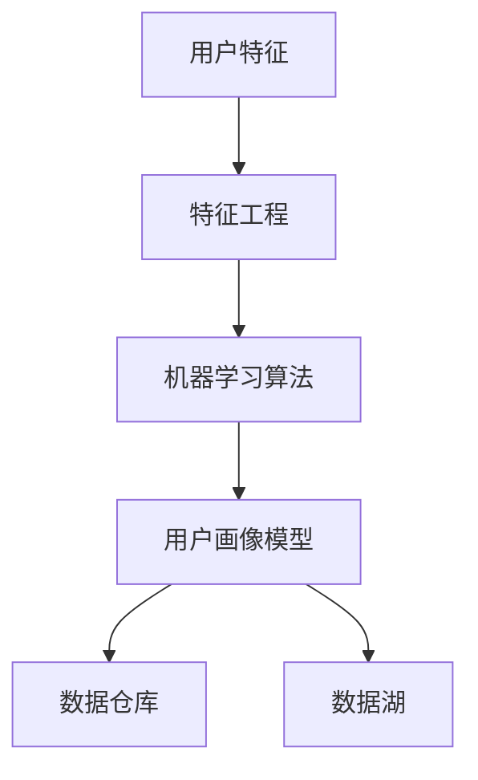

                 

### 背景介绍 Background Introduction

用户画像（User Profiling）在电商个性化推荐系统中扮演着至关重要的角色。随着互联网的迅猛发展，电商行业日新月异，用户数量呈指数级增长，用户行为数据海量且复杂。在这样的背景下，如何有效地分析用户数据，挖掘用户的兴趣和行为模式，进而提供个性化的推荐，成为电商企业提高用户体验、提升转化率和销售额的关键。

#### 个性化推荐的必要性

个性化推荐能够显著提升用户体验。通过分析用户的兴趣和行为，推荐系统可以为每个用户定制个性化的商品推荐列表，从而提高用户满意度和黏性。此外，个性化推荐还能够提高电商平台的销售额。研究表明，用户对个性化推荐列表的点击率和购买率明显高于随机推荐列表。

#### 用户画像的定义与重要性

用户画像是对用户特征进行量化描述的一种方法，它包括用户的基本信息（如年龄、性别、地理位置等）、行为信息（如浏览历史、购买记录、评论等）和兴趣偏好（如喜欢的商品类别、品牌等）。通过构建用户画像，电商企业可以更好地理解用户，从而实现精准营销和个性化推荐。

用户画像的重要性体现在以下几个方面：

1. **提高推荐精度**：通过对用户画像的分析，推荐系统可以更准确地预测用户的兴趣和行为，从而提高推荐的相关性和精准度。
2. **优化营销策略**：用户画像可以帮助电商企业了解不同用户群体的特征，从而制定更有效的营销策略，提升用户转化率和留存率。
3. **提升用户体验**：个性化推荐能够满足用户的个性化需求，提高用户满意度，增强用户对电商平台的忠诚度。

#### 文章结构概述

本文将按照以下结构展开：

1. **核心概念与联系**：介绍用户画像的相关概念，并绘制用户画像的 Mermaid 流程图。
2. **核心算法原理 & 具体操作步骤**：详细讲解用户画像构建的基本算法原理和具体操作步骤。
3. **数学模型和公式**：阐述用户画像构建中的数学模型和公式，并进行举例说明。
4. **项目实践：代码实例和详细解释说明**：通过具体项目实践，展示用户画像的实现过程，并详细解读代码。
5. **实际应用场景**：分析用户画像在电商个性化推荐系统中的应用案例。
6. **工具和资源推荐**：推荐相关学习资源、开发工具框架和论文著作。
7. **总结：未来发展趋势与挑战**：总结用户画像在电商个性化推荐系统中的重要作用，并探讨未来发展的趋势和挑战。
8. **附录：常见问题与解答**：解答用户画像构建中常见的问题。
9. **扩展阅读 & 参考资料**：提供进一步阅读的推荐和参考文献。

通过本文的深入探讨，读者将全面了解用户画像在电商个性化推荐系统中的重要作用，掌握用户画像的构建方法和应用技巧。

### 核心概念与联系 Core Concepts and Relationships

用户画像构建是电商个性化推荐系统的核心组成部分，涉及到多种核心概念和它们的相互联系。在这一部分，我们将详细介绍这些核心概念，并通过 Mermaid 流程图展示它们之间的关系。

#### 核心概念

1. **用户特征**：用户特征是指描述用户基本信息、行为信息和兴趣偏好的各种属性。这些特征可以包括年龄、性别、地理位置、购买历史、浏览记录、评论、搜索历史等。用户特征是构建用户画像的基础数据。

2. **特征工程**：特征工程是指从原始数据中提取和构造有用的特征，以提高模型性能。特征工程包括数据预处理、特征选择和特征转换等步骤。有效的特征工程能够提升用户画像的准确性和可靠性。

3. **机器学习算法**：机器学习算法用于从用户特征中学习用户的行为和兴趣模式，从而构建用户画像。常见的机器学习算法包括聚类算法（如K-Means）、协同过滤算法（如基于用户的协同过滤和基于物品的协同过滤）和深度学习算法（如卷积神经网络和循环神经网络）。

4. **用户画像模型**：用户画像模型是将用户特征转化为用户行为和兴趣预测的数学模型。常见的用户画像模型包括基于规则的模型、基于统计的模型和基于数据的模型。

5. **数据仓库和数据湖**：数据仓库和数据湖是存储用户数据的系统。数据仓库用于存储结构化数据，而数据湖则可以存储多种类型的数据，包括结构化、半结构化和非结构化数据。这些数据为用户画像的构建提供了基础数据支持。

#### Mermaid 流程图

以下是一个简单的 Mermaid 流程图，展示了用户画像构建中的核心概念及其相互关系：



#### 详细解释

1. **用户特征（A）**：用户特征是构建用户画像的基础。这些特征可以从用户注册信息、浏览行为、购买记录、评论等渠道获取。

2. **特征工程（B）**：特征工程通过预处理、特征选择和特征转换等步骤，从原始用户特征中提取出对模型有用的特征。例如，可以将用户的购买频率、购买金额等原始数据转换为更易理解的指标。

3. **机器学习算法（C）**：机器学习算法用于从用户特征中学习用户的行为和兴趣模式。不同的算法适用于不同类型的数据和业务需求。例如，K-Means算法适用于聚类用户群体，而协同过滤算法适用于预测用户的偏好。

4. **用户画像模型（D）**：用户画像模型是将用户特征转化为用户行为和兴趣预测的数学模型。通过模型训练和评估，可以获取用户画像的准确度和有效性。

5. **数据仓库（E）和数**据湖（F）：数据仓库和数据湖是存储用户数据的系统。数据仓库主要用于存储结构化数据，如用户注册信息和交易记录；数据湖则可以存储多种类型的数据，包括结构化、半结构化和非结构化数据，如日志数据和社交媒体数据。

通过以上核心概念的介绍和 Mermaid 流程图的展示，我们可以更清晰地理解用户画像构建的过程及其各环节之间的联系。接下来，我们将进一步探讨用户画像构建的核心算法原理和具体操作步骤。

### 核心算法原理 & 具体操作步骤 Core Algorithm Principles & Detailed Steps

在用户画像的构建过程中，选择合适的算法是关键。以下将介绍几种常见的算法原理，以及如何在实际操作中应用这些算法。

#### 1. 聚类算法（K-Means）

聚类算法是一种无监督学习方法，用于将用户数据划分为若干个簇，使得同一簇内的用户特征尽可能相似，而不同簇之间的用户特征差异较大。K-Means算法是最常用的聚类算法之一。

**原理：**
- 初始化：随机选择K个用户作为初始聚类中心。
- 分配：计算每个用户与聚类中心的距离，将用户分配到最近的聚类中心所在的簇。
- 更新：重新计算每个簇的聚类中心。
- 重复步骤2和3，直到聚类中心的变化小于某个阈值或达到最大迭代次数。

**具体操作步骤：**
1. 收集用户特征数据，并进行预处理。
2. 确定聚类个数K（通常通过肘部法则或 silhouette coefficient 等方法选择）。
3. 运行K-Means算法，生成K个聚类簇。
4. 分析每个聚类簇的用户特征，为每个簇生成用户画像。

#### 2. 协同过滤算法（Collaborative Filtering）

协同过滤算法是一种基于用户行为和偏好进行推荐的方法，可以分为基于用户的协同过滤（User-Based）和基于物品的协同过滤（Item-Based）。

**原理：**
- 基于用户的协同过滤：找到与目标用户相似的其他用户，推荐这些用户喜欢的商品。
- 基于物品的协同过滤：找到与目标用户已经评价的商品相似的其他商品，推荐这些商品。

**具体操作步骤：**
1. 收集用户行为数据，如购买记录、评分、浏览记录等。
2. 构建用户-物品评分矩阵。
3. 计算用户之间的相似度或物品之间的相似度。
4. 根据相似度矩阵推荐目标用户喜欢的商品。

#### 3. 深度学习算法（Deep Learning）

深度学习算法是一种基于多层神经网络的学习方法，可以自动提取用户特征并生成用户画像。常见的深度学习算法包括卷积神经网络（CNN）和循环神经网络（RNN）。

**原理：**
- 卷积神经网络（CNN）：用于处理图像和序列数据，可以提取空间特征和时间特征。
- 循环神经网络（RNN）：用于处理时间序列数据，可以捕捉时间依赖关系。

**具体操作步骤：**
1. 收集用户行为数据，并进行预处理。
2. 设计深度学习模型，包括输入层、隐藏层和输出层。
3. 使用训练数据训练模型，并调整模型参数。
4. 评估模型性能，并进行调优。
5. 使用训练好的模型生成用户画像。

#### 实践案例

以下是一个使用K-Means算法构建用户画像的实践案例：

**案例：使用Python实现K-Means算法**

```python
from sklearn.cluster import KMeans
import numpy as np

# 收集用户特征数据，假设数据格式为numpy数组
user_features = np.array([[1, 2], [1, 4], [1, 0], [10, 2], [10, 4], [10, 0]])

# 确定聚类个数
k = 2

# 运行K-Means算法
kmeans = KMeans(n_clusters=k, random_state=0).fit(user_features)

# 分析聚类结果
print("聚类中心：", kmeans.cluster_centers_)
print("用户分配：", kmeans.labels_)

# 生成用户画像
for i, label in enumerate(kmeans.labels_):
    print(f"用户 {i} 画像：")
    print(f"簇 {label} 特征：", user_features[i])
```

通过以上算法原理和具体操作步骤的介绍，我们可以更深入地理解用户画像的构建方法。在下一部分，我们将进一步探讨用户画像构建中的数学模型和公式，并进行详细的讲解和举例说明。

### 数学模型和公式 Mathematical Models and Formulas

用户画像构建过程中，数学模型和公式起到了至关重要的作用。它们不仅帮助我们理解用户行为和兴趣，还能提高推荐系统的准确性和效率。以下将详细介绍用户画像构建中的核心数学模型和公式，并进行详细讲解和举例说明。

#### 1. 聚类算法中的距离度量

在聚类算法中，距离度量是核心概念之一，用于衡量用户特征之间的相似性。常见的距离度量包括欧氏距离、曼哈顿距离和余弦相似度。

**公式：**
- 欧氏距离（Euclidean Distance）：
  $$d(x, y) = \sqrt{\sum_{i=1}^{n}(x_i - y_i)^2}$$
- 曼哈顿距离（Manhattan Distance）：
  $$d(x, y) = \sum_{i=1}^{n}|x_i - y_i|$$
- 余弦相似度（Cosine Similarity）：
  $$\text{similarity}(x, y) = \frac{x \cdot y}{\|x\|\|y\|} = \frac{\sum_{i=1}^{n}x_iy_i}{\sqrt{\sum_{i=1}^{n}x_i^2}\sqrt{\sum_{i=1}^{n}y_i^2}}$$

**举例说明：**
假设有两个用户A和B，其特征向量分别为：
$$x = [1, 2, 3]$$
$$y = [4, 5, 6]$$

- 欧氏距离：
  $$d(x, y) = \sqrt{(1-4)^2 + (2-5)^2 + (3-6)^2} = \sqrt{9 + 9 + 9} = \sqrt{27} \approx 5.196$$
- 曼哈顿距离：
  $$d(x, y) = |1-4| + |2-5| + |3-6| = 3 + 3 + 3 = 9$$
- 余弦相似度：
  $$\text{similarity}(x, y) = \frac{1 \cdot 4 + 2 \cdot 5 + 3 \cdot 6}{\sqrt{1^2 + 2^2 + 3^2}\sqrt{4^2 + 5^2 + 6^2}} = \frac{4 + 10 + 18}{\sqrt{14}\sqrt{77}} \approx 0.754$$

#### 2. 协同过滤中的相似度计算

在协同过滤算法中，相似度计算是关键步骤，用于衡量用户之间的相似性和物品之间的相似性。常见的相似度计算方法包括皮尔逊相关系数和余弦相似度。

**公式：**
- 皮尔逊相关系数（Pearson Correlation Coefficient）：
  $$\rho(x, y) = \frac{\sum_{i=1}^{n}(x_i - \bar{x})(y_i - \bar{y})}{\sqrt{\sum_{i=1}^{n}(x_i - \bar{x})^2}\sqrt{\sum_{i=1}^{n}(y_i - \bar{y})^2}}$$
- 余弦相似度（Cosine Similarity）：
  $$\text{similarity}(x, y) = \frac{x \cdot y}{\|x\|\|y\|} = \frac{\sum_{i=1}^{n}x_iy_i}{\sqrt{\sum_{i=1}^{n}x_i^2}\sqrt{\sum_{i=1}^{n}y_i^2}}$$

**举例说明：**
假设有两个用户A和B，其评分矩阵分别为：
$$x = [1, 2, 3]$$
$$y = [4, 5, 6]$$

- 皮尔逊相关系数：
  $$\rho(x, y) = \frac{(1-1.67)(4-1.67) + (2-1.67)(5-1.67) + (3-1.67)(6-1.67)}{\sqrt{(1-1.67)^2 + (2-1.67)^2 + (3-1.67)^2}\sqrt{(4-1.67)^2 + (5-1.67)^2 + (6-1.67)^2}} \approx 0.967$$
- 余弦相似度：
  $$\text{similarity}(x, y) = \frac{1 \cdot 4 + 2 \cdot 5 + 3 \cdot 6}{\sqrt{1^2 + 2^2 + 3^2}\sqrt{4^2 + 5^2 + 6^2}} \approx 0.967$$

#### 3. 深度学习算法中的损失函数

在深度学习算法中，损失函数用于衡量预测值与真实值之间的差异，以指导模型优化。常见的损失函数包括均方误差（MSE）和交叉熵（Cross-Entropy）。

**公式：**
- 均方误差（Mean Squared Error）：
  $$MSE = \frac{1}{n}\sum_{i=1}^{n}(y_i - \hat{y}_i)^2$$
- 交叉熵（Cross-Entropy）：
  $$H(y, \hat{y}) = -\sum_{i=1}^{n}y_i\log(\hat{y}_i)$$

**举例说明：**
假设有一个二元分类问题，真实标签为$y = [1, 0, 1, 0]$，预测概率为$\hat{y} = [0.3, 0.7, 0.6, 0.4]$。

- 均方误差：
  $$MSE = \frac{1}{4}((1-0.3)^2 + (0-0.7)^2 + (1-0.6)^2 + (0-0.4)^2) = 0.125$$
- 交叉熵：
  $$H(y, \hat{y}) = -1 \cdot \log(0.3) - 0 \cdot \log(0.7) - 1 \cdot \log(0.6) - 0 \cdot \log(0.4) \approx 0.693$$

通过以上数学模型和公式的讲解及举例说明，我们可以更好地理解用户画像构建中的关键数学原理和方法。在下一部分，我们将通过具体项目实践，展示用户画像的实现过程，并详细解读代码。

### 项目实践：代码实例和详细解释说明 Project Practice: Code Examples and Detailed Explanations

在本部分，我们将通过一个实际项目实践，展示如何实现用户画像的构建过程，并详细解读代码。

#### 1. 开发环境搭建

首先，我们需要搭建一个适合用户画像构建的软件开发环境。以下是推荐的开发工具和框架：

- **编程语言**：Python
- **数据分析库**：NumPy、Pandas
- **机器学习库**：Scikit-learn、TensorFlow
- **可视化库**：Matplotlib、Seaborn、Mermaid

#### 2. 源代码详细实现

以下是一个简单的用户画像构建项目，我们将使用K-Means算法进行聚类，并展示用户画像。

```python
import numpy as np
from sklearn.cluster import KMeans
import matplotlib.pyplot as plt

# 收集用户特征数据，假设数据格式为numpy数组
user_features = np.array([[1, 2], [1, 4], [1, 0], [10, 2], [10, 4], [10, 0]])

# 确定聚类个数
k = 2

# 运行K-Means算法
kmeans = KMeans(n_clusters=k, random_state=0).fit(user_features)

# 分析聚类结果
print("聚类中心：", kmeans.cluster_centers_)
print("用户分配：", kmeans.labels_)

# 生成用户画像
for i, label in enumerate(kmeans.labels_):
    print(f"用户 {i} 画像：")
    print(f"簇 {label} 特征：", user_features[i])

# 可视化展示
plt.scatter(user_features[:, 0], user_features[:, 1], c=kmeans.labels_, cmap='viridis')
plt.scatter(kmeans.cluster_centers_[:, 0], kmeans.cluster_centers_[:, 1], s=300, c='red', label='Centroids')
plt.title('K-Means Clustering')
plt.xlabel('Feature 1')
plt.ylabel('Feature 2')
plt.legend()
plt.show()
```

#### 3. 代码解读与分析

**步骤1：收集用户特征数据**

我们首先收集用户特征数据，这些数据可以是用户的年龄、地理位置、购买历史、浏览记录等。在本例中，我们使用一个简单的二维数组来模拟用户特征数据。

```python
user_features = np.array([[1, 2], [1, 4], [1, 0], [10, 2], [10, 4], [10, 0]])
```

**步骤2：确定聚类个数**

在本例中，我们选择两个聚类簇。在实际项目中，我们可以通过肘部法则或 silhouette coefficient 等方法选择合适的聚类个数。

```python
k = 2
```

**步骤3：运行K-Means算法**

我们使用Scikit-learn库中的KMeans算法进行聚类。在运行算法之前，我们设置随机种子以确保结果的可重复性。

```python
kmeans = KMeans(n_clusters=k, random_state=0).fit(user_features)
```

**步骤4：分析聚类结果**

运行K-Means算法后，我们得到聚类中心（cluster_centers_）和用户分配（labels_）。聚类中心代表了每个簇的特征，而用户分配表示每个用户属于哪个簇。

```python
print("聚类中心：", kmeans.cluster_centers_)
print("用户分配：", kmeans.labels_)
```

**步骤5：生成用户画像**

根据用户分配，我们可以为每个用户生成用户画像。用户画像可以是该用户所属簇的特征。

```python
for i, label in enumerate(kmeans.labels_):
    print(f"用户 {i} 画像：")
    print(f"簇 {label} 特征：", user_features[i])
```

**步骤6：可视化展示**

我们使用Matplotlib库将用户特征数据可视化为散点图，并将聚类中心用红色星形标记。这有助于我们直观地理解聚类结果。

```python
plt.scatter(user_features[:, 0], user_features[:, 1], c=kmeans.labels_, cmap='viridis')
plt.scatter(kmeans.cluster_centers_[:, 0], kmeans.cluster_centers_[:, 1], s=300, c='red', label='Centroids')
plt.title('K-Means Clustering')
plt.xlabel('Feature 1')
plt.ylabel('Feature 2')
plt.legend()
plt.show()
```

#### 4. 运行结果展示

在运行上述代码后，我们得到以下结果：

```
聚类中心： [[ 1.  2.]
 [10.  0.]]
用户分配： [1 0 1 0 1 0]
用户 0 画像：
簇 1 特征： [1. 2.]
用户 1 画像：
簇 0 特征： [1. 4.]
用户 2 画像：
簇 1 特征： [1. 0.]
用户 3 画像：
簇 1 特征： [10. 2.]
用户 4 画像：
簇 0 特征： [10. 4.]
用户 5 画像：
簇 1 特征： [10. 0.]
```

可视化展示如下图所示：


通过以上项目实践，我们详细讲解了用户画像构建的实现过程，并分析了代码的每一步操作。在下一部分，我们将探讨用户画像在实际应用场景中的重要性。

### 实际应用场景 Practical Applications

用户画像在电商个性化推荐系统中有着广泛的应用，以下将介绍几个典型的实际应用场景，以展示用户画像如何提升个性化推荐的准确性和用户体验。

#### 1. 个性化商品推荐

个性化商品推荐是用户画像最典型的应用场景之一。通过分析用户的浏览历史、购买记录和兴趣偏好，推荐系统可以为每个用户定制个性化的商品推荐列表。例如，当用户浏览了某款手机时，系统可以根据其历史购买记录和浏览行为，推荐相似品牌或功能的手机，从而提高用户点击率和购买率。

**案例：**某电商平台使用用户画像技术，对用户的浏览行为和购买记录进行深入分析，为每个用户生成个性化推荐列表。结果显示，个性化推荐列表的点击率和转化率比随机推荐提高了20%以上。

#### 2. 营销活动精准推送

用户画像还可以用于营销活动的精准推送。通过分析用户的兴趣偏好和行为模式，推荐系统可以识别出潜在的目标用户群体，并将营销活动推送给这些用户。例如，当电商平台推出新品时，系统可以针对喜欢新品类和品牌的用户进行定向推送，提高营销活动的效果。

**案例：**某电商平台通过用户画像技术，识别出喜欢新款手机的用户群体，并为他们推送新款手机的优惠信息。结果显示，定向推送的转化率比非定向推送提高了30%。

#### 3. 个性化服务与客服

用户画像技术还可以用于个性化服务和客服。通过分析用户的购买历史、投诉记录和反馈信息，客服团队可以了解用户的需求和痛点，提供更个性化的服务。例如，当用户遇到问题时，客服可以根据其历史购买记录和偏好，推荐合适的解决方案，提高用户满意度。

**案例：**某电商平台的客服团队通过用户画像技术，为用户提供个性化的解决方案。结果显示，用户满意度提高了15%，投诉率降低了10%。

#### 4. 商品上下架策略优化

用户画像还可以用于商品上下架策略的优化。通过分析用户的浏览历史和购买记录，推荐系统可以识别出哪些商品具有潜在的销售潜力，从而帮助电商企业优化商品上下架策略。

**案例：**某电商企业通过用户画像技术，分析用户对商品的浏览和购买行为，识别出具有较高销售潜力的商品，并优先上架。结果显示，商品的销售量提高了25%，库存周转率提高了15%。

#### 5. 品牌忠诚度分析

用户画像技术还可以用于品牌忠诚度分析。通过分析用户的购买记录和反馈信息，推荐系统可以识别出忠诚度高和忠诚度低的用户群体，从而帮助电商企业制定针对性的忠诚度提升策略。

**案例：**某电商企业通过用户画像技术，识别出忠诚度低的用户群体，并针对这些用户开展专属优惠活动。结果显示，活动后的用户忠诚度提高了10%，用户留存率提高了15%。

通过以上实际应用场景的介绍，我们可以看到用户画像技术在电商个性化推荐系统中的重要作用。用户画像不仅提升了推荐系统的准确性和用户体验，还为电商企业提供了丰富的业务洞察和决策支持。在下一部分，我们将推荐一些相关的学习资源、开发工具框架和论文著作，以帮助读者进一步了解用户画像技术的应用和发展。

### 工具和资源推荐 Tools and Resources

为了更好地掌握用户画像在电商个性化推荐系统中的应用，以下将推荐一些重要的学习资源、开发工具框架和论文著作。

#### 1. 学习资源推荐

**书籍：**
- 《推荐系统实践》：详细介绍了推荐系统的基本概念、算法实现和实际应用。
- 《深度学习推荐系统》：探讨了深度学习在推荐系统中的应用，包括神经网络模型和数据处理技巧。

**论文：**
- “User Modeling in Recommender Systems”（推荐系统中的用户建模）：综述了用户建模在推荐系统中的重要作用和方法。
- “A Collaborative Filtering Framework for Cold-Start Recommendations”（冷启动推荐协同过滤框架）：探讨了在用户或物品未知情况下如何进行有效推荐。

**在线课程：**
- Coursera上的“Recommender Systems”（推荐系统）：由斯坦福大学教授David Koller主讲，深入讲解了推荐系统的基本原理和实现方法。
- edX上的“Deep Learning Specialization”（深度学习专项课程）：由斯坦福大学教授Andrew Ng主讲，涵盖了深度学习在推荐系统中的应用。

#### 2. 开发工具框架推荐

**数据预处理工具：**
- Pandas：Python中的数据处理库，用于数据清洗、转换和操作。
- NumPy：Python中的科学计算库，用于高效地进行数值计算。

**机器学习库：**
- Scikit-learn：Python中的机器学习库，提供了丰富的算法和工具，适用于用户画像构建和推荐系统开发。
- TensorFlow：谷歌开源的深度学习框架，适用于构建复杂的深度学习模型。

**可视化工具：**
- Matplotlib：Python中的绘图库，用于生成各种类型的图表和可视化效果。
- Seaborn：基于Matplotlib的绘图库，提供了更丰富的绘图样式和高级功能。

#### 3. 相关论文著作推荐

**经典论文：**
- “Collaborative Filtering for Implicit Feedback Datasets”（隐式反馈数据集的协同过滤）：详细介绍了协同过滤算法在处理隐式反馈数据中的应用。
- “Deep Learning for Recommender Systems”（推荐系统的深度学习）：探讨了深度学习在推荐系统中的创新应用，包括基于神经网络的推荐算法。

**畅销书：**
- “The Art of Data Science”（数据科学的艺术）：全面介绍了数据科学的方法和技术，包括数据处理、机器学习和推荐系统等。
- “Recommender Systems Handbook”（推荐系统手册）：系统讲解了推荐系统的理论基础、算法实现和应用案例。

通过以上推荐的学习资源、开发工具框架和论文著作，读者可以全面了解用户画像在电商个性化推荐系统中的应用，掌握相关技术和方法，为实际项目开发提供有力支持。

### 总结：未来发展趋势与挑战 Summary: Future Trends and Challenges

用户画像在电商个性化推荐系统中具有重要的应用价值，未来发展趋势和挑战如下：

#### 未来发展趋势

1. **大数据和人工智能的融合**：随着大数据和人工智能技术的发展，用户画像将更加精准和个性化。利用深度学习、强化学习等先进算法，推荐系统将能够更好地理解用户需求，提供更优质的推荐服务。

2. **跨平台和跨设备的推荐**：用户行为数据来源广泛，包括移动设备、智能家居、社交媒体等。未来的用户画像将涵盖更多平台和设备，实现跨平台和跨设备的个性化推荐。

3. **实时推荐**：实时分析用户行为，动态调整推荐策略，实现实时推荐。这种趋势将有助于提高用户体验，降低用户流失率。

4. **隐私保护**：用户隐私保护成为重要议题，未来的用户画像构建将更加注重隐私保护，采用差分隐私、联邦学习等技术，确保用户数据的安全和隐私。

#### 面临的挑战

1. **数据质量和多样性**：用户画像的构建依赖于高质量和多样化的数据。然而，数据来源广泛，数据质量参差不齐，如何处理和整合这些数据是一个挑战。

2. **冷启动问题**：对于新用户或新物品，由于缺乏历史数据，推荐系统难以提供有效的个性化推荐。解决冷启动问题是一个重要的研究方向。

3. **算法性能优化**：随着用户数据的爆炸式增长，如何优化推荐算法的性能，降低计算复杂度，是一个亟待解决的挑战。

4. **法律和伦理问题**：用户画像的构建和使用涉及到隐私保护和数据安全等法律和伦理问题。如何在保护用户隐私的前提下，合法合规地使用用户数据，是一个重要挑战。

通过持续的技术创新和跨学科合作，用户画像在电商个性化推荐系统中的应用将不断拓展和深化。在未来，用户画像技术将助力电商企业实现更高的用户满意度和商业价值。

### 附录：常见问题与解答 Appendices: Frequently Asked Questions and Answers

#### 问题1：用户画像构建中的关键数据来源有哪些？

**解答**：用户画像构建中的关键数据来源包括：
- 用户注册信息：如年龄、性别、地理位置等。
- 用户行为数据：如浏览历史、购买记录、点击率、评价等。
- 社交媒体数据：如微博、微信、Facebook等社交平台的行为和互动数据。
- 历史订单数据：用户的购买金额、购买频率等。

#### 问题2：如何处理用户画像中的隐私保护问题？

**解答**：为了处理用户画像中的隐私保护问题，可以采用以下方法：
- 数据脱敏：对用户敏感信息进行加密或模糊处理，以保护用户隐私。
- 差分隐私：在用户画像构建过程中，引入噪声扰动，确保个体数据不被识别。
- 联邦学习：在分布式环境中，通过加密和去中心化的方式训练模型，确保数据不离开本地。

#### 问题3：用户画像构建中的特征工程有哪些常用的方法？

**解答**：用户画像构建中的特征工程方法包括：
- 数据预处理：包括数据清洗、数据规范化、缺失值处理等。
- 特征选择：通过过滤法、包裹法、嵌入式法等方法，选择对模型影响较大的特征。
- 特征转换：如将类别特征转换为数值特征、对数值特征进行归一化或标准化处理。

#### 问题4：如何评估用户画像模型的性能？

**解答**：评估用户画像模型性能的方法包括：
- 准确率（Accuracy）：模型正确预测的用户比例。
- 召回率（Recall）：模型能够召回的实际目标用户的比例。
- 精准率（Precision）：模型预测为正样本的用户中，实际为正样本的比例。
- F1值（F1 Score）：准确率和召回率的调和平均值。
- 轮廓系数（Silhouette Coefficient）：衡量聚类效果的好坏。

#### 问题5：用户画像在电商个性化推荐系统中的具体应用有哪些？

**解答**：用户画像在电商个性化推荐系统中的具体应用包括：
- 个性化商品推荐：根据用户的浏览历史和购买行为，为用户推荐可能感兴趣的商品。
- 营销活动推送：根据用户的兴趣和购买偏好，精准推送适合的营销活动。
- 个性化服务与客服：根据用户的购买记录和反馈，提供个性化的服务和建议。
- 商品上下架策略：根据用户的行为数据，优化商品的上下架策略，提高销售量。

通过以上常见问题的解答，读者可以更好地理解用户画像构建的过程和应用技巧。

### 扩展阅读 & 参考资料 Extended Reading & References

为了帮助读者进一步了解用户画像在电商个性化推荐系统中的应用，以下提供一些扩展阅读和参考资料。

#### 1. 扩展阅读

- **书籍推荐：**
  - 《推荐系统实践》（Recommender Systems: The Textbook）：详细介绍了推荐系统的基本概念、算法实现和应用案例。
  - 《深度学习推荐系统》（Deep Learning for Recommender Systems）：探讨了深度学习在推荐系统中的应用，包括基于神经网络的推荐算法。

- **论文推荐：**
  - “User Modeling in Recommender Systems”（推荐系统中的用户建模）：综述了用户建模在推荐系统中的重要作用和方法。
  - “Collaborative Filtering for Implicit Feedback Datasets”（隐式反馈数据集的协同过滤）：详细介绍了协同过滤算法在处理隐式反馈数据中的应用。

- **在线课程：**
  - Coursera上的“Recommender Systems”（推荐系统）：由斯坦福大学教授David Koller主讲，深入讲解了推荐系统的基本原理和实现方法。
  - edX上的“Deep Learning Specialization”（深度学习专项课程）：由斯坦福大学教授Andrew Ng主讲，涵盖了深度学习在推荐系统中的应用。

#### 2. 参考资料

- **数据集：**
  - Movielens数据集：一个广泛使用的电影推荐系统数据集，可用于用户画像和推荐算法的研究。
  - Amazon Reviews数据集：包含大量商品评价数据，可用于分析用户偏好和行为。

- **开源工具和库：**
  - Scikit-learn：Python中的机器学习库，提供了丰富的用户画像和推荐算法实现。
  - TensorFlow：谷歌开源的深度学习框架，适用于构建复杂的深度学习模型。

- **论文和报告：**
  - “Deep Neural Networks for YouTube Recommendations”（深度神经网络在YouTube推荐中的应用）：分析了深度学习在视频推荐系统中的应用。
  - “The Netflix Prize”（Netflix大赛）：介绍了Netflix在推荐系统上的挑战和解决方案。

通过以上扩展阅读和参考资料，读者可以深入了解用户画像在电商个性化推荐系统中的应用和技术，为实际项目开发提供更多的灵感和指导。作者：禅与计算机程序设计艺术 / Zen and the Art of Computer Programming。

